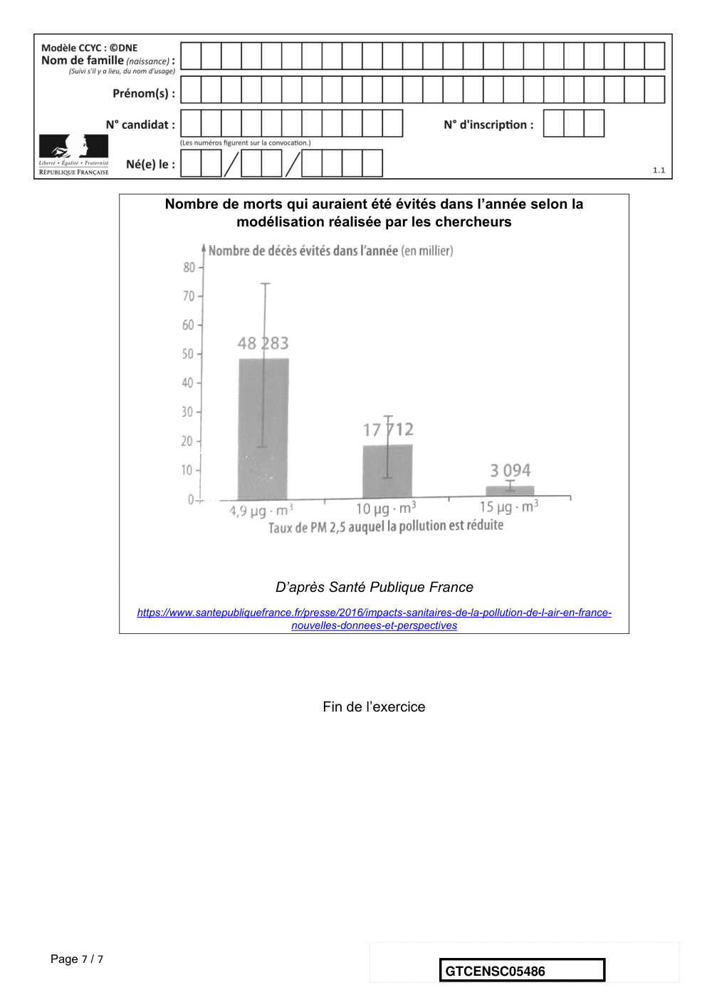

# e3c-enseignement-scientifique-terminale-05486-sujet-officiel

> Source : `../../../../pdf_version/02_es_ponctuelle/e3c/2021/e3c-enseignement-scientifique-terminale-05486-sujet-officiel.pdf` — conversion Markdown (texte + visuels utiles).
> Stratégie : [STRATEGIE_MARKDOWN.md](../../../../STRATEGIE_MARKDOWN.md)

---

## Page 1

ÉVALUATIONS COMMUNES

       CLASSE :

       EC : ☐ EC1 ☐ EC2 ☒ EC3

        VOIE : ☒ Générale ☐ Technologique ☐ Toutes voies (LV)

       ENSEIGNEMENT : Enseignement scientifique
       DURÉE DE L’ÉPREUVE : --2h--
       Niveaux visés (LV) : LVA                LVB

       CALCULATRICE AUTORISÉE : ☒Oui ☐ Non

       DICTIONNAIRE AUTORISÉ :            ☐Oui ☒ Non

        ☐ Ce sujet contient des parties à rendre par le candidat avec sa copie. De ce fait, il ne peut être
        dupliqué et doit être imprimé pour chaque candidat afin d’assurer ensuite sa bonne numérisation.

        ☐ Ce sujet intègre des éléments en couleur. S’il est choisi par l’équipe pédagogique, il est
        nécessaire que chaque élève dispose d’une impression en couleur.

        ☐ Ce sujet contient des pièces jointes de type audio ou vidéo qu’il faudra télécharger et jouer le
        jour de l’épreuve.
        Nombre total de pages : 7

Page 1 / 7
                                                                            GTCENSC05486

---

## Page 2

Exercice 1 : L’empreinte carbone des appareils
             électroménagers
             Sur 10 points

             Pour établir l’empreinte carbone de ces appareils, les scientifiques ont utilisé
             des données concernant à la fois la production des matières premières
             servant à leur fabrication mais aussi leur collecte et leur recyclage, lors de leur
             fin de vie.
             Document 1 : empreinte carbone de quelques appareils domestiques
             électroménagers.

             Source : J. Lhotellier, E. Less, E. Bossanne, S. Pesnel. (2018). Modélisation et évaluation
             ACV de produits de consommation et biens d’équipement. Rapport de l’ADEME. Document
             modifié.

             1- Donner la définition de l’empreinte carbone d'une activité.
             2- À partir du document 1, citer les deux plus importantes contributions au
             réchauffement climatique d’un appareil électroménager au cours de son cycle
             de vie.
             3- À partir du document 1, citer la contribution du cycle de vie d’un appareil
             électroménager qui diminue son empreinte carbone. Justifier la réponse.

Page 2 / 7
                                                                          GTCENSC05486

---

## Page 3

Document 2 : projection de l’évolution des ventes de produits de gros
             électroménagers et de l’évolution du nombre de leurs réparations dans
             les prochaines années en France.

             Source : Benoît TINETTI, Anton BERWALD, Victoire SENLIS. (2018). État des lieux de
             l’activité de réparation des appareils électroménagers dans sa relation au produit et à la filière.
             Rapport final, phase 2. GIFAM, ADEME.

             4. À partir du document 2, montrer que le taux de variation des ventes de
             produits de gros électroménagers est de + 1,32 % entre 2016 et 2025, et que
             celui du nombre de réparations est de – 21,4 %.

             Document 3 : extrait d’un rapport d’enquête sur les enjeux et solutions
             en matière de durabilité́ d’un lave-linge.
             « Sachant qu’un lave-linge pèse en moyenne 70 kg, comment expliquer qu’il
             faille 2 tonnes de matières mobilisées ? Un lave-linge contient en moyenne
             1,4 kg de cuivre par exemple. C’est une ressource rare et difficile à extraire. Il
             faut compter 8 tonnes de roches déplacées pour obtenir un seul kilo de cuivre.
             Cette ressource pèse donc en fait lourd sur son bilan écologique.
             Plus la vie d’un lave-linge sera longue, plus son impact écologique sera réduit
             car cela évite tout simplement la production d’un appareil neuf. »
             Source : Association HOP. (septembre 2019). Rapport d’enquête sur les enjeux et solutions
             en matière de durabilité des lave-linge

      5. À partir de l’ensemble des documents et des taux de variation précédents,
      expliquer si l’évolution du nombre de réparations permet d’envisager un abaissement
      de l’empreinte carbone liée aux appareils de gros électroménagers.
      6. À partir de vos connaissances et des documents 1 et 3, proposer des
      comportements permettant de minimiser l’empreinte carbone d’un lave-linge.
                                                    Fin de l’exercice

Page 3 / 7
                                                                            GTCENSC05486

---

## Page 4

Exercice 2 : Les impacts de la combustion sur
              l’environnement et la santé
              Sur 10 points
              La combustion de carburants fossiles et de la biomasse libère du dioxyde de
              carbone qui a un impact environnemental majeur.
              Il est également reconnu par l’Organisation mondiale de la santé (OMS) que la
              santé publique est impactée par la pollution de l’air. Le Ministère des
              Solidarités et de la Santé estime qu’environ 48 000 personnes décèdent
              chaque année des effets de la pollution de l’air en France.
              On se propose d’étudier la part et les impacts de la combustion de carburants
              fossiles et de biomasse sur la santé humaine.

       Document 1 : production de dioxyde de carbone lors de la combustion de carburants
       fossiles et de la biomasse

             Combustible                                         Equation de la réaction
     Gaz naturel méthane CH4                                   CH4 + 2 O2 → CO2 + 2 H2O
 Essence modélisée par l’octane                           2 C8H18 + 25 O2 → 16 CO2 +18 H2O
           C8H18
        Biomasse (bois)                                    C6H10O5 + 6 O2 → 6 CO2 + 5 H2O
      modélisée par C6H10O5
Énergie massique libérée par kg de combustible brûlé :
             Combustible                       Gaz naturel              Essence                  Biomasse

    Energie massique libérée                   50 MJ.kg-1              45 MJ.kg-1                17 MJ.kg-1

Masse de CO2 produite pour 1 MJ d’énergie obtenue :
         Combustible               Gaz naturel                          Essence                 Biomasse

      Masse de CO2 produite                        56 g               À calculer en                 95 g
                                                                       question 5

       D’après J.- C Guibet, Publications de l’Institut français du pétrole,1997 et W. - M. Haynes, CRC Handbook of
       Chemistry and Physics,2012.

Page 4 / 7
                                                                           GTCENSC05486

---

## Page 5

1- Indiquer le (ou les) combustible(s) mentionnés dans le document 1 pouvant être
             utilisés comme source(s) d’énergie renouvelable.

             2- Calculer la masse d’essence, notée 𝑚𝑒𝑠𝑠𝑒𝑛𝑐𝑒 , nécessaire pour obtenir une
             énergie de valeur 1 MJ.

             3- Sachant que la masse d’une mole d’essence est égale à 114 𝑔, vérifier que la
             quantité de matière, notée 𝑛𝑒𝑠𝑠𝑒𝑛𝑐𝑒 , présente dans la masse d’essence nécessaire
             pour obtenir une énergie de valeur 1 MJ vaut environ : 𝑛𝑒𝑠𝑠𝑒𝑛𝑐𝑒 = 0,2 mol.

             4- À l’aide de l’équation de la réaction modélisant la combustion de l’essence,
             vérifier que la quantité de matière de dioxyde de carbone produite 𝑛𝐶𝑂2 est telle
             que 𝑛𝐶𝑂2 = 8𝑛𝑒𝑠𝑠𝑒𝑛𝑐𝑒 . Calculer 𝑛𝐶𝑂2 .

             5- La masse d’une mole de dioxyde de carbone étant égale à 44 𝑔, déterminer la
             masse de CO2 libérée dans l’atmosphère par la combustion de l’essence pour
             obtenir une énergie de valeur 1 MJ.

             6- Comparer la masse de dioxyde de carbone émise par MJ produit pour chaque
             combustible du document 1 et indiquer quel est l’impact environnemental majeur
             du dioxyde de carbone.

             7- Identifier les 3 secteurs d’activité émettant le plus de particules fines, à
             partir du document 2 (page suivante).

Page 5 / 7
                                                                   GTCENSC05486

---

## Page 6

Document 2 : répartition (en %) par grands secteurs d’activité des émissions
      annuelles de particules fines de dimensions inférieures à 𝟐, 𝟓 𝝁𝒎 (PM 2,5) en
      Ile-de-France.

                                                                       D’après Airparif 2007

             8- À partir de l’étude présentée dans le document 3, rédiger un texte
             argumenté expliquant la signification du chiffre : « 48000 décès par an en
             France sont dus à la pollution ».

      Document 3 : impacts sanitaires de la pollution de l'air en France (rapport de
      2016)
      La plupart des sources de pollution atmosphériques émettent des particules fines de
      diamètre inférieur à 2,5 micromètres (PM2.5) : transports, résidentiel/tertiaire,
      agriculture, industrie. Leur contribution relative à la pollution atmosphérique varie
      cependant selon le lieu.
      Désirant déterminer l’effet qu’une réduction de pollution aurait sur la mortalité
      prématurée en France, les chercheurs ont recueilli pour l’année 2007 les mesures de
      concentrations moyennes en particules fines PM2.5 et le nombre total de décès.
      Ils ont ensuite appliqué une relation mathématique, établie dans des études
      précédentes, afin de calculer l’effet de différents scénarios :
              • réduction à 4,9 µg.m-3, valeur que l’on peut mesurer dans des villages de
      haute montagne à faible activité économique ;
              • réduction à 10 µg.m-3, valeur recommandée par l’OMS ;
              • réduction à 15 µg.m-3, objectif fixé par le Plan national santé–environnement
      de 2009.
      La population française en 2019 est de 65 millions d’habitants.

Page 6 / 7
                                                                GTCENSC05486

---

## Page 7

Nombre de morts qui auraient été évités dans l’année selon la
                           modélisation réalisée par les chercheurs

                                          D’après Santé Publique France
             https://www.santepubliquefrance.fr/presse/2016/impacts-sanitaires-de-la-pollution-de-l-air-en-france-
                                            nouvelles-donnees-et-perspectives

                                                    Fin de l’exercice

Page 7 / 7
                                                                              GTCENSC05486

