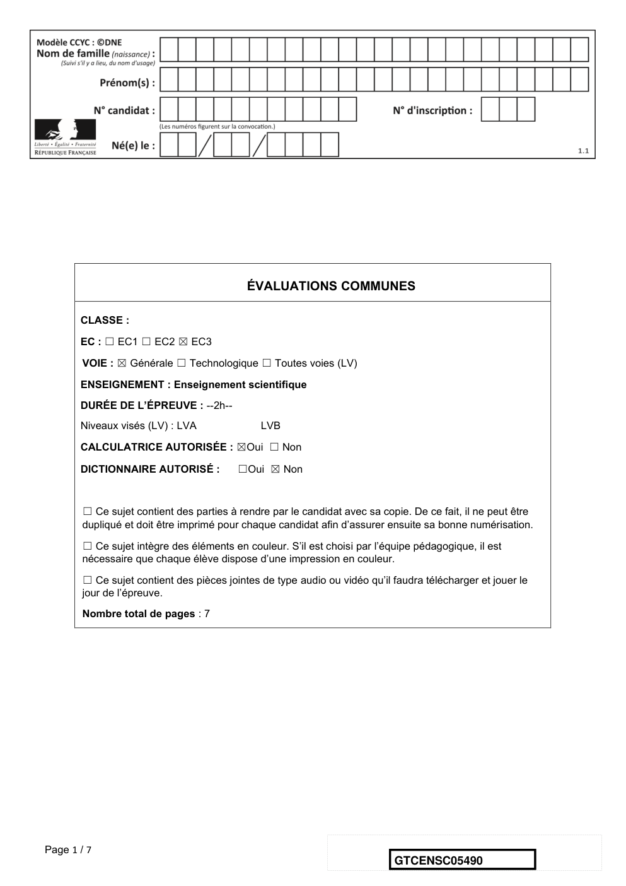
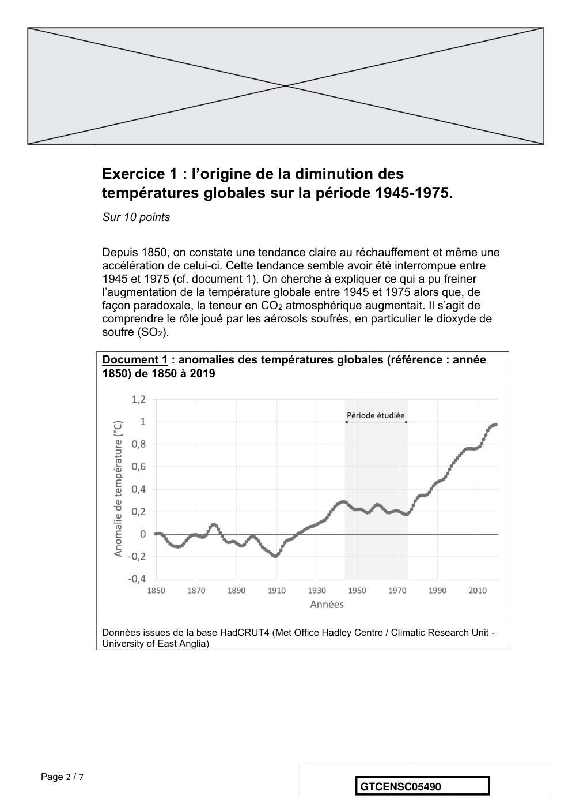
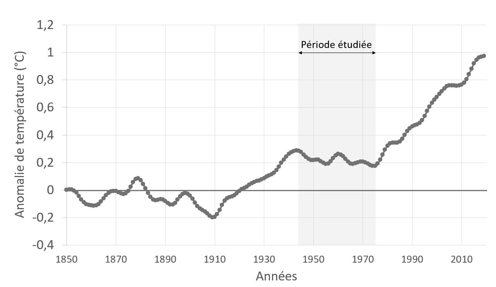
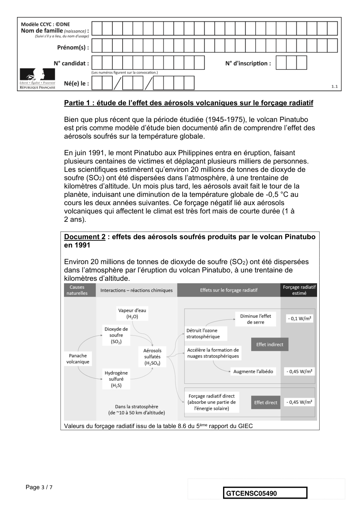
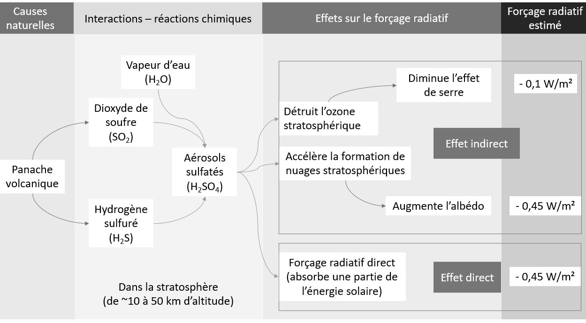
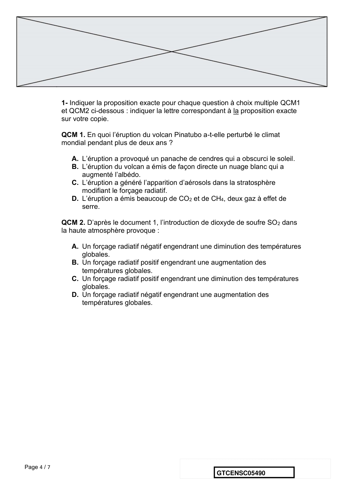
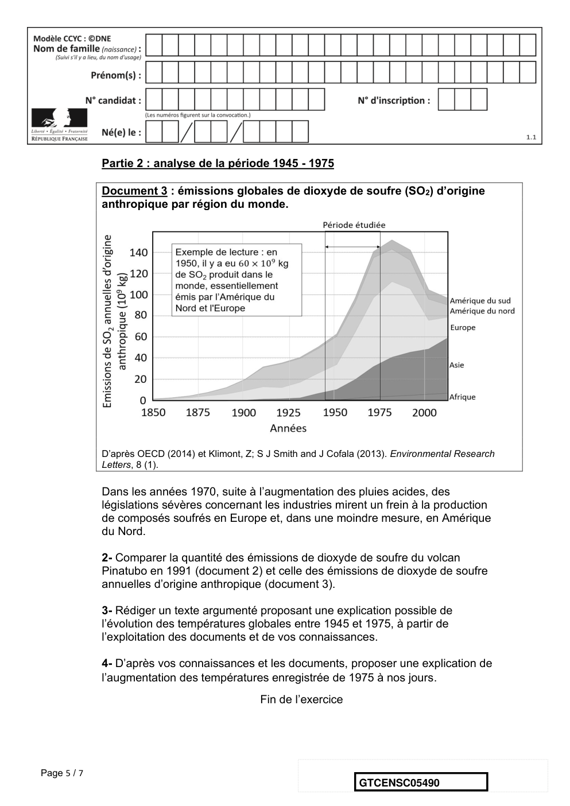
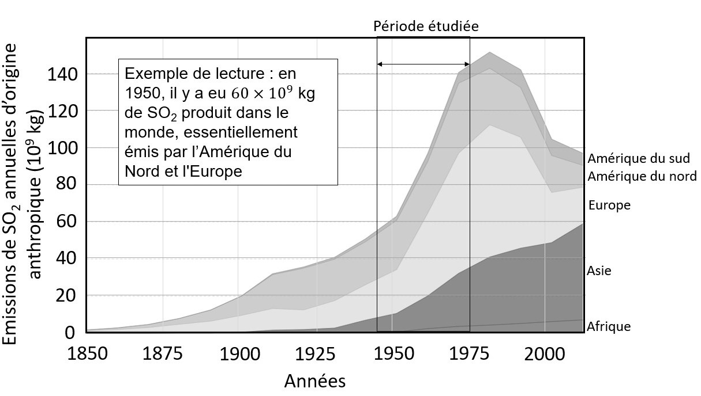
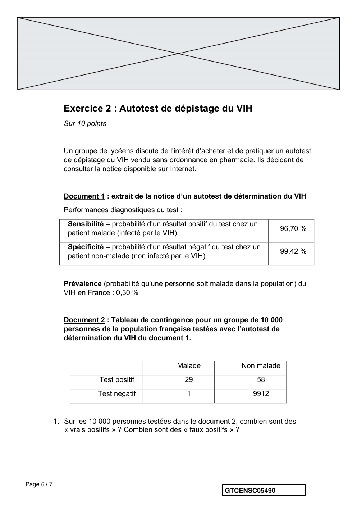
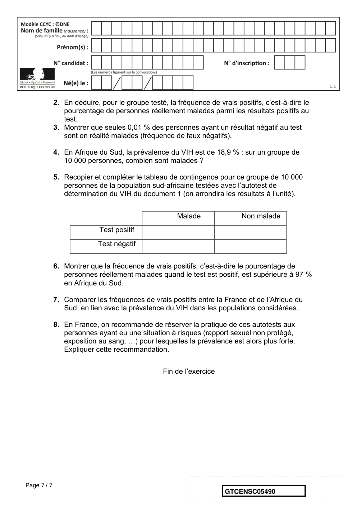

# e3c-enseignement-scientifique-terminale-05490-sujet-officiel

> Source : `../../../../pdf_version/02_es_ponctuelle/e3c/2021/e3c-enseignement-scientifique-terminale-05490-sujet-officiel.pdf` — conversion Markdown (texte + visuels).
> Stratégie : [STRATEGIE_MARKDOWN.md](../../../../STRATEGIE_MARKDOWN.md)

---

## Page 1

ÉVALUATIONS COMMUNES

       CLASSE :

       EC : ☐ EC1 ☐ EC2 ☒ EC3

        VOIE : ☒ Générale ☐ Technologique ☐ Toutes voies (LV)

       ENSEIGNEMENT : Enseignement scientifique
       DURÉE DE L’ÉPREUVE : --2h--
       Niveaux visés (LV) : LVA                LVB

       CALCULATRICE AUTORISÉE : ☒Oui ☐ Non

       DICTIONNAIRE AUTORISÉ :            ☐Oui ☒ Non

        ☐ Ce sujet contient des parties à rendre par le candidat avec sa copie. De ce fait, il ne peut être
        dupliqué et doit être imprimé pour chaque candidat afin d’assurer ensuite sa bonne numérisation.

        ☐ Ce sujet intègre des éléments en couleur. S’il est choisi par l’équipe pédagogique, il est
        nécessaire que chaque élève dispose d’une impression en couleur.

        ☐ Ce sujet contient des pièces jointes de type audio ou vidéo qu’il faudra télécharger et jouer le
        jour de l’épreuve.
        Nombre total de pages : 7

Page 1 / 7
                                                                            GTCENSC05490

---

## Page 2

Exercice 1 : l’origine de la diminution des
             températures globales sur la période 1945-1975.
             Sur 10 points

             Depuis 1850, on constate une tendance claire au réchauffement et même une
             accélération de celui-ci. Cette tendance semble avoir été interrompue entre
             1945 et 1975 (cf. document 1). On cherche à expliquer ce qui a pu freiner
             l’augmentation de la température globale entre 1945 et 1975 alors que, de
             façon paradoxale, la teneur en CO2 atmosphérique augmentait. Il s’agit de
             comprendre le rôle joué par les aérosols soufrés, en particulier le dioxyde de
             soufre (SO2).

             Document 1 : anomalies des températures globales (référence : année
             1850) de 1850 à 2019

             Données issues de la base HadCRUT4 (Met Office Hadley Centre / Climatic Research Unit -
             University of East Anglia)

Page 2 / 7
                                                                      GTCENSC05490

---

## Page 3

Partie 1 : étude de l’effet des aérosols volcaniques sur le forçage radiatif

             Bien que plus récent que la période étudiée (1945-1975), le volcan Pinatubo
             est pris comme modèle d’étude bien documenté afin de comprendre l’effet des
             aérosols soufrés sur la température globale.

             En juin 1991, le mont Pinatubo aux Philippines entra en éruption, faisant
             plusieurs centaines de victimes et déplaçant plusieurs milliers de personnes.
             Les scientifiques estimèrent qu’environ 20 millions de tonnes de dioxyde de
             soufre (SO2) ont été dispersées dans l’atmosphère, à une trentaine de
             kilomètres d’altitude. Un mois plus tard, les aérosols avait fait le tour de la
             planète, induisant une diminution de la température globale de -0,5 °C au
             cours les deux années suivantes. Ce forçage négatif lié aux aérosols
             volcaniques qui affectent le climat est très fort mais de courte durée (1 à
             2 ans).

             Document 2 : effets des aérosols soufrés produits par le volcan Pinatubo
             en 1991

             Environ 20 millions de tonnes de dioxyde de soufre (SO 2) ont été dispersées
             dans l’atmosphère par l’éruption du volcan Pinatubo, à une trentaine de
             kilomètres d’altitude.

             Valeurs du forçage radiatif issu de la table 8.6 du 5ème rapport du GIEC

Page 3 / 7
                                                                          GTCENSC05490

---

## Page 4

1- Indiquer la proposition exacte pour chaque question à choix multiple QCM1
             et QCM2 ci-dessous : indiquer la lettre correspondant à la proposition exacte
             sur votre copie.

             QCM 1. En quoi l’éruption du volcan Pinatubo a-t-elle perturbé le climat
             mondial pendant plus de deux ans ?

                A. L’éruption a provoqué un panache de cendres qui a obscurci le soleil.
                B. L’éruption du volcan a émis de façon directe un nuage blanc qui a
                   augmenté l’albédo.
                C. L’éruption a généré l’apparition d’aérosols dans la stratosphère
                   modifiant le forçage radiatif.
                D. L’éruption a émis beaucoup de CO2 et de CH4, deux gaz à effet de
                   serre.

             QCM 2. D’après le document 1, l’introduction de dioxyde de soufre SO 2 dans
             la haute atmosphère provoque :

                A. Un forçage radiatif négatif engendrant une diminution des températures
                   globales.
                B. Un forçage radiatif positif engendrant une augmentation des
                   températures globales.
                C. Un forçage radiatif positif engendrant une diminution des températures
                   globales.
                D. Un forçage radiatif négatif engendrant une augmentation des
                   températures globales.

Page 4 / 7
                                                                GTCENSC05490

---

## Page 5

Partie 2 : analyse de la période 1945 - 1975

             Document 3 : émissions globales de dioxyde de soufre (SO2) d’origine
             anthropique par région du monde.

             D’après OECD (2014) et Klimont, Z; S J Smith and J Cofala (2013). Environmental Research
             Letters, 8 (1).

             Dans les années 1970, suite à l’augmentation des pluies acides, des
             législations sévères concernant les industries mirent un frein à la production
             de composés soufrés en Europe et, dans une moindre mesure, en Amérique
             du Nord.

             2- Comparer la quantité des émissions de dioxyde de soufre du volcan
             Pinatubo en 1991 (document 2) et celle des émissions de dioxyde de soufre
             annuelles d’origine anthropique (document 3).

             3- Rédiger un texte argumenté proposant une explication possible de
             l’évolution des températures globales entre 1945 et 1975, à partir de
             l’exploitation des documents et de vos connaissances.

             4- D’après vos connaissances et les documents, proposer une explication de
             l’augmentation des températures enregistrée de 1975 à nos jours.
                                                Fin de l’exercice

Page 5 / 7
                                                                      GTCENSC05490

---

## Page 6

Exercice 2 : Autotest de dépistage du VIH
                Sur 10 points

                Un groupe de lycéens discute de l’intérêt d’acheter et de pratiquer un autotest
                de dépistage du VIH vendu sans ordonnance en pharmacie. Ils décident de
                consulter la notice disponible sur Internet.

                Document 1 : extrait de la notice d’un autotest de détermination du VIH
                Performances diagnostiques du test :
                 Sensibilité = probabilité d’un résultat positif du test chez un
                                                                                     96,70 %
                 patient malade (infecté par le VIH)
                 Spécificité = probabilité d’un résultat négatif du test chez un
                                                                                     99,42 %
                 patient non-malade (non infecté par le VIH)

                Prévalence (probabilité qu’une personne soit malade dans la population) du
                VIH en France : 0,30 %

                Document 2 : Tableau de contingence pour un groupe de 10 000
                personnes de la population française testées avec l’autotest de
                détermination du VIH du document 1.

                                                     Malade               Non malade
                           Test positif                29                      58
                          Test négatif                  1                     9912

             1. Sur les 10 000 personnes testées dans le document 2, combien sont des
                « vrais positifs » ? Combien sont des « faux positifs » ?

Page 6 / 7
                                                                     GTCENSC05490

---

## Page 7

2. En déduire, pour le groupe testé, la fréquence de vrais positifs, c’est-à-dire le
                pourcentage de personnes réellement malades parmi les résultats positifs au
                test.
             3. Montrer que seules 0,01 % des personnes ayant un résultat négatif au test
                sont en réalité malades (fréquence de faux négatifs).

             4. En Afrique du Sud, la prévalence du VIH est de 18,9 % : sur un groupe de
                10 000 personnes, combien sont malades ?

             5. Recopier et compléter le tableau de contingence pour ce groupe de 10 000
                personnes de la population sud-africaine testées avec l’autotest de
                détermination du VIH du document 1 (on arrondira les résultats à l’unité).

                                                     Malade               Non malade
                            Test positif
                           Test négatif

             6. Montrer que la fréquence de vrais positifs, c’est-à-dire le pourcentage de
                personnes réellement malades quand le test est positif, est supérieure à 97 %
                en Afrique du Sud.

             7. Comparer les fréquences de vrais positifs entre la France et de l’Afrique du
                Sud, en lien avec la prévalence du VIH dans les populations considérées.

             8. En France, on recommande de réserver la pratique de ces autotests aux
                personnes ayant eu une situation à risques (rapport sexuel non protégé,
                exposition au sang, …) pour lesquelles la prévalence est alors plus forte.
                Expliquer cette recommandation.

                                                 Fin de l’exercice

Page 7 / 7
                                                                     GTCENSC05490

