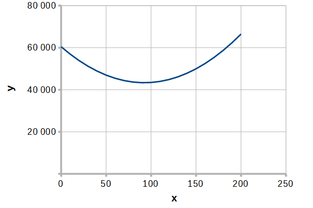
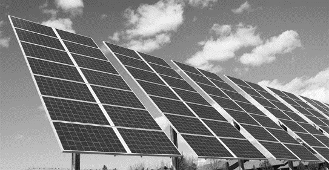

# e3c-enseignement-scientifique-terminale-05491-sujet-officiel

> Source : `../../../../pdf_version/02_es_ponctuelle/e3c/2021/e3c-enseignement-scientifique-terminale-05491-sujet-officiel.pdf` — conversion Markdown (texte + visuels utiles).
> Stratégie : [STRATEGIE_MARKDOWN.md](../../../../STRATEGIE_MARKDOWN.md)

---

## Page 1

ÉVALUATIONS COMMUNES

       CLASSE :

       EC : ☐ EC1 ☐ EC2 ☒ EC3

        VOIE : ☒ Générale ☐ Technologique ☐ Toutes voies (LV)

       ENSEIGNEMENT : Enseignement scientifique
       DURÉE DE L’ÉPREUVE : --2h--
       Niveaux visés (LV) : LVA                LVB

       CALCULATRICE AUTORISÉE : ☒Oui ☐ Non

       DICTIONNAIRE AUTORISÉ :            ☐Oui ☒ Non

        ☐ Ce sujet contient des parties à rendre par le candidat avec sa copie. De ce fait, il ne peut être
        dupliqué et doit être imprimé pour chaque candidat afin d’assurer ensuite sa bonne numérisation.

        ☐ Ce sujet intègre des éléments en couleur. S’il est choisi par l’équipe pédagogique, il est
        nécessaire que chaque élève dispose d’une impression en couleur.

        ☐ Ce sujet contient des pièces jointes de type audio ou vidéo qu’il faudra télécharger et jouer le
        jour de l’épreuve.
        Nombre total de pages : 7

Page 1 / 7
                                                                            GTCENSC05491

---

## Page 2

Exercice 1 : Transporter de l’énergie coûte de l’énergie !
             Sur 10 points

             Lors du transport de l’énergie électrique, la préoccupation première est de
             maximiser la quantité d’énergie transportée en minimisant les pertes.
             L’exercice comporte deux parties indépendantes qui s’intéressent à
             l’optimisation du transport de l’énergie électrique.

             Document 1 Électricité : à combien s’élèvent les pertes en ligne en France ?
             L’énergie électrique ne peut être acheminée jusqu’au consommateur final sans
             pertes. L’essentiel de ces pertes est lié à la circulation du courant électrique dans
             les matériaux conducteurs qui lui opposent une résistance : cela provoque une
             perte d’énergie qui se traduit par un dégagement de chaleur.
             A puissance délivrée égale, plus la tension est élevée et l’intensité réduite, plus les
             pertes en lignes sont faibles. Le courant circule donc sur les lignes électriques à
             haute et très haute tension sur le réseau de transport d’électricité français (63 000
             à 400 000 volts). Sur les réseaux de distribution, la tension est réduite et les pertes
             sont donc plus importantes. Sur ces différents réseaux, le courant alternatif est
             utilisé en partie pour cette raison : il permet d’élever les tensions, de réduire les
             intensités donc de limiter les pertes.
             Sur le réseau de transport d’électricité, le gestionnaire RTE déclare un taux de
             pertes compris entre 2% et 2,2% depuis 2007. Sur les réseaux de distribution, le
             gestionnaire ERDF annonce que les pertes s’élèvent au total à près de 6 % de
             l’énergie acheminée (20 TWh/an).
             En incluant l’autoconsommation des postes de transformation et les pertes dites
             « non techniques » (fraudes, erreurs humaines, etc.), les pertes d’électricité en
             France entre le lieu de production et de consommation avoisinent 10% en
             moyenne.
                                              D’après https://www.connaissancedesenergies.org/

Page 2 / 7
                                                                 GTCENSC05491

---

## Page 3

Document 2 Modélisation simple d’un réseau de distribution électrique par
             un graphe orienté

             Document 3
              Représentation graphique de la courbe d’équation y = 2x² – 370 x + 60 450

Page 3 / 7
                                                             GTCENSC05491

---

## Page 4

PARTIE A : Transport de l’énergie électrique
             La puissance P perdue par ce phénomène dans un conducteur ohmique de
             résistance R parcouru par un courant d’intensité I est donnée par la relation :
                                                𝑃 = 𝑅 × 𝐼².
             La résistance R d’un fil conducteur est donnée par la formule :
                                                     𝐿
                                             𝑅 =𝜌× .
                                                     𝑆
             avec ρ la résistivité du conducteur en Ω∙m, L la longueur du fil en m et S sa
             section en m².
             1. Plus la longueur du câble est grande, plus sa résistance est importante. En
             vous appuyant sur l’expression de la résistance, proposer deux façons de
             diminuer la résistance des lignes qui transportent l’énergie électrique.
             Diminuer la résistance n’est pas la seule réponse à apporter pour diminuer les
             pertes. On peut également agir sur l’intensité.
             2. Indiquer par combien sont divisées les pertes si on divise l’intensité par
             deux.
             3. Expliquer l’intérêt des lignes à haute tension.
             4. Expliquer pourquoi les deux réseaux transportant de l’énergie électrique en
             France mentionnés dans le document 1 n’annoncent pas les mêmes
             pourcentages d’énergie perdue.

             PARTIE B : Modélisation d’un réseau
             Considérons un réseau simple représenté de façon symbolique dans le
             document 2.
             Deux sources S1 et S2 produisent du courant, que l'on supposera continu,
             d’intensités respectives I1 et I2. Le courant doit être acheminé vers deux cibles
             C1 et C2 qui attendent des intensités fixées valant respectivement I3 et I4. On
             note R1, R2, R3 et R4 les résistances respectives des câbles de transport des
             lignes 1 à 4.
             Le réseau présente un unique nœud.
             5. Donner l’expression de la puissance PJT totale dissipée par effet Joule en
             fonction des intensités et résistances.

Page 4 / 7
                                                                  GTCENSC05491

---

## Page 5

6. En utilisant la loi des nœuds, supposée valable, montrer que, si les
             intensités sont exprimées en ampères, on a I2 = 185 – I1.
             7. On admet que les valeurs des résistances des câbles de transport sont
             toutes identiques et égales à R. Montrer que
             l’expression de la puissance PJT ( en W) en fonction
             de I1 (en A) est :
                          𝑃𝐽𝑇 = 𝑅(2𝐼12 – 370𝐼1 + 60450).

             8. Par lecture graphique, estimer la valeur de
             l'intensité I1 qui permet de minimiser l'énergie dissipée lors de l’acheminement
             de l’énergie.

                                         Fin de l’exercice.

      Exercice 2 : Photosynthèse et transition écologique
      Sur 10 points
      Les panneaux solaires photovoltaïques convertissent directement l’énergie radiative
      du soleil en électricité. Il en existe différents types. Dans le cadre de la transition
      énergétique actuelle, les chercheurs continuent à explorer différentes pistes
      d’évolution des techniques afin de les rendre plus efficaces et/ou plus respectueuses
      de l’environnement.

      Document 1 : les panneaux voltaïques monocristallins

      Un panneau photovoltaïque est constitué de divers matériaux dont l’extraction n’est
      pas neutre du point de vue environnemental et social. La production de panneaux
      solaires, fortement encouragée par les subventions d’Etat, a explosé ces dernières
      années.

      La très grande majorité des panneaux solaires est constituée de silicium cristallin,
      élément que l’on extrait du sable ou du quartz. Ces panneaux monocristallins sont
      ceux qui présentent les taux de rentabilité les plus élevés. Leur fabrication étant
      complexe, ils coûtent cher.

      En Chine, des scandales de rejets massifs dans l’atmosphère de poudre de silicium
      (matière première de la cellule photovoltaïque, disponible en abondance), et de
      pollution causée par les opérations de raffinage du silicium ont été dénoncés et
      documentés au cours des dix dernières années.

Page 5 / 7
                                                                GTCENSC05491

---

## Page 6

Aujourd’hui, au terme de leur durée de vie optimale (estimée à environ 25 ans) les
      panneaux photovoltaïques, qu’ils aient été construits en Chine ou en Europe, sont
      recyclables entre 95 et 99 % pour la plupart des constructeurs.

      D’après les sites Greenpeace.fr et engie.fr

      Document 2 : des cellules photovoltaïques biologiques

      La photosynthèse est une réaction biochimique produisant de l'énergie chimique à
      partir de la lumière solaire. Cette conversion repose sur des complexes moléculaires
      appelés photosystèmes. Ces derniers sont composés de protéines et d’un pigment
      appelé chlorophylle. En réaction à l'absorption de photons, les photosystèmes
      éjectent des électrons. Voilà de l'électricité...

      Andreas Mershin du Massachusetts Institute of Technology (MIT), en collaboration
      avec ses partenaires, est parvenu à créer une cellule photovoltaïque biologique.
      À partir d'algues vertes, ils ont d'abord extrait des photosystèmes. Après quelques
      modifications, ils sont ensuite parvenus à les associer à un semi-conducteur. Les
      électrons éjectés par les complexes moléculaires en présence de lumière sont ainsi
      utilisés pour la production de courant électrique.

      Ce procédé utilise des matériaux biologiques renouvelables sans nécessiter de
      composés chimiques toxiques ni une fabrication coûteuse en énergie.
      La fabrication de panneaux solaires biologiques serait également bon marché et
      facile à mettre en place dans de nombreux laboratoires.
      Pour de tels panneaux solaire, l‘énergie électrique annuelle produite par unité de
      surface atteint actuellement 81 × 10-6 Wh /cm² (Watts heure par centimètre carré).
      Cette valeur est bien en-deçà des 106 × 10-4 kWh /cm² développés en moyenne par
      des cellules photovoltaïques en silicium monocristallin en condition standard.

      D’après SCIENTIFIC REPORTS du 2 février 2012

Page 6 / 7
                                                               GTCENSC05491

---

## Page 7

Document 3 : quelques valeurs
                                                 Consommation annuelle      Surface moyenne de
                                                       moyenne                     toiture
       Maison basse consommation de 100 m²              5000 kWh                   120 m²

                                                 Consommation annuelle            Superficie
                                                       moyenne
                     Ville de Paris                  31500 × 109 Wh               105,4 km²

                                                                    Superficie
                France métropolitaine                              543 965 km2
                (Source INSEE, 2016)

      1- À partir des éléments donnés dans les documents 1 et 2, présenter les avantages
      et les limites des panneaux photovoltaïques biologiques et des panneaux
      photovoltaïques monocristallins.

      2- En vous basant sur les données chiffrées mentionnées dans les documents 2 et 3,
             a- Montrer que la surface de panneaux monocristallins nécessaire pour
                couvrir les besoins d’une maison basse consommation de 100 m² est
                environ 47 m².
             b- Calculer la surface de panneaux monocristallins qui serait nécessaire pour
                couvrir les besoins de la ville de Paris.
             c- Réaliser ensuite, pour une maison de 100 m² et pour la ville de Paris, les
                mêmes calculs dans le cadre d’une installation photovoltaïque biologique.

      3- En vous appuyant sur l’ensemble de vos résultats, montrer que, malgré leurs
      avantages, les panneaux solaires biologiques ne seraient pas une alternative
      pertinente à explorer par les chercheurs au regard des éléments donnés dans les
      documents.

                                           Fin de l’exercice

Page 7 / 7
                                                               GTCENSC05491
