# e3c-enseignement-scientifique-terminale-05493-sujet-officiel

> Source : `../../../../pdf_version/02_es_ponctuelle/e3c/2021/e3c-enseignement-scientifique-terminale-05493-sujet-officiel.pdf` — conversion Markdown (texte + visuels).
> Stratégie : [STRATEGIE_MARKDOWN.md](../../../../STRATEGIE_MARKDOWN.md)

---

## Page 1

ÉVALUATIONS COMMUNES

       CLASSE :

       EC : ☐ EC1 ☐ EC2 ☒ EC3

        VOIE : ☒ Générale ☐ Technologique ☐ Toutes voies (LV)

       ENSEIGNEMENT : Enseignement scientifique
       DURÉE DE L’ÉPREUVE : --2h--
       Niveaux visés (LV) : LVA                LVB

       CALCULATRICE AUTORISÉE : ☒Oui ☐ Non

       DICTIONNAIRE AUTORISÉ :            ☐Oui ☒ Non

        ☐ Ce sujet contient des parties à rendre par le candidat avec sa copie. De ce fait, il ne peut être
        dupliqué et doit être imprimé pour chaque candidat afin d’assurer ensuite sa bonne numérisation.

        ☐ Ce sujet intègre des éléments en couleur. S’il est choisi par l’équipe pédagogique, il est
        nécessaire que chaque élève dispose d’une impression en couleur.

        ☐ Ce sujet contient des pièces jointes de type audio ou vidéo qu’il faudra télécharger et jouer le
        jour de l’épreuve.
        Nombre total de pages : 7

Page 1 / 7
                                                                            GTCENSC05493

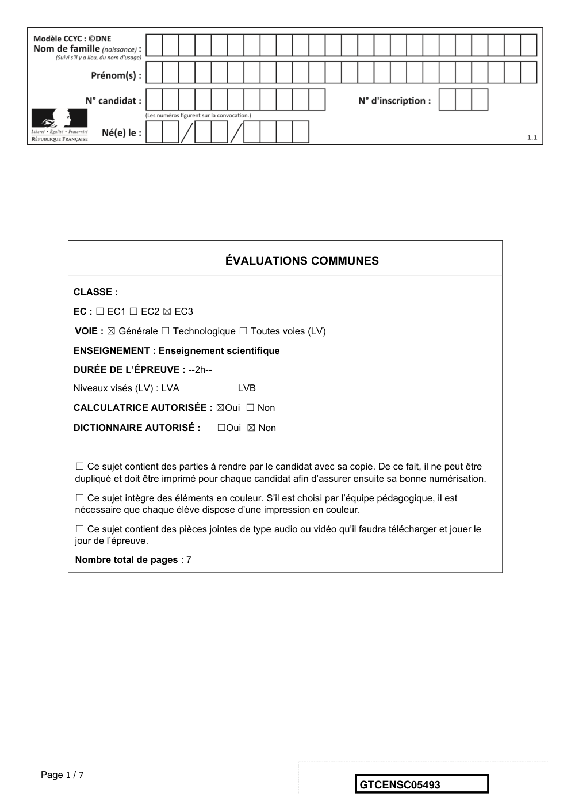

---

## Page 2

Exercice 1 : Minimisation des pertes par effet Joule
             Sur 10 points
             Dans le sud de la France, un immeuble et une maison sont alimentés la journée
             par des éoliennes et des panneaux solaires distribuant respectivement des
             courants d’intensité 𝐼1 et 𝐼2 . On veut minimiser les pertes par effet Joule dans ce
             réseau de distribution électrique.
             Partie 1 : Dissipation de l’énergie
              Document 1 : transport de l’énergie électrique
              L’électricité lors de son transport entre les lieux de production et les lieux de
              consommation subit des pertes en ligne dont le volume dépend de la distance
              de transport des caractéristiques du réseau. 80 % de ses pertes le sont par
              effet Joule dans les câbles électriques, soit pour la France, l’équivalent de
              deux unités de production nucléaires électriques.

              Pertes sur le réseau de transport de l’électricité en France en 2019 :
              Energie électrique transportée en France en 2019 : 495 × 109 kWh
              2,22 % : taux de perte d’énergie en France en 2019 pendant le transport de
              l’électricité
              Source: https://www.actu-environnement.com
             1- Calculer les pertes d’énergie en kWh en France en 2019 dues au transport
             de l’énergie électrique.
             2- Calculer en 2019 en France, l’énergie électrique en kWh à disposition des
             consommateurs.

Page 2 / 7
                                                                   GTCENSC05493

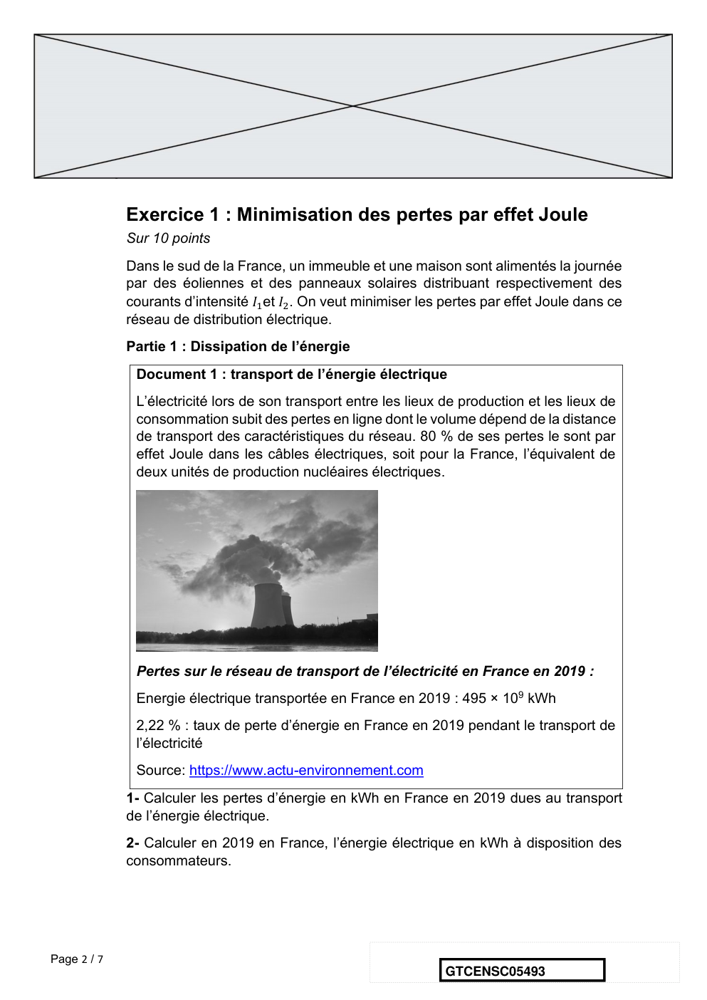

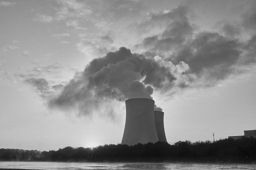

---

## Page 3

Partie 2 : modélisation du réseau électrique

             Document 2 : schéma du réseau électrique

             Dans la modélisation simplifiée utilisée, on considère que les tensions et les
             courants sont continus.

             3- Identifier les cibles destinatrices et les sources distributrices du réseau du
             document 2.
             4- La tension du réseau de distribution étant fixée, expliquer pourquoi les
             intensités I3 et I4 sont fixées.
             5- Modéliser le réseau électrique du document 2 par un graphe orienté.
             6- Justifier que 𝐼3 est environ égale à 36 A et 𝐼4 à 94 A en sachant que les
             puissances par effet Joule correspondent à 5 % des puissances utiles.

Page 3 / 7
                                                                 GTCENSC05493

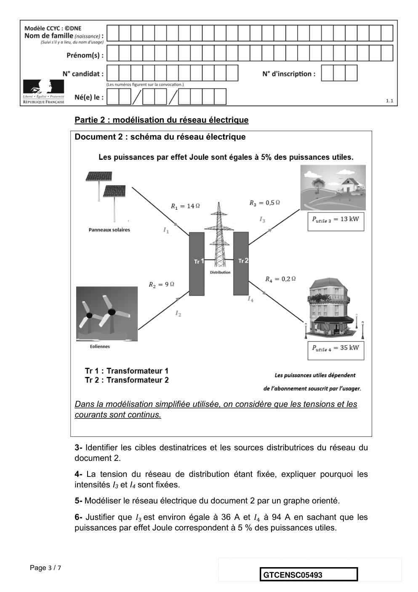

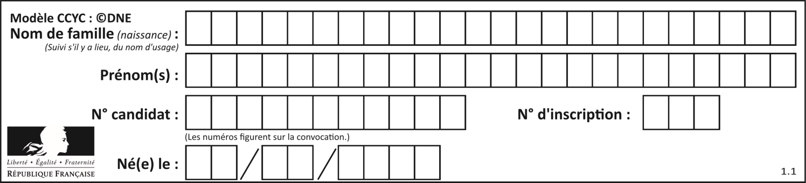

---

## Page 4

On admet que les intensités vérifient la relation I1 + I2 = I3 + I4
             7- Donner l’expression de la puissance dissipée par effet Joule 𝑃𝐽 à minimiser
             en fonction de 𝐼1, , 𝐼2 , 𝐼3 et 𝐼4 . Exprimer la valeur de I2 en ampères en fonction de
             I1.
             Les intensités I3 et I4 étant connues et I2 pouvant s’exprimer en fonction de I1,
             la puissance PJ peut s’exprimer en fonction de I1 seulement. La représentation
             graphique de la fonction PJ(I1) est donnée dans le document 3.
             Document 3 : représentation graphique de 𝑷𝑱 en fonction de 𝑰𝟏

                 𝑃𝐽 (W)                        Puissance dissipée par effet Joule

                                                                                       𝐼1 (A)

             8- La contrainte sur les intensités délivrées par les sources impose que 𝐼1 peut
             prendre une valeur comprise dans l’intervalle [0 ; 70].
             Déterminer les valeurs de 𝐼1 et de 𝐼2 pour lesquelles les pertes par effet Joule
             sont minimales.

                                               Fin de l’exercice

Page 4 / 7
                                                                    GTCENSC05493

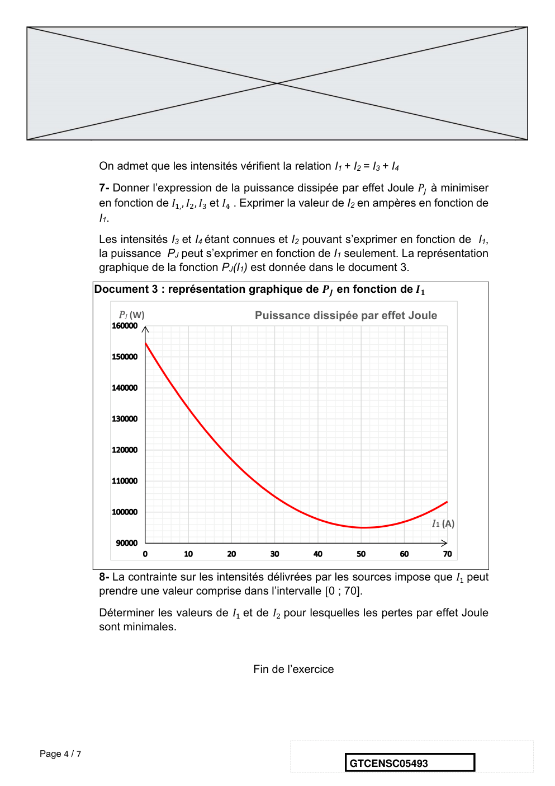

---

## Page 5

Exercice 2 : Forçage radiatif et conséquences
             Sur 10 points
             L’Agence de la transition écologique (ADEME) publie en octobre 2020 une prévision
             des impacts climatiques à venir d’ici 2050 en France. Ces impacts concernent
             principalement l’augmentation des températures et les risques d’inondation qui en
             découlent.

             L’objectif de cet exercice est de comprendre quelques effets sur le climat de la
             variation du forçage radiatif.

             Document 1 : les scénarios RCP (pour Representative Concentration Pathway)
             sont quatre scénarios de trajectoire du forçage radiatif jusqu'à l'horizon 2100.

                                                                                      RCP 8.5

                                                                                      RCP 6.0

                                                                                      RCP 4.5

                                                                                      RCP 2.6

                                                            d’après https://www.climate-chance.org

             Chaque scénario RCP est caractérisé par un nombre qui correspond à une valeur
             d’élévation du forçage radiatif par unité de temps et de surface, exprimé en W ⋅ m−2 .

Page 5 / 7
                                                                     GTCENSC05493

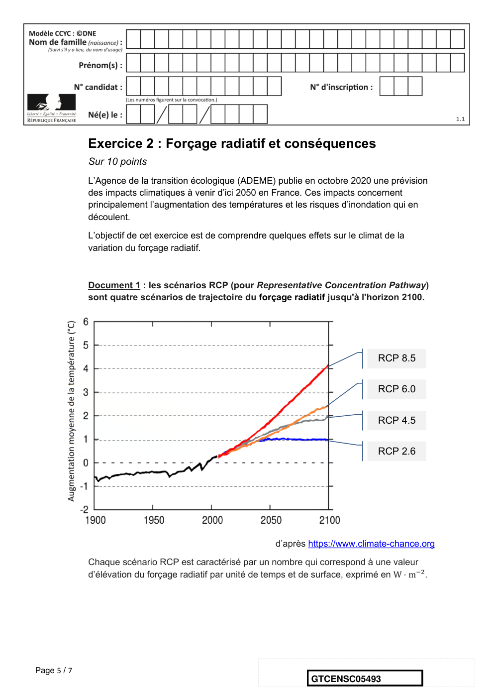

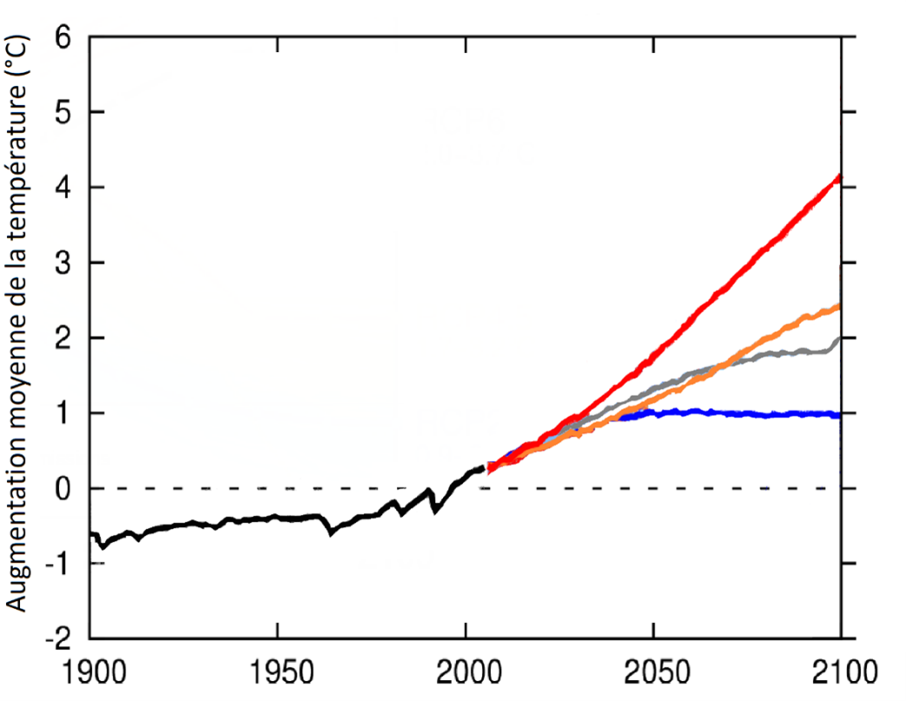

---

## Page 6

Document 2 : composantes du forçage radiatif terrestre

                                                                             Source : Wikimedias

      1.     1.a Définir la notion de « forçage radiatif ».
             1.b Justifier que, par unité de temps et de surface terrestre, ce forçage radiatif
             s’exprime en W∙m-2.
             1.c Expliquer en quoi le forçage radiatif est lié à la variation de la température
             terrestre.
      2.     Expliquer les causes de l’augmentation du forçage radiatif depuis la révolution
             industrielle (1850).

Page 6 / 7
                                                                   GTCENSC05493

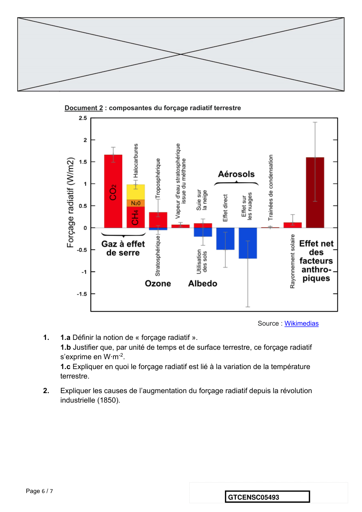

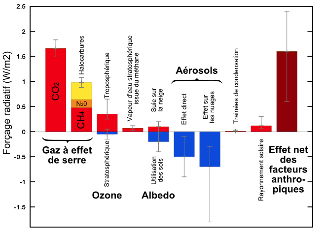

---

## Page 7

3. On analyse l’effet du forçage radiatif sur le niveau des océans.
      En tenant compte uniquement de la dilatation des océans, estimer la variation du
      niveau marin 𝛥𝑒 à l’échelle du globe, en 2100, pour un RCP 4.5, qui correspond aux
      accords de Paris, à l’aide des données ci-dessous.
             Données :
             La variation 𝛥𝑉 d’un volume 𝑉0 d’eau est proportionnelle à la variation de
             température 𝛥𝑇 : 𝛥𝑉 = 𝛽 · 𝑉0 · 𝛥𝑇 ;
                - coefficient de dilatation thermique de l’eau : 𝛽 = 2,6 × 10−4 °C−1 ;
                - Surface totale des océans : 𝑆 = 360 × 106 km2 ;

      Épaisseur de la couche superficielle océanique concernée : 𝑒 = 300 m.

      4. À l’effet de la dilatation thermique, s’ajoutent d’autres causes qui pourraient
      conduire à une élévation du niveau des océans de l’ordre du mètre. Présenter les
      conséquences sur l’environnement et les activités humaines qu’aurait une telle
      élévation du niveau des océans.
      Un des paramètres qui influe sur le forçage radiatif est l’albédo terrestre moyen.
      On rappelle que l’albédo d’une surface correspond au rapport de l’énergie lumineuse
      réfléchie sur l’énergie lumineuse incidente.
      Le tableau suivant fournit quelques valeurs suivant la nature des surfaces.

                            Type de Surface                   Albédo
                              Mer / Océan                      0.26
                                 Glace                          0.6
                             Neige fraîche                     0.85
                        Albédo de différentes surfaces (source : Météo France)

      5. Préciser si une augmentation de l’albedo terrestre produit une augmentation ou
      une diminution du forçage radiatif. En déduire que la fonte des glaces (terrestres et
      marines) se traduit par une augmentation du forçage radiatif.
      6. Expliquer pourquoi la fonte des glaces est un facteur de rétroaction positive de
      l’échauffement global du climat. Il est possible d’appuyer le raisonnement sur un
      schéma.
                                          Fin de l’exercice

Page 7 / 7
                                                                  GTCENSC05493

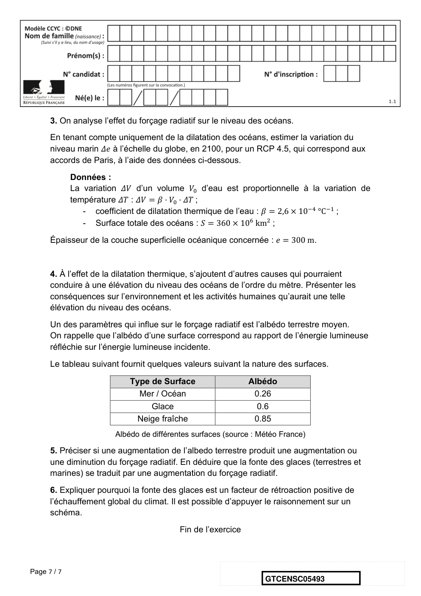

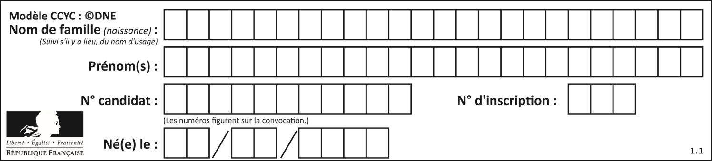
