# e3c-enseignement-scientifique-terminale-05499-sujet-officiel

> Source : `../../../../pdf_version/02_es_ponctuelle/e3c/2021/e3c-enseignement-scientifique-terminale-05499-sujet-officiel.pdf` — conversion Markdown (texte + visuels).
> Stratégie : [STRATEGIE_MARKDOWN.md](../../../../STRATEGIE_MARKDOWN.md)

---

## Page 1

ÉVALUATIONS COMMUNES

       CLASSE :

       EC : ☐ EC1 ☐ EC2 ☒ EC3

        VOIE : ☒ Générale ☐ Technologique ☐ Toutes voies (LV)

       ENSEIGNEMENT : Enseignement scientifique
       DURÉE DE L’ÉPREUVE : --2h--
       Niveaux visés (LV) : LVA                LVB

       CALCULATRICE AUTORISÉE : ☒Oui ☐ Non

       DICTIONNAIRE AUTORISÉ :            ☐Oui ☒ Non

        ☐ Ce sujet contient des parties à rendre par le candidat avec sa copie. De ce fait, il ne peut être
        dupliqué et doit être imprimé pour chaque candidat afin d’assurer ensuite sa bonne numérisation.

        ☐ Ce sujet intègre des éléments en couleur. S’il est choisi par l’équipe pédagogique, il est
        nécessaire que chaque élève dispose d’une impression en couleur.

        ☐ Ce sujet contient des pièces jointes de type audio ou vidéo qu’il faudra télécharger et jouer le
        jour de l’épreuve.
        Nombre total de pages : 8

Page 1 / 8
                                                                            GTCENSC05499

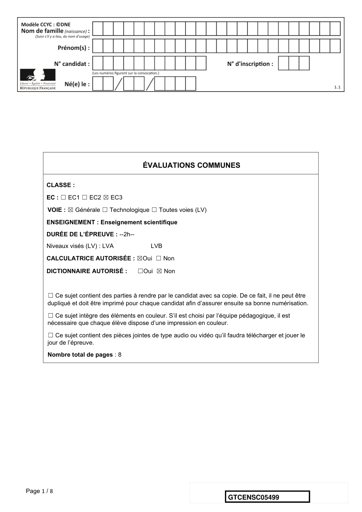

---

## Page 2

Exercice 1 : Le parc de Yellowstone : un laboratoire
        grandeur nature pour l’étude des populations
        Sur 10 points

        Le loup était autrefois le principal prédateur dans le célèbre parc national américain
        de Yellowstone, mais la population de loups a été éradiquée dans les années 1920.
        Tout l'écosystème a été modifié par cette disparition, en particulier la population de
        grands ongulés herbivores (élan, bison, cerf de Virginie, wapiti, antilope pronghorn,
        mouton d'Amérique et chèvre de montagne) dont l’expansion est devenue rapide. En
        1995, 14 loups gris ont été réintroduits dans le parc de Yellowstone.

        On cherche à comprendre les conséquences de cette réintroduction.

        Partie 1- démographie des populations de loups et d’élans dans le parc de
        Yellowstone

        Document 1 : variation du nombre d’individus de la population de loups (a) et
        d’élans (b) dans le parc de Yellowstone depuis leur introduction jusqu’en 2015

                    1-a. Variation du nombre d’individus de de la population de loups dans le parc de
                                             Yellowstone entre 1995 et 2015

Nombre de loups

                              Parc complet – barre de         Partie nord du          Partie centrale du
                              gauche (1)                      parc – barre du         parc – barre de
                                                              milieu (2)              droite (3)

        https://www.nps.gov/yell/learn/ys-24-1-wolf-restoration-in-yellowstone-reintroduction-to-recovery.htm

  Page 2 / 8
                                                                                  GTCENSC05499

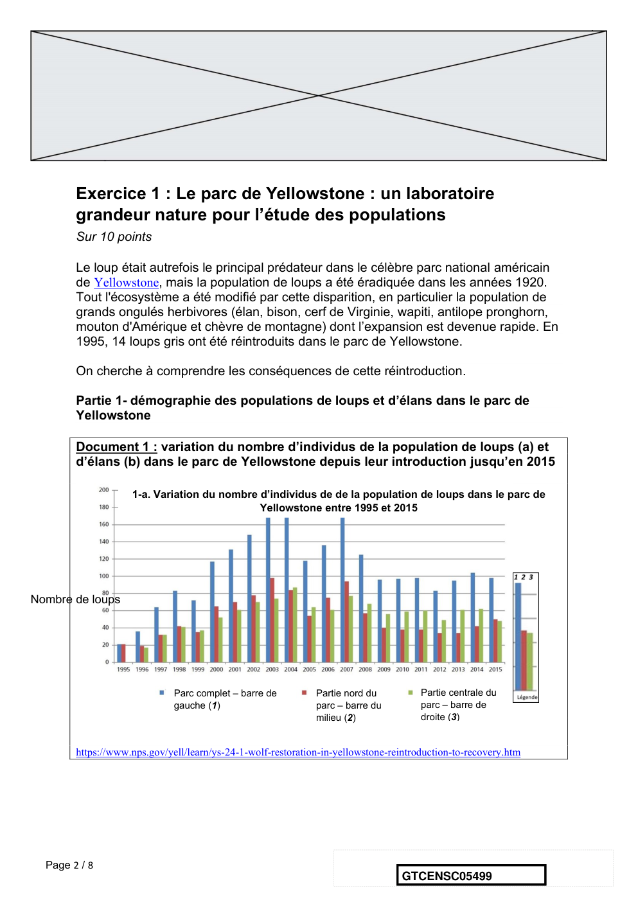

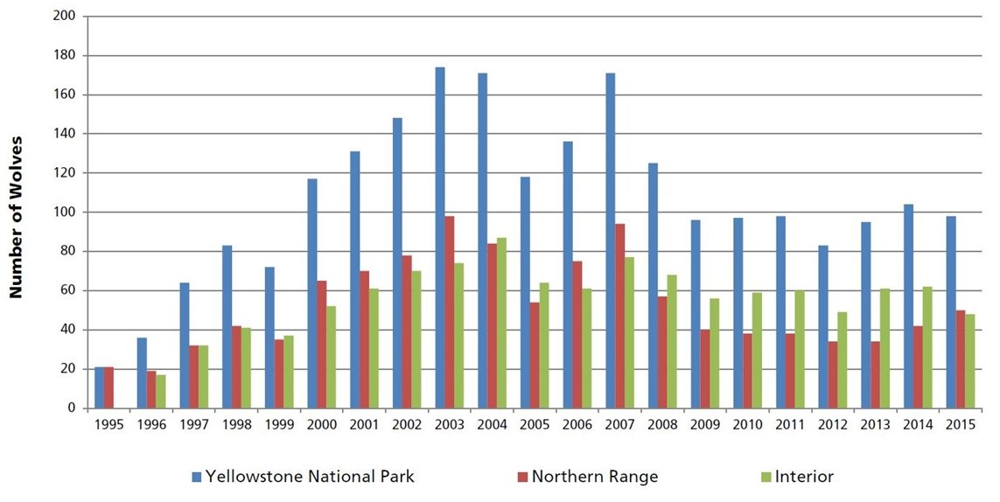

---

## Page 3

1-b. Variation du nombre d’individus de la population d’élans en hiver dans
                         la partie Nord du parc entre 1960 et 2015
                                                                   Introduction de loups

Nombre d’élans

      Les années sont indiquées par les deux derniers chiffres.

      Clé de lecture :

      • 60 - 61 : 1960 – 1061

      • 00 - 01 : 2000 - 2001

      Remarque : le comptage des élans n’a pas pu être effectué pendant certains hivers contrairement à
      celui des loups.

      1. À partir de l’exploitation du document 1 mis en relation avec vos
      connaissances, répondre aux questions suivantes.

              1.1. Entre une suite arithmétique et une suite géométrique, indiquer laquelle
              pourrait permettre de modéliser au mieux la variation globale du nombre
              d’individus de la population de loup durant les 8 premières années entre 1995
              et 2003. (Aucun calcul n’est attendu)

              1.2. Formuler une hypothèse permettant d’expliquer la variation du nombre
              d’individus de la population de loups depuis 2003.

Page 3 / 8
                                                                         GTCENSC05499

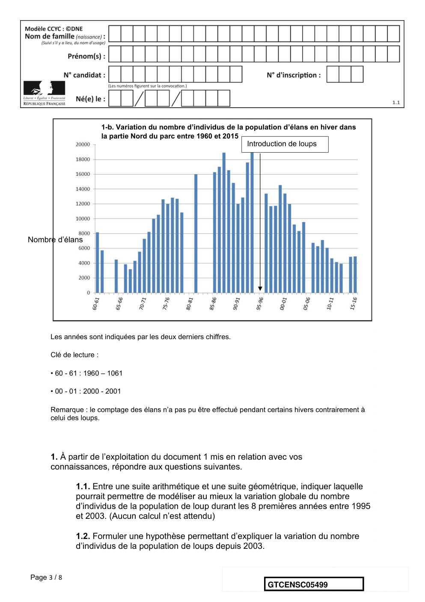

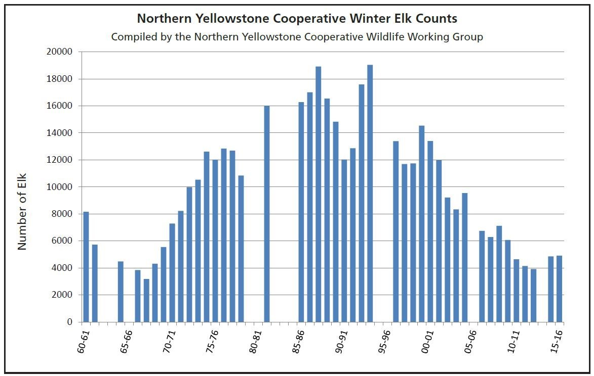

---

## Page 4

Partie 2- Évolution génétique des populations de loups

      Document 2 : étude génétique de la population de loups dans le parc de
      Yellowstone

      La couleur du pelage des loups est liée à l’expression d’un gène qui existe sous deux
      formes : l’allèle K et l’allèle k. Les génotypes des loups ont été étudiés :

                     Génotype                  (K//K)    (K//k)   (k//k)   Total
                     Nombre de loups           31        321      413      765

                     Couleur du pelage         Noir      Noir     Gris

                     Fréquence observée        0,04      0,42     0,54     1

      On peut calculer la fréquence p de l’allèle K dans la population et la fréquence q de
      l’allèle k (q=1-p).

      2. Expliquer en quoi les données du document 2 permettent de dire que la population
      actuelle n’est pas issue uniquement des loups gris introduits en 1995.

      3. Calculer les fréquences (notées p et q) de chacun des allèles du gène
      responsable de la couleur dans la population actuelle.

      4. Indiquer sur votre copie la lettre correspondant à la proposition exacte :

      Si la population de loups respecte le modèle de Hardy-Weinberg, à la génération
      suivante :

                   a La fréquence de l’allèle K sera plus élevée qu’actuellement.

                   b La fréquence de l’allèle k sera plus élevée qu’actuellement.

                    c. La fréquence de chaque allèle restera constante.

                    d. La fréquence des deux allèles n’est pas prévisible.

Page 4 / 8
                                                                  GTCENSC05499

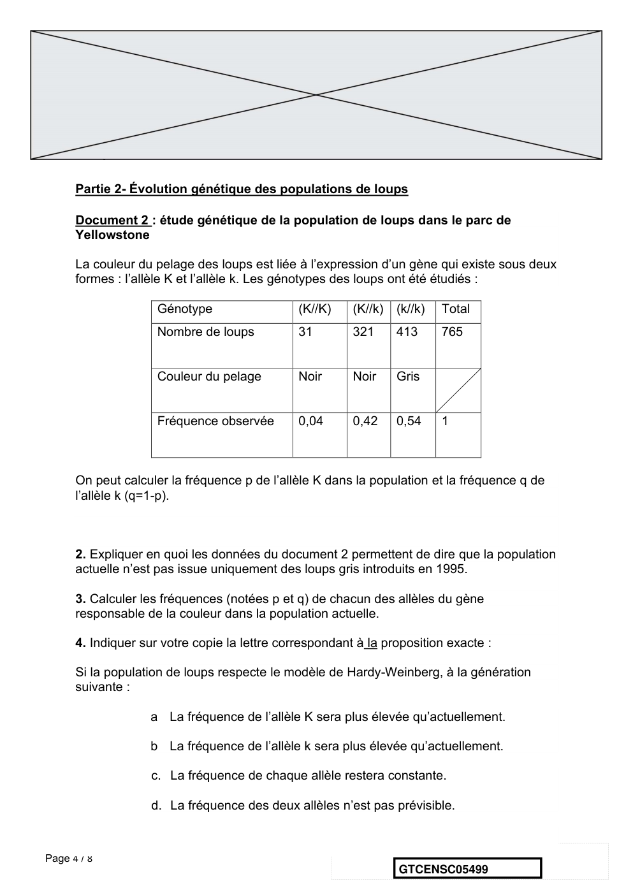

---

## Page 5

5. En supposant que cette population respecte la loi de Hardy-Weinberg, calculer les
      fréquences génotypiques attendues à la génération suivante, en utilisant les données
      suivantes : f(génotype K//K) = p2 ; f(génotype k//k) = q2; f(génotype K//k) = 2pq.

      6. À partir du document 3, prouver que le modèle de Hardy-Weinberg n’est pas
      utilisable pour prévoir l’évolution de cette population de loups.

      Document 3 : variation de la fréquence de l’allèle K (données issues du suivi
      des populations de loups entre 1996 et 2012)

                                       Variation de la fréquence de l'allèle K dans la population de loup entre
                                                                    1996 et 2012
                                        0,4
             fréquence de l'allèle K

                                       0,35

                                        0,3

                                       0,25

                                        0,2
                                                                                                                   Années
                                       0,15
                                           1996   1998    2000    2002     2004    2006     2008    2010    2012   2014

      Données issues du « Journal of Heredity, Volume 105, Issue 4, July-August 2014, Pages 457–465 »

        Couleur                                                    Gris    Noir     Noir     * Le taux de survie annuel est
                                                                                             égal au pourcentage d’individus
                                                                                             survivants au bout d’un an.
        Génotype                                                   k//k    K//k     K//K

        Taux de survie annuel *                                    75      77       47       ** Le succès reproducteur
        (en %)
                                                                                             correspond à la capacité d’un
                                                                                             individu à diffuser ses gènes dans
        Succès reproducteur moyen                                  1,83    2,35     0,031
                                                                                             la population. Il se mesure par le
        au cours de la vie ** (en
        nombre de descendants par                                                            nombre de ses descendants qui
        individu)                                                                            se reproduisent à leur tour.

                                                                    Fin de l’exercice

Page 5 / 8
                                                                                              GTCENSC05499

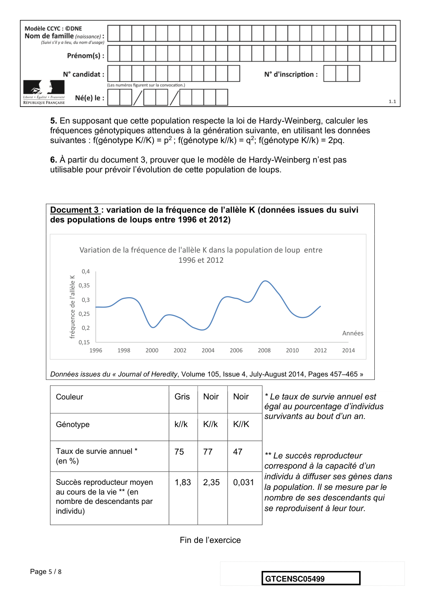

---

## Page 6

Exercice 2 : Confinement et atmosphère
             Sur 10 points

             L’activité humaine a des conséquences sur la composition de l’atmosphère,
             notamment parce qu’elle conditionne les émissions de CO2.
             Nous nous proposons ici d’étudier une évolution récente de l’atmosphère
             durant les premiers mois de la crise sanitaire de la Covid 19 et les mesures
             qui l’ont accompagnées.
             Document 1 : émissions globales de CO2 en mégatonnes par jour
             d’origine fossile
             Le document présente l’évolution du total des émissions journalières dues à
             l’utilisation de combustibles fossiles, à l’échelle de la Terre, au cours du
             temps. Les parties grisées représentent la marge d’erreur.

             1- En s’appuyant sur l’analyse du document 1, préciser comment ont évolué les
             émissions de CO2 de 2000 à 2020, à l’échelle globale de la Terre et proposer
             une hypothèse quant aux causes des variations constatées pendant les
             premiers mois de l’année 2020.

Page 6 / 8
                                                                GTCENSC05499

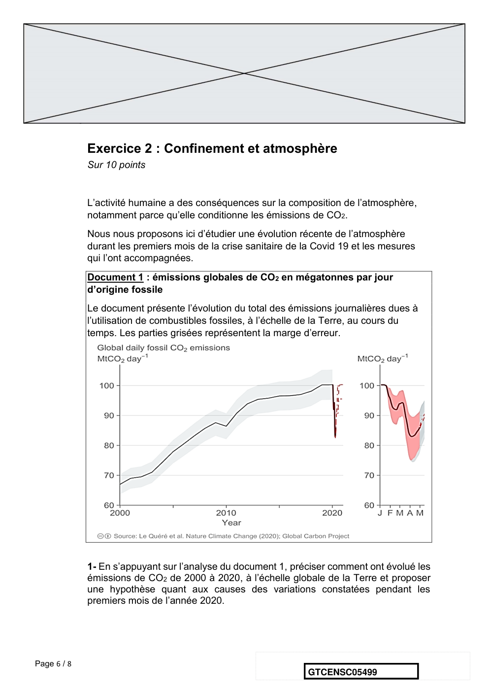

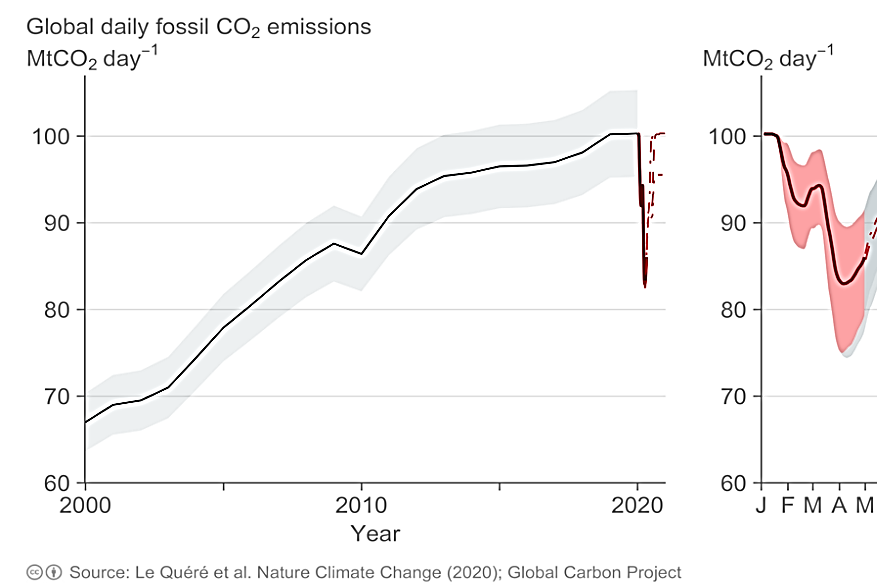

---

## Page 7

Document 2 : cycle et flux de carbone (en Gt / an)

      2. À l’aide de vos connaissances personnelles et en s’appuyant sur le document 2,
      identifier les deux réservoirs de carbone les plus importants et préciser les flux de
      carbone entre ces deux réservoirs.

Page 7 / 8
                                                                GTCENSC05499

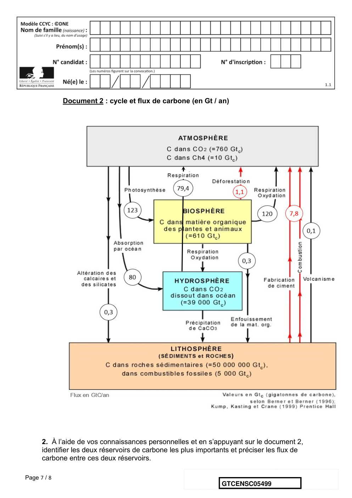

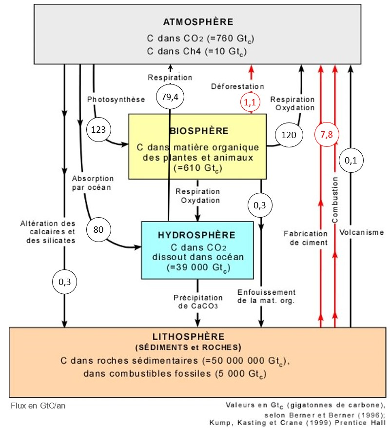

---

## Page 8

3. En s’appuyant sur le document 2, identifier les flux de nature anthropique sur ce
      cycle.

      4. En effectuant un bilan à partir de données du document 2, montrer que la quantité
      de carbone augmente avec le temps dans l’atmosphère.

      5. Expliquer pourquoi on qualifie un combustible fossile de ressource non
      renouvelable.

      6. Sachant qu’une mole d’essence produit huit moles de CO2, prouver par le calcul
      qu’un kilogramme d’essence produit une masse de CO2 d’environ 3,1 kg, en utilisant
      les données suivantes.

      En première approche, l’équation de la réaction de combustion de l’essence peut
      être assimilée à celle de la combustion de l’octane (C8H18) :
             2 C8H18 (ℓ) + 25 O2 (g)          16 CO2 (g) + 18 H2O (g)

      Données : Une mole d’octane C8H18 a une masse de 114,0 g
      Une mole de CO2 a une masse de 44,0 g.

      7. En déduire la masse de CO2 produite pour une quantité de 2,8.109 kg d’essence
      correspondant à la consommation mondiale journalière sans crise sanitaire.

      8. a- Comparer la valeur des émissions de CO2 calculée à la question 7 à la valeur
      lue sur le graphique du document 1 pour le mois d’avril 2020.
      8. b- Formuler des hypothèses pour expliquer la différence constatée.

Page 8 / 8
                                                                 GTCENSC05499

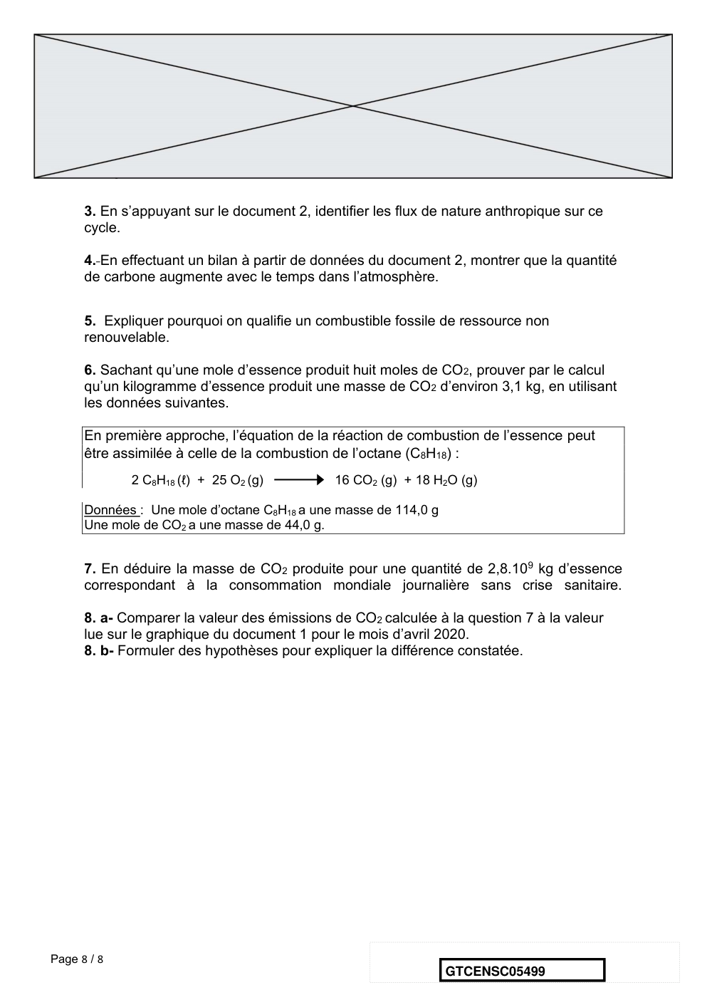

