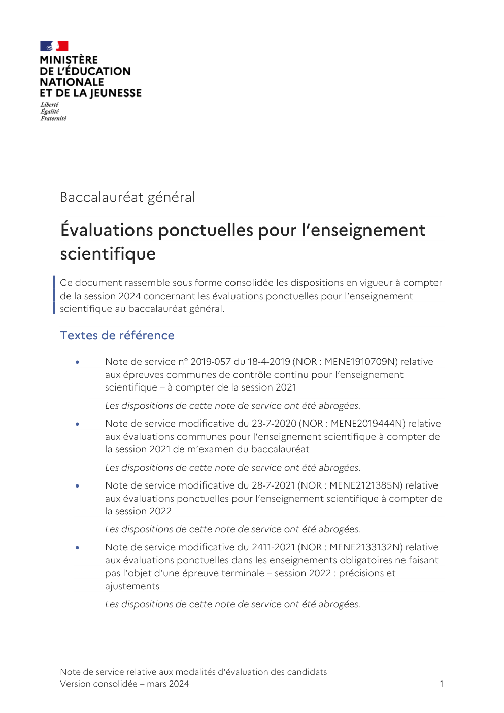

# document_56670_es_ponctuelle

> Source : `../../../pdf_version/02_es_ponctuelle/eduscol_officiel/document_56670_es_ponctuelle.pdf` — conversion Markdown (texte + visuels).
> Stratégie : [STRATEGIE_MARKDOWN.md](../../../STRATEGIE_MARKDOWN.md)

---

## Page 1

Baccalauréat général

Évaluations ponctuelles pour l’enseignement
scientifique
Ce document rassemble sous forme consolidée les dispositions en vigueur à compter
de la session 2024 concernant les évaluations ponctuelles pour l’enseignement
scientifique au baccalauréat général.

Textes de référence

         Note de service n° 2019-057 du 18-4-2019 (NOR : MENE1910709N) relative
          aux épreuves communes de contrôle continu pour l’enseignement
          scientifique – à compter de la session 2021
          Les dispositions de cette note de service ont été abrogées.
         Note de service modificative du 23-7-2020 (NOR : MENE2019444N) relative
          aux évaluations communes pour l’enseignement scientifique à compter de
          la session 2021 de m’examen du baccalauréat
          Les dispositions de cette note de service ont été abrogées.
         Note de service modificative du 28-7-2021 (NOR : MENE2121385N) relative
          aux évaluations ponctuelles pour l’enseignement scientifique à compter de
          la session 2022
          Les dispositions de cette note de service ont été abrogées.
         Note de service modificative du 2411-2021 (NOR : MENE2133132N) relative
          aux évaluations ponctuelles dans les enseignements obligatoires ne faisant
          pas l’objet d’une épreuve terminale – session 2022 : précisions et
          ajustements
          Les dispositions de cette note de service ont été abrogées.

Note de service relative aux modalités d'évaluation des candidats
Version consolidée – mars 2024                                                         1

---

## Page 2

      Note de service du 03-01-2023 (NOR : MENE2236328N) relative aux
          évaluations ponctuelles pour l’enseignement scientifique à compter de la
          session 2024
          Les dispositions de cette note de service remplacent les précédentes.

La présente note de service définit le format des évaluations ponctuelles prévues en
enseignement scientifique au titre du contrôle continu pour le baccalauréat de la
voie générale, pour les candidats dits individuels, c'est-à-dire les candidats qui ne
suivent les cours d'aucun établissement, les candidats inscrits dans un établissement
privé hors contrat, les candidats inscrits dans un établissement français à l'étranger
ne bénéficiant pas d'une homologation pour le cycle terminal et les candidats
inscrits au Centre national d'enseignement à distance (Cned) en scolarité libre,
conformément aux dispositions de l'arrêté du 16 juillet 2018 modifié relatif aux
modalités d'organisation du contrôle continu pour l'évaluation des enseignements
dispensés dans les classes conduisant au baccalauréat général et au baccalauréat
technologique.

Le format défini dans cette note de service peut être utilisé par le recteur
d’académie pour les évaluations de remplacement organisées par les services
académiques à titre exceptionnel, à l’intention des candidats scolaires inscrits au
Cned en scolarité réglementée, lorsque leur moyenne annuelle dans l’enseignement
fait défaut, et pour les candidats sportifs de haut niveau, sportifs espoirs et sportifs
des collectifs nationaux inscrits sur les listes mentionnées à l’article L. 221-2 du Code
du sport, qui en font la demande.

Deux modalités d’organisation de ces évaluations ponctuelles sont prévues, selon le
choix formulé par le candidat individuel ou le sportif de haut niveau, ou pour
répondre à la spécificité de la situation du candidat scolaire n’ayant pu présenter de
moyenne annuelle, pour cause de force majeure dûment justifiée :

   1. une modalité d’organisation consistant en une unique évaluation ponctuelle à
      la fin du cycle terminal, sur le programme des deux années du cycle terminal ;
   2. une modalité d’organisation consistant en deux évaluations ponctuelles, une à
      la fin de l’année de première sur le programme de première, l’autre à la fin de
      l’année de terminale sur le programme de terminale.

Les candidats formulent leur choix entre ces deux modalités lors de leur inscription à
l’examen conformément à la réglementation. Ce choix est définitif une fois que
l’inscription à l’examen est close, sauf en cas de situation exceptionnelle, et sous
réserve de l’autorisation du recteur d’académie. Lorsque le candidat choisit d’être
successivement évalué en fin de classe de première et en fin de classe de terminale, il
ne peut modifier la répartition des évaluations prévues par la réglementation.

La note attribuée à l’évaluation ponctuelle d’enseignement scientifique est prise en
compte pour le baccalauréat au titre du contrôle continu, affectée d’un coefficient 3
si l’évaluation porte sur le programme de première ou de terminale, et d’un

Note de service relative aux modalités d'évaluation des candidats
Version consolidée – mars 2024                                                              2

---

## Page 3

coefficient 6 si l’évaluation porte sur le programme des deux années du cycle
terminal, conformément aux dispositions de la note de service du 28 juillet 2021
modifiée relative aux modalités d’évaluation des candidats à compter de la
session 2022 du baccalauréat général et technologique.

La présente note de service abroge et remplace la note de service du 28 juillet 2021
modifiée relative aux évaluations ponctuelles pour l’enseignement scientifique. Elle
s’applique à compter de la session 2024 de l’examen du baccalauréat.

1. Périmètre des évaluations

Les évaluations ponctuelles pour l’enseignement scientifique dans la voie générale
ont pour objectif d’évaluer les connaissances et les compétences figurant au
programme de l’enseignement scientifique pour les classes de première et de
terminale, défini par arrêté du 17 janvier 2019 publié au BOEN spécial n° 1 du
22 janvier 2019 pour la classe de première et par arrêté du 19 juillet 2019 publié au
BOEN spécial n° 8 du 25 juillet 2019 pour la classe de terminale et, pour
l’enseignement de mathématiques spécifique en première, au programme défini par
arrêté du 6 juillet 2022 publié au BOEN n° 27 du 7 juillet 2022.

Le programme des évaluations diffère selon que le candidat présente ou non à
l’examen un complément d’enseignement de mathématiques spécifique,
conformément aux dispositions de l’arrêté du 6 juillet 2022 relatif à la place des
mathématiques dans les enseignements de la classe de première générale du lycée et
à leur évaluation pour le baccalauréat pour l’année scolaire 2022-2023 et aux
dispositions de l’arrêté du 3 janvier 2023 relatif à la place des mathématiques dans
les enseignements de la classe de première générale du lycée à compter de l’année
scolaire 2023-2024 et à leur évaluation pour le baccalauréat.

Candidat présentant à l’examen l’enseignement scientifique sans
complément d’enseignement de mathématiques spécifique

Les candidats qui présentent l’enseignement scientifique sans complément
d’enseignement de mathématiques spécifique, sont :

1. à la session 2024 :

      les candidats dont l’un des trois enseignements de spécialité à l’examen est la
       spécialité mathématiques ;
      les candidats dont les trois enseignements de spécialité à l’examen ne
       comportent pas la spécialité mathématiques et qui ont fait le choix de ne pas
       présenter l’enseignement de mathématiques spécifique intégré à
       l’enseignement scientifique ;

2. à compter de la session 2025 :

      les candidats dont l’un des trois enseignements de spécialité à l’examen est la
       spécialité mathématiques.

Note de service relative aux modalités d'évaluation des candidats
Version consolidée – mars 2024                                                           3

---

## Page 4

Pour ces candidats, les évaluations ponctuelles sont adossées aux seuls programmes
de l’enseignement commun d’enseignement scientifique des classes de première et
de terminale.

Candidat présentant à l’examen l’enseignement scientifique avec
complément d’enseignement de mathématiques spécifique

Les candidats qui présentent l’enseignement scientifique avec un complément
d’enseignement de mathématiques spécifique sont :

   1. à la session 2024, les candidats qui ne présentent pas l’enseignement de
      spécialité mathématiques à l’examen et qui ont fait le choix de présenter
      l’enseignement de mathématiques spécifique intégré à l’enseignement
      scientifique ;
   2. à compter de la session 2025, les candidats qui ne présentent pas
      l’enseignement de spécialité mathématiques à l’examen.

Pour ces candidats, les évaluations ponctuelles sont adossées à la fois aux
programmes de l’enseignement commun d’enseignement scientifique des classes de
première et de terminale et au programme de l’enseignement de mathématiques
spécifique de première.

2. Structure des évaluations

Durée de chaque évaluation : deux heures.

Les évaluations ponctuelles pour l’enseignement scientifique sont des évaluations
écrites qui comprennent des exercices interdisciplinaires. Ces exercices présentent
une cohérence thématique et portent sur un thème du programme. Ils permettent
d’évaluer les compétences suivantes :

      exploiter des documents ;
      organiser, effectuer et contrôler des calculs ;
      rédiger une argumentation scientifique.

Chacun de ces exercices évalue plus particulièrement une ou deux de ces
compétences.

La correction de la copie est prise en charge par un seul enseignant, qui peut être un
professeur de mathématiques, de physique-chimie ou de sciences de la vie et de la
Terre, compte tenu du caractère interdisciplinaire de cet enseignement.

Lorsque le sujet comprend un exercice de mathématiques, celui-ci porte sur les
thématiques figurant au programme de mathématiques intégré à l’enseignement
scientifique de la classe de première.

Chaque sujet précise si l’usage de la calculatrice, dans les conditions précisées par les
textes en vigueur, est autorisé.

Note de service relative aux modalités d'évaluation des candidats
Version consolidée – mars 2024                                                          4

---

## Page 5

L’évaluation est notée sur 20 points.

Classe de première : évaluation sur le programme de première

Candidat présentant à l’examen l’enseignement scientifique sans
complément d’enseignement de mathématiques spécifique

Le candidat, tel que défini dans la partie 1 de la présente note de service, qui
présente à l’examen l’enseignement scientifique sans complément d’enseignement
de mathématiques spécifique traite deux exercices choisis parmi trois exercices
portant chacun sur un des quatre thèmes du programme de première de
l’enseignement commun d’enseignement scientifique.

Chacun des exercices est noté sur 10 points.

Candidat présentant à l’examen l’enseignement scientifique avec
complément d’enseignement de mathématiques spécifique

Le candidat, tel que défini dans la partie 1 de la présente note de service, qui
présente à l’examen l’enseignement scientifique avec complément d’enseignement
de mathématiques spécifique traite :

      un exercice choisi parmi deux exercices portant chacun sur un thème
       différent issu des quatre thèmes du programme de première de
       l’enseignement commun d’enseignement scientifique. L’exercice est noté sur
       12 points ;
      un exercice portant sur le programme de l’enseignement de mathématiques
       spécifique intégré à l’enseignement scientifique. L’exercice est noté sur
       8 points.

Classe de terminale : évaluation sur le programme de terminale

En fin d’année de terminale, l’évaluation est constituée de deux exercices portant sur
deux thèmes différents issus des trois thèmes du programme de terminale de
l’enseignement commun d’enseignement scientifique.

Chacun des deux exercices est noté sur 10 points.

Fin du cycle terminal : évaluation sur les programmes de première
et de terminale

En fin de cycle terminal, le candidat traite deux exercices.

Note de service relative aux modalités d'évaluation des candidats
Version consolidée – mars 2024                                                       5

---

## Page 6

Candidat présentant à l’examen l’enseignement scientifique sans
complément d’enseignement de mathématiques spécifique

Le candidat, tel que défini dans la partie 1 de la présente note de service, qui
présente à l’examen l’enseignement scientifique sans complément d’enseignement
de mathématiques spécifique traite deux exercices :

      un exercice portant sur le programme de l’enseignement scientifique de
       terminale ;
      un exercice choisi parmi deux portant sur des thèmes différents du
       programme de première de l’enseignement commun d’enseignement
       scientifique.

Chacun des exercices est noté sur 10 points.

Candidat présentant à l’examen l’enseignement scientifique avec
complément d’enseignement de mathématiques spécifique

Le candidat, tel que défini dans la partie 1 de la présente note de service, qui
présente l’enseignement scientifique avec un complément d’enseignement de
mathématiques spécifique traite deux exercices :

      un exercice choisi parmi deux exercices portant chacun à la fois sur un thème
       issu des trois thèmes du programme de terminale et sur un thème issu des
       quatre thèmes du programme de première de l’enseignement commun
       d’enseignement scientifique. Les thèmes de première des deux exercices au
       choix sont différents ;
       L’exercice est noté sur 16 points ;
      un exercice portant sur le programme de l’enseignement de mathématiques
       spécifique intégré à l’enseignement scientifique en première.
       L’exercice est noté sur 4 points.

Note de service relative aux modalités d'évaluation des candidats
Version consolidée – mars 2024                                                         6
