# 02_ns_ponctuelle_specialite_abandonnee_1re_juin2025

> Source : `../../../pdf_version/05_nsi_ponctuelle/eduscol_officiel/02_ns_ponctuelle_specialite_abandonnee_1re_juin2025.pdf` — conversion Markdown (texte + visuels).
> Stratégie : [STRATEGIE_MARKDOWN.md](../../../STRATEGIE_MARKDOWN.md)

---

## Page 1

Baccalauréat général

Évaluation ponctuelle dans l’enseignement de
spécialité suivi uniquement pendant la classe de
première de la voie générale à compter de la
session 2023
Ce document rassemble, sous forme consolidée, les dispositions en vigueur, à compter de la
session 2023, concernant l’évaluation ponctuelle de l’enseignement de spécialité de la voie
générale, suivi uniquement pendant la classe de première, pour les candidats individuels. Il
est accessible sur le site éduscol sur la page dédiée aux candidats individuels au baccalauréat
général et au baccalauréat technologique.

Textes de référence :

   •   Note de service du 29-7-2021 (NOR : MENE2121284N) relative à l’évaluation
       ponctuelle dans l’enseignement de spécialité suivi uniquement pendant la classe de
       première de la voie générale à compter de la session 2023
   •   Note de service du 24-11-2021 (NOR : MENE2133132N) relative aux évaluations
       ponctuelles dans les enseignements obligatoires ne faisant pas l’objet d’une épreuve
       terminale – session 2022 : précisions et ajustements
   •   Note de service du 5 décembre 2023 (NOR : MENE2235921N) relative aux grilles
       d’évaluations en langue vivante

Cette note de service est applicable à compter de la session 2023 du baccalauréat, pour
l’évaluation ponctuelle dans l’enseignement de spécialité de la voie générale suivi uniquement
pendant la classe de première, telle que définie dans l’arrêté du 16 juillet 2018 modifié relatif
aux modalités d’organisation du contrôle continu pour l’évaluation des enseignements
dispensés dans les classes conduisant au baccalauréat général et au baccalauréat
technologique. Elle abroge et remplace la note de service du 23 juillet 2020 relative aux

Évaluation ponctuelle spécialité suivie uniquement en classe de 1re - voie générale      1
Version consolidée juin 2025

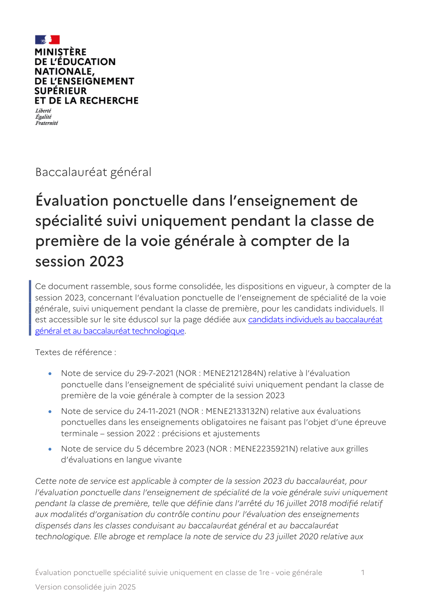

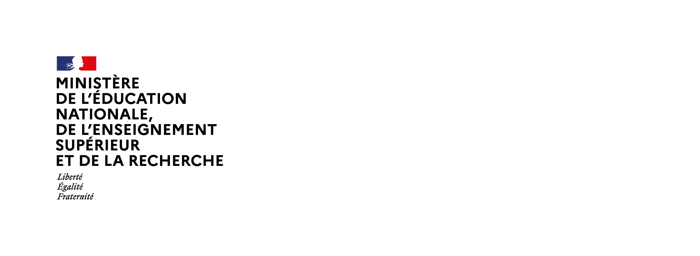

---

## Page 2

évaluations communes des enseignements de spécialité suivis uniquement en classe de
première de la voie générale à compter de la session 2021.

L’évaluation ponctuelle dans l’enseignement de spécialité suivi uniquement pendant la classe
de première est prévue pour les candidats qui ne suivent les cours d’aucun établissement, les
candidats inscrits dans un établissement privé hors contrat, les candidats inscrits dans un
établissement français à l’étranger ne bénéficiant pas d’une homologation pour le cycle
terminal, et les candidats inscrits au Cned en scolarité libre. Ces candidats peuvent choisir de
présenter l’évaluation ponctuelle soit l’année de l’examen, soit de manière anticipée l’année
précédente.

Le format défini dans cette note de service peut être utilisé par le recteur d’académie pour les
évaluations de remplacement organisées par les services académiques à titre exceptionnel, à
l’intention des candidats scolaires inscrits au Cned en scolarité règlementée, lorsque leur
moyenne annuelle dans l’enseignement fait défaut, et pour les candidats sportifs de haut
niveau, sportifs espoirs et sportifs des collectifs nationaux inscrits sur les listes mentionnées à
l’article L.. 221‐2 du Code du sport, qui en font la demande.

Le sujet de cette évaluation ponctuelle est issu de la banque numérique nationale de sujets. Le
résultat obtenu par le candidat est pris en compte pour le baccalauréat avec un coefficient 8,
au titre du contrôle continu, conformément aux dispositions de la note de service du 28 juillet
2021 relative aux modalités d’évaluation des candidats à compter de la session 2022.

Éducation physique, pratiques et culture sportives

Évaluation orale
Durée : 30 minutes (composée de deux parties de 15 minutes chacune) Les deux parties se
déroulent le même jour.

Première partie : pratique physique et sportive

Le candidat choisit, au moment de son inscription à l’examen, une activité physique,
sportive et artistique (Apsa) dans une liste de trois, relevant de trois champs d’apprentissage
différents, proposée par l’académie.

La prestation physique du candidat est notée à l’aide d’un référentiel établi par les autorités
académiques, en référence au cadre national proposé pour l’enseignement de spécialité.

Deuxième partie : compétences et connaissances relatives à la culture
sportive

Disposant de cinq minutes maximum, le candidat présente dans un exposé une
problématique issue de son carnet de suivi en référence au programme de la spécialité.

Le temps restant, lors de l’entretien, les questions du jury permettent d’approfondir
certains éléments de l’exposé du candidat, et d’apprécier sa culture sportive et sa capacité

Évaluation ponctuelle spécialité suivie uniquement en classe de 1re - voie générale        2
Version consolidée juin 2025

---

## Page 3

à faire des liens avec sa propre pratique. L’entretien permet au jury de le solliciter sur ses
connaissances relatives aux thématiques du programme de première.

Barème et notation

Première partie : 10 points

Deuxième partie : 10 points

Carnet de suivi

Ce carnet est transmis au jury au plus tard quinze jours avant l’évaluation de la partie orale.

Le carnet de suivi, de 30 pages maximum en format papier, est constitué tout au long de
l’année. Le candidat y retrace son parcours et ses expériences de pratiquant et des
réflexions personnelles.

Composition du jury

L’évaluation est assurée par deux professeurs de l’éducation nationale intervenant
régulièrement dans l’enseignement de spécialité éducation physique, pratiques et culture
sportives.

Histoire‐géographie, géopolitique et sciences politiques

Évaluation écrite
Durée : 2 heures

Objectifs

L’évaluation porte sur la maîtrise des connaissances du programme de l’enseignement de
spécialité histoire‐géographie, géopolitique et sciences politiques pour la classe de première
défini dans l’arrêté du 17 janvier 2019 paru au BOEN spécial n° 1 du 22 janvier 2019.
L’évaluation évalue les capacités de réflexion et d’analyse, l’aptitude à articuler différents
apports disciplinaires et la qualité de l’expression écrite.

Structure

L’évaluation est une composition qui porte sur le programme de la classe de première.

Elle évalue les capacités d’analyse, la maîtrise des connaissances et la capacité à les
organiser, la capacité à rédiger ainsi que la maîtrise de différents langages. Le sujet de la
composition porte sur l’un des axes ou sur l’objet de travail conclusif d’un thème.

Évaluation ponctuelle spécialité suivie uniquement en classe de 1re - voie générale      3
Version consolidée juin 2025

---

## Page 4

Notation

L’évaluation est notée sur 20 points.

Humanités, littérature et philosophie

Évaluation écrite
Durée : 2 heures

Objectifs

L’évaluation porte sur la maîtrise par le candidat des attendus du programme de
l’enseignement de spécialité humanités, littérature et philosophie pour la classe de
première, défini dans l’arrêté du 17 janvier 2019 paru au BOEN spécial n° 1 du 22 janvier
2019.

Structure

L’évaluation est composée de deux questions sur un texte relatif à l’un des thèmes du
programme de première.

L’une des questions, intitulée Question d’interprétation, appelle un travail portant sur la
compréhension et l’analyse d’un enjeu majeur du texte. L’autre, appelée Question de
réflexion à partir du texte, conduit le candidat à rédiger une réponse étayée à une question
soulevée par le texte.

Chacun de ces deux exercices relève tantôt d’une approche philosophique, tantôt d’une
approche littéraire, selon ce qu’indique explicitement l’intitulé du sujet. Leur articulation
répond au principe de coopération interdisciplinaire propre à cet enseignement de
spécialité. L’ensemble des connaissances acquises est mobilisable à bon escient dans les
deux parties de l’examen.

Les deux questions donnent lieu à des développements d’ampleur comparable et font
l’objet de corrections distinctes, l’une par un correcteur de français, l’autre par un
correcteur de philosophie, selon l’orientation disciplinaire respective des exercices.

Notation

Chaque question est notée sur 10. La somme des deux notes constitue la note globale
unique de l’évaluation.

Langues, littératures et cultures étrangères et régionales

Évaluation orale
Durée : 20 minutes (sans préparation)

Évaluation ponctuelle spécialité suivie uniquement en classe de 1re - voie générale     4
Version consolidée juin 2025

---

## Page 5

Objectifs

L’évaluation porte sur la maîtrise par le candidat des attendus du programme de
l’enseignement de spécialité langues, littératures et cultures étrangères et régionales pour la
classe de première, défini dans l’arrêté modifié du 17 janvier 2019.

Structure

L’évaluation consiste en un oral de 20 minutes qui s’appuie sur un dossier personnel
présenté par le candidat.

Le candidat remet un exemplaire de son dossier à l’examinateur au début de sa prise de
parole et en conserve un qu’il utilise selon ses besoins durant l’évaluation.

Le candidat présente son dossier dans la langue cible pendant 10 minutes au plus pour en
justifier les choix et en exprimer la logique interne, puis interagit avec l’examinateur dans la
langue cible pendant 10 minutes.

Si le candidat ne présente pas de dossier, l’examinateur lui remet trois documents de nature
différente en lien avec une des thématiques du programme de première. Le candidat
commente ces documents.

Le dossier est composé de trois à cinq documents textuels et/ou iconographiques dont le fil
conducteur se rattache à l’une des deux thématiques du programme de première. Il est
composé de documents choisis parmi les listes suivantes :

Pour la spécialité LLCER autre que anglais, monde contemporain

   •   une des œuvres intégrales étudiées en classe de première (œuvre matérialisée par un
       extrait ou une illustration) ;
   •   au moins un texte littéraire, sans se limiter au genre romanesque ; le candidat peut
       prendre appui sur les annexes publiées avec le programme de la classe de première
       mais peut, s’il le juge pertinent, enrichir son dossier de textes littéraires de son choix ;
   •   au plus deux œuvres d’art visuel (affiche, caricature, dessin, extrait de film, peinture,
       sculpture, etc.) ;
   •   au moins un texte non littéraire (article de presse, extrait de discours, d’essai, etc.).

Pour la spécialité LLCER anglais, monde contemporain

   •   au moins un article de presse ;
   •   un texte d’une autre nature ;
   •   un document iconographique.

Niveau attendu : B2

Évaluation ponctuelle spécialité suivie uniquement en classe de 1re - voie générale              5
Version consolidée juin 2025

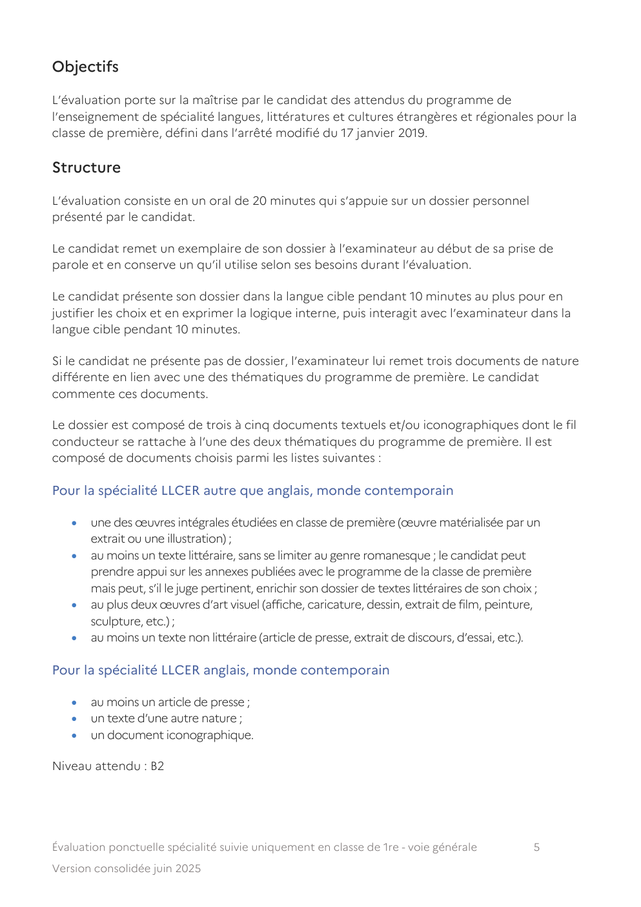

---

## Page 6

Notation

L’évaluation est notée sur 20 points. La grille d’évaluation présente en annexe est fournie
aux correcteurs.

Candidats en situation de handicap

Les dispenses et aménagements de l’évaluation sont accordés conformément à l’arrêté du
22 juillet 2019 modifié relatif aux dispenses et aménagements d’épreuves de langue vivante
pour les candidats au baccalauréat général et technologique présentant tout trouble
relevant du handicap, publié au JO du 27 août 2019.

Littérature et langues et cultures de l’Antiquité

Évaluation orale
Durée : 15 minutes (précédée d’une préparation de 30 minutes)

Objectifs

L’évaluation apprécie les compétences de traduction et de lecture en prenant en compte :

        •   les connaissances linguistiques ;
        •   la capacité à comprendre le texte et à le rendre dans la langue cible ;
        •   la capacité à proposer une analyse littéraire et interprétative de l’extrait ;
        •   la capacité à répondre aux questions, à justifier ses choix de traduction et
            d’interprétation ainsi qu’à revenir, le cas échéant, sur sa traduction ou son
            commentaire lors de l’entretien.

De manière complémentaire, elle apprécie aussi les points suivants :

        •   la capacité à mobiliser les autres textes étudiés durant l’année scolaire ;
        •   la culture générale sur les autres objets d’étude étudiés durant l’année scolaire ;
        •   les lectures personnelles ;
        •   les connaissances dans l’autre langue ancienne éventuellement étudiée par le
            candidat durant sa scolarité dans les classes du lycée.

Structure

Le candidat fournit à l’examinateur la liste des textes étudiés pendant l’année, organisés
selon les trois objets d’étude qui ont été traités durant l’année parmi ceux définis dans
l’arrêté du 17 janvier 2019 paru au BOEN spécial n° 1 du 22 janvier 2019. L’objet d’étude
« Méditerranée : conflits, influences et échanges » fait l’objet d’un traitement obligatoire. La
liste comporte un minimum de douze textes (latins ou grecs suivant l’enseignement auquel
est inscrit le candidat), avec un minimum de trois textes par objet d’étude. Chaque texte a
une longueur minimale d’une quinzaine de lignes ou vers.

Évaluation ponctuelle spécialité suivie uniquement en classe de 1re - voie générale        6
Version consolidée juin 2025

---

## Page 7

Le candidat est tenu de présenter deux exemplaires, sans traduction, de chacun des textes
étudiés durant l’année. Chaque texte devra comporter les mentions obligatoires suivantes :
titre du passage, auteur, œuvre, références du passage retenu. Le texte peut,
éventuellement, être accompagné d’un court paratexte.

L’examinateur choisit, dans la liste des extraits présentée par le candidat, un texte.

Le candidat dispose d’un dictionnaire latin‐français ou grec‐français pendant le temps de
préparation.

Préparation (30 minutes)

   a) L’examinateur propose au candidat un passage représentant environ un tiers de
      l’extrait retenu (cinq lignes ou vers) ; le candidat doit traduire ce segment en veillant à
      en proposer une traduction à la fois élégante et fidèle au texte en langue ancienne.
   b) Le candidat doit préparer un commentaire de l’ensemble de l’extrait retenu en le
      mettant en perspective avec l’objet d’étude du programme correspondant.

Interrogation (10 minutes)

   a) Le candidat situe l’extrait ; il lit et traduit les lignes ou vers choisis par l’examinateur.
   b) Le candidat commente l’ensemble du texte en le mettant en perspective avec l’objet
      d’étude du programme correspondant.

Entretien (5 minutes)

Un temps d’entretien permet alors à l’examinateur de revenir sur quelques points de la
traduction et/ou du commentaire.

Notation

L’épreuve est notée sur 20 points.

Mathématiques

Évaluation écrite
Durée : 2 heures

Objectifs

L’évaluation porte sur la maîtrise par le candidat des contenus, compétences et capacités
attendues figurant au programme de l’enseignement de spécialité mathématiques de la
classe de première, défini dans l’arrêté du 17 janvier 2019 paru au BOEN spécial n° 1 du 22
janvier 2019.

Évaluation ponctuelle spécialité suivie uniquement en classe de 1re - voie générale         7
Version consolidée juin 2025

---

## Page 8

Structure

L’évaluation est composée de deux à quatre exercices indépendants qui abordent une
grande variété de contenus et de capacités figurant dans le programme.

Notation

L’évaluation est notée sur 20 points. Chaque exercice est noté entre 5 et 12 points. La note
finale est composée de la somme des points obtenus à chaque exercice.

Numérique et sciences informatiques

Évaluation écrite
Durée : 2 heures

Objectifs

L’évaluation porte sur la maîtrise par le candidat des attendus du programme de
l’enseignement de spécialité numérique et sciences informatiques pour la classe de
première, défini dans l’arrêté du 17 janvier 2019 paru au Bulletin officiel spécial de
l’éducation nationale n° 1 du 22 janvier 2019.

Structure

L’évaluation consiste en un questionnaire à choix multiples divisé en 7 parties, une pour
chaque thématique du programme. Chaque partie comporte 6 questions. Pour chaque
question, 4 réponses sont proposées dont une seule est correcte.

L’usage de la calculatrice est interdit.

Notation

Pour chacune des 42 questions, le candidat gagne 1 point pour la réponse correcte et
obtient un résultat nul pour une réponse fausse, une absence de réponse ou une réponse
multiple.

Le résultat obtenu est transformé en note sur 20 selon la formule : nombre de points
obtenus × 20/42.

Physique‐chimie

Évaluation écrite
Durée : 2 heures

Évaluation ponctuelle spécialité suivie uniquement en classe de 1re - voie générale      8
Version consolidée juin 2025

---

## Page 9

Objectifs

L’évaluation porte sur les notions et contenus, capacités exigibles et compétences figurant
dans le programme de l’enseignement de spécialité physique‐chimie de la classe de
première, défini dans l’arrêté du 17 janvier 2019 paru au BOEN spécial n° 1 du 22 janvier
2019. Les capacités expérimentales identifiées dans le programme précité sont incluses dans
le périmètre de l’évaluation.

Structure

L’évaluation comporte deux parties indépendantes d’importances voisines, d’une durée
d’un peu moins d’une heure chacune. L’évaluation accorde un poids équivalent aux deux
composantes physique et chimie de la discipline, aborde plusieurs thèmes du programme
et accorde une place notable à la modélisation et à la résolution de tâches complexes. Les
sujets traités lors de cette évaluation portent sur des situations contextualisées, peuvent
contenir des documents et inclure des questions relatives aux aspects expérimentaux de la
discipline et aux capacités numériques identifiées dans le programme.

Le sujet précise si l’usage de la calculatrice, dans les conditions précisées par les textes en
vigueur, est autorisé.

Notation

L’évaluation est notée sur 20 points. Chaque partie compte pour 10 points. La note finale
est composée de la somme des points obtenus à chacune des parties.

Sciences de la vie et de la Terre

Évaluation écrite
Durée : 2 heures

Objectifs

L’évaluation porte sur les notions, contenus et compétences, y compris expérimentales,
figurant dans le programme de l’enseignement de spécialité sciences de la vie et de la Terre
de la classe de première défini par l’arrêté du 17 janvier 2019 paru au BOEN spécial n° 1 du
22 janvier 2019.

Structure

L’évaluation écrite s’appuie sur la totalité du programme en sciences de la vie et en sciences
de la Terre. Elle est constituée de deux exercices, qui ne peuvent pas porter sur les mêmes
parties du programme. L’exercice 1 permet d’évaluer la maîtrise des connaissances acquises
et la manière dont le candidat les mobilise et les organise pour répondre à une question
scientifique. Le questionnement peut se présenter sous forme d’une question scientifique
et/ou de QCM, en appui ou non sur un ou plusieurs documents. L’exercice 2 permet

Évaluation ponctuelle spécialité suivie uniquement en classe de 1re - voie générale      9
Version consolidée juin 2025

---

## Page 10

d’évaluer la pratique du raisonnement scientifique du candidat. Il permet de tester sa
capacité à pratiquer une démarche scientifique dans le cadre d’un problème scientifique, à
partir de l’exploitation d’un document ou d’un ensemble de documents et en mobilisant
ses connaissances. Le questionnement amène le candidat à choisir et exposer sa démarche
personnelle, à élaborer son argumentation et à proposer une conclusion.

L’usage de la calculatrice est interdit.

Notation

L’évaluation est notée sur 20 points, chaque exercice est noté sur 10 points. La note finale
est composée de la somme des points obtenus à chacune des parties.

Sciences de l’ingénieur

Évaluation écrite
Durée : 2 heures

Objectifs

L’évaluation porte sur le niveau de maîtrise par les candidats des compétences et
connaissances associées au programme de l’enseignement de spécialité sciences de
l’ingénieur de la classe de première défini par l’arrêté du 17 janvier 2019 paru au BOEN
spécial n° 1 du 22 janvier 2019.

Structure

Le sujet comporte deux exercices indépendants l’un de l’autre, équilibrés en durée et en
difficulté, qui s’appuient sur un produit unique.

Un premier exercice s’intéresse à l’étude d’une performance du produit. Les candidats
doivent mobiliser leurs compétences et les connaissances associées pour qualifier et/ou
quantifier cette performance, à partir de l’analyse, de la modélisation de tout ou partie du
produit ou de relevés expérimentaux.

Le second exercice porte sur la commande du fonctionnement d’un produit ou la
modification de son comportement. L’étude s’appuie sur l’algorithmique et de la
programmation, à partir de ressources fournies au candidat qu’il devra exploiter, compléter
ou modifier.

L’usage de la calculatrice est autorisé dans les conditions précisées par les textes en vigueur.

Notation

L’évaluation est notée sur 20 points, chaque exercice est noté sur 10 points. La note finale
est composée de la somme des points obtenus à chacune des parties.

Évaluation ponctuelle spécialité suivie uniquement en classe de 1re - voie générale    10
Version consolidée juin 2025

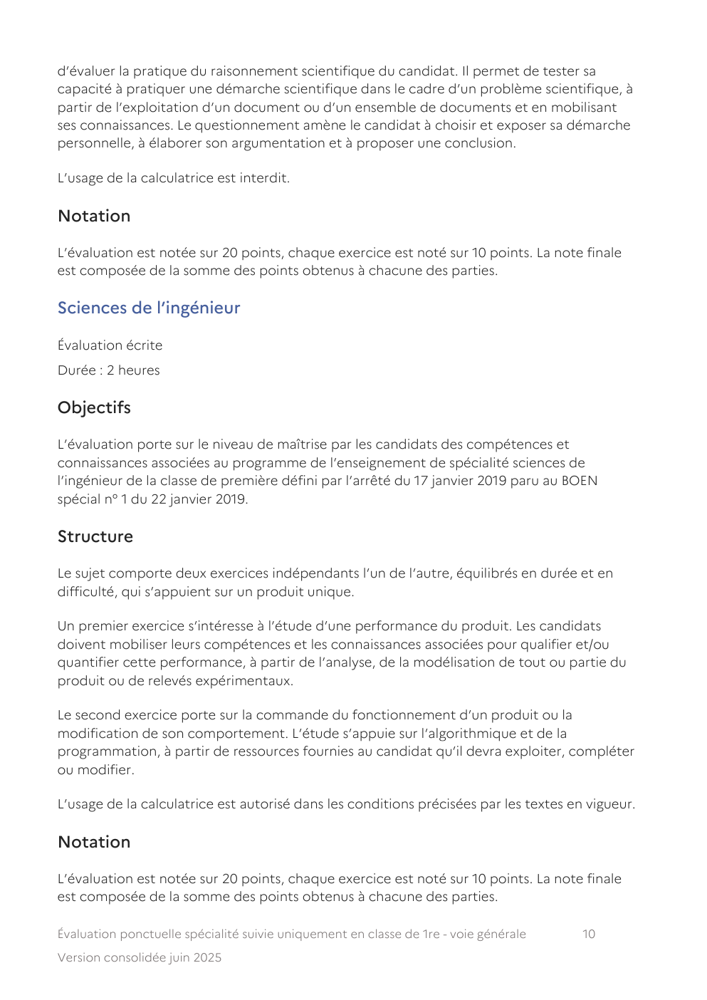

---

## Page 11

L’évaluation fait l’objet d’une fiche individuelle d’évaluation, établie selon le modèle fourni
dans la banque nationale de sujets.

Sciences économiques et sociales

Évaluation écrite
Durée : 2 heures

Objectifs

L’évaluation porte sur les notions et contenus, capacités et compétences figurant dans
l’ensemble du programme de l’enseignement de spécialité sciences économiques et
sociales de la classe de première défini par l’arrêté du 17 janvier 2019 paru au BOEN spécial
n° 1 du 22 janvier 2019.

Structure

L’évaluation est constituée de deux parties.

La première partie repose sur la mobilisation des connaissances et le traitement de
l’information. Elle comporte soit un exercice conduisant à une résolution graphique (sans
formalisation mathématique), soit une étude d’un document de nature statistique
comportant une ou plusieurs questions (tableau, graphique, carte, radar, etc.) de 120
données chiffrées au maximum. Il est demandé au candidat de répondre aux questions en
mobilisant les connaissances acquises dans le cadre du programme, en adoptant une
démarche méthodologique rigoureuse de collecte et d’exploitation de données
quantitatives, et en ayant recours le cas échéant à des résolutions graphiques.

La seconde partie demande un raisonnement appuyé sur un dossier documentaire. Le
candidat est invité à développer un raisonnement de l’ordre d’une page en exploitant les
documents du dossier et en mobilisant les connaissances acquises dans le cadre du
programme. Le dossier documentaire comprend deux documents ; ils sont de nature
différente : texte de 2 000 signes au maximum, document de nature statistique de 65
données au maximum.

L’évaluation est construite de façon à couvrir plusieurs dimensions du programme : les deux
parties de l’évaluation portent sur deux champs différents du programme (sciences
économiques, sociologie et sciences politiques, regards croisés).

Notation

L’évaluation est notée sur 20 points avec une première partie sur 10 points et une seconde
sur 10 points. La note finale est composée de la somme des points obtenus à chacune des
parties. Il est tenu compte, dans la notation, de la clarté de l’expression et du soin apporté à
la présentation.

Évaluation ponctuelle spécialité suivie uniquement en classe de 1re - voie générale    11
Version consolidée juin 2025

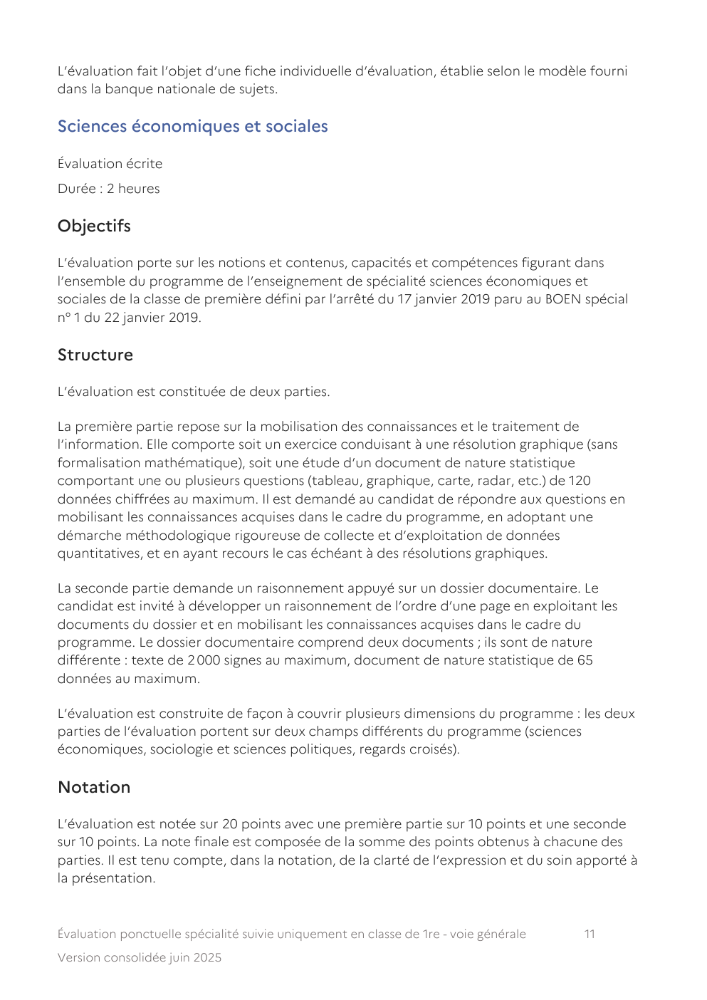

---

## Page 12

Arts

Évaluation orale
Durée : 30 minutes (sans préparation)

Objectifs

L’évaluation porte sur la capacité du candidat à mobiliser des acquis relevant de la pratique
et de la culture dans l’enseignement artistique dans la spécialité choisie lors de son
inscription à l’examen du baccalauréat, conformément au programme de l’enseignement
de spécialité arts de la classe de première défini par l’arrêté du 17 janvier 2019 paru au BOEN
spécial n° 1 du 22 janvier 2019.

Elle doit lui permettre de manifester des compétences pratiques dans le domaine artistique,
d’exprimer sa sensibilité, de faire état d’une culture personnelle, de témoigner de sa
maîtrise d’un vocabulaire spécifique et de recul critique ainsi que de son aptitude à
argumenter et à dialoguer avec le jury.

Structure

Pour chacun des enseignements artistiques, l’évaluation se déroule en deux parties
consécutives :

   •   première partie : compétences pratiques (15 min) ;
   •   deuxième partie : connaissances et compétences culturelles (15 min).

Chaque partie de l’évaluation fait se succéder une présentation par le candidat et un
entretien avec le jury dont les durées sont définies pour chacune des parties selon leur
spécificité.

Déroulement et notation pour chaque enseignement artistique

Arts du cirque

Première partie : compétences relatives à la pratique circassienne

Dans un premier temps, le jury et le candidat disposent de 5 à 7 minutes maximum. Le
candidat propose au jury une composition circassienne originale qui n’excède pas 5
minutes. Puis, le candidat expose et justifie les intentions et les choix qui ont présidé à la
composition et à l’interprétation. Cette proposition de numéro doit permettre au candidat
de témoigner de ses compétences artistiques et de sa pratique d’une discipline de cirque.

Le temps restant, lors de l’entretien, les questions du jury amènent le candidat à compléter
et approfondir ses réponses. Elles visent à apprécier ses capacités d’analyse et sa réflexion
sur sa propre pratique en lien avec sa culture circassienne.

Évaluation ponctuelle spécialité suivie uniquement en classe de 1re - voie générale   12
Version consolidée juin 2025

---

## Page 13

Deuxième partie : connaissances et compétences relatives à la culture circassienne

Disposant de cinq minutes maximum, dans un premier temps, le candidat présente
sommairement les différents éléments de son parcours de formation en enseignement de
spécialité d’arts du cirque, éléments consignés dans son carnet de bord, de travail ou de
création. Puis, ayant choisi une notion, un spectacle, une expérience qui ont
particulièrement retenu son attention et nourri sa réflexion, il en donne les raisons dans un
exposé.

Le temps restant, lors de l’entretien, les questions du jury permettent au candidat de
compléter et d’approfondir certains éléments de son exposé, d’apprécier sa culture
circassienne et sa capacité à faire des liens avec sa propre pratique. Le jury l’interroge sur
ses connaissances relatives aux autres thématiques consignées dans le carnet de bord.

Barème et notation

L’évaluation porte sur les compétences travaillées et les attendus figurant au programme de
l’enseignement de spécialité d’arts du cirque en classe de première. Un carnet de bord, de
création ou de travail sert de point d’appui à la prestation orale et à l’interrogation, il n’est
pas évalué en lui‐même.

Chaque partie de l’évaluation est notée sur 10 points.

Document de synthèse et carnet de bord

Le carnet de bord, de 30 pages maximum en format papier, est constitué tout au long de
l’année de première. Le candidat y retrace ses expériences d’artiste, de spectateur, de
critique et de chercheur selon les visées du programme. Le document de synthèse présente,
de manière sommaire en une page, l’organisation du travail de l’année.

Arts plastiques

Première partie : compétences relatives à la pratique plastique

Disposant de cinq à sept minutes maximum, s’appuyant également sur son carnet de travail,
le candidat présente deux réalisations plastiques abouties qu’il a choisies et qu’il apporte le
jour de l’évaluation. Elles sont issues du travail conduit dans le cadre du travail de l’année. Il
justifie son choix au regard des questionnements plasticiens abordés.

Le temps restant, dans un dialogue avec le jury, le candidat est amené à compléter et
argumenter sa présentation, préciser ses démarches et projets, témoigner de la maîtrise des
compétences plasticiennes qu’il a mobilisées.

Indications :

Les réalisations présentées doivent pouvoir être transportées par le candidat dans la salle
d’examen sans aide extérieure et installées sans nécessiter ni temps additionnel ni dispositif

Évaluation ponctuelle spécialité suivie uniquement en classe de 1re - voie générale     13
Version consolidée juin 2025

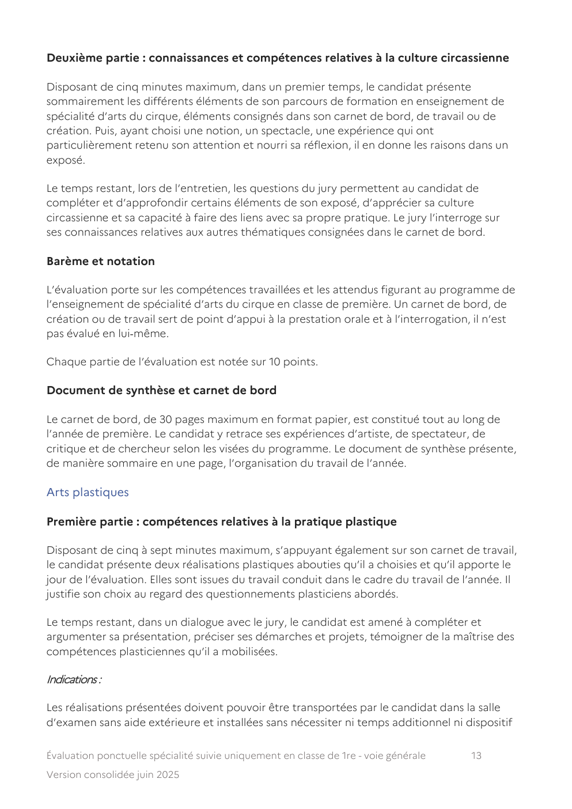

---

## Page 14

particulier d’accrochage ou de présentation. Elles ne sont pas manipulées par le jury. La
photographie et la vidéo sont employées pour restituer les réalisations bidimensionnelles et
tridimensionnelles de très grand format ou de très gros volume, ainsi que celles impliquant
la durée ou le mouvement, celles en relation à un espace architectural ou naturel, à un
dispositif de présentation ou à la réalisation d’une exposition. La restitution des pratiques
strictement numériques comme les visualisations nécessitant la vidéo ou l’infographie est
conduite avec du matériel informatique. Le visionnement de ces documents doit s’inclure
dans le temps de présentation. Le candidat est responsable du matériel informatique requis
et de son bon fonctionnement. Il prévoit des versions imprimées à présenter en cas d’une
éventuelle panne.

Le carnet de travail est un objet personnel ; il témoigne des projets, des démarches, des
aboutissements, des expériences, des références ayant jalonné l’année. Sa forme et ses
données matérielles sont libres, dans les limites d’un format qui ne peut excéder 45 x 60 cm
et 5 cm d’épaisseur. Il peut être numérique. Dans ce cas, il doit pouvoir être consulté par le
jury avec un matériel informatique et utilisé rapidement durant l’évaluation. Ce carnet de
travail doit permettre au jury d’établir un dialogue plus fécond avec le candidat, une
meilleure compréhension de ses démarches, d’apprécier ses capacités de travail et les
recherches qu’il a menées, qu’elles soient abouties ou non. Sans s’y limiter, il vient en
complément ou en appui des réalisations présentées.

Deuxième partie : connaissances et compétences relatives à la culture plastique et
artistique

Disposant de cinq minutes maximum, le candidat présente une œuvre choisie par le jury
parmi un corpus de 5 œuvres accompagnant le document de synthèse. Il en énonce
sommairement les données (plastiques, sémantiques, iconiques, etc.) et les met en relation
avec des questionnements, compétences et connaissances travaillés en classe.

Le temps restant, dans une forme dialoguée, le jury permet au candidat de compléter
certains des aspects qu’il a exposés. Il l’amène à préciser sa compréhension des langages et
des pratiques plastiques, à mobiliser des références culturelles pertinentes. Le candidat
peut, autant que nécessaire, prendre appui sur le corpus d’œuvres ainsi que sur son carnet
de travail pour établir des liens avec son parcours de formation, avec des questionnements
et connaissances travaillés ou bien avec des expériences vécues, des lieux culturels visités,
des rencontres artistiques pendant l’année.

Barème et notation

L’évaluation porte sur les compétences travaillées et les attendus figurant au programme de
l’enseignement de spécialité d’arts plastiques en classe de première. Les réalisations
plastiques et le carnet de travail servent de point d’appui à la prestation orale, ils ne sont
pas évalués. Chaque partie de l’évaluation est notée sur 10 points.

Évaluation ponctuelle spécialité suivie uniquement en classe de 1re - voie générale   14
Version consolidée juin 2025

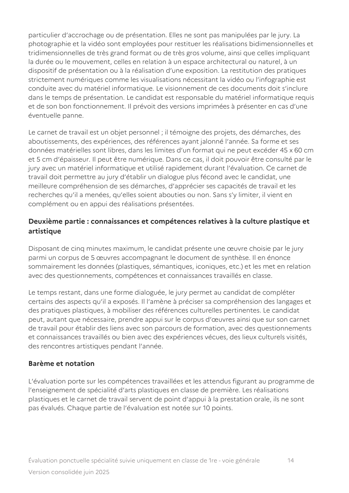

---

## Page 15

Document de synthèse et carnet de travail

Le document de synthèse incluant un corpus de 5 œuvres et le carnet de travail sont
rapportés par le candidat et remis au jury au moment de l’épreuve.

Le document de synthèse décrit sommairement en une page l’organisation du travail de
l’année. Le corpus, défini par le candidat, est constitué de reproductions imprimées en
couleur de 5 œuvres travaillées durant l’année et en correspondance avec les
questionnements du programme. Chaque reproduction est revêtue d’informations
présentées comme suit : Prénom Nom de l’artiste, Titre de l’œuvre, date, matériaux,
dimensions en cm. Lieu de conservation/de présentation (selon le cas).

Cinéma‐audiovisuel

Première partie : compétences relatives à la pratique du cinéma‐audiovisuel

Disposant de cinq à sept minutes maximum, le candidat présente son projet de création en
mettant en lumière ses intentions, sa démarche et son engagement personnel. Il s’appuie
sur les documents consignés dans son carnet de création et sur des extraits de sa réalisation
audiovisuelle.

Le temps restant, dans une forme dialoguée, le jury invite le candidat à développer et
approfondir sa réflexion sur la démarche créative engagée. Le jury peut lui proposer de
varier l’un des paramètres de son projet (à l’échelle d’un plan, d’une séquence ou d’un parti
pris global) et d’en apprécier les conséquences artistiques et cinématographiques.

Indications :

La réalisation audiovisuelle est enregistrée sur un support (DVD, fichier audiovisuel sur clé
USB).

Deuxième partie : connaissances et compétences relatives à la culture du cinéma‐
audiovisuel

Disposant de cinq minutes maximum, le candidat présente l’une des œuvres
cinématographiques, sélectionnée par le jury dans la liste transmise avant l’évaluation et
accompagnant le document de synthèse.

Le temps restant, dans une forme dialoguée, le jury invite le candidat à développer et
approfondir sa réflexion sur l’œuvre cinématographique présentée. Il l’amène à affiner sa
compréhension de celle‐ci, à caractériser son écriture et son contexte de création, à
mobiliser des références culturelles pertinentes et sa connaissance des questionnements du
programme de première.

Évaluation ponctuelle spécialité suivie uniquement en classe de 1re - voie générale   15
Version consolidée juin 2025

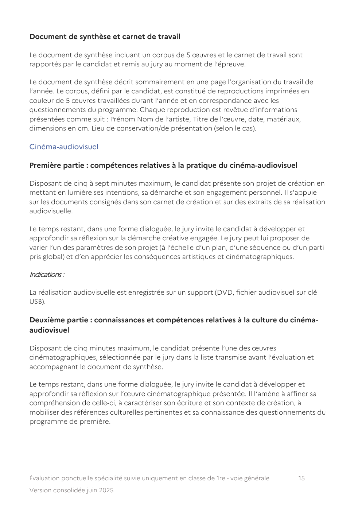

---

## Page 16

Barème et notation

L’évaluation porte sur les compétences travaillées et les attendus figurant au programme de
l’enseignement de spécialité de cinéma‐audiovisuel en classe de première. La réalisation
audiovisuelle et le carnet de création servent de point d’appui à la prestation orale, ils ne
sont pas évalués. Chaque partie de l’évaluation est notée sur 10 points.

Document de synthèse et carnet de création

Le carnet de création et le document de synthèse, ainsi que la réalisation audiovisuelle, sont
transmis au jury au plus tard quinze jours avant l’évaluation. Le document de synthèse décrit
sommairement, en une page, l’organisation du travail de l’année. Il est accompagné de la
liste des œuvres cinématographiques retenues par le candidat (de 4 à 6) en lien avec les
questionnements du programme de première.

Danse

Première partie : compétences relatives à la pratique de la danse

Dans un premier temps, le candidat présente au jury une composition chorégraphique
originale, de deux à quatre minutes, qu’il interprète seul.

Le temps restant, lors de l’entretien suivant cette interprétation, les questions du jury
amènent le candidat à exposer et à justifier les intentions et les choix qui ont présidé à la
composition et à l’interprétation. Elles visent à apprécier ses capacités d’analyse et sa
réflexion sur sa propre pratique en lien avec sa culture chorégraphique.

Deuxième partie : connaissances et compétences relatives à la culture
chorégraphique et artistique

Disposant de cinq minutes maximum, le candidat présente dans un exposé une
problématique issue de son carnet de bord en référence au programme limitatif et à l’un
des thèmes d’étude du programme de première de l’enseignement de spécialité.

Le temps restant, lors de l’entretien les questions du jury permettent d’approfondir certains
éléments de l’exposé du candidat, et d’apprécier sa culture chorégraphique et sa capacité à
faire des liens avec sa propre pratique. L’entretien permet au jury de le solliciter sur ses
connaissances relatives aux autres thématiques étudiées durant l’année et identifiées par le
document de synthèse initialement transmis au jury.

Barème et notation

L’évaluation porte sur les compétences travaillées et les attendus figurant au programme de
l’enseignement de spécialité en danse en classe de première. Le carnet de bord sert de
point d’appui à la prestation orale, il n’est pas évalué. Chaque partie de l’évaluation est
notée sur 10 points. Pour la première partie, 5 points portent sur les compétences de
danseur.

Évaluation ponctuelle spécialité suivie uniquement en classe de 1re - voie générale    16
Version consolidée juin 2025

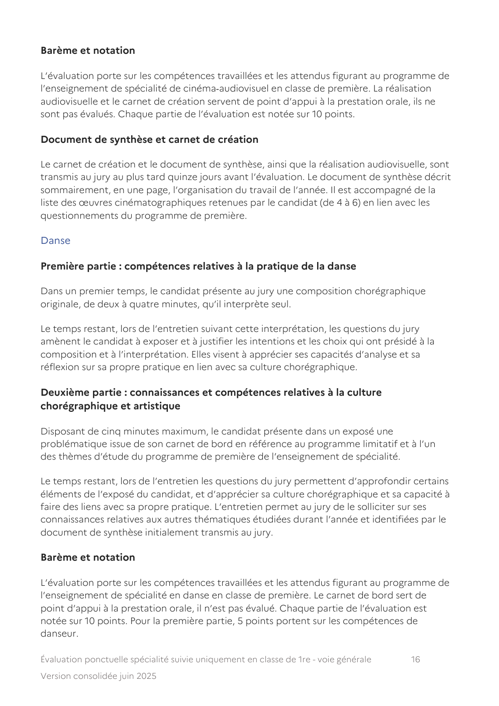

---

## Page 17

Document de synthèse et carnet de bord

Ces documents sont transmis au jury au plus tard quinze jours avant l’évaluation.

Le carnet de bord, de 30 pages maximum en format papier, est constitué tout au long de
l’année. Le candidat y retrace ses expériences de danseur, de chorégraphe, de spectateur,
de critique et de chercheur selon les visées du programme.

Le candidat rédige un document de synthèse présentant la liste des questionnements
relatifs aux deux thèmes d’étude définis par le programme et étudiés durant l’année.

Histoire des arts

Première partie : compétences pratiques

Le candidat présente au jury le projet qu’il a développé au cours de l’année en lien avec un
lieu ou un partenaire patrimonial ou culturel local. Sa présentation, de cinq à sept minutes
maximum, témoigne de l’expérience que, dans le cadre du projet, il a acquise du patrimoine
de proximité. Elle valorise son action au regard des objectifs de la classe de première. Elle
peut s’appuyer sur tout travail personnel susceptible d’aider le jury à apprécier le projet et
son lien au patrimoine de proximité : photographies, captations, enregistrements,
diaporama, éléments d’exposition, et toute forme de document numérique apporté par le
candidat.

Le temps restant, l’entretien permet au jury d’approfondir certains aspects de l’exposé du
candidat ; il vise également à le mettre en relation avec son parcours de formation,
notamment en histoire des arts, avec des expériences vécues, des lieux culturels visités, des
rencontres artistiques. Le jury apprécie la qualité de la présentation et de la prestation orale
du candidat, ainsi que l’investissement dont il a fait preuve, ainsi que la familiarité dont il
témoigne avec le patrimoine de proximité et les structures patrimoniales et culturelles.

Indications :

Pour intégrer des supports et documents numériques à sa présentation, le candidat peut
utiliser s’il le désire un ordinateur personnel et, si la salle d’examen en dispose, un
vidéoprojecteur.

Deuxième partie : connaissances et compétences culturelles

Le candidat présente au jury une des œuvres constituant son dossier d’œuvres, par un
exposé qui n’excède pas 5 minutes, argumenté, appuyé sur des éléments précis d’analyse
reliés à sa connaissance de la thématique correspondante. À l’appui de son raisonnement, il
fait référence à d’autres œuvres présentes ou non dans le dossier d’œuvres, qu’il sait situer
et convoquer à bon escient, ainsi que relier à la thématique du programme. S’il s’agit d’une
œuvre musicale ou audiovisuelle, il peut appuyer son exposé sur la diffusion d’un ou
plusieurs brefs extraits de l’œuvre.

Évaluation ponctuelle spécialité suivie uniquement en classe de 1re - voie générale    17
Version consolidée juin 2025

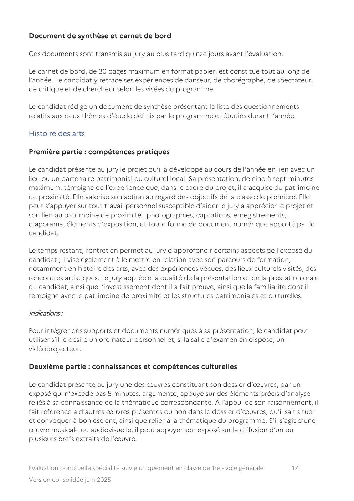

---

## Page 18

Le temps restant, l’entretien permet au jury de solliciter le candidat sur ses connaissances
relatives aux différentes thématiques du programme étudiées durant l’année. En appui à cet
entretien, le jury peut l’engager à s’exprimer sur une autre œuvre du dossier d’œuvres,
comme à mettre en perspective sa connaissance des œuvres étudiées durant l’année,
listées dans le document de synthèse, avec d’autres, supposées inconnues, proposées par le
jury. Outre les compétences d’expression orale, le jury apprécie la cohérence de
l’argumentation et le bien‐fondé de la mise en relation, l’exactitude des éléments d’analyse,
la connaissance des thématiques du programme, l’approche personnelle que le candidat
montrera des œuvres et sa capacité à les questionner au‐delà de la description.

Barème et notation

L’évaluation porte sur les compétences travaillées et les attendus figurant au programme de
l’enseignement de spécialité d’histoire des arts en classe de première. Les supports
présentés par le candidat dans la première partie de l’évaluation ne sont pas évalués pour
eux‐mêmes, mais seulement dans l’usage qu’il en fait dans le cadre de sa présentation.
Chaque partie de l’évaluation est notée sur 10 points.

Document de synthèse et dossier d’œuvres

Ces documents sont remis par le candidat le jour de l’épreuve. Le document de synthèse
présente, de manière sommaire, un résumé du projet mené dans le cadre du programme de
première et un récapitulatif des principaux voyages, sorties, partenariats, rencontres avec
des œuvres ou des professionnels effectués par le candidat au cours de l’année. Il
comprend la liste des œuvres principales et des œuvres complémentaires étudiées dans le
cadre des six thématiques du programme de première.

Le dossier d’œuvres qui l’accompagne contient, sous forme numérique et, pour les œuvres
visuelles, imprimée, un corpus de huit à douze œuvres de natures, d’époques et
d’expressions artistiques diverses, parmi celles citées dans le document de synthèse à
l’appui de quatre thématiques au moins du programme de première ; chacune des œuvres
est référencée et reliée à une thématique du programme.

Musique

Première partie : compétences relatives à la pratique musicale

Disposant de cinq à sept minutes maximum, le candidat présente et diffuse
l’enregistrement audio‐vidéo d’une pièce musicale qui peut être une création originale, un
arrangement ou une interprétation d’une œuvre préexistante. Elle est issue du travail mené
avec d’autres instrumentistes et/ou chanteurs (sans excéder 5 musiciens en tout) durant
l’année. La présentation initiale, adossée à une ou plusieurs thématiques issues du
programme du cycle terminal, souligne les caractéristiques musicales, techniques,
esthétiques de la pièce interprétée, présente la démarche de travail mise en œuvre et le
rôle qu’y tient le candidat.

Évaluation ponctuelle spécialité suivie uniquement en classe de 1re - voie générale   18
Version consolidée juin 2025

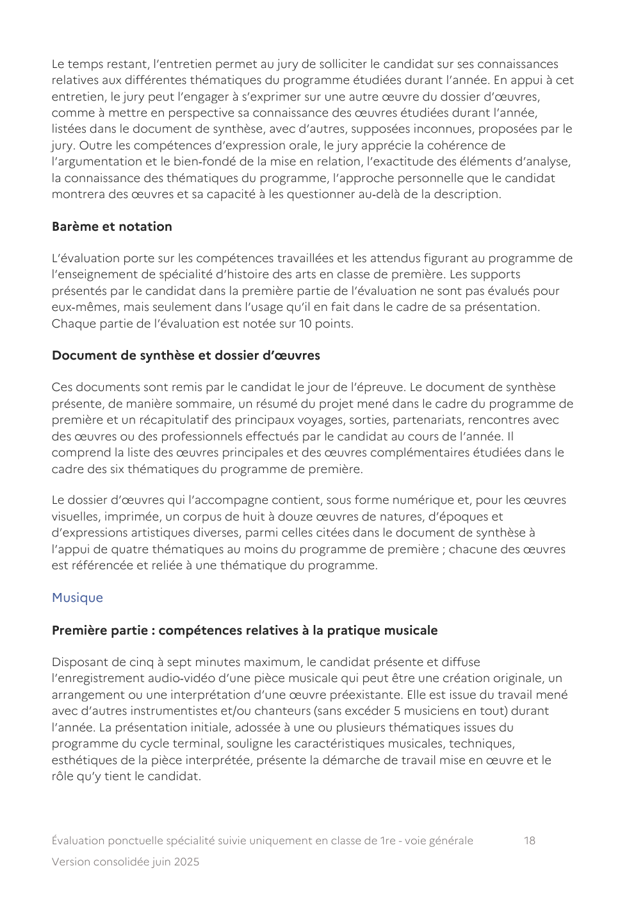

---

## Page 19

Le temps restant, l’entretien permet au jury d’interroger le candidat sur certains aspects de
l’interprétation proposée, d’approfondir certains points de la présentation initiale et de
mettre en lien le travail présenté avec au moins une des thématiques issues du programme
du cycle terminal et étudiée pendant l’année et dont témoigne le document de synthèse
transmis au jury en amont de l’épreuve.

Deuxième partie : connaissances et compétences relatives à la culture musicale et
artistique

L’exposé s’appuie sur le document de synthèse transmis au jury en amont de l’épreuve.
Disposant de cinq minutes maximum, le candidat présente une problématique particulière
issue d’un choix d’éléments figurant dans son document de synthèse qu’il présente
brièvement en soulignant les liens qu’ils entretiennent d’une part entre eux et d’autre part
avec une ou plusieurs des thématiques issues des champs de questionnement du
programme du cycle terminal et étudiées durant l’année. En complément, au départ d’une
œuvre de son choix, le candidat en fait une présentation personnelle approfondie pouvant
être illustrée par de brefs extraits, soit diffusés durant l’évaluation, soit chantés, soit joués
sur un piano mis à sa disposition ou sur un instrument qu’il aura apporté. Il est amené à
mettre en lien cette œuvre choisie avec d’autres pièces ne figurant pas dans son document
de synthèse, mais qui lui semblent entretenir avec elle des liens particuliers. Dans cette
perspective, il a la possibilité d’en faire écouter de brefs extraits préparés sur un support
numérique adapté.

Le temps restant, l’entretien permet au jury d’approfondir certains aspects de l’exposé du
candidat comme de le solliciter sur ses connaissances relatives aux autres thématiques
étudiées durant l’année scolaire et identifiées par le document de synthèse transmis au jury.
En appui à cet entretien, le jury peut proposer l’écoute de brefs extraits musicaux
engageant le candidat à mettre en perspective sa connaissance des œuvres étudiées durant
l’année avec celles, supposées inconnues, proposées par le jury. Ce second entretien
permet également au jury d’interroger le candidat sur les apports de son parcours de
formation musicale dans la perspective de la poursuite de ses études en classe terminale
puis dans l’enseignement supérieur.

Barème et notation

L’évaluation porte sur les compétences travaillées et les attendus figurant au programme de
l’enseignement de spécialité en musique en classe de première. Chaque partie de
l’évaluation est notée sur 10 points.

Document de synthèse

Le document de synthèse est transmis au jury au plus tard quinze jours avant l’évaluation.
Élaboré par le candidat, il présente les œuvres principales chantées, jouées et étudiées, les
thématiques issues des champs de questionnement particulièrement travaillés, les projets
d’interprétation et/ou de création mis en œuvre, les concerts suivis et donnés, les
rencontres de professionnels de la musique, etc.

Évaluation ponctuelle spécialité suivie uniquement en classe de 1re - voie générale     19
Version consolidée juin 2025

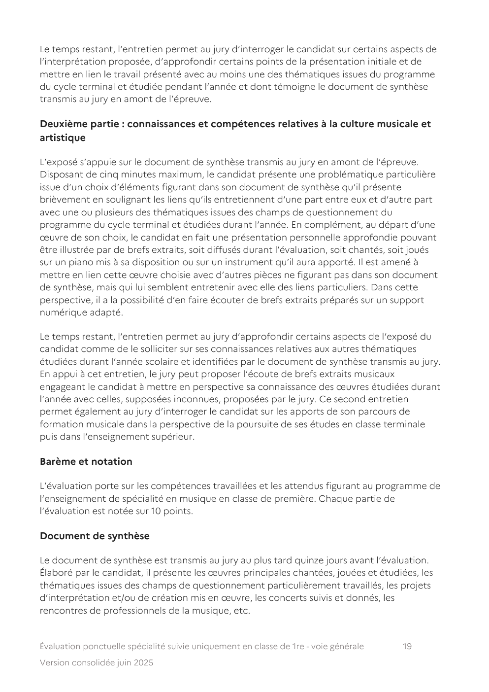

---

## Page 20

Théâtre

Première partie : compétences relatives à la pratique théâtrale

Dans un premier temps, le jury et le candidat disposent de cinq à sept minutes maximum.
Le candidat interprète une scène. À l’issue de sa prestation, le candidat expose les
caractéristiques dramaturgiques, techniques, esthétiques de la scène interprétée et
présente la démarche de travail et les choix artistiques qui ont présidé à sa réalisation. Le
jury peut ensuite proposer au candidat une consigne de re‐jeu (changement d’espace ou
d’intention par exemple).

Le temps restant, l’entretien qui suit permet au jury d’interroger le candidat sur certains
aspects de l’interprétation proposée et sur les effets éventuels du re‐jeu. Il permet
d’approfondir certains points de la proposition initiale et de mettre en lien l’interprétation
proposée avec des thèmes d’étude de l’année et les spectacles vus.

Deuxième partie : connaissances et compétences relatives à la culture théâtrale et
artistique

Dans un premier temps, le candidat dispose de cinq minutes maximum. Il présente
sommairement les différents éléments de son parcours de formation en enseignement de
spécialité de théâtre, éléments consignés dans un carnet de bord, de création et de travail
et choisit une notion, un spectacle, un texte, une expérience qui ont particulièrement
retenu son attention et nourri sa réflexion. Puis, dans un exposé, il en donne les raisons.

Le temps restant, à l’issue de cette présentation et en prenant appui sur le carnet de bord,
le jury interroge le candidat pour évaluer ses connaissances et la qualité de sa réflexion
dramaturgique.

Barème et notation

L’évaluation porte sur les compétences travaillées et les attendus figurant au programme de
l’enseignement de spécialité de théâtre en classe de première. Le carnet de bord sert de
point d’appui à la prestation orale et à l’interrogation, il n’est pas évalué en lui‐même.
Chaque partie de l’évaluation est notée sur 10 points.

Document de synthèse et carnet de bord

Le carnet de bord, en format papier ou numérique, est constitué par le candidat tout au
long de l’année. Le document de synthèse présente, de manière sommaire en une page,
l’organisation du travail de l’année.

Composition du jury

   •   arts plastiques, musique : l’évaluation est assurée conjointement par deux professeurs
       de la discipline, dont un au moins assure tout ou partie de son service en enseignement
       de spécialité ;

Évaluation ponctuelle spécialité suivie uniquement en classe de 1re - voie générale      20
Version consolidée juin 2025

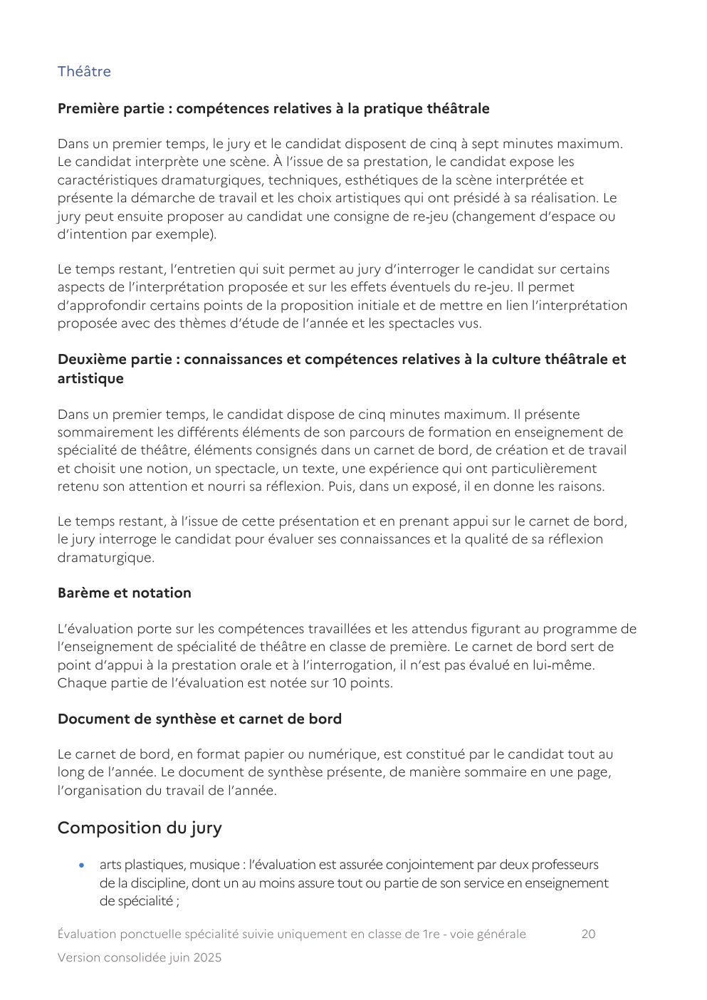

---

## Page 21

•   histoire des arts : l’évaluation est assurée conjointement par deux professeurs de
       l’éducation nationale, de deux disciplines différentes, tous deux titulaires de la
       certification complémentaire en histoire de l’art ;
   •   arts du cirque, cinéma‐aud io visuel, d anse, théâtre : l’évaluation est assurée
       conjointement par un professeur de l’éducation nationale et par un partenaire
       artistique professionnel qui intervient régulièrement dans l’enseignement. Sauf pour les
       arts du cirque qui ne sont pas concernés par cette disposition, les enseignants sont
       titulaires de la certification complémentaire dans le domaine artistique qu’ils
       enseignent. Si le partenaire est dans l’impossibilité de participer à l’évaluation, le jury
       est constitué par un autre professeur et peut délibérer valablement.

Évaluation ponctuelle spécialité suivie uniquement en classe de 1re - voie générale          21
Version consolidée juin 2025
