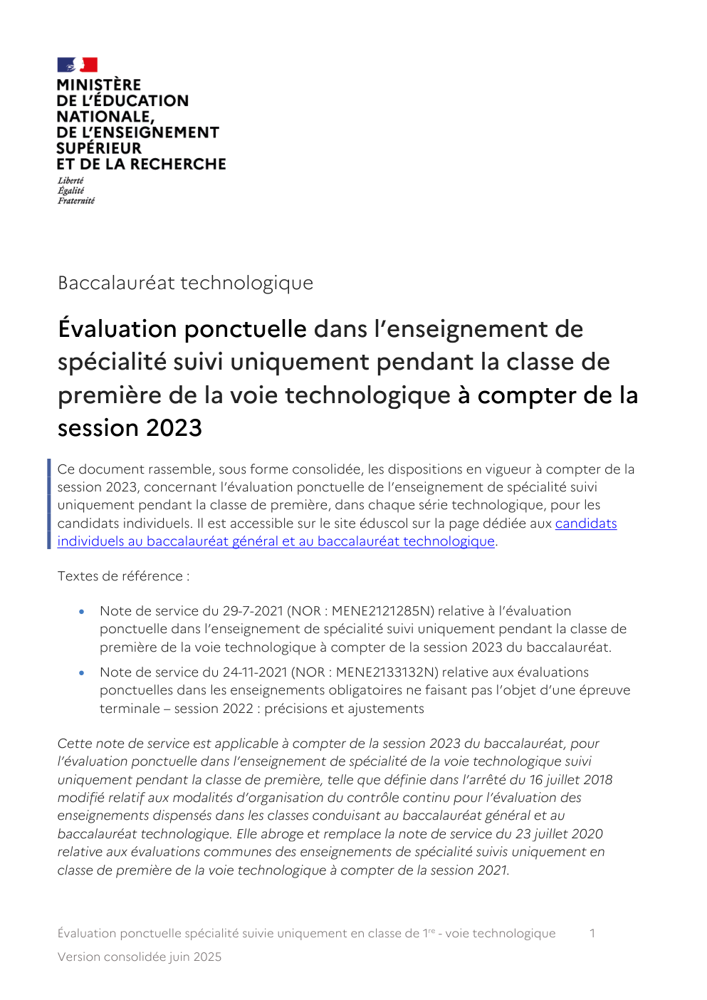
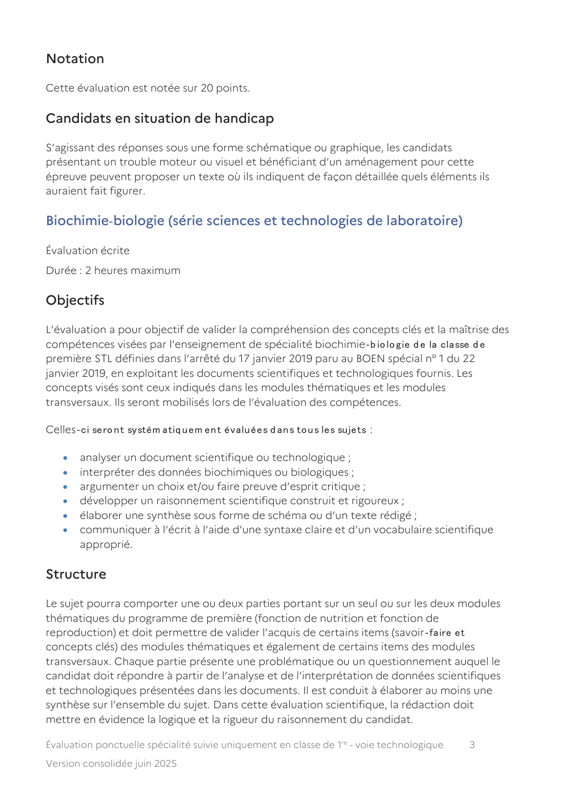
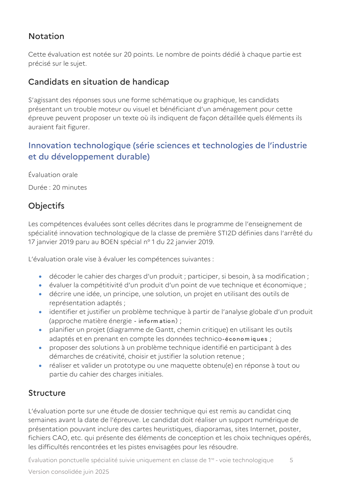
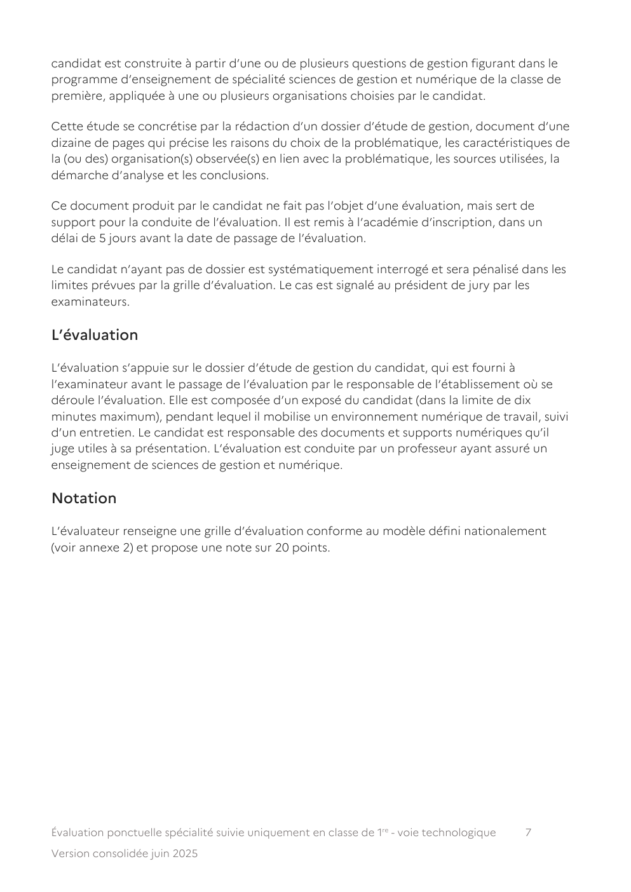

# ndsevaluation-ponctuelleeds-non-poursuivivoie-tjuin-2025pdf-100578

> Source : `../../../pdf_version/05_nsi_ponctuelle/eduscol_officiel/ndsevaluation-ponctuelleeds-non-poursuivivoie-tjuin-2025pdf-100578.pdf` — conversion Markdown (texte + visuels).
> Stratégie : [STRATEGIE_MARKDOWN.md](../../../STRATEGIE_MARKDOWN.md)

---

## Page 1

Baccalauréat technologique

Évaluation ponctuelle dans l’enseignement de
spécialité suivi uniquement pendant la classe de
première de la voie technologique à compter de la
session 2023
Ce document rassemble, sous forme consolidée, les dispositions en vigueur à compter de la
session 2023, concernant l’évaluation ponctuelle de l’enseignement de spécialité suivi
uniquement pendant la classe de première, dans chaque série technologique, pour les
candidats individuels. Il est accessible sur le site éduscol sur la page dédiée aux candidats
individuels au baccalauréat général et au baccalauréat technologique.

Textes de référence :

   •   Note de service du 29-7-2021 (NOR : MENE2121285N) relative à l’évaluation
       ponctuelle dans l’enseignement de spécialité suivi uniquement pendant la classe de
       première de la voie technologique à compter de la session 2023 du baccalauréat.
   •   Note de service du 24-11-2021 (NOR : MENE2133132N) relative aux évaluations
       ponctuelles dans les enseignements obligatoires ne faisant pas l’objet d’une épreuve
       terminale – session 2022 : précisions et ajustements

Cette note de service est applicable à compter de la session 2023 du baccalauréat, pour
l’évaluation ponctuelle dans l’enseignement de spécialité de la voie technologique suivi
uniquement pendant la classe de première, telle que définie dans l’arrêté du 16 juillet 2018
modifié relatif aux modalités d’organisation du contrôle continu pour l’évaluation des
enseignements dispensés dans les classes conduisant au baccalauréat général et au
baccalauréat technologique. Elle abroge et remplace la note de service du 23 juillet 2020
relative aux évaluations communes des enseignements de spécialité suivis uniquement en
classe de première de la voie technologique à compter de la session 2021.

Évaluation ponctuelle spécialité suivie uniquement en classe de 1re - voie technologique   1

Version consolidée juin 2025

---

## Page 2

L’évaluation ponctuelle dans l’enseignement de spécialité suivi uniquement pendant la classe
de première est prévue pour les candidats qui ne suivent les cours d’aucun établissement, les
candidats inscrits dans un établissement privé hors contrat, les candidats inscrits dans un
établissement français à l’étranger ne bénéficiant pas d’une homologation pour le cycle
terminal, et les candidats inscrits au Cned en scolarité libre. Ces candidats peuvent choisir de
présenter l’évaluation ponctuelle soit l’année de l’examen, soit de manière anticipée l’année
précédente.

Le format défini dans cette note de service peut être utilisé par le recteur d’académie pour les
évaluations de remplacement organisées par les services académiques à titre exceptionnel, à
l’intention des candidats scolaires inscrits au Cned en scolarité règlementée, lorsque leur
moyenne annuelle dans l’enseignement fait défaut, et pour les candidats sportifs de haut
niveau, sportifs espoirs et sportifs des collectifs nationaux inscrits sur les listes mentionnées à
l’article L. 221‐2 d u Co d e d u sp o rt, q ui en font la d em an d e.

Le sujet de cette évaluation ponctuelle est issu de la banque nationale de sujets. Le résultat
obtenu par le candidat est pris en compte pour le baccalauréat avec un coefficient 8, au titre
du contrôle continu, conformément aux dispositions de la note de service du 28 juillet 2021
relative aux modalités d’évaluation des candidats à compter de la session 2022.

Physique‐chimie pour la santé (série sciences et technologies de la santé
et du social)

Évaluation écrite
Durée : 2 heures maximum

Objectifs

L’évaluation a pour objectif l’évaluation des compétences acquises grâce à l’enseignement
de spécialité physique‐ch im ie p o u r la san té en classe d e p rem ière ST2S d éfin ies d an s
l’arrêté du 17 janvier 2019 paru au BOEN spécial n° 1 du 22 janvier 2019.

Structure

L’évaluation comprend notamment une ou des questions sur la démarche expérimentale,
une ou des questions appelant à la rédaction d’un argumentaire, une ou des questions
reposant sur des aspects quantitatifs simples. Le sujet est composé de 4 exercices
indépendants, 2 à dominante chimie, 2 à dominante physique. L’évaluation accorde un
poids équivalent aux deux domaines de la physique et de la chimie.

L’énoncé du sujet repose sur des supports variés (texte, photos, graphes, schémas, tableaux,
etc.) et appelle des réponses écrites dont la forme est multiple (texte, schémas, graphes,
etc.).

Le sujet précise si l’usage de la calculatrice, dans les conditions précisées par la
réglementation en vigueur, est autorisé.

Évaluation ponctuelle spécialité suivie uniquement en classe de 1re - voie technologique   2

Version consolidée juin 2025

---

## Page 3

Notation

Cette évaluation est notée sur 20 points.

Candidats en situation de handicap

S’agissant des réponses sous une forme schématique ou graphique, les candidats
présentant un trouble moteur ou visuel et bénéficiant d’un aménagement pour cette
épreuve peuvent proposer un texte où ils indiquent de façon détaillée quels éléments ils
auraient fait figurer.

Biochimie‐biologie (série sciences et technologies de laboratoire)

Évaluation écrite
Durée : 2 heures maximum

Objectifs

L’évaluation a pour objectif de valider la compréhension des concepts clés et la maîtrise des
compétences visées par l’enseignement de spécialité biochimie‐b io lo gie d e la classe d e
première STL définies dans l’arrêté du 17 janvier 2019 paru au BOEN spécial n° 1 du 22
janvier 2019, en exploitant les documents scientifiques et technologiques fournis. Les
concepts visés sont ceux indiqués dans les modules thématiques et les modules
transversaux. Ils seront mobilisés lors de l’évaluation des compétences.

Celles‐ci sero n t systém atiq u em en t évaluées d an s to u s les sujets :

   •   analyser un document scientifique ou technologique ;
   •   interpréter des données biochimiques ou biologiques ;
   •   argumenter un choix et/ou faire preuve d’esprit critique ;
   •   développer un raisonnement scientifique construit et rigoureux ;
   •   élaborer une synthèse sous forme de schéma ou d’un texte rédigé ;
   •   communiquer à l’écrit à l’aide d’une syntaxe claire et d’un vocabulaire scientifique
       approprié.

Structure

Le sujet pourra comporter une ou deux parties portant sur un seul ou sur les deux modules
thématiques du programme de première (fonction de nutrition et fonction de
reproduction) et doit permettre de valider l’acquis de certains items (savoir‐faire et
concepts clés) des modules thématiques et également de certains items des modules
transversaux. Chaque partie présente une problématique ou un questionnement auquel le
candidat doit répondre à partir de l’analyse et de l’interprétation de données scientifiques
et technologiques présentées dans les documents. Il est conduit à élaborer au moins une
synthèse sur l’ensemble du sujet. Dans cette évaluation scientifique, la rédaction doit
mettre en évidence la logique et la rigueur du raisonnement du candidat.

Évaluation ponctuelle spécialité suivie uniquement en classe de 1re - voie technologique   3

Version consolidée juin 2025

---

## Page 4

L’énoncé se présente sous forme de consignes en appui sur plusieurs documents
scientifiques et technologiques portant sur :
   •   les mécanismes moléculaires au niveau cellulaire ;
   •   la physiologie intégrée au niveau de l’organisme humain.

Au total, 6 à 8 documents sont à analyser pour répondre à une douzaine de questions (entre
10 et 13) qui ne mobilisent que des calculs simples.

La calculatrice n’est pas autorisée.

Notation

L’évaluation est réalisée à l’aide d’une grille d’évaluation des compétences avec trois
niveaux de maîtrise (insuffisant‐accep tab le‐m aîtrisé). Le m o d èle d e grille figu ran t en
annexe 1 est à utiliser systématiquement par les évaluateurs.

Chaque compétence est pondérée entre 2 et 5 points, cette pondération est indiquée aux
candidats sur la première page du sujet, la somme faisant un total de 20 points. Les
descripteurs des trois niveaux « insuffisant », « acceptable » et « maîtrisé » sont définis par
l’enseignant évaluateur. L’item « non traité » permet à l’évaluateur de distinguer ce cas de
celui caractérisant une réponse « insuffisante » au regard des attendus.

Physique‐chimie (série sciences et technologies du design et des arts
appliqués)

Évaluation écrite
Durée : 2 heures maximum

Objectifs

L’évaluation vise à évaluer le niveau de maîtrise des notions et contenus, capacités exigibles
et compétences figurant dans le programme de l’enseignement de spécialité physique‐
chimie de la classe de première STD2A définis dans l’arrêté du 17 janvier 2019 paru au BOEN
spécial n° 1 du 22 janvier 2019. Les capacités expérimentales identifiées dans le programme
précité sont incluses dans le périmètre de l’évaluation.

Structure

L’évaluation comporte deux parties indépendantes d’importance voisine. L’évaluation
accorde également un poids voisin aux deux composantes physique et chimie de la
discipline et aborde plusieurs thématiques du programme.

L’énoncé du sujet repose sur des supports variés (texte, photos, graphes, schémas, tableaux,
etc.) et appelle des réponses écrites dont la forme peut être multiple (texte, graphes,
schémas, tableaux, etc.). Chaque sujet précise si l’usage de la calculatrice, dans les
conditions précisées par les textes en vigueur, est autorisé.
Évaluation ponctuelle spécialité suivie uniquement en classe de 1re - voie technologique      4

Version consolidée juin 2025

---

## Page 5

Notation

Cette évaluation est notée sur 20 points. Le nombre de points dédié à chaque partie est
précisé sur le sujet.

Candidats en situation de handicap

S’agissant des réponses sous une forme schématique ou graphique, les candidats
présentant un trouble moteur ou visuel et bénéficiant d’un aménagement pour cette
épreuve peuvent proposer un texte où ils indiquent de façon détaillée quels éléments ils
auraient fait figurer.

Innovation technologique (série sciences et technologies de l’industrie
et du développement durable)

Évaluation orale
Durée : 20 minutes

Objectifs

Les compétences évaluées sont celles décrites dans le programme de l’enseignement de
spécialité innovation technologique de la classe de première STI2D définies dans l’arrêté du
17 janvier 2019 paru au BOEN spécial n° 1 du 22 janvier 2019.

L’évaluation orale vise à évaluer les compétences suivantes :

   •   décoder le cahier des charges d’un produit ; participer, si besoin, à sa modification ;
   •   évaluer la compétitivité d’un produit d’un point de vue technique et économique ;
   •   décrire une idée, un principe, une solution, un projet en utilisant des outils de
       représentation adaptés ;
   •   identifier et justifier un problème technique à partir de l’analyse globale d’un produit
       (approche matière énergie ‐ in fo rm atio n ) ;
   •   planifier un projet (diagramme de Gantt, chemin critique) en utilisant les outils
       adaptés et en prenant en compte les données technico‐éco n o m iq ues ;
   •   proposer des solutions à un problème technique identifié en participant à des
       démarches de créativité, choisir et justifier la solution retenue ;
   •   réaliser et valider un prototype ou une maquette obtenu(e) en réponse à tout ou
       partie du cahier des charges initiales.

Structure

L’évaluation porte sur une étude de dossier technique qui est remis au candidat cinq
semaines avant la date de l’épreuve. Le candidat doit réaliser un support numérique de
présentation pouvant inclure des cartes heuristiques, diaporamas, sites Internet, poster,
fichiers CAO, etc. qui présente des éléments de conception et les choix techniques opérés,
les difficultés rencontrées et les pistes envisagées pour les résoudre.

Évaluation ponctuelle spécialité suivie uniquement en classe de 1re - voie technologique   5

Version consolidée juin 2025

---

## Page 6

L’évaluation est réalisée par un enseignant de sciences industrielles de l’ingénieur.
L’évaluation, d’une durée globale de 20 minutes, se décompose en deux parties :
   •   elle débute par la présentation orale à partir du support numérique élaboré par le
       candidat, d’une durée de 10 minutes maximum ;
   •   cette présentation est suivie d’un dialogue argumenté avec l’interrogateur d’une
       durée de 10 minutes maximum.

Notation

Cette évaluation est notée sur 20. Elle fait l’objet d’une fiche individuelle d’évaluation des
compétences, établie selon le modèle fourni dans la banque nationale de sujets.

Les éléments contenus dans le projet présenté sont les seuls supports possibles de
questionnement.

Sciences de gestion et numérique (série sciences et technologies du
management et de la gestion)

Évaluation orale

Durée : 20 minutes

Objectifs

L’évaluation vise à apprécier, au travers de l’étude d’une problématique de gestion choisie
par le candidat et relevant du programme de l’enseignement de spécialité sciences de
gestion et numérique de la classe de première STMG défini dans l’arrêté du 17 janvier 2019
paru au BOEN spécial n° 1 du 22 janvier 2019, les compétences suivantes :
   •   dégager une problématique de gestion ;
   •   mobiliser des sources documentaires variées pour traiter la problématique retenue ;
   •   sélectionner les informations pertinentes au regard de cette problématique ;
   •   interpréter et exploiter les informations sélectionnées pour répondre à la
       problématique ;
   •   rédiger une synthèse dégageant les conclusions de l’étude ;
   •   présenter oralement le travail effectué ;
   •   préciser et argumenter les choix effectués.

Structure

Le dossier

L’évaluation prend appui sur le dossier constitué par le candidat au cours de l’étude qu’il a
conduite.

Le candidat réalise une étude personnelle et individuelle qui vise à traiter une
problématique qu’il a choisie, dite étude de gestion. La problématique du dossier du
Évaluation ponctuelle spécialité suivie uniquement en classe de 1re - voie technologique   6

Version consolidée juin 2025

---

## Page 7

candidat est construite à partir d’une ou de plusieurs questions de gestion figurant dans le
programme d’enseignement de spécialité sciences de gestion et numérique de la classe de
première, appliquée à une ou plusieurs organisations choisies par le candidat.

Cette étude se concrétise par la rédaction d’un dossier d’étude de gestion, document d’une
dizaine de pages qui précise les raisons du choix de la problématique, les caractéristiques de
la (ou des) organisation(s) observée(s) en lien avec la problématique, les sources utilisées, la
démarche d’analyse et les conclusions.

Ce document produit par le candidat ne fait pas l’objet d’une évaluation, mais sert de
support pour la conduite de l’évaluation. Il est remis à l’académie d’inscription, dans un
délai de 5 jours avant la date de passage de l’évaluation.

Le candidat n’ayant pas de dossier est systématiquement interrogé et sera pénalisé dans les
limites prévues par la grille d’évaluation. Le cas est signalé au président de jury par les
examinateurs.

L’évaluation

L’évaluation s’appuie sur le dossier d’étude de gestion du candidat, qui est fourni à
l’examinateur avant le passage de l’évaluation par le responsable de l’établissement où se
déroule l’évaluation. Elle est composée d’un exposé du candidat (dans la limite de dix
minutes maximum), pendant lequel il mobilise un environnement numérique de travail, suivi
d’un entretien. Le candidat est responsable des documents et supports numériques qu’il
juge utiles à sa présentation. L’évaluation est conduite par un professeur ayant assuré un
enseignement de sciences de gestion et numérique.

Notation

L’évaluateur renseigne une grille d’évaluation conforme au modèle défini nationalement
(voir annexe 2) et propose une note sur 20 points.

Évaluation ponctuelle spécialité suivie uniquement en classe de 1re - voie technologique   7

Version consolidée juin 2025

---

## Page 8

Enseignement scientifique alimentation‐environnement (série sciences
et technologies de l’hôtellerie et de la restauration)

Évaluation écrite
Durée : 2 heures maximum

Objectifs

L’évaluation porte sur le programme de l’enseignement de spécialité enseignement
scientifique alimentation‐en viro n n em en t d e la classe d e p rem ière STH R d éfin i d an s l ’arrêté
du 17 janvier 2019 paru au BOEN spécial n° 1 du 22 janvier 2019.

Elle a pour objectif de vérifier :

   •   les connaissances scientifiques fondamentales et appliquées en Esae de la classe de
       première ;
   •   les capacités d’analyse, de synthèse et de raisonnement scientifique ;
   •   la clarté et la rigueur de l’expression écrite.

Structure

Le sujet comporte deux parties :

   •   la partie 1 porte sur tout ou partie du programme de la classe de première ;
   •   la partie 2 porte sur un des thèmes du programme de la classe de première.

La partie 1 permet d’évaluer la maîtrise par le candidat des connaissances acquises. Le
questionnement peut se présenter sous forme de questions et/ou de QCM.

La partie 2 permet d’évaluer la capacité du candidat à analyser, à synthétiser, à argumenter
en appui sur l’exploitation de documents. Dans le cadre d’une analyse de situation
problème, les questions appellent des réponses rédigées, structurées et argumentées, qui
intègrent la mobilisation des connaissances dans une démarche de réflexion.

Notation

Cette évaluation est notée sur 20 points. Chaque partie est notée sur 10.

Cette évaluation est corrigée par un professeur qui a en charge l’enseignement scientifique
alimentation – environnement (Esae) qui n’est pas l’enseignant de l’élève.

Évaluation ponctuelle spécialité suivie uniquement en classe de 1re - voie technologique         8

Version consolidée juin 2025

---

## Page 9

Économie, droit et environnement du spectacle vivant (série sciences et
techniques du théâtre, de la musique et de la danse)

Épreuve orale
Durée : 20 minutes

Objectifs

En lien avec les objectifs généraux des enseignements de spécialité de la série S2TMD, l’évaluation
vise à évaluer la capacité des élèves à mobiliser des connaissances et compétences acquises dans le
cadre du programme de l’enseignement de spécialité Édesv défini dans l’arrêté du 31 juillet 2019
publié au BOEN du 29 août 2019, pour comprendre les spécificités de cet environnement et les
mettre en relation avec la formation artistique et le projet d’orientation des élèves.

Structure

L’évaluation repose sur la soutenance d’un projet en lien avec le domaine artistique étudié et
pratiqué par le candidat et mobilisant les connaissances acquises dans le cadre du programme. Si le
projet peut être collectif, l’évaluation par le jury est individuelle.
Le candidat se présente à l’entretien muni d’un dossier papier qui synthétise son projet. Celui‐ci,
d’une longueur d’environ cinq pages (hors annexes), sert uniquement de support à l’évaluation
commune et n’est pas évalué en tant que tel.
Les projets peuvent être de nature diverse : recherche documentaire sur un domaine particulier du
spectacle vivant ; enquête sur le public d’une salle de spectacle ; étude du fonctionnement et de
l’organisation d’un lieu culturel (musée, salle de spectacle, etc.) ; conduite d’un projet (par exemple,
production et réalisation d’un spectacle vivant), etc. Le candidat veille à inscrire son projet dans son
parcours d’orientation.

L’évaluation est organisée en deux parties d’une même durée de 10 minutes chacune :
  •   première partie – présentation : le candidat effectue une présentation orale de son projet
      pendant laquelle il n’est pas interrompu. Il s’appuie pour cela sur le dossier qu’il a remis au
      jury. Il peut se munir de documents annexes pour illustrer sa présentation ;
  •   seconde partie – entretien : le jury interroge le candidat sur différents aspects de son projet et
      sur son lien avec quelques notions du programme, puis élargit ce questionnement aux autres
      connaissances et compétences spécifiées dans le programme.

Notation

L’évaluation commune est notée sur 20 points, chaque partie étant notée sur 10 points.
L’évaluation commune est évaluée à l’aide de la grille d’évaluation des compétences figurant en
annexe 3. Le jury est composé d’un enseignant de sciences économiques et sociales intervenant en
Édesv et d’un professeur de l’éducation nationale en charge d’un des enseignements de spécialité
artistique de la série S2TMD. Le cas échéant, un professionnel du spectacle vivant peut être sollicité
en appui des deux examinateurs du jury.

Évaluation ponctuelle spécialité suivie uniquement en classe de 1re - voie technologique        9

Version consolidée juin 2025
