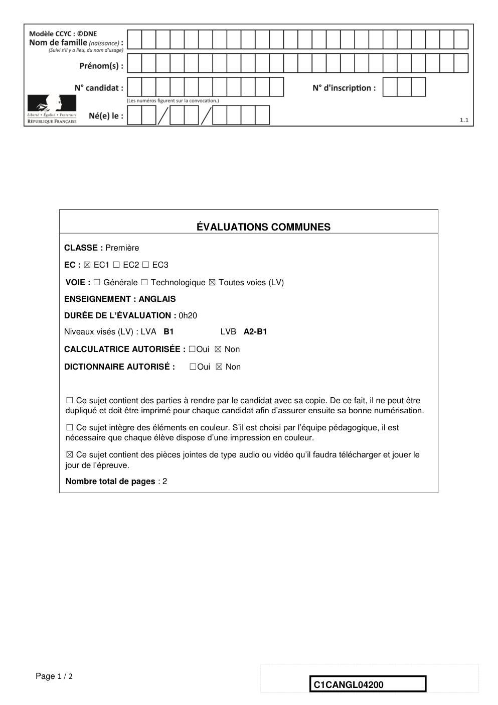
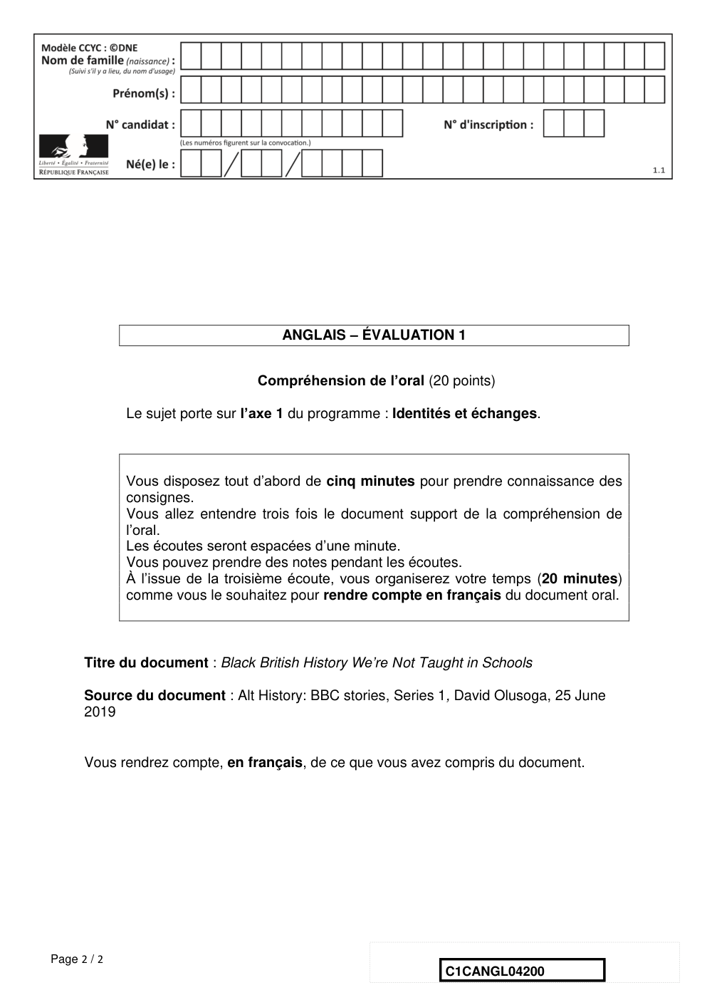

# e3c-langues-vivantes-anglais-premiere-t2-04200-sujet-officiel

> Source : `../../../../pdf_version/06_lva_lvb_ecrit/e3c_anglais_lva/2021/e3c-langues-vivantes-anglais-premiere-t2-04200-sujet-officiel.pdf` — conversion Markdown (texte + visuels).
> Stratégie : [STRATEGIE_MARKDOWN.md](../../../../STRATEGIE_MARKDOWN.md)

---

## Page 1

ÉVALUATIONS COMMUNES
       CLASSE : Première

       EC : ☒ EC1 ☐ EC2 ☐ EC3

        VOIE : ☐ Générale ☐ Technologique ☒ Toutes voies (LV)

       ENSEIGNEMENT : ANGLAIS
       DURÉE DE L’ÉVALUATION : 0h20
       Niveaux visés (LV) : LVA B1                LVB A2-B1

       CALCULATRICE AUTORISÉE : ☐Oui ☒ Non

       DICTIONNAIRE AUTORISÉ :            ☐Oui ☒ Non

        ☐ Ce sujet contient des parties à rendre par le candidat avec sa copie. De ce fait, il ne peut être
        dupliqué et doit être imprimé pour chaque candidat afin d’assurer ensuite sa bonne numérisation.

        ☐ Ce sujet intègre des éléments en couleur. S’il est choisi par l’équipe pédagogique, il est
        nécessaire que chaque élève dispose d’une impression en couleur.

        ☒ Ce sujet contient des pièces jointes de type audio ou vidéo qu’il faudra télécharger et jouer le
        jour de l’épreuve.
        Nombre total de pages : 2

Page 1 / 2
                                                                            C1CANGL04200

---

## Page 2

ANGLAIS – ÉVALUATION 1

                                 Compréhension de l’oral (20 points)

             Le sujet porte sur l’axe 1 du programme : Identités et échanges.

             Vous disposez tout d’abord de cinq minutes pour prendre connaissance des
             consignes.
             Vous allez entendre trois fois le document support de la compréhension de
             l’oral.
             Les écoutes seront espacées d’une minute.
             Vous pouvez prendre des notes pendant les écoutes.
             À l’issue de la troisième écoute, vous organiserez votre temps (20 minutes)
             comme vous le souhaitez pour rendre compte en français du document oral.

      Titre du document : Black British History We’re Not Taught in Schools

      Source du document : Alt History: BBC stories, Series 1, David Olusoga, 25 June
      2019

      Vous rendrez compte, en français, de ce que vous avez compris du document.

Page 2 / 2
                                                              C1CANGL04200

