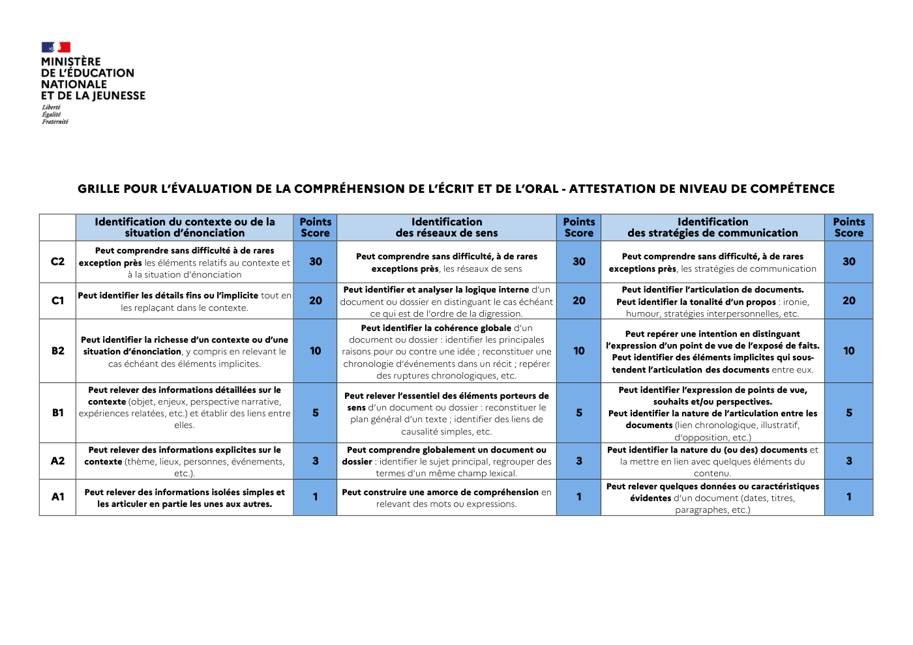

# grilles_lva_lvb

> Source : `../../../pdf_version/06_lva_lvb_ecrit/eduscol_officiel/grilles_lva_lvb.pdf` — conversion Markdown (texte + visuels).
> Stratégie : [STRATEGIE_MARKDOWN.md](../../../STRATEGIE_MARKDOWN.md)

---

## Page 1

GRILLE POUR L’ÉVALUATION DE LA COMPRÉHENSION DE L’ÉCRIT ET DE L’ORAL - ATTESTATION DE NIVEAU DE COMPÉTENCE

         Identification du contexte ou de la                   Points                   Identification                           Points                  Identification                           Points
               situation d’énonciation                         Score                 des réseaux de sens                         Score         des stratégies de communication                    Score
        Peut comprendre sans difficulté à de rares
                                                                           Peut comprendre sans difficulté, à de rares                       Peut comprendre sans difficulté, à de rares
C2   exception près les éléments relatifs au contexte et        30                                                                30                                                               30
                                                                              exceptions près, les réseaux de sens                        exceptions près, les stratégies de communication
                à la situation d’énonciation
                                                                         Peut identifier et analyser la logique interne d’un                 Peut identifier l’articulation de documents.
     Peut identifier les détails fins ou l’implicite tout en
C1                                                              20      document ou dossier en distinguant le cas échéant         20        Peut identifier la tonalité d’un propos : ironie,      20
               les replaçant dans le contexte.
                                                                                ce qui est de l’ordre de la digression.                       humour, stratégies interpersonnelles, etc.
                                                                             Peut identifier la cohérence globale d’un
                                                                                                                                               Peut repérer une intention en distinguant
     Peut identifier la richesse d’un contexte ou d’une                   document ou dossier : identifier les principales
                                                                                                                                          l’expression d’un point de vue de l’exposé de faits.
B2   situation d’énonciation, y compris en relevant le          10      raisons pour ou contre une idée ; reconstituer une        10                                                               10
                                                                                                                                            Peut identifier des éléments implicites qui sous-
            cas échéant des éléments implicites.                        chronologie d’événements dans un récit ; repérer
                                                                                                                                            tendent l’articulation des documents entre eux.
                                                                                 des ruptures chronologiques, etc.
       Peut relever des informations détaillées sur le                                                                                      Peut identifier l’expression de points de vue,
                                                                         Peut relever l’essentiel des éléments porteurs de
       contexte (objet, enjeux, perspective narrative,                                                                                               souhaits et/ou perspectives.
                                                                          sens d’un document ou dossier : reconstituer le
B1   expériences relatées, etc.) et établir des liens entre      5                                                                 5      Peut identifier la nature de l’articulation entre les     5
                                                                           plan général d’un texte ; identifier des liens de
                            elles.                                                                                                             documents (lien chronologique, illustratif,
                                                                                       causalité simples, etc.
                                                                                                                                                           d’opposition, etc.)
       Peut relever des informations explicites sur le                   Peut comprendre globalement un document ou                       Peut identifier la nature du (ou des) documents et
A2    contexte (thème, lieux, personnes, événements,             3      dossier : identifier le sujet principal, regrouper des     3         la mettre en lien avec quelques éléments du            3
                            etc.).                                              termes d’un même champ lexical.                                                 contenu.
                                                                                                                                          Peut relever quelques données ou caractéristiques
      Peut relever des informations isolées simples et                  Peut construire une amorce de compréhension en
A1                                                               1                                                                 1            évidentes d’un document (dates, titres,             1
         les articuler en partie les unes aux autres.                          relevant des mots ou expressions.
                                                                                                                                                           paragraphes, etc.)

---

## Page 2

TABLEAU DE CONVERSION : COMPRÉHENSION POUR LES CANDIDATS DE PREMIÈRE
        (A1 à partir de 3 points score ; A2 à partir de 9 points ; B1 à partir de 15 points ; B2 à partir de 30 points ; C1 à partir de 60 ; C2 à partir de 90 points)

                                         A1                                 A2                                                           B1                    B1 / B2 visé
  LVA                     0                                                                                                                          20+
                                         1-5                6-8            9-10               11-12                13-14               15-20
     Note sur 20          0    1     2         3   4   5     6     7   8     9     10   11     12      13    14     15      16    17     18    19     20
                                                                                                                    A2                                         A2 / B1 visé
  LVB                     0              1-2                3-4            5-6                 7-8                                       10           11+
                                                                                                                     9

                                   TABLEAU DE CONVERSION : COMPRÉHENSION POUR LES CANDIDATS DE TERMINALE
        (A1 à partir de 3 points score ; A2 à partir de 9 points ; B1 à partir de 15 points ; B2 à partir de 30 points ; C1 à partir de 60 ; C2 à partir de 90 points)
  LVA                     0              1-5                6-10           11-14              15-20                21-24             25-29           30+         B2 visé
    Note sur 20           0    1     2         3   4   5     6     7   8     9     10   11     12      13    14     15      16    17  18   19         20
  LVB                     0              1-3                4-6             7-9               10-11                12-13              14             15+         B1 visé

Grilles d’évaluation pour attestation en langues vivantes                                                                                                                2

---

## Page 3

GRILLE POUR L’ÉVALUATION DE L’EXPRESSION ÉCRITE - ATTESTATION DE NIVEAU DE COMPÉTENCE

                                                         Cohérence dans la
           Qualité du contenu               Points        construction du               Points              Correction                    Points              Richesse                     Points
                                            Score            discours                   Score           de la langue écrite               Score              de la langue                  Score
                                                                                                                                                       Peut employer de manière
                                                                                                                                                   pertinente un très vaste répertoire
        Peut rendre de fines nuances                                                             Peut rédiger avec un très haut degré
                                                       Peut produire un discours                                                                    lexical incluant des expressions
         de sens en rapport avec un                                                                 de correction grammaticale, y
 C2                                          30       cohérent et construit sur un       30                                                30        idiomatiques, des nuances de              30
               sujet complexe.                                                                   compris en mobilisant des structures
                                                            sujet complexe                                                                           formulation et des structures
                                                                                                  complexes sur un sujet complexe.
                                                                                                                                                       variées même sur un sujet
                                                                                                                                                                complexe.

                                                                                                                                                        Peut employer de manière
                                                     Peut produire un récit ou une                Peut maintenir tout au long de sa
        Peut traiter le sujet et produire                                                                                                             pertinente un vaste répertoire
                                                      argumentation complexe en                      rédaction un haut degré de
        un écrit fluide et convaincant,                                                                                                              lexical incluant des expressions
  C1                                         20      démontrant un usage maîtrisé        20      correction grammaticale, y compris        20                                                  20
            étayé par des éléments                                                                                                                    idiomatiques, des nuances de
                                                       de moyens linguistiques de                   en mobilisant des structures
          (inter)culturels pertinents.                                                                                                                formulation et des structures
                                                     structuration et d’articulation.                        complexes.
                                                                                                                                                                  variées.

        Peut traiter le sujet et produire
                                                     Peut produire un récit ou une               Peut démontrer une bonne maîtrise                    Peut produire un texte dont
            un écrit clair, détaillé et
                                                     argumentation en indiquant la               des structures simples et courantes.                 l’étendue du lexique et des
            globalement efficace, y
  B2                                         10       relation entre les faits et les    10          Les erreurs sur les structures        10        structures est suffisante pour            10
         compris en prenant appui sur
                                                        idées dans un texte bien                 complexes ne donnent pas lieu à des               permettre précision et variété des
               certains éléments
                                                                structuré.                                   malentendus.                                    formulations.
          (inter)culturels pertinents.
        Peut traiter le sujet et produire                  Peut rendre compte
             un écrit intelligible et                d’expériences en décrivant ses              Peut démontrer une bonne maîtrise                      Peut produire un texte dont
          relativement développé, y                   sentiments et réactions. Peut              des structures simples et courantes.              l’étendue lexicale relative nécessite
  B1                                          5                                           5                                                 5                                                  5
        compris en faisant référence à               exposer et illustrer un point de            Les erreurs sur les structures simples                 l’usage de périphrases et de
              quelques éléments                      vue. Peut raconter une histoire                   ne gênent pas la lecture.                                 répétitions.
                (inter)culturels.                        de manière cohérente.
                                                                                                                                                    Peut produire un texte dont les
                                                      Peut exposer une expérience                      Peut produire un texte
        Peut traiter le sujet, même si la                                                                                                          mots sont adaptés à l’intention de
 A2                                           3      ou un point de vue en utilisant      3        immédiatement compréhensible             3                                                  3
            production est courte.                                                                                                                  communication, en dépit d’un
                                                     des connecteurs élémentaires.                  malgré des erreurs fréquentes.
                                                                                                                                                       répertoire lexical limité.
        Peut simplement amorcer une                       Peut énumérer des                      Peut produire un texte globalement
                                                                                                                                                    Peut produire un texte intelligible
  A1    production écrite en lien avec        1      informations sur soi-même ou         1      compréhensible mais dont la lecture        1                                                  1
                                                                                                                                                      malgré un lexique très limité.
                   le sujet.                                  les autres.                                  est peu aisée.

Grilles d’évaluation pour attestation en langues vivantes                                                                                                                                  3

---

## Page 4

GRILLE POUR L’ÉVALUATION DE L’EXPRESSION ORALE – ATTESTATION DE NIVEAU DE COMPÉTENCE

                 Expression                   Points              Interaction                  Points              Correction                     Points               Richesse                     Points
              orale en continu                Score                  orale                     Score            de la langue orale                Score               de la langue                  Score
                                                          Peut interagir avec aisance et                                                                         Peut employer de manière
                                                                                                            Peut utiliser avec une bonne
        Peut rendre de fines nuances de                     spontanéité et contribuer                                                                          pertinente un vaste répertoire
                                                                                                         maîtrise tout l’éventail des traits
         sens en rapport avec un sujet                   habilement à la construction de                                                                      lexical incluant des expressions
 C2                                            30                                               30      phonologiques de la langue cible, de       30                                                   30
                   complexe.                           l’échange, y compris en exploitant                                                                      idiomatiques, des nuances de
                                                                                                          façon à être toujours intelligible,
                                                       des références (inter)culturelles et                                                                formulation et des structures variées
                                                                                                            même sur un sujet complexe.
                                                              sur un sujet complexe.                                                                           même sur un sujet complexe.
              Peut développer une                                                                        Peut utiliser avec une assez bonne
                                                          Peut interagir avec aisance et                                                                         Peut employer de manière
       argumentation complexe, fondée                                                                     maîtrise tout l’éventail des traits
                                                            contribuer habilement à la                                                                         pertinente un vaste répertoire
       sur des aspects (inter)culturels, de                                                             phonologiques de la langue cible, de
 C1                                            20          construction de l’échange, y         20                                                 20         lexical incluant des expressions          20
         manière synthétique et fluide                                                                  façon à être toujours intelligible. Les
                                                            compris en exploitant des                                                                          idiomatiques, des nuances de
         tout en s’assurant de sa bonne                                                                  rares erreurs de langue ne donnent
                                                           références (inter)culturelles.                                                                  formulation et des structures variées.
                     réception.                                                                              pas lieu à des malentendus.
        Peut développer un point de vue                   Peut argumenter et chercher à
       pertinent et étayé, y compris par                   convaincre. Peut réagir avec                    L’accent peut subir l’influence                   Peut produire un discours et des
            des reformulations qui ne                       pertinence et relancer la                   d’autres langues mais n’entrave pas                énoncés assez fluides dont l’étendue
 B2      rompent pas le fil du discours.       10      discussion, y compris pour amener        10                 l’intelligibilité.              10         du lexique est suffisante pour            10
           Peut nuancer un propos en                   l’échange sur un terrain familier ou              Les erreurs de langue ne donnent                   permettre précision et variété des
         s’appuyant sur des références                         sur celui des aspects                           pas lieu à malentendu.                                 formulations.
                 (inter)culturelles.                              (inter)culturels.
        Peut exposer un point de vue de
                                                                                                            Peut s’exprimer de manière
        manière simple en l’illustrant par             Peut engager, soutenir et clore une                                                                   Peut produire un discours et des
                                                                                                           intelligible malgré l’influence
       des exemples et des références à                 conversation simple sur des sujets                                                                   énoncés dont l’étendue lexicale
  B1                                            5                                                5                d’autres langues.                 5                                                   5
         des aspects (inter)culturels. Le              familiers. Peut faire référence à des                                                                   relative nécessite l’usage de
                                                                                                           Bonne maîtrise des structures
       discours est structuré (relations de                  aspects (inter)culturels.                                                                          périphrases et répétitions.
                                                                                                                       simples.
          causalité, comparaisons etc.).
                                                                                                            Peut s’exprimer de manière
                                                                                                                                                             Peut produire un discours et des
        Peut exprimer un avis en termes                Peut répondre et réagir de manière                  suffisamment claire pour être
                                                                                                                                                           énoncés dont les mots sont adaptés
 A2    simples. Le discours est bref et les     3                   simple.                      3        compris, mais la compréhension            3                                                   3
                                                                                                                                                           à l’intention de communication, en
         éléments en sont juxtaposés.                                                                          requiert un effort des
                                                                                                                                                           dépit d’un répertoire lexical limité.
                                                                                                                   interlocuteurs.
        Peut exprimer un avis en termes
                                                       Peut intervenir simplement mais la               Peut utiliser un répertoire très limité                 Peut produire des énoncés
         très simples. Les énoncés sont
 A1                                             1         communication repose sur la            1      d’expressions et de mots mémorisés          1       intelligibles malgré un lexique très        1
       ponctués de pauses, d’hésitations
                                                         répétition et la reformulation.                     de façon compréhensible.                                      limité.
             et de faux démarrages.

Grilles d’évaluation pour attestation en langues vivantes                                                                                                                                           4

---

## Page 5

TABLEAU DE CONVERSION : EXPRESSION POUR LES CANDIDATS ÉVALUES EN CLASSE DE PREMIÈRE

         (A1 à partir de 4 points score ; A2 à partir de 12 points ; B1 à partir de 20 points ; B2 à partir de 40 points ; C1 à partir de 80 points ; C2 = 120 points)

                                       A1                                   A2                                                           B1                     B1 / B2 visé
  LVA                    0                                  5-11                               15-17                18-19                              30+
                                       1-4                                 12-14                                                        20-29

     Note sur 20         0    1    2         3   4   5       6     7   8     9     10     11     12     13    14      15     16    17     18    19     20

                                                            A1                                                       A2                                         A2 / B1 visé
  LVB                    0                                                                                                                             20+
                                       1-3                  4-7             8-9                10-11                12-15               16-19

                       TABLEAU DE CONVERSION : EXPRESSION POUR LES CANDIDATS ÉVALUÉS EN CLASSE DE TERMINALE

         (A1 à partir de 4 points score ; A2 à partir de 12 points ; B1 à partir de 20 points ; B2 à partir de 40 points ; C1 à partir de 80 points ; C2 = 120 points)

  LVA                    0             A1                    A2              B1                 B1+                                                    40+        B2 visé
                                       1-8                  9-14           15-21               22-27                28-34               35-39
     Note sur 20         0    1    2         3   4   5        6    7   8     9     10     11     12     13    14     15      16    17    18     19     20
  LVB                    0             1-5                  6-8             9-12               13-15                16-17               18-19          20+        B1 visé
                                       A1                                    A2                 A2+

Grilles d’évaluation pour attestation en langues vivantes                                                                                                                5
