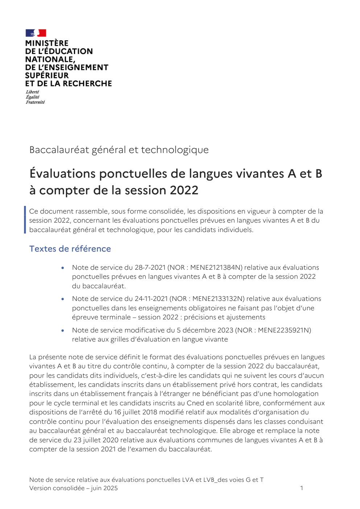
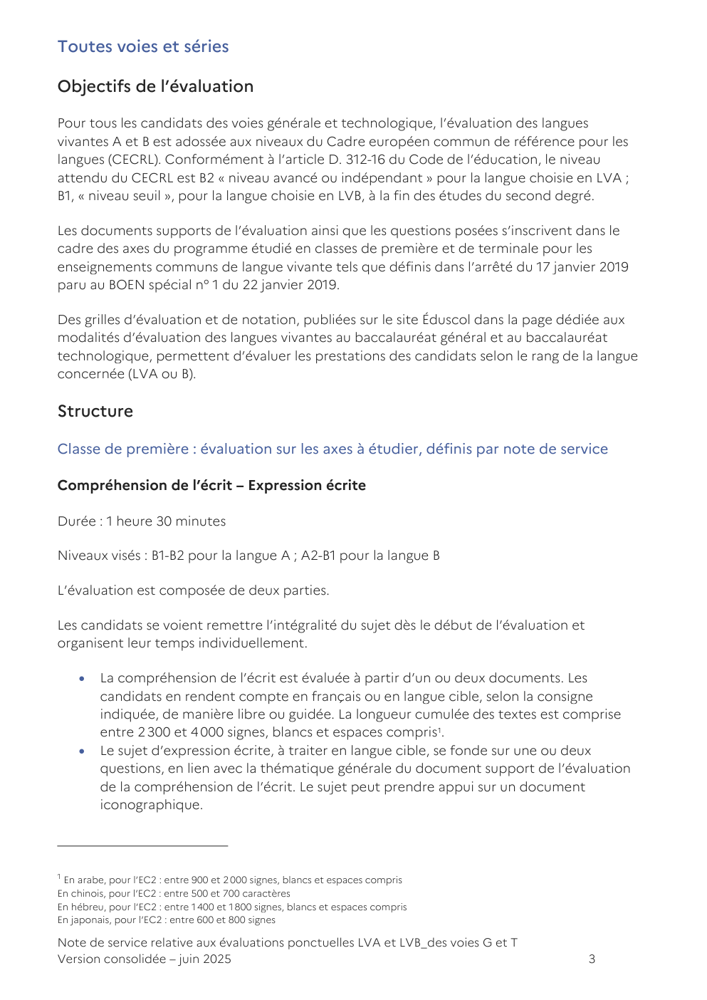
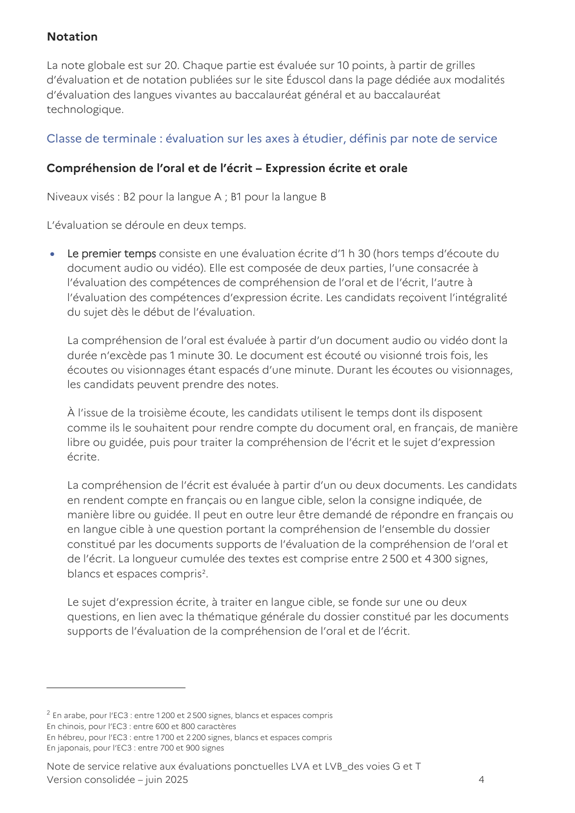
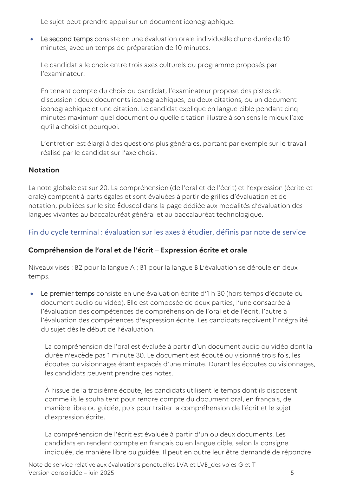
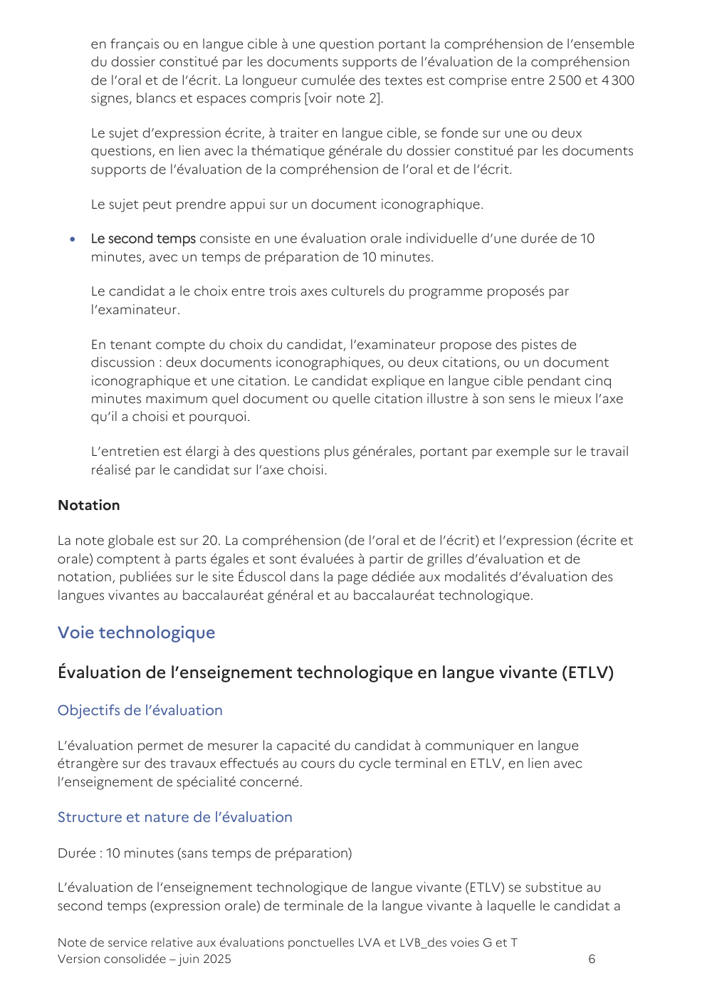

# ns_ponctuelle_lv_juin2025

> Source : `../../../pdf_version/06_lva_lvb_ecrit/eduscol_officiel/ns_ponctuelle_lv_juin2025.pdf` — conversion Markdown (texte + visuels).
> Stratégie : [STRATEGIE_MARKDOWN.md](../../../STRATEGIE_MARKDOWN.md)

---

## Page 1

Baccalauréat général et technologique

Évaluations ponctuelles de langues vivantes A et B
à compter de la session 2022
Ce document rassemble, sous forme consolidée, les dispositions en vigueur à compter de la
session 2022, concernant les évaluations ponctuelles prévues en langues vivantes A et B du
baccalauréat général et technologique, pour les candidats individuels.

Textes de référence

          •   Note de service du 28-7-2021 (NOR : MENE2121384N) relative aux évaluations
              ponctuelles prévues en langues vivantes A et B à compter de la session 2022
              du baccalauréat.
          •   Note de service du 24-11-2021 (NOR : MENE2133132N) relative aux évaluations
              ponctuelles dans les enseignements obligatoires ne faisant pas l’objet d’une
              épreuve terminale – session 2022 : précisions et ajustements
          •   Note de service modificative du 5 décembre 2023 (NOR : MENE2235921N)
              relative aux grilles d’évaluation en langue vivante

La présente note de service définit le format des évaluations ponctuelles prévues en langues
vivantes A et B au titre du contrôle continu, à compter de la session 2022 du baccalauréat,
pour les candidats dits individuels, c’est-à-dire les candidats qui ne suivent les cours d’aucun
établissement, les candidats inscrits dans un établissement privé hors contrat, les candidats
inscrits dans un établissement français à l’étranger ne bénéficiant pas d’une homologation
pour le cycle terminal et les candidats inscrits au Cned en scolarité libre, conformément aux
dispositions de l’arrêté du 16 juillet 2018 modifié relatif aux modalités d’organisation du
contrôle continu pour l’évaluation des enseignements dispensés dans les classes conduisant
au baccalauréat général et au baccalauréat technologique. Elle abroge et remplace la note
de service du 23 juillet 2020 relative aux évaluations communes de langues vivantes A et B à
compter de la session 2021 de l’examen du baccalauréat.

Note de service relative aux évaluations ponctuelles LVA et LVB_des voies G et T
Version consolidée – juin 2025                                                          1

---

## Page 2

Le format défini dans cette note de service peut être utilisé par le recteur d’académie pour
les évaluations de remplacement organisées par les services académiques à titre
exceptionnel, à l’intention des candidats scolaires inscrits au Cned en scolarité règlementée,
lorsque leur moyenne annuelle dans l’enseignement fait défaut, et pour les candidats
sportifs de haut niveau, sportifs espoirs et sportifs des collectifs nationaux inscrits sur les
listes mentionnées à l’article L. 221-2 du Code du sport, qui en font la demande.

Pour chacune des voies et séries, ces évaluations ponctuelles sont adossées au programme
de l’enseignement commun de langues vivantes A et B pour les classes de première et de
terminale. Le résultat obtenu par le candidat est pris en compte pour le baccalauréat au
titre du contrôle continu, conformément aux dispositions de la note de service du 28 juillet
2021 relative aux modalités d’évaluation des candidats à compter de la session 2022.

Deux modalités d’organisation de ces évaluations ponctuelles sont prévues, selon le choix
formulé par le candidat individuel ou le sportif de haut niveau, ou pour répondre à la
spécificité de la situation du candidat scolaire n’ayant pu présenter de moyenne annuelle,
pour cause de force majeure dûment justifiée :

     1. Une modalité d’organisation consistant en une unique évaluation ponctuelle à la fin
     du cycle terminal, sur le programme des deux années du cycle terminal ;

     2. Une modalité d’organisation consistant en deux évaluations ponctuelles, une à la fin
     de l’année de première, l’autre à la fin de l’année de terminale.

Les candidats dits individuels, définis dans l’introduction de la présente note de service,
formulent leur choix entre ces deux modalités, lors de leur inscription à l’examen. Ce choix
est définitif une fois que l’inscription à l’examen est close, sauf en cas de situation
exceptionnelle, et sous réserve de l’autorisation du recteur d’académie. Lorsque le candidat
choisit d’être successivement évalué en fin de classe de première et en fin de classe de
terminale, il ne peut modifier la répartition des évaluations prévues par la réglementation.

Les candidats dits scolaires, définis dans l’introduction de la présente note de service, sont
convoqués à une évaluation ponctuelle, à titre d’évaluation de remplacement, au cours du
premier trimestre de l’année de terminale sur les axes du programme de langues vivantes A
et B étudiés en classe de première si la moyenne annuelle qui leur fait défaut est celle de
l’année de première, ou avant la fin de l’année de terminale sur les axes du programme de
langues vivantes A et B étudiés en classe de terminale si la moyenne annuelle qui leur fait
défaut est celle de l’année de terminale.

La note attribuée est affectée d’un coefficient 3 si l’évaluation porte sur une partie du
programme pour l’année de première ou de terminale et d’un coefficient 6 si l’évaluation
porte sur l’ensemble du programme du cycle terminal.

Concernant la session 2022 de l’examen, les candidats individuels sont évalués à la fin de
l’année 2021-2022 sur le programme du cycle terminal dans l’enseignement concerné.

Note de service relative aux évaluations ponctuelles LVA et LVB_des voies G et T
Version consolidée – juin 2025                                                        2

---

## Page 3

Toutes voies et séries

Objectifs de l’évaluation

Pour tous les candidats des voies générale et technologique, l’évaluation des langues
vivantes A et B est adossée aux niveaux du Cadre européen commun de référence pour les
langues (CECRL). Conformément à l’article D. 312-16 du Code de l’éducation, le niveau
attendu du CECRL est B2 « niveau avancé ou indépendant » pour la langue choisie en LVA ;
B1, « niveau seuil », pour la langue choisie en LVB, à la fin des études du second degré.

Les documents supports de l’évaluation ainsi que les questions posées s’inscrivent dans le
cadre des axes du programme étudié en classes de première et de terminale pour les
enseignements communs de langue vivante tels que définis dans l’arrêté du 17 janvier 2019
paru au BOEN spécial n° 1 du 22 janvier 2019.

Des grilles d’évaluation et de notation, publiées sur le site Éduscol dans la page dédiée aux
modalités d’évaluation des langues vivantes au baccalauréat général et au baccalauréat
technologique, permettent d’évaluer les prestations des candidats selon le rang de la langue
concernée (LVA ou B).

Structure

Classe de première : évaluation sur les axes à étudier, définis par note de service

Compréhension de l’écrit – Expression écrite

Durée : 1 heure 30 minutes

Niveaux visés : B1-B2 pour la langue A ; A2-B1 pour la langue B

L’évaluation est composée de deux parties.

Les candidats se voient remettre l’intégralité du sujet dès le début de l’évaluation et
organisent leur temps individuellement.

    •    La compréhension de l’écrit est évaluée à partir d’un ou deux documents. Les
         candidats en rendent compte en français ou en langue cible, selon la consigne
         indiquée, de manière libre ou guidée. La longueur cumulée des textes est comprise
         entre 2 300 et 4 000 signes, blancs et espaces compris 1.
    •    Le sujet d’expression écrite, à traiter en langue cible, se fonde sur une ou deux
         questions, en lien avec la thématique générale du document support de l’évaluation
         de la compréhension de l’écrit. Le sujet peut prendre appui sur un document
         iconographique.

1
 En arabe, pour l’EC2 : entre 900 et 2 000 signes, blancs et espaces compris
En chinois, pour l’EC2 : entre 500 et 700 caractères
En hébreu, pour l’EC2 : entre 1 400 et 1 800 signes, blancs et espaces compris
En japonais, pour l’EC2 : entre 600 et 800 signes

Note de service relative aux évaluations ponctuelles LVA et LVB_des voies G et T
Version consolidée – juin 2025                                                            3

---

## Page 4

Notation

La note globale est sur 20. Chaque partie est évaluée sur 10 points, à partir de grilles
d’évaluation et de notation publiées sur le site Éduscol dans la page dédiée aux modalités
d’évaluation des langues vivantes au baccalauréat général et au baccalauréat
technologique.

Classe de terminale : évaluation sur les axes à étudier, définis par note de service

Compréhension de l’oral et de l’écrit – Expression écrite et orale

Niveaux visés : B2 pour la langue A ; B1 pour la langue B

L’évaluation se déroule en deux temps.

•    Le premier temps consiste en une évaluation écrite d’1 h 30 (hors temps d’écoute du
     document audio ou vidéo). Elle est composée de deux parties, l’une consacrée à
     l’évaluation des compétences de compréhension de l’oral et de l’écrit, l’autre à
     l’évaluation des compétences d’expression écrite. Les candidats reçoivent l’intégralité
     du sujet dès le début de l’évaluation.

     La compréhension de l’oral est évaluée à partir d’un document audio ou vidéo dont la
     durée n’excède pas 1 minute 30. Le document est écouté ou visionné trois fois, les
     écoutes ou visionnages étant espacés d’une minute. Durant les écoutes ou visionnages,
     les candidats peuvent prendre des notes.

     À l’issue de la troisième écoute, les candidats utilisent le temps dont ils disposent
     comme ils le souhaitent pour rendre compte du document oral, en français, de manière
     libre ou guidée, puis pour traiter la compréhension de l’écrit et le sujet d’expression
     écrite.

     La compréhension de l’écrit est évaluée à partir d’un ou deux documents. Les candidats
     en rendent compte en français ou en langue cible, selon la consigne indiquée, de
     manière libre ou guidée. Il peut en outre leur être demandé de répondre en français ou
     en langue cible à une question portant la compréhension de l’ensemble du dossier
     constitué par les documents supports de l’évaluation de la compréhension de l’oral et
     de l’écrit. La longueur cumulée des textes est comprise entre 2 500 et 4 300 signes,
     blancs et espaces compris 2.

     Le sujet d’expression écrite, à traiter en langue cible, se fonde sur une ou deux
     questions, en lien avec la thématique générale du dossier constitué par les documents
     supports de l’évaluation de la compréhension de l’oral et de l’écrit.

2
 En arabe, pour l’EC3 : entre 1 200 et 2 500 signes, blancs et espaces compris
En chinois, pour l’EC3 : entre 600 et 800 caractères
En hébreu, pour l’EC3 : entre 1 700 et 2 200 signes, blancs et espaces compris
En japonais, pour l’EC3 : entre 700 et 900 signes

Note de service relative aux évaluations ponctuelles LVA et LVB_des voies G et T
Version consolidée – juin 2025                                                        4

---

## Page 5

Le sujet peut prendre appui sur un document iconographique.

•   Le second temps consiste en une évaluation orale individuelle d’une durée de 10
    minutes, avec un temps de préparation de 10 minutes.

    Le candidat a le choix entre trois axes culturels du programme proposés par
    l’examinateur.

    En tenant compte du choix du candidat, l’examinateur propose des pistes de
    discussion : deux documents iconographiques, ou deux citations, ou un document
    iconographique et une citation. Le candidat explique en langue cible pendant cinq
    minutes maximum quel document ou quelle citation illustre à son sens le mieux l’axe
    qu’il a choisi et pourquoi.

    L’entretien est élargi à des questions plus générales, portant par exemple sur le travail
    réalisé par le candidat sur l’axe choisi.

Notation

La note globale est sur 20. La compréhension (de l’oral et de l’écrit) et l’expression (écrite et
orale) comptent à parts égales et sont évaluées à partir de grilles d’évaluation et de
notation, publiées sur le site Éduscol dans la page dédiée aux modalités d’évaluation des
langues vivantes au baccalauréat général et au baccalauréat technologique.

Fin du cycle terminal : évaluation sur les axes à étudier, définis par note de service

Compréhension de l’oral et de l’écrit – Expression écrite et orale

Niveaux visés : B2 pour la langue A ; B1 pour la langue B L’évaluation se déroule en deux
temps.

•   Le premier temps consiste en une évaluation écrite d’1 h 30 (hors temps d’écoute du
    document audio ou vidéo). Elle est composée de deux parties, l’une consacrée à
    l’évaluation des compétences de compréhension de l’oral et de l’écrit, l’autre à
    l’évaluation des compétences d’expression écrite. Les candidats reçoivent l’intégralité
    du sujet dès le début de l’évaluation.

     La compréhension de l’oral est évaluée à partir d’un document audio ou vidéo dont la
     durée n’excède pas 1 minute 30. Le document est écouté ou visionné trois fois, les
     écoutes ou visionnages étant espacés d’une minute. Durant les écoutes ou visionnages,
     les candidats peuvent prendre des notes.

     À l’issue de la troisième écoute, les candidats utilisent le temps dont ils disposent
     comme ils le souhaitent pour rendre compte du document oral, en français, de
     manière libre ou guidée, puis pour traiter la compréhension de l’écrit et le sujet
     d’expression écrite.

     La compréhension de l’écrit est évaluée à partir d’un ou deux documents. Les
     candidats en rendent compte en français ou en langue cible, selon la consigne
     indiquée, de manière libre ou guidée. Il peut en outre leur être demandé de répondre
Note de service relative aux évaluations ponctuelles LVA et LVB_des voies G et T
Version consolidée – juin 2025                                                           5

---

## Page 6

en français ou en langue cible à une question portant la compréhension de l’ensemble
      du dossier constitué par les documents supports de l’évaluation de la compréhension
      de l’oral et de l’écrit. La longueur cumulée des textes est comprise entre 2 500 et 4 300
      signes, blancs et espaces compris [voir note 2].

      Le sujet d’expression écrite, à traiter en langue cible, se fonde sur une ou deux
      questions, en lien avec la thématique générale du dossier constitué par les documents
      supports de l’évaluation de la compréhension de l’oral et de l’écrit.

      Le sujet peut prendre appui sur un document iconographique.

  •   Le second temps consiste en une évaluation orale individuelle d’une durée de 10
      minutes, avec un temps de préparation de 10 minutes.

      Le candidat a le choix entre trois axes culturels du programme proposés par
      l’examinateur.

      En tenant compte du choix du candidat, l’examinateur propose des pistes de
      discussion : deux documents iconographiques, ou deux citations, ou un document
      iconographique et une citation. Le candidat explique en langue cible pendant cinq
      minutes maximum quel document ou quelle citation illustre à son sens le mieux l’axe
      qu’il a choisi et pourquoi.

      L’entretien est élargi à des questions plus générales, portant par exemple sur le travail
      réalisé par le candidat sur l’axe choisi.

Notation

La note globale est sur 20. La compréhension (de l’oral et de l’écrit) et l’expression (écrite et
orale) comptent à parts égales et sont évaluées à partir de grilles d’évaluation et de
notation, publiées sur le site Éduscol dans la page dédiée aux modalités d’évaluation des
langues vivantes au baccalauréat général et au baccalauréat technologique.

Voie technologique

Évaluation de l’enseignement technologique en langue vivante (ETLV)

Objectifs de l’évaluation

L’évaluation permet de mesurer la capacité du candidat à communiquer en langue
étrangère sur des travaux effectués au cours du cycle terminal en ETLV, en lien avec
l’enseignement de spécialité concerné.

Structure et nature de l’évaluation

Durée : 10 minutes (sans temps de préparation)

L’évaluation de l’enseignement technologique de langue vivante (ETLV) se substitue au
second temps (expression orale) de terminale de la langue vivante à laquelle le candidat a

Note de service relative aux évaluations ponctuelles LVA et LVB_des voies G et T
Version consolidée – juin 2025                                                           6

---

## Page 7

choisi d’adosser l’ETLV. Elle repose sur l’enseignement technologique qui a fait l’objet d’un
enseignement d’ETLV au cours de l’année de terminale. Le jury est composé de deux
enseignants, l’un pour l’enseignement technologique choisi, l’autre pour la langue vivante.

L’évaluation commence par une prise de parole en continu par le candidat qui dispose
d’une durée maximale de 5 minutes. Cette présentation est suivie d’un entretien avec le
jury.

Les ressources utilisées pour la prise de parole en continu sont produites par le candidat.

L’évaluation s’appuie sur les différents contextes des enseignements technologiques ou
scientifiques du cycle terminal de la voie technologique.

Les contextes sont les suivants : les projets technologiques ou scientifiques conduits en
enseignement de spécialité en STL, STI2D et STD2A, une situation technologique du secteur
de l’hôtellerie et de la restauration en STHR, une organisation (entreprise, administration ou
association) en STMG, un fait social touchant à la santé ou au bien-être des populations en
ST2S, un projet artistique en S2TMD.

Pour chaque candidat, les examinateurs conduisent une évaluation conjointe à partir de
grilles d’évaluation et de notation, publiées sur le site Éduscol dans la page dédiée aux
modalités d’évaluation des langues vivantes au baccalauréat général et au baccalauréat
technologique.

Note de service relative aux évaluations ponctuelles LVA et LVB_des voies G et T
Version consolidée – juin 2025                                                        7
