# francais-premiere-2021-metropole-1-corrige-officiel

> Source : `../../../pdf_version/08_francais/2021/francais-premiere-2021-metropole-1-corrige-officiel.pdf` — conversion Markdown (texte + visuels).
> Stratégie : [STRATEGIE_MARKDOWN.md](../../../STRATEGIE_MARKDOWN.md)

---

## Page 1

BACCALAURÉAT GÉNÉRAL

                    SESSION 2021

                     FRANÇAIS

                 ÉPREUVE ANTICIPÉE

                     CORRIGE

21-FRGEME1C                          Page 1/23

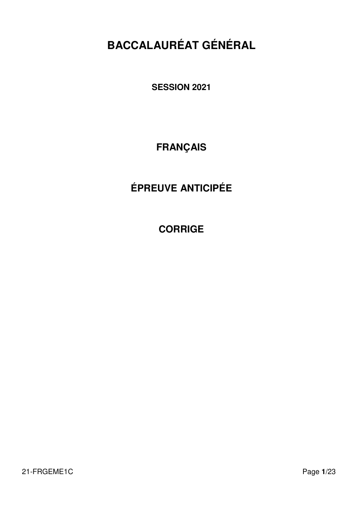

---

## Page 2

Éléments de réponse

                                                      Commentaire

PRÉAMBULE

Ce document présente une lecture littéraire du texte proposé.

Son objectif est d’accompagner la réflexion des professeurs.

Il ne saurait donc, en aucun cas, représenter ce qu’une copie d’élève pourrait produire.

A sa manière et à son niveau, un candidat de 1ère abordera sans doute et développera quelques-
uns de ces éléments. S’il proposait d’autres pistes d’interprétation, s’il adoptait un angle de lecture
que ce document ne présente pas, il conviendrait bien entendu de les examiner dans un esprit
d’ouverture et en toute bienveillance.

La commission d’harmonisation académique appréciera la qualité des copies en examinant :
       -d’une part, ce qui relève des attentes liées à l’exercice (un devoir organisé autour d’un projet
de lecture cohérent, rédigé dans une langue correcte ; une démarche interprétative étayée par des
analyses précises)
       -d’autre part, tous les éléments qui pourraient valoriser, jusqu’à l’excellence, le travail du
candidat (la finesse et la pertinence des analyses et des interprétations ; un devoir qui mènerait
progressivement à une démonstration aboutie ; la mobilisation de connaissances personnelles au
service d’une lecture sensible du texte.)

                                                    *****

        Premier roman de Georges Perec, Les Choses propose essentiellement une « description de
[…] [s]a situation en tant que figure abstraite de jeune homme marié… faisant partie d’un jeune
couple, ayant une vingtaine d’années, ou ayant vingt-cinq ans, dans la France de 1962 »1. Par
situation, l’auteur entend non seulement évoquer sa condition sociale, une certaine bourgeoisie
consumériste au milieu des trente glorieuses, mais aussi et surtout une situation spatiale, celle de
son appartement, qu'il décrit depuis la table sur laquelle il rédige le roman.
         Dix ans avant Espèce d’Espace et Tentative d'épuisement d'un lieu parisien, le romancier
s’initie ainsi à l’écriture par la description. Chez Perec, elle n’a pas pour vocation de représenter le
plus fidèlement possible le réel, mais doit en proposer une image à déchiffrer. La description ne se
fait en effet que par métonymie, connotation, par une sélection de quelques objets du quotidien qui
ont une portée symbolique : l’infra-ordinaire. Influencé par sa lecture de Mythologies de Roland
Barthes, Perec est convaincu qu’il faut engager l’observateur à interpréter la représentation. Il donne
donc à voir des lieux qui sont significatifs et invitent à la critique, à aiguiser son regard pour interroger
l’ordinaire : « Peut-être s’agit-il de fonder enfin notre propre anthropologie : celle qui parlera de nous,

1 Georges Perec, « À propos de la description » [1981], Entretiens et Conférences, éd. Dominique Bertelli et Mireille

Ribière, Nantes, Joseph K., 2003, t. II, p. 236.
21-FRGEME1C                                                                                              Page 2/23

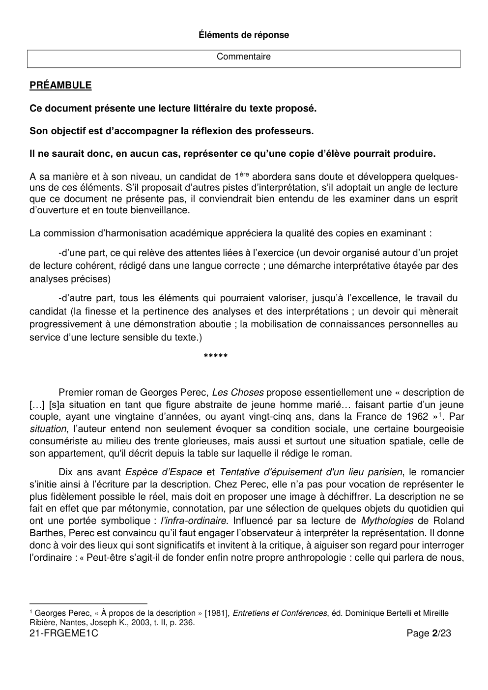

---

## Page 3

qui ira chercher en nous ce que nous avons si longtemps pillé chez les autres. Non plus l’exotique,
mais l’endotique. »2.
       Les élèves sont donc invités à lire cette page de description comme le portrait critique d’une
jeunesse matérialiste incapable de se contenter d’un confort médiocre mais réel. Ils pourront ainsi y
découvrir l’expression d’une démesure qui condamne Jérôme et Sylvie à l’échec. Ils pourraient enfin
interroger la manière dont s’exprime une force des choses.

       La description d’un appartement réel et rêvé.

                 Opposition de l’espace de vie réel à l’espace de vie potentiel.
                  Le texte repose sur trois descriptions différentes d’un même lieu : celle d’un
                  potentiel imaginé par le narrateur qui propose un aménagement « judicieux », celle
                  de l’appartement réel dans lequel vivent Jérôme et Sylvie, et enfin, celle de
                  l’appartement fantasmé par le jeune couple.
                  L’état actuel de la demeure est évoqué par des termes péjoratifs comme « bois
                  sale », « grossières », « disgracieuses », qui indiquent une certaine modicité, et
                  par des termes négatifs tels que « défectueuse », « désordre »,
                  « insupportable », dont les préfixes privatifs mettent en valeur l’idée d’une
                  dégradation.
                  Le foyer potentiel, au contraire, construit un espace chaleureux par un jeu sur le
                  double. Ainsi trouve-t-on le déterminant « deux », un parallélisme « pour Sylvie à
                  gauche, pour Jérôme à droite », et l’anaphore de « même », qui traduisent
                  l’harmonie. L’auteur exprime une certaine abondance par des accumulations. En
                  outre, le motif de la métamorphose (le verre « transformé en lampe », le décalitre
                  qui « servait de corbeille ») donne à l’ensemble une dimension poétique. Enfin, le
                  premier paragraphe s’achève sur l’idée qu’une bonne disposition des meubles
                  permet une bonne disposition mentale dans tous les domaines (amis, travail et
                  couple).
                  L’opposition de ces deux premières descriptions permet donc au lecteur de
                  mesurer l’envergure du potentiel inexploité.

                 Le rejet d’un projet trop médiocre.
                  Mais ce projet reposant sur un équilibre entre un confort charmant et une
                  imperfection matérielle ne convient pas aux esprits excessifs de Jérôme et Sylvie.
                  L’appartement potentiel reste en effet médiocre à leurs yeux. Les extensions du
                  nom soulignent à la fois la qualité des éléments « très belle », « Second Empire »,
                  « serti d’étain », et des éléments très abîmés « branlante », « dont plusieurs
                  manquaient », « vieux ».
                  Cette demi-mesure ne peut véritablement les satisfaire car ce compromis va à
                  l’encontre du caractère catégorique du couple, qui s’entend dans l’expression
                  exclusive hyperbolique « tout ou rien », idée illustrée par la parataxe des
                  phrases « La bibliothèque serait de chêne ou ne serait pas. Elle n’était pas. ». Ces
                  propositions juxtaposées traduisent la logique brutale de ce couple frustré par une
                  situation économique intermédiaire qui lui est insupportable.

2 Extrait de L’Infra-ordinaire de Georges Perec, Le Seuil, 1989

21-FRGEME1C                                                                              Page 3/23

---

## Page 4

 Description d’un regret.
             L’aménagement décrit dans le premier paragraphe n’est jamais envisagé par les
             personnages.
             Le texte s’ouvre sur un conditionnel passé qui réfute la potentialité du projet en la
             plaçant d’emblée dans le temps du regret. Le subjonctif passé, associé aux
             modalisateurs « sans doute » et « incontestablement », laisse entendre la voix
             d’un narrateur qui juge l’état actuel du logement et, par extension, l’état d’esprit
             des personnages. Ainsi peut-on lire que l’espace est « mal utilisé », qu’un meuble
             est « trop gros » et que toute amélioration est impossible à cause des « rêveries
             trop grandes » et de la « complaisance étrange » des locataires. Le jugement des
             lieux par le narrateur a donc pour corollaire le jugement des individus qui y vivent.
             Les descriptions ne sont pas ici réalistes mais significatives ; l’auteur pose un
             certain regard sur l’homme et la société.

     Une tragédie du consumérisme bourgeois des années soixante.

            La démesure comme obstacle au bonheur.
             Les différentes descriptions du lieu traduisent la frustration du couple.
             On sent en effet qu’un obstacle s’oppose à l’épanouissement de Jérôme et Sylvie.
             La conjonction « mais » placée à deux reprises en début de paragraphe met en
             évidence cette contrariété de leurs désirs. On comprend d’ailleurs que les
             personnages sont eux-mêmes à l’origine de leur malheur. La métonymie dans
             l’expression « le cœur n’y était pas » nous permet d’envisager que la source du
             problème est d’ordre émotionnel ; hypothèse confirmée par l’expression « avec
             quelque amour » qui exprime le désintérêt du couple pour un espace qui n’est pas
             à la mesure de ses espérances.
             La rage consommatrice consume les jeunes gens qui ne parviennent pas à se
             contenter de leur condition médiocre.

            L’hybris du consommateur : tout est disproportion.
             La démesure de Jérôme et Sylvie n’est pas sans évoquer l’hybris tragique.
             La disproportion entre les événements et la réaction qu’ils entraînent est en effet
             soulignée par l’auteur avec un excès qui prend des airs de tragédie parodique. Il
             faut ainsi « trois ans » pour réparer une prise de courant, « six mois » pour un
             cordon de rideau, et « la plus petite défaillance » entraîne le désordre en moins de
             vingt-quatre heures. La précision temporelle et le superlatif de supériorité mettent
             en lumière l’ampleur d’un désastre, certes trivial, mais conséquent. Tout le projet
             de Perec consiste en effet à nous faire ouvrir les yeux sur cet infra-ordinaire que
             l’on n’interroge plus.
             Le drame domestique de Jérôme et Sylvie est en effet si considérable que les
             valeurs sont inversées. En effet leur appartement est si désagréable que « la
             bienfaisante présence des arbres et des jardins si proches [le rend] plus
             insupportable encore», quand ils faisaient pourtant leur bonheur au début du
             roman.

21-FRGEME1C                                                                          Page 4/23

---

## Page 5

 Prise de distance trop grande avec le réel : effondrement fatal des
             espérances.
             La démesure des ambitions de Jérôme et Sylvie les piège. À l’instar de Mme
             Bovary, ils semblent nourrir leur frustration de rêves si grands qu’ils creusent
             toujours plus profondément l’abîme de leur déception. Soumis à leurs espérances,
             ils rejettent le réel. Ainsi, dans l’expression « L'immensité de leurs désirs les
             paralysait », le lecteur s’aperçoit que les personnages sont devenus les victimes
             (l’objet grammatical) de leur démesure. De même, on peut lire dans la
             personnification « Le provisoire, le statu quo régnaient en maîtres absolus » la
             défaite d’un couple qui renonce à vivre décemment. Enfin, la fatalité s’invite dans
             la restriction « Ils n’attendaient plus qu’un miracle » et toute entreprise concrète
             est dédaignée puisque les « actions réelles » et le « projet rationnel » sont
             associés au polyptote « nullité », « nul ».
             Cette tragédie quotidienne parodique nous invite à un regard critique, à une lecture
             satirique d’une jeunesse rongée par le consumérisme des années soixante. Mais
             au-delà de cette interprétation sociale, ne peut-on pas voir dans cette page
             l’expression de la domination des choses sur notre existence ?

     La force des choses.

            Les personnages, victimes de leur espace, s’effacent au profit des objets.
             Dans le texte, les objets et l’espace semblent doués d’une vie autonome, comme
             si leur existence s’imposait aux habitants.
             Ainsi, le désordre semble envahir l’espace et s’accumuler de lui-même : les fils et
             les rallonges, comme animés, « couraient, sur presque tous les murs », et « les
             livres s’empilaient sur deux étagères », ce qui implique un débordement à la fois
             vertical et horizontal, que la tournure pronominale détache de tout agent
             responsable. Cette vitalité exceptionnelle s’oppose à la passivité extrême des
             locataires que « la seule perspective des travaux […] effrayait. », terreur mise en
             valeur par la gradation « emprunter, économiser, investir ».
             Ainsi, le couple est présenté comme incapable de tout esprit d’initiative, comme si
             les personnages étaient eux-mêmes à l’abandon (« ils s’abandonnaient »), tandis
             que leur logement semble poursuivre son existence sans eux.

            L’attente d’une métamorphose miraculeuse.
             On comprend dès lors pourquoi Jérôme et Sylvie s’en remettent à ce point à une
             force des choses qui est la seule à pouvoir les faire sortir de leur torpeur.
             La seule issue envisagée est en effet décrite comme un processus qui se
             déroulerait sans leur intervention, en leur absence. Les tournures passives des
             transformations potentielles « être […] remplacé », « une série de placards pouvait
             surgir », « pour peu qu’elle fût repeinte, décapée, arrangée » laissent déjà
             entendre le manque d’implication des personnages. Mais la manière dont
             l’appartement fantasmé est décrit est plus probante encore, puisque la
             transformation se déroule alors que Sylvie et Jérôme « seraient partis en
             croisière » ; ils découvriraient ainsi à leur retour un foyer « merveilleusement »
             métamorphosé, dont l’impression générale, les détails et même le fonctionnement
             invisible dépassent les attentes matérialistes du couple – voire le réalisme tout
             simplement – pour n’être qu’une projection fictionnelle.

21-FRGEME1C                                                                         Page 5/23

---

## Page 6

Le « miracle » ne peut s’accomplir s’ils sont présents. Georges Perec souligne
              ainsi l’absurdité de ce lieu qui n’est plus ; ni un espace de vie, ni une réalité
              concrète.

          Un lieu fictionnel qui invite le lecteur à observer le monde.
           Dans le titre Les Choses, Perec nous invite à prendre une distance avec les objets
           qui meublent cet intérieur et à les considérer pour ce qu’ils signifient, comme des
           mots choisis qui doivent guider notre regard sur notre propre espace.
           Cette invitation au recul se distingue dans le choix de termes qui évoquent la
           rédaction même du roman : « buvard », « crayons », « papier », « bibliothèque »,
           « livres ». L’activité littéraire de l’auteur est ainsi au centre du tableau, ce qui nous
           amène à considérer le projet d’écriture lui-même.
           Ainsi, le « portulan » constitue-t-il une mise en abyme vertigineuse : point de mire
           de l’appartement, il n’est pas une représentation fidèle du port mais une carte qui
           indique les voies navigables et les dangers, un outil pour progresser en mer ; plus
           encore, il s’agit de la « reproduction d’un portulan », ce qui ajoute un degré dans
           la distance entre l’objet et sa représentation. L’auteur semble nous convier à
           observer notre propre espace, à examiner notre rapport au monde, non de manière
           pragmatique mais de manière symbolique : nous devons nous demander ce que
           notre environnement représente véritablement afin de pouvoir comprendre qui
           nous sommes.

21-FRGEME1C                                                                            Page 6/23

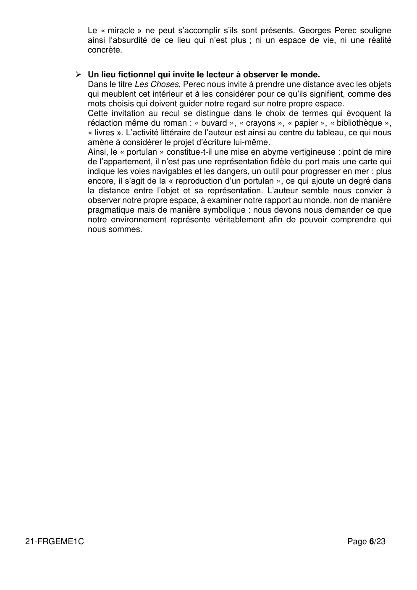

---

## Page 7

Éléments de réponse

                                            Dissertation

PRÉAMBULE

En réponse au sujet proposé, ce document présente un ensemble d’éléments et d’analyses,
dans un développement organisé.

Son objectif est d’accompagner la réflexion des professeurs, qui auront pu choisir d’étudier
avec leurs élèves une autre œuvre du programme.

Il ne saurait donc, en aucun cas, représenter ce qu’une copie d’élève pourrait produire.

A sa manière et à son niveau, un candidat de 1 ère abordera sans doute et développera quelques-
uns de ces éléments.
La commission d’harmonisation académique appréciera la qualité des copies en examinant :
       -d’une part, ce qui relève des attentes liées à l’exercice (une réflexion organisée et rédigée
dans une langue correcte, en réponse à la question posée, fondée sur la connaissance de l’œuvre
éclairée par le parcours associé).
       -d’autre part, tous les éléments qui pourraient valoriser, jusqu’à l’excellence, le travail du
candidat (une finesse d’analyse ; une réflexion particulièrement nuancée ; la mobilisation pertinente
d’une culture littéraire solide).

[Entre crochets figurent quelques références et analyses témoignant d’un travail qui aurait
pu être conduit en classe dans le cadre du parcours associé. Par définition, ces exemples
précis ne peuvent évidemment être considérés comme attendus ; ils cherchent seulement à
illustrer l’un des ressorts de l’exercice : la réponse au sujet de dissertation s’enrichit bien du
travail connexe qui aura été mené autour de l’œuvre inscrite au programme, notamment dans
le cadre du parcours associé.]

Objet d'étude : La poésie du XIXe siècle au XXIe siècle
Sujet A
Œuvre : Victor Hugo, Les Contemplations, livres I à IV
Parcours : les mémoires d’une âme.

Dans la préface des Contemplations, Victor Hugo décrit son recueil comme un miroir tendu
aux lecteurs.
En quoi cette image rend-elle compte de votre lecture des quatre premiers livres du recueil?

Vous répondrez à cette question dans un développement organisé en vous appuyant sur les
livres I à IV du recueil de Victor Hugo, sur les textes que vous avez étudiés dans le cadre du
parcours associé et sur votre culture personnelle.

21-FRGEME1C                                                                             Page 7/23

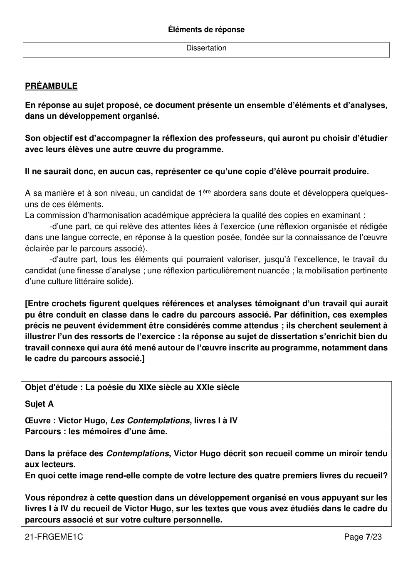

---

## Page 8

Le sujet se fonde sur une métaphore utilisée par Victor Hugo lui-même dans la préface du recueil,
celle du miroir pour désigner l’entreprise poétique qui est la sienne dans Les Contemplations. Le
poète invite ses lecteurs à voir leur propre portrait à travers celui qu’il brosse de lui-même dans son
recueil, et il s’agit donc bien de mesurer la portée universelle de la poésie de Victor Hugo dans un
recueil qui semble pourtant autobiographique.

       Les quatre premiers livres du recueil sont un « miroir » tendu aux lecteurs : l’œuvre
        apparaît comme le reflet de la destinée humaine tout entière.

     La préface donne aux lecteurs des clés de lecture : Victor Hugo y décrit son projet
        poétique, celui de peindre sa vie d’homme pour mieux décrire la destinée de
        l’humanité entière.
    En parlant de lui, le poète tend en effet à évoquer les autres hommes aussi. La préface des
    Contemplations rappelle la volonté de Victor Hugo de parler au nom de tous les hommes : « Ma
    vie est la vôtre, votre vie est la mienne, vous vivez ce que je vis ; la destinée est une ». La
    préface établit donc une correspondance entre le « je » et le « vous ». Le poète entend ainsi
    évoquer sa vie personnelle pour exprimer la destinée, en particulier le malheur, de tous les
    hommes. Le discours lyrique, personnel et intime, de Victor Hugo dans Les Contemplations est
    paradoxalement universel. Le critique Yves Vadé décrit ainsi le lyrisme particulier des
    Contemplations : « une voix lyrique débordant toute personnalité3 », comme si le « moi » de
    Victor Hugo correspondait en définitive au « moi » de tout être humain.
    On comprend alors l’emploi de la métaphore filée du miroir tendu aux lecteurs utilisée par le
    poète dans la préface : « Ceux qui s’y pencheront retrouveront leur propre image dans cette eau
    profonde et triste, qui s’est lentement amassée là, au fond d’une âme ».

     Les thèmes présents dans l’œuvre sont d’ailleurs universels.
    L’amour, la mort, la nature, la famille, le questionnement métaphysique, sont autant de
    thématiques présentes dans les poèmes des quatre premiers livres des Contemplations et qui
    concernent tous les êtres humains. Ainsi, le deuil de Léopoldine constitue le cœur même de
    l’ouvrage et la place accordée à la fille disparue est essentielle dans le recueil. Sa mort marque
    même le passage brutal d’ « Autrefois » à « Aujourd’hui ». Mais dans un mouvement
    d’élargissement propre au lyrisme hugolien des Contemplations, le chant du poète endeuillé
    prend une dimension universelle : Hugo chante la mort de ses proches sur un plan strictement
    personnel, mais il dépeint la perte des êtres chers en général. D’où la présence récurrente dans
    le recueil des personnages d’orphelins, des pères et des mères en deuil. Dans le livre III par
    exemple, deux poèmes s’insurgent contre la cruauté de la nature qui emporte les enfants : « À
    la mère de l’enfant mort » (III, 14) et « Épitaphe » (III, 15).

3 « Hugocentrisme et diffraction du sujet », dans Rabaté D., Sermet J. et Vadé Y. (dir.), Le Sujet lyrique en question,

Bordeaux, Presses universitaires de Bordeaux, 1996, p. 87.
21-FRGEME1C                                                                                             Page 8/23

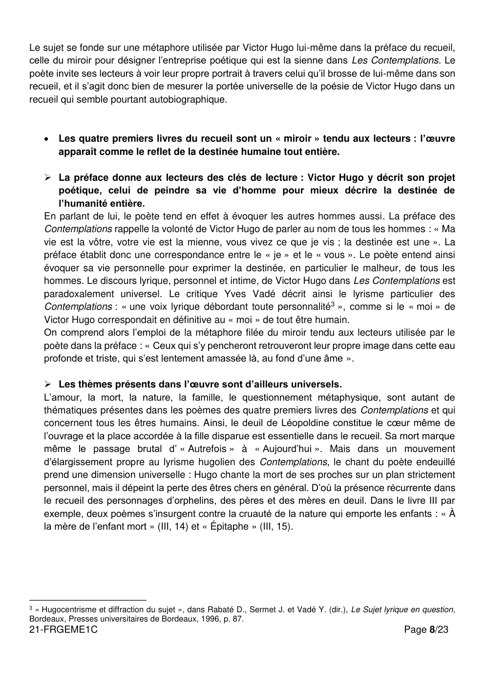

---

## Page 9

 Le recueil propose une vision sociale et politique engagée pour la défense du peuple :
       en ce sens, le poète cherche bien à brosser le portrait de la société et en particulier
       celle des « misérables ».
   Dans les Contemplations, la déploration dépasse la sphère intime et se teinte d’accents
   politiques. D’ailleurs, il convient de rappeler que le recueil a été pensé comme un pendant des
   Châtiments, publié en novembre 1853, et dans lequel Hugo fustige Napoléon-le-Petit. Dans Les
   Contemplations, la figure de sa fille peut apparaître aussi comme une figure métaphorique de la
   liberté bafouée par Louis-Napoléon Bonaparte. Hugo emploie volontairement des périphrases
   pour gommer la référence et permettre le glissement métaphorique. Tout comme Léopoldine est
   la victime du « fleuve qui pleure » (« Charles Vacquerie », IV, 17), la liberté est dépeinte dans
   Les Châtiments comme « une femme morte et qu’on vient de noyer ». En outre, dépouillé par la
   proscription du statut de grand poète institutionnel, Victor Hugo est désormais symboliquement
   solidaire du peuple auquel il s’adresse. Le poème « Melancholia » développe ainsi l’image du
   « peuple océan jetant l’écume populace » que l’on retrouve aussi dans le recueil de 1853.
   Finalement, on peut dire que les quatre premiers livres des Contemplations ne renoncent pas
   totalement à toute dimension politique et le lyrisme que Victor Hugo y déploie prend la forme
   d’un réel engagement politique et humain, et s’engage par là-même pour l’humanité.

[On pourrait se référer de manière plus précise au recueil Les Châtiments ou citer par exemple
Théodore de Banville et son poème « Misère » (in Nous tous, 1883) : « Hommes, femmes, vieillards
enfin, / Tous ces vains chercheurs de problèmes / Souffrent du froid et de la faim ; / Aussi les petits
enfants blêmes ». Pourquoi ne pas aussi rapprocher certains poèmes du livre III des
Contemplations du projet des Misérables, qui date de 1845, et du Discours sur la misère de juillet
1849 ?]

    Le recueil peut donc se lire comme le reflet de l’humaine condition.

      Pourtant, le poète puise ses sujets dans sa vie personnelle, et en ce sens, le recueil a
       une vraie dimension autobiographique et semble aussi constituer un véritable
       autoportrait de Victor Hugo.

    Les « Mémoires » d’une âme : le recueil est constitué du récit des expériences intimes
     du poète, et en ce sens, de nombreux poèmes qui composent les quatre premiers
     livres du recueil sont autobiographiques.
   - Bien que l’idée des Contemplations naisse dès les années 1840 et que certains des poèmes
     datent même des années 1830, deux événements majeurs vont façonner le recueil, l’un
     politique, l’autre personnel : la trahison de Louis-Napoléon Bonaparte qui mène Hugo en exil
     dès 1851, et la mort brutale de sa fille Léopoldine en 1843. Cette expérience du deuil et de
     l’exil pousse Victor Hugo à interroger le sens de sa propre existence. Ainsi, l’organisation du
     recueil en deux parties, « Autrefois » et « Aujourd’hui », s’articule autour de l’événement
     tragique de la mort de Léopoldine et la séparation est clairement marquée par la date du
     deuil.
   - La préface du recueil tend à mettre elle aussi en évidence cette forte dimension
     autobiographique. Victor Hugo y évoque une « destinée […] écrite là jour à jour», et établit
     que « Vingt-cinq années sont dans ces deux volumes », avant d’ajouter : « C’est l’existence
21-FRGEME1C                                                                             Page 9/23

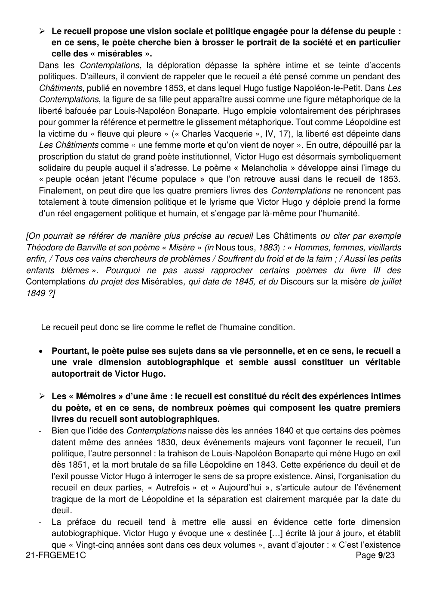

---

## Page 10

humaine sortant de l’énigme du berceau et aboutissant à l’énigme du cercueil ; c’est un esprit
       qui marche de lueur en lueur en laissant derrière lui la jeunesse, l’amour, l’illusion, le combat,
       le désespoir, et qui s’arrête éperdu ‘au bord de l’infini’ ». Le recueil accumule d’ailleurs les
       allusions à l’histoire personnelle de Hugo : le deuil de sa fille, l’exil, les lieux réellement
       fréquentés (Les Feuillantines, les Roches, le château de la Terrasse, Jersey, Guernesey),
       les amis réels (Auguste Vacquerie) et les combats du siècle.
   -   Ce recueil, qui se présente comme les « Mémoires d’une âme » et entreprend de sonder le
       « cœur » et la « conscience » de son auteur, exalte l’intimité chère aux romantiques. La
       première personne du singulier y est d’ailleurs omniprésente, à tel point qu’on a pu lire dans
       Les Contemplations l’exhibition d’un Moi.

[La notion de lyrisme romantique serait ici intéressante à aborder, en s’appuyant sur des poèmes
de Lamartine par exemple. On pourrait aussi se référer à l’entreprise autobiographique de
Rousseau, ou à l’étude d’un autre recueil poétique autobiographique : Le Roman inachevé de Louis
Aragon par exemple, ou Les Regrets de Joachim Du Bellay.]

    Le recueil se construit en particulier comme le tombeau de la fille disparue,
     Léopoldine.
   - Hugo n’écrit aucun vers entre septembre 1843 et janvier 1846 : il est rendu mutique par la
     douleur. La mort interrompt l’écriture mais la relance aussi. En effet, le poète semble
     dépossédé de sa parole par la douleur du deuil et de l’exil, mais il réinvente par l’écriture le
     chant poétique. Ainsi, on peut dire que d’une certaine manière, le recueil peut être lu comme
     le tombeau de la voix poétique : Hugo ensevelit sa parole pour mieux la refonder. Accablé
     par le chagrin, Hugo dit son désir de mourir. « Veni, vidi, vixi » l’inscrit même dans son titre
     (« vixi » signifiant « j’ai vécu », soit « je suis mort »), IV, 13. La chronologie des poèmes
     semble quant à elle arrêtée dans le livre IV, il n’y a plus de progression temporelle, comme
     si la voix poétique était sur le point de se figer.
   - Au centre symbolique du recueil, la ligne de points qui suit la date du « 4 septembre 1843 »
     signale un poème absent. La disparition de l’enfant entraîne l’extinction de la voix poétique,
     formulée dans un poème qui a pour objet la mort d’un autre enfant : « Oh ! la parole expire
     où commence le cri ; / Silence aux mots humains ! » (III, 23). Comme l’écrit le critique Laurent
     Jenny, c’est à partir de ce « point de mutisme » que peut s’élever la parole poétique,
     « conversion musicale du silence ». On peut ainsi dire que l’écriture des Contemplations
     transforme la douleur personnelle du poète en chant poétique.

       Le recueil laisse donc pourtant bien entendre la voix singulière de Victor Hugo, père
       endeuillé qui utilise l’écriture poétique pour faire le deuil de sa fille Léopoldine.

21-FRGEME1C                                                                                 Page 10/23

---

## Page 11

   Néanmoins, par l’expression d’une expérience intime que le poète semble
      recomposer, Victor Hugo invite bien ses lecteurs à voir dans Les Contemplations le
      reflet de l’humaine condition.

   En effet, l’autobiographie telle qu’elle se présente dans le recueil est falsifiée par le
    poète afin de construire un récit qui vise à généraliser son expérience personnelle. Ce
    n’est plus tout à fait le reflet de Victor Hugo qui s’y dessine en définitive.
  - La trame chronologique qui se dessine dans le recueil est en effet symbolique : plus des
    deux tiers des poèmes des Contemplations ont été écrits en exil, entre 1854 et 1855, et
    notamment le poème censé être le plus ancien, « La coccinelle » (I, 15) daté de mai 1830
    mais en réalité écrit à Jersey en octobre 1854. L’auteur élabore en fait surtout un mythe
    autobiographique en manipulant les indications spatio-temporelles au bas des poèmes. Par
    exemple, les poèmes I, 4 et I, 6 sont censés avoir été écrits à « La Terrasse » en 1840. Ils
    ont en fait été composés respectivement en 1854 à Jersey et en 1846 à Paris. En falsifiant
    leur date d’écriture, Hugo associe symboliquement les souvenirs heureux qu’évoquent ces
    deux textes au lieu de villégiature de la Terrasse, apprécié de Léopoldine, et donc synonyme
    de bonheur pour l’auteur.
  - Le recueil construit donc une destinée qui emprunte nombre d’éléments à la biographie de
    Hugo, mais qui n’est pas tout à fait la sienne. Le moi qui est à l’origine des Contemplations
    est fictif : le poète reconstruit donc son histoire afin de lui donner du sens. Cette
    recomposition symbolique de l’histoire personnelle participe de la reconstruction d’une parole
    poétique et par là, d’un « je » en résonnance avec l’universel.

   Parce que l’expérience la plus intime est souvent la plus commune, le lecteur peut lire
    dans les poèmes des Contemplations un reflet de sa propre existence.
  - Nous avons dit que le recueil prenait la forme d’un hommage funèbre évident à la fille
    disparue, Léopoldine. Pourtant Hugo prend soin de ne pas citer son nom. Il ne la désigne
    qu’en fonction du lien affectif qui la relie à lui. Ainsi la référence à la dixième Bucolique de
    Virgile dans la formule concise et elliptique « Pauca meae » illustre le refus de toute effusion.
    La date de la mort de l’enfant est certes inscrite au cœur du livre IV et du recueil, suivie d’une
    ligne de points qui en souligne visuellement l’importance fondatrice, et elle est relayée par
    des inscriptions au bas des poèmes (4 septembre, ou « le jour des morts » en IV, 5 ; « en
    revenant du cimetière », IV, 11), comme pour renfermer le souvenir de la morte.
  - Mais si Hugo ne nomme pas explicitement Léopoldine, c’est également pour transcender la
    seule dimension intime de son tombeau poétique, ce qui est déjà préparé par l’évocation de
    deuils et de chagrins qui ne sont pas les siens : ainsi le recueil fait-il aussi référence à la mort
    d’autres enfants (Claire Pradier, la fille de Juliette Drouet, les neveux d’Auguste Vacquerie),
    et au désespoir d’autres parents (« Et le cœur de la mère en proie à tant de soins, / […] Est
    vide et désolé pour cet enfant de moins ! », III, 15).
  - La préface rappelle d’ailleurs que « la destinée est une ». Par la mort, le sujet poétique
    s’élargit jusqu’à devenir le « je » de l’Humanité tout entière. La critique Ludmila Charles-
    Wurtz montre que Victor Hugo « construit le sujet fictif des Contemplations par exfoliation du
    sujet réel, détachant, lambeau par lambeau, l’écorce de l’individualité pour arriver à l’intime,
    c’est-à-dire à ce noyau de la subjectivité qui est le même pour tous ». C’est donc d’après
    cette critique par la déconstruction du moi intime et personnel, que le lyrisme hugolien touche

21-FRGEME1C                                                                                Page 11/23

---

## Page 12

à l’universel. D’un autre point de vue, c’est aussi par cette omniprésence du moi poétique,
      recréation du moi intime, que le lecteur est invité à plonger dans les abîmes de la conscience
      humaine.

    En effet, le lecteur est en définitive lui-même convié à se reconnaître dans le « moi »
     poétique pour communier dans un « moi » universel.
     C’est ce que dit la préface : « Hélas ! quand je vous parle de moi, je vous parle de vous.
     Comment ne le sentez-vous pas ? Ah ! Insensé qui crois que je ne suis pas toi ! ». Ainsi, le
     chant du poète endeuillé dans Les Contemplations prend une dimension universelle et les
     lecteurs sont explicitement invités à adopter la première personne du singulier, dans un
     double mouvement de réflexion, le lecteur se mirant dans le miroir que constitue et recueil et
     y découvrant le reflet, recomposé, du poète, et à travers lui, celui de la destinée humaine tout
     entière.

[Comment ne pas penser, ici, au poème inaugural des Fleurs du Mal : « Tu le connais, lecteur, ce
monstre délicat, / — Hypocrite lecteur, — mon semblable, — mon frère ! »].

21-FRGEME1C                                                                             Page 12/23

---

## Page 13

Éléments de réponse

                                            Dissertation

PRÉAMBULE

En réponse au sujet proposé, ce document présente un ensemble d’éléments et d’analyses,
dans un développement organisé.

Son objectif est d’accompagner la réflexion des professeurs, qui auront pu choisir d’étudier
avec leurs élèves une autre œuvre du programme.

Il ne saurait donc, en aucun cas, représenter ce qu’une copie d’élève pourrait produire.

A sa manière et à son niveau, un candidat de 1 ère abordera sans doute et développera quelques-
uns de ces éléments.
La commission d’harmonisation académique appréciera la qualité des copies en examinant :
       -d’une part, ce qui relève des attentes liées à l’exercice (une réflexion organisée et rédigée
dans une langue correcte, en réponse à la question posée, fondée sur la connaissance de l’œuvre
éclairée par le parcours associé).
       -d’autre part, tous les éléments qui pourraient valoriser, jusqu’à l’excellence, le travail du
candidat (une finesse d’analyse ; une réflexion particulièrement nuancée ; la mobilisation pertinente
d’une culture littéraire solide).

[Entre crochets figurent quelques références et analyses témoignant d’un travail qui aurait
pu être conduit en classe dans le cadre du parcours associé. Par définition, ces exemples
précis ne peuvent évidemment être considérés comme attendus ; ils cherchent seulement à
illustrer l’un des ressorts de l’exercice : la réponse au sujet de dissertation s’enrichit bien du
travail connexe qui aura été mené autour de l’œuvre inscrite au programme, notamment dans
le cadre du parcours associé.]

Objet d'étude : La poésie du XIXe siècle au XXIe siècle

Sujet B

Œuvre : Baudelaire, Les Fleurs du Mal
Parcours : alchimie poétique : la boue et l’or.

On a reproché à Baudelaire de « tout peindre, de tout mettre à nu » dans son recueil Les
Fleurs du Mal. Qu’en pensez-vous ?

Vous répondrez à cette question dans un développement organisé en vous appuyant sur le
recueil de Charles Baudelaire, sur les textes que vous avez étudiés dans le cadre du parcours
associé et sur votre culture personnelle.

21-FRGEME1C                                                                             Page 13/23

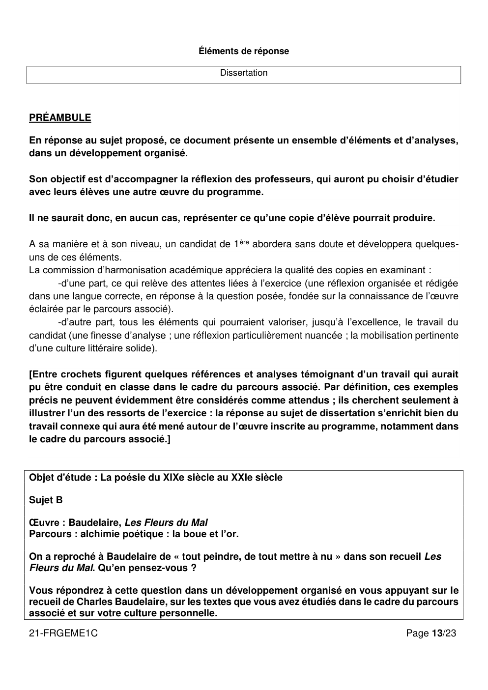

---

## Page 14

La citation est extraite du réquisitoire prononcé par le procureur Pinard lors du procès intenté à
Baudelaire en 1857 à la parution des Fleurs du Mal. Baudelaire est condamné pour « offense à la
morale publique, la morale religieuse et aux bonnes mœurs » à verser 300 francs d’amende, et six
poèmes sont censurés. Après la fin de l’audience, Baudelaire clame qu’il s’agit d’un malentendu. Le
scandale que provoque Les Fleurs du Mal fait écho aux autres procès en réalisme qui sont intentés
au XIXe siècle à des écrivains (Flaubert accusé par le même Pinard pour Madame Bovary, Zola
accusé d’écrire une « littérature putride ») ou à des peintres (Courbet pour L’Enterrement à Ornans
ou Manet pour Olympia).

Pour traiter le sujet, il convient d’expliciter d’abord la citation : en quoi Baudelaire cherche-t-il à « tout
peindre », et pourrait-on le ranger dans une veine réaliste, voire hyperréaliste ? Au-delà, comment
pouvons-nous comprendre le second élément de l’accusation : « tout mettre à nu » ?
Tenant ensuite à distance cette accusation, et nous souvenant des enjeux du parcours associé,
nous en viendrons à montrer que le recueil des Fleurs du mal ménage une effraction de la modernité,
et que Baudelaire transfigure la réalité bien plus qu’il ne la dépeint, donné tout entier à un projet
poétique singulier et sans doute révolutionnaire.

      Les Fleurs du mal : une poésie qui ne cache rien

           Une peinture du monde

Certes, il serait facile de relever au fil d’un recueil ancré dans son siècle les éléments qui pourraient
apparemment l’inscrire dans une veine nettement réaliste : Baudelaire se montre attentif à la réalité
dans laquelle il vit, et considère d’ailleurs le poète comme un « peintre de la vie moderne ». Les
poèmes de la section « Tableaux parisiens » (« Le Cygne », « Les Sept Vieillards ») sont pour lui
l’occasion privilégiée de capter l’étrange et fugitive beauté de la réalité urbaine :
       « Le vieux Paris n’est plus (la forme d’une ville
       Change plus vite, hélas ! que le cœur d’un mortel). »
Toutefois, le regard que le poète pose sur le monde qui l’entoure s’éloigne manifestement de celui
d’un copiste. Il se détourne obstinément de toute représentation mimétique de la ville, et on le voit
rarement se laisser situer dans l’espace réel (« Quand je traversais le vieux Carrousel… », « Le
Cygne »). C’est que le poète ne cherche pas à rivaliser avec la réalité, mais à en révéler toute la
profondeur. Sa mission, sa vocation peut-être, à l'instar de l'haruspice antique, consiste à lire les
signes de la nature, à faire advenir le phénomène à la signification, grâce à un réseau d’images et
de métaphores inédites.
En effet, son œil n’observe pas seulement la réalité matérielle du monde : il s’empare d’objets (« Le
flacon », « La pipe »), de paysages, de moments vécus, qu’il associe à des sensations. En ce sens,
Les Fleurs du Mal constitue bien une invitation au voyage, mais à un voyage sensoriel avant tout,
sensuel, particulièrement olfactif (« Parfum exotique », « Le balcon », « Harmonie du soir »,
« L’invitation au voyage »). Souvenons-nous de ces vers évocateurs tirés du « Parfum », deuxième
sonnet de l’ensemble « Un fantôme » : « Lecteur, as-tu quelquefois respiré / Avec ivresse et lente
gourmandise / Ce grain d'encens qui remplit une église, / Ou d'un sachet le musc invétéré ? ».
Baudelaire prend à témoin le lecteur, l’entraînant dans le récit d’une expérience partagée, celle d’un

21-FRGEME1C                                                                                     Page 14/23

---

## Page 15

souvenir qui parvient à revivre dans le concret de la sensation. Le poète est celui qui sait « l’art
d’évoquer les minutes heureuses », le « crépuscule du soir » comme celui du matin, tous les plaisirs
charnels, la volupté, le vin.

[Après Baudelaire, nombre de poètes proposeront, au XXe siècle, un voyage dans l’épaisseur du
monde, sans se contenter de le décrire, depuis les visions surréalistes jusqu’aux méditations d’un
Jaccottet et aux explorations d’Yves Bonnefoy, en passant par le travail de dissection d’un Ponge,
qui a lu Supervielle.]

          Une peinture de la misère des hommes

Dès le poème liminaire « Au lecteur », Baudelaire annonce la couleur de son recueil :
               « La sottise, l’erreur, le péché, la lésine,
               Occupent nos esprits et travaillent nos corps ».
La condition humaine, placée sous le signe de « Satan Trismégiste » est marquée par l’abjection,
vouée au mal. Le recueil se déploie ensuite comme la traversée du « chemin bourbeux » qu’est
l’existence : Paris, « fourmillante cité » ou « cité de fange » est peuplée de fantômes, de spectres
ou « démons malsains » qui s’éveillent « comme des gens d’affaire » (« Crépuscule du soir »), de
vieillards sinistres, d’assassins et de prostituées, « muses vénales », de mendiants aveugles
« vraiment affreux » (« les Aveugles »). « Race de Caïn », l’humanité est présentée comme fautive,
souillée, elle « rampe et meur[t] misérablement » dans la fange (« Abel et Caïn »).
Cette vision singulière explique la réception du recueil à sa parution : « L’odieux y coudoie l’ignoble,
le repoussant s’y allie à l’infect, jamais on n'assista à une semblable revue de démons, de fœtus,
de diables, de chloroses, de chats et de vermine. Ce livre est un hôpital ouvert à toutes les
démences de l'esprit, à toutes les putridités du cœur", écrit Le Figaro.
 Baudelaire outrepasse donc évidemment l’exercice d’une simple peinture réaliste : il ouvre les
 cœurs et fouille dans l’abject. C’est ainsi qu’il faut comprendre l’accusation de « tout mettre à nu ».
 « La Charogne », par exemple, suit une progression qui se rapproche de plus en plus de l’objet
 jusqu’au « ventre putride ». Le poète ne capte pas seulement la réalité matérielle du monde, il
 associe les sensations par un jeu de synesthésies, afin de révéler les mystères du monde. L’objet
 baudelairien le plus banal ouvre ainsi sur des profondeurs : l’horloge devient un « dieu sinistre,
 effrayant, impassible » qui conduit inéluctablement à la mort. Par les réseaux métaphoriques, il
 entre « comme un coup de couteau/ dans [le] cœur plaintif » des hommes (« le Vampire »), met au
 jour l’ennui qui les ronge et l’hypocrisie de ses lecteurs (« Au lecteur »). Baudelaire est bien, selon
 Rimbaud, « le premier voyant », et sa naissance, évoquée dans « Bénédiction », peut se lire comme
 une réécriture inversée de l’Annonciation, celle d’un prophète qui révèle au monde la douleur.

[Avec un poème comme « J’aime l’araignée, j’aime l’ortie », Victor Hugo ouvrait la voie à une poésie
« où aucun fruit n’est défendu ». La laideur des villes industrielles se retrouve dans Les Villes
tentaculaires de Verhaeren ou dans « Ville » de Rimbaud. Laforgue évoque aussi une humanité
horrible dans sa « Complainte du pauvre corps humain », tandis que Lautréamont exprime un dégoût
virulent de lui-même et du monde dans Les Chants de Maldoror.]

21-FRGEME1C                                                                                Page 15/23

---

## Page 16

   Les Fleurs du mal : une effraction de la modernité

            Une rupture avec la conception classique de la poésie
Le recueil mêle l’archaïque et le nouveau. Ce n’est pas que Baudelaire rejette spontanément l’Idéal
classique (« J’aime le souvenir de ces époques nues, / Dont Phoebus se plaisait à dorer les
statues »), mais celui-ci est désormais perçu comme hors d’atteinte dans un monde devenu laid, et
sous un ciel vide. « Le peintre de la vie moderne » ne peut plus peindre comme Rubens, Léonard
de Vinci, Rembrandt ou Michel-Ange évoqués dans « les Phares ». Enfant chéri des muses, le poète
a perdu son auréole sacrée. Dans Fusées, Baudelaire écrit ainsi : « Comme je traversais le
boulevard, et comme je mettais un peu de précipitation à éviter les voitures, mon auréole s’est
détachée et est tombée dans la boue du macadam ». « L’Albatros » évoque par une analogie la
condition du poète moderne ; « Le Cygne », ironiquement dédié à Victor Hugo, pointe une ville
défigurée. La laideur et la vilenie contemporaine se perçoivent également dans les heurts qui
viennent déranger les formes en apparence classiques des poèmes baudelairiens (par exemple,
outre le remplacement des rimes embrassées par des rimes croisées dans les quatrains, le sonnet
« La Cloche fêlée » admet de ces fêlures en effet dans le corps fluide des alexandrins, qui font
sonner une « voix affaiblie » et laissent s’installer un certain prosaïsme).

[Laforgue dans Les Complaintes et Corbière dans Les Amours jaunes décrivent aussi l’exil du poète
dans le monde moderne et chantent sur des lyres brisées ou des pianos désaccordés « À une
demoiselle, pour Piano et Chant ».]

           Une beauté autre

Fruit d’une distillation, « le beau est toujours bizarre » chez Baudelaire. S’éloignant là encore de la
conception classique de la beauté, dont on reconnaît les formes harmonieuses établies selon des
règles connues, Baudelaire fonde son esthétique sur la surprise et l’étonnement. Ses poèmes
marquent les esprits par l’alliance insolite entre une forme classique et un contenu provocateur, par
des images qui subjuguent par leur étrangeté : « Le soleil s’est noyé dans son sang qui se fige »
(« Harmonie du soir »). Baudelaire ne cherche donc pas à « tout peindre », ni même à « tout mettre
à nu », comme le lui reproche Pinard, mais plutôt à nous faire voir les choses autrement, à faire
accéder le lecteur à une autre vision du monde. Ce n’est pas tant le monde en lui-même qui
l’intéresse qu’un ailleurs qu’il rêve et appelle de ses vœux, dans « la Vie antérieure » ou dans « la
Chevelure » ; ce dernier poème lui permet, par le jeu des correspondances, de faire surgir « Tout
un monde lointain, absent, presque défunt ». Dans « L’Invitation au Voyage », par la puissance
incantatoire de son chant et notamment du refrain, le poète magicien transforme et sublime le
monde.
La prolifération des métaphores autour de la femme aimée dilue en fait sa personne jusqu’à
l’expulser d’elle-même : dans « Les Bijoux », pièce condamnée, nulle beauté naturelle, mais des
bijoux artificiels, « bijoux sonores », bijoux verbaux peut-être, dont le poète orne le corps dont il
prend possession, le transformant en objet d’art.
La fréquence générale des apostrophes et des appositions abandonne aux groupes syntaxiques
une forte autonomie, ce qui nourrit et élargit la très grande liberté d’une parole poétique qui se donne

21-FRGEME1C                                                                                Page 16/23

---

## Page 17

à elle-même ses propres lois ; c’est le cas par exemple dans les six premiers vers de « Sed non
satiata » où les coréférences sont lâches et induisent une certaine équivoque.

[En cela, Baudelaire apparaît en précurseur des Surréalistes : pour eux, « la beauté sera convulsive
ou ne sera pas », et ils chercheront un accès à la surréalité révélée par les hasards objectifs, l’union
libre des mots : « La terre est bleue comme une orange /Jamais une erreur les mots ne mentent pas
», affirmera Paul Éluard.]

      Les Fleurs du mal : une poésie qui dévoile et révèle

             La boue transmuée en or : « l’alchimie du verbe »
Contrairement aux peintres qui se déclarent réalistes, Baudelaire méprise l’imitation du réel,
incarnée notamment par la photographie qui se développe et qu’il déteste – même s’il ne sait s’en
passer. Il ridiculise dans le Salon de 1859 le crédo réaliste et la « triviale image » sur laquelle la
« société immonde » se rue « comme un seul Narcisse ». Son œuvre n’a donc pas vocation à faire
voir l’abject, mais à le transfigurer; et c’est dans un projet d’épilogue pour son édition de 1861 qu’il
adresse à Paris la fameuse apostrophe : « Tu m’as donné ta boue et j’en ai fait de l’or ».
C’est pour extraire la beauté du mal que Baudelaire fait entrer en poésie des thèmes ou des motifs
traditionnellement considérés comme antipoétiques. Il a foi dans le pouvoir transmutateur de l’art,
la poésie est pour lui le laboratoire d’une alchimie capable de faire surgir une beauté d’un nouvel
ordre. Son inspiration est donc tendue entre deux pôles contraires, dont il produit une forme de
synthèse, ce qu’illustrent très bien par exemple les multiples antinomies de l’« Hymne à la beauté » :
« Viens-tu du ciel profond ou sors-tu de l’abîme, / Ô beauté ? ». Dans ce poème, tel Protée, la
beauté n’a plus le visage unique de l’Idéal, mais fluide, mouvante, changeante sous la lumière du
Spleen, elle est la coïncidence des contraires. Les figures héritées du Romantisme noir – vampires,
fantômes, revenants – sont sublimées par un travail de transfiguration poétique. Le poème « Une
Charogne » est emblématique de cette alchimie du verbe : ses oxymores manifestent la fusion des
contraires.

[D’autres poètes, à la suite de Baudelaire, mettent en œuvre cette alchimie poétique : Rimbaud dont
la « Vénus anadyomène » est peinte « belle hideusement d’un ulcère à l’anus » ; ou Claudel, qui
célèbre « le Porc » en concluant : « Je n’omets pas que le sang de cochon sert à fixer l’or. ».
Inversement, les poètes parnassiens refusent cette expérience et préfèrent rester dans le Beau,
sublime et précieux.]

            La magie du démiurge
Loin d’être un peintre du réel, le poète est donc un démiurge : il crée littéralement un monde, un
monde en poésie.
Pour Baudelaire, les fleurs de la poésie ne sont plus naturelles, le poète n’est plus inspiré par la
beauté de la nature comme dans l’esthétique classique où la nature était à la fois modèle et principe
de création. La poésie est désormais une activité sacrilège, voire blasphématoire, dans le sens où
un poète-pantocrator se fait le rival de Dieu, pouvant faire advenir le paradis sur terre sans se
résigner à l’attente (« Les Litanies de Satan »). Cette veine satanique, héritée du Romantisme, est
active dans Les Fleurs du mal.
21-FRGEME1C                                                                                Page 17/23

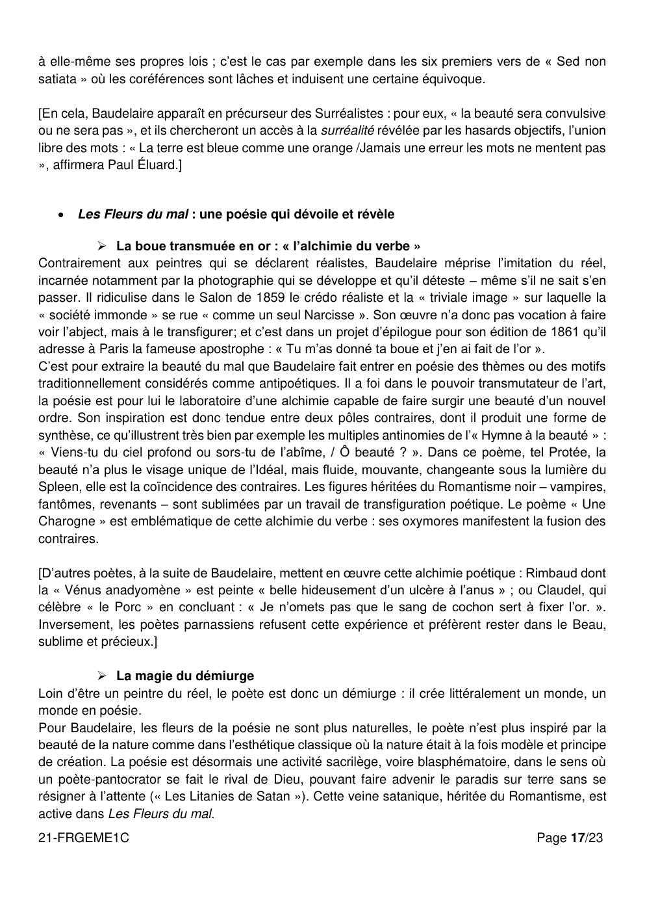

---

## Page 18

Le poème « Alchimie de la douleur » est représentatif de ce tournant éthique et esthétique : le poète
y démythifie la nature et montre dans le premier quatrain comment chacun projette sur elle sa
sensibilité ; l’image radieuse que donne d’elle une certaine tradition lyrique n’est pas plus légitime
que la vision funèbre des mélancoliques. Le second quatrain change d’interlocuteur et évacue la
nature ; Hermès renvoie au diable, parce qu’ils sont tous les deux trismégistes. Si l’alchimie est triste
alors, c’est parce qu’au rebours de la tradition, il « change l’or en fer », et non l’inverse, c’est-à-dire
que l’œuvre du poète est une dénaturation, dans une dynamique de négation. Le poète n’enfante
que des images de mort (« cadavre cher », « sarcophages »), et la nature est réduite au « suaire
des nuages », ce qu’il y a de plus fluide et informe, qui ne prête plus à la rêverie mais constitue le
tombeau de l’Idéal perdu.
Le sonnet suivant, « Horreur sympathique », prolonge « Alchimie de la douleur » : le poète est
« libertin », les « cieux déchirés » ne sont plus que « les corbillards de [ses] rêves », avec encore
une dégradation du sarcophage en vulgaires corbillards. Le cœur semble se substituer au soleil
couchant romantique : « Et vos lueurs sont le reflet / De l’Enfer où mon cœur se plaît ». La démarche
poétique est désormais intériorisée, tout est concentré dans cette image du cœur récurrente dans
Les Fleurs du mal ; dans la dernière phrase, le « je » est à la fois sujet et objet.

[Mallarmé, dans la continuité de Baudelaire, consacre l’autonomie totale de la poésie, qui ne reflète
plus qu’elle-même : « aboli bibelot d’inanité sonore ».]

Le monde que peint Baudelaire est en fin de compte son monde intérieur, c’est bien le « gouffre »
de son âme. Chaque poème met en scène la métamorphose de son moi, omniprésent (« je suis un
cimetière abhorré de la lune… », « Je suis un vieux boudoir plein de roses fanées… », « Je suis
comme le roi d’un pays pluvieux… ») même quand en apparence le sujet du poème est différent :
dans « Les Chats », « Les Hiboux », «la Pipe », le moi se projette dans toute forme d’altérité, ou lui
transfère sa substance en se dédoublant. Le poète devient le sujet et la matière de sa propre
expérience, il se dédouble, comme dans « L’Héautontimorouménos » : « Je suis la plaie et le
couteau ! ».
La poésie naît du poète qui fait l’offrande de son être et fait voir le monde à travers l’humeur noire
de son spleen. L’ivresse du vin permet une sorte de transe poétique qui permet l’émergence d’une
poésie nouvelle, comme dans « L’Âme du vin » :
             « En toi je tomberai, végétale ambroisie,
             Grain précieux jeté par l’éternel Semeur,
             Pour que de notre amour naisse la poésie
             Qui jaillira vers Dieu comme une rare fleur ».

[Rimbaud est évidemment l’héritier de Baudelaire : le poète, par « un long, immense et raisonné
dérèglement de tous les sens », parvient à l’inconnu, devient autre, devient les autres. On pourra
également comparer l’inspiration bachique à l’usage contrôlé de la mescaline chez Michaux, ou à
la pratique de l’hypnose dans le groupe surréaliste.]

21-FRGEME1C                                                                                  Page 18/23

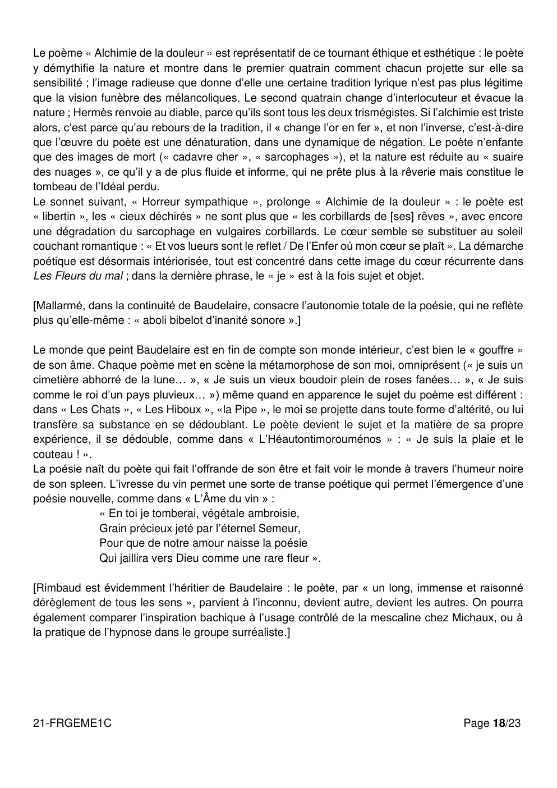

---

## Page 19

Éléments de réponse

                                            Dissertation

PRÉAMBULE

En réponse au sujet proposé, ce document présente un ensemble d’éléments et d’analyses,
dans un développement organisé.

Son objectif est d’accompagner la réflexion des professeurs, qui auront pu choisir d’étudier
avec leurs élèves une autre œuvre du programme.

Il ne saurait donc, en aucun cas, représenter ce qu’une copie d’élève pourrait produire.

A sa manière et à son niveau, un candidat de 1 ère abordera sans doute et développera quelques-
uns de ces éléments.
La commission d’harmonisation académique appréciera la qualité des copies en examinant :
       -d’une part, ce qui relève des attentes liées à l’exercice (une réflexion organisée et rédigée
dans une langue correcte, en réponse à la question posée, fondée sur la connaissance de l’œuvre
éclairée par le parcours associé).
       -d’autre part, tous les éléments qui pourraient valoriser, jusqu’à l’excellence, le travail du
candidat (une finesse d’analyse ; une réflexion particulièrement nuancée ; la mobilisation pertinente
d’une culture littéraire solide).

[Entre crochets figurent quelques références et analyses témoignant d’un travail qui aurait
pu être conduit en classe dans le cadre du parcours associé. Par définition, ces exemples
précis ne peuvent évidemment être considérés comme attendus ; ils cherchent seulement à
illustrer l’un des ressorts de l’exercice : la réponse au sujet de dissertation s’enrichit bien du
travail connexe qui aura été mené autour de l’œuvre inscrite au programme, notamment dans
le cadre du parcours associé.]

Objet d'étude : La poésie du XIXe siècle au XXIe siècle
Sujet C
Œuvre : Guillaume Apollinaire, Alcools
Parcours : modernité poétique ?

La poésie de Guillaume Apollinaire s’invente-t-elle en rejetant le passé ?

Vous répondrez à cette question dans un développement organisé en vous appuyant sur le
recueil Alcools, sur les textes que vous avez étudiés dans le cadre du parcours associé et
sur votre culture personnelle.

21-FRGEME1C                                                                             Page 19/23

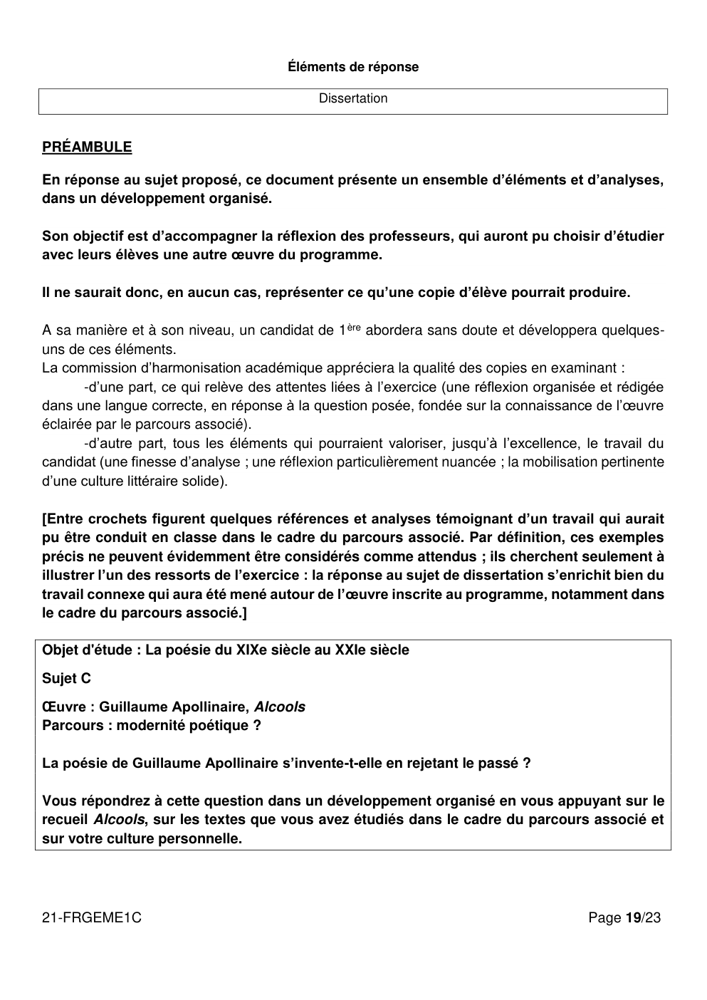

---

## Page 20

Le sujet porte à s’interroger sur le statut du « passé » dans le recueil de Guillaume Apollinaire. Qu’il
soit historique, littéraire ou personnel, l’élève est invité à réfléchir à la place que le passé prend dans
l’œuvre afin de nuancer l’idée d’une modernité qui se ferait sans lui, voire contre lui.
On va donc examiner si la poésie de Guillaume Apollinaire ne s’inscrit esthétiquement et
thématiquement que dans son époque ou si elle repose aussi sur une tradition littéraire, une histoire
personnelle ou partagée. Pour résoudre cet antagonisme, on pourrait envisager de placer le recueil
en dehors du cours du temps, en soulignant sa portée universelle.

      La poésie de Guillaume Apollinaire apparaît de prime abord d’une grande modernité.
       Elle est en adéquation avec son temps, nouvelle, inventive, créatrice.

              La poésie d’Apollinaire exprime la modernité du monde
               Le recueil évoque à plusieurs reprises la modernité de la ville, le développement
               industriel et les découvertes techniques, notamment dans le domaine des
               transports. Des innovations du style permettent la peinture de ce paysage du début
               du XXème siècle dans toute sa diversité et dans le mouvement qui l’anime : on
               retiendra notamment l’absence de ponctuation, les assonances préférées aux
               rimes, les vers qui s’allongent parfois démesurément, les expressions détachées,
               placées les unes à côté des autres. Ainsi, « Zone », qui s’ouvre sur la significative
               formule « À la fin tu es las de ce monde ancien », expose une série de tableaux du
               monde contemporain de l’auteur. Tout se croise sans ordre apparent et sans
               distinction : publicité, religion, aviation, ouvriers, comme si le poète, tel un cubiste,
               voulait rendre compte de l’incroyable vitalité de la modernité en la représentant
               presque simultanément sous divers angles.

[Certains élèves pourront voir l’opportunité de faire le lien avec Émile Verhaeren, auteur
contemporain qui associe l’expression de nouveaux paysages à une liberté prise avec la forme et
les images, notamment dans Les villes tentaculaires.]

              Le recueil témoigne de l’influence des artistes contemporains
               Les nombreuses dédicaces font écho à l’actualité artistique. En dédiant ses textes
               à ses amis auteurs et peintres, Apollinaire manifeste la grande diversité de ses
               influences. Il ne se plie jamais à un dogme mais va chercher partout de quoi nourrir
               son écriture. On retient notamment le célèbre nom de Picasso en exergue du
               poème « Les fiançailles », qui développe un lyrisme sans précédent dans les neuf
               textes qui le composent. À l’instar des tableaux de Pablo Picasso dont Claude Lévi-
               Strauss a pu dire qu’ils étaient « un admirable discours pictural beaucoup plus qu'un
               discours sur le monde », « Les Fiançailles » exprime l’abandon de la tradition vers
               un nouveau mode de représentation : « Pardonnez-moi de ne plus connaître
               l’ancien jeu des vers / Je ne sais plus rien et j’aime uniquement ».
[Un lien peut être fait entre le style de Guillaume Apollinaire et celui de Pierre Reverdy, qui lui aussi
cherche à rompre avec la tradition poétique sous l’influence des cubistes et des surréalistes.]

21-FRGEME1C                                                                                   Page 20/23

---

## Page 21

 Guillaume Apollinaire déploie dans Alcools une liberté de style propre à son
              époque
              Une licence extraordinaire est développée dans le recueil. Au-delà du renouveau
              formel, le langage du poète brise les interdits. Les images insolites qui rappellent le
              mouvement surréaliste (dont Apollinaire a inventé le nom avant de s’en écarter)
              côtoient les expressions les plus simples, parfois même les plus triviales. Le titre
              Alcools n’exprime pas seulement le procédé de distillation, l’alchimie, mais aussi ce
              qui désinhibe, l’agent de la fête et de l’excès. C’est ainsi que l’on peut croiser dans
              « Voie lactée » un « cul de dame damascène », ou dans les « Sept épées » un
              « chibriape » (mot-valise créé par Apollinaire composé de chibre et Priape). Dans
              une moindre mesure, l’enthousiasme spontané du poète s’entend dans les vers très
              courts de « Hôtels » ou dans l’énigmatique alexandrin qui compose à lui seul le
              poème « Chantre ».
[Les élèves pourront toutefois nuancer la nouveauté de cette audace en rappelant celle de
Rimbaud.]

      La poésie de Guillaume Apollinaire ne rejette pas le passé pour autant. Elle se
       construit avec lui et à travers lui.

             Le recueil laisse une large place au passé du poète
              La nostalgie domine l’œuvre. On relève dans les poèmes de nombreux éléments
              biographiques, tant dans les lieux parcourus que dans les individus évoqués. On
              peut ainsi lire « Marie » et « Annie », en reconnaissant assez facilement d’une part
              Marie Laurencin, peintre, poétesse, muse de l’auteur qui a partagé sa vie de 1907
              à 1912, et d’autre part Annie Playden, jeune anglaise rencontrée lors du séjour
              rhénan en 1900, qu’il tentera - en vain - de reconquérir avant qu’elle ne parte pour
              les États-Unis. Les anciennes amours sont dispersées dans le recueil sans, pour
              autant, suivre de chronologie. La section « Rhénanes », cependant, semble être au
              cœur du recueil comme une parenthèse passée qui rassemble les souvenirs du
              voyage au bord du Rhin. « Mai », en particulier, évoque la beauté des paysages et
              un amour révolu aux temps du passé où « celle que j’ai tant aimée » n’est plus
              nommée.
[Les élèves pourront faire le lien entre l’œuvre au programme et les poèmes de Blaise Cendrars qui
racontent ses voyages d’adolescent dans La Prose du Transsibérien et de la petite Jeanne de
France.]

             Alcools se nourrit aussi de notre bibliothèque commune
              Le recueil s’inscrit dans un passé historique et fictionnel. Apollinaire multiplie les
              références aux mythes et à la religion qui se mêlent et se confondent parfois, dans
              un élan mystique singulier. La « Chanson du Mal-Aimé », par exemple, nous permet
              de rencontrer le Phénix, Chanaan, Ulysse et Sacontale, avant que le poète ne
              s’exclame : « Mon beau navire ô ma mémoire / Avons-nous assez navigué ». Et
21-FRGEME1C                                                                             Page 21/23

---

## Page 22

quel voyage ! dans le mythe, la religion et la littérature, de l’Antiquité égyptienne ou
                gréco-latine à la Bible, sans oublier le drame hindou. Les lectures du poète
                semblent lui avoir fourni des images qui peuplent son imaginaire ; la sorcière Lorelei
                n’est qu’une nouvelle preuve du syncrétisme de l’auteur.

             Guillaume Apollinaire hérite des poètes qui l’ont précédé.
              L’influence symboliste est si prégnante que Georges Duhamel la lui a reprochée :
              « En lisant son recueil, on reconnait une foule de poètes, auxquels M. Apollinaire a
              voué un louable mais excessif amour. C’est Verlaine parfois, c’est Moréas souvent,
              c’est Rimbaud, dont monsieur G. Apollinaire ne semble pas devoir oublier jamais la
              voix profonde et terrible ». On reconnaît en effet dans ses poèmes la continuation
              des audaces stylistiques et thématiques de ces poètes de la fin du XIXème siècle,
              ainsi qu’une certaine mélancolie des romantiques allemands. Le simple titre
              « Automne malade » renouvelle la personnification des saisons qui permet
              l’expression des états d’âme. Plus évocateur encore, les titres successifs du recueil
              sont des preuves de la distance progressive que Guillaume Apollinaire prendra
              avec les poètes qui l’ont précédé : en particulier Roman du Mal-Aimé, qui renvoie
              ouvertement à Rimbaud. Le choix définitif pour Alcools témoigne néanmoins de
              l’envie d’un renouveau.
[Les élèves pourront illustrer le lien entre l’œuvre au programme et des poèmes plus anciens avec
des textes issus de « Tableaux Parisiens » ou du Spleen de Paris de Baudelaire, en particulier dans
la description des paysages urbains.]

      Le recueil, à la fois moderne et nourri du passé, acquiert une dimension universelle :
       la poésie de Guillaume Apollinaire semble presque « s’inventer » d’elle-même, comme
       une parole née en dehors du temps.

             Plus que de reposer sur une opposition du passé et de la modernité, le recueil
              s’appuie sur la conscience du temps qui passe
              On retrouve dans les poèmes le motif typiquement poétique du tempus fugit. Dans
              Alcools, le passé n’est jamais glorifié ou regretté sans ouverture vers l’avenir. Ainsi
              peut-on lire dans « Le Brasier » : « Voici ma vie renouvelée / De grands vaisseaux
              passent et repassent ». Ce poème dans lequel le passé est consumé dans un feu
              purificateur, développe l’image de l’eau qui coule pour symboliser la course du
              temps. Il associe les temps du passé, du présent et du futur, afin de créer un espace
              suspendu qui permet une prise de distance avec l’existence vécue. De la même
              façon, la structure du recueil, qui s’ouvre par le vers « A la fin tu es las » et s’achève
              sur « Les étoiles mouraient le jour naissait à peine », invite à le lire comme l’espace
              d’une transformation : le souvenir des déceptions est accepté comme la condition
              d’une création future. Le passé n’est remémoré que pour être dépassé et atteindre
              un renouveau au dernier vers.

21-FRGEME1C                                                                                Page 22/23

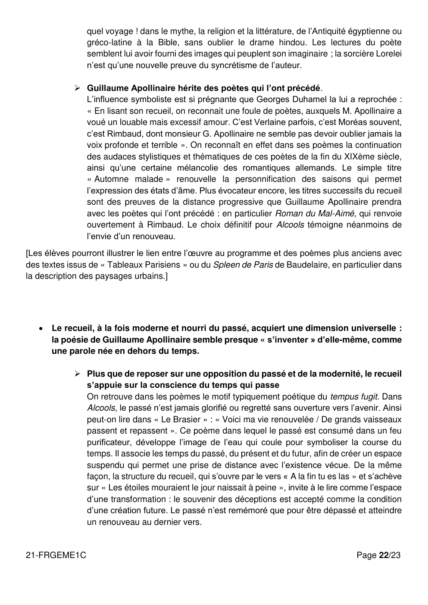

---

## Page 23

 Les choix formels transportent la poésie hors du temps
              Il paraît très superficiel de décider si le style du poète tient davantage de l’héritage
              symboliste, des innovations surréalistes ou d’une création propre à Apollinaire ;
              l’absence de ponctuation, elle-même, semble en réalité un choix relativement
              intemporel. En effet, si elle peut apparaître de prime abord moderne et inédite, elle
              peut aussi nous rappeler le grec mycénien en ce qu’elle impose un langage parfois
              cryptique qui gagne en profondeur mystique, une certaine force confuse, non sans
              rappeler la puissance du verbe. De la même façon, le célèbre « Pont Mirabeau »
              convoque le Moyen Âge avec son refrain, mais il y règne des indécisions
              syntaxiques (« L’amour s’en va comme cette eau courante / L’amour s’en va /
              Comme la vie est lente / Et comme l’Espérance est violente ») ainsi que certaines
              expressions énigmatiques (« Ni temps passé / Ni les amours reviennent »), comme
              s’il s’agissait surtout d’inviter à l’interprétation, à l’imaginaire.
[On peut ici faire le lien avec « Villonelle » de Max Jacob, un poème qui, dans une forme rappelant
la poésie médiévale de François Villon, regrette le chant des sirènes de l’Antiquité grecque. Tous
ces chants se mêlent pour convoquer le pouvoir poétique.]

             Apollinaire fonde ainsi un nouveau lyrisme à la portée universelle
              Lorsque le mythe et le vécu, le personnel et le collectif, se trouvent ainsi entremêlés
              par une nouvelle parole, le texte trouve en nous un écho et rejaillit avec force.
              Apollinaire semble parfois vouloir disparaître et se désincarner pour laisser sa voix
              se faire en nous. On peut lire ainsi dans « Cortège » : « Et le langage qu’ils
              inventaient en chemin / Je l’appris de leur bouche et je le parle encore / Le cortège
              passait et j’y cherchais mon corps / Tous ceux qui survenaient et n’étaient pas moi-
              même / Amenaient un à un les morceaux de moi-même / On me bâtit peu à peu
              comme on élève une tour / Les peuples s’entassaient et je parus moi-même ».
              Nouvelle Babel, le poète, délivré de son corps, se reconstruit dans un langage
              unique qui rassemble les hommes.

21-FRGEME1C                                                                              Page 23/23
