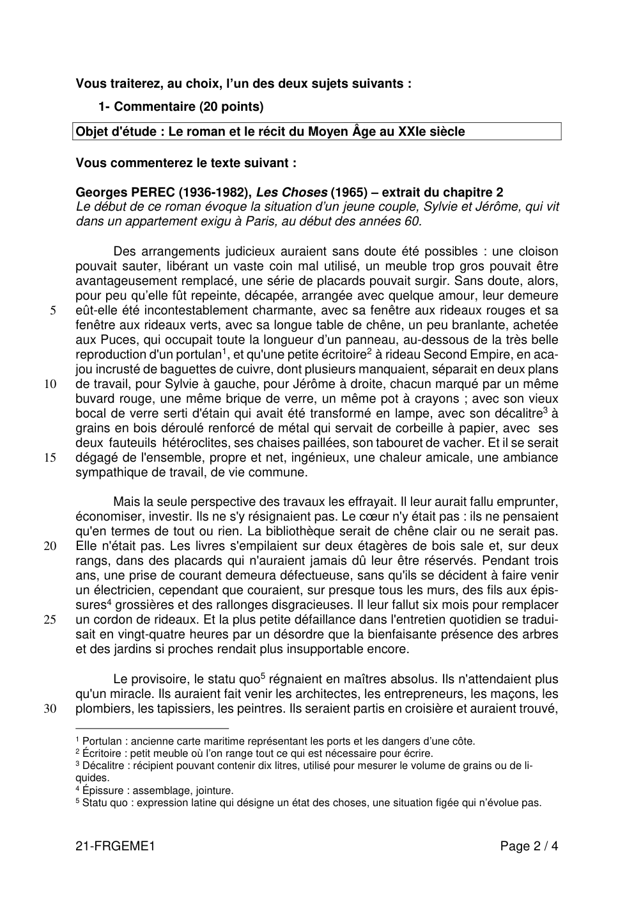
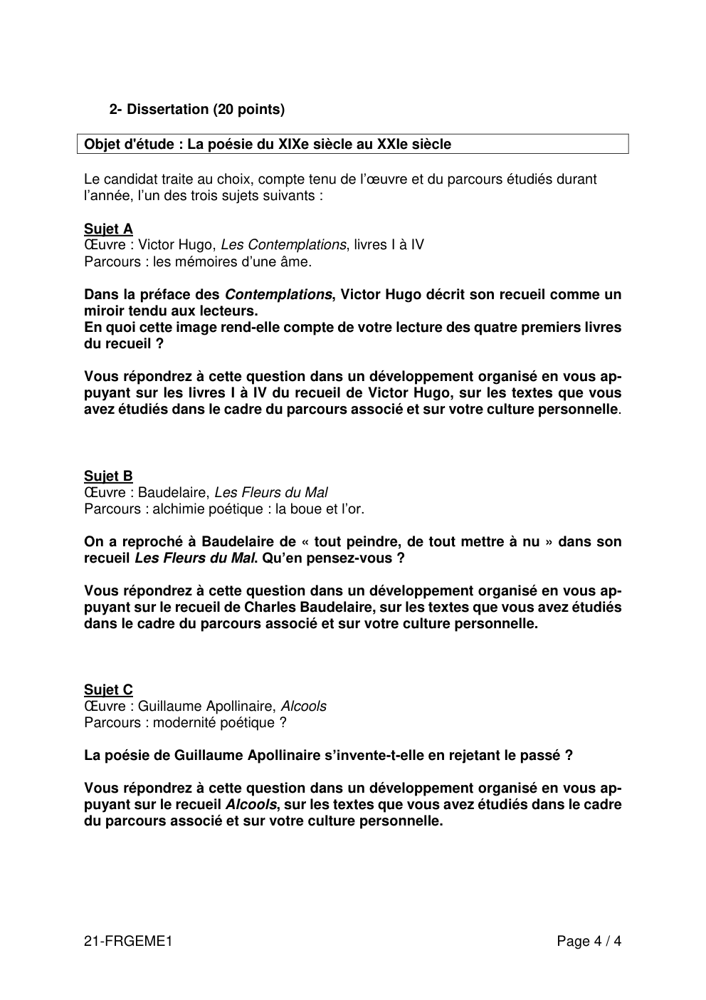

# francais-premiere-2021-metropole-1-sujet-officiel

> Source : `../../../pdf_version/08_francais/2021/francais-premiere-2021-metropole-1-sujet-officiel.pdf` — conversion Markdown (texte + visuels).
> Stratégie : [STRATEGIE_MARKDOWN.md](../../../STRATEGIE_MARKDOWN.md)

---

## Page 1

BACCALAURÉAT GÉNÉRAL

                            SESSION 2021

                             FRANÇAIS

                      ÉPREUVE ANTICIPÉE

              ÉPREUVE DU JEUDI 17 JUIN 2021

                    Durée de l’épreuve : 4 heures

                             Coefficient : 5

    L’usage de la calculatrice et du dictionnaire n’est pas autorisé.

   Dès que ce sujet vous est remis, assurez-vous qu’il est complet.

        Ce sujet comporte 4 pages, numérotées de 1/4 à 4/4.

21-FRGEME1                                                       Page 1 / 4

---

## Page 2

Vous traiterez, au choix, l’un des deux sujets suivants :
          1- Commentaire (20 points)
     Objet d'étude : Le roman et le récit du Moyen Âge au XXIe siècle

     Vous commenterez le texte suivant :

     Georges PEREC (1936-1982), Les Choses (1965) – extrait du chapitre 2
     Le début de ce roman évoque la situation d’un jeune couple, Sylvie et Jérôme, qui vit
     dans un appartement exigu à Paris, au début des années 60.

            Des arrangements judicieux auraient sans doute été possibles : une cloison
     pouvait sauter, libérant un vaste coin mal utilisé, un meuble trop gros pouvait être
     avantageusement remplacé, une série de placards pouvait surgir. Sans doute, alors,
     pour peu qu’elle fût repeinte, décapée, arrangée avec quelque amour, leur demeure
 5   eût-elle été incontestablement charmante, avec sa fenêtre aux rideaux rouges et sa
     fenêtre aux rideaux verts, avec sa longue table de chêne, un peu branlante, achetée
     aux Puces, qui occupait toute la longueur d’un panneau, au-dessous de la très belle
     reproduction d'un portulan1, et qu'une petite écritoire2 à rideau Second Empire, en aca-
     jou incrusté de baguettes de cuivre, dont plusieurs manquaient, séparait en deux plans
10   de travail, pour Sylvie à gauche, pour Jérôme à droite, chacun marqué par un même
     buvard rouge, une même brique de verre, un même pot à crayons ; avec son vieux
     bocal de verre serti d'étain qui avait été transformé en lampe, avec son décalitre3 à
     grains en bois déroulé renforcé de métal qui servait de corbeille à papier, avec ses
     deux fauteuils hétéroclites, ses chaises paillées, son tabouret de vacher. Et il se serait
15   dégagé de l'ensemble, propre et net, ingénieux, une chaleur amicale, une ambiance
     sympathique de travail, de vie commune.

            Mais la seule perspective des travaux les effrayait. Il leur aurait fallu emprunter,
     économiser, investir. Ils ne s'y résignaient pas. Le cœur n'y était pas : ils ne pensaient
     qu'en termes de tout ou rien. La bibliothèque serait de chêne clair ou ne serait pas.
20   Elle n'était pas. Les livres s'empilaient sur deux étagères de bois sale et, sur deux
     rangs, dans des placards qui n'auraient jamais dû leur être réservés. Pendant trois
     ans, une prise de courant demeura défectueuse, sans qu'ils se décident à faire venir
     un électricien, cependant que couraient, sur presque tous les murs, des fils aux épis-
     sures4 grossières et des rallonges disgracieuses. Il leur fallut six mois pour remplacer
25   un cordon de rideaux. Et la plus petite défaillance dans l'entretien quotidien se tradui-
     sait en vingt-quatre heures par un désordre que la bienfaisante présence des arbres
     et des jardins si proches rendait plus insupportable encore.

           Le provisoire, le statu quo5 régnaient en maîtres absolus. Ils n'attendaient plus
     qu'un miracle. Ils auraient fait venir les architectes, les entrepreneurs, les maçons, les
30   plombiers, les tapissiers, les peintres. Ils seraient partis en croisière et auraient trouvé,

     1 Portulan : ancienne carte maritime représentant les ports et les dangers d’une côte.
     2 Écritoire : petit meuble où l’on range tout ce qui est nécessaire pour écrire.
     3 Décalitre : récipient pouvant contenir dix litres, utilisé pour mesurer le volume de grains ou de li-

     quides.
     4 Épissure : assemblage, jointure.
     5 Statu quo : expression latine qui désigne un état des choses, une situation figée qui n’évolue pas.

     21-FRGEME1                                                                                     Page 2 / 4

---

## Page 3

à leur retour, un appartement transformé, aménagé, remis à neuf, un appartement
     modèle, merveilleusement agrandi, plein de détails à sa mesure, des cloisons amo-
     vibles, des portes coulissantes, un moyen de chauffage efficace et discret, une instal-
     lation électrique invisible, un mobilier de bon aloi6.

35          Mais entre ces rêveries trop grandes, auxquelles ils s'abandonnaient avec une
     complaisance étrange, et la nullité de leurs actions réelles, nul projet rationnel, qui
     aurait concilié les nécessités objectives et leurs possibilités financières, ne venait
     s'insérer. L'immensité de leurs désirs les paralysait.

     6 De bon aloi : de bonne qualité, conforme au bon goût.

     21-FRGEME1                                                                  Page 3 / 4

---

## Page 4

2- Dissertation (20 points)

Objet d'étude : La poésie du XIXe siècle au XXIe siècle

Le candidat traite au choix, compte tenu de l’œuvre et du parcours étudiés durant
l’année, l’un des trois sujets suivants :

Sujet A
Œuvre : Victor Hugo, Les Contemplations, livres I à IV
Parcours : les mémoires d’une âme.

Dans la préface des Contemplations, Victor Hugo décrit son recueil comme un
miroir tendu aux lecteurs.
En quoi cette image rend-elle compte de votre lecture des quatre premiers livres
du recueil ?

Vous répondrez à cette question dans un développement organisé en vous ap-
puyant sur les livres I à IV du recueil de Victor Hugo, sur les textes que vous
avez étudiés dans le cadre du parcours associé et sur votre culture personnelle.

Sujet B
Œuvre : Baudelaire, Les Fleurs du Mal
Parcours : alchimie poétique : la boue et l’or.

On a reproché à Baudelaire de « tout peindre, de tout mettre à nu » dans son
recueil Les Fleurs du Mal. Qu’en pensez-vous ?

Vous répondrez à cette question dans un développement organisé en vous ap-
puyant sur le recueil de Charles Baudelaire, sur les textes que vous avez étudiés
dans le cadre du parcours associé et sur votre culture personnelle.

Sujet C
Œuvre : Guillaume Apollinaire, Alcools
Parcours : modernité poétique ?

La poésie de Guillaume Apollinaire s’invente-t-elle en rejetant le passé ?

Vous répondrez à cette question dans un développement organisé en vous ap-
puyant sur le recueil Alcools, sur les textes que vous avez étudiés dans le cadre
du parcours associé et sur votre culture personnelle.

21-FRGEME1                                                                Page 4 / 4

