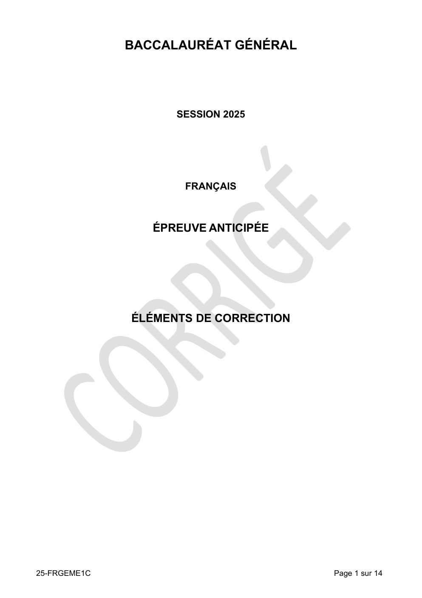

# francais-premiere-2025-metropole-corrige-officiel

> Source : `../../../pdf_version/08_francais/2025/francais-premiere-2025-metropole-corrige-officiel.pdf` — conversion Markdown (texte + visuels utiles).
> Stratégie : [STRATEGIE_MARKDOWN.md](../../../STRATEGIE_MARKDOWN.md)

---

## Page 1

BACCALAURÉAT GÉNÉRAL

                    SESSION 2025

                     FRANÇAIS

                 ÉPREUVE ANTICIPÉE

              ÉLÉMENTS DE CORRECTION

25-FRGEME1C                            Page 1 sur 14

---

## Page 2

Texte de référence pour la définition des épreuves : Bulletin officiel (B.O.) spécial n°6 du 31 juillet 2020,
modifié par le B.O. n°43 du 18 novembre 2021

PRÉAMBULE
Ce document propose un cadre commun pour l’évaluation des copies, assorti de pistes d’analyse des sujets.
Adossés aux compétences définies par le BO comme celles évaluées lors de l’épreuve, les tableaux descriptifs
constituent un point d’appui pour échelonner les copies au regard d’attendus précisément explicités.
Les indications de barème devront être ajustées selon les forces et les faiblesses de chaque copie.
Des pistes et perspectives pour le traitement des sujets sont proposées à l’attention des correcteurs. Si elles visent
à partager des éléments de réflexion, à aider à l’appréciation des attendus, elles ne constituent pas des corrigés
exhaustifs ni exclusifs.
On utilisera tout l’éventail des notes. C’est pourquoi on n’hésitera pas à attribuer aux très bonnes copies des notes
allant jusqu’à 20. Les notes très basses, soit inférieures à 5, correspondent à des copies indigentes à tous points
de vue. L’appréciation portée sur la copie répondra à la question suivante : quelles sont les qualités et les
insuffisances de la copie ?

25-FRGEME1C                                                                                                    Page 2 sur 14

                                                         EducN_MMDQ0Mj5MzMDka5MD5gzMtjAyNj2A1MjEHwMzlE4NWDkg

---

## Page 3

COMMENTAIRE

                                          Commentaire de texte
             Compétences                      Palier 1                                                Palier 2       Palier 3              Palier 4
                                          Le candidat n’a                          Le candidat a                 Le candidat a        Le candidat a
                         Aptitude à       pas saisi le sens                        très                          saisi l’essentiel    saisi le sens du
                      comprendre un       du texte.                                partiellement                 du sens du texte     texte.
                       texte littéraire                                            saisi le sens du              malgré quelques
   Aptitude à                                                                      texte.                        confusions.
 comprendre, à                            Le candidat ne                           Le candidat                   Le candidat          Le candidat
                                          propose pas                              entreprend                    analyse le texte     construit un
  analyser et à                           d’analyse du                             d’analyser le                 et en propose        discours
 interpréter un         Aptitude à
                                          texte.                                   texte et/ou en                une                  interprétatif de
 texte littéraire      analyser et à
                                                                                   propose une                   interprétation       qualité.
                      interpréter un                                               interprétation                souvent
                      texte littéraire                                             superficielle ou              pertinente.
                                                                                   peu pertinente.

                                          Le candidat ne                           Le candidat                   Le candidat          Le candidat
                                          convoque pas                             convoque                      convoque             s’appuie sur ses
                                          d’éléments de                            quelques                      quelques             connaissances
  Aptitude à mobiliser une culture        connaissance                             éléments de                   éléments de          littéraires pour
  littéraire fondée sur les travaux       littéraire lui                           connaissance                  connaissance         faire émerger la
                                          permettant de                            littéraire, mais              littéraire           singularité du
 conduits en cours de français, sur       situer ou de                             avec                          pertinents pour      texte et
 des connaissances et des lectures        comprendre le                            maladresse                    enrichir sa          l’interpréter.
             personnelles                 texte.                                   et/ou peu de                  compréhension
                                                                                   pertinence.                   et /ou son
                                                                                                                 interprétation du
                                                                                                                 texte.
                                          Le propos n’est                          Le propos est                 Le propos est        Le propos est
                                          pas organisé.                            organisé de                   organisé de          organisé de
 Aptitude à construire une réflexion                                               manière peu                   manière              manière
 en prenant appui sur un texte et à                                                pertinente.                   globalement          cohérente. Il suit
        la rendre intelligible                                                                                   cohérente.           un fil conducteur
                                                                                                                                      perceptible et
                                                                                                                                      pertinent.
                                          Le texte ne                              Le texte                      Le texte             Le texte respecte
                                          respecte pas les                         respecte trop                 respecte             les normes
                        Aptitude à        normes                                   peu les normes                globalement les      orthographiques
                       respecter les      orthographiques                          orthographiques               normes               et syntaxiques. Il
                          normes          et syntaxiques.                          et syntaxiques.               orthographiques      peut comporter
                     orthographiques                                                                             et syntaxiques.      quelques
  Maîtrise de la      et syntaxiques                                                                                                  étourderies
  langue et de                                                                                                                        graphiques.
 l’expression à
      l’écrit                             Le texte est écrit                       Le texte est écrit            Le texte est écrit   Le texte est écrit
                        Aptitude à        dans une langue                          dans une langue               dans une langue      dans une langue
                       utiliser une       incorrecte et/ou                         parfois                       globalement          riche et soignée.
                                          révèle un niveau                         incorrecte et/ou              correcte et
                     langue correcte
                                          de langue                                inadaptée.                    adaptée.
                        et adaptée        inadapté.

           Barème indicatif                   1 à 6 pts                                            7 à 11 pts       12 à 17 pts           18 à 20 pts

N.B. Le barème propose des points de repère : les copies présentant des niveaux disparates selon les
compétences envisagées appellent une évaluation adaptée. Ainsi chaque copie peut tendre vers un profil (majorité
d'items dans une colonne) ; sa note sera ajustée selon l'éventail proposé en fonction des compétences qui seraient
plus ou moins bien maitrisées.

25-FRGEME1C                                                                                                                           Page 3 sur 14

                                                           EducN_MMDQ0Mj5MzMDka5MD5gzMtjAyNj2A1MjEHwMzlE4NWDkg

---

## Page 4

Explicitation des compétences
►   Aptitude à comprendre, à analyser et à interpréter un texte littéraire
    On évalue la capacité du candidat à :
    o   Rendre compte du sens du texte ;
    o   Percevoir le mouvement/la composition du texte ;
    o   Identifier et analyser des éléments saillants du texte ;
    o   Percevoir et exploiter les implicites et les résistances du texte ;
    o   Proposer une réception sensible du texte ;
    o   Interroger la portée (morale, esthétique, historique) du texte.

►   Aptitude à mobiliser une culture littéraire fondée sur les travaux conduits en cours de français, sur
    des connaissances et des lectures personnelles
    On évalue la capacité du candidat à :
    o   Convoquer des références culturelles pour, au besoin, enrichir sa compréhension et son interprétation
        du texte ;
    o   S’appuyer sur sa culture littéraire et artistique pour faire émerger la singularité du texte (par
        comparaison ou différenciation).

►   Aptitude à construire une réflexion en prenant appui sur un texte et à la rendre intelligible
    On évalue la capacité du candidat à :
    o   Rendre compte de sa lecture de manière organisée ;
    o   Étayer clairement son cheminement dans le texte ;
    o   Mettre en lien, hiérarchiser et catégoriser ses remarques.

►   Maîtrise de la langue et de l’expression à l’écrit
    On évalue la capacité du candidat à :
    o   Veiller à la cohérence textuelle de son écrit ;
    o   Utiliser une langue correcte et adaptée (lexique, niveau de langue) ;
    o   Respecter globalement les normes orthographiques et syntaxiques.

25-FRGEME1C                                                                                                    Page 4 sur 14

                                                         EducN_MMDQ0Mj5MzMDka5MD5gzMtjAyNj2A1MjEHwMzlE4NWDkg

---

## Page 5

Objet d’étude : Le roman et le récit du Moyen Âge au XXIe siècle

Jules Barbey d’Aurevilly, L’Ensorcelée, 1854

 Pistes et perspectives pour le correcteur

    o Présentation du texte
    Cet extrait du roman L'Ensorcelée de Barbey d'Aurevilly, paru en 1854, joue sur le brouillage des genres
    romanesques : il emprunte tout à la fois les codes du roman-feuilleton, de l’almanach criminel, du récit
    fantastique, légendaire, voire mythique, en donnant à entendre les commentaires d’un narrateur bien
    informé. Les candidats disposent ainsi d’entrées variées dans ce texte pour lequel ils pourraient
    convoquer leurs lectures antérieures dans un jeu d’intertextualité. L'extrait retenu plante le décor de
    L’Ensorcelée ; la lande normande de Lessay, terre gaste minutieusement décrite, se mue, au fil des
    rumeurs rapportées par le narrateur, en lieu effrayant sur lequel planent les pires malédictions. Cet
    espace vide, tout entier empli des récits issus de l’imagination des hommes, se fait métaphore de la page
    blanche de l’écrivain.
    Le texte suit une progression très nette : la description très référencée de la lande fait progressivement
    place à une menace latente, en raison de l'isolement du lieu, propice à l'émergence d'angoissantes
    traditions orales liées au surnaturel. On acceptera que les candidats adoptent pour leur commentaire
    une approche linéaire ou composée. On valorisera les copies qui rendent compte de l'organisation
    dynamique de ce passage.

    o Pistes pour le commentaire
    On envisagera que les candidats explorent certaines des pistes suivantes au cours de leur réflexion,
    sans attendre de traitement exhaustif de l'ensemble de ces entrées.

    Les candidats peuvent être sensibles au décor planté par le narrateur :
    o Le narrateur prend soin d’ancrer son récit dans le Cotentin, à travers de nombreuses références
        géographiques. Les toponymes dessinent la carte de cette région de Normandie, dont l’immensité
        est soulignée par les chiffres (lignes 5 et 7) et les adverbes d’intensité (lignes 19 à 22).
    o Les habitants sont décrits par une périphrase dont les adjectifs peignent à grands traits leur identité :
        « populations musculaires, braves et prudentes » (ligne 26). Leur idiolecte est mis en valeur par les
        italiques (lignes 25 et 30).
    o La lande est présentée comme un espace désertique et désolé qu’il est d’ailleurs possible de
        traverser en ligne droite (ligne 6). Sa description est construite à travers une accumulation de
        négations : « ce désert normand où l’on ne rencontrait ni maisons, ni haies, ni traces d'homme ou
        de bêtes que celles du passant ou du troupeau » (lignes 2-3) ; « la route départementale et les
        voitures publiques n’étaient pas de ce côté » (lignes 11-12).

    Divers éléments convergent vers un sentiment de menace, lequel s’épaissit au fil du texte :
    o La composition du texte contribue à faire enfler progressivement le sentiment de menace : espace
        « de solitude et de tristesse désolée » dans le premier paragraphe, lieu propice aux attaques et aux
        meurtres dans le deuxième paragraphe, « théâtre des plus singulières apparitions » dans le
        troisième paragraphe.
    o Le texte fait en effet référence à des dangers réels, incarnés par des voleurs et des meurtriers, et
        renvoyant aux romans d’aventures ou policiers du XIXe siècle : « assassinat » (ligne 16),
        « détrousser » (ligne 17), « dépêcher » (ligne 18), « gens attaqués par les bandits de ces parages »
        (ligne 21), « attaque nocturne » (ligne 30).
    o Le texte évoque dans le dernier paragraphe la présence de revenants et ménage un crescendo dans
        le sentiment de menace et d’effroi : « c’était là le côté véritablement sinistre et menaçant de la lande »
        (lignes 27-28), « Aussi cela seul, bien plus que l’idée d’une attaque nocturne, faisait trembler… »
        (lignes 29-30). Un réseau d’adjectifs en ce sens parcourt le texte : « redoutable » (ligne 8), « sinistre
        et menaçant » (ligne 28), « tangible » (ligne 27).
    o Aussi ceux qui osent s’aventurer dans la lande (lignes 12 à 14) sont rares et considérés comme
        « téméraires » ; ils se déplacent en groupe et sont armés d’un « pied de frêne » (ligne 30).

25-FRGEME1C                                                                                                    Page 5 sur 14

                                                         EducN_MMDQ0Mj5MzMDka5MD5gzMtjAyNj2A1MjEHwMzlE4NWDkg

---

## Page 6

*(Suite de la page précédente — le document continue ici.)*

o   Le texte propose une image particulièrement puissante de l’imaginaire nocturne angoissant à travers
       la personnification du silence : « dans la nuit, un si vaste silence aurait dévoré tous les cris qu’on
       aurait poussés dans son sein » (lignes 21-22).
   Les candidats peuvent étudier la place importante accordée aux traditions orales qui nourrissent ce
   sentiment de menace :
   o Le texte présente un nombre important de termes renvoyant à l’imaginaire du conteur et s’inscrivant
       dans la tradition des veillées où se transmettent les récits : « disait-on » (ligne 5), « citait » (ligne 13),
       « parlait », « traditions » (ligne 16), « récits » (ligne 24).
   o L’indétermination irriguant tout le texte alimente cette représentation d’un récit qui se transmettrait
       de génération en génération : le recours systématique au pronom « on » ainsi que les tournures
       impersonnelles (lignes 17 et 25) incarnent ainsi la voix populaire, la rumeur qui enfle.
   o Les récits, partagés par l’ensemble de la communauté (ligne 7), sont caractérisés par l’incertitude
       (ligne 16) et relèvent de l’hypothèse et de la croyance : « Si l’on en croyait les récits des
       charretiers… » (ligne 24). Opposés à des faits avérés (lignes 6 et 14), ils apparaissent encore plus
       volatiles et diffus.
   o Ceux qui ont osé affronter l’espace de la lande deviennent des personnages légendaires qu’« on
       citait longtemps » (ligne 13).

   Les candidats peuvent identifier la coloration fantastique du lieu et le pouvoir de l’imagination qui en est
   à l’origine :
   o Il s’agit d’un lieu sinistre qui marque profondément et durablement les esprits : « ce désert normand
        […] déployait une grandeur de solitude et de tristesse désolée qu’il n’était pas facile d’oublier »
        (lignes 4-5), « Et vraiment un tel lieu prêtait à de telles traditions » (ligne 17).
   o L’espace est donc propice au surgissement d’événements surnaturels (ligne 25). L’antithèse entre
        le superlatif « du plus vigoureux gaillard » (ligne 31) et « trembler » (ligne 30) accentue le contraste
        entre la force physique et mentale caractérisant la population des lieux et la crainte éprouvée à l’idée
        de traverser cet espace mystérieux.
   o Le narrateur souhaite faire partager au lecteur les sentiments de ces hommes et ménage habilement
        le crescendo à la fin du deuxième paragraphe, comme dans un roman-feuilleton : « Mais ce n’était
        pas tout » (lignes 22-23).
   o L’aphorisme « l’imagination continuera d’être, d’ici longtemps, la plus puissante réalité qu’il y ait dans
        la vie des hommes » (lignes 28-29) souligne d’une part l’influence ensorcelante du lieu sur les êtres
        (cf. titre) et d’autre part leur besoin irrépressible de combler le vide du lieu par des récits imaginaires.
        On valorisera les candidats qui interpréteraient cet aphorisme comme une métaphore de l’acte
        d’écriture.

25-FRGEME1C                                                                                                     Page 6 sur 14

                                                          EducN_MMDQ0Mj5MzMDka5MD5gzMtjAyNj2A1MjEHwMzlE4NWDkg

---

## Page 7

DISSERTATION

                                                  Dissertation
             Compétences                      Palier 1                                                Palier 2       Palier 3              Palier 4
                                          Le candidat ne                           Le candidat                   Le candidat rend     Le candidat rend
                                          rend pas compte                          tente de rendre               compte d’une         compte d’une
                                          de sa lecture de                         compte de sa                  lecture informée     lecture informée
     Aptitude à comprendre, à             l’œuvre.                                 lecture de                    de l’œuvre dont      de l’œuvre avec
  analyser et à interpréter un texte                                               l’œuvre, mais il              il a globalement     pertinence, il s’y
              littéraire                                                           s’y repère                    saisi les enjeux.    repère avec
                                                                                   maladroitement                                     aisance et en
                                                                                   et en maîtrise                                     maîtrise les
                                                                                   mal les enjeux.                                    enjeux.
                                          Le candidat ne                           Le candidat                   Le candidat          Le candidat
                                          convoque pas                             convoque                      convoque             s’appuie sur ses
                                          d’éléments de                            quelques                      quelques             connaissances
  Aptitude à mobiliser une culture        connaissance                             éléments de                   éléments de          littéraires pour
                                          littéraire lui                           connaissance                  connaissance         faire émerger la
  littéraire fondée sur les travaux       permettant de                            littéraire, mais              littéraire           singularité de
 conduits en cours de français, sur       situer ou de                             avec                          pertinents pour      l’œuvre et
 des connaissances et des lectures        comprendre                               maladresse                    enrichir sa          l’interpréter.
             personnelles                 l’œuvre.                                 et/ou peu de                  compréhension
                                                                                   pertinence.                   et /ou son
                                                                                                                 interprétation de
                                                                                                                 l’œuvre.
                                          Le sujet et les                          Le sujet et les               Le sujet est         Le sujet est
                                          enjeux du                                enjeux du                     compris et           compris et traité et
                        Aptitude à        parcours ne sont                         parcours ne sont              partiellement        les enjeux du
                     comprendre les       pas compris ou                           que                           traité, et les       parcours sont
   Aptitude à       enjeux du sujet et    pas abordés.                             partiellement                 enjeux du            maîtrisés.
 construire une        du parcours                                                 abordés et/ou                 parcours sont
  réflexion en                                                                     compris.                      globalement
 prenant appui                                                                                                   compris.
 sur un texte et                          Le propos n’est                          Le propos est                 Le propos est        Le propos est
   à la rendre                            pas organisé.                            organisé de                   organisé de          organisé de
   intelligible         Aptitude à                                                 manière peu                   manière              manière
                       organiser sa                                                pertinente.                   globalement          cohérente. Il suit
                         réflexion                                                                               cohérente.           un fil conducteur
                                                                                                                                      perceptible et
                                                                                                                                      pertinent.
                                          Le texte ne                              Le texte                      Le texte             Le texte respecte
                                          respecte pas les                         respecte peu les              respecte             les normes
                        Aptitude à        normes                                   normes                        globalement les      orthographiques
                       respecter les      orthographiques                          orthographiques               normes               et syntaxiques. Il
                          normes          et syntaxiques.                          et syntaxiques.               orthographiques      peut comporter
                     orthographiques                                                                             et syntaxiques.      quelques
  Maîtrise de la      et syntaxiques                                                                                                  étourderies
   langue et de                                                                                                                       graphiques.
 l’expression à
      l’écrit                             Le texte est écrit                       Le texte est écrit            Le texte est écrit   Le texte est écrit
                    Aptitude à utiliser   dans une langue                          dans une langue               dans une langue      dans une langue
                       une langue         incorrecte et/ou                         parfois                       globalement          riche et soignée.
                                          révèle un niveau                         incorrecte et/ou              correcte et
                       correcte et
                                          de langue                                inadaptée.                    adaptée.
                         adaptée          inadapté.

           Barème indicatif                   1 à 6 pts                                            7 à 11 pts       12 à 17 pts           18 à 20 pts

N.B. Le barème propose des points de repère : les copies présentant des niveaux disparates selon les
compétences envisagées appellent une évaluation adaptée. Ainsi chaque copie peut tendre vers un profil (majorité
d'items dans une colonne) ; sa note sera ajustée selon l'éventail proposé en fonction des compétences qui seraient
plus ou moins bien maitrisées.

25-FRGEME1C                                                                                                                           Page 7 sur 14

                                                           EducN_MMDQ0Mj5MzMDka5MD5gzMtjAyNj2A1MjEHwMzlE4NWDkg

---

## Page 8

Explicitation des compétences

►   Aptitude à comprendre, à analyser et à interpréter une œuvre littéraire
    On évaluera la capacité du candidat à :
    o   Rendre compte d’une lecture effective de l’œuvre ;
    o   Se repérer dans l’œuvre avec précision ;
    o   S’appuyer sur sa réception sensible de l’œuvre ;
    o   Interroger la portée (morale, esthétique, historique) de l’œuvre.

►   Aptitude à mobiliser une culture littéraire fondée sur les travaux conduits en cours de français, sur
    des connaissances et des lectures personnelles
    On évaluera la capacité du candidat à :
    o   Convoquer des références culturelles pour enrichir, au besoin, sa réflexion sur l’œuvre ;
    o   S’appuyer sur sa culture littéraire et artistique pour construire un propos éclairant la spécificité de
        l’œuvre.

►   Aptitude à construire une réflexion en prenant appui sur l’œuvre et à la rendre intelligible
    On évaluera la capacité du candidat à :
    o   Explorer les enjeux du sujet donné ;
    o   Mobiliser sa compréhension des enjeux du parcours pour traiter le sujet ;
    o   Mobiliser différents passages signifiants de l’œuvre pour construire sa réflexion ;
    o   Identifier, citer et analyser des éléments saillants de l’œuvre ;
    o   Mettre en lien, hiérarchiser et catégoriser ses remarques, pour rendre compte de sa réflexion de
        manière organisée ;
    o   Étayer son cheminement intellectuel.

►   Maîtrise de la langue et de l’expression à l’écrit
    On évaluera la capacité du candidat à :
    o   Veiller à la cohérence textuelle de son écrit ;
    o   Utiliser une langue correcte et adaptée (lexique, niveau de langue) ;
    o   Respecter globalement les normes orthographiques et syntaxiques.

25-FRGEME1C                                                                                                    Page 8 sur 14

                                                         EducN_MMDQ0Mj5MzMDka5MD5gzMtjAyNj2A1MjEHwMzlE4NWDkg

---

## Page 9

Objet d’étude : Le théâtre du XVIIe siècle au XXIe siècle

Sujet A
Œuvre : Pierre Corneille, Le Menteur
Parcours associé : mensonge et comédie

Selon vous, dans la comédie Le Menteur, l’art du mensonge est-il toujours maîtrisé ?

 Pistes et perspectives pour le correcteur

    • Présentation et problématisation du sujet
    Le sujet invite à questionner le mensonge dans sa dimension artistique, indépendamment de ses enjeux
    moraux. S’il peut être défini comme le contraire de la vérité et assimilé à une fausse déclaration, il peut
    aussi renvoyer à la notion d’illusion trompeuse, particulièrement féconde dans cette comédie
    cornélienne. La polysémie de l’expression « art du mensonge » permettra aux candidats de déployer une
    réflexion à plusieurs niveaux. Elle s’inscrit d’abord dans l’univers de l’artisanat et interroge les aptitudes
    des menteurs, leur adresse en matière de simulation (inventer ce que l’on n’est pas) ou de dissimulation
    (cacher ce que l’on est). Elle renvoie ensuite à l’ensemble des connaissances et des règles d’un
    domaine, à une perfection technique, ici celle du mensonge galant, dont la codification est ancrée dans
    son époque. « L’art du mensonge » questionne enfin l’acte créateur qui vise la réalisation d’un idéal
    esthétique ; cette acception embrasse toute la dimension méta-poétique de la pièce de Corneille qui
    s’attache à faire du mensonge un éblouissement propre à être admiré. L’absence de complément d’agent
    invite à questionner la maîtrise de cet « art du mensonge », à interroger le degré de virtuosité des
    menteurs et la fiabilité des interlocuteurs.
    Le sujet invite à la discussion, sans attendre que les candidats développent toutes ces pistes. On
    valorisera les copies qui auront exploité la polysémie de l’expression « art du mensonge », et
    particulièrement celles qui envisageraient la dimension méta-textuelle du sujet.

    • Pistes pour la dissertation
    On envisagera que les candidats explorent certaines des pistes suivantes au cours de leur réflexion,
    sans attendre le traitement exhaustif de l’ensemble de ces entrées.

    Dans la pièce de Corneille, le mensonge est érigé en art par des « esprit[s] de grande invention » :
    o Le mensonge est présenté comme un chef d’œuvre d’hypotypose. Ainsi, les récits mensongers de
       Dorante deviennent de véritables morceaux de bravoure : la description de la collation ressemble à
       un divertissement royal (I,5), la tirade sur son prétendu mariage avec Orphise est un pastiche des
       romans galants (II,5), la miraculeuse guérison d’Alcippe fait voyager Cliton dans des contrées
       lointaines et exotiques (IV,3), etc.
    o Le menteur est un artiste. Cliton s’adressant à Dorante emploie d’ailleurs l’expression « en votre
       art ». Les candidats pourront être sensibles à la créativité d’Isabelle (II,2), à l’esprit de Clarice (III,4),
       à la l’imagination et la persévérance de Dorante qui poursuit son œuvre sans se décourager (III,6).
    o L’interlocuteur du menteur devient spectateur de son œuvre : Alcippe est émerveillé par le récit de
       la collation qu’en fait Dorante (I,5), Géronte ne se sent plus de joie à l’annonce du mariage de son
       fils et de la grossesse de sa belle-fille (IV,4), Cliton ne cesse d’admirer les mensonges de son maître.
    o Les personnages en viennent à élaborer un discours sur l’art du mensonge. Clarice s’exclame : « On
       dirait qu’il dit vrai, tant son effronterie / Avec naïveté pousse une menterie. », Cliton commente les
       fourbes de son maître tout au long de la pièce, Dorante élabore une théorie du menteur/comédien :
       « Il y faut promptitude, esprit, mémoire, soins, / Ne se brouiller jamais, et rougir encore moins » (III,4).

    Les menteurs prennent soin de rendre leurs mensonges efficaces :
    o Les personnages qui mentent sont de jeunes gens qui connaissent les codes du mensonge galant
        et savent en user. Isabelle expose les règles de la galanterie et rappelle que Dorante n’est pas le
        premier à mentir sur sa personne et sur son amour, l’exagération fait partie du jeu galant et chacun
        le sait (III,3). Dorante, quant à lui, les maîtrise à la perfection, comme il l’explique à Cliton : « J’en
        montre plus de flamme, et j’en fais mieux ma cour. » (I,6).
    o Les personnages trompés croient aux mensonges qui leur sont faits. Les candidats pourront étudier
        les réactions de Cliton, de Sabine ou de Lucrèce face aux fourbes de Dorante. Dorante lui-même se
        fait avoir par Clarice et Lucrèce lorsqu’elles échangent leur place (III,5). Géronte se plaint d’avoir
        relayé les mensonges de son fils (V,2 et 3).
    o Les mensonges sont efficaces puisqu’ils permettent aux personnages d’arriver à leurs fins : Dorante
        évite le mariage avec Clarice et finit par épouser Lucrèce.

25-FRGEME1C                                                                                                     Page 9 sur 14

                                                          EducN_MMDQ0Mj5MzMDka5MD5gzMtjAyNj2A1MjEHwMzlE4NWDkg

---

## Page 10

*(Suite de la page précédente — le document continue ici.)*

o   Dorante, homme-orchestre, contrôle tout, même l’imprévu. Lorsque Clarice le confond sur son
       mariage, il rétablit la situation à son avantage (III,5), de même lorsqu’il apprend que les deux jeunes
       femmes ont échangé leur place (V,6).
   Les menteurs ne maîtrisent cependant pas tous les paramètres de la situation :
   o Le menteur peut faire face à des imprévus qui atténuent la force trompeuse de son mensonge :
       Dorante a un trou de mémoire sur le nom du beau-père et risque d’être démasqué par son père
       (IV,4), il ment à la mauvaise personne puisque Lucrèce et Clarice ont échangé leur identité (III,5).
   o Dorante se laisse griser par le plaisir de mentir et entasse les mensonges, au risque d’en faire trop
       (duel avec Alcippe, mort prétendue de celui-ci et réapparition dans la scène suivante (IV,1 et 2)).
   o Les menteurs peuvent faire face à des personnages méfiants ou lucides, capables de les
       démasquer : c’est notamment le rôle de Philiste (I,5 ; III,2 et V,1) qui finit par dessiller Géronte et,
       dans une moindre mesure, de Clarice, qui perce la nature de Dorante sans pour autant parvenir à
       convaincre Lucrèce (V,6).
   o La pièce invite à s’interroger sur le véritable pouvoir du mensonge et montre qu’il dépend
       essentiellement du degré de crédulité de l’interlocuteur. Si Alcippe croit à la collation, c’est parce qu’il
       est jaloux et que sa passion favorise cette croyance ; de même, si Géronte croit au mariage et à la
       grossesse de sa belle-fille imaginaire, c’est parce qu’il désire plus que tout assurer sa lignée.

   La pièce met en scène une palette variée et nuancée de mensonges qui fait de Corneille un peintre
   virtuose de la nature humaine :
   o Les candidats pourront être sensibles à la variété des fausses déclarations de Dorante qui rythment
        la pièce : la guerre en Allemagne, la collation, le mariage avec Orphise, la grossesse de son
        épouse… Ils pourront également s’intéresser aux mensonges des autres personnages : la
        proposition d’Isabelle qui suggère l’interversion de Clarice et de Lucrèce (II,2), Clarice qui prétend
        se satisfaire d’être débarrassée de Dorante (IV,9), etc.
   o Les candidats pourront esquisser une typologie des mensonges en distinguant notamment les
        mensonges utilitaires des mensonges gratuits. Ils pourront ainsi relever d’une part les mensonges
        que Dorante sert aux jeunes femmes pour les séduire car il veut entrer dans la vie galante (II,8), à
        Géronte pour échapper au mariage prévu par son père avec Lucrèce (II,5 et IV,4), et d’autre part les
        mensonges dits à Cliton (par exemple la prétendue mort d’Alcippe à l’acte IV, scène 1).
   o Les candidats pourront s’intéresser plus finement à la distinction entre mensonges masculins, qui
        relèvent plutôt de la simulation (Dorante simule ce qu’il n’est pas : un cavalier qui revient des guerres
        d’Allemagne et donne des collations fastueuses), et mensonges féminins qui relèvent plutôt de la
        dissimulation, en raison du rôle passif assigné à la femme par la société, comme l’explique très bien
        Clarice à Géronte dans la scène 1 de l’acte II. Ainsi, pour entrer en contact avec Dorante, elle ne
        peut l’aborder directement et doit feindre de se laisser choir (I,3).

   Pour autant, Corneille n’est pas sûr de maîtriser l’imbroglio de l’intrigue :
   o Corneille lui-même craint de s’y perdre, révélant dans l’Épître sa « peur de [s’]égarer dans les détours
      de tant d’intriques que fait notre Menteur. »
   o Le dénouement de l’intrigue est incomplet : les mensonges de Dorante ne sont pas entièrement
      démasqués, la révélation est incomplète et instable. Dans la scène finale, les personnages sont plus
      éblouis que détrompés.
   o Pour Corneille, il ne s’agit pas tant de maîtriser que de sublimer les mensonges, qui se veulent
      métaphore d’une illusion théâtrale propre à susciter l’admiration. Le verbe « étonner » est répété à
      de nombreuses reprises pour souligner l’importance donnée à l’œil actif du spectateur.

   Le Menteur est un art poétique du mensonge et un éloge du théâtre :
   o Les considérations théoriques sur le mensonge sont développées dans les textes qui précèdent la
      pièce et relayées par Dorante qui les résume ainsi : « Tout le secret ne gît qu’en un peu de grimace »
      (I,6), renvoyant avec le terme « grimace » aussi bien au domaine du mensonge qu’à celui du théâtre.
   o Toutes ces considérations théoriques sont mises en pratique au niveau textuel (admiration des
      personnages pour les mensonges de Dorante) et méta-textuel (admiration des spectateurs de
      l’époque pour le brio de la pièce).
   o Corneille fait triompher le mensonge dans « Au lecteur » et dans les derniers vers de la pièce, il
      réhabilite la dimension artistique du mensonge au théâtre, facteur d’éblouissement qui doit susciter
      l’admiration.

25-FRGEME1C                                                                                                    Page 10 sur 14

                                                         EducN_MMDQ0Mj5MzMDka5MD5gzMtjAyNj2A1MjEHwMzlE4NWDkg

---

## Page 11

Sujet B
Œuvre : Alfred de Musset, On ne badine pas avec l’amour
Parcours : les jeux du cœur et de la parole

Les personnages s’affrontent-ils sérieusement dans On ne badine pas avec l’amour ?

 Pistes et perspectives pour le correcteur :

    • Présentation et problématisation du sujet
    Le sujet invite à considérer les « jeux du cœur et de la parole » à l’œuvre dans On ne badine pas avec
    l’amour dans leur dimension agonistique : non sous l’angle du divertissement ou de la bagatelle mais
    comme joute, qui suppose un gagnant ou une gagnante et qui, contrairement au jeu, comporte une
    dimension agressive, voire violente. Les candidats pourront examiner la pluralité des conflits représentés
    dans le drame et qui s’expriment dans des tonalités variées. L’adverbe « sérieusement » évoque la
    gravité, par opposition avec la légèreté du jeu, mais aussi le rapport à la vérité, crucial au théâtre. Le
    sujet invite ainsi à interroger certaines des tensions constitutives du jeu dramatique qui se noue et se
    dénoue dans la pièce : entre affectation de « badinage » et gravité du sentiment amoureux, entre
    emprunts à la comédie, voire à la farce, et issue tragique, entre nostalgie de la légèreté de l’enfance et
    exigences de la société des adultes, entre action et parole, etc.
    Le sujet invite à la discussion. On acceptera tout raisonnement organisé qui mette en lumière certaines
    de ces tensions.

    • Pistes pour la dissertation
    On envisagera que les candidats explorent certaines des pistes suivantes au cours de leur réflexion,
    sans attendre de traitement exhaustif de l’ensemble de ces entrées :

    Les candidats pourront examiner la multiplicité des « affrontements » représentés dans la pièce :
    o Le face-à-face entre Camille et Perdican constitue le fil directeur de l’action. Des tiers s’invitent
        souvent dans ce duel : le Baron, instigateur infortuné du mariage ; la religion, incarnée par les trois
        figures successives d’Isabelle, Louise et Dame Pluche ; Rosette qui vient clore le triangle amoureux.
    o Nombreuses sont les situations qui fonctionnent en écho à cet affrontement central : la rivalité entre
        maître Blazius et maître Bridaine, les confrontations presque systématiques de Dame Pluche avec
        l’ensemble des personnages (le Chœur, le Baron, Camille).
    o Camille et Perdican semblent également aux prises avec eux-mêmes : en eux se confrontent
        notamment l’orgueil et l’amour, ce qui les empêche de reconnaître et de s’avouer leurs sentiments à
        priori.
    o De façon plus symbolique, la pièce semble le lieu d’un affrontement entre la jeune génération et les
        attentes ou normes sociales portées par les adultes : Camille préfère le couvent au mariage ;
        Perdican, noble et savant, revendique « l’oubli de ce que l’on sait » et fait des ricochets avant de
        promettre le mariage à une jeune paysanne. On valorisera les copies qui soulignent que le Baron,
        quoiqu’excédé, refuse néanmoins l’affrontement (III, 7) avec les jeunes gens, préférant « [s’]enfermer
        pour [s’]abandonner à la douleur ».

    Les scènes d’affrontement entre les personnages empruntent une palette de tonalités variées, amenant
    peu à peu le lecteur du rire face à une comédie plaisante à davantage de gravité :
    o Les scènes d’affrontements les plus ridicules, recourant notamment au comique de geste et de
        situation, se déroulent hors scène et apparaissent par hypotypose : « la guerre » ouverte entre
        Blazius et Bridaine au dîner, rapportée par le Chœur ; les coups d’éventail donnés par Camille
        « rouge de colère » à Dame Pluche (II, 4), rapportés par maître Blazius.
    o La modalité privilégiée de l’affrontement dans la pièce est la joute oratoire, pour l’essentiel entre
        Camille et Perdican. Dans ce domaine, Perdican est d’emblée présenté comme favori par le Chœur,
        lui qui a « la bouche toute pleine de façon de parler si belles et si fleuries », ce que confirment
        plusieurs scènes. Les disputes sont pour lui un jeu dont « le plaisir […], c’est de faire la paix »,
        réplique dont les candidats pourront souligner l’ironie tragique. Camille au contraire est celle que les
        jeux de l’enfance « ennuie[nt] » et qui invite à « parl[er] sérieusement » (II, 1).
    o La tonalité des dialogues évolue vers le sérieux à mesure que l’action progresse. La légèreté du
        badinage initial de Perdican, qui emprunte des motifs lyriques convenus, contraste avec la
        sécheresse des répliques de Camille, qui refuse la confrontation (I, 2). Elle se montre
        progressivement plus éloquente et vindicative, jusqu’à adopter un « ton de persiflage » dépourvu de
        légèreté et à pousser Perdican hors de ses retranchements et de ses habitudes badines, l’amenant
        non sans violence à clore cette « plaisanterie » (III, 7). Le sérieux s’impose à mesure que les
        sentiments se dévoilent.

25-FRGEME1C                                                                                                   Page 11 sur 14

                                                        EducN_MMDQ0Mj5MzMDka5MD5gzMtjAyNj2A1MjEHwMzlE4NWDkg

---

## Page 12

Les personnages dérogent au principe de l’affrontement direct, « front à front », en utilisant le dangereux
   détour du jeu théâtral :
   o Perdican et Camille s’improvisent metteurs en scène (dans le petit bois, puis dans la chambre de
       Camille) pour se donner la comédie. Les personnages jouent avec les artifices de l’art dramatique,
       et avec le personnage de Rosette, tantôt actrice, tantôt spectatrice. Ainsi Perdican ne peut-il être
       vraiment sérieux, c’est-à-dire sincère, quand il lui déclare son amour « à haute voix, de manière que
       Camille l’entend » ; il l’est pourtant quand il poursuit par des attaques contre « les pâles statues
       fabriquées par les nonnes » à l’attention de Camille.
   o Paradoxalement, c’est dans la scène où elle prétend prendre Perdican au piège que Camille formule
       pour la première fois ses véritables sentiments. Aussi l’artifice induit par le théâtre dans le théâtre
       permet-il néanmoins d’accéder à la vérité des sentiments.
   o Au contraire des joutes oratoires, le théâtre dans le théâtre induit un affrontement inégal : les règles
       du jeu ne sont pas transparentes – notamment pour Rosette qui jamais ne joue – si bien que le jeu
       devient dangereux. On valorisera les copies qui explorent la symbolique du « ricochet » que pratique
       Perdican. Des jeux à priori puérils – dénués de sérieux – appellent des conséquences graves : ils
       blessent réciproquement les jeunes protagonistes, et conduisent à l’issue tragique de la pièce avec
       la mort de Rosette, et un « adieu » qui semble inéluctable.

   Reprenant à leur compte la question du Baron à Dame Pluche (« Parlez-vous sérieusement ? »), les
   candidats peuvent se demander si le lecteur doit prendre ces affrontements au sérieux :
   o Cette pièce qui se présentait comme un jeu léger, variation sur un proverbe illustré par une histoire
      d’amour, finit dans le sang, sur une réplique abrupte et sans appel, qui laisse le lecteur désarçonné.
   o S’il est bien un monde que le lecteur ne peut prendre au sérieux à la lecture de la pièce, c’est celui
      des adultes qui tous se distinguent par leur ridicule : les réactions exacerbées du Baron montrent
      combien il prend les choses au sérieux mais suscitent paradoxalement le rire du lecteur ; il en va de
      même pour la guerre de territoire entre maître Blazius et maître Bridaine, obsédés par la nourriture
      et la boisson.
   o Le sérieux serait alors à chercher du côté des jeunes personnages : l’enjeu initial du mariage est
      bien vite dépassé, et leur confrontation engage finalement une quête de vérité, par le dévoilement
      de leurs propres sentiments (III, 1 ; III, 7-8), et une réflexion sur le bonheur dont ils ont « fait un
      jouet » (III, 8). Le lecteur pourrait être sensible à la dimension morale de l’action, qui met en garde
      contre l’orgueil, « le plus fatal des conseillers humains ».
   o On valorisera les candidats qui examinent comment Musset affronte les codes du théâtre, qui
      réservaient le sérieux aux classes sociales dominantes et considéreraient le peuple comme sujet de
      comédie. Ici, le Baron est impuissant et ridicule, tandis que la paysanne Rosette accède au statut
      d’héroïne dramatique.

25-FRGEME1C                                                                                                  Page 12 sur 14

                                                       EducN_MMDQ0Mj5MzMDka5MD5gzMtjAyNj2A1MjEHwMzlE4NWDkg

---

## Page 13

Sujet C
Œuvre : Nathalie Sarraute, Pour un oui ou pour un non
Parcours : théâtre et dispute

Un critique remarque que, dans Pour un oui ou pour un non, « le dialogue est toujours, en fin
de compte, un jeu dans lequel tous les coups sont permis. » Cette citation éclaire-t-elle votre
lecture de la pièce ?

 Pistes et perspectives pour le correcteur :

    • Présentation et problématisation du sujet
    Le sujet invite à réfléchir sur la polysémie du mot « jeu », à la fois dans le langage, une notion
    immédiatement convoquée par la mention du « dialogue », mais aussi par le lien avec l’intitulé du
    parcours « théâtre et dispute », dans la mesure où le jeu théâtral prend une part importante dans
    l’analyse. Si le jeu peut renvoyer au monde de l’enfance et à la notion de gratuité, il n’est pas dénué de
    stratégies, voire d’enjeux qui peuvent se révéler risqués : certes, la dispute entre H1 et H2 semble être
    au premier abord un enfantillage, cependant elle met rapidement en jeu des émotions et des expériences
    essentielles. Le « jeu », qui dans son essence même ne prête pas à conséquence, entre cependant en
    tension avec l’expression figée « tous les coups sont permis ». Les candidats pourront s’attarder sur
    cette expression pour montrer que les règles du jeu, qu’il soit amical, dialogique ou théâtral, ne sont pas
    toujours respectées. Violences verbale, psychologique et physique surgissent et font émerger une
    révélation existentielle, d’autant que le jeu fait aussi référence à ce que fait vivre la scène théâtrale, à la
    fois pour les personnages et pour les spectateurs.
    Le sujet permet un traitement analytique, mais peut également être envisagé de manière à nuancer cette
    lecture de la pièce. On valorisera les copies qui aborderaient la dimension méta-textuelle du jeu et de
    ses transgressions à travers le dialogue entre la dramaturge et ses lecteurs. On valorisera également
    les candidats qui mobilisent à bon escient des exemples de mise en scène pour étayer leur réflexion.

    •   Pistes pour la dissertation

    On envisagera que les candidats explorent certaines des pistes suivantes au cours de leur réflexion,
    sans attendre le traitement exhaustif de l’ensemble de ces entrées.

    Le candidat peut réfléchir à la notion de « jeu » dans sa dimension ludique et puérile :
    o La pièce semble reposer au premier abord sur ce qui semblerait être une querelle d’enfants : suite
        aux questions insistantes de H.1, H.2 lui révèle que la simple phrase « C’est bien ça » serait à
        l’origine de son éloignement. De même, le monde de l’enfance est convoqué à travers certaines
        références de H.2 à l’univers du conte de Blanche-Neige, en particulier la mention de « la petite
        princesse » « cachée au fond de la forêt », jugées comme des divagations par H.1.
    o À plusieurs reprises les personnages mettent en scène des jeux de rôle, lorsqu’ils répètent les
        répliques de l’autre, pour en souligner le ridicule, afin de désamorcer le conflit ou au contraire le
        renforcer. Il y a aussi une véritable mise en scène d’un tribunal apparemment bon enfant lorsque H.2
        invite ses voisins à être juges et partis de la querelle. L’issue de cette intervention fonctionne sur un
        ressort comique, celui de « l’arroseur arrosé ».

    La pièce revêt ainsi une dimension comique, notamment par les jeux de dialogue :
    o Plusieurs répliques sont teintées d’humour en raison de ce qui semble être un décalage important
        entre la banalité de la phrase incriminée et la décision radicale de H.2.
    o Les jeux de mots sont nombreux : les reproches faits par H.2 et les images qu’il emploie sont
        incomprises de H.1, qui les répète comme autant d’expressions incompréhensibles, voire absurdes.
        Ainsi H.3 et F. semblent sous-entendre à H.1 en quittant l’appartement que « ces idées de souricière,
        d’appât » feraient de H.2 un personnage excentrique, voire déséquilibré.
    o La pièce met en scène des jeux de miroirs qui peuvent relever du registre comique et sont propres
        au théâtre. À plusieurs reprises, les personnages s’engagent dans un duel verbal, aux accusations
        de l’un répondant celles de l’autre comme dans une dispute enfantine. Ainsi, à la fin de la pièce,
        chacun trace de l’autre un portrait qui lui est exactement contraire : cette symétrie parfaite, qui peut
        être interprétée comme un échange coup pour coup, est malgré tout teintée d’humour.

    À mesure que « tous les coups sont permis » dans le dialogue, le jeu devient dangereux :
    o Le débat fait place à un combat de plus en plus violent : le sujet même de la pièce, la blessure née
       d’une amitié trahie, contient une part importante de violence. Parce que H.2 refuse de passer pour
       un original et veut faire valider par les autres ses raisons, et que H.1 réfute ces raisons, une lutte

25-FRGEME1C                                                                                                     Page 13 sur 14

                                                          EducN_MMDQ0Mj5MzMDka5MD5gzMtjAyNj2A1MjEHwMzlE4NWDkg

---

## Page 14

*(Suite de la page précédente — le document continue ici.)*

s’engage entre les deux protagonistes, au début à fleurets mouchetés mais de plus en plus frontale.
   o   Tous les coups sont alors permis : violence verbale (accusations de jalousie d’une part, de
       conformisme de l’autre part ; présence de la stichomythie qui souligne l’agressivité des dialogues) ;
       violence sociale (la fameuse réplique « C’est bien, ça », décortiquée par H.2, finit par révéler tout ce
       qu’elle contient de domination sociale implicite) ; violence physique (si elle n’advient pas sur scène,
       elle se traduit par certaines répliques qui évoquent « un combat sans merci », « une lutte à mort »).
   o   Dans la pièce, chaque mot peut être détourné et source d’un éventuel conflit, les protagonistes se
       rendant coup pour coup. Ainsi, lorsque H.1 accuse H.2 d’avoir voulu jouer les poètes en citant
       Verlaine, il reprend les manières de faire et les mots de H.2 en mentionnant notamment le « petit
       bout de lard » que ce dernier aurait mis à son tour dans la souricière.
   o   De plus, le piège se retourne à diverses reprises contre celui qui a voulu le mettre en place : en fin
       de compte, la venue des voisins qui devait valider l’éloignement de H.2 vis-à-vis de H.1 vient au
       contraire en souligner l’aspect étrange, hors-cadre.

   Ce faisant, le dialogue se charge d’enjeux qui dépassent la querelle ponctuelle entre deux amis :
   o En finissant par révéler à H.1 les raisons de son éloignement, H.2 a conscience qu’il court le risque
       de passer pour un original et d’être exclu de la société, ce qui pose tout de suite une partie des
       enjeux de la pièce.
   o La dimension judiciaire présente dans la pièce (simulacre de procès, démarches entreprises par H.2
       « auprès de ceux qui ont le pouvoir de donner ces permissions. Des gens normaux, des gens de
       bon sens, […], des citoyens dont on peut garantir la respectabilité… ») connote la gravité de l’enjeu
       moral.
   o Le titre semblait annoncer une dispute d’enfant, sans véritable raison, mais en fin de compte les
       dernières répliques de la pièce traduisent les positions diamétralement opposées de H.1 et H.2 et
       donc soulignent la forte dimension tragique dans cette pièce où les répliques fonctionnent comme
       autant d’engrenages vers une rupture inexorable.

   Ce qui pourrait simplement s’apparenter à un jeu d’enfant conduit à expérimenter une révélation d’ordre
   existentiel, portée par l’espace scénique, où le langage et le jeu des acteurs ont une force particulière :
   o Le non-dit devient un révélateur. Le dialogue ponctué de vide, de silences, d’hésitations, montre que
       les personnages gravitent autour d’un non-dit dont il est difficile de se saisir pleinement mais qui
       permet une révélation sur soi-même et sur les autres. Le sens littéral des mots s’efface au profit de
       ce qu’ils connotent, ils sont répétés pour être réévalués, pour tenter d’obliger l’autre à mieux prendre
       conscience de ce qu’il est, en bien comme en mal. Ainsi, ce n’est pas tant le contenu de la phrase
       « C’est bien, ça » qui a blessé H.2 mais sa prononciation, ce qui renvoie au jeu théâtral.
   o Le théâtre met en scène l’expérience existentielle du tropisme. Ce qui affleure à la surface des mots
       ou même des pensées lorsque les mots ne sont pas prononcés entraîne des bouleversements pour
       soi comme pour les autres, révélant à chacun une part d’inconnu. Cette révélation est accentuée par
       la lutte fréquente des protagonistes qui cherchent les mots justes ou qui constatent que les mots
       trahissent leurs pensées.
   o On valorisera les copies qui envisageraient comment cette révélation peut être en elle-même une
       arme de combat en ce qu’elle modifie profondément l’adversaire. À la fin de la pièce, H.1, qui a
       éprouvé l’expérience du tropisme, valide désormais les mots employés par H.2 (« taupes »,
       « pelouses », « sables mouvants ») et constate à son tour que les autres, tant qu’ils n’ont pas
       éprouvé cette expérience, ne pourront que les rejeter.
   o La pièce de Sarraute peut aussi exercer une forme de violence sur le spectateur, en ce qu’elle le
       conduit à vivre lui aussi cette expérience du tropisme. En ce sens, le dialogue théâtral est un jeu de
       miroir dans lequel l’humanité trouve une image de soi dans sa propre difficulté à communiquer.

25-FRGEME1C                                                                                    Page 14 sur 14
