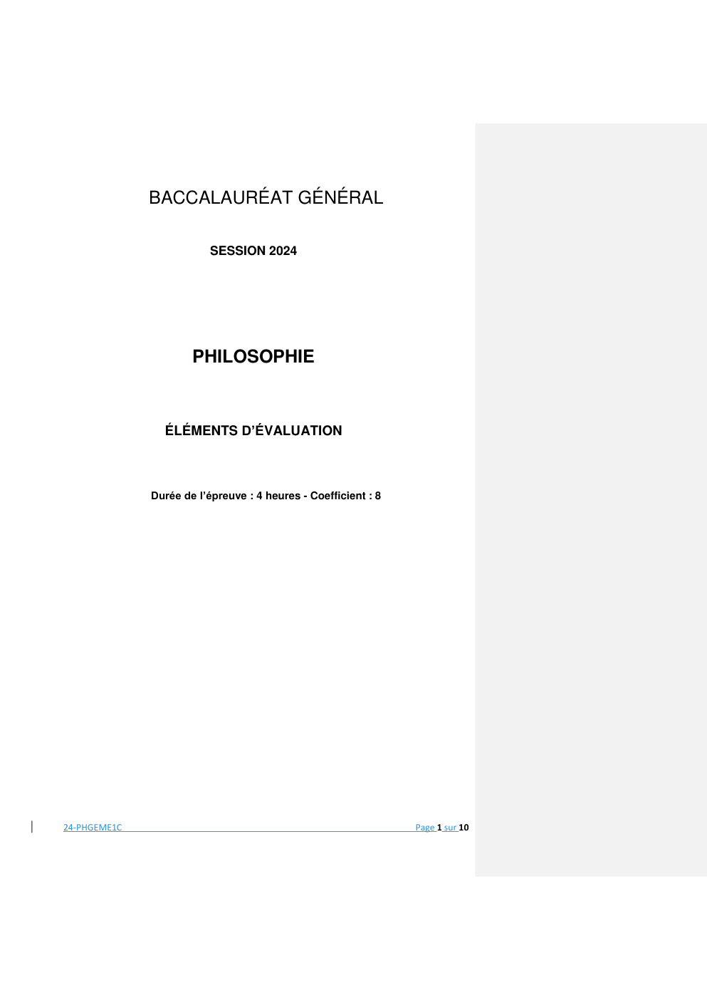
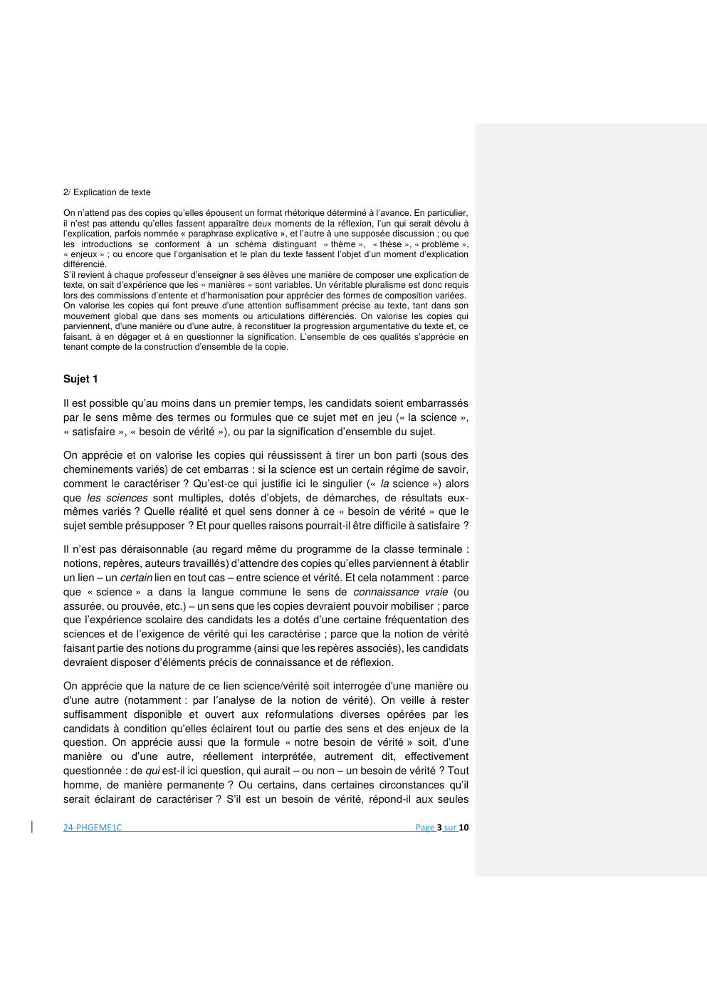

# philosophie-2024-metropole-corrige-officiel

> Source : `../../../pdf_version/09_philo/2024/philosophie-2024-metropole-corrige-officiel.pdf` — conversion Markdown (texte + visuels).
> Stratégie : [STRATEGIE_MARKDOWN.md](../../../STRATEGIE_MARKDOWN.md)

---

## Page 1

BACCALAURÉAT GÉNÉRAL

                          SESSION 2024

                      PHILOSOPHIE

                ÉLÉMENTS D’ÉVALUATION

              Durée de l’épreuve : 4 heures - Coefficient : 8

24-PHGEME1C                                                     Page 1 sur 10

---

## Page 2

Remarques d’ordre général

Les éléments d’évaluation qui sont associés à chaque sujet ne constituent pas des corrigés
dotés d’une valeur prescriptive. Ils ne sont pas directement transposables en une échelle
d’évaluation et de notation. Ils sont destinés à faciliter le travail des commissions d’entente et
d’harmonisation en proposant aux professeurs-évaluateurs des pistes de réflexion à partager. Il
est pertinent de les compléter en ajoutant des éléments ou des perspectives qui n’auraient pas
été anticipés, et qui apparaissent nécessaires, notamment à la lecture des copies-test examinées
par les commissions d’entente.

I - S’agissant du sens général de l’épreuve du baccalauréat et de son articulation aux
connaissances et aux savoir-faire attendus, on se reportera au programme des classes de la
voie générale et de la voie technologique et notamment aux indications suivantes :

1/ [Préambule – extrait]
« Dans les travaux qui lui sont demandés, l’élève :
− examine ses idées et ses connaissances pour en éprouver le bien-fondé ;
− circonscrit les questions qui requièrent une réflexion préalable pour recevoir une réponse ;
− confronte différents points de vue sur un problème avant d’y apporter une solution appropriée ;
− justifie ce qu’il affirme et ce qu’il nie en formulant des propositions construites et des arguments
instruits ;
− mobilise de manière opportune les connaissances qu’il acquiert par la lecture et l’étude des textes et
des œuvres philosophiques. »

2/ [Exercices et apprentissage de la réflexion philosophique - extrait] :
« (…) Explication de texte et dissertation sont deux exercices complets qui reposent sur le respect
d’exigences intellectuelles élémentaires : exprimer ses idées de manière simple et nuancée, faire un
usage pertinent et justifié des termes qui ne sont pas couramment usités, indiquer les sens d’un mot et
préciser celui que l’on retient pour construire un raisonnement, etc. Cependant, composer une
explication de texte ou une dissertation ne consiste pas à se soumettre à des règles purement formelles.
Il s’agit avant tout de développer un travail philosophique personnel et instruit des connaissances
acquises par l’étude des notions et des œuvres. »

II - S’agissant des modes de composition :

1/ Dissertation

On n’attend pas des copies qu’elles épousent un format rhétorique déterminé à l’avance – s’agissant
de l’organisation d’ensemble de la copie et en particulier de l’« introduction », du « développement » ou
de la « conclusion ». S’il revient à chaque professeur d’enseigner à ses élèves une manière de
composer une dissertation, on sait d’expérience que les « manières » sont variables. Un véritable
pluralisme est donc requis lors des commissions d’entente et d’harmonisation pour apprécier des formes
de composition variées. On se garde en particulier de faire prévaloir un modèle dissertatif figé (par
exemple du type « thèse-antithèse-… ») et l’on cherche plutôt à apprécier les efforts de construction de
la pensée par lesquels les copies parviennent à rendre raison du sujet et de ses diverses possibilités
théoriques.
On valorise donc une attention précise au sujet, sur la base des savoirs et des savoir-faire que le
programme amène à travailler : prise en compte des réalités et des situations dans et par lesquelles la
question posée est susceptible de prendre sens ; attention portée aux termes et aux idées qu’elle
implique ; détermination de difficultés et problèmes d’ordre théorique ou pratique qui l’expliquent et la
justifient ; mobilisation instructive des exemples et des références.
Ce faisant, on valorise un propos qui prend la forme d’une recherche et qui permet la prise en charge
d’un problème. Cela s’apprécie de manière globale en tenant compte de la construction et de la
progression d’ensemble de l’exposé.

24-PHGEME1C                                                                                Page 2 sur 10

---

## Page 3

2/ Explication de texte

On n’attend pas des copies qu’elles épousent un format rhétorique déterminé à l’avance. En particulier,
il n’est pas attendu qu’elles fassent apparaître deux moments de la réflexion, l’un qui serait dévolu à
l’explication, parfois nommée « paraphrase explicative », et l’autre à une supposée discussion ; ou que
les introductions se conforment à un schéma distinguant « thème », « thèse », « problème »,
« enjeux » ; ou encore que l’organisation et le plan du texte fassent l’objet d’un moment d’explication
différencié.
S’il revient à chaque professeur d’enseigner à ses élèves une manière de composer une explication de
texte, on sait d’expérience que les « manières » sont variables. Un véritable pluralisme est donc requis
lors des commissions d’entente et d’harmonisation pour apprécier des formes de composition variées.
On valorise les copies qui font preuve d’une attention suffisamment précise au texte, tant dans son
mouvement global que dans ses moments ou articulations différenciés. On valorise les copies qui
parviennent, d’une manière ou d’une autre, à reconstituer la progression argumentative du texte et, ce
faisant, à en dégager et à en questionner la signification. L’ensemble de ces qualités s’apprécie en
tenant compte de la construction d’ensemble de la copie.

Sujet 1

Il est possible qu’au moins dans un premier temps, les candidats soient embarrassés
par le sens même des termes ou formules que ce sujet met en jeu (« la science »,
« satisfaire », « besoin de vérité »), ou par la signification d’ensemble du sujet.

On apprécie et on valorise les copies qui réussissent à tirer un bon parti (sous des
cheminements variés) de cet embarras : si la science est un certain régime de savoir,
comment le caractériser ? Qu’est-ce qui justifie ici le singulier (« la science ») alors
que les sciences sont multiples, dotés d’objets, de démarches, de résultats eux-
mêmes variés ? Quelle réalité et quel sens donner à ce « besoin de vérité » que le
sujet semble présupposer ? Et pour quelles raisons pourrait-il être difficile à satisfaire ?

Il n’est pas déraisonnable (au regard même du programme de la classe terminale :
notions, repères, auteurs travaillés) d’attendre des copies qu’elles parviennent à établir
un lien – un certain lien en tout cas – entre science et vérité. Et cela notamment : parce
que « science » a dans la langue commune le sens de connaissance vraie (ou
assurée, ou prouvée, etc.) – un sens que les copies devraient pouvoir mobiliser ; parce
que l’expérience scolaire des candidats les a dotés d’une certaine fréquentation des
sciences et de l’exigence de vérité qui les caractérise ; parce que la notion de vérité
faisant partie des notions du programme (ainsi que les repères associés), les candidats
devraient disposer d’éléments précis de connaissance et de réflexion.

On apprécie que la nature de ce lien science/vérité soit interrogée d'une manière ou
d'une autre (notamment : par l’analyse de la notion de vérité). On veille à rester
suffisamment disponible et ouvert aux reformulations diverses opérées par les
candidats à condition qu'elles éclairent tout ou partie des sens et des enjeux de la
question. On apprécie aussi que la formule « notre besoin de vérité » soit, d’une
manière ou d’une autre, réellement interprétée, autrement dit, effectivement
questionnée : de qui est-il ici question, qui aurait – ou non – un besoin de vérité ? Tout
homme, de manière permanente ? Ou certains, dans certaines circonstances qu’il
serait éclairant de caractériser ? S’il est un besoin de vérité, répond-il aux seules

24-PHGEME1C                                                                               Page 3 sur 10

---

## Page 4

exigences d’une connaissance, ou faut-il introduire d’autres dimensions de l’existence,
ayant trait aux dimensions techniques (savoir-faire, produire) ou pratiques (agir) ?

Plusieurs perspectives de travail apparaissent judicieuses et éclairantes – et qu’on
valorise d’autant plus qu’elles prennent appui sur des connaissances (références,
exemples) précises :

   -   si la ou les sciences peuvent satisfaire notre besoin de vérité, c’est en vertu de
       leur nature même (observation, raisonnement, association des deux,
       procédures démonstratives ou expérimentales, etc.) et de leur capacité à
       déployer une connaissance portant objectivité, vérification, etc. ;
   -   si la ou les sciences peuvent décevoir notre quête de vérité, ce pourrait être
       parce que les avancées mêmes de la science induisent une remise en question
       perpétuelle de ce que l’on tient (ou tenait) pour vrai.

On sera notamment sensible à la manière dont les copies usent (ou non) du terme de
« progrès ». Il s’agirait alors d’examiner si la puissance de connaissance des sciences
doit être relativisée, au motif qu'aucune vérité absolue, définitive et irréfutable ne
saurait en être extraite.

On valorisera les copies qui prendront toute la mesure d'un divorce possible, ou,
paradoxalement, d’un possible soutien entre notre besoin impérieux de vérité et les
impératifs de prudence sceptique qu'impose une authentique démarche scientifique.
C'est à ce titre que toutes les analyses qui confronteraient la prudence heuristique des
démarches et méthodes scientifiques à l'impatience du besoin de vérité, pourront
s'avérer légitimes et efficaces pour identifier les enjeux essentiels du sujet.

On valorisera aussi et peut-être plus encore les copies qui envisageront d'autres
régimes de vérité possibles, et qui, ce faisant, seront à même d'entrer pleinement dans
l'espace réflexif du sujet. Car si la science, c'est-à-dire un savoir objectif et vérifié sur
un domaine délimité, n'est pas toujours en mesure de satisfaire notre besoin de vérité,
cela pourrait impliquer, soit que ce dernier puisse se satisfaire ailleurs et autrement –
il faudrait alors se demander de quelle manière –, soit qu’il reste insatisfait – il faudrait
alors se demander pour quelle raison.

Les bonnes ou très bonnes copies seront sans doute celles – mais cela est à vérifier
en commission d’entente et sur la base des copies étudiées en bonne intelligence
collective – qui interrogeront, à leur personnelle façon, le statut des vérités de fait, par
exemple, ou des vérités d'opinion, des vérités religieuses ou encore esthétiques, celles
qui confronteront utilement les vérités révélées et les vérités démontrées, les
croyances et les théories. Ce type d'analyse permet alors de mieux mesurer la
dimension paradoxale du sujet : si l'on peut douter que la science puisse satisfaire
notre besoin de vérité, c'est sans doute parce que la notion même de vérité recouvre
des besoins et des valeurs très disparates. Affirmer passionnément ses convictions
n'a plus grand chose à voir avec le fait de soumettre méthodiquement une hypothèse
à une analyse impartiale et objective. Que cherchons-nous réellement à satisfaire

24-PHGEME1C                                                                     Page 4 sur 10

---

## Page 5

lorsque nous entreprenons de satisfaire notre besoin de vérité ? Et ce besoin lui-même
ne dissimule-t-il pas des motifs et des aspirations tout à fait différents de ceux qu’il
affiche ? Les candidats pourraient même à juste titre interroger l’existence
d’un « besoin de vérité » en l’homme : si un tel besoin était une illusion – l’homme lui
préférant peut-être de beaucoup des opinions ou croyances rassurantes – on peut
aisément concevoir que n’importe quelle idée toute fait puisse naturellement mieux lui
convenir.

Au fond, s'interrogent les bonnes ou très copies, notre besoin de vérité n'est-il pas
nécessairement et légitimement déçu par la science ? Là où nous voudrions découvrir
une vérité absolue et définitive, il semble que si la science ne nous propose que des
vérités locales ou provisoires – ce qui ne signifie pas nécessairement plus fragiles –,
c'est bien paradoxalement ce qui garantit sa fiabilité. Néanmoins, l’insatisfaction
relative de notre besoin de vérité, dans laquelle nous laisse la science, ne serait-elle
pas la meilleure assurance contre toute forme de dogmatisme ?

Les très bonnes copies ne manqueront pas de réfléchir sur ce paradoxe : notre besoin
de vérité ne peut être satisfait par la science qu'à condition de ne pas le couper de nos
autres besoins. La connaissance n'est pas une fin en soi, mais un instrument qui
permet à l'homme de satisfaire ses besoins et d'interagir efficacement avec son milieu.
L'idée est vraie non pas parce qu'elle décrit objectivement la réalité telle qu'elle est
absolument, mais parce qu'elle permet à l'homme d'agir et de parvenir à ses fins.

Ainsi, une idée est vraie parce qu'elle nous guide de manière satisfaisante dans
l'expérience. La vérité ne précède pas sa vérification, elle n'est rien d'autre que le
processus même de vérification. La vérité n'est pas, elle se fait et c’est peut-être en
nous apprenant justement à nous défaire du besoin exclusif d’une vérité absolue que
la science peut offrir le modèle d’une vérité capable d’orienter efficacement notre
expérience.

Sujet 2

Certains candidats ont pu être étonnés par la formulation du sujet, qui articule deux notions
du programme en inversant les termes d’un sujet qu’on peut estimer davantage
« classique » : « Que devons-nous à l’État ? ». On apprécie et on valorise le fait qu’ils tirent
un parti réflexif de cet embarras (et, bien évidemment, qu’ils ne passent pas à côté de
l’ordre logique du sujet qu’ils ont retenu).
On n’attend pas d’eux des considérations savantes ou techniques hors de leur portée –
notamment sur l’histoire politique, conceptuelle ou institutionnelle, des « droits créances »
et de leur distinction, voire opposition, avec des « droits liberté ». Pas davantage des
considérations avancées sur l’État-Providence, ses principes fondateurs ou ses problèmes
de mise en œuvre – cette notion n’étant pas en tant que telle au programme.
On attend d’eux en revanche – et cela d’autant que ce sujet s’articule explicitement à l’une
des notions du programme ainsi qu’aux repères qui lui sont associés – qu’ils se rendent
d’une manière ou d’une autre sensibles à la difficulté qui se trouve ici en question :
24-PHGEME1C                                                                        Page 5 sur 10

---

## Page 6

-    d’une part en effet, dans l’ordre des choses tel qu’il est envisagé ordinairement,
           le « sujet » ou le « citoyen », dès lors qu’il est soumis à une autorité politique, se
           trouve chargé d’un certain nombre de devoirs, qui se déclinent de différentes
           façons, du devoir à l’obéissance, de l’obéissance à la subordination ;
       - d’autre part, à partir du moment où ceux qui obéissent au sein d’une communauté
           politique réglée par des lois ne sont pas ceux que l’on écrase, ou que l’on anéantit,
           leur intérêt apparaît aussi comme ce non seulement qui peut, mais qui doit, être
           pris en compte : que serait une société ou communauté politique qui ne servirait
           pas, d’une manière ou d’une autre, les parties qui la composent, ou le tout qu’elle
           constitue ?
On attend que les copies ne se contentent pas de mobiliser des connaissances générales
sur l’État, mais cherchent à interroger ses fonctions et ses fins au regard des obligations
qu’il pourrait avoir vis-à-vis de ses sujets, pris individuellement ou « en corps ». Ou, pour
dire autrement : qu’ils ne se contentent pas de reprendre et de répéter les termes « État »
ou « devoir » ; et qu’ils engagent, d’une manière ou d’une autre, l’analyse de ces notions
(au besoin, en considérant des situations empruntées à l’histoire).
La mobilisation des repères associés, lorsqu’elle est pertinente, doit être valorisée – et
notamment, la distinction de l’obligation et de la contrainte. Et si l’on n’attend pas de
considérations techniques sur le concept de souveraineté (qui n’est pas, lui non plus,
explicitement, au programme), on valorise les copies qui s’interrogent, d’une manière ou
d’une autre, sur la question du pouvoir : un État dont le pouvoir ne serait pas absolu serait-
il vraiment efficace ? Qu’est-ce qui justifie qu’on lui assigne des limites ? De quel ordre : de
fait ? de droit ?
On valorise sans hésiter les copies qui travaillent à la construction de telles interrogations
et qui comprennent, même de manière partielle ou imprécise, que la question porte sur la
nature de l’État, sur la nature du lien que nous entretenons avec lui, et aussi sur le statut
de la société ou communauté politique que l’État organise ou dirige : l’État est-il seulement
une instance de pouvoir dotée d’une capacité de direction ? N’est-il pas aussi l’objet d’une
construction collective, qui lui confère justement son autorité et sa capacité d’agir ? Qu’en
est-il alors des positions respectives et des engagements ou des obligations réciproques ?
Celles-ci prennent-elles la forme, et en quel sens de ces termes, d’une loi, de droits, d’un
contrat social ? Serait-il pertinent de faire valoir à leur sujet la distinction (éventuelle) des
obligations (consenties) et des contraintes (subies) ?
On valorise d’autant plus ces copies :
       - qu’elles suivent et développent précisément ces interrogations (ou d’autres
           complémentaires) et parviennent à une détermination effective des droits et
           devoirs ;
       - qu’elles s’interrogent sur la relation entre les droits et les devoirs, relation
           équilibrée, voire harmonieuse ou, au contraire, incertaine et problématique : peut-
           on garantir une sécurité et, plus largement, des conditions de prospérité, sans
           sacrifier des libertés ?
       - qu’elles travaillent à préciser de quelle manière et sous quelles conditions
           (institutionnelles, sociales, etc.) telle finalité peut être approchée, et quel rapport
           elle entretient avec l’exigence du droit et de la justice ;

24-PHGEME1C                                                                          Page 6 sur 10

---

## Page 7

-    qu’elles se demandent si l’on a ainsi affaire à une restriction des capacités de
           l’État ou au contraire à un gain d’autorité : ce qui offre une perspective
           intéressante pour interroger ce qui caractérise l’État, sa finalité, sa fonction, son
           origine.
De bonnes copies dépassent l’énumération « listée » de ce que l’État peut nous devoir, et
questionnent le fondement de sa légitimité. De bonnes voire de très bonnes copies
parviennent à tirer parti de ces analyses pour interroger les formes différenciées de
l’organisation politique et travailler sur la question du meilleur régime : formes droites
d’États ou, a contrario, formes de constitution ou d’organisation qui ne respectent pas les
droits fondamentaux des sujets ; État de droit, versus institutions violentes ou corrompues.
On valorise de manière très appuyée celles qui, faisant ce pas de plus (ou différemment)
mettent en relation l’État et la question de l’intérêt général : l’État peut-il agir pour l’intérêt
général ? Peut-il échapper au poids des intérêts des plus puissants ? Peut-il participer à la
constitution et à la réalisation pratique d’une véritable communauté de droits et d’intérêts ?
Les très bonnes copies, que l’on valorise sans hésiter, compliquent ou même inversent le
questionnement en considérant la constitution de l’État et le rôle que les individus prennent
dans ce qu’il est et dans son mode propre de fonctionnement. Ainsi compris, le sujet peut
engager à interroger l’importance des actions citoyennes et le sens que l’on peut donner à
l’action ou à la vie politique, comme ne relevant pas seulement d’un ordre de l’État mais
d’un engagement, y compris critique, des citoyens que l’État doit reconnaître. Déterminer
ce que l’État nous doit peut ainsi conduire à réfléchir aux dérives autoritaires possibles de
l’État et aux conditions qui, au contraire, garantissent ce qui est dû aux citoyens.

Sujet 3

Le texte de Simone Weil tisse deux fils de réflexion :
    - l’un qui concerne la nature de l’action. Ainsi considéré le texte interroge les
        forces (« énergie »), les finalités (« mobiles ») mais aussi les conditions de mise
        en œuvre et la hiérarchie des valeurs qui s’y trouvent impliquées (« bas » ou
        « élevé » ; « bonne » ou « mauvaise »).
    - l’autre qui concerne le travail, en particulier le travail ouvrier dans le contexte
        de ce que le texte désigne comme l’« usine » ; il s’agit alors de réfléchir à la
        manière dont cette forme de travail, si elle requiert de la part de celui qui travaille
        un certain engagement, le restreint à des mobiles « bas », et de surcroît
        tellement envahissants que le travailleur en devient nécessairement indifférent
        et brutal (aux autres et, d’une certaine manière, à lui-même).
On a affaire à un texte dense, par les concepts qu’il mobilise et par le chemin d’analyse
et d’argumentation qu’il met en œuvre. En particulier, lorsqu’il s’agit de déterminer la
nature même du travail ouvrier : sans fouets ni chaînes, laissant place à une forme
d’engagement (« il faut chercher des mobiles en soi-même »), mais sous un régime
de contrainte et même d’exténuation (« passivité épuisante ») qui est tel que celui qui
travaille n’a pas le choix : il subit en lui-même les mobiles qui le tiennent engagé dans
le travail, et se trouve empêché de se donner d’autres fins. Que devient alors son
régime d’activité, et comment caractériser cette « condition » ?

24-PHGEME1C                                                                          Page 7 sur 10

---

## Page 8

On n’attend pas des copies une connaissance, même partielle ou indirecte, de l’œuvre
et de la doctrine de Simone Weil. Si l’autrice fait partie des auteurs du programme, il
est tout à fait possible que des candidats n’en aient jamais entendu parler, et que son
analyse de la condition ouvrière leur soit tout à fait inconnue. En particulier, on se
gardera de mesurer les propositions des copies à l’aune de qui constitue les concepts
weiliens de l’action, de l’âme et, plus généralement, de la condition humaine et de ses
aspirations transcendantes.
C’est la raison pour laquelle la note relative au « mobile » a été laissée, volontairement,
très ouverte – et d’une certaine manière approximative et imparfaite : elle vise non pas
à donner aux candidats une compréhension aboutie, s’agissant des causes, fins et
ressorts propres de l’action, mais à attirer leur attention sur un élément important du
texte, tant dans son moment initial que dans ses développements ultérieurs. En
particulier : lorsque « la crainte des réprimandes et du renvoi », « le désir avide
d’accumuler des sous », « le goût des records de vitesse » sont désignés comme des
« mobiles », à la fois « obsessionnels » et peu « élevés », les affects et les penchants
sont associés à des buts visés et deviennent des « mobiles ». On valorise les copies
qui interrogent, d’une manière ou d’une autre, cette conception de l’action. Comment
et pourquoi « l’énergie qui pousse à agir » est-elle associée à des visées ou à des buts
que l’on cherche à atteindre ? Comment certains affects (la crainte, le désir, le goût) y
sont-ils associés ? Comment et pourquoi différencier des mobiles « plus élevés » et
d’autres « plus bas » ? Et quel sens peuvent prendre ici les termes « bonne » ou
« mauvaise », venant qualifier une action, dans sa mise en œuvre comme dans ses
effets ?
On n’attend pas non plus des copies des connaissances historiques ou techniques
pointues sur le travail industriel et son organisation en usine. Des éléments de culture
générale relatifs à l’histoire comme à la technique devraient suffire à inscrire le texte
dans un contexte qui en éclaire le sens. Ce qui importe alors surtout, et que l’on
valorise, c’est le fait que les termes mêmes – « usine », « ouvrier » – sont
effectivement interrogés, et que les copies parviennent à déterminer, d’une manière
ou d’une autre, ce qui porte ici empêchement, rétractation, brutalité ou indifférence.

S’agissant de la compréhension d’ensemble du texte, on valorise particulièrement les
copies qui parviennent à montrer comment Simone Weil replace le travail – et sous
cette forme particulière du travail d’usine – dans une interrogation plus générale sur
l’activité humaine, sur son sens et sur l’énergie qu’elle requiert et suscite à la fois.
Qu’est-ce qui nous pousse à agir ? Qu’est-ce qui, dans une action, part de nous ?
Comment faire la différence entre ce qui est agi et ce qui est subi ? En particulier,
lorsqu’il s’agit de travailler ?
L’attention au mouvement et à la progression du texte, le marquage précis de sa
structuration logique, est aussi valorisé. Lisant les copies, on doit être attentif au fait
que l’ordre raisonné du texte peut être interrogé et reconstitué sous plusieurs
approches, selon qu’on tient la première phrase du texte pour un moment différencié
(donnant une sorte de définition générale), ou qu’on l’intègre dans ce qui constituerait
une première partie (lignes 1-5) assignant la spécificité des mobiles propres au travail

24-PHGEME1C                                                                   Page 8 sur 10

---

## Page 9

d’usine. De manière classique, on valorise les copies qui s’interrogent sur les
articulations du propos : comment passe-t-on des caractéristiques générales de
l’action humaine à la détermination des formes propres à l’activité laborieuse en usine
(sous un certain régime de « passivité »), puis à l’analyse de ses effets psychologiques
et moraux, à la fois personnels et systémiques ?
Il n’est sans doute pas aisé pour les candidats de comprendre, malgré son caractère
concret, ce que signifie la formule « il n’y a pas de fouets, pas de chaînes », et à quoi
précisément elle est référée (sans doute l’esclavage, ou le travail des forçats) ; a
fortiori, de prendre la mesure de cette nécessité paradoxale : on doit trouver des
mobiles « en soi-même », autrement dit des ressorts d’engagement conduisant à
travailler ; et cela au sein d’un système qui impose une « passivité épuisante » et que
l’on ne peut que subir.
On valorise ainsi les copies :
     - qui interrogent cette différence entre le travail sous contrainte violente (celle des
         fouets et des chaînes) et celui qui semble se réaliser de manière volontaire (sur
         la base d’une certaine motivation) ;
     - qui interrogent l’expression de « passivité épuisante » et réfléchissent à ce
         paradoxe : le travail subi requiert aussi une certaine forme
         d’engagement volontaire (ce qui justifie d’ailleurs que Weil le fasse entrer dans
         l’ordre de l’action) : on cherche à gagner de l’argent, on s’efforce d’éviter le
         renvoi ou les réprimandes, on joue le jeu de la compétition et des « courses de
         vitesse » ; et on ne manque pas de retourner au travail…
     - qui, une fois ces mobiles nommés, se demandent quelles sont ces « conditions
         du travail » qui imposent d’avoir de tels mobiles ? et pourquoi ceux-ci
         seulement ?
     - qui s’interrogent sur la nature de leur « bassesse » : pourquoi doivent-ils être
         tenus pour « bas » ? que seraient des mobiles plus « élevés » ? qui ou quoi doit
         décider qu’un mobile est « élevé » ou « bas » ?
     - qui font preuve, s’agissant des conséquences psychologiques et morales, d’une
         attention au détail du texte et d’une précision dans l’explication : que se passe-
         t-il lorsque les mobiles deviennent « obsédants », et pourquoi ne peuvent-ils
         pas le devenir ? Qu’y a-t-il à ce niveau qui fasse « système » ? Qu’advient-il à
         la pensée qui « se rétracte », et de quoi alors n’est-elle plus capable ?
     - qui s’intéressent – et cela peut constituer un fil de lecture – à la manière dont le
         travail en usine affecte le rapport au temps et même son statut, jusqu’à en faire
         un simple point, ou une série de points répétitifs et ennuyeux, en lieu et place
         d’une durée vivante.

Alors que certaines copies se contentent de décrire ce que peut être le travail à l’usine,
on valorise les copies qui analysent ce type de travail sous l’angle de la dépossession
de soi, de la souffrance et de l’isolement. On valorise, pour cela, les copies qui lisent
le texte, certes comme une condamnation du travail à l’usine, mais qui comprennent
aussi que la question posée par Simone Weil n’est pas simplement celle d’une
amélioration des conditions de travail, car il y va d’un empêchement plus profond.

24-PHGEME1C                                                                    Page 9 sur 10

---

## Page 10

Celles aussi qui repèrent et questionnent le fait que le travail à l’usine isole des autres
hommes par une forme particulière de rétrécissement et d’indifférence, et cela jusqu’à
l’aplatissement final du temps et jusqu’à l’expression d’une plainte inaudible.

                                     ____________

24-PHGEME1C                                                                  Page 10 sur 10
