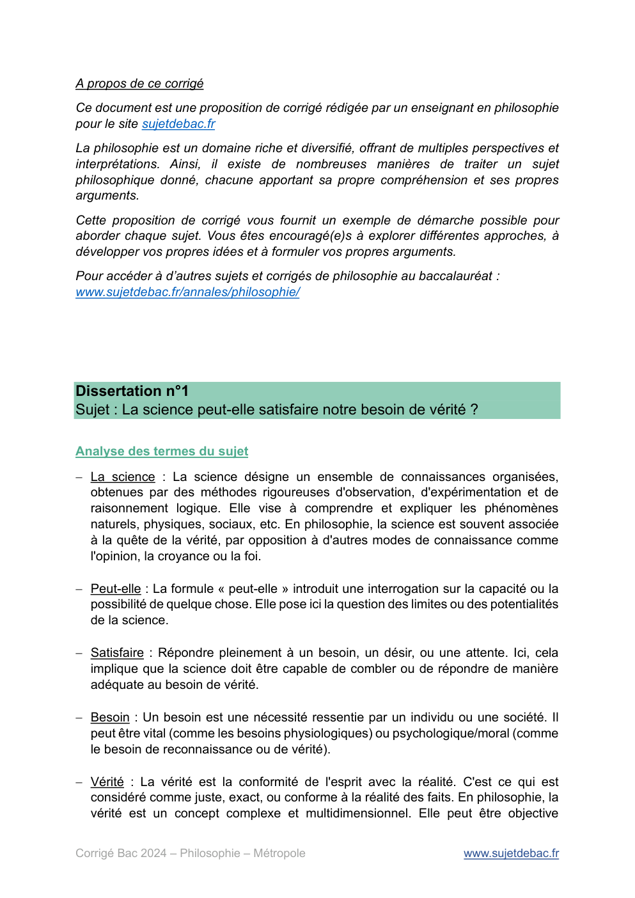
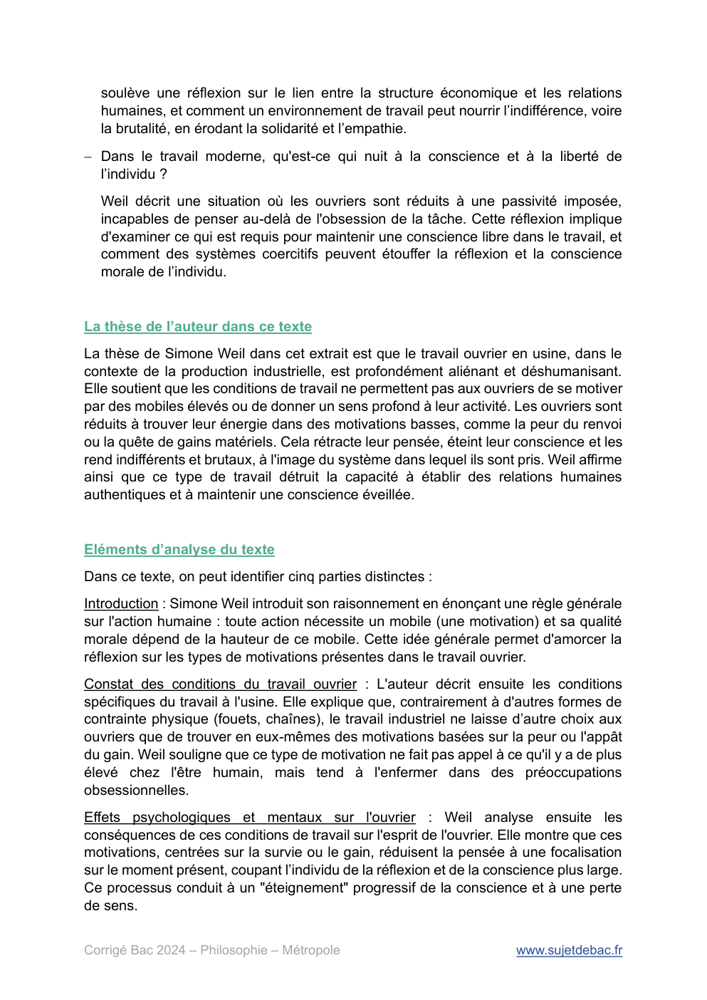

# philosophie-2024-metropole-corrige

> Source : `../../../pdf_version/09_philo/2024/philosophie-2024-metropole-corrige.pdf` — conversion Markdown (texte + visuels).
> Stratégie : [STRATEGIE_MARKDOWN.md](../../../STRATEGIE_MARKDOWN.md)

---

## Page 1

Corrigé du bac 2024 : Philosophie
                  Métropole

                 BACCALAURÉAT GÉNÉRAL

                                SESSION 2024

                               PHILOSOPHIE

                  Durée de l’épreuve : 4 heures – Coefficient : 8

            L’usage de la calculatrice et du dictionnaire n’est pas autorisé.

Corrigé Bac 2024 – Philosophie – Métropole                             www.sujetdebac.fr

---

## Page 2

A propos de ce corrigé
Ce document est une proposition de corrigé rédigée par un enseignant en philosophie
pour le site sujetdebac.fr
La philosophie est un domaine riche et diversifié, offrant de multiples perspectives et
interprétations. Ainsi, il existe de nombreuses manières de traiter un sujet
philosophique donné, chacune apportant sa propre compréhension et ses propres
arguments.
Cette proposition de corrigé vous fournit un exemple de démarche possible pour
aborder chaque sujet. Vous êtes encouragé(e)s à explorer différentes approches, à
développer vos propres idées et à formuler vos propres arguments.
Pour accéder à d’autres sujets et corrigés de philosophie au baccalauréat :
www.sujetdebac.fr/annales/philosophie/

Dissertation n°1
Sujet : La science peut-elle satisfaire notre besoin de vérité ?

Analyse des termes du sujet
− La science : La science désigne un ensemble de connaissances organisées,
  obtenues par des méthodes rigoureuses d'observation, d'expérimentation et de
  raisonnement logique. Elle vise à comprendre et expliquer les phénomènes
  naturels, physiques, sociaux, etc. En philosophie, la science est souvent associée
  à la quête de la vérité, par opposition à d'autres modes de connaissance comme
  l'opinion, la croyance ou la foi.

− Peut-elle : La formule « peut-elle » introduit une interrogation sur la capacité ou la
  possibilité de quelque chose. Elle pose ici la question des limites ou des potentialités
  de la science.

− Satisfaire : Répondre pleinement à un besoin, un désir, ou une attente. Ici, cela
  implique que la science doit être capable de combler ou de répondre de manière
  adéquate au besoin de vérité.

− Besoin : Un besoin est une nécessité ressentie par un individu ou une société. Il
  peut être vital (comme les besoins physiologiques) ou psychologique/moral (comme
  le besoin de reconnaissance ou de vérité).

− Vérité : La vérité est la conformité de l'esprit avec la réalité. C'est ce qui est
  considéré comme juste, exact, ou conforme à la réalité des faits. En philosophie, la
  vérité est un concept complexe et multidimensionnel. Elle peut être objective

Corrigé Bac 2024 – Philosophie – Métropole                              www.sujetdebac.fr

---

## Page 3

(correspondance avec les faits), subjective (vérité pour soi-même), ou même
  conventionnelle (vérité acceptée par un consensus social).
Le sujet explore la relation entre la connaissance scientifique et la vérité, un enjeu
central en épistémologie. La science, par sa méthodologie, cherche à découvrir et
établir des vérités sur le monde, mais la question se pose de savoir si cette vérité est
absolue ou relative, provisoire ou définitive. La science est-elle le seul moyen
d'accéder à la vérité, ou d'autres formes de savoir (philosophie, religion, art) sont-elles
nécessaires pour compléter cette quête ?
Le sujet présuppose que la vérité est un besoin universel et fondamental pour
l'homme, ce qui pourrait être discuté. Est-ce vraiment un besoin pour tous ?

Notions philosophiques abordées par ce sujet
− La science : Le sujet traite directement de la capacité de la science à satisfaire le
  besoin de vérité. C'est donc la notion centrale, interrogeant la portée et les limites
  de la science en tant que méthode de connaissance.

− La vérité : Le sujet questionne la possibilité pour la science de répondre au besoin
  de vérité. La notion de vérité est cruciale pour déterminer ce que l'on entend par
  "vérité" (objective, subjective, etc.) et comment la science peut la définir ou
  l'atteindre.

− La raison : La science est fondée sur l'usage de la raison, c'est-à-dire la capacité
  de l'homme à penser de manière logique et cohérente pour découvrir des vérités.
  Cette notion est essentielle pour comprendre les méthodes scientifiques et leur
  relation avec la vérité.

− La religion : Même si elle n'est pas explicitement mentionnée, la religion peut être à
  considérer pour comprendre les limites de la science. La religion propose une autre
  voie pour accéder à la vérité, souvent basée sur la foi plutôt que sur la raison
  scientifique.

Quelques pièges à éviter
Réduire le besoin de vérité à un simple désir de connaissance : Le besoin de vérité
peut être existentiel, éthique ou métaphysique, et non seulement intellectuel. Il ne
s'agit pas seulement de savoir comment le monde fonctionne, mais aussi de
comprendre des questions plus profondes sur le sens de la vie, la justice, ou
l'existence.
Confondre vérité scientifique et vérité absolue : Il est important de ne pas supposer
que la vérité scientifique est la seule forme de vérité ou qu'elle est nécessairement
absolue. La science évolue avec le temps, et ce qui est considéré comme vrai à un
moment donné peut être révisé ou complété par de nouvelles découvertes.

Corrigé Bac 2024 – Philosophie – Métropole                               www.sujetdebac.fr

---

## Page 4

Opposer radicalement science et religion ou métaphysique : Un piège courant serait
de tomber dans une opposition trop simpliste entre science et religion, ou entre science
et métaphysique. Le sujet ne demande pas de choisir entre ces domaines, mais plutôt
de réfléchir aux capacités spécifiques de la science à satisfaire le besoin de vérité.
Certains domaines de la vérité (par exemple, les questions morales ou existentielles)
peuvent relever d’autres champs que la science, mais cela ne doit pas entraîner un
rejet pur et simple de l’un au profit de l’autre.

Propositions de problématique
− Le besoin de vérité peut-il être totalement satisfait par la seule méthode
  scientifique ?
− La science offre-t-elle une vérité universelle ou seulement partielle et révisable ?
− La vérité scientifique est-elle suffisante face à des vérités existentielles ou morales ?
− La science peut-elle combler à la fois notre soif de connaissance et notre quête de
  sens existentiel ?
− La vérité scientifique suffit-elle à combler notre besoin humain de sens ?
− Est-ce que la science, en tant que méthode rationnelle, peut satisfaire des besoins
  de vérité qui échappent au domaine empirique ?

Contradiction possible pour traiter ce sujet
Thèse : La science peut satisfaire notre besoin de vérité, car elle repose sur des
méthodes rigoureuses et vérifiables qui permettent de découvrir des vérités objectives
sur le monde, rendant ses réponses fiables et universelles.
Antithèse : La science ne peut pas pleinement satisfaire notre besoin de vérité, car elle
ne répond qu'aux questions factuelles et empiriques, laissant de côté les dimensions
existentielles, morales et métaphysiques de la vérité, qui nécessitent d'autres
approches (philosophie, religion, etc.).

Eléments de réponses et références philosophiques
Les découvertes scientifiques comme la loi de la gravitation (Newton) ou la théorie de
l’évolution (Darwin) reposent sur l’observation et l’expérimentation. Elles offrent des
vérités objectives, testables et applicables de manière universelle, répondant ainsi à
notre besoin de comprendre le fonctionnement du monde physique. Néanmoins, les
théories scientifiques ne sont pas définitives. Par exemple, la relativité générale
d’Einstein a corrigé certaines limites de la physique newtonienne. Cette nature
évolutive montre que la science ne donne pas accès à une vérité absolue, mais à des
vérités provisoires qui s'affinent avec le temps.
Karl Popper, avec son concept de falsifiabilité, soutient que la science ne peut offrir
que des vérités provisoires, soumises à des révisions constantes. La science avance

Corrigé Bac 2024 – Philosophie – Métropole                               www.sujetdebac.fr

---

## Page 5

par essais et erreurs, en réfutant des hypothèses plutôt qu’en prouvant des vérités
absolues. Ce qui est considéré comme vrai aujourd'hui pourrait être réfuté demain.
Dans sa théorie des Idées, Platon suggère que la vérité ultime se trouve dans le monde
des Idées, une réalité métaphysique au-delà des phénomènes sensibles. La science,
qui traite du monde sensible, ne peut donc pas accéder à la vérité absolue.
Des interrogations comme "Quel est le sens de la vie ?" ou "Que dois-je faire pour être
moral ?" ne peuvent pas être résolues par la science. Ce type de vérité nécessite des
approches philosophiques ou religieuses, car elles échappent à l'expérimentation et à
la mesure.
Henri Bergson affirme que la science découpe le réel en morceaux analytiques mais
échoue à comprendre des aspects plus fluides de la réalité, comme la durée ou la
conscience. Cela montre que certaines vérités, notamment existentielles, échappent
à l'approche analytique de la science.

Dissertation n°2
Sujet : L’État nous doit-il quelque chose ?

Analyse des termes du sujet
− L’État : L’État est ici à comprendre dans son sens politique et philosophique. Il
  représente une organisation politique qui exerce le pouvoir souverain sur un
  territoire donné et une population. L’État, en tant qu’institution, possède des
  prérogatives légales (établir des lois, rendre la justice, percevoir des impôts, etc.).
  Philosophiquement, l’État incarne l’autorité légitime, la gestion des intérêts
  communs et la régulation des rapports sociaux.

− Nous : Le « nous » désigne ici les citoyens, c'est-à-dire les individus qui vivent sous
  l’autorité d’un État et qui sont soumis à ses lois et institutions. Le « nous » englobe
  l'ensemble des membres de la société civile, sans distinction individuelle.

− Doit-il : Le verbe « devoir » est essentiel dans le sujet car il interroge la notion de
  devoir moral ou juridique. Il suppose l'idée d'une obligation ou d’une responsabilité
  de l’État envers ses citoyens. « Doit-il » pose donc la question de la légitimité et du
  fondement de cette obligation : est-elle naturelle, contractuelle, morale, légale ?

− Quelque chose : Cette formulation indéfinie ouvre le champ à diverses
  interprétations. Qu'est-ce que l'État pourrait devoir à ses citoyens ? Cela peut
  renvoyer à des biens matériels (comme la protection, la sécurité) mais aussi à des
  droits immatériels (la justice, la liberté, l'égalité). Ce « quelque chose » suggère

Corrigé Bac 2024 – Philosophie – Métropole                             www.sujetdebac.fr

---

## Page 6

également une éventuelle pluralité des « dettes » ou obligations que l’État pourrait
  avoir envers ses citoyens.
Le sujet pose immédiatement la question de la relation entre l’État et les citoyens.
L'État est censé organiser la vie en société, garantir l’ordre, protéger les individus et
assurer certains droits. En retour, les citoyens sont soumis à des obligations comme
respecter les lois, payer des impôts, etc. Il s’agit ici de se demander si cette relation
est symétrique (obligations réciproques) ou asymétrique (les citoyens doivent à l’État
sans que l’inverse soit vrai).
Le sujet présuppose que l'État pourrait avoir une « dette » envers ses citoyens, ce qui
implique déjà une forme d’obligation, de responsabilité. Mais cela soulève aussi une
question plus radicale : existe-t-il une situation où l’État ne devrait rien à ses citoyens ?
Ou bien, ce devoir est-il inconditionnel et universel ?

Notions philosophiques abordées par ce sujet
− L’État : C'est la notion centrale du sujet. Il s'agit de comprendre ce qu'est l'État, son
  rôle, ses fonctions, et ses relations avec les citoyens. La question porte sur ce que
  l'État, en tant qu'institution de pouvoir et de gestion de la société, doit aux individus.

− Le devoir : La notion de devoir est essentielle ici. Il s'agit de déterminer si l'État a
  une obligation morale ou juridique envers ses citoyens. Le verbe « devoir » interroge
  le lien entre ce que l'État doit et ce que les citoyens peuvent attendre légitimement
  de lui.

− La justice : La justice est au cœur de la réflexion sur ce que l'État « doit ». Si l'État
  a des devoirs, il s'agit souvent de garantir la justice au sein de la société, qu'il
  s'agisse de justice distributive (répartition des richesses), de justice corrective
  (sanctionner les infractions), ou de justice sociale (égalité des droits).

− La liberté : La liberté entre en jeu dans la réflexion sur ce que l’État doit ou ne doit
  pas. L'État doit-il avant tout garantir la liberté des citoyens (protéger leurs droits
  individuels) ou peut-il aussi intervenir pour assurer d’autres biens au détriment de
  certaines libertés (par exemple, restreindre certaines libertés pour garantir
  l’égalité) ?

Quelques pièges à éviter
Confondre l’État et le gouvernement : L’État est une institution durable qui organise la
société et qui existe indépendamment des gouvernements successifs. Le
gouvernement, quant à lui, est une instance temporaire chargée d’administrer l’État à
un moment donné. Il ne faut donc pas réduire la réflexion à des critiques ou louanges
d’un gouvernement particulier. Le sujet concerne l’État en tant que concept général,
pas une administration précise.

Corrigé Bac 2024 – Philosophie – Métropole                                www.sujetdebac.fr

---

## Page 7

Réduire le « quelque chose » à un sens strictement matériel : Il serait réducteur de ne
voir dans le « quelque chose » que des biens matériels (comme l’argent, la sécurité
physique). Le sujet invite à réfléchir aussi aux droits immatériels que l’État pourrait
devoir (liberté, justice, égalité, respect de la dignité humaine). Limiter l’analyse à des
aspects matériels occulterait une dimension philosophique essentielle.
Oublier la réciprocité entre citoyens et État : Un piège serait de penser que la question
ne concerne que ce que l'État doit aux citoyens, sans examiner la réciprocité des
devoirs entre les deux parties. La relation entre l’État et les citoyens est fondée sur
une dynamique d’échange (obligations mutuelles), et cela doit être pris en compte
dans l’analyse.

Propositions de problématique
− Les citoyens peuvent-ils légitimement exiger autre chose que la protection de
  leurs droits ?
− Jusqu’où s’étend la responsabilité de l’État vis-à-vis du bien commun ?
− L’État est-il responsable du bonheur et de la justice sociale des individus qu’il
  gouverne ?
− L’État a-t-il l’obligation de répondre aux besoins individuels en même temps
  qu’aux intérêts collectifs ?
− Les droits fondamentaux suffisent-ils à définir ce que l’État doit à ses citoyens ?

Contradiction possible pour traiter ce sujet
Thèse : L’État a des obligations envers ses citoyens. Il doit garantir la sécurité, la
justice, et certains droits fondamentaux. Selon les théories du contrat social, l’État
existe précisément pour répondre aux besoins des citoyens, leur assurant protection
et bien-être en échange de leur obéissance aux lois.
Antithèse : L’État ne nous doit rien d’autre que le cadre légal minimal. L’État est
seulement chargé de maintenir l'ordre, de garantir les libertés individuelles et la
sécurité. Il n'a pas à assurer le bonheur ou l'égalité parfaite, ces responsabilités
relevant de la liberté et de l'initiative individuelle, non de l'intervention étatique.

Eléments de réponse et références philosophiques
Selon Hobbes, l'État naît du besoin de sécurité. En échange de la renonciation à une
partie de leurs libertés naturelles, les citoyens ont droit à une protection contre la
violence et l’insécurité. Un État qui n’assure pas cette sécurité manque à son devoir
fondamental.
L’État doit garantir la justice et l’équité devant la loi. La justice est un pilier central de
l’État. Dans une société démocratique, l'État est tenu de garantir que tous les citoyens
sont égaux devant la loi, sans discrimination. Un exemple concret est l'accès à une

Corrigé Bac 2024 – Philosophie – Métropole                                 www.sujetdebac.fr

---

## Page 8

justice équitable, comme la gratuité de l’aide juridictionnelle pour les plus pauvres en
France.
Dans les démocraties modernes, les constitutions et les déclarations des droits de
l’homme (comme la Déclaration des droits de l'homme et du citoyen de 1789 en
France) imposent à l’État de protéger des droits inaliénables tels que la liberté, l’égalité
et la propriété. L'État doit ces droits à ses citoyens de manière inconditionnelle.
Dans ses ouvrages, Rousseau affirme que l'État doit garantir la volonté générale et
promouvoir l’égalité entre les citoyens. Selon lui, l'État doit assurer non seulement la
liberté, mais aussi l'égalité et la justice, en soumettant les intérêts individuels à l’intérêt
collectif, ce qui mène à la souveraineté populaire.
Selon Kant, l'État ne doit pas intervenir dans la conception du bonheur individuel, mais
doit seulement garantir un cadre légal permettant à chacun de poursuivre librement
son bonheur. L’État doit donc se limiter à la protection des droits et de la liberté, laissant
aux citoyens la responsabilité de leurs propres choix de vie.
L’État n’a pas de devoir absolu envers des citoyens qui ne respectent pas les lois. Le
contrat social repose sur une réciprocité entre l'État et les citoyens. Si les citoyens ne
respectent pas les lois et leurs obligations (paiement des impôts, respect de la légalité),
l'État peut légitimement refuser certains droits (privation de liberté, amendes). Cela
montre que le devoir de l’État n’est pas unilatéral.
L’État doit respecter les libertés individuelles même dans un cadre sécuritaire. Un État
qui garantit la sécurité ne doit pas pour autant bafouer les libertés individuelles. Selon
John Locke, l’État doit respecter la liberté de conscience et la propriété, même en
temps de crise. Les mesures anti-terroristes, par exemple, doivent être équilibrées
pour ne pas nuire à la liberté des citoyens.

Explication de texte
Sujet : Simone Weil, La Condition ouvrière (1943)

Résumé du texte
Dans cet extrait, Simone Weil décrit les conditions de travail à l’usine, où l'ouvrier,
soumis à une tâche épuisante et déshumanisante, ne trouve d'énergie que dans des
mobiles bas tels que la peur du renvoi ou le besoin d'argent. Cette aliénation rétracte
sa pensée et éteint sa conscience, l'isolant des autres travailleurs et rendant les
rapports humains brutaux et indifférents. L'ouvrier, après une journée harassante, se
plaint simplement de la lenteur du temps.

Corrigé Bac 2024 – Philosophie – Métropole                                  www.sujetdebac.fr

---

## Page 9

Contextualisation de l’œuvre et de l’auteur
Simone Weil (1909-1943) est une philosophe française connue pour son engagement
à la fois intellectuel et social. Issue d'une famille juive aisée, elle est marquée par des
préoccupations spirituelles et sociales dès son jeune âge. Elle enseigne la philosophie,
mais, animée par une forte empathie pour la classe ouvrière, elle décide de quitter
temporairement l’enseignement pour travailler comme ouvrière en usine en 1934-
1935.
C'est à partir de cette expérience directe qu'elle écrit La Condition ouvrière, un recueil
de textes et de réflexions sur la vie à l'usine. Profondément touchée par la dureté du
travail ouvrier et l'aliénation des travailleurs, elle y dénonce l'inhumanité du système
industriel. Ce texte s'inscrit donc dans un contexte de critique sociale des conditions
de travail à l'usine pendant l'entre-deux-guerres, une époque marquée par la montée
de l'industrialisation et de la mécanisation du travail.

Notions philosophiques abordées par ce texte
− Le travail : C’est la notion centrale du texte. Weil décrit le travail ouvrier comme une
  activité aliénante qui épuise l'individu physiquement et mentalement. Elle souligne
  l'absence de sens dans ce type de travail, qui devient une répétition mécanique
  déshumanisante.

− La conscience : Weil montre que dans le contexte du travail à l'usine, la conscience
  de l'ouvrier est réprimée. Elle se "rétracte" sous l’effet de la souffrance et du stress
  lié à la tâche, réduisant ainsi la capacité de réflexion et d’attention aux autres.

− Le temps : Weil aborde la perception du temps à travers la plainte des ouvriers, qui
  trouvent "le temps long". Le travail répétitif et dépourvu de sens donne une
  impression de lenteur et de poids du temps, vécu comme une contrainte.

La problématique du texte
Problématique principale :
Quelle est la nature de l'aliénation de l'ouvrier dans le travail industriel ?
Weil cherche à comprendre pourquoi et comment le travail à l'usine, loin de réaliser
l'individu, l'aliène en profondeur. Cette question implique une réflexion sur l'essence
du travail humain et ses conséquences sur l'esprit et le corps. Elle soulève des
interrogations sur la manière dont le système de production moderne affecte la
conscience et la liberté de l’individu, en le réduisant à un simple exécutant mécanique.
Problématiques induites :
− Comment le travail à l’usine déshumanise-t-il les relations sociales ?
  Weil souligne que l'isolement des ouvriers dans l’usine, pris dans des tâches
  répétitives, les empêche de percevoir la souffrance des autres. Cette question

Corrigé Bac 2024 – Philosophie – Métropole                                www.sujetdebac.fr

---

## Page 10

soulève une réflexion sur le lien entre la structure économique et les relations
  humaines, et comment un environnement de travail peut nourrir l’indifférence, voire
  la brutalité, en érodant la solidarité et l’empathie.
− Dans le travail moderne, qu'est-ce qui nuit à la conscience et à la liberté de
  l’individu ?
  Weil décrit une situation où les ouvriers sont réduits à une passivité imposée,
  incapables de penser au-delà de l'obsession de la tâche. Cette réflexion implique
  d'examiner ce qui est requis pour maintenir une conscience libre dans le travail, et
  comment des systèmes coercitifs peuvent étouffer la réflexion et la conscience
  morale de l’individu.

La thèse de l’auteur dans ce texte
La thèse de Simone Weil dans cet extrait est que le travail ouvrier en usine, dans le
contexte de la production industrielle, est profondément aliénant et déshumanisant.
Elle soutient que les conditions de travail ne permettent pas aux ouvriers de se motiver
par des mobiles élevés ou de donner un sens profond à leur activité. Les ouvriers sont
réduits à trouver leur énergie dans des motivations basses, comme la peur du renvoi
ou la quête de gains matériels. Cela rétracte leur pensée, éteint leur conscience et les
rend indifférents et brutaux, à l'image du système dans lequel ils sont pris. Weil affirme
ainsi que ce type de travail détruit la capacité à établir des relations humaines
authentiques et à maintenir une conscience éveillée.

Eléments d’analyse du texte
Dans ce texte, on peut identifier cinq parties distinctes :
Introduction : Simone Weil introduit son raisonnement en énonçant une règle générale
sur l'action humaine : toute action nécessite un mobile (une motivation) et sa qualité
morale dépend de la hauteur de ce mobile. Cette idée générale permet d'amorcer la
réflexion sur les types de motivations présentes dans le travail ouvrier.
Constat des conditions du travail ouvrier : L'auteur décrit ensuite les conditions
spécifiques du travail à l'usine. Elle explique que, contrairement à d'autres formes de
contrainte physique (fouets, chaînes), le travail industriel ne laisse d’autre choix aux
ouvriers que de trouver en eux-mêmes des motivations basées sur la peur ou l'appât
du gain. Weil souligne que ce type de motivation ne fait pas appel à ce qu'il y a de plus
élevé chez l'être humain, mais tend à l'enfermer dans des préoccupations
obsessionnelles.
Effets psychologiques et mentaux sur l'ouvrier : Weil analyse ensuite les
conséquences de ces conditions de travail sur l'esprit de l'ouvrier. Elle montre que ces
motivations, centrées sur la survie ou le gain, réduisent la pensée à une focalisation
sur le moment présent, coupant l’individu de la réflexion et de la conscience plus large.
Ce processus conduit à un "éteignement" progressif de la conscience et à une perte
de sens.

Corrigé Bac 2024 – Philosophie – Métropole                              www.sujetdebac.fr

---

## Page 11

Conséquences sur les relations humaines : L'auteur évoque l'impact sur les relations
sociales entre les ouvriers. Elle affirme qu'une force comparable à la "pesanteur" rend
les ouvriers indifférents et brutaux, incapables de percevoir la souffrance des autres.
Le système industriel crée donc un climat de déshumanisation, où la brutalité du travail
est répercutée dans les interactions entre les individus.
Conclusion : Le texte se termine par une description du sentiment général ressenti par
l'ouvrier après une journée de travail : la plainte du temps long. Cette phrase finale
illustre la déshumanisation profonde qui caractérise l’expérience ouvrière, réduisant
leur existence à une attente vide et douloureuse, incompréhensible pour ceux qui sont
étrangers à cette condition.
Simone Weil utilise une progression logique pour développer ses idées. Elle part d'une
règle générale sur l'action humaine et les motivations, pour ensuite appliquer cette
règle au contexte du travail ouvrier en usine. Elle enchaîne ensuite avec une analyse
des conséquences psychologiques (rétraction de la pensée, extinction de la
conscience) et sociales (indifférence et brutalité) de ces conditions, pour enfin conclure
sur l’état mental et émotionnel des ouvriers à la fin de la journée, incarné par la "plainte
du temps long". L'auteur alterne ainsi entre des constats descriptifs et une analyse
critique, en utilisant des métaphores (pesanteur, brutalité) pour illustrer l'impact du
travail sur l'ouvrier.
Néanmoins, l’argumentaire de Simone Weil présente plusieurs faiblesses dans cet
extrait :
− Weil insiste beaucoup sur les "mobiles bas" qui, selon elle, dominent l’activité
  ouvrière. Cependant, cette analyse peut être jugée simpliste. Si la peur du renvoi
  ou le besoin de gagner de l’argent sont certainement des motivations présentes, il
  est possible que des ouvriers trouvent également une forme de satisfaction ou de
  dignité dans l’accomplissement de leur tâche, même dans des conditions difficiles.
  Certains peuvent avoir une fierté professionnelle ou une solidarité entre collègues
  qui ne sont pas abordées par Weil.

− L’auteur semble supposer que tous les ouvriers subissent cette aliénation de
  manière uniforme, sans considération des différences individuelles. Cependant, il
  est possible que l’expérience du travail varie d’une personne à l’autre en fonction
  de facteurs comme la nature précise du travail, le niveau de qualification, ou les
  relations interpersonnelles. Cette généralisation limite la portée de son analyse, qui
  pourrait être nuancée en reconnaissant des cas où le travail peut ne pas être aussi
  déshumanisant.

− Si Weil dresse un tableau percutant de l’aliénation ouvrière, elle n’apporte pas
  d’éléments pour imaginer comment remédier à cette situation. Son analyse reste
  pessimiste et critique, sans ouverture vers des solutions possibles, ce qui peut
  sembler insuffisant pour ceux qui cherchent à améliorer les conditions de travail.
  Cela affaiblit sa thèse, car elle ne propose aucune voie de transformation ou
  d’émancipation de l’ouvrier face à cette aliénation.

Corrigé Bac 2024 – Philosophie – Métropole                               www.sujetdebac.fr

---

## Page 12

− Weil critique implicitement la technique et le système industriel, mais ne semble pas
  distinguer entre les types de techniques ou méthodes de production. Si certaines
  formes de travail répétitif peuvent être aliénantes, d'autres formes d'emploi
  industriel, avec des technologies différentes, peuvent au contraire libérer l’ouvrier
  de tâches pénibles et ouvrir la voie à des activités plus enrichissantes. Ce manque
  de distinction fait paraître sa critique de la technique un peu unilatérale.

______

Pour accéder à d’autres sujets et corrigés de philosophie au baccalauréat :
www.sujetdebac.fr/annales/philosophie/

Corrigé Bac 2024 – Philosophie – Métropole                           www.sujetdebac.fr
