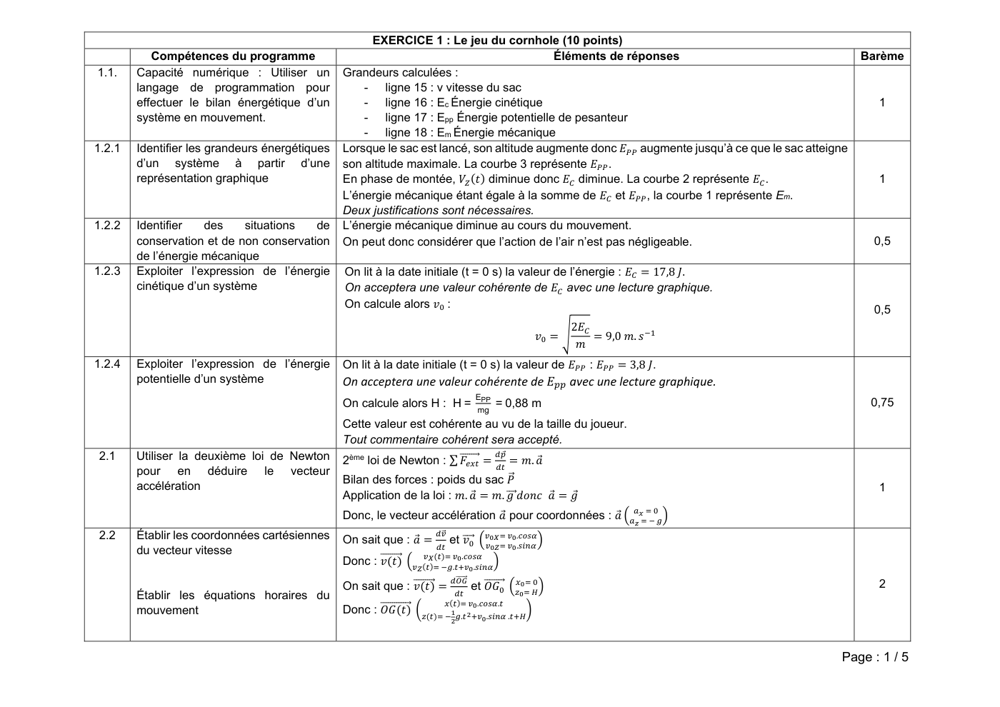
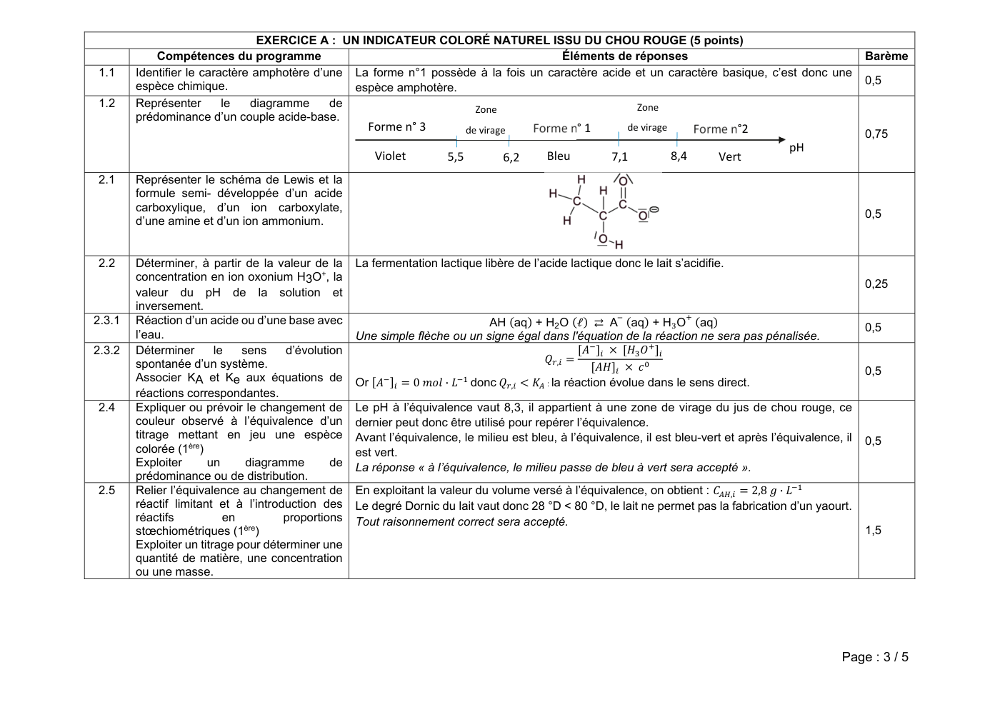
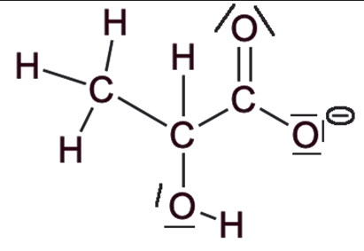
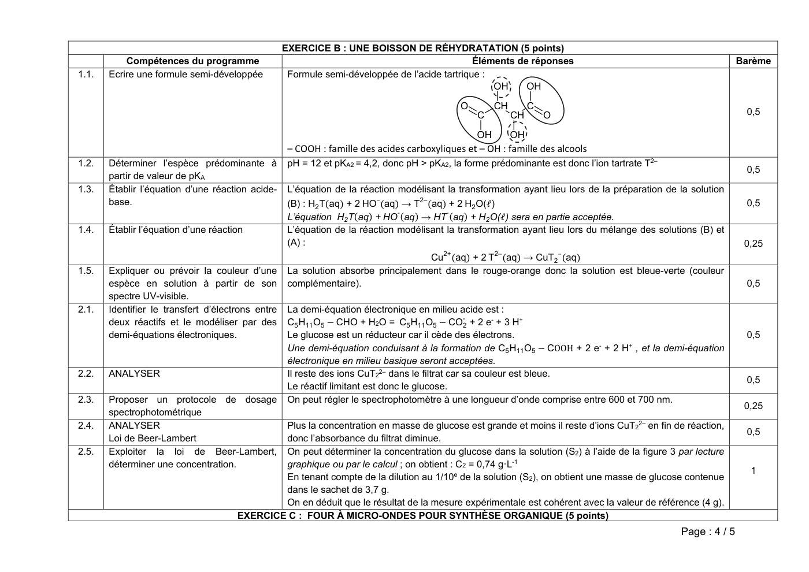

# spe-physique-chimie-2021-metropole-1-corrige-officiel

> Source : `../../../pdf_version/10_pc/2021/spe-physique-chimie-2021-metropole-1-corrige-officiel.pdf` — conversion Markdown (texte + visuels).
> Stratégie : [STRATEGIE_MARKDOWN.md](../../../STRATEGIE_MARKDOWN.md)

---

## Page 1

EXERCICE 1 : Le jeu du cornhole (10 points)
           Compétences du programme                                                       Éléments de réponses                                          Barème
1.1.    Capacité numérique : Utiliser un        Grandeurs calculées :
        langage de programmation pour               - ligne 15 : v vitesse du sac
        effectuer le bilan énergétique d’un         - ligne 16 : Ec Énergie cinétique                                                                      1
        système en mouvement.                       - ligne 17 : Epp Énergie potentielle de pesanteur
                                                    - ligne 18 : Em Énergie mécanique
1.2.1   Identifier les grandeurs énergétiques   Lorsque le sac est lancé, son altitude augmente donc      augmente jusqu’à ce que le sac atteigne
        d’un système à partir d’une             son altitude maximale. La courbe 3 représente       .
        représentation graphique                En phase de montée,         diminue donc      diminue. La courbe 2 représente .                            1
                                                L’énergie mécanique étant égale à la somme de         et   , la courbe 1 représente Em.
                                                Deux justifications sont nécessaires.
1.2.2   Identifier   des     situations  de     L’énergie mécanique diminue au cours du mouvement.
        conservation et de non conservation     On peut donc considérer que l’action de l’air n’est pas négligeable.                                      0,5
        de l’énergie mécanique
1.2.3   Exploiter l’expression de l’énergie     On lit à la date initiale (t = 0 s) la valeur de l’énergie :  = 17,8 .
        cinétique d’un système                  On acceptera une valeur cohérente de            avec une lecture graphique.
                                                On calcule alors :
                                                                                                                                                          0,5
                                                                                                                       2
                                                                                                                   =           = 9,0   .

1.2.4   Exploiter l’expression de l’énergie     On lit à la date initiale (t = 0 s) la valeur de                           :       = 3,8 .
        potentielle d’un système                On acceptera une valeur cohérente de                                   avec une lecture graphique.
                                                                                           EPP
                                                On calcule alors H : H =                           = 0,88 m                                               0,75
                                                                                           mg
                                                Cette valeur est cohérente au vu de la taille du joueur.
                                                Tout commentaire cohérent sera accepté.
2.1     Utiliser la deuxième loi de Newton      2ème loi de Newton : ∑                         =       =       .
        pour en déduire le vecteur
                                                Bilan des forces : poids du sac
        accélération                                                                                                                                       1
                                                Application de la loi : . = .                                      =
                                                Donc, le vecteur accélération                          pour coordonnées :
2.2     Établir les coordonnées cartésiennes    On sait que :    =           et                            .
                                                                                                           .
        du vecteur vitesse                                             ( )         .
                                                Donc : ( )       ( )         .         .

                                                On sait que : ( ) =                    et                                                                  2
        Établir les équations horaires du
                                                                             ( )           .       .
        mouvement                               Donc :     ( )    ( )              .           .       .

                                                                                                                                                     Page : 1 / 5

---

## Page 2

2.3   Établir l’équation de la trajectoire        À partir de l’équation      ( )=     .      . on exprime t en fonction de x : =
                                                                                                                                    .
                                                  On remplace t par son expression en fonction de x dans l’équation :
                                                    ( )= −       .   +    .     . +
                                                  On obtient l’équation de la trajectoire :                                                            0,75
                                                                                                 1
                                                                                       ( )= −               +        +
                                                                                                 2
                                                  La trajectoire est une parabole.
2.4   Discuter de l’influence des grandeurs       Les paramètres de lancement qui jouent un rôle dans le mouvement du sac sont v0, α et H.
                                                                                                                                                       0,5
      physiques sur l’allure de la trajectoire
2.5   Exploiter     l’expression     de     la    On cherche l’abscisse xP positive à laquelle la sac tombe en résolvant
      trajectoire                                 − 0,0842 x2 + 0,625 x + 0,880 = 0
                                                                                                                                                        1
                                                  On obtient :    = 8,6 m.
                                                  Le sac atteint donc la planche mais pas le trou car 8,0 m < xP < 8,91 m, le joueur marque 1 point.
2.6   Exploiter     l’expression     de      la   Déterminons la nouvelle valeur de la vitesse initiale    afin que le sac tombe directement dans
      trajectoire                                 le trou.
                                                  Le centre du trou est à l’abscisse   = 8,0 + 0,91 + 0,08 = 9,0
                                                  Il faut   =9       et    =0        donc −           +         +    = 0 =0    =
                                                                                                                                        .   .
                                                                                                                                                        1
                                                  tan = 0,625 donc = 32°
                                                  Application numérique :     = 9,2 .     = 33,1     .ℎ
                                                  Cette vitesse est importante, elle demande de la force mais aussi un contrôle de cette force.
                                                  Toute méthode correcte permettant de trouver      et tout commentaire cohérent seront acceptés.

                                                                                                                                                  Page : 2 / 5

---

## Page 3

EXERCICE A : UN INDICATEUR COLORÉ NATUREL ISSU DU CHOU ROUGE (5 points)
            Compétences du programme                                                Éléments de réponses                                                    Barème
1.1     Identifier le caractère amphotère d’une La forme n°1 possède à la fois un caractère acide et un caractère basique, c’est donc une
                                                                                                                                                            0,5
        espèce chimique.                        espèce amphotère.
1.2     Représenter       le   diagramme     de                                                   Zone
                                                                    Zone
        prédominance d’un couple acide-base.
                                                      Forme n° 3            de virage       Forme n° 1        de virage         Forme n°2                   0,75
                                                                                                                                            pH
                                                         Violet       5,5           6,2       Bleu         7,1            8,4       Vert
2.1     Représenter le schéma de Lewis et la
        formule semi- développée d’un acide
        carboxylique, d’un ion carboxylate,
                                                                                                                                                            0,5
        d’une amine et d’un ion ammonium.

2.2     Déterminer, à partir de la valeur de la     La fermentation lactique libère de l’acide lactique donc le lait s’acidifie.
        concentration en ion oxonium H3O+, la
                                                                                                                                                            0,25
        valeur du pH de la solution et
        inversement.
2.3.1   Réaction d’un acide ou d’une base avec                               AH (aq) + H2 O (ℓ)     A– (aq) + H O (aq)                                      0,5
        l’eau.                                      Une simple flèche ou un signe égal dans l'équation de la réaction ne sera pas pénalisée.
2.3.2   Déterminer       le   sens    d’évolution
        spontanée d’un système.                                                                 ,   =
                                                                                                                                                            0,5
        Associer KA et Ke aux équations de          Or        =0      ·      donc             : la réaction évolue dans le sens direct.
                                                                                        ,
        réactions correspondantes.
2.4     Expliquer ou prévoir le changement de       Le pH à l’équivalence vaut 8,3, il appartient à une zone de virage du jus de chou rouge, ce
        couleur observé à l’équivalence d’un        dernier peut donc être utilisé pour repérer l’équivalence.
        titrage mettant en jeu une espèce           Avant l’équivalence, le milieu est bleu, à l’équivalence, il est bleu-vert et après l’équivalence, il   0,5
        colorée (1ère)                              est vert.
        Exploiter      un      diagramme       de   La réponse « à l’équivalence, le milieu passe de bleu à vert sera accepté ».
        prédominance ou de distribution.
2.5     Relier l’équivalence au changement de       En exploitant la valeur du volume versé à l’équivalence, on obtient :    , = 2,8    ·
        réactif limitant et à l’introduction des    Le degré Dornic du lait vaut donc 28 °D < 80 °D, le lait ne permet pas la fabrication d’un yaourt.
        réactifs           en         proportions   Tout raisonnement correct sera accepté.
        stœchiométriques (1ère)                                                                                                                             1,5
        Exploiter un titrage pour déterminer une
        quantité de matière, une concentration
        ou une masse.

                                                                                                                                                      Page : 3 / 5

---

## Page 4

EXERCICE B : UNE BOISSON DE RÉHYDRATATION (5 points)
           Compétences du programme                                                            Éléments de réponses                                            Barème
1.1.   Ecrire une formule semi-développée           Formule semi-développée de l’acide tartrique :
                                                                                                   OH     OH
                                                                                             O        CH        C
                                                                                                 C         CH       O                                           0,5

                                                                                                 OH        OH
                                                    – COOH : famille des acides carboxyliques et – OH : famille des alcools
1.2.   Déterminer l’espèce prédominante à           pH = 12 et pKA2 = 4,2, donc pH > pKA2, la forme prédominante est donc l’ion tartrate T2–
                                                                                                                                                                0,5
       partir de valeur de pKA
1.3.   Établir l’équation d’une réaction acide-     L’équation de la réaction modélisant la transformation ayant lieu lors de la préparation de la solution
                                                                         –
       base.                                        (B) : H2 T(aq) + 2 HO (aq) → T2– (aq) + 2 H2 O(ℓ)                                                           0,5
                                                                              -
                                                    L’équation H2 T(aq) + HO (aq) → HT- (aq) + H2 O(ℓ) sera en partie acceptée.
1.4.   Établir l’équation d’une réaction            L’équation de la réaction modélisant la transformation ayant lieu lors du mélange des solutions (B) et
                                                    (A) :                                                                                                       0,25
                                                                                      2+                       –
                                                                                    Cu (aq) + 2 T2– (aq) → CuT2 (aq)
1.5.   Expliquer ou prévoir la couleur d’une        La solution absorbe principalement dans le rouge-orange donc la solution est bleue-verte (couleur
       espèce en solution à partir de son           complémentaire).                                                                                            0,5
       spectre UV-visible.
2.1.   Identifier le transfert d’électrons entre    La demi-équation électronique en milieu acide est :
                                                                                                 -
       deux réactifs et le modéliser par des        C5 H11 O5 − CHO + H2O = C5 H11 O5 − CO2 + 2 e- + 3 H+
       demi-équations électroniques.                Le glucose est un réducteur car il cède des électrons.                                                      0,5
                                                    Une demi-équation conduisant à la formation de C5 H11 O5 − COOH + 2 e- + 2 H+ , et la demi-équation
                                                    électronique en milieu basique seront acceptées.
2.2.   ANALYSER                                     Il reste des ions CuT22– dans le filtrat car sa couleur est bleue.
                                                                                                                                                                0,5
                                                    Le réactif limitant est donc le glucose.
2.3.   Proposer un protocole de dosage              On peut régler le spectrophotomètre à une longueur d’onde comprise entre 600 et 700 nm.
                                                                                                                                                                0,25
       spectrophotométrique
2.4.   ANALYSER                               Plus la concentration en masse de glucose est grande et moins il reste d’ions CuT22– en fin de réaction,
                                                                                                                                                                0,5
       Loi de Beer-Lambert                    donc l’absorbance du filtrat diminue.
2.5.   Exploiter la loi de Beer-Lambert,      On peut déterminer la concentration du glucose dans la solution (S2) à l’aide de la figure 3 par lecture
       déterminer une concentration.          graphique ou par le calcul ; on obtient : C2 = 0,74 g·L-1
                                                                                                                                                                 1
                                              En tenant compte de la dilution au 1/10e de la solution (S2), on obtient une masse de glucose contenue
                                              dans le sachet de 3,7 g.
                                              On en déduit que le résultat de la mesure expérimentale est cohérent avec la valeur de référence (4 g).
                                      EXERCICE C : FOUR À MICRO-ONDES POUR SYNTHÈSE ORGANIQUE (5 points)
                                                                                                                                                Page : 4 / 5

---

## Page 5

Compétences du programme                                                                             Éléments de réponses                              Barème
1.1.   Associer un groupe caractéristique à une
                                                                                                  Famille des cétones   O
       famille de composés
                                                                                                                                                                     0,75
                                                                                                                            OH Famille des alcools

1.2.   Élaborer un protocole de préparation d’une      La masse d’hydroxyde de sodium à peser est de 6,2 g.
       solution ionique de concentration donnée        Tout raisonnement cohérent amenant à ce résultat sera accepté.                                                0,5
       en ions.
1.3.   Choix de la technique de purification           A l’issue de la cristallisation, le produit est sous forme solide.                                            0,25
1.4.   Identification des réactifs, des produits       Le produit obtenu avant recristallisation est impur, il est donc constitué d’au moins deux espèces
                                                       chimiques.                                                                                                    0,5
                                                       La plaque CCM avant recristallisation est donc la plaque 2.
1.5.   Identification des réactifs, des produits       Spectroscopie IR ou mesure de la température de fusion.                                                       0,5
2.1.   Écrire une formule brute.                       Formule brute de la benzoïne : C14H12O2                                                                       0,5
2.2.   Utiliser         les          demi-équations    La demi-équation d’oxydoréduction du couple benzile (C14O2H10) / benzoïne (C14O2H12) :
       d’oxydoréduction.                               C14O2H12 = C14O2H10 + 2H+(aq) + 2 e–                                                                          0,5
                                                       Cela correspond a une perte d’électron pour la benzoïne et donc à son oxydation.
 3.    Maîtriser l’usage des chiffres significatifs.   Calcul des quantités initiales des réactifs :
       Réaction chimique : réactif limitant,                     murée                    0,450
                                                       nurée =             soit nurée =   = 7,49×10-3 mol
                                                                 M(urée)            60,1
       stœchiométrie, notion d’avancement ;                        mbenz               1,00
       Identifier le réactif limitant (1ère S).        nbenz =            soit nbenz =      = 4,76×10-3 mol
                                                               M(benzile)              210
       Extraire et exploiter une information des                                                                                                                     1,5
                                                       Le réactif limitant est donc le benzile.
       résultats expérimentaux (calcul d’un            D’après l’équation de réaction, une mole de benzile donne une mole de phénytoïne donc
       rendement d’une synthèse organique)             nphé,max = 4,76×10-3 mol.
                                                       Tout raisonnement cohérent amenant à ce résultat sera accepté.

                                                                                                                                                     Page : 5 / 5
