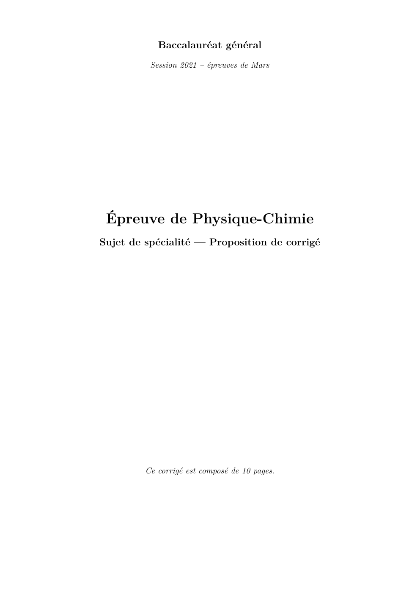

# spe-physique-chimie-2021-metropole-1-corrige

> Source : `../../../pdf_version/10_pc/2021/spe-physique-chimie-2021-metropole-1-corrige.pdf` — conversion Markdown (texte + visuels utiles).
> Stratégie : [STRATEGIE_MARKDOWN.md](../../../STRATEGIE_MARKDOWN.md)

---

## Page 1

Baccalauréat général
          Session 2021 – épreuves de Mars

 Épreuve de Physique-Chimie
Sujet de spécialité — Proposition de corrigé

         Ce corrigé est composé de 10 pages.

---

## Page 2

Baccalauréat général        Épreuve de Physique-Chimie (spécialité)            Mars 2021 – Corrigé

Exercice 1 —           Le jeu du cornhole

   1. Étude énergétique
                                                                    √
    1.1. À la ligne 15, on calcule la norme v de la vitesse (v = vx 2 + vz 2 ). Ensuite, on calcule
          l’énergie cinétique à la ligne 16, puis l’énergie potentielle de pesanteur à la ligne 17.
          Finalement, l’énergie mécanique est calculée à la ligne 18.
    1.2. Exploitation de la figure 3.
      1.2.1. Lors de la chute libre du sac, sa vitesse va commencer par diminuer lors de
              la montée, donc son énergie cinétique diminuera également, ce qui permet de
              l’associer à la série 2 . Au contraire, son altitude va commencer par augmenter,
              donc son énergie potentielle de pesanteur aussi : on lui attribue la série 3 .
              Finalement, la série 1 est bien la somme des deux séries, et correspond donc à
              l’énergie mécanique.
      1.2.2. Si l’action de l’air sur le sac était négligeable, l’énergie mécanique se conserverait
              (cas de la chute libre sans frottements). Or, on remarque sur la figure 3 que la
              série 1 n’est pas constante : l’énergie mécanique diminue au cours du temps. Le
              seul phénomène capable de dissiper l’énergie mécanique est, dans notre situation,
              l’action de l’air, qui n’est donc pas négligeable.
      1.2.3. On cherche la valeur de la norme v0 de la vitesse à l’instant initial. Pour cela, on
              lit sur le code Python qu’à l’instant t = 0, on a vx = 7, 61 m·s−1 et vz = 4, 8 m·s−1 .
              D’où,                           q
                                         v0 = 7, 612 + 4, 82 = 9, 0 m · s−1
             NB : une autre méthode serait de lire graphiquement la valeur de l’énergie ci-
             nétique à l’instant initial. En connaissant la masse m du sac, on remonte à la
             vitesse v0 . En l’occurrence, on trouve v0 = 8, 9 m · s−1 .
      1.2.4. On cherche l’altitude H à l’instant initial. Or, on a, à l’instant t = 0 s :
                                                                    Ep,0
                                         Ep,0 = mgH =⇒ H =
                                                                    mg
                                                     3,5
             D’où, par lecture graphique, H = 0,440×9,81   = 0, 81 m.
             Or, on lit dans les données entrées sur le programme python que H = 0, 869 m :
             la valeur trouvée est légèrement sous-évaluée, mais reste cohérente.
   2. Étude du mouvement du sac après le lancer
    2.1. On souhaite établir l’expression des coordonnées ax et az de l’accélération du centre
         du sac.
         On va alors, pour le centre de masse du sac, supposé ponctuel de masse m constante,
         appliquer la loi de quantité de mouvement dans le référentiel terrestre sup-
         posé galiléen.
         Pour cela, on remarquera que si on néglige les frottements de l’air, la seule force qui
         s’applique sur le système est son poids de valeur m~g = −mg →   −
                                                                         uz (→−
                                                                              uz est le vecteur
         unitaire dirigé à la verticale du sol et orienté vers le haut).
         D’où, le principe fondamental de la dynamique nous donne :
                                   m~a = m~g = −mg →  −
                                                      u =⇒ ~a = −g →
                                                        z
                                                                      −
                                                                      u    z

          D’où, en projetant sur →
                                 −
                                 ux et →
                                       −
                                       uz , on obtient :
                                                
                                                     x = 0
                                                a
                                                                                                 (1)
                                                 az = −g

                                                                                      Page 2 sur 10

---

## Page 3

Baccalauréat général        Épreuve de Physique-Chimie (spécialité)             Mars 2021 – Corrigé

    2.2. On va maintenant chercher à obtenir l’expression de x(t) et z(t). On commence alors
         par intégrer les coordonnées de l’accélération par rapport au temps, en se rappelant
         que la vitesse initiale ~v a pour coordonnées vx (0) = v0 cos(α) et vz (0) = v0 sin(α).
         L’intégration de (1) donne alors :
                                 
                                  v (t) = cste = v cos(α)
                                     x                0
                                  vz (t) = −gt + cste = −gt + v0 sin(α)
                                                                                                   (2)

         Et en intégrant de nouveau, on obtient :
                                     
                                      x(t) = v cos(α)t + x
                                                0             0
                                      z(t) = − 1 gt2 + v0 sin(α)t + z0
                                                 2

         Or, on a x0 = 0 et z0 = H. Donc finalement, les résultats précédents deviennent :
                                     
                                      x(t) = v cos(α)t
                                               0
                                                                                                   (3)
                                      z(t) = − 1 gt2 + v0 sin(α)t + H
                                                2

    2.3. On souhaite obtenir l’équation de la trajectoire, à savoir l’expression de l’altitude z
         en fonction de la distance x.
         On va alors, dans (3), isoler l’expression x(t) et on va exprimer t en fonction de x.
         On a :
                                                                  x
                                 x(t) = v0 cos(α)t =⇒ t =
                                                              v0 cos(α)
         Et on va alors injecter ce résultat dans l’expression de z(t) obtenue précédemment :
                                                     !2                        !
                                  1          x                       x
                          z(x) = − g                 + v0 sin(α)           +H
                                  2      v0 cos(α)               v0 cos(α)
                                  1      gx2
                               =−                 + x tan(α) + H
                                  2 v0 2 cos2 (α)

         Et on a donc bien :
                                          1     x2
                                  z(x) = − g 2          + x tan(α) + H
                                          2 v0 cos2 (α)

         Cette équation étant un polynôme du second degré en x de coefficient dominant
         négatif, la trajectoire sera parabolique et concave (la parabole a ses « bras » tournés
         « vers le bas »), ce qui est physiquement cohérent.
    2.4. On peut alors remarquer, en observant l’équation que l’on vient d’obtenir, que les
         conditions initiale jouant un rôle sur la trajectoire sont la vitesse initiale v0 et l’angle α
         avec lequel on lance le sac. Sans oublier, bien sûr, l’altitude initiale H qui a également
         son importance.
    2.5. On a l’équation de la trajectoire :
                                    z(x) = −0, 0842x2 + 0, 625x + 0, 880

         Et on cherche le nombre de points marqués, donc la distance parcourue par le sac
         au moment où il touche le sol. Autrement dit, on cherche la distance x positive telle
         que z(x) = 0.

                                                                                       Page 3 sur 10

---

## Page 4

Baccalauréat général      Épreuve de Physique-Chimie (spécialité)              Mars 2021 – Corrigé

         Par résolution graphique à la machine (NB : la précision de la résolution graphique
         permise par la calculatrice est suffisante en terme de chiffres significatifs vu qu’on est
         en physique. Sinon, on peut toujours poser proprement son équation du second degré
         et la résoudre à la main comme appris en première.), on trouve alors x = 8, 633 m.
         Or, le joueur étant à une distance d de 8 mètres de la planche, le sac atterrira donc
         à une distance d0 = x − d = 63, 3 cm du bord de la planche. Il ne passera donc pas
         dans le trou, le joueur marquera 1 point.
    2.6. On souhaite finalement déterminer la vitesse v0 qu’il faut donner au sac lorsqu’on le
         lance pour marquer 3 points. On va raisonner par étapes :
         — Tout d’abord, on remarque que pour rentrer dans le trou, le sac doit idéalement
            parcourir une distance d0 = 91 + 8 = 99 cm sur la planche, soit une distance totale
            d = 8, 99 m depuis la position du joueur.
         — Ensuite, on remarque que la valeur de l’angle α, donc nous auront besoin, n’est
            pas donnée. Or, on sait que tan(α) = 0, 625. D’où, α = tan−1 (0, 625) = 32, 0◦ .
         — Maintenant que nous avons les données numériques, on peut désormais entrer
            dans le vif du sujet. Aussi, nous allons chercher v0 tel que :

                                          gx2      1
                                   −             ·    + 0, 625x + 0, 880 = 0                   (E)
                                       2 cos2 (α) v02

             On peut alors résoudre cette équation :
                                                     1
                               (E) ⇐⇒ −551, 21 ·         + 5, 62 + 0, 880 = 0
                                                     v02
                                                     1
                                   ⇐⇒ −551, 21 · 2 + 6, 5 = 0
                                                     v0
                                                   1                  1
                                   ⇐⇒ 551, 21 · 2 = 6, 5 ⇐⇒ 2 = 0, 012
                                                  v0                 v0
                                                 1
                                   ⇐⇒ v02 =            = 83, 33
                                              0, 012
                                               √
             Donc finalement, on obtient v0 = 83, 33 = 9, 1 m · s−1 la vitesse à donner au sac
             pour gagner trois points. Ce qui est une valeur cohérente au vu de la situation
             étudiée (proche de la valeur calculée dans la partie 1).

                                                                                     Page 4 sur 10

---

## Page 5

Baccalauréat général       Épreuve de Physique-Chimie (spécialité)          Mars 2021 – Corrigé

Exercice A —           Un indicateur coloré naturel issu du chou rouge

   1. Modélisation d’un indicateur coloré naturel issu du chou rouge
    1.1. La forme 1 possède des groupes hydroxyle, alors est susceptible de céder des protons
         H+ . C’est donc un acide de Brönsted. Mais cette même espèce est susceptible de
         capter un proton par son oxygène chargé négativement : c’est donc une base de
         Brönsted.
         Ainsi, vu que la forme 1 est à la fois un acide et une base de Brönsted, il s’agit bien
         d’un ampholyte (ou espèce amphotère).
    1.2. On cherche à compléter le diagramme de prédominance de la cyanidine. Pour cela,
         on va chercher quelle forme est la plus basique, et laquelle est la plus acide.
         Pour cela, on regarde le nombre de protons que chaque forme est susceptible de
         céder : la forme 1 peut céder 3 protons, alors que la forme 2 ne peut en céder que 2,
         tandis que la forme 3 possède 4 protons qu’elle peut éventuellement céder. Aussi, la
         forme la plus acide est la forme 3, et la plus basique est la forme 2. On peut donc
         finalement compléter le diagramme de prédominance :
                                zone                              zone
              Forme n 3o      de virage                o
                                               Forme n 1        de virage      Forme no 2
                                                                                            pH
                           5, 5       6, 2                   7, 1       8, 4

         On peut alors remarquer qu’en milieu aqueux, la forme 3 est de couleur violette, la
         forme 1 de couleur bleue, et la forme 2 de couleur verte.
   2. Titrage d’un lait fermenté
    2.1. On donne la formule de Lewis de l’ion lactate, qui est l’acide lactique auquel on a
         retiré le proton du groupe acide carboxylique :
                                                               O

                                           H    O              O−

    2.2. Lors de la fermentation du lait, le lactose est transformé en acide lactique. Ce qui
         explique l’acidification du lait.
    2.3. Modélisation de la transformation chimique.
      2.3.1. On note AH l’acide lactique, et A− l’ion lactate. Alors la réaction entre l’acide
             lactique et l’eau du lait a pour équation :

                                          AH + H2 O −−→ A− + H3 O+

      2.3.2. Cette réaction a pour constante d’équilibre K = K1A = 103,9  1. Elle est donc
             thermodynamiquement favorisée et sera alors spontanée.
    2.4. Pour le titrage réalisé, lee pH à l’équivalence vaut 8,3. Or, cette valeur de pH corres-
         pond à la fin de la zone de virage entre la forme 1 et la forme 2 de la cyanidine. Le
         jus du chou rouge peut donc être utilisé pour repérer l’équivalence de ce titrage, en
         passant de bleu à vert.

                                                                                    Page 5 sur 10

---

## Page 6

Baccalauréat général      Épreuve de Physique-Chimie (spécialité)               Mars 2021 – Corrigé

    2.5. On cherche à calculer l’acidité Dornic du lait fermenté testé. Pour cela, on va com-
         mencer par calculer la concentration molaire en acide lactique dans l’échantillon titré.
         La réaction support du titrage est la suivante :

                                         AH + HO− −−→ A− + H2 O

         On a alors, à l’équivalence :
                                      nAH  n −
                                          = HO =⇒ cV0 = C0 VE
                                       1     1
         Et finalement,
                                                      C0 V E
                                                 c=
                                                       V0
         Or, en masse, on a cm = cMAH .
         Donc en injectant dans l’expression de la concentration, on obtient :

                                                    C0 V E
                                             cm =          MAH
                                                     V0

         D’où,
                                      1, 11.10−1 × 2, 8
                               cm =                     × 90, 1= 2, 8 g · L−1
                                            10, 0
         Or, 1 ◦ D correspond à 0, 10 g · L−1 , et 2, 8/0, 10 = 28. Donc le degré d’acidité Dornic
         de l’échantillon testé vaut DA = 28 ◦ D < 80 ◦ D. Le lait testé ne peut donc pas être
         utilisé pour fabriquer un yaourt.

                                                                                      Page 6 sur 10

---

## Page 7

Baccalauréat général       Épreuve de Physique-Chimie (spécialité)            Mars 2021 – Corrigé

Exercice B —           Une boisson de réhydratation

   1. Étude de la liqueur de Fehling
    1.1. On donne la formule semi-développée de l’acide tartrique, sur laquelle on repère les
         groupes fonctionnels :
                                             Alcool
                                                    OH        O
                                           HO       CH        C
                                                C        CH       OH
                                                O        OH

                                             Acide Carboxylique
    1.2. La solution (B) a un pH supérieur à 12. Or, on remarque que pH(B) > pKa2 . La
         forme prédominante dans cette solution est donc T2− .
    1.3. La solution (B) est obtenue en mélangeant de l’acide tartrique et de la soude. La
         réaction modélisant la transformation ayant alors lieu est la suivante :

                             H2 T(aq) + 2 HO−(aq) −−→ T2− (aq) + 2 H2 O(`)

    1.4. La solution (A) contient des ions cuivre (II), et la solution (B) contient des ions
         tartrate. Lors du mélange des deux, on observe donc la réaction :

                                        Cu2+ + 2 T2− −−→ CuT22−

    1.5. On remarque, en étudiant le spectre d’absorption de la liqueur de Fehling, qu’il pré-
         sente un maximum pour λ ∼ 670 nm. Sa couleur correspondra donc à la couleur
         complémentaire à ce maximum, c’est-à-dire du bleu-vert si on se fie au cercle chro-
         matique.
   2. Dosage du glucose
    2.1. On cherche à justifier le caractère réducteur du glucose dans cette réaction. Pour
         cela, on va écrire la demi-équation électronique entre le glucose et l’ion gluconate,
         qui est la suivante :
                                                               −     +     −
                                             −−
                       C5 H11 O5 −CHO + H2 O )−*
                                               − C5 H11 O5 −CO2 + 3 H + 2 e

         On remarque alors que le glucose va céder des électrons, il est donc réducteur.
    2.2. À l’issue de la réaction, le filtrat est bleu. Or, les espèces responsables de cette couleur
         sont uniquement les ions CuT22− . On peut donc se douter qu’ils n’ont pas tous été
         consommés, donc ont été introduits en excès. Aussi, le réactif limitant est le glucose.
    2.3. L’espèce colorée dans la solution est la liqueur de Fehling grâce aux ions CuT22− .
         Aussi, pour prendre des mesures, il est préférable de régler le spectrophotomètre à
         leur maximum d’absorption, à savoir λ = 670 nm.
    2.4. On remarque que l’absorbance du filtrat diminue lorsque la concentration massique
         de glucose augmente. Cela est une conséquence du fait que le glucose soit le réactif
         limitant : en effet, plus la quantité initiale de glucose sera importante, plus l’avance-
         ment de la réaction sera important, donc plus les ions colorés de la liqueur de Fehling
         seront consommés. Ce qui impliquera une diminution de l’absorbance.

                                                                                      Page 7 sur 10

---

## Page 8

Baccalauréat général     Épreuve de Physique-Chimie (spécialité)           Mars 2021 – Corrigé

    2.5. On cherche la masse de glucose contenue dans le sachet de médicament. On va donc,
         à partir des données expérimentales et de la droite d’étalonnage, commencer par
         déterminer la concentration massique en glucose de la solution (S2 ).
         On a mesuré, pour cette solution, une absorbance A = 0, 59. Or, on a A = −0, 39Cm,2 + 0, 88.
         D’où, on a la concentration massique :

                                     0, 88 − A   0, 88 − 0, 59
                            Cm,2 =             =               = 0, 74 g · L−1
                                        0, 39        0, 39

         Or, la solution (S2 ) est obtenue en diluant 10 fois la solution (S1 ). Alors, dans la
         solution initiale, on a Cm = 10Cm,2 = 7, 4 g · L−1 .
         Et finalement, comme m = Cm × V on obtient une masse de glucose dans le sachet
         de médicament qui vaut m = 7, 4 × 500 × 10−3 = 3, 7 g. Ce qui est proche de la masse
         indiquée dans les données du problème pour un sachet vendu en pharmacie.

                                                                                 Page 8 sur 10

---

## Page 9

Baccalauréat général       Épreuve de Physique-Chimie (spécialité)           Mars 2021 – Corrigé

Exercice C —           Four à micro-ondes pour synthèse organique

   1. Préparation de la benzoïne (étape 1)
    1.1. On recopie la formule topologique de la benzoïne et on y repère les groupes fonction-
         nels :
                                              Alcool

                                                 OH

                                                        O

    1.2. On souhaite préparer V = 7, 0 mL de solution de soude à C = 1, 1 mol·L−1 . Pour cela,
         il faudra une quantité de matière n = CV . Ou encore, comme m = n × M (KOH), il
         faudra, en masse,

                        m = CV × M (KOH) = 1, 1 × 0, 007 × 56, 1 = 0, 43197 g

         D’où, il faudra prélever une masse m = 0, 43 g de potasse pour préparer la solution
         de soude utilisée lors de la première étape.
    1.3. Le produit est obtenu dans l’étape c à l’issue d’une cristallisation. Il est donc à l’état
         solide.
    1.4. Avant la purification, le produit obtenu n’est (comme on peut s’en douter) pas entiè-
         rement pur. Ainsi, il comportera des restes de réactif (donc de benzaldéhyde). Ainsi,
         la plaque de CCM correspondant à ce produit non purifié est la plaque 2.
    1.5. Une autre méthode d’identification du produit obtenu en fin de synthèse serait par
         étude du point de fusion sur banc Köfler : une mesure de la température de fusion d’un
         solide permet de donner des information sur sa pureté, en comparant aux données
         pour le produit pur.
   2. Préparation du benzile (étape 2)
    2.1. La benzoïne a pour formule brute C14 H12 O2 .
    2.2. On écrit la demi-équation électronique associée au couple C14 H10 O2 /C14 H12 O2 :

                                 C14 H10 O2 + 2 H+ + 2 e− )
                                                          −−
                                                           −*
                                                            − C14 H12 O2

          On remarque alors que le benzile joue le rôle d’oxydant. Ainsi, la réaction de l’étape
          2 est bien une oxydation de la benzoïne.
   3. Préparation de la phénytoïne (étape 3)
      On souhaite calculer le rendement de la synthèse. On va alors commencer par dresser
      un tableau d’avancement entre l’état initial (E.I.) et l’état final (E.F.). Pour cela, on
      calcule :
                                         mb,i          1, 0
                             nb,i =                 =        = 4, 8 mmol
                                    M (C14 H10 O2 )   210, 2

                                                                                    Page 9 sur 10

---

## Page 10

Baccalauréat général      Épreuve de Physique-Chimie (spécialité)           Mars 2021 – Corrigé

      quantité de matière de benzile à l’état initial et
                                           mu,i       0, 450
                              nu,i =                =        = 7, 5 mmol
                                       M (CH4 N2 O)   60, 1

      quantité de matière d’urée à l’état initial. Ce qui permet de remarquer que le benzile est
      le réactif limitant (4, 8 < 7, 5 et coefficient de 1 devant chaque espèce). Aussi, on a un
      avancement ξm = 4, 8 mmol.
      On construit alors le tableau :
            mmol      benzile    +          urée          −−→ phénytoïne +          H2 O
             E.I. nb,i = 4, 8            nu,i = 7, 5                  0              0
             E.F.        0            nu,i − ξm = 2, 6            ξm = 4, 8       ξm = 4, 8
      On devrait donc obtenir, théoriquement, nth = 4, 8 mmol de phénytoïne.
                                                  1,11
      Or, expérimentalement, on a obtenu nexp = 252,3  = 4, 4 mmol de phénytoïne.
      Cette synthèse a donc un rendement qui vaut :
                                              nexp   4, 4
                                         η=        =      = 92 %
                                              nth    4, 8

      Ce qui est un rendement très correct pour une synthèse organique.

                                               * *
                                                *

                                   Proposé par T. Prévost (thomas.prevost@protonmail.com),
                                                     pour le site https://www.sujetdebac.fr/
                                                                           Compilé le 1er mars 2021.

                                                                                   Page 10 sur 10
