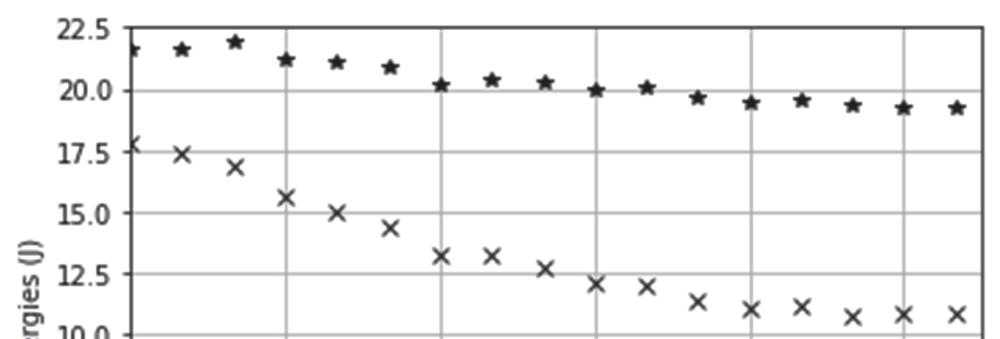
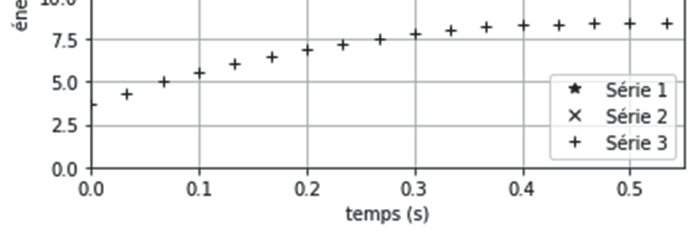
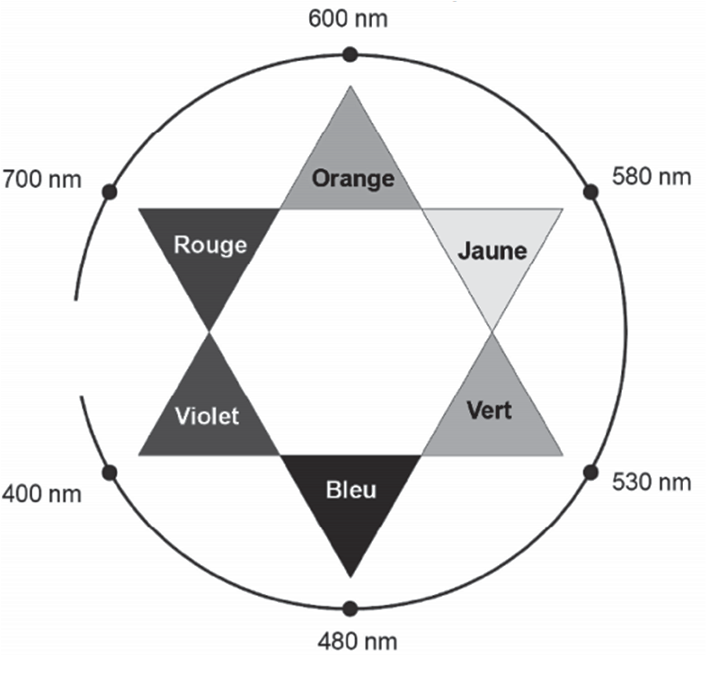
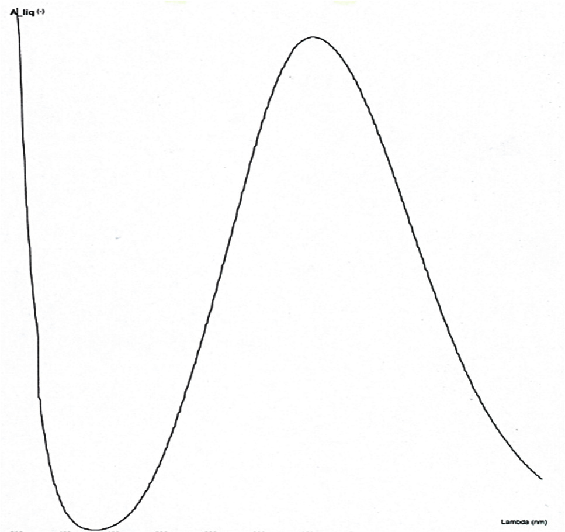
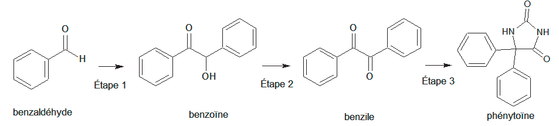
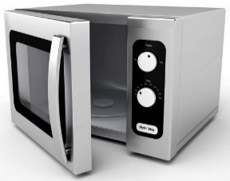
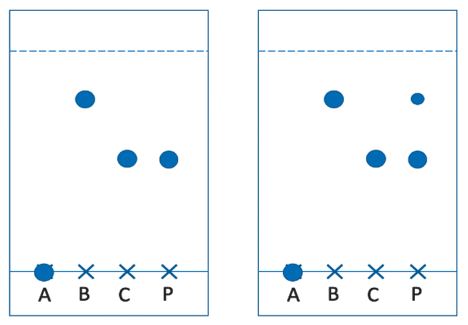

# spe-physique-chimie-2021-metropole-1-sujet-officiel

> Source : `../../../pdf_version/10_pc/2021/spe-physique-chimie-2021-metropole-1-sujet-officiel.pdf` — conversion Markdown (texte + visuels utiles).
> Stratégie : [STRATEGIE_MARKDOWN.md](../../../STRATEGIE_MARKDOWN.md)

---

## Page 1

BACCALAURÉAT GÉNÉRAL
                   ÉPREUVE D’ENSEIGNEMENT DE SPÉCIALITÉ

                                   SESSION 2021

                           PHYSIQUE-CHIMIE

                           Durée de l’épreuve : 3 heures 30

            L’usage de la calculatrice avec mode examen actif est autorisé.
         L’usage de la calculatrice sans mémoire, « type collège » est autorisé.

            Dès que ce sujet vous est remis, assurez-vous qu’il est complet.
              Ce sujet comporte 13 pages numérotées de 1/13 à 13/13.

Le candidat traite 3 exercices : l’exercice 1 puis il choisit 2 exercices parmi les
3 proposés.

                                                                               Page 1 / 13

---

## Page 2

EXERCICE 1 commun à tous les candidats (10 points)

                                         LE JEU DU CORNHOLE

Le Cornhole, contraction des mots anglais « corn » et « hole »
voulant dire « maïs » et « trou », est un jeu de plein air pratiqué
entre autres aux États-Unis et au Canada.

Les règles de ce jeu sont assez simples. Chaque joueur est muni
de quatre petits sacs contenant du maïs qu’il doit lancer en direction
d’une planche inclinée par rapport à l’horizontale munie d’un trou
circulaire et située environ à 8 mètres du joueur. À chaque fois
qu’un sac retombe sur la planche, le joueur marque un point ; si le
sac passe par le trou circulaire, le joueur marque trois points. Le
premier joueur qui marque 21 points gagne la partie.

On étudie dans cet exercice les aspects énergétiques du lancer du
sac puis le mouvement du centre de masse du sac dans le
référentiel terrestre supposé galiléen.
                                                                         Extrait du site Internet www.quora.com
Données :

       intensité de la pesanteur terrestre : g = 9,81 m·s−2 ;
       masse du sac : m = 440 g.

Un joueur se place à une distance d de la planche afin de réaliser un lancer de son sac de maïs. La situation
est représentée sur la figure 1 ci-dessous. Afin de simplifier l’étude, la planche est considérée quasi-
horizontale. Dans le repère d’espace (Ox, Oz) muni des vecteurs unitaires i et k, le sac de maïs est lancé,
depuis une hauteur initiale H, avec une vitesse initiale dont le vecteur v0 est incliné d’un angle α par rapport à
l’horizontale. On s’intéresse au mouvement du centre de masse G du sac. L’axe (Oz) du repère d’espace est
vertical.

                           z

                                                                                                  g

                                    v0

                                    α

                       H                                             planche        trou circulaire
                               k
                                                                                                        x
                           O   i
                                                     d

                           Figure 1. Schéma représentant la situation du lancer du sac

                                                                                                      Page 2 / 13

---

## Page 3

1. Étude énergétique

Le mouvement complet du sac est filmé puis étudié à l’aide d’un logiciel de pointage. Les données de la partie
ascendante du mouvement sont traitées à l’aide d’un programme écrit en langage python (extrait en figure 2)
qui permet de représenter l’évolution au cours du temps des énergies cinétique (Ec), potentielle de pesanteur
(Epp) et mécanique (Em) du sac (figure 3).

  1   #importation des bibliothèques utilisées
  2   import numpy as np
  3   import matplotlib.pyplot as plt
  4
  5   # valeurs experimentales
  6   z=np.array([0.869,0.996,1.17,1.3,1.41,1.51,1.6,1.67,1.75,1.82,1.86,1.92,1.94,1.94,1.97,1.96,1.96])
  7   t=np.array([0,0.033,0.067,0.1,0.133,0.167,0.2,0.233,0.267,0.3,0.333,0.367,0.4,0.433,0.467,0.5,0.533])
  8   vx=np.array([7.61,7.66,7.712,7.517,7.595,7.578,7.334,7.39,7.329,7.184,7.239,7.116,7.065,7.119,6.997,7.006,6.997])
  9   vz=np.array([4.8,4.484,4.158,3.797,3.219,2.787,2.515,2.314,2.008,1.827,1.447,0.9539,0.7198,0.3329,0.1782,
 10   -0.02958,-0.4165])
 11
 12   #Calcul des énergies
 13   m=0.440
 14   g=9.81
 15   ? = (vx**2 + vz**2)**(1/2)
 16   ? = 0.5*m*v**2
 17   ? = m*g*z
 18   ? = 0.5*m*v**2 + m*g*z
 19

                             Figure 2. Extrait du programme écrit en langage python

          Figure 3. Évolution des énergies cinétique, potentielle de pesanteur et mécanique du sac
                 au cours du temps obtenue à l’aide du programme écrit en langage python

1.1 Identifier les grandeurs calculées dans l’extrait du programme écrit en langage python (figure 2) aux lignes
   15, 16, 17 et 18.

1.2 Exploitation de la figure 3
   1.2.1 En justifiant votre choix, attribuer à chaque série l’énergie qui lui correspond.

                                                                                                      Page 3 / 13

---

## Page 4

1.2.2 Expliquer en quoi les résultats expérimentaux permettent de considérer que l’action de l’air sur le sac
         n’est pas négligeable devant le poids du sac.
   1.2.3 Estimer la valeur de la vitesse initiale v0 du centre de masse du sac.
   1.2.4 Estimer la valeur de l’altitude initiale H du centre de masse du sac. Commenter.

2. Étude du mouvement du sac après le lancer
On souhaite étudier la chute du sac au cours du temps. La situation est toujours représentée sur la figure 1.
Les frottements ne seront pas pris en compte dans cette partie.
On souhaite établir les expressions littérales des grandeurs accélération, vitesse et position du sac lors de son
mouvement, ainsi que les caractéristiques (vitesse initiale et direction initiale) nécessaires à la réussite d’un
lancer valant trois points.
Les dimensions de la planche sont précisées sur la figure 4 ci-dessous :

                                                                            23 cm

                             61 cm              91 cm
                                                                             15 cm                       x
                                                                       16 cm
                                                                      Diamètre

                                                         122 cm

                                     Figure 4. Dimensions de la planche de Cornhole

2.1. Déterminer les expressions littérales des coordonnées ax et az du vecteur accélération a du centre de
     masse du sac suivant les axes Ox et Oz.

2.2. En déduire les expressions littérales des équations horaires x(t) et z(t) de la position du centre de masse
     du sac au cours du mouvement.

2.3. Montrer que l’équation littérale de la trajectoire du centre de masse du sac dans le repère d’espace
     (Ox, Oz) est :
                                             1      x2
                                      z x = – g· 2        + x·tan(α) + H.
                                             2 v0 ·cos2 α
    Qualifier cette trajectoire.

2.4. Indiquer les paramètres initiaux de lancement sur lesquels le joueur peut avoir une influence et qui jouent
     un rôle pour la réussite d’un lancer à trois points.
Le joueur effectue un premier lancer. L’équation de la trajectoire du centre de masse du sac a pour expression
numérique :
                               z(x) = − 0,0842 x2 + 0,625 x + 0,880      avec x et z en m

La distance d qui sépare l’origine O du repère d’espace et le bord de la planche est égale à d = 8,0 m.

                                                                                                   Page 4 / 13

---

## Page 5

2.5. Déterminer le nombre de point(s) marqué(s) par le joueur pour ce lancer.

2.6. Le joueur effectue un second lancer en conservant le même angle de tir α, la même hauteur initiale H mais
     en modifiant la valeur de la vitesse initiale par rapport au premier lancer.
    Déterminer une valeur possible de la nouvelle vitesse initiale v0 , afin que le sac tombe directement dans
    le trou. Commenter la valeur obtenue.
    Le candidat est invité à prendre des initiatives et à présenter la démarche suivie, même si elle n’a pas
    abouti. La démarche est évaluée et nécessite d’être correctement présentée.

                                                                                                 Page 5 / 13

---

## Page 6

EXERCICES au choix du candidat (5 points)
                       Vous indiquerez sur votre copie les 2 exercices choisis :
                                exercice A ou exercice B ou exercice C

         EXERCICE A - UN INDICATEUR COLORÉ NATUREL ISSU DU CHOU ROUGE
Mots-clés : réactions acide-base ; dosage par titrage
Les anthocyanes sont des espèces chimiques responsables de la couleur de nombreux végétaux comme le
chou rouge, l’hortensia ou encore l’aubergine. Une des propriétés remarquables des anthocyanes est que leur
couleur en solution dépend fortement du pH de la solution.
Dans cet exercice, on se propose de modéliser un indicateur coloré naturel contenant des anthocyanes pour
pouvoir l’utiliser lors du titrage d’un lait fermenté.

Données :
    numéros atomiques des éléments hydrogène, carbone et oxygène :

                                        Élément chimique                   H        C   O
                                        Numéro atomique                    1        6   8

       constante d’acidité à 20°C du couple acide lactique / ion lactate : KA = 10–3,9 ;
       masse molaire de l’acide lactique : MAH = 90,1 g⋅mol–1 ;
       l’acidité Dornic d’un lait, exprimée en degré Dornic de symbole °D, est reliée à la concentration en
        masse d’acide lactique dans ce lait en considérant qu’il est le seul acide présent : 1,0 °D correspond
        à une concentration en masse en acide lactique égale à 0,10 g·L–1.

1. Modélisation d’un indicateur coloré naturel issu du chou rouge
La couleur du chou rouge est principalement due à la présence d’une vingtaine d’anthocyanes différentes.
Pour comprendre l’influence du pH du milieu sur la couleur, on modélise ce mélange complexe d’espèces
chimiques par une seule espèce chimique, la cyanidine (figure 1), dont la structure est commune à toutes les
anthocyanes.
                                                                      OH
                                                                               OH

                                                         +
                                        HO           O

                                                                 OH
                                              OH

                                Figure 1. Formule topologique de la cyanidine

On limite la modélisation à des milieux où le pH est compris entre 4,5 et 9,0.
Dans cet intervalle, la cyanidine existe principalement sous trois formes :
                                                                                -                              OH
                           OH                                                  OH
                                O                                                       O                            O

    -                                    -
   HO           O                        HO                  O                              HO        O

                      OH                                               OH                                 OH
          OH                                    OH                                               OH
             Forme n°1                             Forme n°2                                      Forme n°3
Au laboratoire, on prépare une solution de jus de chou rouge en faisant macérer pendant dix minutes dans de
l’eau distillée chaude le quart d’un chou rouge coupé en morceaux. On filtre le mélange et on obtient une
solution aqueuse de couleur violet-bleu intense. On fait varier le pH de la solution et on note la couleur
correspondante :

                                                                                                              Page 6 / 13

---

## Page 7

Violet-    Violet-                        Bleu-       Bleu-
 Couleur      Violet    Violet                          Bleu      Bleu                            Vert          Vert
                                    bleu       bleu                          Vert        Vert
    pH         4,5       5,0           5,5     6,0      6,5       7,0        7,5         8,0      8,5           9,0

1.1. Justifier que la forme n°1 est une espèce amphotère.
1.2. Recopier puis compléter les pointillés du diagramme de prédominance ci-après pour cet indicateur coloré.
    Associer une couleur à chaque forme en solution aqueuse.

                                    Zone                             Zone
                Forme n° …        de virage        Forme n° …      de virage         Forme n° …
                                                                                                      pH
                                 5,5         6,2                 7,1         8,4

2. Titrage d’un lait fermenté

Pour préparer des fromages ou des yaourts, il est nécessaire de faire                             O
fermenter du lait frais. Des bactéries appelées ferments lactiques sont
utilisées pour transformer notamment le lactose du lait frais en acide               C
lactique (figure 2).
Lors de la fabrication des produits laitiers, pour déterminer l’avancement                                 OH
de la fermentation du lait, les techniciens réalisent un titrage acido-
basique de l’acide lactique formé afin de déterminer l’acidité Dornic.                     OH
L’acidité Dornic d’un lait doit être supérieure à 80 °D pour pouvoir
                                                                                Figure 2. Formule topologique
fabriquer un yaourt.
                                                                                      de l’acide lactique
2.1. Représenter le schéma de Lewis de l’ion lactate.
2.2. Justifier que la fermentation du lait contribue à acidifier celui-ci.
2.3. On veut modéliser la transformation chimique entre l’acide lactique et l’eau du lait. On notera AH l’acide
    lactique et A– l’ion lactate.
   2.3.1 Écrire l’équation de la réaction modélisant cette transformation chimique.
   2.3.2 Montrer que cette transformation chimique est spontanée. On admettra que la concentration initiale
          en ion lactate est nulle.

La méthode Dornic consiste à titrer 10,0 mL de lait par une solution aqueuse d’hydroxyde de sodium de
concentration en quantité de matière C0 = 1,11×10–1 mol·L–1. On note VE le volume de solution titrante versée
à l’équivalence.

On modélise la transformation chimique mise en jeu lors de ce titrage par une réaction support dont l’équation
est la suivante :
                                              –
                                  AH aq + HO aq          A– aq + H2 O ℓ

On applique la méthode Dornic à un lait en utilisant le chou rouge comme indicateur coloré. Le pH initial vaut
5,9 et le pH à l’équivalence vaut 8,3. Le volume versé à l’équivalence est égal à 2,8 mL.

2.4. Justifier que le jus de chou rouge peut être utilisé pour repérer l’équivalence de ce titrage et préciser le
    changement de couleur du milieu.

2.5. En détaillant le raisonnement, déterminer si l’acidité Dornic du lait fermenté testé permet la fabrication
d’un yaourt.

   Le candidat est invité à prendre des initiatives et à présenter la démarche suivie, même si elle n’a pas
   abouti. La démarche est évaluée et nécessite d’être correctement présentée.

                                                                                                         Page 7 / 13

---

## Page 8

EXERCICE B - UNE BOISSON DE RÉHYDRATATION

Mots-clés : réactions acide-base ; réactions d’oxydoréduction ; dosage par étalonnage

Une boisson de réhydratation, obtenue par dissolution dans l’eau d’un médicament commercialisé sous forme
de poudre, est composée principalement d’eau, de glucose (sucre) et de chlorure de sodium (sel). Elle peut
être utilisée pour réhydrater rapidement un enfant souffrant de diarrhée.

L’objectif de cet exercice est de vérifier la teneur en glucose d’une de ces boissons par la spectrophotométrie
UV-visible.

Données :
    différentes formes de l’acide tartrique :
               Nom                   Acide tartrique           Ion hydrogénotartrate            Ion tartrate
              Notation                     H2T                           HT–                        T2–
             Formule brute                 C4 H6 O6                   C4 H5 O6 –                C4 H4 O6 2–
          Formule topologique                                                                                    -
                                            OH     OH                         OH   OH                   OH   O
                                      O                           O                         O
                                                      O                             O                                O
                                                                          -                         -
                                          OH    OH                    O        OH               O        OH
       pKA de couples acide-base à 25°C :
               - H2T(aq) / HT–(aq) : pKA1 = 3,5 ;
               - HT–(aq) / T2–(aq) : pKA2 = 4,2 ;
               - H2O(ℓ) / HO–(aq) : pKE = 14 ;
                                                                          –
       couple oxydant-réducteur ion gluconate / glucose : C5 H11 O5 − CO2 (aq) / C5 H11 O5 − CHO(aq);
       composition d’un médicament permettant la réhydratation commercialisée en pharmacie :
                                                             Analyse moyenne
                         Espèces chimiques
                                                               pour un sachet
                         Glucose (C6H12O6)                           4g
                       Saccharose (C12H22O11)                        4g
                           Sodium (Na+)                            0,226 g
                           Potassium (K+)                          0,199 g
                                        –
                           Chlorure (Cl )                          0,181 g
                        Bicarbonate (HCO3–)                        0,289 g
                        Gluconate (C6H11O7–)                       0,995 g

1. Étude de la liqueur de Fehling
Pour doser le glucose présent dans un médicament permettant la réhydratation, on prépare au préalable une
solution de liqueur de Fehling en mélangeant :
       - une solution aqueuse (A) contenant des ions cuivre Cu2+(aq) ;
       - une solution aqueuse (B) obtenue lors du mélange d’une solution d’acide tartrique H2T(aq) et d’une
         solution aqueuse d’hydroxyde de sodium. La solution (B) ainsi obtenue est très basique, son pH est
         supérieur à 12.

1.1. Écrire la formule semi-développée de la molécule d’acide tartrique. Entourer les groupes caractéristiques
     de la molécule, en précisant pour chacun d’eux la famille fonctionnelle correspondante.
1.2. Déterminer la forme prédominante dans la solution (B) parmi les espèces H2T(aq), HT–(aq) et T2–(aq).
1.3. En déduire l’équation de la réaction chimique modélisant la transformation ayant lieu lors de la préparation
     de la solution (B).

Lors du mélange des solutions (A) et (B), les ions Cu2+(aq) réagissent avec les ions tartrate T2–(aq) pour former
des ions de formule CuT22–(aq), seuls responsables de la coloration bleue de la liqueur de Fehling.

1.4. Écrire l’équation de la réaction chimique modélisant la transformation ayant lieu lors du mélange des
     solutions (A) et (B).

                                                                                                        Page 8 / 13

---

## Page 9

Le spectre d’absorption de la liqueur de Fehling (figure 1) est donné ci-après ainsi qu’un cercle
chromatique (figure 2) :

   Absorbance

   2,0

   1,8

   1,6

   1,4

   1,2

   1,0

   0,8

   0,6

   0,4

   0,2

         350   400   450   500   550   600   650   700   750   800   850
                                             Longueur d’onde (en nm)
    Figure 1. Spectre d’absorption de la liqueur de Fehling                             Figure 2. Cercle chromatique

1.5. Justifier la couleur de la solution de liqueur de Fehling.

2. Dosage du glucose
Le médicament permettant la réhydratation contient, entre autres, du glucose qui possède des propriétés
réductrices. On souhaite utiliser ces propriétés pour réaliser un dosage par étalonnage utilisant la
spectrophotométrie.

On réalise une courbe d’étalonnage selon le protocole expérimental suivant :
 - préparer une gamme de solutions aqueuses étalons de concentrations en masse Cm de glucose
     connues ; ces solutions étalons sont incolores ;
 - faire réagir, une à une, 10,0 mL de ces solutions étalons avec 5,0 mL de liqueur de Fehling dans un
     bain-marie bouillant pendant 15 min ; il se forme le précipité rouge-brique Cu2O ;
 - éliminer le précipité du mélange par filtration. Le filtrat obtenu est de couleur bleue ;
 - introduire ce filtrat dans une fiole jaugée de 25,0 mL et ajuster le trait de jauge avec de l’eau distillée ;
 - mesurer avec un spectrophotomètre l’absorbance de la solution obtenue de couleur bleue.

Le glucose contenu dans le médicament permettant la réhydratation réagit avec les ions CuT22– contenus dans
la liqueur de Fehling. Cette transformation chimique est totale et produit l’ion gluconate et l’oxyde de cuivre
Cu2O(s), de couleur rouge-brique. L’équation de la réaction modélisant cette transformation est :

                                                                                                 –
 2 CuT22–(aq) + C5 H11 O5 − CHO(aq)+ 5 HO (aq)                         Cu2O(s) + C5 H11 O5 − CO2 (aq) + 4 T2–(aq) + 3 H2 O(l)
                         glucose                                                    ion gluconate

2.1. Justifier le caractère réducteur du glucose dans cette réaction à l’aide d’une demi-équation électronique.
2.2. À l’issue de la réaction entre une solution étalon de glucose et la solution de liqueur de Fehling, le filtrat
    est de couleur bleue. Identifier le réactif limitant.
2.3. Proposer une longueur d’onde optimale pour régler le spectrophotomètre afin de réaliser les mesures.

                                                                                                                 Page 9 / 13

---

## Page 10

La courbe d’étalonnage est obtenue à partir des mesures de l’absorbance des filtrats des différents mélanges.
Elle est modélisée par une droite d’équation :

                             A = – 0,39 × Cm + 0,88           avec Cm en g·L–1.

          Absorbance
            1
            0,9
            0,8
            0,7
            0,6
            0,5
            0,4
            0,3
            0,2
            0,1
             0
                  0          0,2          0,4           0,6           0,8           1            1,2
                                       Concentration en masse Cm   de glucose en g·L–1

   Figure 3. Courbe d’étalonnage : absorbance en fonction de la concentration en masse Cm de glucose

2.4. Expliquer pourquoi l’absorbance du filtrat diminue lorsque la concentration en masse de glucose
     augmente.

Afin de déterminer la masse de glucose contenue dans un sachet de médicament permettant la réhydratation,
on réalise l’expérience suivante :
 - une solution (S1) de volume V1 = 500,0 mL est préparée en dissolvant le contenu d’un sachet de
      médicament dans de l’eau distillée ;
 - la solution (S1) est ensuite diluée d’un facteur 10 pour obtenir la solution (S2) ;
 - en réalisant le même protocole expérimental que pour les solutions étalons, on mesure une absorbance
      A = 0,59 lorsqu’on utilise 10,0 mL de solution (S2) à la place de 10,0 mL de solution étalon.

2.5. Déterminer la masse de glucose contenue dans le sachet de médicament permettant la réhydratation et
    commenter le résultat obtenu.

                                                                                              Page 10 / 13

---

## Page 11

EXERCICE C - FOUR À MICRO-ONDES POUR SYNTHÈSE ORGANIQUE

Mots-clés : synthèse organique

Un dispositif de chauffage est nécessaire pour réaliser de nombreuses synthèses
organiques. Le montage à reflux est couramment utilisé au laboratoire ou dans
l’industrie. Cependant depuis les années 1980, les fours micro-ondes domestiques
constituent une alternative.

L’objectif de cet exercice est d’étudier la synthèse d’un principe actif utilisé dans le
traitement de l’épilepsie : la phénytoïne.

Les trois étapes de cette synthèse sont représentées ci-dessous :

                               Figure 1. Schéma de synthèse de la phénytoïne

Données :

                          Hydroxyde de
  Espèce chimique                                     Urée                 Benzile              Phénytoïne
                           potassium
   Formule brute              KOH                   CH4N2O                C14H10O2              C15H12N2O2
  Masse molaire en
                               56,1                     60,1                210,2                  252,3
      g·mol–1

1. Préparation de la benzoïne (étape 1)

On utilise un four à micro-ondes pour réaliser l’étape 1 de la synthèse qui est catalysée par le chlorure de
thiamine.
                               O                                            O

                                    H
                                              Étape 1
                                                                                OH

                     benzaldéhyde                                            benzoïne

Le protocole expérimental simplifié est le suivant :
  a- dans un erlenmeyer de 100 mL, introduire 1,35 g de chlorure de thiamine, environ 4 mL d’eau, 15 mL
      d’éthanol à 95 %, 7,0 mL d’une solution aqueuse d’hydroxyde de potassium (K+(aq) ; HO–(aq)) de
      concentration 1,1 mol·L–1 puis agiter à température ambiante ;
  b- ajouter 2,0 mL de benzaldéhyde ;
  c- recouvrir d’un entonnoir et chauffer à l’aide d’un four à micro-ondes pendant 1 min à la puissance de
      600 W, sortir du four et laisser cristalliser à température ambiante puis refroidir dans un bain eau-glace ;
  d- filtrer sur Büchner, laver les cristaux avec de l’eau glacée et les rincer avec un mélange refroidi eau-
      éthanol ; on obtient des cristaux blancs ;
  e- purifier le produit à l’aide d’une recristallisation dans l’éthanol.

                                                                                                   Page 11 / 13

---

## Page 12

On réalise deux chromatographies sur couche mince (CCM) des cristaux obtenus : une avant l’étape de
recristallisation et une après cette étape. L’éluant utilisé est un mélange d’éther de pétrole et d’acétate d’éthyle.
La révélation s’effectue sous une lampe UV, et les dépôts proviennent de solutions diluées d’un facteur 100
dans l’acétate d’éthyle.

                                                                 A : dépôt de chlorure de thiamine
                                                                 B : dépôt de benzaldéhyde (commercial)
                                                                 C : dépôt de benzoïne (commercial)
                                                                 P : produit obtenu

                   Plaque 1                 Plaque 2

                 Figure 2. Reproduction des plaques de chromatographie sur couche mince (CCM)
                                            avant et après purification

1.1. Recopier la formule topologique de la benzoïne sur la copie. Entourer les groupes caractéristiques et
     nommer les familles fonctionnelles correspondantes.
1.2. Déterminer la valeur de la masse d’hydroxyde de potassium solide à prélever pour préparer les 100,0 mL
     de solution aqueuse d’hydroxyde de potassium utilisée dans l’étape a.
1.3. Donner l’état physique du produit obtenu à la fin de l’étape c du protocole expérimental.
1.4. Indiquer la plaque qui correspond à la CCM effectuée avant la purification. Justifier.
1.5. Proposer une autre méthode d’identification du produit obtenu en fin de synthèse.

2. Préparation du benzile (étape 2)

L’étape 2 de la synthèse est une oxydation de la benzoïne qui permet de former du benzile.
                                   O                                        O

                                       OH              Étape 2                  O

                                  benzoïne                                 benzile

2.1. Donner la formule brute de la benzoïne.
2.2. Justifier, à partir de la demi-équation électronique associée au couple oxydant / réducteur
     benzile / benzoïne, que l’étape 2 correspond bien à une oxydation de la benzoïne.

3. Préparation de la phénytoïne (étape 3)

L’étape 3 de la synthèse se réalise également à l’aide d’un four à micro-ondes, en milieu basique, en utilisant
l’éthanol comme solvant. On introduit 1,00 g de benzile et 0,450 g d’urée. Après réaction, on obtient une masse
de 1,11 g de phénythoïne.

                                                                                                     Page 12 / 13

---

## Page 13

O

               O                               O                                 HN       NH

                                  +                         Étape 3
                                                                                            O
                                                                                                +   H2O
                   O                   H2N          NH2

            benzile                          urée                             phénytoïne

                       Figure 3. Équation de réaction modélisant l’étape 3 de la synthèse

Calculer le rendement de l’étape 3 de la synthèse de la phénytoïne.

                                                                                                Page 13 / 13
