# spe-physique-chimie-2021-metropole-2-sujet-officiel

> Source : `../../../pdf_version/10_pc/2021/spe-physique-chimie-2021-metropole-2-sujet-officiel.pdf` — conversion Markdown (texte + visuels utiles).
> Stratégie : [STRATEGIE_MARKDOWN.md](../../../STRATEGIE_MARKDOWN.md)

---

## Page 1

BACCALAURÉAT GÉNÉRAL
                     ÉPREUVE D’ENSEIGNEMENT DE SPÉCIALITÉ

                                    SESSION 2021

                            PHYSIQUE-CHIMIE

                            Durée de l’épreuve : 3 heures 30

             L’usage de la calculatrice avec mode examen actif est autorisé.
          L’usage de la calculatrice sans mémoire, « type collège » est autorisé.

             Dès que ce sujet vous est remis, assurez-vous qu’il est complet.
               Ce sujet comporte 13 pages numérotées de 1/13 à 13/13.

Le candidat traite 3 exercices : l’exercice 1 puis il choisit 2 exercices parmi les
3 proposés.

                                                                                Page 1 / 13

---

## Page 2

EXERCICE 1 commun à tous les candidats (10 points)

                                            L’AQUARIUM RÉCIFAL

Depuis décembre 2019, le Parc Zoologique de Paris accueille un requin
bambou. Il vit dans un aquarium qui cherche à reproduire
l’environnement naturel de cette espèce.

Cet aquarium, dit récifal, est un bac marin destiné à héberger un
écosystème très riche : coraux, crustacés et nombreux poissons tous
originaires des eaux peu profondes des côtes de Madagascar. Cet
écosystème est complexe et fragile. Plusieurs paramètres sont à
                                                                                     Aquarium récifal MHN- F.-G.
contrôler pour maintenir l’équilibre du milieu et assurer le bien-être des
                                                                                              Grandin
différentes espèces vivantes qui y cohabitent.

Le but de cet exercice est d’étudier l’influence de certains de ces paramètres, pH et salinité, ainsi que des
méthodes de traitement de l’eau.

Données à 25 °C :
 couples acide/base associés au dioxyde de carbone dissous (CO2 , H2 O) aq :
                       –
   (CO2 , H2 O) aq /HCO3 aq : pKA1 = 6,4 ;
          –         2–
    HCO3 aq /CO3 (aq) : pKA2 = 10,3 ;

   masse molaire atomique de l’ion chlorure : M(Cℓ –) = 35,5 g·mol–1 ;

   conductivités molaires ioniques :
                                                             –
          Ion                   Ag+                      NO3                     Na+                    Cℓ –
    λ (mS⋅m2 ⋅mol-1 )           6,19                     7,14                    5,01                   7,63

   numéros atomiques et électronégativités :
                                  Hydrogène                           Carbone                       Oxygène
    Z (numéro atomique)                      1                             6                           8
      χ (électonégativité)                 2,20                          2,55                         3,44

1. Régulation de l’acidité

Dans un aquarium, le pH de l’eau est une grandeur à surveiller. Sa valeur doit rester proche d’une valeur
optimale qui dépend des espèces vivantes présentes. Pour l’aquarium récifal, le pH optimal vaut 8,1.
En journée, la photosynthèse végétale augmente naturellement le pH, qui diminue ensuite pendant la nuit. Les
différentes espèces vivantes de l’aquarium peuvent s’acclimater à des variations de la valeur du pH si elles
restent faibles.

1.1. Indiquer ce qui peut être mis en œuvre si la valeur du pH devient trop élevée dans l’aquarium.

On peut considérer que l’eau de l’aquarium se comporte comme une solution tampon.

1.2. Citer les propriétés d’une solution tampon. Justifier l’utilisation d’une telle solution
dans l’aquarium récifal.

Un diffuseur permet de réguler précisément la valeur du pH de l’aquarium en injectant
au besoin du dioxyde de carbone à l’état gazeux dans l’aquarium.

Le dioxyde de carbone, CO2(g), se dissout faiblement dans l’eau de l’aquarium. Il
devient du dioxyde de carbone dissous CO2 , H2 O aq qui peut se dissocier
                                             –                            2–                       Diffuseur de CO2
partiellement en ions hydrogénocarbonate HCO3 aq et en ions carbonate CO3 (aq).
                                                                                                (http://www.aquarium-
                                                                                                  aquariophilie.com)
                                                                                                        Page 2 / 13

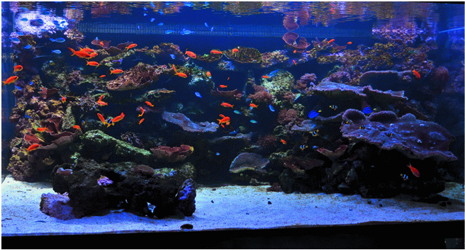

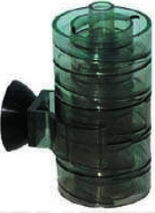

---

## Page 3

Le schéma de Lewis de la molécule de dioxyde de carbone et celui de la molécule d’eau sont donnés ci-
 dessous.

                                                                                                                     O
                                                  Molécule                          O C O
                                                                                                                 H    H
                                           Structure spatiale                       linéaire                     coudée

 1.3. En s’appuyant notamment sur les électronégativités des atomes, justifier la faible solubilité du dioxyde de
 carbone dans l’eau.

 1.4. Indiquer, parmi les espèces acido-basiques associées au dioxyde de carbone dissous, celles qui sont des
 acides de Brönsted et celles qui sont des bases de Brönsted.

 1.5. En précisant la démarche suivie, indiquer, parmi les espèces acido-basiques associées au dioxyde de
 carbone dissous, celle(s) qui prédomine(nt) dans l’aquarium récifal.

 Le squelette et la coquille des coraux sont constitués de calcaire, c’est-à-dire de carbonate de calcium
 CaCO3 (s), qui se forme suivant une transformation modélisée par l’équation de réaction suivante :
                                                                                     2–
                                                                     Ca2+ (aq) + CO3 (aq) → CaCO3 (s)
 1.6. Expliquer pourquoi l’utilisation d’un diffuseur de CO2 dans l’aquarium peut freiner la formation du squelette
 et de la coquille des coraux.

2. Contrôle de la salinité

 Dans un aquarium, on trouve notamment des ions chlorure Cℓ–(aq) ainsi que des cations comme les ions sodium
 Na+(aq).
 La salinité de l’eau d’un aquarium est assimilée à la concentration en masse en ion chlorure Cℓ–(aq). Celle de
 l’aquarium récifal doit être comprise entre 19,3 et 19,6 g·L-1.
 Pour contrôler la salinité de l’eau de l’aquarium étudié, on se propose de réaliser le titrage des ions chlorure.
 Pour cela, on prélève de l’eau de l’aquarium que l’on dilue d’un facteur 10, puis on titre 10,0 mL de cette solution
                                                                                                          –
 à laquelle on a ajouté 200 mL d’eau distillée, par une solution de nitrate d’argent (Ag+(aq) ; NO3 (aq)) de
                                  –2      –1
 concentration égale à 5,00×10 mol⋅L .
 Le titrage est suivi par conductimétrie. L’équation de la réaction support du titrage est :
                                             Ag+(aq) + Cℓ–(aq) → AgCℓ(s)

 On obtient la courbe de suivi du titrage de la figure 1.
                                          240
              Conductivité (en mS.cm–1)

                                          230
                                          220
                                          210
                                          200
                                          190
                                          180
                                          170
                                          160
                                          150
                                          140
                                                0,0           5,0            10,0              15,0       20,0             25,0
                                                                            Volume versé (en mL)

                                                 Figure 1. Conductivité de la solution en fonction du volume de solution
                                                                        de nitrate d’argent versé

 2.1. Justifier qualitativement l’évolution de la pente de la courbe lors du titrage.

                                                                                                                                  Page 3 / 13

---

## Page 4

2.2. Indiquer si un traitement de l’eau est nécessaire à l’issue du contrôle de la salinité.
  Le candidat est invité à prendre des initiatives et à présenter la démarche suivie même si elle n’a pas abouti.
  La démarche est évaluée et nécessite d’être correctement présentée.

3. Traitement des poissons contre les vers

  L’aquarium récifal peut être infesté par différents types de vers qui parasitent les intestins, les branchies ou la
  peau des poissons. Pour assurer une élimination chimique de ces vers, les poissons doivent être
  momentanément placés dans un bassin de quarantaine dans lequel est ajouté un vermifuge.
  Le praziquantel est une espèce chimique qui entre dans la composition d’un vermifuge utilisé en aquariophilie,
  vendu en animalerie en solution liquide, de concentration en masse de 10,0 g·L–1.

  En 2010, un procédé de synthèse du praziquantel impliquant trois étapes a été proposé, ce qui le rend plus éco-
  responsable et moins onéreux. L’étape 1 conduisant à l’obtention de la molécule A n’est pas présentée ici.

  3.1. L’étape 2, représentée ci-dessous, permet de transformer les réactifs A (C9H9N), B, C et D (C4H11O2N) en
  produit E (C21H32O4N2) et produit F.

                                                                                                 CH3
                                           COOH
                     NC
                                                            O                                    O     O
                                                  H2N           CH3                                        CH3

                    +     CH 2O
                                  +           +         O
                                                            CH3
                                                                      Étape 2
                                                                                    HN                           + F
                                                                                                 N
          A               B            C                D                                O
                                                                                             O

                                                                                             E
                Figure 2. Équation de la réaction modélisant la transformation chimique de l’étape 2
                                                                                O
    La formule développée du réactif B est représentée ci-contre :              C
                                                                            H       H

         3.1.1. Justifier que la molécule B se nomme méthanal en nomenclature officielle.
         3.1.2. Donner la formule semi-développée, puis brute du réactif C.
         3.1.3. Déterminer le produit F formé à l’issue de l’étape 2 en s’appuyant sur les formules brutes des
                espèces chimiques mises en jeu.

  La synthèse de 40,9 g de la molécule E nécessite 0,110 mol de chacun des réactifs A, B, C et D. La masse
  molaire moléculaire de E est M(E) = 376,5 g·mol–1.

         3.1.4. Déterminer le rendement de l’étape 2.

  3.2. L’étape 3 permettant de synthétiser le praziquantel nécessite l’utilisation de l’acide méthylsulfonique, noté
  AMS. Cette étape comporte quatre opérations décrites ci-dessous.

      a. 30,0 g de E sont ajoutés à 104,0 mL d’AMS puis l’ensemble est chauffé pendant 6 heures à 70°C. La
         solution obtenue est versée dans de l’eau glacée ajustée à un pH égal à 8 avec une solution aqueuse
         d’hydroxyde de sodium.
      b. La solution est extraite quatre fois avec de l’éther diéthylique.
      c. La phase organique est lavée par 100 mL d’une solution aqueuse salée saturée. La phase organique
         est ensuite séchée. Après évaporation de l’éther diéthylique, on obtient un solide jaune.
      d. Ce résidu est recristallisé dans un mélange équimolaire d’acétate d'éthyle et d’hexane. On obtient un
         solide blanc.
        D’après Dr. Haiping Cao Dr. Haixia Liu Prof. Alexander Dömling https://doi.org/10.1002/chem.201002046

                                                                                                       Page 4 / 13

---

## Page 5

3.2.1. Associer à chacune des opérations a. et c. du protocole un ou plusieurs des mots suivants :
        dissolution – séparation – purification – transformation chimique
        3.2.2. Nommer une méthode d’identification possible pour le solide obtenu.

4. Prévention des infections

 Un aquariophile traite de manière préventive son aquarium contre les infections.
 Pour cela, il utilise une solution aqueuse antiseptique de bleu de méthylène. Le bleu
 de méthylène (C16H18CℓN3S) est un colorant faiblement biodégradable, de couleur
 bleue foncée. L’excès de bleu de méthylène est éliminé par des « filtres » à charbon
 actif.
                                                                                                    Vue au microscope
 Le charbon actif est une poudre noire dont les pores, observables au microscope                     électronique des
 électronique, permettent notamment de fixer et retenir des molécules                               pores d’un grain de
 organiques. C’est le phénomène d’adsorption.                                                          charbon actif

 La capacité d’adsorption du charbon actif peut être évaluée à l’aide d’un dosage par étalonnage en suivant le
 protocole expérimental suivant :
     - tracer la courbe d’étalonnage de l’absorbance, à λ= 650 nm, pour des solutions étalon de bleu de
         méthylène ;
     - mesurer l’absorbance d’un échantillon d’eau polluée en bleu de méthylène ;
     - prélever un volume V de 50,0 mL d’eau polluée et y ajouter 100,0 mg de charbon actif ;
     - agiter le mélange puis filtrer ;
     - mesurer l’absorbance de la solution filtrée après traitement au charbon actif.

 4.1. Justifier l’intérêt de l’étape de filtration.

 Pour les questions suivantes, le candidat est invité à prendre des initiatives et à présenter la démarche suivie
 même si elle n’a pas abouti. La démarche est évaluée et nécessite d’être correctement présentée.

 On applique le protocole précédent et on obtient les résultats suivants :
                                  1,8
                                  1,6
                                  1,4
                                  1,2
                     Absorbance

                                   1
                                  0,8
                                  0,6
                                  0,4
                                  0,2
                                   0
                                        0   2     4       6      8      10      12      14     16        18
                                                Concentration du bleu de méthylène en mg.L–1

             Figure 3. Absorbance en fonction de la concentration en bleu de méthylène, à λ = 650 nm
 Les valeurs d’absorbance obtenues avant et après traitement de l’eau de l’aquarium pour éliminer l’excès de
 bleu de méthylène sont Apolluée = 1,5 et Atraitée = 0,2.
 4.2. Montrer que la masse ma de colorant adsorbée par gramme de charbon actif est voisine de 7 mg.

 4.3. Sachant qu’un traitement préventif de l’aquarium, de volume V = 8 000 L, nécessite 1 à 2 mg de bleu de
 méthylène par litre d’eau, calculer la masse de charbon actif nécessaire afin de réaliser le traitement pour cet
 aquarium récifal. Commenter.

                                                                                                              Page 5 / 13

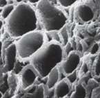

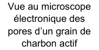

---

## Page 6

EXERCICES au choix du candidat (5 points)
                         Vous indiquerez sur votre copie les 2 exercices choisis :
                                  exercice A ou exercice B ou exercice C

                           EXERCICE A - UN SAUT STRATOSPHÉRIQUE

Mot-clé : mouvement dans un champ de pesanteur uniforme

Le 14 octobre 2012, Félix Baumgartner devient le premier homme à atteindre une
vitesse égale à celle du son en s’élançant d’une capsule située dans la zone
supérieure de la stratosphère.

L’objectif de cet exercice est de comprendre pourquoi il réalise un saut depuis la
zone supérieure de la stratosphère pour atteindre la vitesse du son dans
l’atmosphère.

Données :
 masse de Félix Baumgartner et de son équipement : m = 120 kg ;
 altitudes limites de la stratosphère : zmin = 11 km, zmax = 50 km ;
 altitude de la capsule au moment du saut : zdépart = 38 969 m ;                          D’après redbull.com
 intensité du champ de pesanteur à la surface de la Terre supposée sphérique
   de rayon RT : g0 = 9,81 m·s–2 ;
 rayon de la Terre : RT = 6 370 km ;
                                                                                             2
                                                                                       g0 × R T
   expression du champ de pesanteur terrestre en fonction de l’altitude : g(z) =                 2 ;
                                                                                       RT + z
   évolution de la norme de la vitesse du son vson dans l’atmosphère en fonction de l’altitude :
                  vson (m/s)
               350

               340

               330

               320

               310

               300
                                                                                                          altitude
                                                                                                           z (m)
               290
                     0           10000          20000          30000           40000              50000
                                Figure 1. Vitesse du son en fonction de l’altitude

   norme f en N de la force de frottements due à l’air : f = 0,4 × ρair (z) × v2 avec :
       •    ρair (z) : masse volumique ρair de l’air à l’altitude z en kg·m–3 ;
       • v : vitesse du centre de masse de Félix Baumgartner en m·s–1.

1. Influence de l’altitude sur le champ de pesanteur

1.1. Calculer la différence ∆g entre les valeurs des champs de pesanteur aux limites de la stratosphère définie
     par : ∆g = | g(zmax ) – g(zmin ) |.

1.2. On considère que le champ de pesanteur est uniforme dans une zone de l’espace si sa variation par rapport
     à sa valeur à l’altitude zmax est inférieure à 2 %. Le champ de pesanteur terrestre peut-il être considéré
     comme uniforme dans la stratosphère ?

                                                                                                          Page 6 / 13

---

## Page 7

Pour la suite de l’exercice, on prend pour valeur du champ de pesanteur g = 9,66 m·s–2 .

Le mouvement du centre de masse de Félix Baumgartner est étudié dans le référentiel terrestre supposé
galiléen, l’axe des z est dirigé selon la verticale orientée vers le haut, l’origine O est prise au niveau du sol.

À la date t = 0 s, Félix Baumgartner s’élance sans vitesse initiale. Son mouvement est supposé vertical.

2. Établir, dans le cadre du modèle de la chute libre, l’équation horaire z(t) de l’altitude du centre de masse de
   Félix Baumgartner à la date t en fonction de t, g et zdépart.

3. En déduire, dans le cadre de ce modèle, l’altitude à laquelle la valeur de la vitesse de Félix Baumgartner est
   égale à 307 m⸱s–1.

4. Indiquer, dans le cadre de ce modèle, en justifiant, si Felix Baumgartner a dépassé la vitesse du son lorsqu’il
   atteint cette altitude.

En réalité, Félix Baumgartner atteint une vitesse égale à celle du son à une altitude zson = 33 446 m. On donne,
sur la figure 2 ci-dessous, l’évolution de la masse volumique ρair de l’air dans la stratosphère pour des altitudes
comprises entre 15 km et 50 km.

           ρair (kg·m–3)
   0,250

   0,200

   0,150

   0,100

   0,050

   0,000                                                                                        altitude z(m)
       15000        20000     25000      30000      35000       40000      45000      50000

      Figure 2. Masse volumique de l'air dans la stratosphère (entre 15 et 50 km) en fonction de l'altitude

5. Comparer la norme de la force de frottement de l’air et la norme du poids lorsque Félix Baumgartner atteint
   la vitesse de 307 m⸱s−1 à l’altitude de 33 446 m. Critiquer le modèle de chute libre utilisé précédemment.

En raison de la force de frottement due à l’air, Félix Baumgartner atteint une vitesse limite lors du saut. La
vitesse limite est la vitesse atteinte lorsque la norme de la force de frottement devient égale à celle du poids.

6. Pour simplifier, on formule l’hypothèse que la vitesse limite est atteinte après 4 000 m de chute. Calculer la
   valeur de la vitesse limite vlim atteinte par Félix Baumgartner s’il s’était élancé d’une altitude z = 20 000 m.

7. Expliquer qualitativement pourquoi il est nécessaire de s’élancer depuis la zone supérieure de la stratosphère
   pour atteindre une vitesse égale à celle du son.

                                                                                                    Page 7 / 13

---

## Page 8

EXERCICE B - UN SYSTÈME DE DÉTECTION DE PASSAGER

Mot-clé : modèle du circuit RC série

Pour renforcer la sécurité routière, les voitures sont équipées d’un système de
détection de la présence d’un passager pour lui signaler si sa ceinture de sécurité
est bien attachée.

Dans le cadre d’un projet scientifique, un groupe d’élèves réalise un système de
détection semblable à celui d’une voiture. Il est composé d’un capteur de pression
capacitif « artisanal » associé à un microcontrôleur.

Le condensateur « artisanal » est constitué de deux feuilles d’aluminium séparées
par une feuille de papier isolante. Lorsqu’un objet de masse m est posé dessus,
                                                                                          Figure 1. Schéma de
il exerce une pression sur les deux feuilles d’aluminium et les déforme, ce qui
                                                                                          l’installation d’un capteur
modifie la capacité électrique du condensateur « artisanal ». Après un traitement
                                                                                          capacitif dans l’assise d’un
numérique des signaux électriques, le microcontrôleur peut détecter la présence
                                                                                          siège de voiture
de l’objet.

                Figure 2. Photographie d’une face du capteur de pression capacitif « artisanal »

L’objectif de cet exercice est d’illustrer le principe de fonctionnement d’un tel capteur.

1. Étude du capteur de pression capacitif « artisanal »
Le capteur de pression capacitif « artisanal » est représenté en coupe à la figure 3.

                   Figure 3. Schéma de la vue en coupe du capteur de pression « artisanal »

1.1. Justifier l’utilisation de l’adjectif « capacitif » dans l’expression « capteur de pression capacitif » couramment
utilisée pour désigner ce genre de capteurs.

1.2. Si le capteur est soumis à une tension positive constante UAB entre ses bornes A et B, des charges
électriques apparaissent sur chacune des feuilles, notées QA sur la feuille d’aluminium A et QB sur la feuille
d’aluminium B. On note C la capacité électrique de ce capteur. Donner l’expression littérale de la charge QA
puis celle de la charge QB en fonction de C et UAB.

                                                                                                       Page 8 / 13

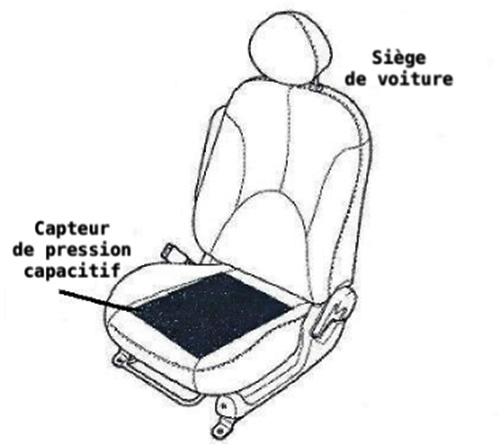

---

## Page 9

*(Suite de la page précédente — le document continue ici.)*

ε×S
1.3. La capacité électrique C d’un tel capteur s’écrit C =           avec S la surface en regard des feuilles
                                                                 e
d’aluminium, e l’épaisseur de la feuille de papier isolante et ε une constante caractéristique de la feuille de
papier isolante. Indiquer, en justifiant la réponse, le sens de variation de la capacité électrique C du capteur
quand un objet est posé sur le condensateur « artisanal ».

2. Modélisation du circuit de la chaine de mesure
La détection de la variation de la capacité électrique C du capteur est réalisée par un circuit électrique appelé
la chaîne de mesure. Le circuit électrique associé peut se modéliser par le circuit schématisé ci-après :

                                             Figure 4. Schéma du circuit électrique

Le générateur de ce circuit est un générateur idéal de tension E. Le condensateur modélise le capteur de
pression capacitif « artisanal » installé dans l’assise du siège du véhicule. La mesure de la tension aux bornes
du condensateur, notée uC(t), est réalisée en permanence par un microcontrôleur qui n’est pas représenté sur
le schéma. La résistance R est celle d’un conducteur ohmique. Le capteur de pression capacitif « artisanal »
possède une capacité électrique C variable, selon que le capteur est soumis ou non à une pression extérieure.
Le commutateur possède deux positions notées 1 et 2 et joue le rôle d’un interrupteur fermé sur la position 1 ou
sur la position 2.

On considère que l’interrupteur est dans la position 1 depuis un temps très long, et que les paramètres E, C et
R sont constants. À la date t = 0 s, uC(0) = E et l’interrupteur est basculé dans la position 2.

2.1. Établir l’équation différentielle régissant l’évolution de la tension uC(t) aux bornes du condensateur pour t ≥ 0
                                   duC ( )    u (t )
     et l’écrire sous la forme :             + C       = 0. Exprimer τ en fonction de R et C.
                                        dt

                                    t
2.2. Vérifier que uC (t ) = A × e- τ est solution de l’équation différentielle et exprimer A en fonction de E.

2.3. Montrer que le condensateur est déchargé à la date t = 5 . On considère que le condensateur est déchargé
     lorsque la tension uC(t) devient égale à 1% de sa valeur initiale.

3. Test expérimental de la chaîne de mesure
Pour tester cette chaîne de mesure qui permet de détecter la présence d’une pression exercée sur le capteur,
on réalise le circuit étudié précédemment. La commutation est réalisée automatiquement par le microcontrôleur.

On réalise l’expérience suivante :

      Figure 5. Dispositif sans pression                                     Figure 6. Dispositif avec pression

                                                                                                           Page 9 / 13

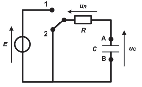

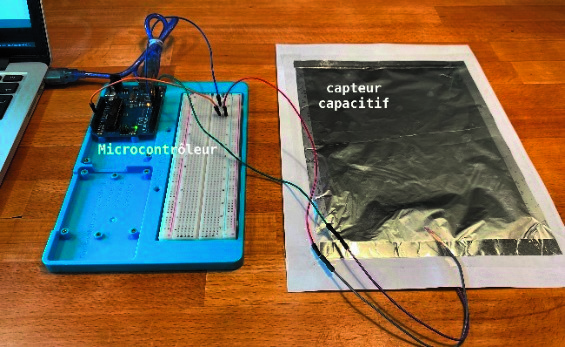

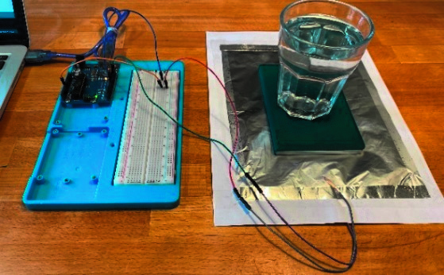

---

## Page 10

Un premier essai est conduit sans qu’aucune pression ne soit exercée sur le capteur (figure 5). Le
microcontrôleur mesure la tension uC(t) au cours du temps aux bornes du capteur capacitif.
Un second essai est réalisé au cours duquel une masse (ici un verre rempli d’eau) est posée sur le capteur
(figure 6). De nouveau, on mesure la tension uC(t) au cours du temps aux bornes du capteur capacitif.

Données :
    tension du générateur idéal : E = 5 V ;
    résistance du conducteur ohmique : R = 10 MΩ ;
    épaisseur de la feuille de papier isolante sans pression : e = 1,0×10–4 m.

Les séries de mesures, obtenues lors de ces deux essais, sont présentées sur le même graphique ci-dessous
(figure 7). La date t = 0 s correspond au passage du commutateur de la position 1 à 2 (figure 4).

uC (en V)
 6

 5

 4

 3

 2

 1

 0
     0            100            200            300            400            500            600            700
                                                                                                        t (ms)
              Figure 7. Évolution de uC mesurée en fonction du temps lors des deux essais.

3.1. Parmi les deux séries de mesures précédentes, représentées soit par ▲ soit par ■, associer celle qui
      correspond au dispositif sans pression et celle qui correspond au dispositif avec pression. Justifier.

On considère que la variation de capacité électrique ΔC est liée à la variation d’épaisseur Δe par la relation :

                                                      ∆C ∆e
                                                        =
                                                      C   e

3.2. Déterminer la valeur de la variation d’épaisseur Δe, après avoir évalué la variation de capacité électrique
      ΔC.

                                                                                                   Page 10 / 13

---

## Page 11

EXERCICE C - QUELLE TAILLE POUR LES MAILLES D’UN TAMIS ?

Mots-clés : diffraction et interférences d’ondes lumineuses

Les artémies (voir photo ci-contre) sont des crustacés élevés pour nourrir les
poissons des aquariums. Leur taille doit être adaptée à l’espèce de poisson à
nourrir. On utilise des tamis calibrés pour les sélectionner.

On se propose dans cet exercice de déterminer la taille des mailles d’un tamis en
utilisant une diode laser de longueur d’onde λ = (650 ± 10) nm.
                                                                                                     Source :
                                                                                           https://fr.m.wikipedia.org
1. Vérification de la valeur de la longueur d’onde de la diode laser utilisée

Pour vérifier la valeur de la longueur d’onde de la diode laser annoncée par le constructeur, on réalise une
expérience dont le schéma est donné ci-dessous (figure 1).

                                                       x            Première tache sombre
              Fente de
              largeur a                                    L
                                                           2
                                          θ
                      a
    Laser
                                                                      0
                                      D                                                                                 x
                                                      Écran

               Distance fente – écran : D = 56 cm                         Figure 2. Figure observée sur l’écran
               Largeur de la fente calibrée : a = 80 µm
 Figure 1. Schéma de l’expérience (échelle non respectée)

1.1. Nommer le phénomène physique responsable des taches lumineuses observées sur l’écran. Discuter
     qualitativement de l’influence de la largeur de la fente et de la longueur d’onde de l’onde incidente sur le
     phénomène observé.

                                                               
1.2. On rappelle que l’angle θ est donné par la relation θ =       et on considère que tan θ ≈ θ pour les petits
                                                               a
     angles (θ << 1 rad). Déterminer l’expression de l’angle θ en fonction de la largeur L de la tache centrale
     et de D. En déduire l’expression de la longueur d’onde λ en fonction de L, a et D.

Pour faire une mesure précise, on remplace l’écran par une caméra qui permet d’obtenir l’intensité lumineuse
relative* en fonction de la position x, repérée selon l’axe indiqué sur la photo de la figure 2. L’origine x = 0 m
est prise sur le bord du capteur de la caméra. On obtient alors la figure 3.

* L’intensité lumineuse relative est le rapport de l’intensité lumineuse reçue par le capteur sur l’intensité
maximale reçue.

1.3. Déterminer la valeur de la longueur d’onde de la diode laser utilisée en exploitant la courbe obtenue sur
     la figure 3. La comparer à la valeur indiquée par le constructeur.

                                                                                                    Page 11 / 13

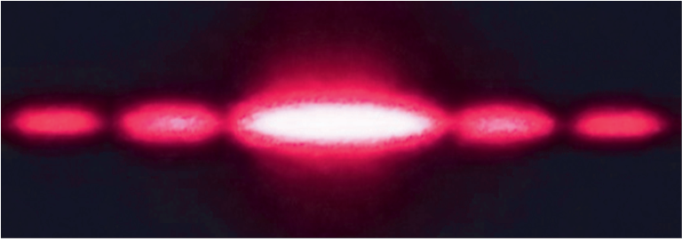

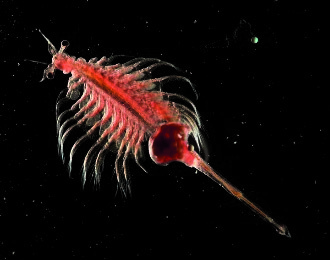

---

## Page 12

Intensité lumineuse relative

      0,8

      0,6

      0,4

      0,2

            0          5,0             10,0         15,0          20,0           25,0         x (en mm)

                  Figure 3. Intensité lumineuse relative en fonction de la position sur l’écran

2. Calibrage du tamis de récupération

Le but de cette partie est de vérifier que le tamis disponible, dont le maillage est représenté sur la figure 5,
permet de récupérer toutes les artémies d’une taille supérieure à 150 µm. On réalise une expérience
d’interférences pour évaluer les dimensions du tamis en utilisant la diode laser précédente. La largeur du fil
plastique constituant le tamis est égale à 230 µm.

L’expérience d’interférences est décrite ci-dessous :
 - le montage utilisé est donné sur la figure 4 ;
 - on utilise la diode laser de longueur d’onde  = (650 ± 10) nm. La distance entre le tamis et l’écran vaut
     D = (7,75 ± 0,03) m ;
 - on note b la distance entre les centres de deux trous consécutifs du maillage du tamis ;
 - la figure d’interférences obtenue est donnée sur les figures 6 et 7.

                                                Figure obtenue
                                                  sur l’écran                        b
                 Tamis à maille
                carrée de côté b

                                                                                                                 b

     LASER       >

                                   D = 7,75 m

         Figure 4. Montage utilisé (échelle non respectée)               Figure 5. Schéma du maillage du tamis

                                                                                                  Page 12 / 13

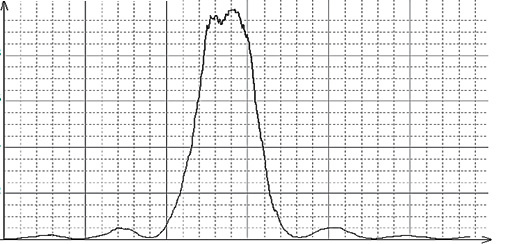

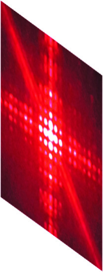

---

## Page 13

Figure 6. Figure d’interférences
              obtenue
                                                                         Figure 7. Tache centrale de la figure
                                                                            d’interférences à l’échelle 1/1

2.1. Expliquer brièvement, sans calcul, l’origine de la présence de zones sombres et de zones brillantes dans
     une figure d’interférences lumineuses.

Le centre de la figure d’interférences de la figure 6 est représenté sur la figure 7 ci-dessus à l’échelle 1/1.
L’interfrange, noté i, est défini comme la distance entre les centres de deux taches lumineuses successives
selon l’axe identifié sur la figure 7.

                                                                    ×D
L’expression de l’interfrange est donnée par la relation : i =            .
                                                                     b

L’incertitude-type u(b) sur la grandeur b peut se calculer à partir de la relation :

                                                       2            2                2
                                       u(b)     u(D)         u(i)             u()
                                            =              +
                                        b        D            i                

                           où u(x) désigne l’incertitude-type associée à la grandeur x

2.2. Évaluer la valeur de l’interfrange i en explicitant la méthode suivie pour obtenir la meilleure précision.
     Évaluer l’incertitude-type u(i) sur la mesure de l’interfrange i.

2.3. Calculer b puis évaluer u(b).

2.4. Indiquer si le tamis étudié permet de récupérer les artémies voulues. Justifier.

                                                                                                         Page 13 / 13

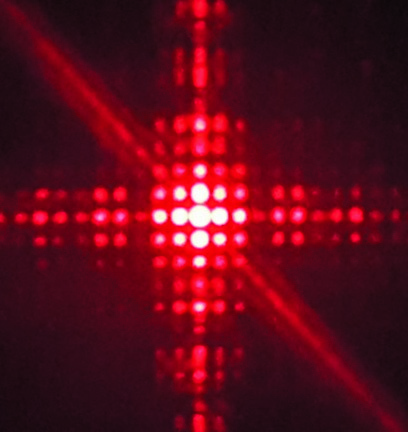

