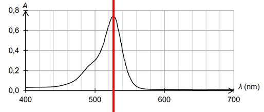
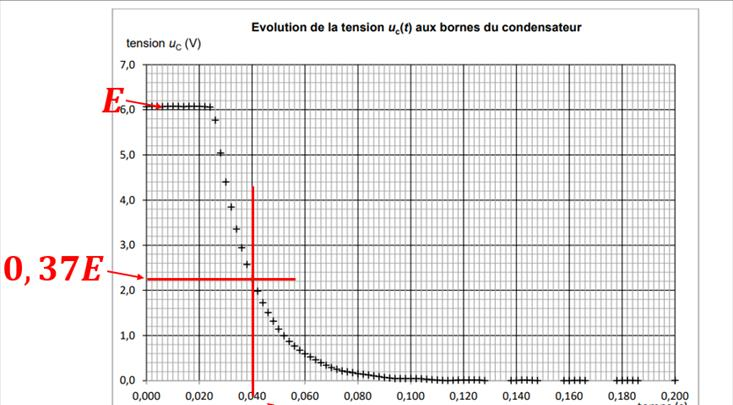

# spe-physique-chimie-2022-metropole-1-corrige

> Source : `../../../pdf_version/10_pc/2022/spe-physique-chimie-2022-metropole-1-corrige.pdf` — conversion Markdown (texte + visuels utiles).
> Stratégie : [STRATEGIE_MARKDOWN.md](../../../STRATEGIE_MARKDOWN.md)

---

## Page 1

Baccalauréat général - Physique-Chimie (spécialité) Métropole 2022 (S1) – Corrigé

                                            Baccalauréat général

                                  Session 2022 – (Métropole 1) - Bac 2022

                        Épreuve de Physique-Chimie
                      Sujet de spécialité — Proposition de corrigé Sujet 1

Table des matières
EXERCICE 1 : Commun à tous les candidats – Le colorant E127 ......................... 2
  1. Dosage du colorant E127 dans un révélateur de plaque dentaire ................ 2
  2. Synthèse de l’érythrosine à partir de la fluorescéine .................................... 3
  3. Suivi cinétique de la décoloration d’une solution de colorant E127 par l’eau
  de Javel .................................................................................................................. 3
EXERCICE A - La physique du jonglage : ............................................................... 5
EXERCICE B - Refroidissement d’un fer à cheval : ................................................ 7
  1. Chauffage du fer .............................................................................................. 7
  2. Refroidissement du fer .................................................................................... 7
     2.1. Refroidissement à l’air libre ..................................................................... 7
     2.2. Refroidissement dans l’eau avant la pose. ............................................... 8
EXERCICE C – Défibrillateur cardiaque : .............................................................. 9

                              Ce corrigé est composé de 10 pages

                                                             1

---

## Page 2

Baccalauréat général - Physique-Chimie (spécialité) Métropole 2022 (S1) – Corrigé

EXERCICE 1 : Commun à tous les candidats – Le
colorant E127
1. Dosage du colorant E127 dans un révélateur de plaque
   dentaire
   1.   A : Groupe hydroxyle
        B : Groupe carboxyle
        C : Groupe carbonyle

   2.   Etablissons le diagramme de prédominance,

        Comme dans le révélateur de plaque dentaire étudié le pH vaut 7, d’après
        le diagramme de prédominance 𝐸𝑟𝑦 2− est l’espèce qui prédomine dans la
        solution.

   3.
        La longueur d’onde d’absorption maximale est 525 nm. La couleur d’une
        espèce chimique est la couleur complémentaire à la couleur correspondant
        à la longueur d’onde maximale. Il s’agit de la couleur opposée au vert donc
        d’après le cercle chromatique, la solution est rouge.

   4.
        On trace la droite modèle (droite qui passe par l’origine et un maximum de
        points). On trace la droite d’équation y = 0,48 et on relève l’abscisse du
        point d’intersection. Ici, [𝑆] = 5,50 µ𝑚𝑜𝑙. 𝐿−1
                                                      𝑉    2,0
        Calculons le facteur de dilution de S, 𝐹 = 𝑉𝑠 = 0,5×10−3 = 4,0 × 103
                                                       0
               [𝐸127] = 𝐹 × [𝑆] = 4,0 × 103 × 5,50 × 10−6 = 2,2 × 10−2 𝑚𝑜𝑙. 𝐿−1

                                            2

---

## Page 3

Baccalauréat général - Physique-Chimie (spécialité) Métropole 2022 (S1) – Corrigé

      Soit P(E127) le titre massique,
       𝑚(𝐸127)      [𝐸127] × 𝑀 × 𝑉      2,2 × 10−2 × 880
    𝑃=          =                     =                  ≈ 1,9 × 10−2 ⟹ 1,9%
           𝑚              𝜌
                          ⏟      ×𝑉         1,0 × 103
                          𝑨𝒕𝒕𝒆𝒏𝒕𝒊𝒐𝒏 à 𝒍′𝒖𝒏𝒊𝒕é
       Donc, le titre massique est en accord avec les données du fabriquant, il est
       fiable.

2. Synthèse de l’érythrosine à partir de la fluorescéine

   5. Etape n°1 : étape de la transformation, les réactifs réagissent pour
      former les produits
      Etape n°2 : étape du traitement et de la purification, on traite le
      mélange pour extraire l’érythrosine (solide rouge) puis on le purifie grâce
      au lavage
      Etape n°3 : étape d’identification, on teste les caractéristiques du solide
      obtenue (T° de fusion) pour valider la pureté du produit.

   6. Le chauffage du mélange réactionnel permet d’accélérer la vitesse de
      formation des produits.
   7.
      𝑛(𝐻2 𝐹𝑙𝑢)𝑖   𝑚   5,0                     𝑛(𝑖 )   𝑚    9,5
   8.            = 𝑀 = 332 = 1,5 × 10−2 𝑚𝑜𝑙 𝑒𝑡 42 𝑖 = 4𝑀 = 4×254 = 9,4 × 10−3 𝑚𝑜𝑙
          1
                                      𝑛(𝐻2 𝐹𝑙𝑢)𝑖 𝑛(𝑖2 )𝑖
                                                 >
                                          1          4
      Donc la diode est le réactif limitant.

             𝑛(𝑖2 )𝑖
   9. 𝑥𝑓 =             = 𝑛(𝐻2 𝐸𝑟𝑦)𝑚𝑎𝑥
               4
                                                        𝟗, 𝟓
           𝒎(𝑯𝟐 𝑬𝒓𝒚)𝒇 = 𝒏(𝑯𝟐 𝑬𝒓𝒚)𝒎𝒂𝒙 × 𝑴 × 𝜼 =                × 𝟖𝟑𝟔 × 𝟎, 𝟓𝟗 ≈ 𝟒, 𝟔 𝒈
                                                      𝟒 × 𝟐𝟓𝟒

   10. On a vu que le titre massique de la solution décrite est de 2% :
                     𝑚𝑓𝑙𝑎𝑐𝑜𝑛 = 0,02 × 𝑉 × 𝜌 = 0,019 × 10 × 1,0 = 0,2 𝑔
       Chaque échantillon contient donc 0,2 g de colorant E17, soit :
       Calculons la quantité de matière en colorant formée,
                       4,6
         𝑛(𝐻2 𝐸𝑟𝑦)𝑓 =      ≈ 5,5 × 10−2 𝑑𝑜𝑛𝑐 𝑚(𝐸127) = 5,5 × 10−2 × 880 ≈ 4,8 𝑔
                      836
                                         4,8
                                             = 24
                                         0,2
       On peut donc réaliser 24 flacons.

3. Suivi cinétique de la décoloration d’une solution de colorant
   E127 par l’eau de Javel

   10. La concentration en réactif [𝐸𝑟𝑦 2− ] dans l’expérience A suit une
       décroissance exponentielle tout comme l’expérience B, mais cette
       décroissance est moins rapide dans l’expérience A.

                                                3

---

## Page 4

Baccalauréat général - Physique-Chimie (spécialité) Métropole 2022 (S1) – Corrigé

         D’après le cours, on sait que la vitesse de disparition des réactifs est
         proportionnelle à la concentration initiale en réactif. On peut donc en
         conclure que [𝐶𝑙𝑂− ]𝑖𝐴 < [𝐶𝑙𝑂− ]𝑖𝐵

   11.
         Graphiquement on voit que le temps de demi-réactions est de 150 s, soit
         2,5 minutes. La réaction est lente.

   12. On peut optimiser la synthèse en augmentant la concentration en ion
       hypochlorite (en utilisant une eau de Javel plus concentrée), par
       l’introduction d’un catalyseur ou par l’augmentation de la température du
       milieu réactionnel.

                                            4

---

## Page 5

Baccalauréat général - Physique-Chimie (spécialité) Métropole 2022 (S1) – Corrigé

EXERCICE A - La physique du jonglage :
   1. Le mouvement de la balle sur l’axe y lors de la première phase est
      parabolique. Sa vitesse sur l’axe y décroit de manière uniforme.

   2. Grâce au graphique 2, on peut dire qu’à la fin de la phase 1, en prenant
      comme origine la paume du jongleur, on peut dire que la balle est passée
      de la main droite du joueur et se dirige vers sa main gauche. La main
      gauche rattrape la balle à 0,8 s accompagne le mouvement puis renvoie la
      balle vers la main droite à t = 0,9 s et à l’altitude de -0,36 m.

   3. Dans le cadre de la chute libre, le système {C de la balle, de masse m} dans
      le référentiel terrestre, n’est soumis qu’à son poids, donc d’après la
      deuxième loi de Newton,
                                        ∑𝐹⃗⃗⃗⃗⃗⃗⃗
                                             𝑒𝑥𝑡 = 𝑚. 𝑎

                                                         𝑃⃗ = 𝑚. 𝑎
                                                           𝑔= 𝑎
                                                            𝑎 =0
                                                        𝑎 {𝑎 𝑥= −𝑔
                                                             𝑦

       En cherchant une primitive du vecteur 𝑎,
       On voit que 𝑣𝑥 (𝑡) = 𝐶1 et d’après la condition initiale celle-ci vaut 𝑣0𝑥 , il
       s’agit bien d’une constante.

                               1
   4. 𝐸𝑚0 = 𝐸𝑐0 + 𝐸𝑝𝑝0 = 2 𝑚𝑣02 + 𝑚 × 𝑔 × 𝑦                          , 𝑂𝑟 𝑦 = 0 𝑒𝑡 𝑣0 = √𝑣0𝑥 2 + 𝑣0𝑦 2
                      1            1                             2       1
       𝐷′ 𝑜ù 𝐸𝑚0 = 2 𝑚𝑣02 = 2 𝑚 (√𝑣0𝑥 2 + 𝑣0𝑦 2 ) = 2 𝑚(𝑣0𝑥 2 + 𝑣0𝑦 2 )

   5. A l’altitude maximale H, à la flèche du mouvement, la vitesse sur l’axe y
      est nulle.
      En négligeant les forces de frottements, l’énergie mécanique se conserve tel
      que :
                                    1                  1
                 𝐸𝑚0 = 𝐸𝑐𝐻 + 𝐸𝑝𝑝𝐻 ⟺ 𝑚(𝑣0𝑥 2 + 𝑣0𝑦 2 ) = 𝑚𝑣𝑥2 + 𝑚 × 𝑔 × 𝐻
               1
                                    2                  2
                𝑚(𝑣0𝑥 2 +𝑣0𝑦 2 −𝑣𝑥2 )       𝑣0𝑥 2 +𝑣0𝑦 2 −𝑣𝑥2                            2
       ⟺𝐻=2                             =                       𝑂𝑟 𝑣𝑥 𝑒𝑠𝑡 𝑐𝑜𝑛𝑠𝑡𝑎𝑡𝑒 𝑑𝑜𝑛𝑐 𝑣0𝑥 = 𝑣𝑥2
                          𝑚𝑔                      2𝑔
                                               𝒗𝟎𝒚 𝟐
                                                       ⟺ 𝑯=
                                                𝟐𝒈
   6. Par lecture graphique de la figure 2.b, on voit que 𝑣0𝑦 = 4,00 𝑚. 𝑠 −1
                                       4,002
                                 𝐻=            = 0,815 𝑚
                                      2 × 9,81
      Le graphique 2.a montre que la hauteur atteinte est légèrement supérieure
      à 0,81 m, la relation de H est cohérente.

   7. On a établi à la question 3. que 𝑔 = 𝑎
                                           𝑎 =0
                                       𝑎 {𝑎 𝑥= −𝑔
                                           𝑦

                                                          5

---

## Page 6

Baccalauréat général - Physique-Chimie (spécialité) Métropole 2022 (S1) – Corrigé

         Cherchons une primitive du vecteur 𝑎,
                                                    𝑣𝑥 (𝑡) = 𝐶1
                                   𝐹(𝑡) = 𝑣(𝑡) { (𝑡)
                                                𝑣𝑦     = −𝑔𝑡 + 𝐶2
                                                     𝑣0𝑥
                                                𝑣0 {𝑣
                                            𝐶𝐼 ⃗⃗⃗⃗
                                                      0𝑦
                       𝑣𝑥 (𝑡) = 𝑣0𝑥
         D’où 𝑣(𝑡) { (𝑡)
                    𝑣𝑦    = −𝑔𝑡 + 𝑣0𝑦

         𝑑𝑣𝑦              −1,2−4
   8.       = 𝑎𝑦 = −𝑔 = 0,5−0 ≈ −10,4
         𝑑𝑡
         On trouve une valeur proche de 9,81 m.s-2, c’est cohérent. L’écart est dû au
         manque de précision dans la lecture graphique.

   9. Cherchons une primitive du vecteur 𝑣,
                                                        𝑥(𝑡) = 𝑣0𝑥 . 𝑡 + 𝐶3
                                     ⃗⃗⃗⃗⃗⃗
                             𝐹(𝑡) = 𝑂𝑀(𝑡) {                 1
                                              𝑦(𝑡) = − 𝑔𝑡 2 + 𝑣0𝑦 . 𝑡 + 𝐶4
                                                            2
                                                ⃗⃗⃗⃗⃗⃗ (𝑂) { = 0
                                            𝐶𝐼 𝑂𝑀
                                                            𝑥
                                                            𝑦=0
                             𝑥(𝑡) = 𝑣0𝑥 . 𝑡
           ⃗⃗⃗⃗⃗⃗ (𝑡) {
      D’où 𝑂𝑀                    1
                        𝑦(𝑡) = − 2 𝑔𝑡 2 + 𝑣0𝑦 . 𝑡
                                                  𝟏
                                       𝒚(𝒕) = − 𝒈𝒕𝟐 + 𝒗𝟎𝒚 . 𝒕
                                                  𝟐
   10. La balle est en l’air tant que 𝑦(𝑡) > 0
       Résolvons 𝑦(𝑡𝑎𝑖𝑟 ) = 0 ∶
                                            1
                                      ⟺ − 𝑔𝑡 2 + 𝑣0𝑦 . 𝑡𝑎𝑖𝑟 = 0
                                            2
                                                 1
                                      ⟺ 𝑡𝑎𝑖𝑟 (− 𝑔𝑡 + 𝑣0𝑦 ) = 0
                                                 2
                                                     1
                                                    − 𝑔𝑡𝑎𝑖𝑟 + 𝑣0𝑦 = 0
                                                     2
                                 𝑡⏟𝑎𝑖𝑟 = 0      𝑜𝑢            2𝑣0𝑦
                               𝑙𝑎 𝑏𝑎𝑙𝑙𝑒 𝑣𝑖𝑒𝑛𝑡          𝑡𝑎𝑖𝑟 =
                             𝑑𝑒 𝑞𝑢𝑖𝑡𝑡𝑒𝑟 𝑙𝑎 𝑚𝑎𝑖𝑛                𝑔

                                         𝑣0𝑦    𝑣02𝑦      𝑣0𝑦 2
                                𝑡𝑎𝑖𝑟 = 2      √
                                             = 4 2 𝑜𝑟 𝐻 =
                                          𝑔     𝑔          2𝑔

                                                   2𝐻     𝟖𝑯
                                      𝑡𝑎𝑖𝑟 = √4       = √
                                                    𝑔      𝒈
   11.
                                               𝟖 × 𝟎, 𝟖𝟏
                                    𝑡𝑎𝑖𝑟 = √             ≈ 𝟎, 𝟖𝟏 𝒔
                                                 𝟗, 𝟖𝟏
         On trouve une valeur en accord avec la valeur lue sur le graphique 2a.

                                               6

---

## Page 7

Baccalauréat général - Physique-Chimie (spécialité) Métropole 2022 (S1) – Corrigé

EXERCICE B - Refroidissement d’un fer à cheval :
1. Chauffage du fer
   1. 𝑚𝐹𝑒𝑟 = 𝑉𝐹𝑒𝑟 × 𝜌𝐹𝑒𝑟 = 104 × 7,87 = 818 𝑔

   2. {fer à cheval}
               Δ𝑈 = 𝐶 × Δ𝑇 = 𝑐𝐹𝑒𝑟 × 𝑚𝐹𝑒𝑟 × (θ0 −𝜃𝑒𝑥𝑡 )
                           = 440 × 818 × 10−3 × (900 − 15) ≈ 𝟑, 𝟐 × 𝟏𝟎𝟓 𝑱

   3. Au cours du transfert énergétique le système reçoit de l’énergie sous forme
      thermique, pour passer de 15 à 900°C il doit donc recevoir 𝟑, 𝟐 × 𝟏𝟎𝟓 𝑱. Au
      niveau microscopique l’agitation thermique augmente et les interactions
      microscopiques aussi (ex : énergie de liaison chimique).

2. Refroidissement du fer
     Refroidissement à l’air libre
       4.   D’après la première loi de la thermodynamique : Δ𝑈 = 𝑄 + 𝑊, comme
            le transfert énergétique n’a lieu que par transfert thermique 𝑊 = 0
                                         Δ𝑈 = 𝑄 = 𝜙 × Δ𝑡
       D’après la loi de Newton
                                  Δ𝑈 = ℎ × 𝑆 × (𝜃𝑒𝑥𝑡 − 𝜃) × Δ𝑡
       Et
                                     Δ𝑈 = 𝑐𝐹𝑒𝑟 × 𝑚𝐹𝑒𝑟 × Δθ
       Il vient :
                           𝑐𝐹𝑒𝑟 × 𝑚𝐹𝑒𝑟 × Δθ = ℎ × 𝑆 × (𝜃𝑒𝑥𝑡 − 𝜃) × Δ𝑡
                                       Δθ ℎ × 𝑆 × (𝜃𝑒𝑥𝑡 − 𝜃)
                                   ⟺       =
                                       Δ𝑡       𝑐𝐹𝑒𝑟 × 𝑚𝐹𝑒𝑟
                              Δθ          ℎ×𝑆             ℎ×𝑆
                           ⟺      =−               𝜃+             𝜃
                               Δ𝑡      𝑐𝐹𝑒𝑟 × 𝑚𝐹𝑒𝑟     𝑐𝐹𝑒𝑟 × 𝑚𝐹𝑒𝑟 𝑒𝑥𝑡
                           1       𝑐   ×𝑚
       On pose : 𝜏 =      ℎ×𝑆    = 𝐹𝑒𝑟ℎ×𝑆 𝐹𝑒𝑟
                       𝑐𝐹𝑒𝑟 ×𝑚𝐹𝑒𝑟
                                    Δθ   𝜃 𝜃𝑒𝑥𝑡   Δθ 𝜃 𝜃𝑒𝑥𝑡
                               ⟺       =− +     ⟺   + =
                                    Δ𝑡   𝜏  𝜏     Δ𝑡 𝜏  𝜏
                                             Δθ       dθ
       Quand Δ𝑡 tend vers 0 la limite de Δ𝑡 vaut d𝑡 , d’où
                                       𝐝𝛉 𝜽 𝜽𝒆𝒙𝒕
                                           + =
                                       𝐝𝒕 𝝉         𝝉
       5.   Les solutions de cette équation sont de la forme :
                                               𝜃𝑒𝑥𝑡
                                          1               1
                               𝜃(𝑡) = 𝑘𝑒 −𝜏 𝑡 − 𝜏 = 𝑘𝑒 −𝜏 𝑡 + 𝜃𝑒𝑥𝑡
                                                 1
                                               −𝜏
            Or à t = 0 𝜃(0) = 𝜃0 𝑑𝑜𝑛𝑐
                           1
                       𝑘𝑒 −𝜏 ×0 + 𝜃𝑒𝑥𝑡 = 𝜃0 ⟺ 𝑘 + 𝜃𝑒𝑥𝑡 = 15 ⟺ 𝑘 = 15 − 𝜃𝑒𝑥𝑡

                                            7

---

## Page 8

Baccalauréat général - Physique-Chimie (spécialité) Métropole 2022 (S1) – Corrigé

                                                                1
                                  𝐷′ 𝑜ù 𝜃(𝑡) = (𝜃0 − 𝜃𝑒𝑥𝑡 )𝑒 −𝜏 𝑡 + 𝜃𝑒𝑥𝑡

                                                            1
       6.   Après 2 minutes, 𝜃(120) = (900 − 15)𝑒 −880120 + 15 = 787 °𝐶, le fer est
            bien très chaud après 2 minutes.

     Refroidissement dans l’eau avant la pose.
                     𝑚𝑓𝑒𝑟 .𝑐𝑓𝑒𝑟       880 ×10−3 × 440
       7.   𝜏𝑒𝑎𝑢 =                =                     ≈ 33,37𝑠
                      ℎ𝑒𝑎𝑢 .𝑆         360 × 293 ×10−4

            Résolvons 𝜃(𝑡) = 40°𝐶 ,
                                          1           𝜃(𝑡) − 𝜃𝑒𝑥𝑡      1       1
                 𝜃(𝑡) = (𝜃0 − 𝜃𝑒𝑥𝑡 )𝑒 −𝜏 𝑡 + 𝜃𝑒𝑥𝑡 ⟺               = 𝑒 −𝜏 𝑡 ⟺ − 𝑡𝑙𝑛(𝑒)
                                                       𝜃0 − 𝜃𝑒𝑥𝑡               𝜏
                                        𝜃(𝑡) − 𝜃𝑒𝑥𝑡                 𝜃(𝑡) − 𝜃𝑒𝑥𝑡
                                  = ln (            ) ⟺ 𝑡 = −𝜏 ln (             )
                                          𝜃0 − 𝜃𝑒𝑥𝑡                  𝜃0 − 𝜃𝑒𝑥𝑡
                                                         40 − 15
                                         𝑡 = −33,37 ln (          )
                                                         600 − 15
                                                    40 − 15
                                   𝑡 = −33,37 ln (           ) ≈ 105 𝑠
                                                    600 − 15

       8.   En réalité, le transfert énergétique n’a pas lieu uniquement par
            convection, le système émet aussi de l’énergie par rayonnement (d’où
            la couleur rougeâtre du fer chaud) ce qui explique que la température
            diminue plus rapidement. Par ailleurs, la température de l’eau varie,
            et une partie de l’eau se vaporise.

                                               8

---

## Page 9

Baccalauréat général - Physique-Chimie (spécialité) Métropole 2022 (S1) – Corrigé

EXERCICE C – Défibrillateur cardiaque :
   1. L’interrupteur doit être basculé en position 1.

   2. D’après la loi des mailles :
                           𝐸 − 𝑢𝑟 (𝑡) − 𝑢𝐶 (𝑡) = 0 ⟺ 𝑢𝑟 (𝑡) + 𝑢𝐶 (𝑡) = 𝐸
      D’après la loi d’ohm :
                                          𝑢𝑟 (𝑡)
                                    𝑟=           ⟺ 𝑢𝑟 (𝑡) = 𝑟 × 𝑖
                                             𝑖
              𝑑𝑞    𝑑𝑢𝐶 (𝑡)×𝐶        𝑑𝑢𝐶 (𝑡)
      Or, 𝑖 = 𝑑𝑡 =            = 𝐶 × 𝑑𝑡
                       𝑑𝑡
                                                        𝑑𝑢𝐶 (𝑡)
                                      𝑢𝑟 (𝑡) = 𝑟 × 𝐶 ×
                                                          𝑑𝑡
                           𝑑𝑢𝐶 (𝑡)
      Il vient : 𝑟 × 𝐶 × 𝑑𝑡 + 𝑢𝐶 (𝑡) = 𝐸
         𝑑𝑢𝐶 (𝑡)        1               𝐸
   3.              =−        𝑢𝐶 (𝑡) +
           𝑑𝑡           𝑟𝐶              𝑟𝐶
         Une solution de cette équation est de la forme :
                                                𝐸
                                          1                 1
                                        − 𝑡
                             𝑢𝐶 (𝑡) = 𝑘𝑒 𝑅𝐶 −   𝑅𝐶   = 𝑘𝑒 −𝑅𝐶𝑡 + 𝐸
                                                  1
                                              − 𝑅𝐶
         Or comme à t = 0, le condensateur n’est pas chargé : 𝑢𝐶 (𝑡) = 0
                                                                     1
                                                       ⟺ 𝑘𝑒 −𝑅𝐶0 + 𝐸 = 0
                                                        ⟺𝑘+𝐸 =0
                                                         ⟺ 𝑘 = −𝐸
                                                        1                              1
                                 𝑢𝐶 (𝑡) = −𝐸𝑒 −𝑅𝐶𝑡 + 𝐸 ⟺ 𝑢𝐶 (𝑡) = 𝐸(1 − 𝑒 −𝑅𝐶𝑡 )
                                                                     1
                                                             −           𝑡
                        𝐷′ 𝑜ù ∶ 𝑢𝐶 (𝑡) = 𝐸 (1 − 𝑒 𝜏𝑐ℎ𝑎𝑟𝑔𝑒 ) ; 𝑎𝑣𝑒𝑐 𝜏𝑐ℎ𝑎𝑟𝑔𝑒 (𝑒𝑛 s) = 𝑅𝐶

    4.
                                                 5𝜏𝑐ℎ𝑎𝑟𝑔𝑒
                                             −
   5. 𝑢𝐶 (5𝜏𝑐ℎ𝑎𝑟𝑔𝑒 ) = 𝐸 (1 − 𝑒                   𝜏𝑐ℎ𝑎𝑟𝑔𝑒
                                                            ) = 𝐸(1 − 𝑒 −5 ) ≈ 𝟎, 𝟗𝟗𝑬 ⟹ 𝑢𝐶 (5𝜏𝑐ℎ𝑎𝑟𝑔𝑒 ) =
         99% 𝑑𝑒 𝐸

                                                                 9

---

## Page 10

Baccalauréat général - Physique-Chimie (spécialité) Métropole 2022 (S1) – Corrigé

     6. Graphiquement, on voit que le condensateur commence à se décharger à
        t=0,024, c’est à cet instant que l’on a basculer la position de l’interrupteur

   7.

        Graphiquement on voit que 𝜏𝑔𝑟𝑎𝑝ℎ = 0,040 − 0,024 = 0,016 𝑠 . Or 𝜏𝑑é𝑐ℎ𝑎𝑟𝑔𝑒 =
        𝐶 × 𝑅 = 1,5 × 10−6 × 10 × 103 = 0,015 𝑠 , le temps caractéristique du
        graphique est donc cohérent avec les données.

   8. Par analogie, on peut considérer qu’au bout de 5𝜏𝑑é𝑐ℎ𝑎𝑟𝑔𝑒 le condensateur
      est totalement déchargé :
                                          50 + 150
            5𝜏𝑑é𝑐ℎ𝑎𝑟𝑔𝑒 = 5 × 𝑅𝑚𝑜𝑦𝑒𝑛 𝐶 = 5          × 170 × 10−6 = 8,5 × 10−2 𝑠
                                             2

        Comme d’après l’énoncé il faut moins de 4 s pour décharger complètement
        le défibrillateur notre résultat est cohérent.

➢ Corrigé proposé par GRANDIDIER Laëtitia
Pour https://www.sujetdebac.fr

                                            10

