# spe-physique-chimie-2022-metropole-1-sujet-officiel

> Source : `../../../pdf_version/10_pc/2022/spe-physique-chimie-2022-metropole-1-sujet-officiel.pdf` — conversion Markdown (texte + visuels).
> Stratégie : [STRATEGIE_MARKDOWN.md](../../../STRATEGIE_MARKDOWN.md)

---

## Page 1

BACCALAURÉAT GÉNÉRAL

                  ÉPREUVE D’ENSEIGNEMENT DE SPÉCIALITÉ

                                  SESSION 2022

                          PHYSIQUE-CHIMIE

                               Mercredi 11 mai 2022

                     Durée de l’épreuve : 3 heures 30

           L’usage de la calculatrice avec mode examen actif est autorisé.
        L’usage de la calculatrice sans mémoire, « type collège » est autorisé.

          Dès que ce sujet vous est remis, assurez-vous qu’il est complet.
            Ce sujet comporte 12 pages numérotées de 1/12 à 12/12.

      Le candidat traite 3 exercices : l’exercice 1 puis il choisit 2 exercices
                              parmi les 3 proposés.

                   L'annexe page 12 est à rendre avec la copie.

22-PYCJ1ME1                                                                       Page 1/12

---

## Page 2

EXERCICE I commun à tous les candidats (10 points)

                                            LE COLORANT E127

Le colorant E127, de couleur rouge, est utilisé pour teinter certains aliments comme les cerises confites. Il est
également présent dans des médicaments comme les révélateurs de plaque dentaire. C’est un composé
ionique, de formule brute Na2C20H6I4O5 noté plus simplement Na2Ery, présent en solution sous la forme d’ions
Na+ et Ery2–. Les ions Ery2– constituent l’une des trois formes acide-base de l’érythrosine.

Les objectifs de l’exercice sont d’étudier le dosage de ce colorant dans un révélateur de plaque dentaire, la
synthèse de la forme la plus acide, notée H2Ery, de l’érythrosine et la cinétique de la décoloration de celle-ci par
l’eau de Javel.

Données :
    écriture simplifiée et formule topologique des différentes formes acide-base associées à l’érythrosine :
           Écriture
                                  H2Ery                        HEry–                       Ery2–
          simplifiée
                                  I           I                 I             I                       I             I
                                                                                                  -
                          HO            O              O   HO         O                   O   O           O                     O

             Formule        I                          I    I                             I   I                                 I
                                                                                  -                                     -
           topologique                        OH                             O                                     O

                                                   O                                  O                                     O

        valeurs de pKA à 25 °C des couples acide-base associés à l’érythrosine :
          -  H2Ery / HEry – : pKA1 = 2,4 ;
          -  HEry – / Ery2– : pKA2 = 3,8.

        valeurs de masses molaires de quelques espèces :
                                            Forme la plus acide           Forme la plus acide
               Nom          Colorant E127                                                                 Diiode
                                              de l’érythrosine             de la fluorescéine
        Écriture simplifiée
                               Na2Ery               H2Ery                             H2Flu                   I2
        ou formule brute
         Masse molaire
                                 880                 836                              332                     254
             (g·mol–1)

1. Dosage du colorant E127 dans un révélateur de plaque dentaire

Un révélateur de plaque dentaire est une solution vendue en pharmacie permettant d’améliorer le brossage
des dents. Elle est préparée à partir du colorant E127.
Données :
    masse volumique du révélateur de plaque dentaire étudié : ρ = 1,0 g·mL–1 ;
    pH du révélateur de plaque dentaire étudié : pH = 7,0 ;
    cercle chromatique :

22-PYCJ1ME1                                                                                                   Page 2/12

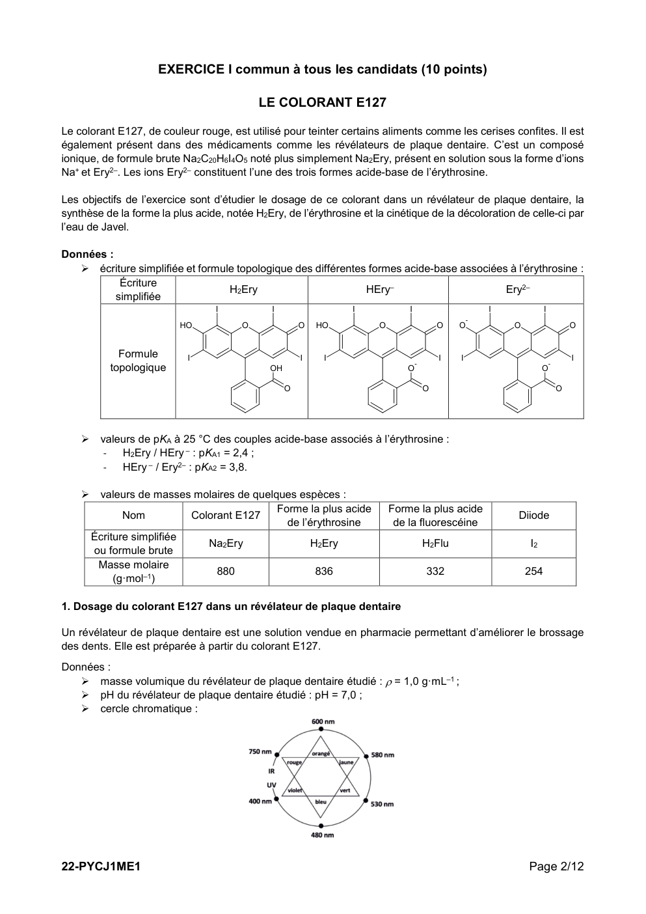

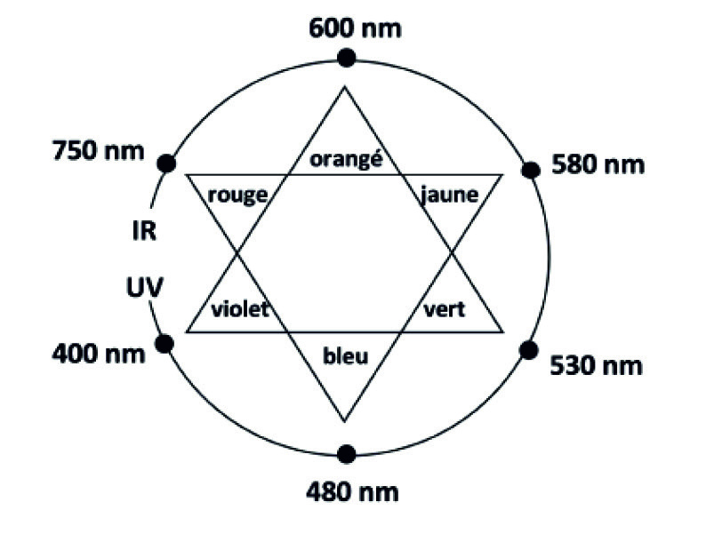

---

## Page 3

   spectre d’absorption d’une solution aqueuse du colorant E127 de concentration en soluté apporté
        égale à 1,7×10–5 mol·L–1 et de pH égal à 7,0 :

                              A
                        0,8

                        0,6

                        0,4

                        0,2

                                                                                                λ (nm)
                        0,0
                              400                   500                    600               700

Q1. À l’aide de la formule topologique de la forme H2Ery de l’érythrosine ci-dessous, nommer les familles
fonctionnelles associées aux groupes caractéristiques A, B et C.
                                                      I           I
                                    Groupe A HO               O             O Groupe B

                                                I                           I
                                                                  OH

                                                                       O
                                                                           Groupe C

Q2. Identifier, en justifiant, la forme de l’érythrosine qui prédomine dans le révélateur de plaque dentaire étudié.
Sur le site du fabriquant, il est indiqué que le révélateur de plaque dentaire, de couleur rouge, est une solution
hydroalcoolique contenant le colorant E127 à 2 % en masse.
Afin de vérifier l’indication précédente sur le titre massique, on réalise les expériences décrites ci-dessous.
Préparation de la solution à doser :
    - on introduit 0,5 mL de révélateur de plaque dentaire dans une fiole jaugée de 2,0 L que l’on complète
        avec de l’eau distillée : on obtient la solution S.
Dosage spectrophotométrique par étalonnage :
    - à partir d’une solution aqueuse de colorant E127 de concentration en soluté apporté égale à
        1,7×10–5 mol·L–1, on prépare par dilution six solutions filles ;
    - on mesure l’absorbance de chacune de ces solutions à une longueur d’onde appropriée ; les mesures
        sont reportées sur le graphe de la figure 1 ;
    - on mesure l’absorbance de la solution S à la même longueur d’onde ; on obtient A = 0,484.
                     A
                 1

              0,8

              0,6

              0,4

              0,2

                0                                                                          c (µmoL·L–1)
                    0               2       4             6       8              10      12
                        Figure 1. Évolution de l’absorbance en fonction de la concentration
                                 en quantité de matière de colorant E127 apporté

22-PYCJ1ME1                                                                                               Page 3/12

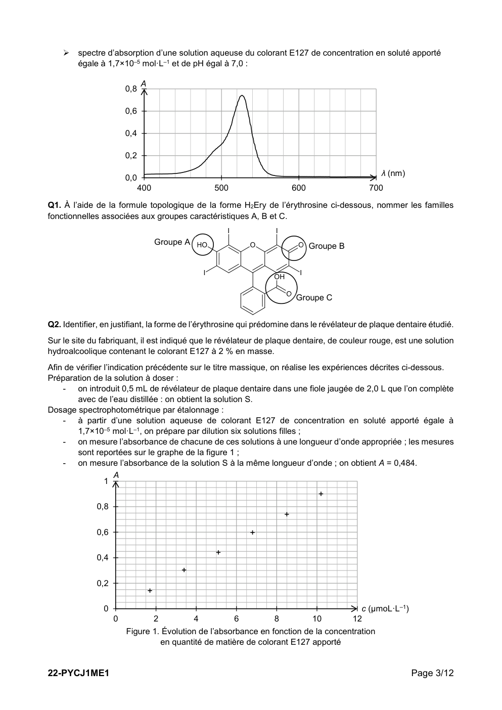

---

## Page 4

Q3. Justifier la couleur rouge du révélateur de plaque dentaire étudié.

Q4. Après avoir montré que la concentration du colorant E127 apporté dans le révélateur de plaque dentaire
est égale à 2,2×10–2 mol·L–1, déterminer la valeur du titre massique en colorant E127 du révélateur de plaque
dentaire analysé. Commenter.

Le candidat est invité à prendre des initiatives et à présenter la démarche suivie, même si elle n’a pas abouti.
La démarche est évaluée et nécessite d’être correctement présentée.

2. Synthèse de l’érythrosine à partir de la fluorescéine

L’érythrosine peut être synthétisée à partir d’un autre colorant, la fluorescéine, en présence d’acide iodique et
d’éthanol ; l’équation de la réaction modélisant cette synthèse est donnée ci-dessous :
                                                                              I             I
HO              O                O
                                                                  HO                 O               O

                                                 Acide iodique
                        OH
                                     +    4 I2
                                                   Éthanol
                                                                      I
                                                                                            OH
                                                                                                     I    +   4 HI
                             O
                                                                                                 O

     Forme H2Flu de la fluorescéine                                       Forme H2Ery de l’érythrosine

Dans une publication scientifique, on trouve les informations suivantes :
    les différentes étapes d’un protocole de synthèse de l’érythrosine :
       - étape n°1 :
          réaliser la synthèse de la forme H2Ery de l’érythrosine à partir de 5,0 g de fluorescéine H2Flu et
          de 9,5 g de diiode I2, en présence d’éthanol et d’acide iodique ;
          chauffer et agiter le mélange pendant deux heures à une température de 60 °C ;
       - étape n°2 :
          après refroidissement, filtrer le mélange à l’aide d’un filtre Büchner puis laver le solide rouge
          obtenu avec de l’eau et de l’éthanol ;
       - étape n°3 :
          mesurer la température de fusion du solide rouge obtenu.
    la valeur du rendement r de la synthèse : r = 59 %.

                      D’après N. Pietrancosta et al. / Bioorganic & Medicinal Chemistry 18 (2010) 6922–6933

Q5. Identifier le rôle des étapes n°1, n°2 et n°3 du protocole expérimental de synthèse de l’érythrosine.

Q6. Identifier l’opération du protocole expérimental réalisée pour optimiser la vitesse de formation de
l’érythrosine.

Q7. Déterminer le réactif limitant de la synthèse de l’érythrosine.

Q8. Montrer que la masse d’érythrosine de forme H2Ery obtenue expérimentalement est d’environ 4,6 g.

Q9. Déterminer le nombre de flacons de 10 mL de révélateur de plaque dentaire, de pH égal à 7 et de
concentration égale à 2,2×10–2 mol·L–1 en colorant E127, qu’il est possible de fabriquer grâce à cette synthèse.

22-PYCJ1ME1                                                                                              Page 4/12

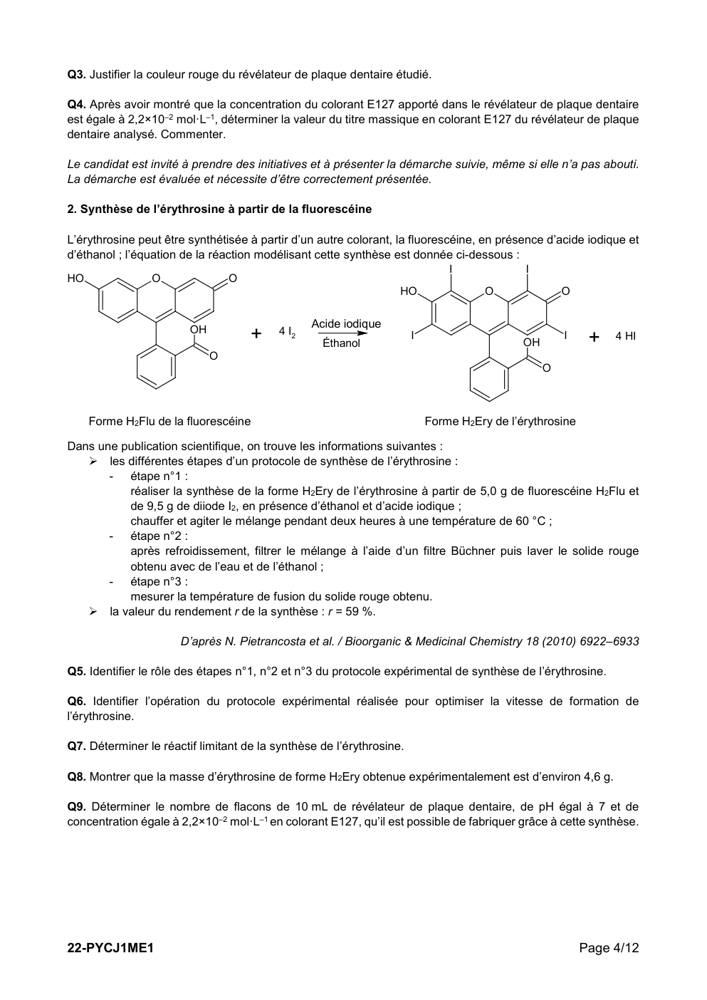

---

## Page 5

3. Suivi cinétique de la décoloration d’une solution de colorant E127 par l’eau de Javel

Le filtre Büchner utilisé lors de la synthèse précédente est coloré par les résidus de colorant E127
rouge. Pour le décolorer, on peut utiliser de l’eau de Javel.
En effet, la forme Ery2– de l’érythrosine réagit avec les ions hypochlorite CℓO– contenus dans l’eau
de Javel pour former un produit incolore. Cette réaction est supposée totale.

On réalise, à 25 °C, les deux expériences A et B décrites ci-après :
    - dans des béchers de 50 mL, deux solutions sont préparées à partir d’une solution
        commerciale d’eau de Javel de concentration en ions hypochlorite égale à 0,73 mol·L–1 :
                                      Solution                   SA             SB
                            Volume d’eau de Javel (mL)           5              10
                             Volume d’eau distillée (mL)         5               0
    - pour l’expérience A :
             • à la date t = 0 s, on verse dans le bécher contenant la solution SA un volume de 10,0 mL d’une
                 solution aqueuse de colorant E127 de concentration en soluté apporté égale à
                 1,7×10–5 mol·L–1 ;
             • on remplit rapidement une cuve spectrophotométrique avec le mélange réactionnel, on
                 l’introduit dans un spectrophotomètre réglé à une longueur d’onde appropriée et on relève les
                 valeurs d’absorbance en fonction du temps ;
    - pour l’expérience B, on recommence les mêmes opérations avec la solution SB.

Dans chacun des mélanges réactionnels préparés, l’érythrosine est présente sous la seule forme Ery2– et cette
forme est la seule espèce qui absorbe à la longueur d’onde choisie.

Les résultats obtenus permettent de tracer la courbe d’évolution de la concentration en quantité de matière de
la forme Ery2– de l’érythrosine pour l’expérience A et B (figure 2).
     [Ery2–] (µmoL·L–1)
          10

                                                                            + Expérience A
           8
                                                                            × Expérience B

           6

           4

           2

           0                                                                                                t (s)
               0                     200                 400                  600                     800

                   Figure 2. Évolution de la concentration en quantité de matière de la forme Ery2–
                                       de l’érythrosine pour l’expérience A et B

Q10. Décrire qualitativement, en exploitant la figure 2, l’évolution de la vitesse volumique de disparition de la
forme Ery2– de l’érythrosine au cours du temps pour l’expérience A. Proposer un facteur cinétique à l’origine
de cette évolution.

Q11. Déterminer graphiquement le temps de demi-réaction pour l’expérience A. Commenter.

Q12. Expliquer comment il est possible d’optimiser la décoloration du filtre Büchner.

22-PYCJ1ME1                                                                                                 Page 5/12

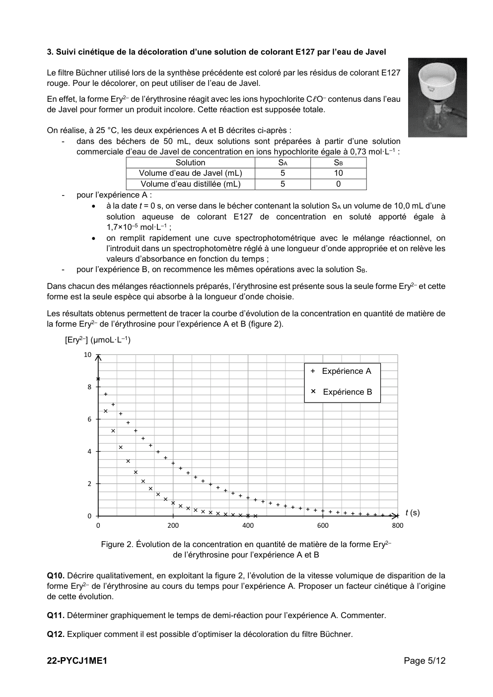

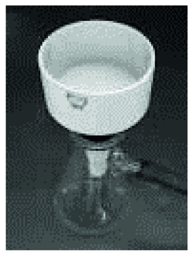

---

## Page 6

EXERCICES au choix du candidat (5 points)
                    Vous indiquerez sur votre copie les deux exercices choisis :
                              exercice A ou exercice B ou exercice C

                          Exercice A - LA PHYSIQUE DU JONGLAGE (5 points)

             MOTS-CLÉS : mouvement dans un champ de pesanteur uniforme, énergie mécanique

L’art du jonglage est la plus ancienne des disciplines de cirque connue ; son origine remonte à l’Égypte
ancienne. Le but de cet exercice est d’étudier le mouvement d’une balle lors d’une démonstration filmée.
On étudie, dans le référentiel terrestre supposé galiléen, le mouvement d’une balle de jonglage de masse m
et de centre de masse C.

Donnée :
    intensité de la pesanteur : g = 9,81 m·s–2.

La figure 1 est extraite d’une vidéo au cours de laquelle une personne jongle avec plusieurs balles. On suit le
mouvement d’une balle.

 Dans cette étude :
 - on note (x ; y) les coordonnées de la position de C dans le repère
    (O ; x ; y) et (vx ; vy) celles de sa vitesse ;
 - les évolutions temporelles y(t) et vy(t) sont respectivement représentées
    sur les figures 2a et 2b qui font apparaître alternativement des phases
    notées  et  ;
 -      à la date t = 0 s la balle, située à l’origine du repère, quitte pour la première
        fois la main du jongleur avec une vitesse initiale v�⃗0 ;
 -      lorsque la balle n’est pas en contact avec la main du jongleur, elle est en
        chute libre. Elle effectue alors un mouvement parabolique en passant              Figure 1. Photographie
        d’une main à l’autre, la réception et le lancer se faisant toujours
        en y = 0 m ;
 -     la référence de l’énergie potentielle de pesanteur est choisie à l’ordonnée y = 0 m.
     1,00      position y en m                                5,00    vitesse vy en m·s–1
     0,80                                                     4,00
                                                              3,00
     0,60
                                                              2,00
     0,40                                                     1,00                                  temps t en s
     0,20                                                     0,00
                                          temps t en s                0           0,5           1       1,5
                                                             -1,00
     0,00
              0           0,5         1        1,5           -2,00
     -0,20                                                   -3,00
     -0,40                                                   -4,00            1             2
                      1           2                          -5,00
     -0,60
             Figure 2a. Courbe représentant y(t)                     Figure 2b. Courbe représentant vy(t)

Q1. Décrire qualitativement, selon l’axe Oy, le mouvement de la balle lors de la phase  à l’aide des figures
2a et 2b.

Q2. Interpréter la figure 2a pour décrire le rôle de la main sur le mouvement de la balle lors de la phase .

22-PYCJ1ME1                                                                                            Page 6/12

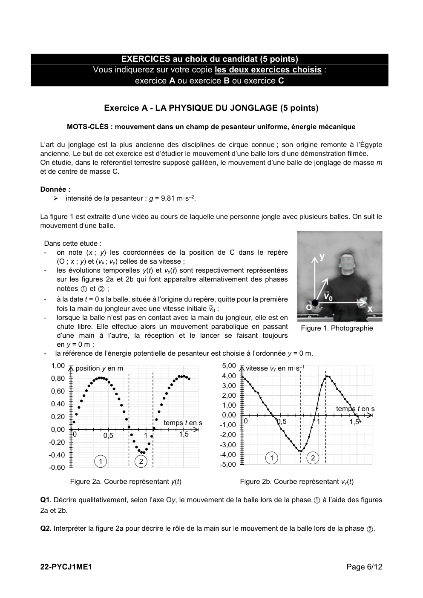

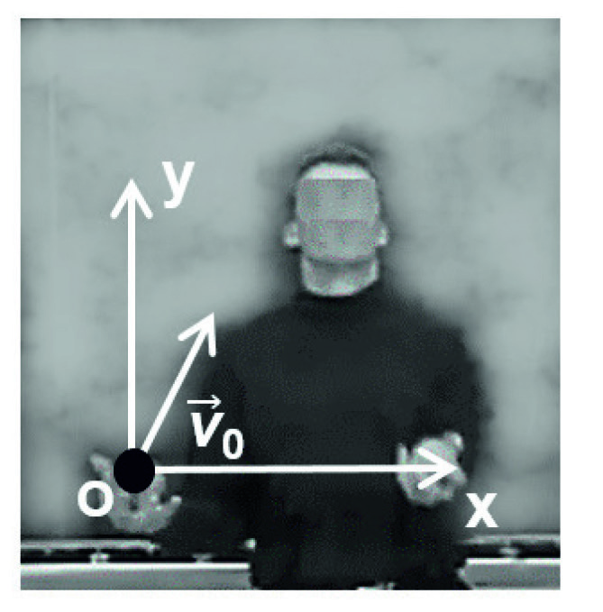

---

## Page 7

Q3. Justifier à l’aide de la deuxième loi de Newton, dans le cadre du modèle de la chute libre, que la valeur
de la composante vx de la vitesse est constante et égale à la vitesse initiale v0x lorsque la balle n’est plus en
contact avec la main du jongleur.

Q4. Exprimer l’énergie mécanique initiale Em0 de la balle en fonction de sa masse m et des composantes v0x
et v0y de la vitesse initiale dans le référentiel terrestre.

Dans toute la suite de l’exercice, on ne s’intéresse qu’à la phase .

Q5. À l’aide d’un raisonnement énergétique appliqué lors de la phase , établir que l’expression de l’altitude
maximale H atteinte par la balle s’écrit :
                                                          v20y
                                                     H=
                                                          2g

Q6. Déterminer la valeur de H à partir de la relation précédente et d’une lecture graphique de v0y sur la figure
2b. Comparer le résultat à celui obtenu par lecture graphique de la figure 2a.

Q7. Établir l’expression littérale de la coordonnée vy(t) du vecteur vitesse de la balle lors de la phase .

Q8. Évaluer l’intensité de la pesanteur g à l’aide de la figure 2b lors de la phase . Commenter.

Q9. Déterminer l’équation horaire y(t) du mouvement du centre de la balle lors de la phase .

Q10. On note tair la durée pendant laquelle la balle est en l’air lors de la phase . Établir l’expression de tair
en fonction de v0y et de g. En déduire que l’expression du temps de vol dans l’air d’une balle s’écrit :

                                                                  8H
                                                        tair =�
                                                                   g

Q11. Calculer la valeur de tair en utilisant la valeur de H obtenue par lecture graphique de la figure 2a.
Commenter.

22-PYCJ1ME1                                                                                           Page 7/12

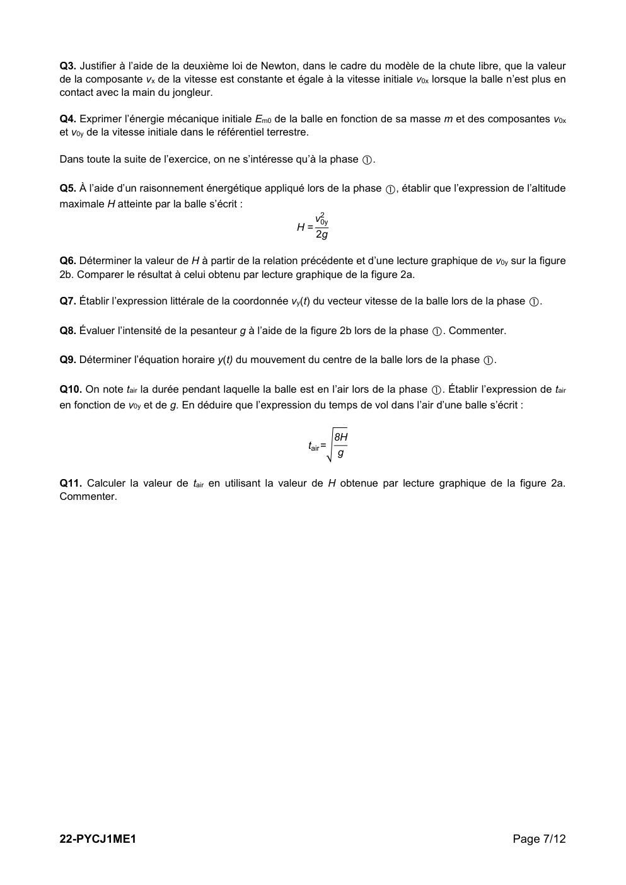

---

## Page 8

Exercice B - REFROIDISSEMENT D’UN FER À CHEVAL (5 points)

         MOTS-CLÉS : premier principe de la thermodynamique, loi de Newton de la thermique

Le maréchal-ferrant est un artisan spécialisé dans le ferrage des chevaux ; il pose un
fer sous chaque sabot du cheval afin de les protéger.

Un fer à cheval doit être parfaitement adapté à la morphologie du sabot du cheval pour
que celui-ci ne se blesse pas. Cela nécessite un ensemble d’opérations réalisées lors
de la pose du fer par le maréchal-ferrant : le fer est chauffé à une température d’environ
900 °C dans une forge pour être malléable. À l’aide d’un marteau, il est ensuite déformé
pour s’ajuster à la forme du sabot.

Données :
    température du fer à la sortie de la forge : θ0 = 900 °C ;
    volume du fer à cheval : VFer = 104 cm3 ;
    masse volumique du fer, supposée indépendante de la température : ρFer = 7,87 g∙cm–3 ;
    surface extérieure du fer à cheval : S = 293 cm2 ;
    température ambiante extérieure : θExt = 15 °C ;
    capacité thermique massique du fer supposée indépendante de la température :
                                              cFer = 440 J∙kg–1∙K–1 ;
    loi de Newton donnant l’expression du flux thermique reçu par le système {fer à cheval}, de
      température θ en provenance de l’air extérieur, de température θExt :
                                                Φ = h · S · (θExt – θ)
      avec h le coefficient de transfert thermique surfacique et S la surface d’échange :
      - dans l’air : hair = 14 W·m–2·K–1 ;
      - dans l’eau froide : heau = 360 W·m–2·K–1.

1. Chauffage du fer

Lors du chauffage du fer à cheval pour le rendre plus malléable, sa température passe de la température
ambiante θExt = 15 °C à θ0 = 900 °C.

Q1. Déterminer la valeur de la masse mFer du fer à cheval.

Q2. Calculer la variation d’énergie interne ΔU du fer à cheval lors de cette étape.

Q3. Interpréter au niveau microscopique la variation d’énergie interne ΔU du fer à cheval.

2. Refroidissement du fer

Lorsque le fer est à la température souhaitée de 900 °C, le maréchal-ferrant le sort de la forge et le façonne à
l’aide d’un marteau pendant une minute environ. Il s’installe ensuite près du cheval et il s’écoule à nouveau
environ une minute.

Le fer, encore chaud, est alors posé quelques secondes sur la face inférieure du sabot, ce qui est sans douleur
pour l’animal, mais brûle la corne en laissant une trace. Cela permet au maréchal-ferrant de juger si la forme
est satisfaisante. Si c’est le cas, il refroidit rapidement le fer en le trempant dans l’eau puis le fixe définitivement
sur le sabot à l’aide de clous.

2.1. Refroidissement à l’air libre

On considère que les transferts thermiques entre le fer à cheval et le milieu extérieur suivent la loi de Newton.
Le système étudié est le fer à cheval.

22-PYCJ1ME1                                                                                                Page 8/12

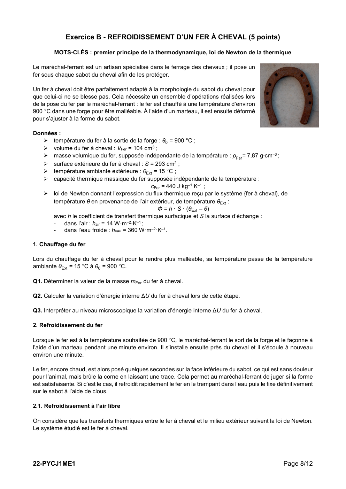

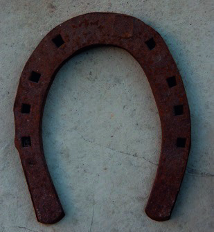

---

## Page 9

Q4. Le maréchal-ferrant martèle le fer à cheval dans l’air. Appliquer le premier principe de la thermodynamique
pour le système étudié entre les instants t et t + ∆t ; la durée ∆t étant supposée faible devant une durée
caractéristique d’évolution de la température et la température variant de θ(t) à θ(t + ∆t).

En déduire que l’équation différentielle régissant l’évolution de la température du fer à cheval peut s’écrire
sous la forme :

                                     dθ       θ        θExt                     mFer ∙ cFer
                                          +        =            avec     𝜏𝜏 =
                                     dt       𝜏𝜏        𝜏𝜏                          hair · S

Dans ces conditions 𝜏𝜏 = 880 s.

L’équation différentielle précédente admet pour solution la fonction :

                                                                                t
                                                       θ(t) = (θ0 – θExt )·e– 𝜏𝜏 + θExt

Q5. Vérifier que la fonction proposée θ(t) est bien solution de l’équation différentielle précédente.

Q6. Calculer la valeur de la température du fer au moment où le maréchal-ferrant le pose sur la face inférieure
du sabot du cheval. Commenter.

2.2. Refroidissement dans l’eau avant la pose.

Pour accélérer le refroidissement du fer afin de le poser rapidement sur le sabot, le maréchal-ferrant plonge
le fer encore chaud à la température de 600 °C dans un récipient contenant de l’eau à température ambiante
de 15 °C que l’on considère comme constante.

Q7. En adaptant la solution obtenue dans le cadre du modèle précédent, estimer la valeur de la durée
nécessaire pour que le fer soit refroidi à une température θfinale = 40 °C à laquelle l’artisan pourra poser le fer
à l’aide de clous sur le sabot du cheval.

Le candidat est invité à prendre des initiatives et à présenter la démarche suivie, même si elle n’a pas abouti.
La démarche est évaluée et nécessite d’être correctement présentée.

Q8. Dans la réalité, 20 secondes suffisent pour refroidir le fer dans de l’eau à 15 °C. Commenter.

22-PYCJ1ME1                                                                                             Page 9/12

---

## Page 10

Exercice C – DÉFIBRILLATEUR CARDIAQUE (5 points)

                                         MOT-CLÉ : modèle du circuit RC série

 D’après une étude menée par l’université de Lille en 2018, chaque
 année, environ 46 000 arrêts cardiaques se produisent en dehors des
 hôpitaux. C’est pourquoi les établissements accueillant du public, sont
 progressivement tenus d’installer un défibrillateur cardiaque.

 Cet appareil permet d’appliquer un choc électrique sur le thorax d'un
 patient dont le cœur se contracte de façon irrégulière et inefficace.

 L’objectif de cet exercice est de comprendre le fonctionnement d’un
 défibrillateur au travers d’un modèle simplifié.

                                                                                  Un défibrillateur installé en lycée

Le circuit électrique d’un défibrillateur cardiaque peut être modélisé de façon simplifiée par le circuit représenté
en figure 1 contenant :
     - un circuit de charge constitué de l’association en série d’un générateur de tension E, d’un conducteur
         ohmique de résistance r et d’un condensateur de capacité C ;
     - un circuit de décharge constitué du condensateur chargé et d’un conducteur ohmique de résistance
         R équivalente à celle du thorax du patient ;
     - un interrupteur à deux positions (1 ou 2) qui permet de fermer soit le circuit de charge soit le circuit de
         décharge.
                                                               1     2
                                                 i

                ur
                        r
                                                                                                           R (résistance
                                                          uC         C                                     équivalente à
                E                                                                                             celle du
                             G
                                                                                                             thorax du
                                                                                                              patient)

                            Figure 1. Schéma électrique simplifié d’un défibrillateur cardiaque

On s’intéresse à la charge du condensateur du défibrillateur. À la date t = 0 s, l’utilisateur déclenche la charge
du condensateur de capacité C considéré comme initialement totalement déchargé.

Q1. Indiquer dans quelle position est basculé l’interrupteur pour réaliser la charge du condensateur du circuit
schématisé figure 1.

Q2. À l’aide de la loi des mailles, montrer que l’équation différentielle régissant l’évolution de la tension uC (t)
aux bornes du condensateur lors de sa charge est :
                                                     duC (𝑡𝑡)
                                                r·C·          + uC (𝑡𝑡) = E
                                                       dt
                                                                                                   𝑡𝑡
                                                                                               –
Q3. Vérifier que la solution de cette équation différentielle est uC (t) = E × �1 − 𝑒𝑒 𝜏𝜏𝑐𝑐ℎ𝑎𝑎𝑎𝑎𝑎𝑎𝑎𝑎 � en précisant

l’expression et l’unité de la constante 𝜏𝜏𝑐𝑐ℎ𝑎𝑎𝑎𝑎𝑎𝑎𝑎𝑎 .

Q4. Tracer l’allure de la courbe donnant l’évolution temporelle de la tension aux bornes du condensateur lors
de sa charge, en précisant les valeurs de uC (t) à t = 0 s et au bout d’un temps très long.

22-PYCJ1ME1                                                                                             Page 10/12

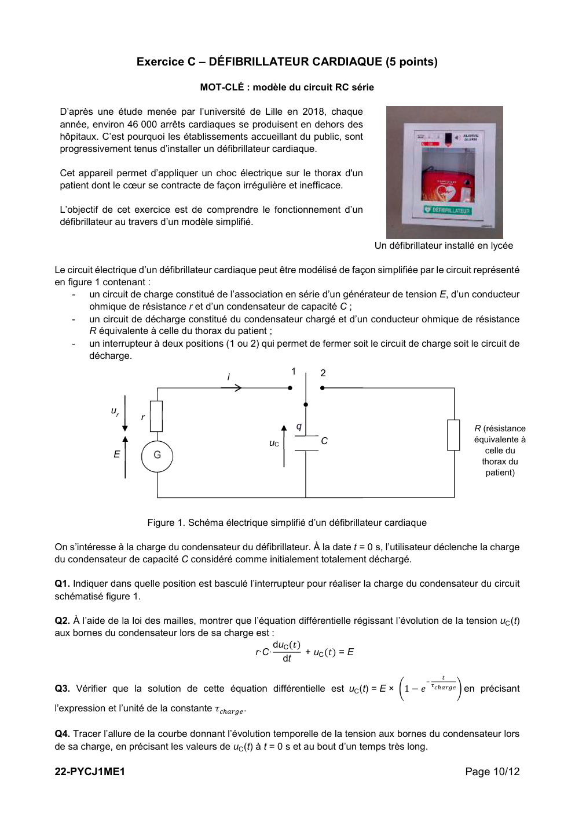

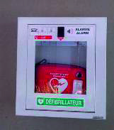

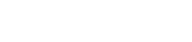

---

## Page 11

Q5. Montrer qu’à la date t1 = 5 × 𝜏𝜏charge , la tension aux bornes du condensateur uC (t) a atteint 99 % de sa
valeur finale.

On s’intéresse maintenant à la décharge du condensateur et on réalise le montage de la figure 1 avec un
conducteur ohmique de résistance R = 10 kΩ et un condensateur de capacité C = 1,5 µF, permettant d’avoir
un temps caractéristique proche de celui d’un défibrillateur commercial.

On suit l’évolution de la tension uC (t) aux bornes du condensateur initialement chargé. La courbe
expérimentale obtenue est représentée en ANNEXE À RENDRE AVEC LA COPIE.

Q6. Déterminer graphiquement l’instant t2 où l’interrupteur a été basculé de la position 1 à la position 2.

Q7. En faisant apparaître clairement la démarche sur l’ANNEXE À RENDRE AVEC LA COPIE, évaluer
graphiquement le temps caractéristique de décharge τgraph . Commenter.

Sur la notice d’un défibrillateur commercial, les valeurs suivantes sont annoncées :
    - durée totale de charge : moins de 10 secondes ;
    - durée de délivrance du choc : moins de 4 secondes ;
    - tension appliquée à la victime adulte : environ 2 000 V ;
    - valeur de la capacité C = 170 µF.

Q8. Sachant que, dans ces conditions d’utilisation, la résistance électrique offerte par le corps d’un adulte est
comprise entre 50 Ω et 150 Ω, estimer la durée nécessaire pour que la décharge du condensateur du
défibrillateur soit considérée comme totale. Commenter.

22-PYCJ1ME1                                                                                        Page 11/12

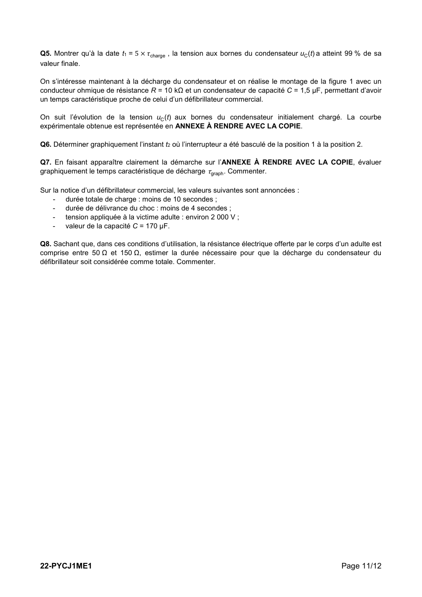

---

## Page 12

Page blanche laissée intentionnellement.

                 Ne rien inscrire dessus.

22-PYCJ1ME1

---

## Page 13

ANNEXE à rendre avec la copie

                      Evolution de la tension uc(t) aux bornes du condensateur
 tension uC (V)
7,0

6,0

5,0

4,0

3,0

2,0

1,0

0,0
   0,000    0,020   0,040   0,060    0,080    0,100    0,120    0,140    0,160   0,180       0,200
                                                                                         temps (s)

22-PYCJ1ME1                                                                         Page 12/12

---

## Page 14

