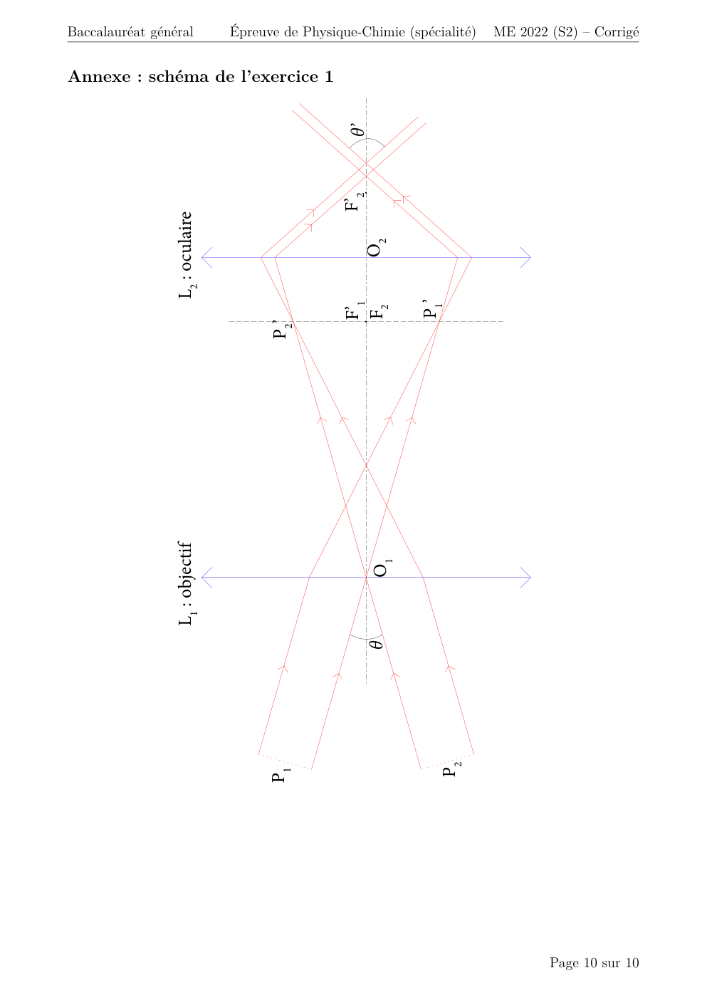

# spe-physique-chimie-2022-metropole-2-corrige

> Source : `../../../pdf_version/10_pc/2022/spe-physique-chimie-2022-metropole-2-corrige.pdf` — conversion Markdown (texte + visuels utiles).
> Stratégie : [STRATEGIE_MARKDOWN.md](../../../STRATEGIE_MARKDOWN.md)

---

## Page 1

Baccalauréat général
              Session 2022 – Métropole

 Épreuve de Physique-Chimie
Sujet de spécialité — Proposition de corrigé
                   Sujet 2

         Ce corrigé est composé de 10 pages.

---

## Page 2

Baccalauréat général       Épreuve de Physique-Chimie (spécialité)          ME 2022 (S2) – Corrigé

Exercice 1 —           Observation de la planète Mars
1. Observation de Mars avec une lunette astronomique
Q1. Voir schéma en dernière page (page 10).
Q2. La propriété d’une lunette afocale est qu’elle permet à l’observateur de voir, au-travers
    de l’oculaire, l’image d’un objet virtuel situé « à l’infini ». Autrement dit, l’œil de l’ob-
    servateur n’aura pas à accomoder pour regarder au-travers de la lunette.
    Pour être afocal, le système constitué de deux lentilles doit être constitué de manière à
    ce que le foyer image de la première soit confondu avec le foyer objet de la seconde.
    On place donc ces points sur le schéma en annexe.
Q3. Voir schéma.
Q4. On a le grossissement :
                                                 f1 ′ 900
                                       Glunette = ′ =     = 45
                                                 f2    20
Q5. Le pouvoir séparateur de l’œil humain (normalement constitué) étant ε = 2, 9 × 10−4 rad,
    on remarque que θ = 4, 9 × 10−5 rad < ε. L’observateur ne pourra donc pas distinguer les
    deux points diamétralement opposés, et assimilera donc Mars à un point lumineux.
Q6. La lunette a un grossissement Glunette =. Mars sera alors perçue avec un angle

                        θ′ = Glunette θ = 45 × 4, 9 × 10−5 = 2, 2 × 10−3 rad > ε

     L’observateur pourra donc bien distinguer les deux points.

2. Détermination du diamètre de Mars
Q7. On a les angles θ1 > θ2 . Le point A correspond donc à θ1 , tandis que B correspond à θ2 .
    Graphiquement, on lit θ1 = 1, 2 × 10−4 rad et θ2 = 1, 8 × 10−5 rad.
Q8. On cherche l’expression du diamètre de Mars en fonction des données du problème. On
    va donc faire de la trigonométrie.
    Au plus proche de la Terre, on a :
                                                    !
                                               θ1           dM
                                           tan          =                                      (1)
                                               2            2D1

     De la même manière, au plus loin de la Terre :
                                                    !
                                               θ2           dM
                                           tan          =                                      (2)
                                               2            2D2

     Or, vu que les angles θ1 et θ2 sont très faibles devant 1, on a tan(θ1(2) ) ∼ θ1(2)
     On a alors, en sommant les inverses de (1) et (2) :

                          2   2   2D1 2D2    1   1   D1 + D2
                            +   =    +    =⇒   +   =
                          θ1 θ2   dM   dM    θ1 θ2     dM

     Et comme D1 + D2 = 2rSM :

                               1   1   2rSM           2rSM
                                 +   =      =⇒ dM =  1     
                               θ1 θ2    dM              + 1       θ1   θ2

                                                                                     Page 2 sur 10

---

## Page 3

Baccalauréat général        Épreuve de Physique-Chimie (spécialité)          ME 2022 (S2) – Corrigé

 Q9. D’où, à partir des données :

                                          2 × 2, 28 × 108
                                dM =        1          1
                                                                = 7137 km
                                         1,2×10−4
                                                  + 1,8×10−5

      Le diamètre ainsi mesuré pour la planète Mars est donc de dM = 7137 km. Ce qui est
      légèrement surévalué (environ 5 %) par rapport au diamètre moyen de référence, mais
      reste suffisamment proche pour être une mesure cohérente.

3. Détermination de la masse de Mars
Q10. On cherche à exprimes la vitesse de Phobos en orbite autour de Mars.
     Pour cela, on va appliquer la loi de quantité de mouvement à Phobos, supposé ponctuel
     de masse mP constante, en orbite circulaire uniforme autour de Mars, dans le référentiel
     Martien, en travaillant dans le repère de Frenet (P ; ⃗n, ⃗t)
     La seule force s’exerçant sur Phobos étant l’attraction gravitationnelle de Mars, il vient :
                                             MM mP               MM
                                 mP ⃗a = G         2
                                                     ⃗n =⇒ a = G
                                              rM P               rM P 2

      Et comme, pour un mouvement circulaire uniforme, on a a = v 2 /r, et en remarquant
      que :
                                           MM        1
                                               
                                  a= G            ×
                                           rM P     rM P
      Il vient finalement :                 s
                                              GMM
                                       v=
                                               rM P
Q11. De la formule que l’on vient de démonter, il vient :

                                             MM           v 2 rM P
                                    v2 = G        =⇒ MM =
                                             rM P             G

      Et comme Phobos décrit une orbite circulaire de rayon rM P , il parcourra, en une période
      T , une distance de 2πrM P , alors on a :
                                                    2πrM P
                                               v=
                                                      T
      Et finalement, en injectant dans l’expression de MM :

                              4π 2 rM P 3            4π 2 × (9, 38 × 103 )3
                       MM =               =
                                GT 2        6, 67 × 10−11 × (7 × 3600 + 39 × 60)2

      D’où, MM = 6, 44 × 1023 kg. Ce qui est une valeur cohérente comparée à la masse de la
      Terre.

                                                                                      Page 3 sur 10

---

## Page 4

Baccalauréat général       Épreuve de Physique-Chimie (spécialité)      ME 2022 (S2) – Corrigé

Exercice A —           L’arôme de vanille
1. Étude de produits commerciaux « vanillés »
Q1. La vanilline a pour formule brute C7 H8 O3 tandis que l’éthylvanilline a pour formule brute
    C9 H10 O3 . On remarque donc que leurs formules brutes sont différentes, les deux espèces
    ne peuvent donc pas être des isomères.
Q2. On a la formule topologique de la vanilline :

Q3. On repère alors, sur cette formule topologique, les groupes hydroxyle (fonction alcool) en
    bleu, et carbonyle (fonction aldéhyde) en rouge.
Q4. On a, après agitation, l’ampoule à décanter :

                                                    Phase organique
                                                    (acétate d’éthyle
                                                      + vanilline)

                                               Phase aqueuse
                                               (eau + NaCl)

Q5. On repère les produits contenant de la vanilline par la présence, en CCM, d’un front
    correspondant à celui de la vanilline pure (commerciale).
    Les espèces répondant à ce critère sont les produits P1 et P2.

2. Titrage de la vanilline contenue dans le produit 1
Q6. En début de titrage, on se place à pH = 9, 75 > pKa. La vanilline se trouve donc bien
    sous sa forme basique A− .

                                                                                 Page 4 sur 10

---

## Page 5

Baccalauréat général      Épreuve de Physique-Chimie (spécialité)      ME 2022 (S2) – Corrigé

Q7. La réaction support du titrage est la réaction acide-base entre l’acide chlorhydrique et
    l’ion vanillinate :
                                 A− + H3 O+ −−→ AH + H2 O
Q8. On souhaite vérifier si l’appellation « extrait de vanille » peut être attribuée à l’extrait
    étudié. Pour cela, on va exploiter le titrage afin de déterminer la masse de vanilline dans
    l’échantillon.
    À l’équivalence, on a :
                                                                         CVE
                       n(A− ) = n(H3 O+ ) =⇒ CA V0 = CVE =⇒ CA =
                                                                          V0

     De plus, en masse, on a Cm,A = CA M
     D’où,
                          CVE           4, 1 × 10−3 × (12, 6 − 2, 2)
                Cm,A = M        = 152 ×                              = 0, 13 g · L−1
                            V0                      50
     Chaque litre de solution préparée à partir du produit 1 contient donc 0, 13 grammes
     de vanilline. Alors, en particulier, les 100 mL préparés par introduction d’une masse
     m0 = 0, 31 g de produit commercial contiennent 0, 13/10 = 0, 013 grammes de vanilline.
     Il vient donc la proportion de vanilline PV par kilogramme de produit commercial :
                                             0, 013
                                  PV =                = 42 g · kg−1
                                         0, 31 × 10−3

     Cette proportion étant bien supérieure aux 2 grammes minimum, le produit 1 peut com-
     porter l’inscription « extraits de vanille ».

                                                                                  Page 5 sur 10

---

## Page 6

Baccalauréat général           Épreuve de Physique-Chimie (spécialité)            ME 2022 (S2) – Corrigé

Exercice B —                Encre et effaceur
1. Encre des stylos plume
Q1. On remarque, sur le spectre d’absorption, un maximum d’absorption à λ = 580 nm. La
    couleur de cet échantillon sera donc l’opposé de ce maximum d’absorption sur l’étoile
    chromatique, à savoir du bleu.
Q2. Pour la préparation de la solution S2 , il faudra une pipette jaugée de 5 mL et une fiole
    jaugée de 100 mL.
Q3. On a la loi de Beer-Lambert à λmax :
                                                             A       0, 74
                                     A = εℓC2 =⇒ C2 =           =
                                                             εℓ   5 × 104 × 1
     D’où, C2 = 1, 48 × 10−5 mol · L−1 concentration molaire de bleu d’aniline de la solution
     S2 .
Q4. La solution S2 est préparée par dilution 20 fois de la solution S1 . Il vient alors, dans la
    solution S1 : C1 = 20C2 = 2, 96 × 10−4 mol · L−1 .
    Autrement dit, dans la cartouche d’encre, ayant été vidée intégralement pour obtenir S1 ,
    il y a n1 = C1 V1 moles de bleu d’aniline. Ce qui fait, en masse :

                                                   m1 = n1 Mbleu

     Et comme la masse d’encre dans une cartouche vaut mencre = ρencre Vcartouche , il vient
     finalement le titre massique de bleu dans une cartouche :

                                                   m1        C1 V1 Mbleu
                                           %m =          =
                                                  mencre   ρencre Vcartouche

     D’où,
                                           2, 96 × 10−4 × 0, 1 × 737, 7
                                    %m =                                = 3, 3 %
                                                    1, 1 × 0, 6
     La cartouche d’encre ne contient donc bien que %m = 3, 3 % en masse de bleu d’aniline,
     ce qui est conforme aux données du texte introductif.

2. Effaceur d’encre
Q5. On a le diagramme de prédominance des couples associés à l’ion sulfite :

                             1, 8          HSO3−           7,0                 SO32−
             (SO2 , H2 O)
                              |                             |
                            pKa1                          pKa2                                 pH

     On remarque donc que dans la solution S, de pH = 11 > 7, la forme majoritaire est
     SO32− .
Q6. On a, pour le diiode, la demi-équation électronique :

                                                   I2 + 2 e− = 2 I−

     En combinant cette demi-équation avec celle du couple SO42− /SO32− , il vient la réaction
     support du titrage :

                               I2 + SO32− + 2 OH− −−→ 2 I− + SO42− + H2 O

                                                                                           Page 6 sur 10

---

## Page 7

Baccalauréat général       Épreuve de Physique-Chimie (spécialité)   ME 2022 (S2) – Corrigé

Q7. On a, à l’équivalence, nSO 2− = nI2 . D’où, en concentration et volume :
                               3

                   nSO 2− = CI2 VE = 1, 0 × 10−2 × 8, 2 × 10−3 = 8, 2 × 10−5 mol
                       3

     La quantité de matière en ions sulfite est donc bien proche de 8 × 10−5 mol.
Q8. On a démontré précédemment qu’une cartouche d’encre contenait une quantité de matière
    nb = 3, 0 × 10−5 mol de bleu d’aniline.
    Une mole d’ions sulfite permettant d’effacer une mole de bleu d’aniline, il vient :
                                          nSO 2−       8, 2
                                             3
                                     N=            =        = 2, 7
                                            nb         3, 0

     Un seul effaceur permet donc d’effacer l’équivalent de N = 2 cartouches entières.

                                                                                   Page 7 sur 10

---

## Page 8

Baccalauréat général        Épreuve de Physique-Chimie (spécialité)     ME 2022 (S2) – Corrigé

Exercice C —           Des piles historiques
1. Étude de la pile Volta
Q1. On a, pour les couples du zinc et du dihydrogène, les demi-équations électroniques :
                                        
                                         Zn2+ + 2 e− = Zn(s)
                                         2 H+ + 2 e− = H (g)
                                                             2

     En les sommant, il vient alors :

                                     Zn(s) + 2 H+ −−→ Zn2+ + H2 (g)

     Qui est bien la transformation en jeu lorsque la cellule débite.
Q2. L’électrode jouant le rôle de cathode est celle étant le siège d’une réduction. L’électrode
    jouant ce rôle est donc celle de cuivre au niveau de laquelle les ions hydrogène sont réduits
    en dihydrogène gazeux.
Q3. On complète le schéma qui est donné en annexe :

                                                              e-

                                                      •–COM
                                                     Zinc

                                           Feutre
                          Cellule          imbibé de
                       élémentaire
                                           cations et d’anions

                                                    Cuivre
                                                      +

                                                       •V          i
                               Cation

                               Anion

Q4. Le voltmètre est branché de manière à faire entrer les électrons par la borne COM et les
    faire sortir par la borne V, il est donc cohérent que la tension mesurée soit positive.
Q5. Sur le graphique qui nous est donné, on peut faire l’hypothèse que la tension électrique
    est linéairement dépendante du nombre de cellules.
    On a alors, par lecture graphique du coefficient directeur de la droite,

                                               U = 0, 9N

Q6. Selon ce modèle, pour obtenir un courant U = 100 V, il faudrait N = 100/0, 9 = 112
    cellules.
    Ce qui rend la pile Volta non envisageable pour des tensions supérieures à la dizaine de
    volts.

                                                                                  Page 8 sur 10

---

## Page 9

Baccalauréat général      Épreuve de Physique-Chimie (spécialité)         ME 2022 (S2) – Corrigé

2. La pile Daniell
Q7. L’équation de fonctionnement de la pile est :

                                  Cu2+ + Zn(s) −−→ Cu(s) + Zn2+

     Sachant que les quantités de matière initiales sont nZn,0 = 100/65, 4 = 1, 53 mol et
     nCu2+ ,0 = 0, 100 × 0, 1 = 0, 01 mol, le réactif limitant sera donc bien l’ion cuivre II.
Q8. On a la capacité électrique de la pile :

                                            Q = n(e− )F

     Mais on sait que l’on a aussi la relation en fonction du courant :

                                               Q = i∆t

     D’où, il vient :
                                 n(e− )F   2 × 9, 65 × 104
                          ∆t =           =                 = 9, 65 × 106 s
                                    i        20 × 10−3
     La pile pourra donc alimenter un appareil fonctionnant à i = 20 mA pendant ∆t = 2681 heures.
     Elle est donc toute indiquée pour alimenter durablement des petits appareils pour lesquels
     on cherchera à avoir une durée de fonctionnement sans charge relativement longs, comme
     par exemple des appareils auditifs (on notera que 2681 heures = 111 jours).

                                               * *
                                                *

                                   Proposé par T. Prévost (thomas.prevost@protonmail.com),
                                                     pour le site https://www.sujetdebac.fr/
                                                                             Compilé le 16 mai 2022.

                                                                                    Page 9 sur 10

---

## Page 10

Baccalauréat général            Épreuve de Physique-Chimie (spécialité)   ME 2022 (S2) – Corrigé

Annexe : schéma de l’exercice 1

                                                  θ’
                                                 F’2
                L2 : oculaire

                                                    O2

                                                             P1’
                                                 F’1
                                                 F2
                                     P 2’
                L1 : objectif

                                                     O1
                                                     θ

                                                                P2
                                     P1

                                                                                  Page 10 sur 10

