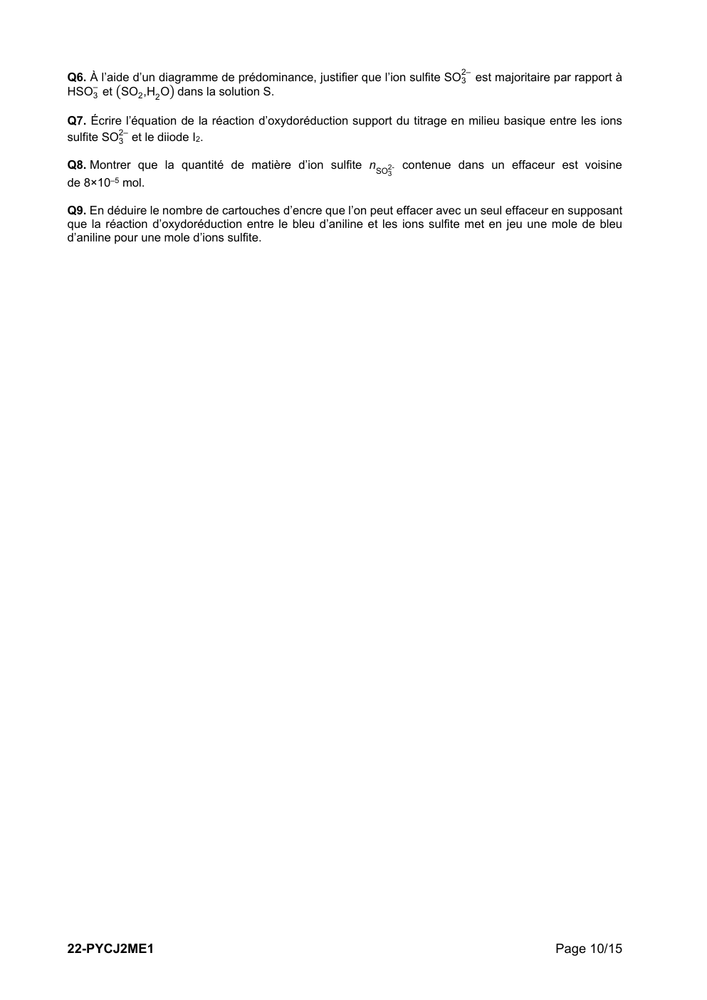
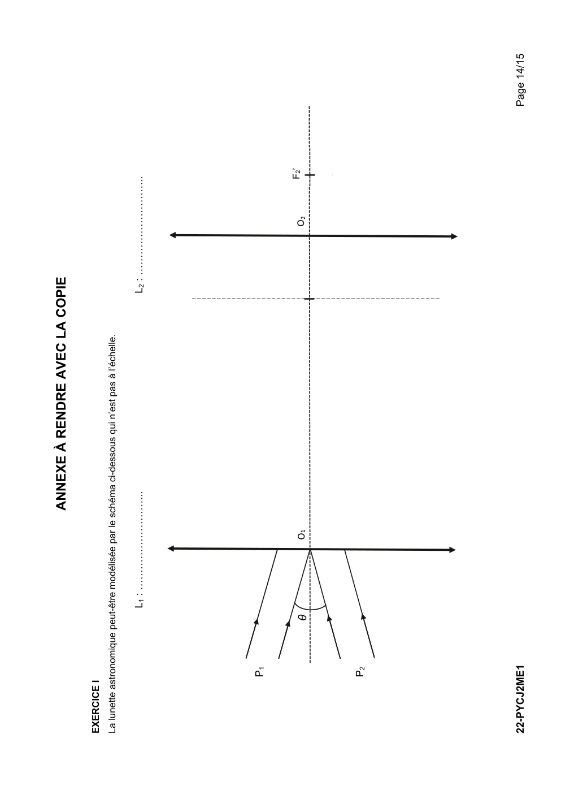
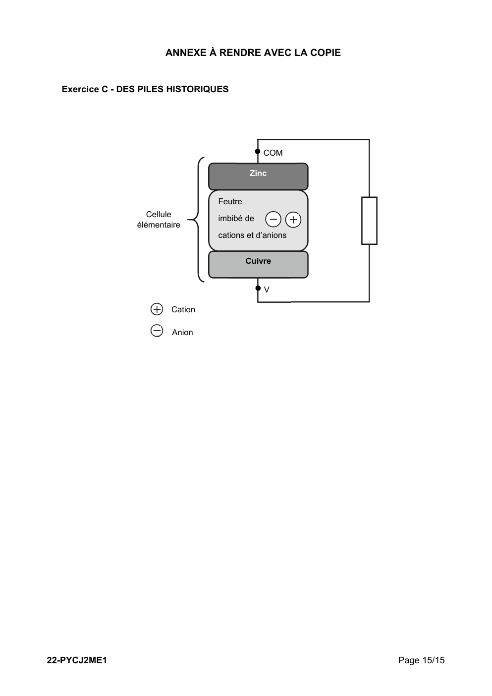

# spe-physique-chimie-2022-metropole-2-sujet-officiel

> Source : `../../../pdf_version/10_pc/2022/spe-physique-chimie-2022-metropole-2-sujet-officiel.pdf` — conversion Markdown (texte + visuels utiles).
> Stratégie : [STRATEGIE_MARKDOWN.md](../../../STRATEGIE_MARKDOWN.md)

---

## Page 1

BACCALAURÉAT GÉNÉRAL

                  ÉPREUVE D’ENSEIGNEMENT DE SPÉCIALITÉ

                                  SESSION 2022

                          PHYSIQUE-CHIMIE

                               Jeudi 12 mai 2022

                     Durée de l’épreuve : 3 heures 30

           L’usage de la calculatrice avec mode examen actif est autorisé.
        L’usage de la calculatrice sans mémoire, « type collège » est autorisé.

           Dès que ce sujet vous est remis, assurez-vous qu’il est complet.
             Ce sujet comporte 15 pages numérotées de 1/15 à 15/15.

      Le candidat traite 3 exercices : l’exercice 1 puis il choisit 2 exercices
                              parmi les 3 proposés.

              Les annexes pages 14 et 15 sont à rendre avec la copie.

22-PYCJ2ME1                                                                       Page 1/15

---

## Page 2

EXERCICE I commun à tous les candidats (10 points)

                             OBSERVATION DE LA PLANÈTE MARS
La planète Mars est une planète du système solaire au cœur de multiples projets
scientifiques internationaux destinés à mieux connaitre son sol et son histoire.

Les objectifs de l’exercice sont de déterminer quelques caractéristiques de la
planète Mars à partir :
    - de la mesure de l’angle sous lequel elle est vue par un observateur
        terrestre ;
    - de l’observation de Phobos, l’un de ses satellites naturels.                          Source : Wikipédia
Données :
    angle θ, exprimé en radian, sous lequel la planète Mars est vue par un observateur terrestre :

       on se place dans le cadre de l’approximation des petits angles (θ << 1 rad) :
        - tan (θ ) ≈ θ avec θ en rad ;
        - la distance Terre-Mars, notée D, étant suffisamment grande devant le diamètre de Mars,
            noté dM, l’angle θ (en rad) a pour expression :
                                                            dM
                                                        θ
                                                                 D
       pouvoir séparateur de l’œil humain : il correspond à l’angle minimal, noté ε, au-dessus duquel l’œil
        humain peut différencier deux points. Il a pour valeur ε = 2,9×10–4 rad ;
       constante de gravitation universelle : G = 6,67×10–11 m3·kg–1·s–2 ;
       diamètre moyen de référence de la planète Mars : dRef = 6,78×103 km ;
       rayon de l’orbite, supposée circulaire, de Mars autour du Soleil : rSM = 2,28×108 km ;
       masse de la Terre : MT = 5,97×1024 kg.

1. Observation de Mars avec une lunette astronomique

On peut observer la planète Mars avec une lunette astronomique afocale composée de deux lentilles
minces convergentes L1 et L2 de distances focales respectives f1’ = 900 mm et f2’ = 20 mm. Le schéma
donné en ANNEXE À RENDRE AVEC LA COPIE représente des rayons lumineux provenant des deux
points de Mars P1 et P2.

Ces deux points sont :
  - situés à la surface de Mars ;
  - supposés à l’infini ;
  - diamétralement opposés ;
  - écartés d’un angle θ correspondant à l’angle sous lequel la planète Mars est vue par un observateur
     terrestre ;
  - observés depuis la surface de la Terre.

Q1. Indiquer sur le schéma en ANNEXE À RENDRE AVEC LA COPIE, au-dessus de la lentille
correspondante, la lentille qui joue le rôle d’objectif et celle qui joue le rôle d’oculaire.

Q2. Citer la propriété caractéristique d’une lunette astronomique dite « afocale ». Donner la position du
foyer objet F2 de la lentille L2 par rapport à celle du foyer image F1’ de la lentille L1 de cette lunette. Placer
ces deux points sur le schéma en ANNEXE À RENDRE AVEC LA COPIE.

22-PYCJ2ME1                                                                                          Page 2/15

---

## Page 3

Q3. Tracer sur le schéma en ANNEXE À RENDRE AVEC LA COPIE la marche des rayons lumineux issus
des points P1 et P2 de Mars :
   - à travers la lentille L1 en faisant apparaître les images intermédiaires P1 ’ et P2 ’, des points P1 et P2 ;
   - puis à travers la lentille L2 en faisant apparaître l’angle θ ’ sous lequel la planète Mars est vue en
      sortie de la lunette.

On admet que le grossissement de la lunette astronomique afocale s’exprime par la relation :

                                                               f1 ’
                                                  Glunette =
                                                               f2 ’

Q4. Calculer la valeur du grossissement Glunette de la lunette utilisée.

En janvier 2021, l’angle sous lequel la planète Mars est vue par un observateur terrestre à l’œil nu était
de θ = 4,9×10–5 rad. Cet observateur voit alors un point lumineux.

Q5. Justifier cette observation.

Q6. Indiquer ce qu’il observe en utilisant la lunette astronomique précédente. Justifier par un calcul.

2. Détermination du diamètre de Mars

À l’aide des mesures effectuées en début de chaque mois avec la lunette astronomique, on détermine
l’angle θ sous lequel la planète Mars est vue par un observateur terrestre à partir de janvier 2018.

Lorsque Mars n’est pas visible, on utilise des données simulées.

Les valeurs de l’angle θ sont représentées en fonction du temps t sur la figure 1. La date t = 0 correspond
au 1er janvier 2018.

            θ en rad
1,40E-04

                         A
1,20E-04

1,00E-04

8,00E-05

6,00E-05

4,00E-05

2,00E-05                                        B

0,00E+00                                                                                            t en jours
            0          200         400         600             800     1000         1200        1400

                    Figure 1. Évolution de l’angle θ sous lequel la planète Mars est vue
                            par un observateur terrestre en fonction du temps t

22-PYCJ2ME1                                                                                         Page 3/15

---

## Page 4

Le schéma présenté en figure 2 montre les deux positions extrêmes de Mars par rapport à la Terre ainsi
que les angles θ1 et θ2 sous lesquels la planète Mars est vue par un observateur terrestre pour ces deux
positions.
              D1                                        D2
                                                       S
                      Terre       θ2
 dM    Mars θ1                                                                                     Mars

                               rSM                                            rSM

      Figure 2. Schéma des positions relatives de Mars par rapport à la Terre (échelle non respectée)

Q7. Associer, en expliquant votre démarche, les angles θ1 et θ2 sous lesquels la planète Mars est vue par
un observateur terrestre aux points A et B de la figure 1. En déduire les valeurs de θ1 et θ2.

Q8. En utilisant la figure 2, montrer que l’expression du diamètre dM de la planète Mars s’exprime de la
façon suivante :
                                                     2 rSM
                                               dM =
                                                     1 1
                                                       +
                                                    θ1 θ2

Q9. Calculer la valeur du diamètre dM de la planète Mars. Commenter.

3. Détermination de la masse de Mars

La planète Mars, que l’on peut assimiler à une sphère de diamètre dM, possède une masse MM environ dix
fois moins grande que celle de la Terre.

La masse MM de Mars peut être déterminée par l’observation de Phobos, l’un des satellites naturels de la
planète et par l’utilisation des lois de Newton.

Ce satellite :
   - a une période de révolution T de 7 h 39 min autour de Mars ;
   - possède une trajectoire quasi-circulaire autour de Mars de rayon rMP = 9,38×103 km ;
   - n’est soumis qu’à la seule force de gravitation de Mars.

Q10. En utilisant une loi de Newton, établir que l’expression de la vitesse de Phobos sur son orbite circulaire
autour de Mars est :
                                                       G·MM
                                                v=
                                                       rMP

Q11. Déterminer la valeur de la masse MM de Mars. Commenter.

Le candidat est invité à prendre des initiatives et à présenter la démarche suivie, même si elle n’a pas
abouti. La démarche est évaluée et nécessite d’être correctement présentée.

22-PYCJ2ME1                                                                                        Page 4/15

---

## Page 5

EXERCICES au choix du candidat (5 points)
                  Vous indiquerez sur votre copie les deux exercices choisis :
                            exercice A ou exercice B ou exercice C
                          Exercice A - L’ARÔME DE VANILLE (5 points)

                           Mots-clés : chromatographie, titrage acide base

La vanilline (figure 1) et l’éthylvanilline (figure 2) sont responsables des arômes "vanille" utilisés dans les
produits alimentaires. La vanilline peut être extraite des gousses de vanille mais elle est très
majoritairement synthétisée pour diminuer son coût. L’éthylvanilline est quant à elle exclusivement issue
de la synthèse.

                      OH                                                       OH

                      C         O                                               C        O      CH3
                HC         C        CH3                                  HC         C        CH2

                HC         CH                                            HC         CH
                      C                                                         C

                      C                                                         C
                  H        O                                               H        O

 Figure 1. Formule semi-développée de la vanilline       Figure 2. Formule semi-développée de l’éthylvanilline

L’objectif de cet exercice est d’étudier la vanilline et de contrôler sa teneur dans un extrait de vanille.

Données :
    pKA du couple vanilline / ion vanillinate noté AH / A– à 25 °C : pKA = 7,4 ;
    masse molaire moléculaire de la vanilline : M = 152 g·mol–1 ;
    propriétés des espèces chimiques :

                                             Solution aqueuse de
                                                                               Acétate d’éthyle
                                             chlorure de sodium
                      Densité                  Supérieure à 1                       0,897
                Miscible avec l’eau                   Oui                           Non
             Solubilité de la vanilline        Très peu soluble                 Très soluble

1. Étude de produits commerciaux "vanillés"
On souhaite étudier trois produits du commerce "vanillés" :
   - produit 1 : produit commercial, liquide, obtenu par macération de gousses de vanille dans un
       mélange eau / éthanol ;
   - produit 2 : sucre vanillé ;
   - produit 3 : sucre vanilliné.

Q1. Indiquer si les molécules de vanilline et d’éthylvanilline sont des isomères de constitution. Justifier.

Q2. Représenter la formule topologique de la molécule de vanilline.

Q3. Sur la molécule représentée à la question Q2, entourer deux groupes caractéristiques présents et
nommer pour chacun d’eux la famille fonctionnelle associée.
On extrait la vanilline potentiellement présente du produit 2 puis du produit 3 selon le protocole ci-dessous :
   - introduire, dans un erlenmeyer, 30 mL d’eau distillée et 1,0 g de produit « vanillé » ;
   - introduire la solution aqueuse dans une ampoule à décanter et y ajouter 10 mL d’acétate d’éthyle
        ainsi qu’une spatule de chlorure de sodium ;
   - agiter l’ensemble et dégazer régulièrement ;
   - laisser décanter le mélange puis récupérer la phase organique.

22-PYCJ2ME1                                                                                           Page 5/15

---

## Page 6

Q4. Schématiser l’ampoule à décanter après agitation dans le cas du produit 2 en précisant la position
relative des phases et en indiquant celle qui contient la vanilline. Justifier.
Pour vérifier la présence ou non de vanilline dans les trois produits du commerce, on réalise une
chromatographie sur couche mince.
Après révélation sous lampe UV, on obtient le chromatogramme donné sur la figure 3.

                                 Éluant : mélange cyclohexane / acétate d’éthyle

                                 Dépôt V : vanilline commerciale (référence)

                                 Dépôt P1 : produit 1

                                 Dépôt P2 : produit 2            solubilisés dans l’éluant

                                 Dépôt P3 : produit 3
                V P1 P2 P3

                          Figure 3. Chromatogramme obtenu expérimentalement

Q5. Identifier, en justifiant, les produits du commerce contenant de la vanilline.

2. Titrage de la vanilline contenu dans le produit 1

On s’intéresse dans cette partie au produit commercial obtenu par macération de gousses de vanille. La
législation impose, pour obtenir l’appellation « extrait de vanille », une masse minimale de 2 g de vanilline
par kilogramme d’extrait. Dans certains produits commercialisés, cette masse peut atteindre plusieurs
dizaines de grammes.

Pour vérifier si le produit 1 répond à cette condition, on se propose de déterminer la masse de vanilline
contenue dans un échantillon du produit commercial par un titrage suivi par pH-métrie.

On introduit 0,31 g de produit 1 dans une fiole jaugée de 100,0 mL que l’on complète jusqu’au trait de jauge
avec une solution aqueuse d’hydroxyde de sodium. On note S la solution obtenue. On réalise le titrage
d’une prise d’essai de 50,0 mL de solution S par une solution aqueuse d’acide chlorhydrique de
concentration égale à 4,1×10–3 mol·L–1. La courbe du titrage est donnée en figure 4.

                                                                                                            d pH en mL–1
       pH
                                                                                                            dV     0
  12                                                                         Courbe
                                                                                      d pH
                                                                                        en fonction
                                                                                    dV
  11                                                                             du volume V                       -0,1
  10
                                                                                                                   -0,2
   9
   8                                                                                                               -0,3

   7                                                                                                               -0,4
   6
                                                                                                                   -0,5
   5
                                                  2ème saut de pH
   4                                                                                                               -0,6

   3                      1er saut de pH
                                                                                         Courbe pH en fonction     -0,7
   2                                                                                         du volume V
                                                                                                                   -0,8
   1
   0                                                                                                                -0,9
       0    1     2   3      4     5    6    7    8     9   10    11    12   13 14 15 16 17 18 19 20
                                                                               Volume V versé de solution titrante en mL

                             Figure 4. Courbes du titrage par suivi pH-métrique

22-PYCJ2ME1                                                                                        Page 6/15

---

## Page 7

Q6. Justifier que la vanilline se trouve sous forme d’ion vanillinate, noté A–, au début du titrage.
La courbe de la figure 4 est composée de deux sauts de pH :
    - un premier saut qui correspond au titrage des ions hydroxyde présents en excès ;
    - un deuxième saut qui correspond au titrage de l’ion vanillinate.

On admet que le volume d’acide chlorhydrique nécessaire pour titrer l’ion vanillinate est égal à la différence
des deux volumes entre les deux équivalences observées.

Q7. Écrire l’équation de la réaction support du titrage entre l’ion vanillinate et l’acide chlorhydrique.

Q8. Vérifier si l’appellation "extrait de vanille" peut être attribuée à l’extrait étudié.

Le candidat est invité à prendre des initiatives et à présenter la démarche suivie même si elle n’a pas
abouti. La démarche suivie est évaluée et nécessite donc d’être correctement présentée.

22-PYCJ2ME1                                                                                         Page 7/15

---

## Page 8

Exercice B - ENCRE ET EFFACEUR (5 points)

                        Mots-clés : spectrophotométrie, oxydoréduction

Les effaceurs d’encre sont apparus en Allemagne dans les années 1970. Ils permettent de faire disparaître
les traits de couleur bleue des stylos plume.

Le colorant principal de l’encre bleue est le bleu d’aniline, solide ionique de formule C32H25N3O9S3Na2.
L’encre ne contient que 3 à 5 % en masse de ce colorant, le reste étant de l’eau, de l’alcool et d’autres
additifs.
                           D’après le site : https://tice.ac-montpellier.fr/ABCDORGA/Famille/ENCRES.htm

Le but de cet exercice est d’étudier la composition d’une encre de stylos plume avant de déterminer le
nombre de cartouches qui peuvent être effacées avec un effaceur.

Données :
    volume d’encre contenu dans une cartouche : Vcartouche = 0,60 mL ;
    masse volumique de l’encre ρencre = 1,1 g·mL–1 ;
    masse molaire du bleu d’aniline : Mbleu = 737,7 g·mol–1 ;
    expression de l’absorbance A d’une solution de concentration C (loi de Beer-Lambert) :

                                                          A = ε· ℓ·C

      avec ε le coefficient d’absorption molaire de l’espèce absorbante et ℓ l’épaisseur de la solution
      traversée ;
     coefficient d’absorption molaire du bleu d’aniline à λ = 580 nm : ε = 5,00×104 L·mol–1·cm–1 ;
     largeur de la cuve (épaisseur de la solution traversée) du spectrophotomètre utilisé : ℓ = 1,0 cm ;
     cercle chromatique :
                                                         580 nm

                                   620 nm                                   560 nm

                                   400 nm                                   480 nm

                                                         430 nm

       pKA à 25 °C des couples acide / base :
                                 –
        -    SO2 ,H2 O (aq) / HSO3 (aq) : pKA1 = 1,8 ;
                  –         2–
        -   HSO3 (aq) / SO3 (aq) : pKA2 = 7,0 ;

       couples oxydant / réducteur :
                                          2–        2–
         - ion sulfate / ion sulfite : SO4 (aq) / SO3 (aq) ;
                                           –
         - diiode / ion iodure : I2(aq) / I (aq) ;

                                                                       2–        2–
       demi-équation électronique en milieu basique du couple SO4 (aq) / SO3 (aq) :
                                 2–                          2–
                              SO4 (aq) + H2 O(ℓ) + 2 e– = SO3 (aq) + 2 OH–(aq).

1. Encre des stylos plume

Afin de déterminer la quantité de bleu d’aniline présente dans une cartouche, on souhaite réaliser un
dosage spectrophotométrique.

22-PYCJ2ME1                                                                                  Page 8/15

---

## Page 9

Pour rester dans le domaine de validité de la loi de Beer-Lambert, l’encre d’une cartouche est diluée.

Protocole suivi :
   - aspirer la totalité de l’encre de la cartouche à l’aide d’une seringue équipée d’une aiguille ;
   - introduire l’encre récupérée dans une fiole jaugée de volume V1 = 100 mL et compléter avec de
       l’eau distillée : on note S1 la solution ainsi préparée ;
   - préparer un volume V2 = 100 mL d’une solution S2 en diluant 20 fois la solution S1 ;
   - mesurer l’absorbance de la solution S2 pour différentes valeurs de longueur d’onde. Les résultats
       des mesures sont reportés sur la figure 1.

               Absorbance
              0,8
              0,7
              0,6
              0,5
              0,4
              0,3
              0,2
              0,1
                                                                                         Longueur d’onde
                0                                                                        en nm
                 380            480             580             680             780
               Figure 1. Spectre d’absorption de la solution S2 de bleu d’aniline obtenue par dilution
                                     de l’encre contenue dans une cartouche

Q1. Montrer que le spectre d’absorption obtenu est en accord avec la couleur de l’encre.

Q2. Nommer la verrerie nécessaire à la préparation par dilution de la solution S2, en précisant les volumes.

Q3. Déterminer, en utilisant la loi de Beer-Lambert et la figure 1, la concentration en quantité de matière
en bleu d’aniline de la solution S2.

Q4. Montrer que la quantité de matière de bleu d’aniline présente dans une cartouche d’encre est environ
égale à 3,0×10–5 mol.

Q5. Calculer le titre massique en bleu d’aniline de l’encre contenue dans la cartouche. Conclure.

2. Effaceur d’encre

Le côté blanc d’un effaceur est constitué d’une mine reliée à un réservoir contenant une solution d’ions
          2–
sulfite SO3 qui sont responsables de l’effacement de l’encre.

On cherche dans cette partie à déterminer la quantité de matière d’ions sulfite présente dans l’effaceur à
l’aide d’un titrage par une solution de diiode de concentration CI2 = 1,0×10–2 mol∙L–1.

Protocole du titrage de la solution contenue dans l’effaceur :
   - casser l’effaceur en son milieu pour récupérer le réservoir et la mine blanche contenant la solution
       d’ions sulfite ;
   - les placer dans un bécher avec un peu d’eau ;
   - mélanger, attendre quelques minutes puis retirer le réservoir et la mine en veillant à bien les
       essorer : la solution obtenue est notée S ;
   - mesurer le pH de la solution S ;
   - placer le bécher sous une burette graduée contenant la solution de diiode puis réaliser le titrage
       de la solution.

La valeur mesurée du pH de la solution S est 11,0. Le volume de solution de diiode versé à l’équivalence
du titrage est égal à VE = 8,2 mL.

22-PYCJ2ME1                                                                                     Page 9/15

---

## Page 10

2–
Q6. À l’aide d’un diagramme de prédominance, justifier que l’ion sulfite SO3 est majoritaire par rapport à
    –
HSO3 et SO2 ,H2 O dans la solution S.

Q7. Écrire l’équation de la réaction d’oxydoréduction support du titrage en milieu basique entre les ions
          2–
sulfite SO3 et le diiode I2.

Q8. Montrer que la quantité de matière d’ion sulfite nSO2- contenue dans un effaceur est voisine
                                                             3
de 8×10–5 mol.

Q9. En déduire le nombre de cartouches d’encre que l’on peut effacer avec un seul effaceur en supposant
que la réaction d’oxydoréduction entre le bleu d’aniline et les ions sulfite met en jeu une mole de bleu
d’aniline pour une mole d’ions sulfite.

22-PYCJ2ME1                                                                                  Page 10/15

---

## Page 11

Exercice C – DES PILES HISTORIQUES (5 points)
                                Mots-clés : fonctionnement d’une pile

Le physicien italien Alessandro Volta a créé la première pile en 1799 ; elle était formée d’un empilement
de disques métalliques. Quarante ans plus tard, le chimiste anglais John Daniell propose un nouveau type
de pile permettant de pallier certains défauts de la pile Volta. L’objectif de cet exercice est d’étudier le
fonctionnement de ces deux piles.

1. Étude de la pile Volta

Une pile Volta est réalisée en empilant successivement des « cellules élémentaires » (Figure 1). Chaque
cellule élémentaire est constituée d’une rondelle de cuivre, d’une rondelle de matériau absorbant imbibé
de solution aqueuse contenant des ions et d’une rondelle de zinc (Figure 2).

                                                                                          Zinc
                                                                Cellule             Solution ionique
                                                             élémentaire
                                                                                         Cuivre
                                                                                          Zinc
                                                                                    Solution ionique
                                                                                         Cuivre
                                                                                          Zinc
                                                                                    Solution ionique
                                                                                         Cuivre

      Figure 1. Photographie d’une pile Volta                        Figure 2. Schéma simplifié en coupe
                Source : Wikipédia                                              d’une pile de Volta

Donnée :
    couples oxydant / réducteur mis en jeu dans la pile Volta : Zn2+(aq) / Zn(s), H+(aq) / H2(g).

Au laboratoire, on réalise une cellule élémentaire avec une rondelle de cuivre, une rondelle de feutre (sorte
de tissu épais) imbibée d’une solution d’eau salée (les cations seront par la suite notés ⊕ et les anions )
et une rondelle de zinc. Lorsque la cellule est reliée à un conducteur ohmique de résistance d’une dizaine
d’ohms, on observe un dégagement gazeux. Pour la suite, on considère que le cuivre est inerte, c’est-à-
dire qu’il ne subit pas de transformation chimique.

Q1. Justifier que l’équation modélisant la transformation chimique ayant lieu lorsque la cellule débite s’écrit :

                                    Zn(s) + 2 H+(aq) → Zn2+(aq) + H2(g)

Q2. En déduire quelle électrode, parmi celle en zinc et celle en cuivre, joue le rôle de cathode. Justifier.

Q3. Compléter le schéma EN ANNEXE À RENDRE AVEC LA COPIE en indiquant les pôles de la cellule,
le mouvement des électrons, le mouvement des cations ⊕ et des anions dans la rondelle de feutre et le
sens conventionnel du courant d’intensité I.

On mesure la tension U aux bornes de cette cellule élémentaire en reliant la borne « V » du voltmètre à
l’électrode de cuivre et la borne « COM » à l’électrode de zinc. On lit U = 0,82 V.

Q4. Justifier la cohérence du signe de cette mesure avec les réponses données précédemment.

La tension délivrée par une cellule élémentaire étant trop faible pour certaines expériences, Volta a réalisé
sa pile en associant plusieurs cellules élémentaires (Figure 3).

22-PYCJ2ME1                                                                                        Page 11/15

---

## Page 12

Au laboratoire, une reconstitution de cette superposition est réalisée à
partir de plusieurs cellules élémentaires placées en série. Chaque cellule
élémentaire est constituée d’une plaque de zinc et d’une plaque de cuivre
plongeant dans un bécher contenant une centaine de millilitres d’eau
salée.

      Figure 3. Photographie du montage expérimental reconstituant la
                             superposition de 16 cellules élémentaires

On souhaite étudier l’évolution de la tension électrique délivrée par l’ensemble des cellules en fonction du
nombre de cellules constituant le système. Ainsi, on réalise plusieurs mesures de tension U aux bornes
d’un ensemble de N cellules, associées en série, en modifiant le nombre N de cellules. Les résultats sont
donnés sur la figure 4.

  Tension électrique U (V)
       16

       14

       12

       10

         8

         6

         4

         2
                                                                                                 Nombre de
         0
             0        2        4        6        8        10         12      14       16       18 cellules N
             Figure 4. Graphique représentant la tension U en fonction du nombre N de cellules

Q5. Proposer une relation numérique entre la tension U et le nombre N de cellules.

Q6. En supposant que la relation précédente est valable quel que soit le nombre de cellules élémentaires
mises en série, déterminer l’ordre de grandeur du nombre de cellules élémentaires nécessaires à
l’obtention d’une tension d’une centaine de volts.

2. La pile Daniell
Le gaz qui se forme lors de l’utilisation de la pile Volta empêche la production d’un courant constant au
cours du temps, nécessaire pour l’alimentation de certains appareils électriques, comme le télégraphe.
Progressivement, la pile Daniell remplace les piles basées sur le principe de Volta. Elles peuvent être
associées en série pour augmenter la tension globale délivrée.

                                                         Électrode                               Électrode en
                                                           en zinc                               cuivre
                                                                                                  Vase
                                                                                                  poreux de sulfate
                                                                                                  Solution
                                                                                                  de cuivre

                                                                                                  Solution acide

   Figure 5. Photographie d’une batterie de           Figure 6. Schéma en coupe d’une pile Daniell
                 piles Daniell

22-PYCJ2ME1                                                                                    Page 12/15

---

## Page 13

On peut schématiser une pile Daniell de la manière suivante :
   - une électrode en cuivre plonge dans un volume V = 100 mL de solution aqueuse de sulfate de
                             2–
       cuivre (Cu2+(aq) ; SO4 (aq)) de concentration C = 0,100 mol·L–1, cette solution étant elle-même
       contenue dans un vase poreux ;
   - le vase poreux joue le rôle de pont salin ;
   - le vase poreux plonge dans un bécher contenant une solution acide et une électrode de zinc de
       masse d’environ m ≈ 100 g.

L’équation modélisant la transformation chimique ayant lieu lorsque la pile Daniell débite un courant est :

                               Cu2+(aq) + Zn(s) → Cu(s) + Zn2+(aq)
Données :
    masse molaire du sulfate de cuivre CuSO4 : 159,6 g·mol–1 ;
    masse molaire du zinc Zn : 65,4 g·mol–1 ;
    charge électrique d’une mole d’électrons : 9,65×104 C.

Q7. Montrer que l’ion Cu2+ est le réactif limitant dans la transformation considérée.

Q8. En supposant que la pile soit destinée à l’alimentation d’un appareil nécessitant un courant électrique
d’intensité 20 mA, déterminer la valeur de la durée maximale de fonctionnement de la pile.

Le candidat est invité à prendre des initiatives et à présenter la démarche suivie, même si elle n’a pas
abouti. La démarche est évaluée et nécessite d’être correctement présentée.

22-PYCJ2ME1                                                                                    Page 13/15

---

## Page 14

Page blanche laissée intentionnellement.

                 Ne rien inscrire dessus.

22-PYCJ2ME1

---

## Page 15

ANNEXE À RENDRE AVEC LA COPIE

EXERCICE I
La lunette astronomique peut-être modélisée par le schéma ci-dessous qui n’est pas à l’échelle.

                              L1 : ………………………..                                                    L2 : ………………………..

             P1

                                                                                                           O2    F2’
                          θ                   O1

             P2

22-PYCJ2ME1                                                                                                            Page 14/15

---

## Page 16

---

## Page 17

ANNEXE À RENDRE AVEC LA COPIE

  Exercice C - DES PILES HISTORIQUES

                                             • COM
                                            Zinc

                                  Feutre
                    Cellule       imbibé de
                 élémentaire
                                  cations et d’anions

                                           Cuivre

                                              •V
                         Cation

                         Anion

22-PYCJ2ME1                                             Page 15/15

---

## Page 18

