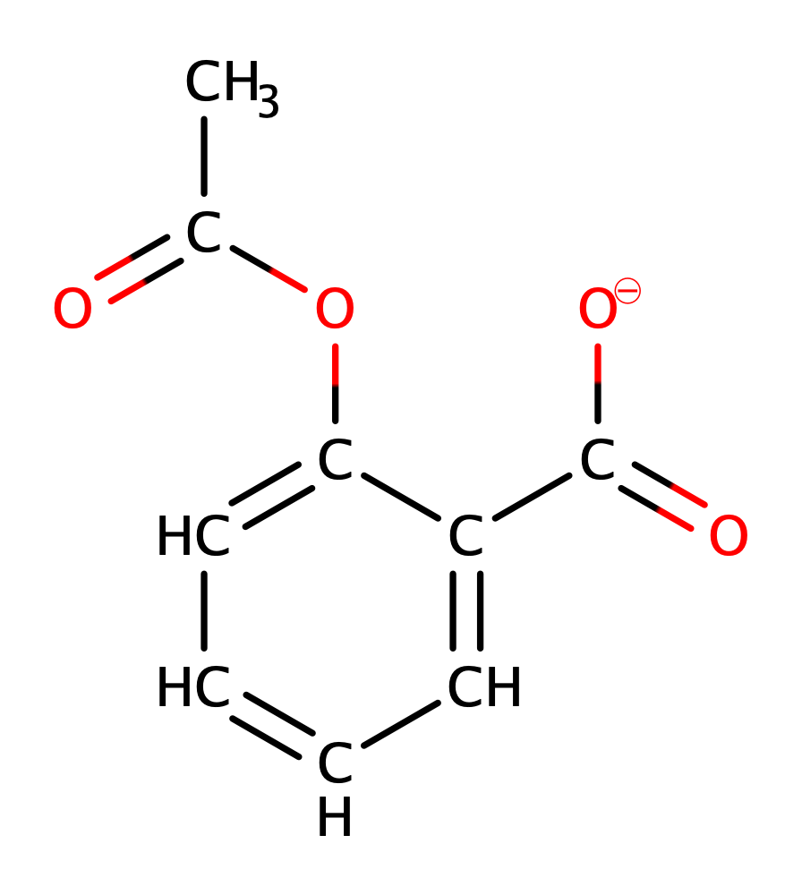

# spe-physique-chimie-2023-metropole-1-corrige

> Source : `../../../pdf_version/10_pc/2023/spe-physique-chimie-2023-metropole-1-corrige.pdf` — conversion Markdown (texte + visuels utiles).
> Stratégie : [STRATEGIE_MARKDOWN.md](../../../STRATEGIE_MARKDOWN.md)

---

## Page 1

Baccalauréat général
         Session 2023 – Métropole

Épreuve de Physique-Chimie
      Sujet de spécialité no 1
                —
      Proposition de corrigé

     Ce corrigé est composé de 7 pages.

---

## Page 2

Baccalauréat général                Spécialité Physique-Chimie            ME 2023 (S1) – Corrigé

Exercice 1 —           À la découverte de Saturne
1. Observation de Saturne par Huygens
Q1. Un système afocal a la particularité de garder le parallélisme des rayons entre l’entrée et
    la sortie.
Q2. On place sur l’annexe les foyers objet et image de la lentille L2 dans le cas d’un système
    afocal.
Q3. On trace sur ce même schéma placé en annexe (page 7).
Q4. La lentille L1 a une distance focale f1′ = 329 cm. Son foyer image sera donc placé, au vu
    du positionnement de la lentille, en x == 329 + 36 = 365 cm.
    Or, la seconde lentille a une distance focale f2′ = 7, 0 cm. Son foyer objet sera donc placé
    à l’abscisse x2 = 372 − 7 = 365 cm.
    Ces deux foyers étant confondus, le système est bien afocal.
Q5. On place l’angle θ′ sur le schéma en annexe.
Q6. Par définition, le grossissement est donné par :
                                                              θ′
                                               GHuy =                                        (1)
                                                              θ
Q7. On remarque sur le schéma (page 7) que :
                                             
                                              tan θ = d′
                                                              f1
                                              tan θ ′ = d′
                                                              f2

     Or, aux petits angles, tan θ ∼ θ et tan θ′ ∼ θ′ . Il vient alors :
                                               
                                                θ = d′
                                                         f1
                                                θ ′ = d′
                                                         f2

     On injecte alors ces expressions dans (1), et on obtient :
                                                   y
                                                   f2′        y     f1′
                                          GHuy =   y     =        ×
                                                   f1′
                                                              f2′   y
     Et finalement, on a bien :
                                                              f1′
                                               GHuy =
                                                              f2′
Q8. D’où, GHuy = 329
                 7,0
                     = 47, 0, ce qui bien plus élevé que pour la lunette de Galilée.
Q9. Par définition du grossissement, on a la relation sur les angles :
                                                 θ′ = Gθ
     De plus, on peut exprimer θ en fonction des données du problème :
                                               DA−B
                                       tan θ =       ∼θ
                                               DT −S
     Alors finalement,
                                  DA−B            3, 17 × 104
                         θ′ = G         = 47, 0 ×             = 1, 0 × 10−3 rad
                                  DT −S           1, 42 × 109
     L’angle perçu en sortie de la lunette est donc θ′ = 1, 0 × 10−3 rad, ce qui est supérieur au
     minimum séparable par l’œil humain. Il est donc possible pour l’observateur de distinguer
     la planète de son premier anneau.

                                                                                    Page 2 sur 7

---

## Page 3

Baccalauréat général               Spécialité Physique-Chimie                ME 2023 (S1) – Corrigé

2. Prise en compte de la diffraction dans l’observation astronomique
Q10. L’objectif utilisé par Galilée a un diamètre dG = 29, 0 mm. Pour cette valeur, l’angle de
     diffraction est :
                                             550 × 10−9
                             θdiff = 1, 22 ×        −
                                                        = 2, 3 × 10−5 rad
                                             29 × 10 3
     Cette valeur étant bien inférieure au pouvoir séparateur de l’œil humain, on comprend
     qu’il était impossible pour Galilée de distinguer l’anneau de Saturne.

3. Découverte de Titan par Huygens
Q11. Huygens a relevé la position de Titan chaque jour entre le 25 mars et le 10 avril, soit sur
     une durée de 17 jours (donc 16 portions). La position du satellite étant la même à ces
     deux dates, sa trajectoire est donc entièrement cartographiée à partir de ces 16 portions.
Q12. La force d’attraction gravitationnelle de Saturne sur Titan est donnée par :

                                           −−→      MS MT
                                           FS/T = G       u⃗n                                    (2)
                                                     R2

Q13. On souhaite exprimer la vitesse de Titan, de masse MT constante en orbite circulaire
     autour de Saturne. Pour cela, on va lui appliquer le principe fondamental de la dynamique
     dans le référentiel Saturne-centrique :
                                                −−→
                                                FS/T = MT ⃗a

      Et avec (2) :
                                                         MS
                                                ⃗a = G      u⃗n
                                                         R2
      Ou, en norme :
                                                    MS
                                                  a=G                                            (3)
                                                    R2
      Or, pour une orbite circulaire uniforme, on a :

                                                v2       √
                                           a=      =⇒ v = Ra
                                                R
      Et avec (3), il vient finalement :
                                                      s
                                                          GMS
                                                 v=
                                                           R
Q14. Le satellite parcourant une distance D = 2πR en un temps T , il vient :
                                                                        s
                                D        D   2πR                             R
                             v=   =⇒ T =   =q     = 2πR ×
                                T        v    GMS                           GMS
                                                           R

      Et finalement :
                         s                  s
                         R3                            (1, 22 × 109 )3
                 T = 2π     = 2π ×                                           = 1, 4 × 106 s
                        GMS                     6, 67 × 10−11 × 5, 68 × 1026

      La période calculée est donc TKep = 1, 4 × 106 s = 15, 9 jours, ce qui est très proche de la
      période mesurée par Huygens, qui a donc mené une observation très pertinente et précise
      avec sa lunette.

                                                                                        Page 3 sur 7

---

## Page 4

Baccalauréat général             Spécialité Physique-Chimie           ME 2023 (S1) – Corrigé

Exercice 2 —           Synthèse de l’arôme de banane
1. Identification des espèces mises en jeu dans la réaction
Q1. On donne les formules topologiques des réactifs et du produit étudié, et on identifie leurs
    groupes caractéristiques :

           3-méthylbutan-1-ol        acide éthanoïque        éthanoate de 3-méthylbutyle

                          OH
              famille alcool    famile acide carboxylique           famille ester

Q2. Par conservation de la matière, on remarque en sommant tous les atomes des réactifs
    et ceux du produit, qu’il manque 2 atomes d’hydrogène et un atome d’oxygène. On en
    déduit donc que le produit P est de l’eau.
Q3. On souhaite attribuer les spectres IR. Pour cela, il suffit de remarquer la bande d’absorp-
    tion large vers 3200 − 3700 cm−1 caractéristique de la liaison O−H présente dans l’acide
    éthanoïque et non dans l’ester.
    Le spectre A est donc celui de l’acide éthanoïque, et le spectre B celui de l’ester.

2. Comparaison de protocoles de synthèse
Q4. L’étape 2 est une réaction sur chauffage à reflux, tandis que l’étape 3 est une séparation.
Q5. Un catalyseur permet d’accélérer une réaction.
Q6. Le chauffage à reflux permet ici de rendre la réaction thermodynamiquement favorable
    en chauffant, tout en empêchant les pertes par évaporation.
Q7. Le dégagement gazeux de l’étape 3 correspond à la production de CO2 gazeux par réaction
    entre les ions hydrogénocarbonate et les résidus d’acide du milieu.
    Cette étape permet justement de neutraliser la phase organique, qui contient toujours
    l’acide une fois la réaction terminée.
Q8. On cherche d’abord à identifier le réactif limitant. De manière générale, on a :
                                                            ρV
                                       m = ρV =⇒ n =
                                                            M
     On a donc introduit une quantité de 3-méthylbutan-1-ol nb = 0,81×22
                                                                      88,2
                                                                            = 0, 20 mol, et une
                     1,05×15
     quantité na = 60,0 = 0, 26 mol d’acide éthanoïque.
     Le réactif limitant sera donc le 3-méthylbutanol, et l’avancement maximal de la réaction
     sera ξm = nb = 0, 20 mol.
     Une mole de chacun des réactifs produisant une mole de produit, il vient immédiatement :
     nth = ξm = 0, 20 mol quantité d’ester produite.
                                                 19,7
     Or, on a obtenu expérimentalement nxp = 130,2    = 0, 15 mol.
     Le rendement de la synthèse vaut donc :
                                       nxp   0, 15
                                  η=       =       = 0, 75 = 75 %
                                       nth   0, 20

     Ce qui reste du bon ordre de grandeur pour une synthèse organique.

                                                                                    Page 4 sur 7

---

## Page 5

Baccalauréat général              Spécialité Physique-Chimie            ME 2023 (S1) – Corrigé

 Q9. Dans le protocole B, on chauffe au micro-ondes pendant 30 secondes. L’énergie nécessaire
     sera donc :
                               E = P∆t = 800 × 30 = 2, 4 × 104 J
      On remarque que cette valeur est bien inférieure à l’énergie nécessaire pour le protocole
      A.
Q10. Le protocole B est définitivement celui qui correspond le mieux au principe de chimie
     verte : il est de meilleur rendement tout en demandant un énergie moindre, en plus de
     ne pas nécessiter d’espèce supplémentaire (contrairement au protocole C qui nécessite du
     cyclohexane).

Exercice 3 —           Une formulation de l’aspirine
 Q1. On donne la forme semi-développée de l’ion acétylsalicylate :

 Q2. La DS-Lysine présente à la fois un groupe acide carboxylique et des groupes amine
     (−NH2 ). On comprend donc aisément sa dénomination.
 Q3. Lors de la dissolution d’un sachet dans l’eau, on finit à pH = 5, 0. On aura donc dans
     le milieu des ions acétylsalicylate et la deuxième forme de la DL-lysine (protonation des
     amines, déprotonation de l’acide carboxylique).
 Q4. Dans la solution ainsi obtenue, les deux espèces sont des carboxylates. Ainsi, un acide
     fort versé réagirait avec les deux espèces, ne permettant pas de réaliser un dosage des ions
     acétylsalicylate.
 Q5. Pour réaliser un dosage par spectrophotométrie, on se place au maximum d’absorption
     de la solution titrée. On prendra donc λ = 530 nm.
     Grâce à l’étoile chromatique, on peut prédire que la solution apparaîtra de couleur rouge.
 Q6. On souhaite déterminer la masse d’acide acétylsalicylique dans le sachet. Pour cela, on
     va exploiter le dosage spectrophotométrique par étalonnage.
     Sur la droite A = f (C), on lit, pour une absorbance A = 0, 80, une concentration
     C = 1 mmol · L−1 .

                                                                                    Page 5 sur 7

---

## Page 6

Baccalauréat général               Spécialité Physique-Chimie           ME 2023 (S1) – Corrigé

     Or, la solution a été diluée 10 fois. Alors la concentration en espèce colorée B est initia-
     lement :
                                              CB = 10C
     Et finalement, dans la solution initialement préparée :

                       mexp = CB V1 M (a) = 0, 01 × 250 × 10−3 × 180, 2 = 450 mg

     On calcule donc le quotient :

                              | mexp − mref |   | 450 − 500 |
                                              =               = 1, 67 > 1
                                   u(m)               30

     On peut penser que l’indication du fabricant est fausse.

                                              * *
                                               *

                                     Proposé par T. Prévost (thomas.prevost@protonmail.com),
                                                       pour le site https://www.sujetdebac.fr/
                                                                            Compilé le 20 mars 2023.

                                                                                      Page 6 sur 7

---

## Page 7

Baccalauréat général   Spécialité Physique-Chimie   ME 2023 (S1) – Corrigé

Annexe : schéma d’optique pour l’exercice 1

                                  θ’
                                  θ’
                                f1’

                                       d
                                   f2’
                                 θ

                                                              Page 7 sur 7
