# spe-physique-chimie-2023-metropole-1-sujet-officiel

> Source : `../../../pdf_version/10_pc/2023/spe-physique-chimie-2023-metropole-1-sujet-officiel.pdf` — conversion Markdown (texte + visuels).
> Stratégie : [STRATEGIE_MARKDOWN.md](../../../STRATEGIE_MARKDOWN.md)

---

## Page 1

BACCALAURÉAT GÉNÉRAL
                  ÉPREUVE D’ENSEIGNEMENT DE SPÉCIALITÉ

                                  SESSION 2023

                          PHYSIQUE-CHIMIE

                              Lundi 20 mars 2023

                          Durée de l’épreuve : 3 heures 30

           L’usage de la calculatrice avec mode examen actif est autorisé.
        L’usage de la calculatrice sans mémoire, « type collège » est autorisé.

           Dès que ce sujet vous est remis, assurez-vous qu’il est complet.
             Ce sujet comporte 12 pages numérotées de 1/12 à 12/12.

                   L’annexe page 12 est à rendre avec la copie.

23-PYCJ1ME1                                                                       Page 1/12

---

## Page 2

EXERCICE 1 - À LA DÉCOUVERTE DE SATURNE (11 points)

La planète Saturne a été observée à travers une lunette astronomique pour la première fois par l’astronome
Galilée en 1610. Il a pu entrevoir la planète, mais sa lunette ne lui a pas permis de distinguer clairement ce
qui l’entourait (figure 1).

Ce n’est qu’en 1655, grâce à une lunette plus perfectionnée, que Christian Huygens comprend que ce qui
entoure Saturne sont des anneaux dont l’aspect varie avec l’angle d’observation. La même année, il découvre
également Titan, le plus gros satellite de Saturne (figures 2 et 3).

                                          Figure 2. Un des premiers            Figure 3. Positions respectives de
  Figure 1. Saturne représentée
                                        dessins de Saturne réalisé par        Saturne et de Titan schématisées par
       par Galilée en 1610
                                              Huygens en 1655                          Huygens en 1655

                                    Source : Systema Saturnium de Huygens

Le but de cet exercice est d’étudier la lunette astronomique de Huygens afin de comparer ses observations
de Saturne et de ses anneaux à celles de Galilée. La fin de l’exercice est consacrée à l’étude du mouvement
du satellite Titan à partir des observations de Huygens.

Données :
    caractéristiques des lunettes astronomiques utilisées par Galilée et Huygens :

                          Distance focale f1 '     Distance focale f2 '        Diamètre a
                                                                                                    Grossissement
                             de l’objectif            de l’oculaire            de l’objectif
  Lunette de Galilée
                                                                                29,0 mm                GGal = 14
   utilisée en 1610
      Lunette de
        Huygens                 329 cm                   7,0 cm                 51,0 mm
   utilisée en 1655

       un observateur peut distinguer deux points différents d’un objet si l’angle sous lequel sont vus ces
        deux points, depuis le point d’observation, est supérieur ou égal à 3,0×10-4 rad ;
       approximation dans le cas de petits angles (θ << 1 rad) : tan (θ) = θ ;
       constante de gravitation universelle : G = 6,67×10-11 N·m2·kg-2 ;
       masse de Saturne : MS = 5,68×1026 kg ;
       masse de Titan : MT = 1,34×1023 kg ;
       distance moyenne entre la Terre et Saturne : DT-S = 1,42×109 km ;
       rayon de l’orbite de Titan autour de Saturne : R = 1,22×106 km.

1. Observation de Saturne par Huygens

La lunette de Huygens, considérée comme afocale, est modélisée par un système de deux lentilles minces
convergentes notées L1 et L2. La lentille L1 représente l’objectif et la lentille L2 l’oculaire. Leurs centres optiques
respectifs sont notés O1 et O2 et leurs distances focales respectives sont notées f1 ' et f2 '.

Sur la figure A1 de l’ANNEXE À RENDRE AVEC LA COPIE, réalisée sans souci d’échelle, sont représentées
les deux lentilles et la position du foyer image F’1 de la lentille L1. La lunette est utilisée pour observer un objet
AB, supposé « à l’infini », dont l’image par l’objectif sera notée A1B1. Deux rayons lumineux issus de B sont
représentés sur le schéma.

Q1. Préciser le sens du terme « afocal ».

23-PYCJ1ME1                                                                                               Page 2/12

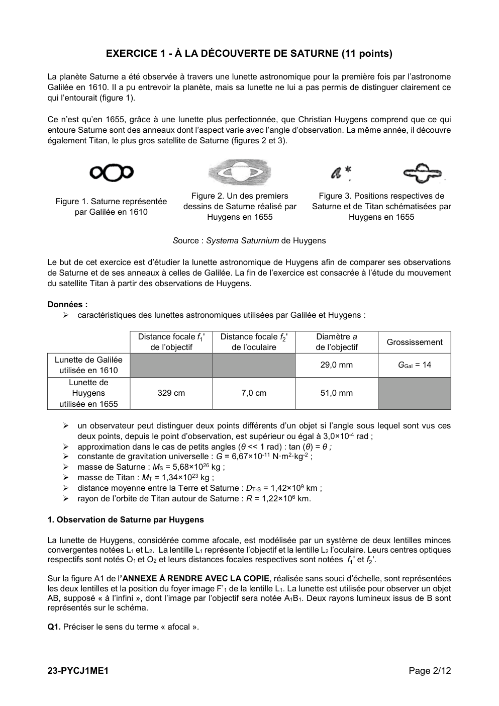

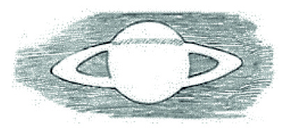

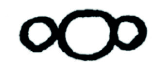

---

## Page 3

Q2. Placer, sur la figure A1 de l’ANNEXE À RENDRE AVEC LA COPIE, les foyers objet F2 et image F’2 de la
lentille L2 dans le cas d’une lunette afocale.

Q3. Construire, sur la figure A1 de l’ANNEXE À RENDRE AVEC LA COPIE, la marche des deux rayons
lumineux issus de B qui émergent de la lunette en faisant apparaître l’image intermédiaire A1B1.

La lunette de Huygens est constituée d’un tube long de 372 cm. Comme indiqué sur la figure 4, l’oculaire est
placé à une extrémité du tube. L’objectif quant à lui est enfoncé de 36 cm par rapport à l’autre extrémité, afin
de le protéger de la buée.

                                              L = 372 cm

             ℓ = 36 cm

          Figure 4. Représentation schématique de la lunette de Huygens (échelle non respectée)

Q4. Vérifier, à partir des données, que la lunette d’Huygens peut être considérée comme « afocale ».

L’angle θ, représenté sur la figure A1 de l’ANNEXE À RENDRE AVEC LA COPIE, désigne l’angle sous lequel
l’espace AB entre la surface de Saturne et son premier anneau est vu à l’œil nu depuis la Terre, lorsque les
anneaux de Saturne sont vus de face (voir figure 5).

                   Distance entre la
                  surface de Saturne D
                                       A-B                          θ
                     et le premier
                        anneau
                                                                        DT-S

      Figure 5. Angle sous lequel Saturne est vue par Huygens sans la lunette (échelle non respectée)

On note θ’ l’angle sous lequel un observateur voit l’image A’B’ de l’espace AB, à travers la lunette
astronomique.

Q5. Placer l’angle θ’ sur la figure A1 de l’ANNEXE À RENDRE AVEC LA COPIE.

Q6. Donner l’expression du grossissement GHuy de la lunette de Huygens en fonction des angles θ et θ’.

Q7. Montrer que le grossissement GHuy de la lunette de Huygens s’exprime en fonction des distances focales
des lentilles L1 et L2 constituant la lunette :
                                                            f1 '
                                                   GHuy =
                                                            f2 '
Q8. Calculer la valeur du grossissement GHuy de la lunette utilisée par Huygens.

23-PYCJ1ME1                                                                                         Page 3/12

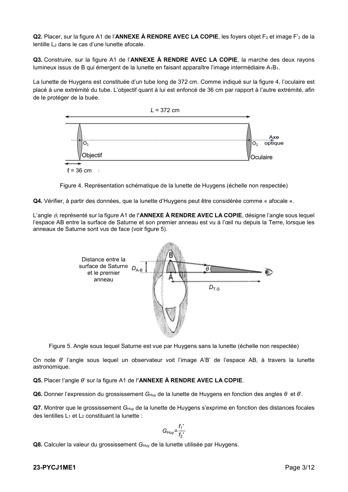

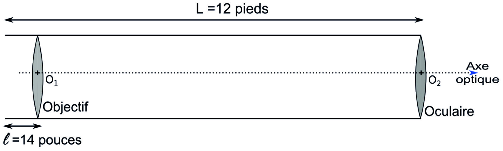

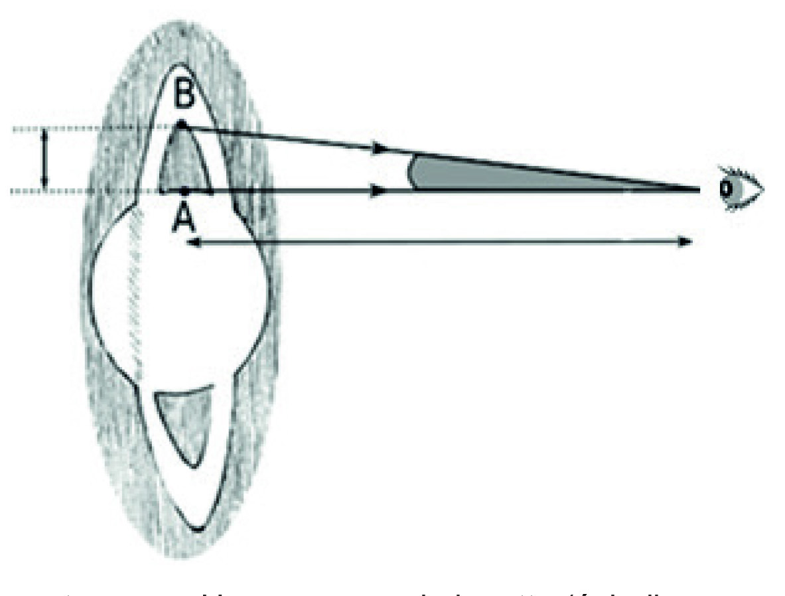

---

## Page 4

Q9. Conclure sur la possibilité pour Huygens de distinguer la surface de Saturne de son premier anneau en
utilisant la lunette. La distance entre la surface de Saturne et son premier anneau est égale à
DA-B = 3,17×104 km (figure 5).

2. Prise en compte de la diffraction dans l’observation astronomique

L’observation des détails d’un objet avec une lunette astronomique est principalement limitée par le
phénomène de diffraction. En effet, l’image donnée par l’objectif d’une source ponctuelle « à l’infini » n’est pas
un point mais une figure de diffraction circulaire, appelée tache d’Airy, représentée en figure 6.

                      Figure 6. Figure de diffraction obtenue par une ouverture circulaire
                                  (échelle non respectée – image en négatif)

Dans le cas de la lunette astronomique, on admet que l’angle caractéristique de diffraction vérifie la relation :

                                                                      λ
                                                     θdiff = 1,22 ×
                                                                      a
avec λ la longueur d’onde du faisceau incident et a le diamètre de l’objectif.

Une lunette astronomique ne permet de distinguer deux points A et B que si l’écart angulaire θ entre les
directions de ces deux points vus depuis la Terre est supérieur ou égal à l’angle caractéristique de diffraction,
c’est-à-dire si la condition θ ≥ θdiff est vérifiée. Si ce n’est pas le cas, les taches d’Airy associées aux deux
points se superposent et les deux points ne peuvent être séparés visuellement.

Q10. Expliquer pourquoi on peut considérer que le phénomène de diffraction a empêché Galilée d’observer
les anneaux de Saturne avec sa lunette astronomique contrairement à Huygens qui a pu les observer. Une
approche quantitative est attendue.
On rappelle que la distance entre Saturne et la limite du premier anneau visible à l’époque est égale à
DA-B = 3,17×104 km et on effectuera les calculs avec une valeur de la longueur d’onde λ = 550 nm, pour
laquelle l’œil humain est le plus sensible.

Le candidat est invité à prendre des initiatives et à présenter la démarche suivie, même si elle n’a pas abouti.
La démarche est évaluée et doit être correctement présentée.

23-PYCJ1ME1                                                                                           Page 4/12

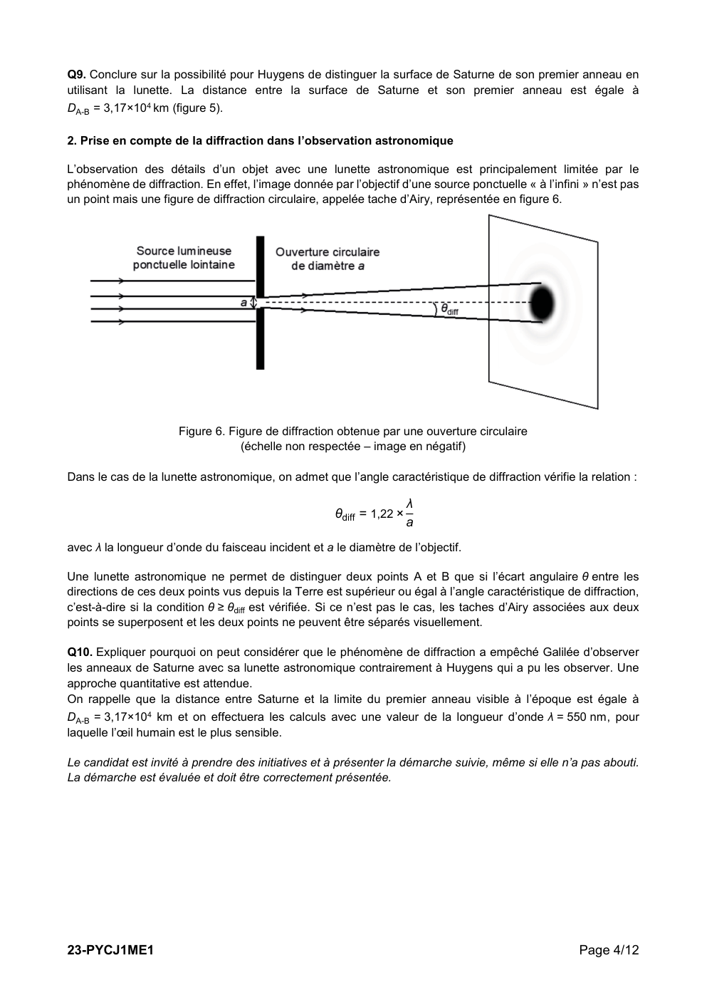

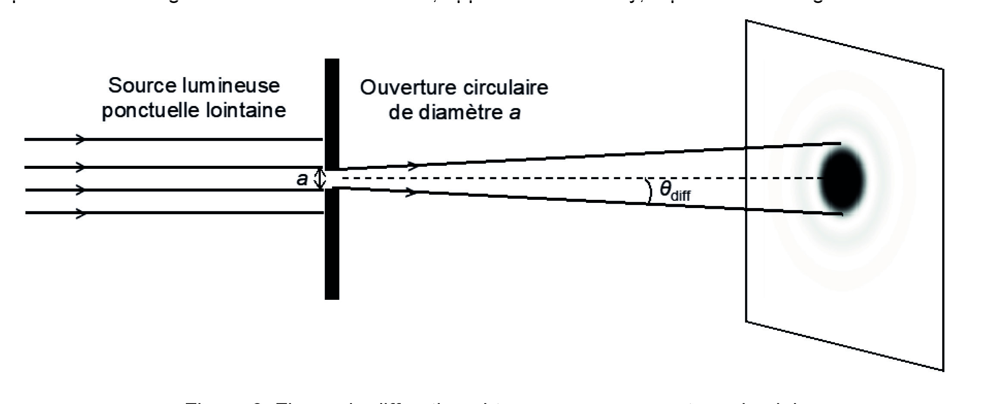

---

## Page 5

3. Découverte de Titan par Huygens

Le 25 mars 1655, à 8 heures du soir, employant sa lunette, Huygens aperçoit près de Saturne, un point brillant
qu'il soupçonne être un satellite de cette planète. Plus tard, ce satellite sera appelé Titan.

« Après le 25 mars 1655, à savoir le 10 avril, le satellite a été vu à
la même position qu'il occupait à cette première date. De même,
le 3 et le 19 avril de cette même année des positions identiques
furent observées ; de même encore le 13 et le 29 de ce mois.
Tenant donc compte de ces résultats, j'ai dessiné une
circonférence de cercle représentant l'orbite du satellite, avec                               27 mars
Saturne au centre, et je l'ai divisée en 16 parties, comme le montre
la figure suivante. Dans cette orbite j'ai fait circuler le satellite                             26 mars
suivant l'ordre naturel des chiffres. […]                                      3 avril            25 mars
Cherchant ensuite sur cette circonférence l'endroit où le satellite
s'était trouvé dans notre première observation et corrigeant
plusieurs fois cet endroit, […] il m'a semblé enfin que tout le
mouvement peut être représenté le plus commodément, si dans le
cas de la première observation, celle du 25 mars 1655, le satellite
est placé auprès du nombre 12. Par suite le satellite de Saturne              Source : d’après Systema
                                                                              Saturnium, Huygens
était le 26 mars auprès du nombre 13, le 27 mars auprès du
nombre 14, le 3 avril auprès du nombre 5 et ainsi de suite aux
endroits de l'orbite qui correspondent assez bien avec les
situations observées la première année. »

Q11. Justifier le choix de Huygens de diviser la trajectoire de Titan en 16 parties.

Le mouvement de Titan, noté T, est étudié dans le référentiel                                       ���⃗
                                                                                                    ut
saturnocentrique, dont l’origine est placée au centre S de Saturne et dont
les axes sont dirigés vers des étoiles lointaines. Il est considéré comme
                                                                                                    ����⃗
                                                                                                    un
galiléen. On travaille dans le repère de Frenet (T, u
                                                    ���⃗,
                                                       t u����⃗).
                                                              n

Dans Systema Saturnium, Huygens précise que la valeur de la période de
révolution THuy de Titan est de « 15 jours 23 heures 13 minutes ».

Q12. Donner l’expression vectorielle de la force d’interaction
gravitationnelle exercée par Saturne sur le satellite Titan en fonction
de G, MS, MT, R et de l’un des vecteurs unitaires.                                 Figure 7. Schéma de la
                                                                                 trajectoire de Titan dans le
Q13. Le mouvement de Titan autour de S est supposé circulaire. Montrer          référentiel saturnocentrique
qu’il est uniforme puis que l’expression de la vitesse du satellite s’écrit
sous la forme :
                                                         G·MS
                                                   v=�
                                                          R

Q14. En déduire l’expression de la période de révolution notée TKep de Titan. Calculer sa valeur.
Commenter.

23-PYCJ1ME1                                                                                           Page 5/12

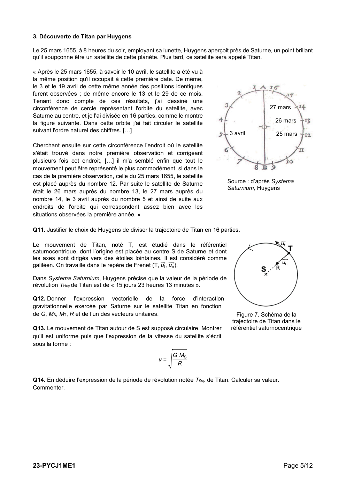

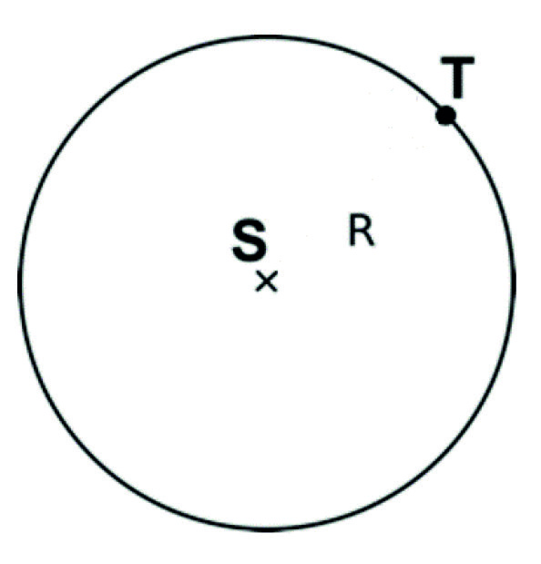

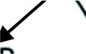

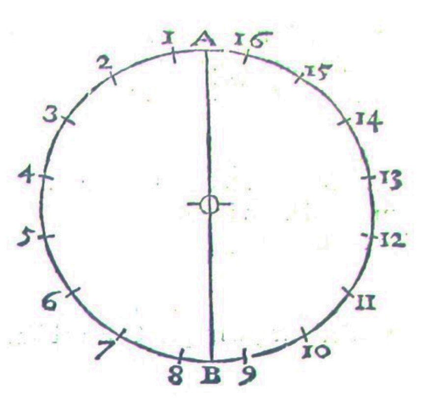

---

## Page 6

EXERCICE 2 - SYNTHÈSE DE L’ARÔME DE BANANE (5 points)

L’arôme de banane est un mélange complexe de plusieurs espèces chimiques
naturelles. Le principal constituant de cet arôme est l’éthanoate de 3-méthylbutyle aussi
appelé acétate d’isoamyle : il est utilisé en parfumerie et comme additif alimentaire.

L’objectif de cet exercice est de comparer plusieurs protocoles permettant de
synthétiser au laboratoire cette espèce chimique, afin de déterminer quelle synthèse
est la plus éco-responsable.
                                                                                                                 Flacon d’arôme alimentaire
                                                                                                                     banane commercial

L’équation de la réaction de synthèse de l’éthanoate de 3-méthylbutyle est la suivante :

        CH3                                            O                            O                       H3C
H3C     CH CH2 CH2 OH                       +   H3C    C   OH               H3C     C     O   CH2     CH2    CH      CH3   +P
 3-méthylbutan-1-ol                         acide éthanoïque                        éthanoate de 3-méthylbutyle

Données :
     table de données de spectroscopie infrarouge :

                                  Liaison                       O–H                 C–H                C=C                 C=O

       Nombre d’onde (en cm–1)                             3200 – 3700        2850 – 3100        1620 – 1680         1650 – 1750
                                                                                                     Faible et
 Allure de la bande caractéristique                        Forte et large           Forte                             Forte et fine
                                                                                                       fine

1. Identification des espèces mises en jeu dans la réaction

Q1. Représenter la formule topologique des réactifs et de l’éthanoate de 3-méthylbutyle. Entourer les groupes
caractéristiques et identifier les familles fonctionnelles correspondantes.

Q2. Justifier que le produit P obtenu lors de cette synthèse est de l’eau.

Q3. Attribuer, à l’aide des données et en justifiant, chacun des spectres A et B représentés ci-après soit à
l’acide éthanoïque, soit à l’éthanoate de 3-méthylbutyle.

                                                                  Spectre A
                         100
              Transmittance (%)

                                  50

                                   0
                                  4000          3000
                                                3000          2000
                                                              2000           1500
                                                                             1500             1000
                                                                                              1000            500
                                                                                                               500

                                                                Nombre d’onde (cm–1)

23-PYCJ1ME1                                                                                                                Page 6/12

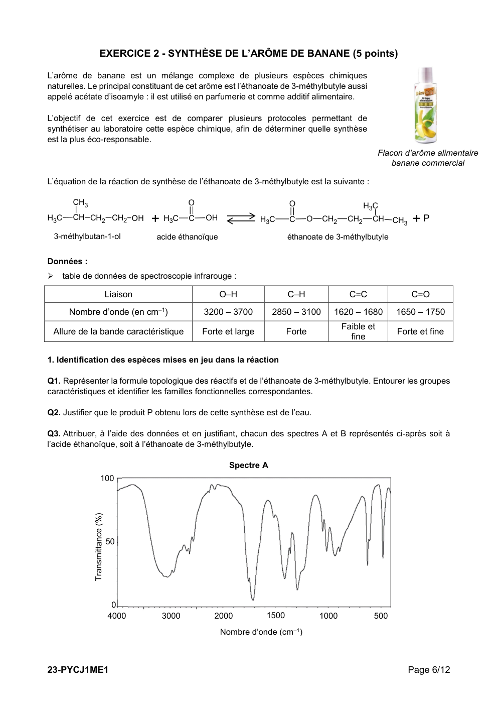

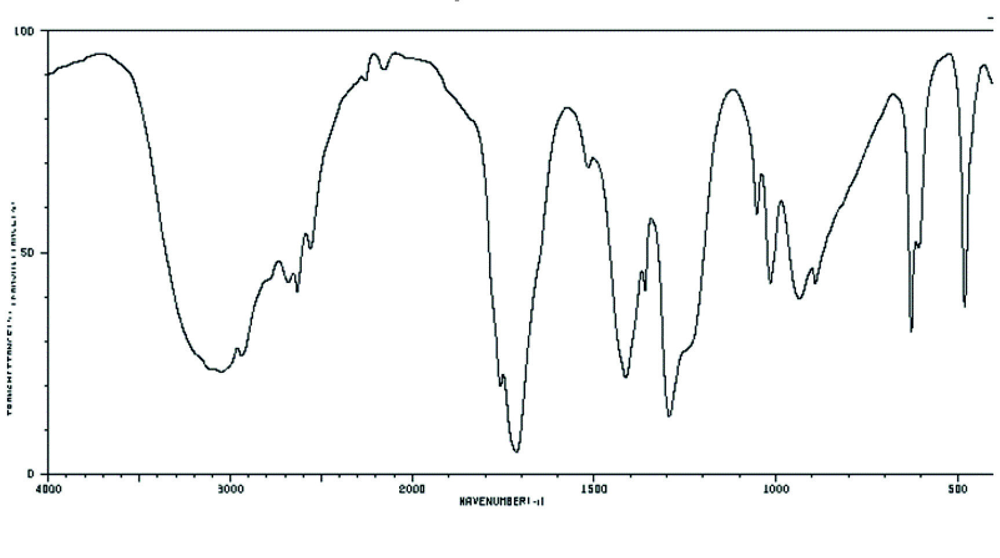

---

## Page 7

Spectre B
                                 100

             Transmittance (%)

                                  50

                                   0
                                  4000   3000           2000
                                                        2000           1500
                                                                       1500          1000
                                                                                     1000             500
                                                                                                     500
                                                         Nombre d’onde (cm–1)

                                                                                       Source : https://sdbs.db.aist.go.jp/

2. Comparaison de protocoles de synthèse

Données :
                               −
 l’ion hydrogénocarbonate HCO3 est une espèce amphotère appartenant aux couples acide-base
                 −         2−                            −
   suivants : HCO3 (aq)⁄CO3 (aq) et (CO2 (g),H2 O(l))⁄HCO3 (aq) ;

   données physico-chimiques à 20°C et données de sécurité :

                                          Masse molaire                   Solubilité dans
        Espèce chimique                                        Densité                           Pictogrammes de sécurité
                                           en g∙mol–1                      l’eau salée

        3-méthylbutan-1-ol                      88,2            0,81          Peu soluble

        Acide éthanoïque                        60,0            1,05          Très soluble

Éthanoate de 3-méthylbutyle                     130,2           0,87      Très peu soluble

          Cyclohexane                           84,2            0,78           Insoluble

Dans la suite de l’exercice on compare trois protocoles de synthèse.

Protocole A : synthèse avec montage de chauffage à reflux
    -      Étape 1 : dans un ballon on introduit 22 mL de 3-méthylbutan-1-ol, 15 mL d’acide éthanoïque pur et
           10 gouttes d’acide sulfurique concentré, ainsi que quelques grains de pierre ponce.

    -     Étape 2 : le mélange est chauffé à reflux pendant 45 minutes puis refroidi à la température
          ambiante.

    -     Étape 3 : la phase organique est ensuite lavée avec une solution aqueuse saturée de chlorure de
          sodium puis avec une solution aqueuse d’hydrogénocarbonate de sodium. La phase organique est
          alors séchée à l’aide de sulfate de magnésium anhydre.

    -     La masse d’éthanoate de 3-méthylbutyle obtenue est mB = 19,7 g.

Q4. Nommer les étapes 2 et 3 du protocole A.

23-PYCJ1ME1                                                                                                   Page 7/12

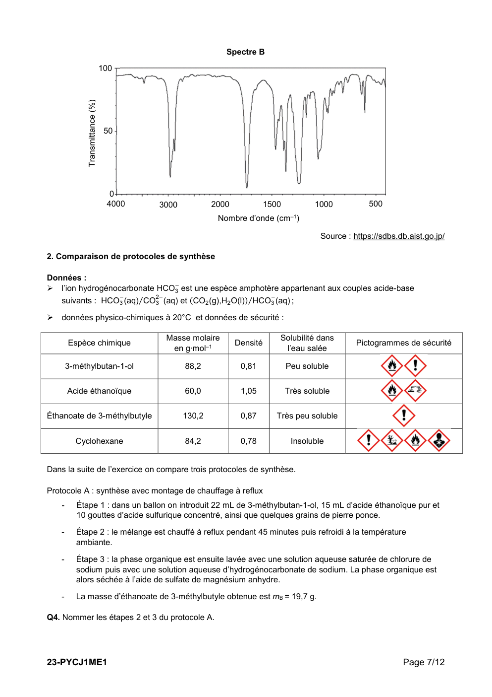

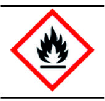

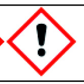

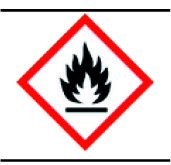

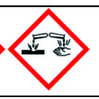

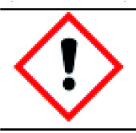

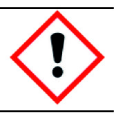

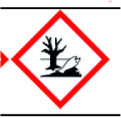

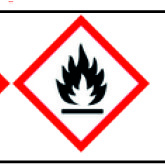

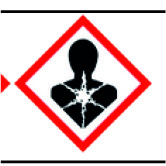

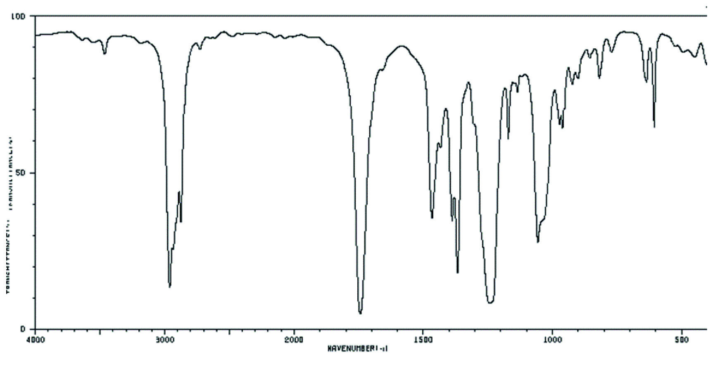

---

## Page 8

L’acide sulfurique concentré est utilisé comme catalyseur dans ce protocole.

Q5. Préciser le sens du mot catalyseur.

Q6. Préciser l’utilité du montage de chauffage à reflux dans ce protocole.

Lors du second lavage de l’étape 3 du protocole, on observe un dégagement gazeux.

Q7. À l’aide des données, proposer une explication à cette observation et justifier l’utilité de cette étape.

Q8. Déterminer le réactif limitant utilisé dans le protocole A puis calculer le rendement de la synthèse réalisée
en suivant ce protocole.

Dans les protocoles B et C, les étapes 1 et 3 sont identiques à celles du protocole A mais l’étape 2 est modifiée
comme indiqué ci-dessous :

                                        Protocole B                                   Protocole C
                                                                             Synthèse avec un appareil
                             Synthèse au four à micro-ondes
                                                                                   de Dean-Stark
                                                                      Chauffage à l’aide de l’appareil de Dean-
    Modifications de        Chauffage avec une puissance de           Stark permettant d’extraire l’eau au cours
       l’étape 2                  800 W pendant 30 s.                     de sa formation, en présence de
                                                                       cyclohexane jouant le rôle de solvant.
      Rendement                            87 %                                           85 %

Le chauffe-ballon utilisé dans les protocoles A et C lors de l’étape 2 consomme une énergie de 4,1×105 J.

Q9. Calculer l’énergie utilisée pour chauffer le mélange réactionnel dans le protocole B. Commenter.

L’objectif de la chimie verte est de réduire l'impact de la chimie sur la santé humaine et l’environnement. Il
s’agit donc de rechercher des milieux réactionnels alternatifs et respectueux de l'environnement tout en
s’efforçant, dans le même temps, d’augmenter les vitesses et d’abaisser les températures de réaction. Paul
T. Anastas et John C. Warner ont développé 12 principes de la chimie verte en 1991. Ces principes se divisent
en deux groupes : "réduire le risque" et "réduire le plus possible l’empreinte environnementale".
                                                                         D’après https://www.sigmaaldrich.com/

                                                     Produits
                                                  chimiques plus
                                                       sûrs
                                  Alternatives                       Synthèses
                                  aux solvants                       chimiques
                                   polluants                        moins toxiques

                                                      Chimie
                                                       verte
                                                                    Limitations des
                                   Produits
                                                                      dépenses
                                biodégradables
                                                                     énergétiques
                                                   Utilisation de
                                                    procédés
                                                   catalytiques

                 Figure 1. Schéma illustrant quelques principes directeurs de la chimie verte
Q10. À l’aide de la figure 1, identifier, en le justifiant, quel protocole répond le mieux aux principes directeurs
de la chimie verte.

23-PYCJ1ME1                                                                                            Page 8/12

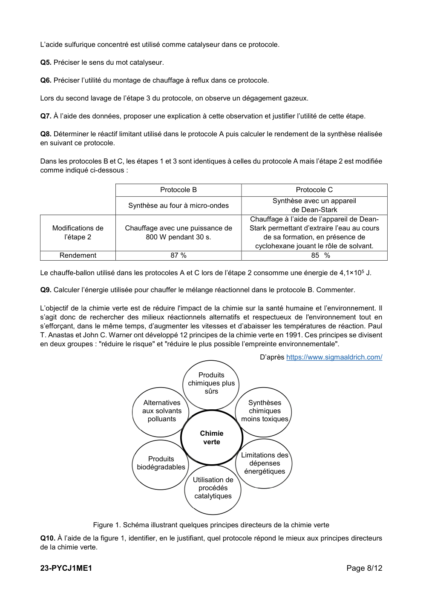

---

## Page 9

EXERCICE 3 - UNE FORMULATION DE L’ASPIRINE (4 points)

L’aspirine est le nom commercial de l’acide acétylsalicylique. L’aspirine est utilisée depuis le début du
XXe siècle comme principe actif analgésique (antidouleur) et antipyrétique (contre la fièvre). Il s’agit encore
aujourd’hui d’un des médicaments les plus consommés au monde.

Cet exercice a pour objectif d’étudier un sachet de médicament contenant de l’acide acétylsalicylique.

Données :
    extrait de la notice d’un sachet de médicament contenant de l’acide acétylsalicylique :
        Utilisation : sachet dose de 1,0 g à dissoudre dans l’eau
        Principe actif : ion acétylsalicylate
        Composition : 900 mg d’acétylsalicylate de DL-lysine équivalent à un apport de 500 mg en acide
        acétylsalicylique

     en dissolvant un sachet de médicament dans 40 mL d’eau, on obtient une solution de pH = 5,0 ;
     couple acide-base (acide acétylsalicylique / ion acétylsalicylate) : pKA = 3,5 à 25 °C ;
     propriétés de quelques espèces chimiques :

                                                  Acide acétylsalicylique                DL-Lysine
                                                   HO      O
                                                                                                       NH2
                                                               O                                                OH
              Formule topologique                                                 H2N
                                                                    O                                       O

              Formule brute                              C9H8O4                          C6H14N2O2
          Masse molaire (g·mol–1)                         180,2                            146,2

     diagramme de prédominance (sans souci d’échelle) de la DL-Lysine :
                               +                               +                          +
                             NH3                             NH3                        NH3                           NH2
                                                                        -                         -                             -
          +                        OH         +                     O                         O                             O
    H3N                                 H3N                                 H2N                       H2N
                               O                                O                         O                             O

                                    2,2                             9,2                       10,7                          pH
        cercle chromatique :

        pour décider si le résultat d’une mesure est en accord avec une valeur de référence, on utilise le
                  |x−xref |
         quotient           avec x, la valeur mesurée ; xref la valeur de référence et u(x), l’incertitude-type
                      u(x)
         associée à la valeur mesurée x.

23-PYCJ1ME1                                                                                                     Page 9/12

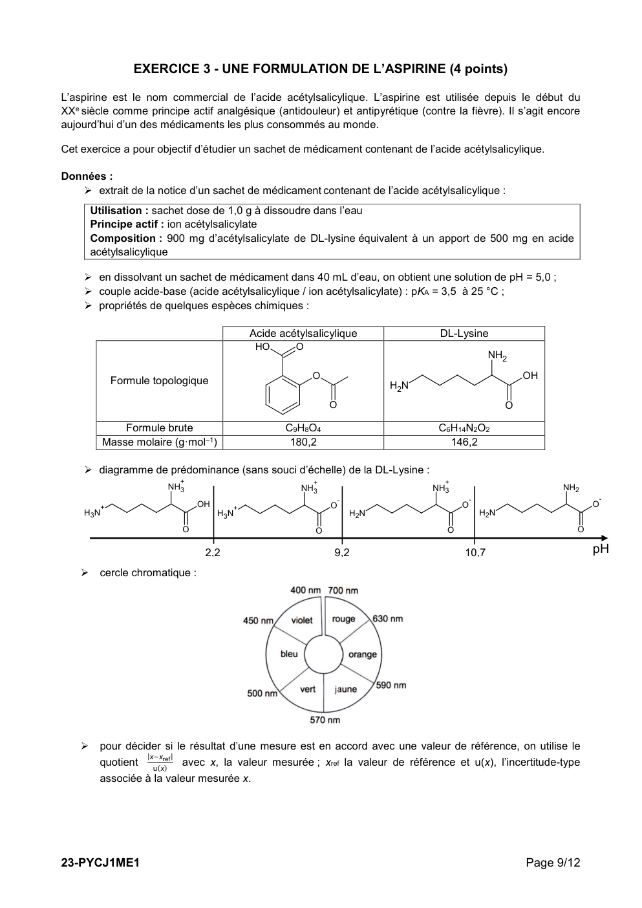

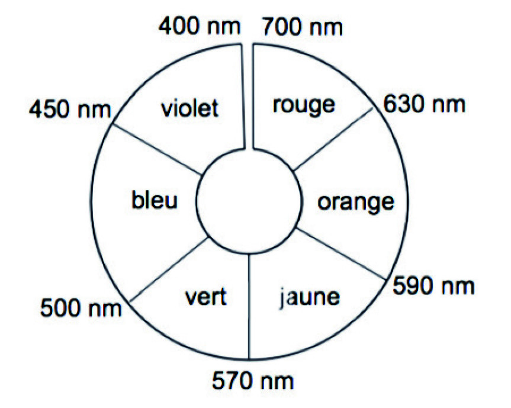

---

## Page 10

Le sachet de médicament étudié contient de l’aspirine sous la forme d’un composé ionique, l’acétylsalicylate
de DL-lysine.

Q1. Représenter la formule semi-développée de l’ion acétylsalicylate.

Q2. La DL-lysine appartient à la famille des acides aminés. Proposer une explication.

Q3. Indiquer la forme prédominante des espèces associées à l’acide acétylsalicylique et à la DL-lysine
présentes dans la solution de médicament obtenue après dissolution du contenu du sachet dans l’eau.

Q4. Justifier alors que le titrage acide-base de cette solution aqueuse de médicament par une solution d’acide
fort ne permet pas de déterminer directement la quantité de matière de l’ion acétylsalicylate en solution.

On souhaite vérifier l’indication « équivalent à un apport de 500 mg en acide acétylsalicylique » figurant sur la
notice du médicament. Pour cela, on réalise le protocole suivant :
    -   étape 1 : placer le contenu d’un sachet dans une fiole jaugée de volume V1 = 250 mL, ajouter 10 mL
        d’une solution d’hydroxyde de sodium concentrée, homogénéiser le mélange et attendre 20 minutes,
        puis compléter jusqu’au trait de jauge avec de l’eau distillée ;

    -   étape 2 : prélever un volume V2 = 5,0 mL de cette solution, l’introduire dans une fiole jaugée de volume
        V3 = 50,0 mL et compléter jusqu’au trait de jauge avec une solution acidifiée de nitrate de fer
                         –
        (Fe3+(aq) ; 3 NO3 (aq)). On note S la solution obtenue, dans laquelle a été formée une espèce colorée,
        notée B.

Lors de la mise en œuvre de ce protocole, les transformations chimiques mises en jeu sont toutes modélisées
par des réactions considérées comme totales. La figure 1 en représente les étapes simplifiées.
Les nombres stœchiométriques associés aux espèces représentées sont tous égaux à 1 :
                                                          -
        HO        O                                   O        O

                                   Dissolution avec
                       O           Dissolution avec                    OH
                                    HO   enexcès
                                    HO-– en  excès                        Fe
                                                                         Fe
                                                                            3+
                                                                               en excès
                                                                           3+ en  excès
                                                                                               B
                           O           Étape 1                                Étape 2

         Acide acétylsalicylique                      Ion salicylate                      Espèce colorée B

                      Figure 1 : étapes simplifiées de la synthèse de l’espèce colorée B

On souhaite réaliser le dosage spectrophotométrique par étalonnage de l’espèce colorée B obtenue à l’issue
de l’étape 2. On admet que seule l’espèce B absorbe dans le domaine du visible.

Pour cela, on utilise une solution mère de l’espèce colorée B, à partir de laquelle on prépare par dilution
6 solutions étalons de concentrations connues. L’une de ces solutions étalons permet de réaliser le spectre
d’absorption donné sur la figure 2. On mesure l’absorbance, à la longueur d’onde λ appropriée, de chaque
solution étalon. Les résultats sont donnés en figure 3.

23-PYCJ1ME1                                                                                         Page 10/12

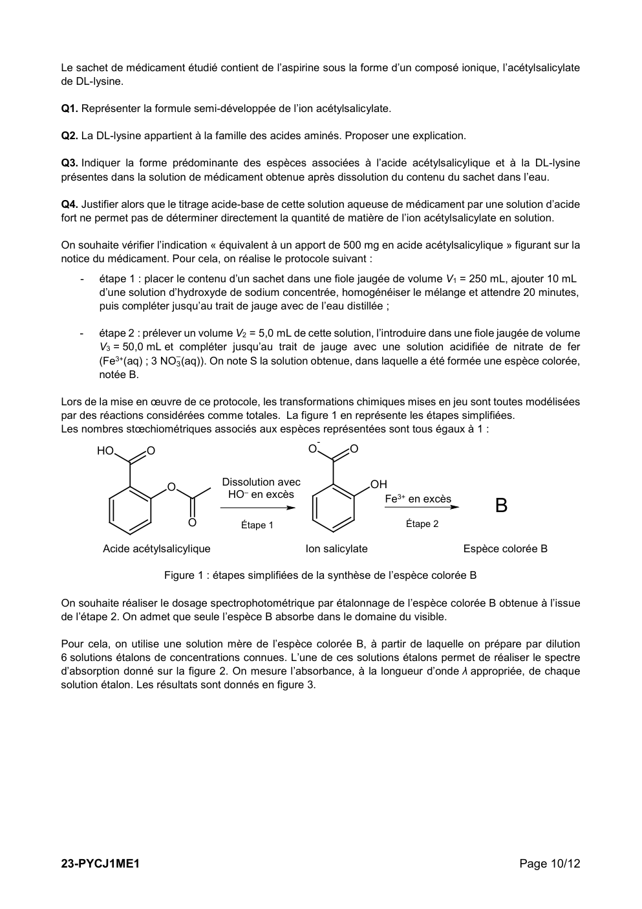

---

## Page 11

1,6
                          1,4
                          1,2

             Absorbance
                          1,0
                          0,8
                          0,6
                          0,4
                          0,2
                          0,0
                                400    450         500   550     600         650    700     750     800
                                                         Longueur d'onde (nm)

                      Figure 2. Spectre d’absorption d’une solution aqueuse de l’espèce colorée B
                                            à la concentration 1,74 mmol.L–1

Q5. Proposer une valeur de la longueur d’onde appropriée pour le dosage par étalonnage et en déduire la
couleur de la solution contenant l’espèce B.

         Absorbance
 2,5

 2,0

 1,5

 1,0

 0,5

 0,0
       0,0                  0,5              1,0         1,5           2,0           2,5          3,0          3,5
                                                                             Concentration en espèce B (mmol·L–1)
                                 Figure 3. Absorbance en fonction de la concentration en espèce B

La mesure de l’absorbance de la solution S obtenue à partir du sachet de médicament donne A = 0,80.

Q6. En considérant que l’incertitude-type associée à la détermination de la masse a pour valeur u(m) = 30 mg,
vérifier si la masse équivalente mexp d’acide acétylsalicylique présente dans le sachet est en accord avec les
informations présentes sur la notice.

Le candidat est invité à prendre des initiatives et à présenter la démarche suivie, même si elle n’a pas abouti.
La démarche est évaluée et doit être correctement présentée.

23-PYCJ1ME1                                                                                               Page 11/12

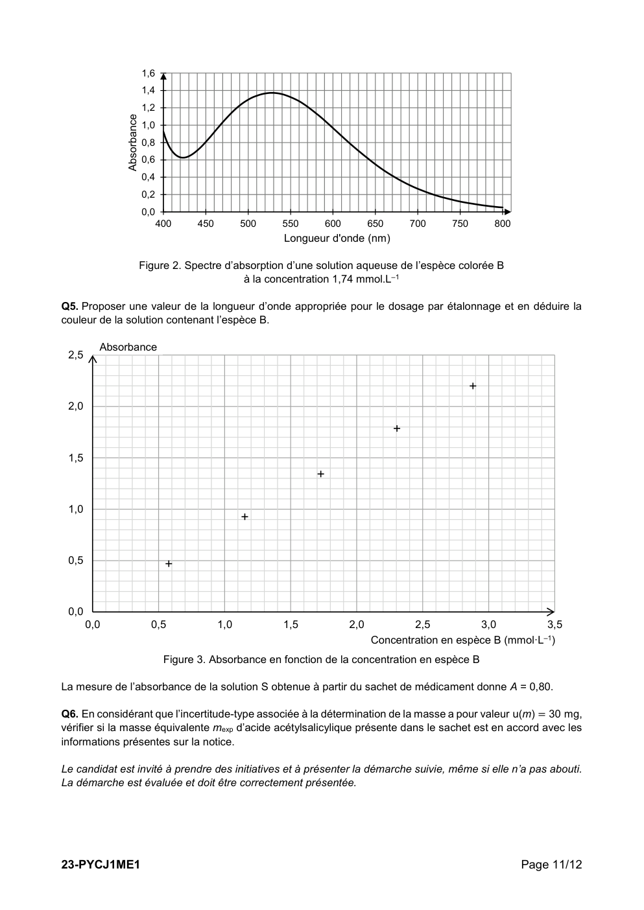

---

## Page 12

Page blanche laissée intentionnellement.
        Ne rien inscrire dessus.

---

## Page 13

23-PYCJ1ME1
                    B à l’infini

                                                                                      F’1
                                   θ
              A à l’infini
              sur l’axe optique             O1                                                      O2
                                                                                                            Axe optique
                                                                                                                          ANNEXE À RENDRE AVEC LA COPIE

                                       Objectif L1                                           Oculaire L2

                                       Figure A1. Schéma de la lunette de Huygens (échelle non respectée)

Page 12/12

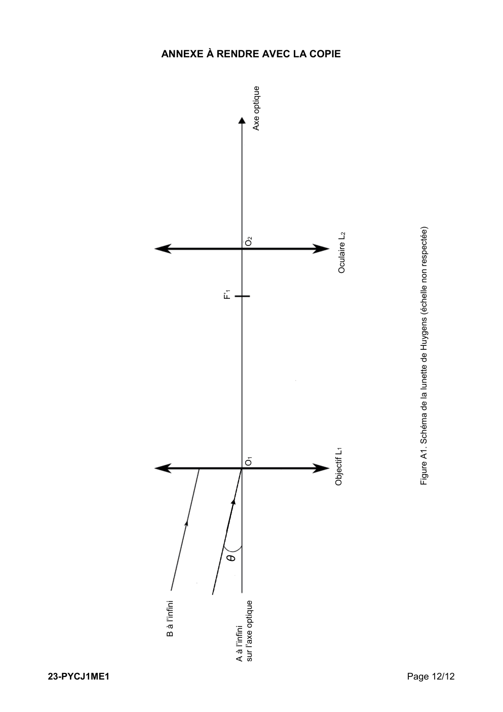

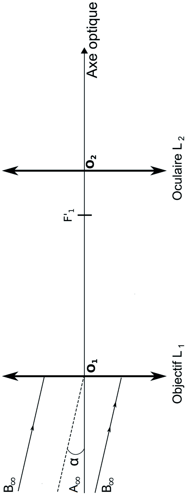

---

## Page 14

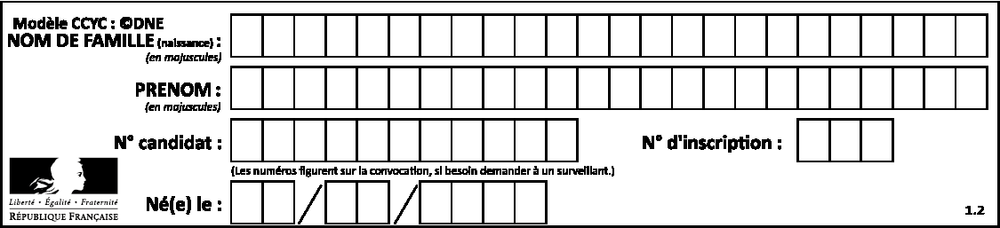
