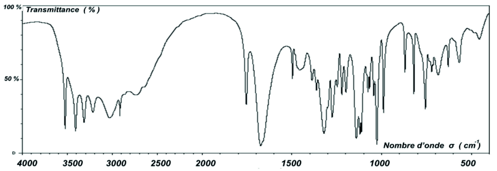
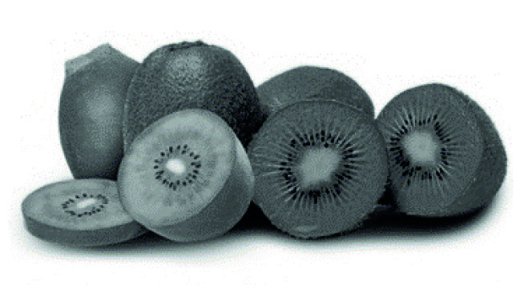
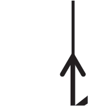
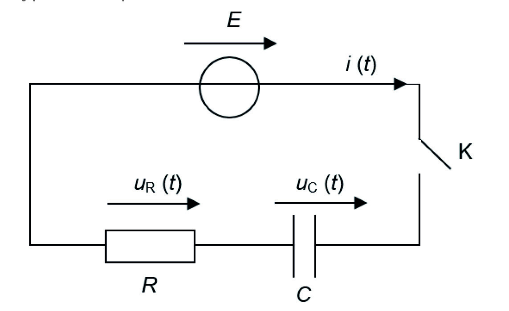

# spe-physique-chimie-2023-metropole-2-sujet-officiel

> Source : `../../../pdf_version/10_pc/2023/spe-physique-chimie-2023-metropole-2-sujet-officiel.pdf` — conversion Markdown (texte + visuels utiles).
> Stratégie : [STRATEGIE_MARKDOWN.md](../../../STRATEGIE_MARKDOWN.md)

---

## Page 1

BACCALAURÉAT GÉNÉRAL
                  ÉPREUVE D’ENSEIGNEMENT DE SPÉCIALITÉ

                                  SESSION 2023

                          PHYSIQUE-CHIMIE

                              Mardi 21 mars 2023

                          Durée de l’épreuve : 3 heures 30

           L’usage de la calculatrice avec mode examen actif est autorisé.
        L’usage de la calculatrice sans mémoire, « type collège » est autorisé.

           Dès que ce sujet vous est remis, assurez-vous qu’il est complet.
                Ce sujet comporte 9 pages numérotées de 1/9 à 9/9.

23-PYCJ2ME1                                                                       Page 1/9

---

## Page 2

EXERCICE 1 - ÉTUDE DE LA VITAMINE C CONTENUE DANS LES KIWIS (9 points)

L’acide ascorbique, couramment appelé vitamine C, intervient dans de
nombreux processus métaboliques dans le corps humain. Comme l’organisme
ne peut ni la synthétiser ni la stocker, les apports en vitamine C doivent se faire
par l’alimentation.

Les kiwis jaunes et les kiwis verts font partie des fruits les plus riches en acide
ascorbique. L’agence nationale de sécurité sanitaire de l’alimentation
recommande un apport minimum en vitamine C de 110 mg par jour pour un
adulte.

L’objectif de cet exercice est d’étudier les propriétés de l’acide ascorbique et de déterminer la quantité de kiwis
nécessaire aux besoins journaliers d’un adulte en vitamine C.

Données :
  formule brute de l’acide ascorbique : C6H8O6 ;
  formule topologique de l’acide ascorbique (ci-contre) ;                                 OH            B
  masse molaire de l’acide ascorbique : M = 176 g·mol–1 ;                      HO
                                                                                                   O
  couple acide-base associé à l’acide ascorbique :                              A
                          –                                                                                   O
   C6 H8 O6 (aq) / C6 H7 O6 (aq) ;
  concentration standard : c° = 1,0 mol·L–1 ;
                                                                                           HO           OH
  données de spectroscopie infrarouge :
              Liaison                  O–H                 C–H                C=C                 C=O
         Nombre d’onde
                                   3200 – 3700        2850 – 3100         1620 – 1680        1650 – 1730
             (en cm–1)
        Allure de la bande
                                  Forte et large          Forte           Faible et fine      Forte et fine
         caractéristique

1. Quelques propriétés de l’acide ascorbique

Q1. Représenter la formule semi-développée de l’acide ascorbique puis nommer les familles fonctionnelles
associées aux groupes A et B entourés sur la formule topologique.

Q2. Justifier que le spectre infrarouge de la figure 1 est compatible avec la structure de l’acide ascorbique.

                                   Figure 1. Spectre infrarouge de l’acide ascorbique

Pour étudier les propriétés acidobasiques de la vitamine C, on dissout 1,0 g d’acide ascorbique commercial
dans une fiole jaugée de 50 mL puis on complète jusqu’au trait de jauge avec de l’eau distillée. La mesure
du pH de la solution donne pH = 2,6.

Q3. Déterminer la quantité de matière initiale n0 d’acide ascorbique introduite dans la fiole jaugée.

23-PYCJ2ME1                                                                                             Page 2/9

---

## Page 3

La transformation entre l’acide ascorbique et l’eau est modélisée par la réaction d’équation :

                                                                  –            +
                               C6 H8 O6 (aq) + H2 O(ℓ) ⇆ C6 H7 O6 (aq) + H3 O (aq)

Q4. Donner la définition d’un acide faible.

Q5. Montrer que l’acide ascorbique est un acide faible dans l’eau.

Q6. Donner l’expression de la constante d’acidité KA du couple associé à l’acide ascorbique en fonction des
                                    –         +
concentrations [C6 H8 O6 ], [C6 H7 O6 ], [H3 O ] à l’équilibre et de la concentration standard c° puis montrer que la
valeur du pKA est proche de 4,2.

2. Acide ascorbique dans un kiwi jaune

Pour déterminer la concentration en acide ascorbique d’un kiwi jaune, on le mixe jusqu’à en obtenir du jus
dont le pH est de 3,5.

Q7. Déterminer l’espèce acide-base prédominante associée à l’acide ascorbique présente dans le jus d’un
kiwi jaune.

La quantité d’acide ascorbique présent dans un kiwi jaune est déterminée à l’aide d’un dosage par excès. Le
principe de ce dosage est le suivant :
    o on met le jus de kiwi en présence d’une quantité connue de diiode I2. Seul l’acide ascorbique réagit
        avec le diiode, introduit en excès ;
    o on détermine ensuite par titrage la quantité de diiode restant ;
    o on en déduit alors la quantité d’acide ascorbique dans le kiwi jaune.

Protocole du dosage

    o   Étape 1 : réaction de l’acide ascorbique avec le diiode
Introduire la totalité du jus d’un kiwi jaune mixé dans une fiole jaugée de 250 mL, puis compléter avec de l’eau
distillée jusqu’au trait de jauge. On appelle S la solution ainsi obtenue.
Introduire dans un erlenmeyer un volume V = 50,0 mL de la solution S, ainsi qu’un volume V1 = 20,0 mL d’une
solution aqueuse de diiode I2 à la concentration C1 = 2,9×10–2 mol∙L–1 .
Cette transformation peut être modélisée par la réaction d’équation suivante :

                            C6 H8 O6 (aq)+ I2 (aq) → C6 H6 O6 (aq)+ 2 I– (aq)+ 2 H+ (aq)

    o   Étape 2 : titrage du diiode restant par les ions thiosulfate S2O32–
Titrer le contenu de l’erlenmeyer préparé lors de l’étape 1 par une solution aqueuse de thiosulfate de sodium
de concentration C2 = 5,00×10–2 mol∙L–1 , en présence d’un indicateur coloré spécifique au diiode.

On obtient un volume à l’équivalence V2 = 16,5 mL.
La transformation mise en jeu lors du titrage peut être modélisée par la réaction d’équation suivante :
                                                  2−             2−
                                  I2 (aq) + 2 S2 O3 (aq) → S4 O6 (aq) + 2 I− (aq)

Q8. En exploitant le résultat du titrage, montrer que la quantité de matière de diiode dosé lors de l’étape 2 est
égale à 4,13×10−4 mol.

Q9. Après avoir calculé la masse d’acide ascorbique contenue dans un kiwi jaune, déterminer combien il
faudrait en manger pour satisfaire les besoins journaliers en acide ascorbique d’un adulte.
Le candidat est invité à prendre des initiatives et à présenter la démarche suivie, même si elle n’a pas abouti.
La démarche est évaluée et doit être correctement présentée.

Le même dosage est réalisé avec un kiwi vert de même masse. On obtient un nouveau volume à l’équivalence
pour le titrage du diiode restant V ’2 = 19,7 mL.

Q10. Expliquer sans calcul si le kiwi vert contient plus ou moins d’acide ascorbique que le kiwi jaune.

23-PYCJ2ME1                                                                                               Page 3/9

---

## Page 4

3. Oxydation de l’acide ascorbique par le bleu de méthylène

     L’acide ascorbique est un réducteur, ce qui conditionne sa conservation à l’air libre. Dans cette partie, pour
     des raisons pratiques, on étudie ses propriétés réductrices en le faisant réagir avec du bleu de méthylène.

     Au contact du bleu de méthylène, noté BM+, l’acide ascorbique C6H8O6 contenu dans le jus de kiwi se
     transforme en un nouveau composé de formule brute C6H6O6.

     Données :
         couple oxydant / réducteur associé à l’acide ascorbique : C6H6O6(aq) / C6H8O6(aq) ;
         couple oxydant / réducteur associé au bleu de méthylène : BM+(aq) / BMH(aq).

     Q11. À l’aide des demi-équations électroniques de chacun des couples mis en jeu, établir l’équation de la
     réaction modélisant la transformation chimique ayant lieu entre l’acide ascorbique C6H8O6 et le bleu de
     méthylène BM+.

     On réalise le suivi cinétique de cette réaction à deux températures différentes. Après traitement des résultats,
     on trace sur la figure 2 l’évolution temporelle de la concentration CASC de l’acide ascorbique, pour les deux
     températures choisies.
        –4
      1,20
1,20×10          Concentration
                 CASC (mol·L−1)
        –4
      1,00
1,00×10

        –4
      0,80
0,80×10
                                                                   Réaction chimique à 28°C

        –4
      0,60
0,60×10                                                            Réaction chimique à 40°C

       -4
     0,40
0,40×10

        –4
      0,20
0,20×10
                                                                                                           temps (s)

       0
     0,00
             0             20           40             60            80            100           120               140
                 Figure 2. Évolution temporelle de la concentration CASC de l’acide ascorbique en solution

     Q12. Exprimer la vitesse volumique de disparition de l’acide ascorbique en fonction de CASC puis déterminer
     sa valeur à l’instant initial à la température de 28 °C.

     Q13. En utilisant les courbes de la figure 2, identifier en justifiant deux facteurs cinétiques de la réaction entre
     l’acide ascorbique et le bleu de méthylène.

     23-PYCJ2ME1                                                                                              Page 4/9

---

## Page 5

EXERCICE 2 - PROTECTION DES CRAPAUDS (5 points)

La plaine de Sorques, située dans le sud de la Seine-et-Marne,
est une zone naturelle protégée qui abrite entre autres de
nombreux amphibiens (crapauds, grenouilles, tritons). Les
crapauds Bufo bufo ont pour habitat la forêt de Fontainebleau la
majeure partie de l’année. Une fois par an, au printemps, ces
amphibiens migrent vers les plans d’eau pour se reproduire.

                                                                     Barrière de protection le long d’une route

Pour éviter qu’ils ne se fassent écraser en passant sur la route qui traverse cette zone de migration, un
dispositif a été installé : des barrières en bois, suffisamment hautes pour empêcher le saut sur la route, sont
placées de chaque côté, obligeant les amphibiens à emprunter des passages souterrains appelés
« crapauducs ».

Dans cet exercice, on se propose d’étudier le mouvement lors d’un saut d’un crapaud Bufo bufo de façon à
déterminer la hauteur minimale des barrières de protection le long d’une route.

Le système considéré est un crapaud dont on étudie le mouvement du centre de masse, noté G. Le champ
de pesanteur terrestre local �g⃗ est considéré uniforme et les frottements liés à l’action de l’air sont supposés
négligeables face au poids.

Données :
    intensité de la pesanteur terrestre : g = 9,81 m·s−2 ;
    taille moyenne d’un crapaud Bufo bufo : 10 cm.

Le mouvement du centre de masse G du crapaud est étudié dans le référentiel terrestre supposé galiléen et
muni du système d’axes (Ox, Oz), respectivement horizontal muni du vecteur unitaire ��⃗i et vertical muni du
vecteur unitaire ���⃗
                  j (voir figure 1).
                           z

                                        →
                                        v0

                            →
                             j
                                       α

                               O →i                                                   x

                                  Figure 1. Modélisation du saut du crapaud

À la date t = 0 s, le centre de masse G est placé à l’origine du repère O et son vecteur vitesse initiale, noté
v0 a une direction faisant un angle α avec l’axe horizontal (Ox). On note v0 la norme de v���⃗.
���⃗,                                                                                        0

Q1. Établir les expressions littérales des composantes ax et az du vecteur accélération ����⃗
                                                                                        aG du centre de masse
du crapaud suivant les axes Ox et Oz.

Q2. Établir les expressions littérales des composantes vx(t) et vz(t) du vecteur vitesse v����⃗
                                                                                             G du centre de masse
du crapaud suivant les axes Ox et Oz.

23-PYCJ2ME1                                                                                            Page 5/9

---

## Page 6

Q3. Montrer que les expressions littérales des équations horaires x(t) et z(t) de la position du centre de
masse G du crapaud au cours de son mouvement s’écrivent :

                                                     x(t) = v0 · cos(α)·t
                                               �
                                                        1
                                                z(t) = – ·g·t 2 + v0 ·sin(α)·t
                                                        2

Q4. Établir l’expression de la durée du saut du crapaud, notée tsaut, en fonction de v0, g, et α.

Q5. En utilisant l’expression de x(t) et l’expression de tsaut obtenue à la réponse à la question Q4, montrer que
la vitesse v0 permettant au crapaud d’effectuer un saut de longueur d est donnée par la relation :

                                                             g·d
                                              v0 = �
                                                      2 sin(α)·cos(α)

Q6. Sachant que les crapauds les plus puissants peuvent faire des sauts d’une longueur égale à 20 fois leur
taille, calculer la valeur de v0 qu’ils atteignent pour un angle α = 45°.

La hauteur maximale zmax d’un saut est obtenue lorsque ce saut est vertical ; l’angle α vaut alors α = 90°, la
vitesse initiale est toujours notée v0 .

Q7. Établir que la hauteur maximale d’un saut a pour expression littérale :

                                                             v20
                                                    zmax =
                                                             2g

Q8. En déduire la valeur de la hauteur de barrière minimale, notée Hchampion, qui permet d’arrêter les crapauds
les plus puissants, capables de sauter verticalement avec une vitesse initiale v0 de valeur calculée à la
question Q6.

Q9. Les barrières mesurent en réalité 50 à 60 cm de hauteur. Donner un argument permettant d’expliquer
pourquoi on choisit d’installer des barrières d’une hauteur inférieure à Hchampion.

23-PYCJ2ME1                                                                                           Page 6/9

---

## Page 7

EXERCICE 3 - MODÉLISATION D’UN DÉTECTEUR CAPACITIF D’HUMIDITÉ (6 points)

Correctement calibré, un système d’arrosage automatique de végétaux permet un arrosage homogène, à un
moment opportun et sans gaspillage d’eau. À cet effet, il peut être déclenché grâce à l’utilisation d’un détecteur
capacitif d’humidité du sol.

L’objectif de cet exercice est d’étudier une modélisation simple d’un détecteur capacitif d’humidité puis de
l’utiliser pour illustrer le principe d’une mesure de la teneur en eau d’un sol.

Données :
    dans cet exercice, le détecteur capacitif d’humidité est modélisé par un condensateur plan dont la
      capacité C varie en fonction de l’humidité du sol ;
    le condensateur est constitué de deux plaques (ou armatures) métalliques de surface S séparées
      d’une distance d plantées dans un sol de permittivité ε :

                                                                              d

                                                                                            Armatures de surface S

                                                                                                       Sol

                                                       Figure 1. Schéma simplifié du condensateur d’un détecteur d’humidité

       la capacité C (en farad F) du condensateur s’exprime en fonction de la surface S (en m2) de ses
        armatures, de la distance d (en m) qui les sépare et d’un paramètre caractéristique du sol appelé
        permittivité ε (en F·m–1) du sol par la relation :
                                                                                            ε·S
                                                                                       C=
                                                                                             d

       on appelle « teneur en eau » le pourcentage volumique d’eau dans le sol ;
       on présente la courbe de la permittivité ε d’un sol argileux en fonction de sa teneur en eau :
                                            3,5

                                            3,0

                                            2,5
             Permittivité ε (10-10 F·m-1)

                                            2,0

                                            1,5

                                            1,0

                                            0,5

                                            0,0
                                                  00       05     10     15       20    25        30    35    40      45      50    55
                                                                                  Teneur en eau (en %)

                                                                                                                     D’après www.hal.laas.fr
                                                  Figure 2. Permittivité du sol en fonction de la teneur en eau du sol

23-PYCJ2ME1                                                                                                                        Page 7/9

---

## Page 8

1. Modélisation de la charge du condensateur

Q1. Prévoir qualitativement le sens de variation de la capacité C du détecteur capacitif d’humidité quand la
teneur en eau d’un sol argileux augmente.

Le condensateur de capacité C, modélisant le détecteur, est branché en série avec un générateur délivrant
une tension constante E, un interrupteur K et un conducteur ohmique de résistance R. Le circuit ainsi constitué
est modélisé par un circuit de type RC représenté ci-dessous :

À la date t = 0 s, le condensateur est déchargé et on ferme l’interrupteur. On souhaite établir l’expression de
la tension uC (t) aux bornes du condensateur.

Q2. Montrer que la tension aux bornes du condensateur obéit à l’équation différentielle ci-dessous. Exprimer
littéralement le temps caractéristique τ du circuit en fonction de R et de C.
                                                           duC
                                                      τ×         + uC = E
                                                           dt
                                                  t
Q3. Vérifier que la fonction uC (t) = E × �1 – e– τ � est solution de cette équation différentielle et qu’elle satisfait
à la condition imposée à la date t = 0 s.

Q4. Montrer que la valeur de uC à l’instant τ est approximativement : uC(τ) = 0,63 × E.

2. Modélisation de la mesure de la teneur en eau d’un sol argileux

La mesure du temps caractéristique du circuit RC permet d’accéder à la valeur de la teneur en eau du sol.
Cette mesure est réalisée à l’aide d’un microcontrôleur connecté au circuit RC décrit ci-dessus. Il permet entre
autres :
    - de commander des alternances charge – décharge du condensateur ;
    - de mesurer la tension aux bornes du condensateur ;
    - d’afficher, après calcul, la valeur de la teneur en eau.

Pour déterminer le temps caractéristique du circuit RC, on enregistre l’évolution temporelle de la tension aux
bornes du condensateur à l’aide du microcontrôleur ; celui-ci relève 52 000 valeurs de la tension par seconde.

Pour que la mesure soit suffisamment précise, on doit disposer d’au moins 10 valeurs de tension aux bornes
du condensateur avant d’atteindre le temps caractéristique du circuit RC.

Q5. Montrer que le temps caractéristique τ du circuit RC doit être au minimum de l’ordre de 200 µs.

Le condensateur possède les caractéristiques géométriques suivantes : S = 1,0×10–1 m2 et d = 1,0×10–2 m.
La valeur de la résistance R du circuit est R = 2,2×105 Ω.

Q6. À l’aide de la contrainte sur le temps caractéristique τ du circuit RC, déterminer la teneur minimale en eau
d’un sol argileux qu’il est possible de mesurer avec ce dispositif.
Le candidat est invité à prendre des initiatives et à présenter la démarche suivie, même si elle n’a pas abouti.
La démarche est évaluée et doit être correctement présentée.

23-PYCJ2ME1                                                                                                  Page 8/9

---

## Page 9

Le microcontrôleur réalise un traitement automatique des données s’appuyant sur un programme, écrit en
langage Python, dont une partie est donnée ci-dessous :

1 # Arrosage automatique pour un sol argileux
2 E = 5.0
3 tension = 0                                            # définition de la tension aux bornes du condensateur
4 t_i = time.time()                                                                  # définition de l’instant initial

5 while tension <                                                                # boucle et condition
6 float tension = analogRead(A0) * (5.0 / 1023.0)        # transforme la mesure du microcontrôleur en tension

7 t_f = time.time()                                                                     # mesure de l’instant final
8 tau = t_f – t_i
9 print(“valeur de tau en ms :”, tau)                                         # affichage d’une valeur sur l’écran

La commande « while » associée à une condition permet de créer une boucle qui répète la liste d’instructions
qui suit, tant que la condition est satisfaite.

Q7. Indiquer l’objectif final de cet extrait de programme.

Q8. Recopier la ligne 5 du programme sur la copie et compléter la condition sur la valeur de la tension aux
bornes du condensateur.

Le détecteur est inséré dans un sol argileux. Dans ce type de sol, la teneur en eau doit être comprise entre
24 % et 38 % pour qu’une plante puisse y avoir une croissance normale.

Le programme renvoie le résultat suivant :

                                        valeur de tau en ms : 0,28676887987

Q9. Déterminer si la teneur en eau mesurée dans ce sol argileux est suffisante pour y assurer une croissance
normale d’une plante.

23-PYCJ2ME1                                                                                                Page 9/9
