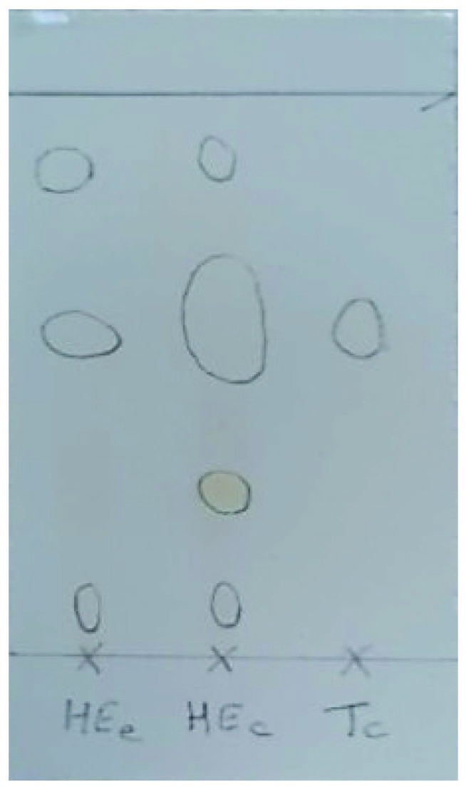
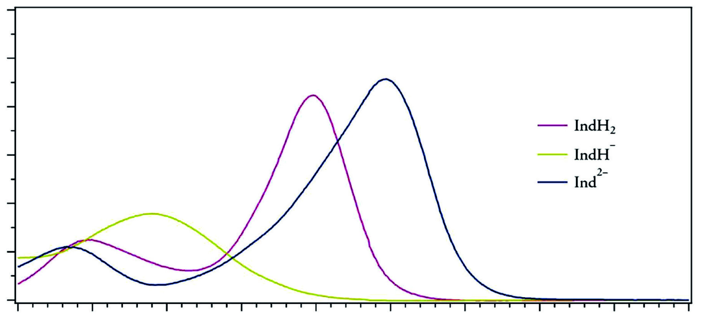
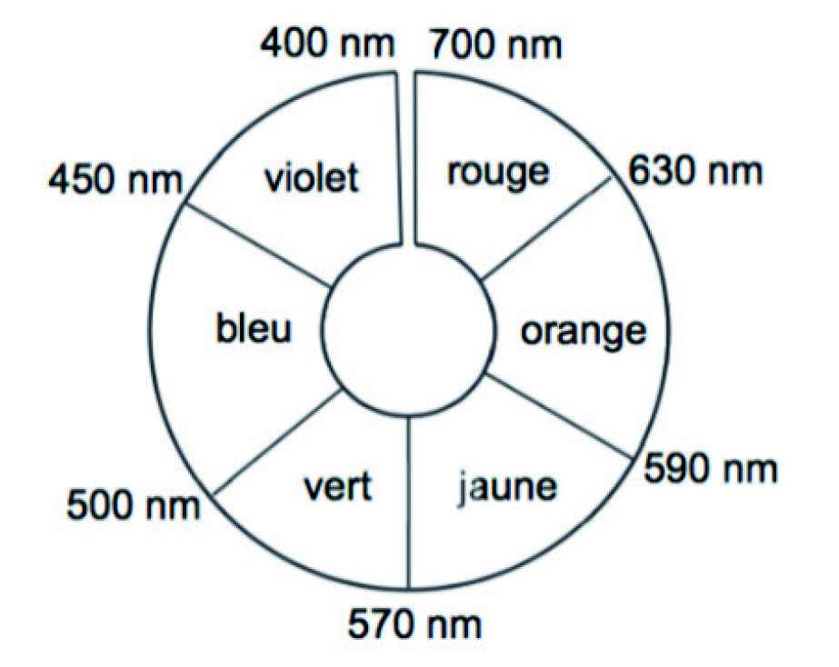

# spe-physique-chimie-2024-metropole-1-sujet-officiel

> Source : `../../../pdf_version/10_pc/2024/spe-physique-chimie-2024-metropole-1-sujet-officiel.pdf` — conversion Markdown (texte + visuels utiles).
> Stratégie : [STRATEGIE_MARKDOWN.md](../../../STRATEGIE_MARKDOWN.md)

---

## Page 1

BACCALAURÉAT GÉNÉRAL
                     ÉPREUVE D’ENSEIGNEMENT DE SPÉCIALITÉ

                                    SESSION 2024

                             PHYSIQUE-CHIMIE

                               Mercredi 19 juin 2024

                             Durée de l’épreuve : 3 heures 30

             L’usage de la calculatrice avec mode examen actif est autorisé.
          L’usage de la calculatrice sans mémoire, « type collège » est autorisé.

              Dès que ce sujet vous est remis, assurez-vous qu’il est complet.
                Ce sujet comporte 12 pages numérotées de 1/12 à 12/12.

                      L’annexe page 12 est à rendre avec la copie.

24-PYCJ1ME1                                                                         Page 1/12

---

## Page 2

Exercice 1 - Vers le bleu de thymol (9 points)

Le bleu de thymol est un indicateur coloré acido-basique de plus en plus utilisé dans les laboratoires. Suivant les
recommandations de l’INRS (Institut National de Recherche et de Sécurité), il se substitue en effet à la
phénolphtaléine, couramment utilisée auparavant, et qui est désormais classée CMR (Cancérigène Mutagène
Reprotoxique). Comme le montre la figure 1, le bleu de thymol peut être synthétisé à partir du thymol, lui-même
extrait de la plante de thym ou synthétisé à partir du m-crésol.
                                                                                                      OH

                                                                                         O
                                                                                                 O
                                                                                             S
                    extraction             extraction                     synthèse   O

                    de l’huile             du thymol                 OH
                                                                                                           OH

  bouquet de thym            huile essentielle
                                 de thym                    thymol
                                                                                             bleu de thymol

                                                 synthèse
                                     OH
                              m-crésol

                             Figure 1. Modes d’obtention possibles du bleu de thymol

L’objectif de cet exercice est d’étudier deux modes d’obtention du thymol puis de s’intéresser au bleu de thymol en
tant qu’alternative à la phénolphtaléine comme indicateur coloré.

1. Extractions successives

Le thym est une petite plante cultivée depuis l’antiquité dans les régions du pourtour méditerranéen. Appréciée en
cuisine pour ses arômes, la plante est également utilisée pour ses vertus thérapeutiques dues au thymol, constituant
principal de l’espèce de thym étudiée dans cet exercice.

Données :
   le thymol, à température ambiante, se présente sous la forme de cristaux incolores à l’odeur caractéristique ;
   la solubilité du thymol est faible dans l’eau et forte dans les solvants organiques ;
   le traitement d’un échantillon de 100 g de thym d’origine française permet d’obtenir au maximum 2 g d’huile
    essentielle de thym ;
   la configuration électronique de l’oxygène dans son état fondamental est : (1s)2(2s)2(2p)4 ;
   l’hexane est un solvant organique de densité d = 0,66 et non miscible à l’eau ;
   le couple thymol / ion thymolate est noté : R–OH / R–O –.

Q1. Écrire la formule semi-développée du thymol puis entourer et nommer son groupe caractéristique.

Q2. Représenter le schéma de Lewis de l’ion thymolate, noté R–O –.

Du thym à l’huile essentielle de thym

L’hydrodistillation est l’une des techniques d’extraction des huiles essentielles préconisées par la législation
européenne.
Suite à l’hydrodistillation d’un échantillon de thym, on réalise une chromatographie sur couche mince de l’huile
essentielle obtenue, les échantillons étant solubilisés dans un solvant adapté. Le chromatogramme est représenté
figure 2.

24-PYCJ1ME1                                                                                                   Page 2/12

---

## Page 3

   Dépôt HEe : huile essentielle
                                                             obtenue expérimentalement ;
                                                            Dépôt HEc : huile essentielle
                                                             commerciale de thym ;
                                                            Dépôt Tc : thymol du commerce

                         HEe         HEc      Tc

                                           Figure 2. Chromatogramme obtenu

Q3. Justifier que l’huile essentielle obtenue expérimentalement est un mélange qui contient du thymol.

De l’huile essentielle au thymol

Un article scientifique propose le protocole d’extraction du thymol de l’huile essentielle suivant :
    -   ajouter 1,0 mL d’huile essentielle de thym à 5 mL de solution aqueuse d’hydroxyde de sodium ;
    -   après chauffage dans un four à micro-ondes, éliminer la phase huileuse puis acidifier la phase aqueuse à
        l’aide d’acide chlorhydrique ;
    -   ajouter de l’hexane, agiter, laisser décanter et récupérer la phase contenant le thymol.

Après évaporation du solvant, on obtient des cristaux dont la masse correspond à 31 % de la masse de thymol
présent initialement dans l’huile essentielle.
                                                       D’après Journal of Medicinal Plants and By-products, 2021
Donnée :
   Le pourcentage massique moyen en thymol de l’huile essentielle de thym est de 53 %.

Q4. Écrire l’équation de la réaction modélisant l’action de l’acide chlorhydrique sur l’ion thymolate R–O –.

Q5. En déduire la nature et la position de la phase dans laquelle se trouve le thymol à l’issue de la décantation.

Q6. Montrer que la masse de plante de thym à utiliser pour obtenir 1 g de thymol vaut près de 300 g.

2. Synthèse du thymol

Le thymol utilisé dans les produits pharmaceutiques est principalement obtenu par synthèse. Comme indiqué en
figure 3, le thymol peut être industriellement synthétisé à partir de m-crésol et de propène en excès, en présence
d’oxyde d’aluminium, qui joue ici le rôle de catalyseur. Cette transformation génère plusieurs produits secondaires et
rend complexe l’obtention sélective du thymol.

                                                      Oxyde d’aluminium Aℓ2O3
                                      +                                                           OH
                                OH
                     m-crésol              propène
                                                                                         thymol

                                Figure 3. Exemple d’un procédé de synthèse du thymol

24-PYCJ1ME1                                                                                                Page 3/12

---

## Page 4

Données :
    masse volumique de l’eau : 1,00×103 g·L–1 ;
    tableau rassemblant des propriétés physiques et chimiques de quelques molécules :

                                                                          Quelques produits secondaires
    Molécule        m-crésol      propène       thymol          P1             P2             P3              P4

    Formule
  topologique                OH                          OH
                                                                     OH             OH
                                                                                                    OH             OH

  Température
   d’ébullition       203          – 47,7         233            -              -              -               -
      (°C)
 Masse molaire
                     108,1          42,1         150,2           -              -              -               -
   (g·mol–1)

    Densité           1,03            -            -             -              -              -               -

Q7. Déterminer si les produits secondaires P2 et P4 de la réaction sont des isomères du thymol.

De nombreux catalyseurs ont récemment été développés dans le but, entre autres, de réduire la température de la
synthèse et d’obtenir une sélectivité maximale en thymol.

Q8. Donner la définition d’un catalyseur et indiquer en quoi son utilisation peut permettre de « réduire la température
de la synthèse ».

On considère que la transformation entre le m-crésol et le propène n’est pas totale et que l’état final de la
transformation est un état d’équilibre chimique.

Q9. Expliquer l’intérêt d’introduire le propène en excès dans cette synthèse industrielle.

Une distillation fractionnée industrielle permet de purifier le thymol et de récupérer le m-crésol n’ayant pas réagi en
vue de son recyclage.

Q10. Justifier que le thymol et le m-crésol peuvent a priori être séparés lors de la distillation fractionnée. Indiquer
l’espèce que l’on récupèrerait en premier.

Q11. En considérant le m-crésol comme réactif limitant dans la transformation, dont le rendement est de 73 %,
vérifier que le volume de m-crésol nécessaire pour synthétiser 1,0 g de thymol par le procédé de la figure 3 est
inférieur à 1 mL.

24-PYCJ1ME1                                                                                                Page 4/12

---

## Page 5

3. Le bleu de thymol

La phénolphtaléine est un indicateur coloré acide-base adapté pour les titrages d’acide faible. L’objectif de cette
partie est de montrer qu’il en est de même pour le bleu de thymol.

Données :
   phénolphtaléine : indicateur coloré acide-base passant de l’incolore au rose dans la zone de virage
     expérimentale de pH [8,2 – 9,9] ;
   bleu de thymol : indicateur coloré acide-base ayant trois formes participant à deux couples acide-base
    d’écriture simplifiée BTH2(aq) / BTH–(aq) et BTH–(aq) / BT2–(aq) ;
   pour discuter de l’accord du résultat d’une mesure avec une valeur de référence, on peut utiliser le
                 |x−xref |
      quotient               avec x la valeur mesurée, xref la valeur de référence et u(x) l’incertitude-type associée à la
                  u(x)
      valeur mesurée x.

                                      pH
                              14

                              12

                              10

                                  8

                                  6

                                  4

                                  2

                                  0                                                                         V (mL)
                                      0            5                10               15                20

        Figure 4. Simulation du titrage de 10,0 mL d'une solution d’un acide faible (acide éthanoïque) de
concentration 0,100 mol·L–1 par une solution de base forte (hydroxyde de sodium) de concentration 0,100 mol·L–1

     Proportions (%)
     100
      90
      80
      70
      60                                                                                                  Proportion
                                                                                                         Proportion    BTH2
                                                                                                                    BTH2
      50                                                                                                  Proportion
                                                                                                         Proportion    BTH–
                                                                                                                    BTH-
      40                                                                                                  Proportion
                                                                                                         Proportion    BT2–
                                                                                                                    BTH2-
      30
      20
      10
       0                                                                                               pH
           0       1          2            3   4   5     6      7        8    9     10     11     12

           Figure 5. Diagramme de distribution des espèces du bleu de thymol (d’après BUP, mai 2019)

24-PYCJ1ME1                                                                                                     Page 5/12

---

## Page 6

A
          1,2

          1,0          BTH2                                                  BT2–

          0,8                        BTH–

          0,6

          0,4

          0,2

                                                                                                    λ (nm)
           0
                350     400      450      500     550      600      650       700    750      800

                Figure 6. Spectre d’absorption UV-visible des trois formes acide-base du bleu de thymol
                                                (d’après BUP, mai 2019)

                                             Figure 7. Cercle chromatique.

Q12. Parmi les espèces participant aux couples acide-base du bleu de thymol, identifier la forme amphotère.

Q13. Exprimer la constante d’acidité KA d’un couple acide-base noté HA / A– en fonction des concentrations des
espèces associées à l’équilibre.

Q14. À l’aide de l’ensemble des informations proposées, déterminer la valeur du pKA du couple BTH–(aq) / BT2–(aq)
du bleu de thymol. Justifier que celui-ci puisse remplacer la phénolphtaléine dans nos laboratoires, en précisant le
changement de couleur observé lors du titrage d’un acide faible par une base forte.

Le candidat est invité à prendre des initiatives et à présenter sa démarche même si elle n’a pas abouti. La démarche
suivie est évaluée et nécessite donc d’être correctement présentée.

Q15. La valeur tabulée du pKA à 25°C du couple acide-base BTH–(aq) / BT2–(aq) est de 8,9. Indiquer si la valeur
expérimentale obtenue est en accord avec celle-ci. L’incertitude-type associée au pKA déterminé par cette méthode
est estimée à u(pKA) = 0,2.

24-PYCJ1ME1                                                                                               Page 6/12

---

## Page 7

Exercice 2 - Observation d’un avion en vol (5 points)

Le trafic aérien est source de fascination pour beaucoup de gens. Notre observation se limite souvent à la traînée
de l’avion dans le ciel ou, plus récemment, à un suivi en direct (trajectoire, vitesse, altitude) grâce à des applications
en ligne.

L’objectif de cet exercice est d’étudier l’observation, avec une lunette astronomique afocale commerciale, de certains
détails de la structure d’un avion de type A312 en vol, puis de déterminer la vitesse de cet avion en phase
d’atterrissage grâce à un enregistrement du son émis par le moteur.

Données :
    les valeurs du grossissement G de la lunette astronomique utilisée sont comprises entre 16 et 48 ;
    un observateur peut distinguer deux points différents A et B d’un objet si l’angle  sous lequel ces deux
      points sont vus depuis le point d’observation (voir figure ci-dessous) est supérieur ou égal à 3,0×10–4 rad ;

            B

            A                                                                                            Œil

       approximation dans le cas des petits angles ( << 1 rad) : tan() =  ;
       quelques données concernant un avion A312 :
            o longueur de l’avion : L = 44,5 m ;
            o altitude de vol de croisière de l’avion : h = 10,4 km ;
            o vitesse de vol de croisière de l’avion : vc = 863 km·h–1 ;
            o hublot de l’avion A312 :

                                                33 cm

                                                               23 cm

1. Observation d’un avion A312 avec une lunette astronomique

Q1. Donner la définition d’une lunette afocale.

Q2. Sur le schéma EN ANNEXE À RENDRE AVEC LA COPIE, placer le foyer objet F2 puis le foyer image F2 de
l’oculaire de la lunette astronomique.

L’avion vole à la verticale de l’observateur et se trouve donc à la distance h de celui-ci.

Sur le schéma EN ANNEXE À RENDRE AVEC LA COPIE, les extrémités avant et arrière de l’avion observé sont
respectivement modélisées par les points A∞ et B∞ , situés à une très grande distance de l’observateur.

Q3. Construire, sur le schéma EN ANNEXE À RENDRE AVEC LA COPIE, la marche des deux rayons lumineux
issus de B∞ qui émergent de la lunette, en faisant apparaître l’image intermédiaire A1 B1 .

L’angle  désigne l’angle sous lequel l’avion est observé à l’œil nu. L’angle sous lequel l’avion est observé au travers
de l’oculaire de la lunette astronomique est nommé ’.

Q4. Vérifier à l’aide d’un calcul que l’on peut distinguer, à l’œil nu, l’avant de l’avion de sa queue.

Q5. Après avoir placé les angles  et ’ sur le schéma EN ANNEXE À RENDRE AVEC LA COPIE, rappeler
l’expression du grossissement G d’une lunette astronomique en fonction des angles  et ’.

Q6. Déterminer si on peut distinguer l’un de l’autre les deux bords verticaux d’un hublot de l’avion, à l’aide de la
lunette astronomique étudiée.

24-PYCJ1ME1                                                                                                     Page 7/12

---

## Page 8

2. Détermination de la vitesse d’un avion A312 en phase d’atterrissage

Au voisinage de l’aéroport, un observateur enregistre le son du moteur de l’avion passant au-dessus de lui lors de
sa phase d’atterrissage. L’observateur est supposé fixe lors de l’enregistrement du son.

L’analyse du signal sonore enregistré permet de déterminer les fréquences des signaux reçus par l’observateur.
Lorsque l’avion s’avance en direction de l’observateur la fréquence mesurée est fA = 2,2 kHz, et lorsqu’il s’éloigne la
fréquence est fE = 1,5 kHz.

Q7. Donner le nom du phénomène mis en jeu dans cette expérience.

On note f0 la fréquence du signal émis par la source immobile, c la vitesse du son dans l’air dans les conditions de
l’expérience et v la vitesse de l’avion par rapport au sol. On donne c = 345 m·s–1.

Q8. Parmi les propositions A, B, C et D suivantes, choisir et recopier sur la copie la proposition correcte. Expliquer
pourquoi les autres propositions sont à écarter.

                     A                        B                          C                         D
                    c                             c                          c                          c
              fA =                     fA = f0 ∙                  fA = f0 ∙                fA = f0 ∙
                   c–v                           c–v                        c+v                      c – 2v
                    c                             c                          c                          c
              fE =                     fE = f0 ∙                  fE = f0 ∙                 fE = f0 ∙
                   c+v                           c+v                        c–v                       c+v

Q9. Déterminer la vitesse v de l’avion, exprimée en km·h–1, lors de cet atterrissage. Commenter.

Le candidat est invité à prendre des initiatives et à présenter la démarche suivie, même si elle n’a pas abouti. La
démarche est évaluée et nécessite d’être correctement présentée.

24-PYCJ1ME1                                                                                                   Page 8/12

---

## Page 9

Exercice 3 - Accéléromètre d’un mobile multifonction (6 points)

Les mobiles multifonctions, souvent appelés smartphones, sont équipés de
plusieurs capteurs leur permettant d’être utilisés comme des instruments de
mesure. Par exemple, la plupart des smartphones disposent d’un accéléromètre,
capteur qui permet de mesurer l’accélération à laquelle le téléphone est soumis.

L’objectif de cet exercice est d’établir un modèle de la force de frottement
s’exerçant sur un smartphone chutant dans l’air, à l’aide des mesures
d’accélération fournies par l’accéléromètre embarqué.

Données :
 masse du smartphone utilisé : m = 182 g ;
 intensité de la pesanteur terrestre : g = 9,81 m·s–2 ;
 dans tout l’exercice, on ne tient pas compte de la poussée d’Archimède exercée par l’air sur le smartphone.

Le mouvement du centre de masse G du smartphone est étudié dans le référentiel terrestre supposé galiléen,
muni d’un repère d’espace d’axe (Oz), vertical, orienté vers le haut et de vecteur unitaire k��⃗ (voir figure 1). À la
date t = 0, le smartphone est lâché à plat, avec une vitesse initiale nulle. Son centre de masse G se trouve
alors au point H de coordonnée z = h. Il est réceptionné quelques instants plus tard sur un coussin posé au
sol. Lorsque le smartphone est en contact avec le coussin, son centre de masse est à l’altitude z = 0.
                            z
                 h                  H

                                   G
                                               Smartphone à plat en chute

                     ���⃗
                     k
                 0
                                Coussin

                                Figure 1. Modélisation de la chute du smartphone

1. Modèle de la chute libre sans frottement

On fait tout d’abord l’hypothèse que le smartphone est en mouvement de chute libre verticale. On ne tient
donc pas compte des forces de frottement exercées par l’air sur le smartphone en mouvement.

Q1. Dans ce modèle, faire un bilan des forces appliquées au système {smartphone}. En déduire l’expression
de la coordonnée az de l’accélération du centre de masse G du système.

Q2. Établir l’expression de la coordonnée vz(t) de la vitesse du centre de masse G du système puis montrer
que l’équation horaire de l’altitude z(t) du centre de masse G a pour expression :

                                                    1
                                            z(t) = – · g·t 2 + h
                                                    2

On choisit l’origine de l’énergie potentielle de pesanteur EPP(z) au niveau de l’origine de l’axe (Oz) :
EPP(z = 0) = 0.

Q3. Justifier que l’énergie        mécanique      EM    du   smartphone     est   constante    et   qu’elle   a   pour
expression : EM = m·g·h.

24-PYCJ1ME1                                                                                               Page 9/12

---

## Page 10

2. Étude expérimentale de la chute du smartphone

Pour confronter le modèle de chute libre sans frottement à l’expérience, on lâche à la date t = 0 un téléphone
équipé d’un accéléromètre, avec une vitesse initiale nulle depuis la hauteur h = 1,70 m. La figure 2 est obtenue
à partir des valeurs de l’accélération enregistrées par le capteur entre le lâcher du téléphone et la
date t = 0,47 s.

                         0    0,05       0,1    0,15       0,2     0,25       0,3    0,35     0,4        0,45       0,5
                    0
                                                                                                                 t (s)
                    -2

                    -4
  az (en m·s–2 )

                    -6

                    -8

                   -10

                   -12
                              Figure 2. Accélération verticale az du smartphone en fonction du temps t

Q4. Indiquer, en justifiant, si l’évolution temporelle de la valeur de la composante az de l’accélération obtenue
expérimentalement est compatible avec le modèle de chute libre sans frottement.

Le traitement des données acquises permet de tracer l’évolution temporelle de trois formes d’énergies du
smartphone : énergie potentielle de pesanteur EPP(t), énergie cinétique EC(t) et énergie mécanique EM(t),
comme représenté sur la figure 3.

                   3,5
                                                        EM(t)
                    3

                   2,5

                                     Courbe A
  Énergies (J)

                    2

                   1,5

                    1
                              Courbe B
                   0,5

                    0
                         0    0,05       0,1     0,15       0,2     0,25       0,3    0,35      0,4        0,45          0,5
                                                                  Temps (s)

                    Figure 3. Représentations graphiques de EPP(t), EC(t) et EM(t) lors de la chute du smartphone

Q5. Associer, en justifiant, chaque courbe d’évolution temporelle A et B de la figure 3 à la forme d’énergie
correspondante.

24-PYCJ1ME1                                                                                                     Page 10/12

---

## Page 11

Q6. Montrer, à partir de la figure 3, que la vitesse du smartphone est proche de 5 m·s–1 à la date t = 0,45 s.

Les actions de frottement de l’air sur le smartphone sont représentées par une force f ⃗ verticale et dirigée vers
le haut. Cette force est nulle lorsque la vitesse du smartphone est nulle.

Q7. En appliquant la deuxième loi de Newton au système {smartphone}, montrer que la coordonnée verticale
de la force de frottement vérifie :
                                              f m·(az + g)

Les données expérimentales permettent de représenter les variations de la composante verticale de
l’accélération az du smartphone en fonction du carré v2 de sa vitesse. Les résultats sont représentés sur la
figure 4. Les données expérimentales sont correctement représentées par une modélisation affine :

                  az = 0,0555 × v 2 – 9,80          où az est exprimée en m·s–2 et v en m·s–1

 az en m·s–2
        0               5                 10                 15                20                 25       v2 en m2·s–2
 -8,2

 -8,4

 -8,6

 -8,8

   -9

                                                                       : Données expérimentales
 -9,2                                                                       : Modélisaton affine

 -9,4

 -9,6

 -9,8

  -10

                      Figure 4. Modélisation de la représentation de az en fonction de v2

Q8. Déterminer la valeur expérimentale de l’intensité de la pesanteur g que l’on peut déduire de cette
expérience.

Q9. Montrer que l’on peut déduire de ces résultats que la force de frottement exercée par l’air peut s’écrire
f k v2 où k est un coefficient dont on donnera la valeur et l’unité.

Q10. Calculer la valeur f de la force de frottement en fin de chute. Comparer cette valeur à celle du poids du
smartphone et commenter.

24-PYCJ1ME1                                                                                            Page 11/12

---

## Page 12

Page blanche laissée intentionnellement.
        Ne rien inscrire dessus.

---

## Page 13

ANNEXE À RENDRE AVEC LA COPIE

              Oculaire

                                          F'1
              Objectif

                              B∞

                                     A∞

24-PYCJ1ME1                                              Page 12/12

---

## Page 14

