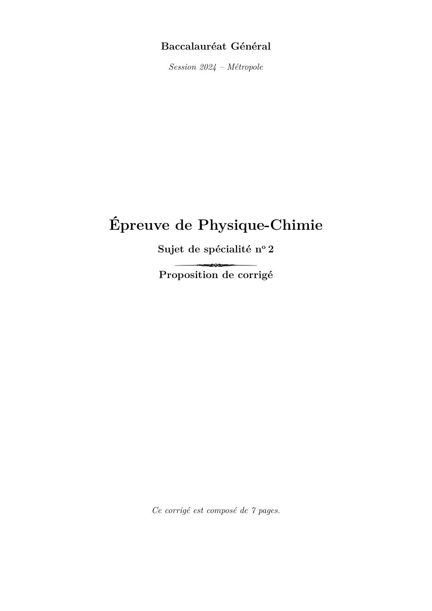
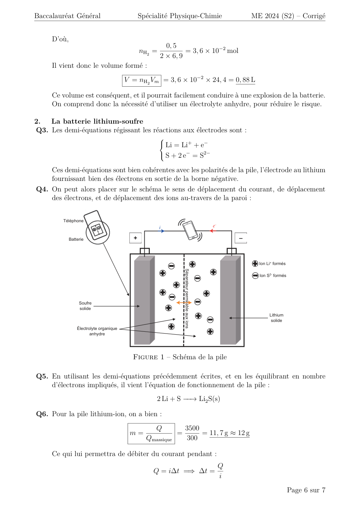
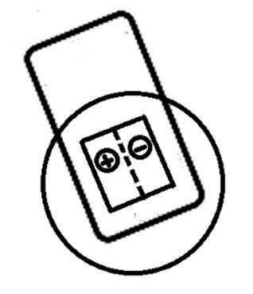

# spe-physique-chimie-2024-metropole-2-corrige

> Source : `../../../pdf_version/10_pc/2024/spe-physique-chimie-2024-metropole-2-corrige.pdf` — conversion Markdown (texte + visuels).
> Stratégie : [STRATEGIE_MARKDOWN.md](../../../STRATEGIE_MARKDOWN.md)

---

## Page 1

Baccalauréat Général
         Session 2024 – Métropole

Épreuve de Physique-Chimie
      Sujet de spécialité no 2

      Proposition de corrigé

     Ce corrigé est composé de 7 pages.

---

## Page 2

Baccalauréat Général                 Spécialité Physique-Chimie                            ME 2024 (S2) – Corrigé

Exercice 1 —           Autour du basket-ball
1.  Étude d’une trajectoire idéale
Q1. On étudie le mouvement du ballon, supposé ponctuel de masse m constante, dans le
    référentiel terrestre supposé galiléen. La seule force s’exerçant sur lui étant son poids, la
    deuxième loi de Newton permet d’écrire :
                            m⃗a = m⃗g =⇒ ⃗a = a → −
                                                  u +a →  −
                                                          u = ⃗g = −g →
                                                                   x x
                                                                       −
                                                                       u  y y              y

     Et il vient alors, par projection sur les axes →
                                                    −
                                                    ux et →
                                                          −
                                                          uy :
                                                  
                                                   a (t) = 0
                                                          x
                                                                                                              (1)
                                                   ay (t) = −g

Q2. On peut alors intégrer cette relation en temps, sous la condition initiale ⃗v (t = 0) = →
                                                                                            −
                                                                                            v0 =
            →
            −            →
                         −
    v0 cos αux + v0 sin αuy , ce qui donne :
                                        
                                         v (t) = v cos α
                                              x                0
                                                                                                              (2)
                                         vy (t) = −gt + v0 sin α

                                                   −−→
Q3. De la même manière, sous la condition initiale OM (t = 0) = Hm →
                                                                   −
                                                                   uy , on intègre (2) :
                                
                                 x(t) = v cos(α)t
                                                  0
                                                                                                              (3)
                                 y(t) = − 1 gt2 + v0 sin(α)t + Hm
                                                      2

Q4. On cherche à exprimer y en fonction de x. Pour cela, on commence par réécrire x(t) pour
    isoler t en fonction de x à partir de (3) :
                                        (3)                                         x
                                 x(t) = v0 cos(α)t =⇒ t =                                                     (4)
                                                                                v0 cos α
     On peut alors injecter (4) dans l’expression de y obtenue en (3) :
                                                              2
                                 1     x                                              x
                                        
                         y(x) = − g                                + v0 sin α ×            + Hm
                                 2 v0 cos α                                       v0 cos α
     Et il vient donc bien, en réorganisant les termes :
                                                          g
                                y(x) = −                            x2 + x tan α + Hm                         (5)
                                              2v02 cos2 α

Q5. Pour atteindre le centre du panier, on souhaite v0c telle que y(x = L) = Ha . Il vient donc,
    avec (5) :
                                                  g
                   y(x = L) = Ha ⇐⇒ − 2              2
                                                         L2 + L tan α + Hm = Ha
                                             2v0c cos α
                                                gL2
                                   ⇐⇒ − 2                = Ha − Hm − L tan α
                                             2v0c cos2 α
                                           2                  gL2
                                   ⇐⇒ v0c     =
                                                 2 cos2 α(Hm + L tan α − Ha )
     Et comme v0c > 0, on peut passer à la racine et on obtient finalement bien :
                                      v
                                                           gL2
                                      u
                                      u
                               v0c   =t                                                                       (6)
                                            2 cos2 α · (L tan α + Hm − Ha )

                                                                                                     Page 2 sur 7

---

## Page 3

Baccalauréat Général                    Spécialité Physique-Chimie               ME 2024 (S2) – Corrigé

 Q6. Pour α = 49, 5◦ , on a donc :
                              v
                                                       9, 81 × 4, 62
                              u
                                                                                         = 7, 3 m · s−1
                              u
          v0c   (α = 49, 5) = t
                                  2 × cos2 (49, 5) × (4, 6 × tan(49, 5) + 2, 30 − 3, 05)

 Q7. Pour une distance de 2 mètres du panier, on lit graphiquement α = 55, 3◦ pour nécessiter
     la vitesse minimale. On remarque donc que le lancer ici réalisé est bien plus en cloche que
     le lancer-franc, il aura donc statistiquement davantage de chances de rentrer.
 Q8. Dans le cas α → 90◦ , on tend vers la situation où le joueur lance verticalement le bal-
     lon vers le haut. Dans ce cas là, il devient physiquement très difficile, voire impossible,
     d’espérer atteindre le panier (vy → 0).
 Q9. La condition « le ballon ne passe pas par-dessus l’arceau » se traduit par : max(y) < Ha.
Q10. Avec les lignes 89 à 92, on vérifie bien que le ballon ne touche pas l’arceau en vérifiant
     en tout point de la trajectoire si le centre de masse du ballon est distant de moins de son
     rayon avec l’arceau 1 .
Q11. L’angle initial minimal calculé est légèrement inférieur à l’angle minimal donné par le
     site, mais est tout de même relativement proche, donc vraisemblable. On peut cependant
     rajouter que les frottements sont ici négligés mais devraient être pris en compte pour
     obtenir une valeur calculée plus exacte (d’où la différence de 2 degrés).

2.   Étude du dribble et du rebond du ballon
Q12. Le ballon est initialement sans vitesse, à une altitude positive. Il possède donc, initiale-
     ment, une énergie potentielle de pesanteur, mais pas d’énergie cinétique. En prenant cela
     en compte, il vient aisément que la courbe 2 correspond à l’énergie cinétique, la courbe 3
     à l’énergie potentielle de pesanteur, et enfin la courbe 1 à l’énergie mécanique.
Q13. En lisant graphiquement l’énergie mécanique avant et après le rebond, il vient :
                         ∆Em = Em (R+) − Em (R− ) = 3, 6 − 6 = −2, 4 J ≈ −2, 5 J

Q14. On remarque, entre le début et la fin de la chute du ballon, une perte d’énergie mécanique
     qui peut être considérée comme conséquente (de 6 J à 5, 6 J). Il est donc légitime de
     considérer les frottements non négligeables.
Q15. Pour permettre au ballon de remonter à une hauteur d’au moins 1 mètre, il suffit de lui
     conférer une énergie cinétique permettant a minima de compenser la perte d’énergie lors
     du rebond. Il faut alors :
                                                                            s
                                         1                                      2 |∆Em |
                          Ec = |∆Em | =⇒ mv 2 = |∆Em | =⇒ v =
                                         2                                         m
      D’où,                           s
                                            2 × 2, 5
                               v=                    = 2, 9 m · s−1 = 11 km · h−1
                                          600 × 10−3

3.   Entendre l’arbitre lors d’un match
Q16. On souhaite savoir si le remplaçant devra porter des protections auditives lorsque l’arbitre
     siffle proche de lui. On a, pour le remplaçant à une distance d2 de l’arbitre :
                                                           P
                                                     I=                                                   (7)
                                                          4πd22
   1. NB : une manière plus habile de programmer cette vérification serait de s’épargner du calcul inutile en
sortant de la boucle (instruction break) dès qu’on passe test à True

                                                                                              Page 3 sur 7

---

## Page 4

Baccalauréat Général                   Spécialité Physique-Chimie                         ME 2024 (S2) – Corrigé

     Et il vient donc le niveau d’intensité sonore :
                                                                                   !
                                                I                       P
                                                        
                                                             (7)
                                    L2 = 10 log              = 10 log                                        (8)
                                                I0                    4πd22 I0
     Or, à ce stade, la puissance P est inconnue. On va donc utiliser le critère qui nous est
     donné en fonction du niveau sonore ambiant LA , permettant au sifflet de l’arbitre d’être
     entendu par tous les joueurs (même le plus éloigné à une distance d1 ) :
                                                                               !
                                                         P
                            L1 − LA ≥ 3 =⇒ L1 = 10 log                             ≥ 3 + LA
                                                       4πd21 I0
     Ou, en passant à la puissance de 10 2 :
                                                                   3+LA
                                              P ≥ 4πd21 × 10 10 I0                                           (9)
     Et en injectant dans (8) :
                                                                        3+LA
                                                                              
                                                     4πd21 × 10 10 I0 
                                       L2 = 10 log 
                                                          4πd22 I0

     Alors finalement, en simplifiant :
                                              3+LA
                                                                                3+80
                                                                                          
                                  d2 × 10 10             202 × 10 10 
                     L2 = 10 log  1           = 10 log                = 109 dB
                                       d22                     12

     Cette valeur étant supérieure au seuil de danger, il ne peut être que conseillé au remplaçant
     de porter des protections auditives.

Exercice 2 —            Un champignon parfumé
1.  Étude des réactifs de la synthèse du cinnamate de méthyle
Q1. L’acide cinnamique, si on en croit son nom suivant la nomenclature IUPAC, est un acide
    carboxylique.
Q2. Parmi les espèces proposées, seule la A possède un groupe acide carboxylique. Il s’agit
    donc logiquement de l’acide cinnamique.

2.  Synthèse du cinnamate de méthyle à partir de chlorure de cinnamoyle
Q3. Lors de cette réaction, on remplace un chlore par un groupement hydroxyle. Il s’agit donc
    d’une substitution nucléophile.
Q4. Si on prend le temps de lire les consignes de sécurité du dichlorométhane et de l’éther
    de pétrole, on peut en déduire qu’il est nécessaire de manipuler sous sorbonne, avec des
    gants, une blouse de laboratoire et des lunettes de protection.
Q5. L’utilité du dichlorométhane est de pouvoir solubiliser correctement tous les réactifs, tout
    en évitant des réactions parasites avec le chloré.
Q6. Entre les ions oxonium et hydrogénocarbonate, on observe la réaction acide-base :
                                     H3 O+ + HCO3− −−→ H2 O + H2 CO3
     Et comme H2 CO3 est simplement du CO2 dissous dans l’eau (H2 CO3 = (CO2H2 O)), on
     comprend que le dégagement gazeux s’explique par la formation de dioxyde de carbone.
  2. par croissance stricte de la fonction x 7→ 10x sur R+

                                                                                                    Page 4 sur 7

---

## Page 5

Baccalauréat Général               Spécialité Physique-Chimie               ME 2024 (S2) – Corrigé

Q7. En supposant la réaction totale et une conversion complète des réactifs, en notant R le
    chlorure de cinnamoyle, il vient d’après l’équation bilan de la réaction :

                                                     nHCl = nR

     Ou, en masse introduite en réactif :
                                                           mR
                                                 nHCl =                                       (10)
                                                          M (R)

     Il faut donc introduire, si on exploite l’équation bilan de la réaction entre l’acide chlorhy-
     drique et les les ions hydrogénocarbonate nHCO3− = nHCl . Ou, en volume versé :

                                          nHCO3− = CVm = nHCl

     Et finalement :
                                       (10)    mR            mR
                                 CVm =              =⇒ Vm =
                                              M (R)         M (R)C
     D’où,
                                       8, 3
                            Vm =                 = 9, 96 × 10−2 L = 99, 6 mL
                                   166, 6 × 0, 5
Q8. On a, pour une synthèse, le rendement :
                                                          nexp
                                                     η=
                                                          nth
     Ou, en masse :
                                       mexp
                                      M (P)          mexp    M (P)   mexp
                                 η=    mth       =         ×       =                          (11)
                                      M (()P )
                                                     M (P)   mth     mth
     Et en utilisant l’équation de la réaction, on a pour le cinnamate de méthyle théoriquement
     obtenu :
                                             mR                 mR M (P)
                              nth = nR =            =⇒ mth =
                                            M (R)                 M (R)
     Il suffit alors d’injecter dans (11) :

                                      mexp M (R)   6, 2 × 166, 6
                                η=               =               = 77 %
                                      mR M (P)     8, 3 × 162, 2

     Ce qui est un rendement cohérent vu les conditions expérimentales (un peu faible pour
     une estérification depuis un chlorure d’acyle, mais malgré tout acceptable).

Exercice 3 —           Batterie Lithium-Soufre
1.  Le lithium
Q1. Dans cette réaction, on remarque que le lithium voit son nombre d’oxydation passer de 0
    à +I, il est donc réducteur.
Q2. Par un bilan de matière immédiat, il vient :
                                                      nLi     m
                                          nH2 =           =
                                                       2    2M (Li)

                                                                                      Page 5 sur 7

---

## Page 6

Baccalauréat Général                            Spécialité Physique-Chimie                                     ME 2024 (S2) – Corrigé

     D’où,
                                                          0, 5
                                                nH2 =            = 3, 6 × 10−2 mol
                                                        2 × 6, 9
     Il vient donc le volume formé :
                                         V = nH2 Vm = 3, 6 × 10−2 × 24, 4 = 0, 88 L

     Ce volume est conséquent, et il pourrait facilement conduire à une explosion de la batterie.
     On comprend donc la nécessité d’utiliser un électrolyte anhydre, pour réduire le risque.

2.  La batterie lithium-soufre
Q3. Les demi-équations régissant les réactions aux électrodes sont :
                                                        
                                                         Li = Li+ + e−
                                                         S + 2 e− = S2−

    Ces demi-équations sont bien cohérentes avec les polarités de la pile, l’électrode au lithium
    fournissant bien des électrons en sortie de la borne négative.
Q4. On peut alors placer sur le schéma le sens de déplacement du courant, de déplacement
    des électrons, et de déplacement des ions au-travers de la paroi :

         Téléphone
                                                        i                                         e–

             Batterie                       +                                                              –

                                                                                                                 Ion Li+ formés
                                                                  Séparateur perméable aux ions

                                                                                                                 Ion S2- formés

                  Soufre
                  solide
                                                                                                                      Lithium
                                                                                                                       solide
                 Électrolyte organique
                        anhydre

                                           Figure 1 – Schéma de la pile

Q5. En utilisant les demi-équations précédemment écrites, et en les équilibrant en nombre
    d’électrons impliqués, il vient l’équation de fonctionnement de la pile :
                                                     2 Li + S −−→ Li2 S(s)

Q6. Pour la pile lithium-ion, on a bien :
                                                     Q                3500
                                          m=                  =            = 11, 7 g ≈ 12 g
                                                  Qmassique           300

     Ce qui lui permettra de débiter du courant pendant :
                                                                                                       Q
                                                    Q = i∆t =⇒ ∆t =
                                                                                                       i
                                                                                                                                  Page 6 sur 7

---

## Page 7

Baccalauréat Général                 Spécialité Physique-Chimie          ME 2024 (S2) – Corrigé

     Ou, par gramme de matière active :

                                   ∆t   Q           3500
                           ∆tm =      =    =                     = 0, 54 h · g−1
                                   m    mi   11, 7 × 0, 55 × 103

Q7. Pour un gramme de soufre, on a la quantité de matière :
                                                    mS     1, 0
                                            nS =         =
                                                   M (S)   M (S)

     Ce qui permet donc d’écrire le nombre d’électrons produits :
                                                           2, 0
                                             ne− = 2nS =
                                                           M (S)

     Et il vient alors :
                                           2, 0      2, 0
                            Q = n e− F =         F =       × 96500 = 6012, 5 C
                                           M (S)     32, 1

     Ou, en exprimant dans l’unité demandée :
                                              6012, 5
                                        Q=            = 1610, 1 mAh
                                               3, 6
     La capacité massique par gramme de soufre actif de cette batterie est donc de :

                                           Qm = 1670, 1 mAh · g−1

     Ce qui représente une durée d’utilisation :

                                             Q     1670, 1
                                      ∆t =     =             = 3, 0 h
                                             i   0, 55 × 103

     Cette batterie est donc, a priori, plus intéressante que la batterie lithium-ion en termes
     de rapport masse sur durée de fonctionnement (même si la masse de lithium n’a pas été
     prise en compte, ce qui limite la comparaison).

                                                   * *
                                                    *

                                      Proposé par T. Prévost (thomas.prevost@protonmail.com),
                                                        pour le site https://www.sujetdebac.fr/
                                                                        Compilé le 2 septembre 2025.

                                                                                      Page 7 sur 7
