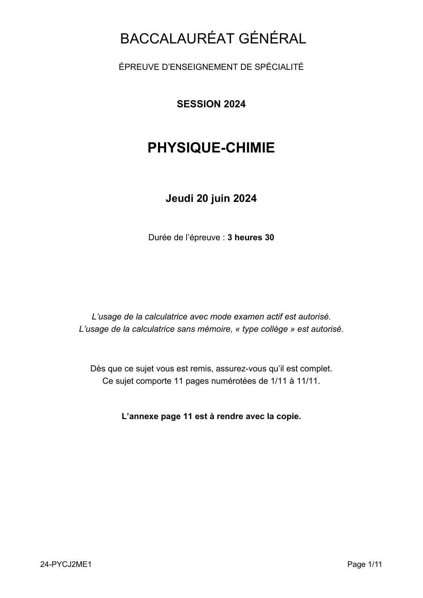

# spe-physique-chimie-2024-metropole-2-sujet-officiel

> Source : `../../../pdf_version/10_pc/2024/spe-physique-chimie-2024-metropole-2-sujet-officiel.pdf` — conversion Markdown (texte + visuels utiles).
> Stratégie : [STRATEGIE_MARKDOWN.md](../../../STRATEGIE_MARKDOWN.md)

---

## Page 1

BACCALAURÉAT GÉNÉRAL
                  ÉPREUVE D’ENSEIGNEMENT DE SPÉCIALITÉ

                                  SESSION 2024

                          PHYSIQUE-CHIMIE

                               Jeudi 20 juin 2024

                          Durée de l’épreuve : 3 heures 30

           L’usage de la calculatrice avec mode examen actif est autorisé.
        L’usage de la calculatrice sans mémoire, « type collège » est autorisé.

           Dès que ce sujet vous est remis, assurez-vous qu’il est complet.
             Ce sujet comporte 11 pages numérotées de 1/11 à 11/11.

                   L’annexe page 11 est à rendre avec la copie.

24-PYCJ2ME1                                                                       Page 1/11

---

## Page 2

Exercice 1 - Autour du basket-ball (11 points)

Le basket-ball est le deuxième sport collectif pratiqué en France, et
le premier dans les catégories féminines (source : SIMM-Consojunior
2011). Il figure parmi les sports olympiques lors des Jeux Olympiques
de Paris 2024.

Dans cet exercice on étudie trois aspects fondamentaux de ce sport :
l’optimisation de la trajectoire d’un tir, le rebond du ballon lors des
dribbles ainsi que la problématique des risques auditifs liés aux coups
de sifflet des arbitres.

                                                                                      Wikimedia commons
Données :
    masse du ballon : m = 600 g ;
    rayon du ballon : Rb = 12 cm ;
    valeur du champ de pesanteur supposé uniforme : g = 9,8 m·s −2 ;
    rayon de l’arceau du panier : Ra = 22,5 cm ;
    hauteur de l’arceau du panier, par rapport au sol : Ha = 3,05 m.

1. Étude d’une trajectoire idéale

Il est légitime pour un joueur de basket-ball de se demander comment obtenir la trajectoire la plus efficace
pour marquer un panier. Un site internet spécialisé dans le basket-ball donne le conseil suivant :

           « privilégier un angle de tir entre 47° et 55° par rapport à l’horizontale. On préconise les tirs en
                      cloche de façon à avoir une exploitation maximale de la surface du panier »
                                              (source : BasketSession.com)

                                                Arceau du panier
                            ���⃗
                            v0
                                   α

                                                                                 Ha
                            Hm

                                               L
           Figure 1. Schéma du lancer-franc considéré juste après que le ballon a quitté la main.

Première modélisation

Dans un premier temps, on s’intéresse au mouvement du centre de masse M d’un ballon lorsqu’un joueur
réalise un lancer-franc. On réalise l’étude dans le référentiel terrestre supposé galiléen et on considère qu’une
fois lancé, le ballon n’est soumis qu’à son propre poids. On néglige donc toute force de frottement de l’air sur
le ballon.

Quand le ballon quitte la main du joueur, son centre de masse M est situé à une hauteur Hm = 2,30 m par
rapport au sol et à une distance horizontale L = 4,6 m du centre C de l’arceau du panier (figure 1).
On étudie le mouvement dans le repère cartésien indiqué sur la figure 1 : le plan (Oxy) est un plan vertical
contenant la main du basketteur au moment où il lâche le ballon et le centre C de l’arceau. L’instant initial est

24-PYCJ2ME1                                                                                           Page 2/11

---

## Page 3

*(Suite de la page précédente — le document continue ici.)*

l’instant où le ballon quitte la main, avec un vecteur vitesse initial vሬሬሬԦ0 qui forme un angle α avec l’axe horizontal.
L’angle α est supposé différent de 90°.

                                                                            ሬԦሺtሻ du centre de masse M du
Q1. Montrer que dans le plan (Oxy), les coordonnées du vecteur accélération a
ballon peuvent s’écrire :
                                                    a ሺtሻ ൌ 0
                                            ሬԦሺtሻ ൬ x
                                            a                    ൰
                                                    ay ሺtሻ ൌ െ g

Q2. Exprimer les coordonnées du vecteur vitesse vሬԦሺtሻ du point M à chaque instant, notées :
                                                       vx ሺtሻ
                                              vሬԦሺtሻ ൬        ൰
                                                       vy ሺtሻ

Q3. Exprimer les coordonnées du vecteur position OM  ሬሬሬሬሬሬሬԦሺtሻ au cours du temps, notées :
                                              ሬሬሬሬሬሬሬԦ         xሺtሻ
                                              OMሺtሻ ൬               ൰
                                                               yሺtሻ

Q4. Montrer que l’équation de la trajectoire du centre de masse M du ballon peut s’écrire :
                                                    g
                              yሺxሻ ൌ െ          2
                                                             ൉ x2 ൅ x ൉ tanሺαሻ ൅ Hm
                                           2 ൉ v0 ൉ cos2 ሺαሻ

Un tir est considéré comme parfait lorsque le centre de masse M du ballon passe par le centre C de l’arceau
du panier, le ballon ne touchant pas le bord de l’arceau.

Q5. Montrer que pour un angle initial α et pour une distance L donnés, il existe une vitesse initiale v0c pour
laquelle la trajectoire du centre de masse du ballon passe par le centre du panier, dont l’expression est :

                                                                g ൉ L2
                                    v0c ൌ ඨ
                                              2 ൉ cos2 ሺαሻ ൉ ሺL ൉ tanሺαሻ ൅ Hm െ Ha ሻ

Q6. Lors d’un lancer-franc, on montre (démonstration non demandée) qu’un tir avec un angle initial de 49,5°
permet d’obtenir la vitesse initiale v0c la plus faible possible. Calculer cette vitesse.

On souhaite comparer cette vitesse à celle qu’un joueur situé à une distance L = 2 m du panier doit
communiquer au ballon. On trace sur les figures 2-a et 2-b la vitesse initiale à donner au ballon pour qu’il
passe par le centre C de l’arceau du panier en fonction de l’angle initial α, pour la distance L = 2 m.

                       Asymptotes

 Figure 2-a. Vitesse initiale à donner au ballon à une               Figure 2-b. Agrandissement de la zone
  distance L = 2 m pour qu’il atteigne le centre C de                       entourée de la figure 2-a
         l’arceau en fonction de l’angle initial

Q7. Déterminer graphiquement l’angle initial à choisir pour communiquer au ballon la vitesse initiale minimale
lui permettant de passer par le centre C de l’arceau, si le joueur est placé à la distance L = 2 m. Comparer les
valeurs de l’angle et de la vitesse ainsi trouvées à celles obtenues pour un lancer-franc. Commenter.

24-PYCJ2ME1                                                                                                 Page 3/11

---

## Page 4

Q8. On distingue sur la figure 2-a deux asymptotes verticales. Expliquer pourquoi lorsque l’angle de tir initial
se rapproche de 90°, la courbe de la vitesse en fonction de l’angle initial tend vers une asymptote.
Deuxième modélisation

Jusqu’à présent, la vitesse à communiquer au ballon a été déterminée à partir d’une seule condition : le centre
de masse M du ballon doit passer par le centre C de l’arceau. Il apparaît nécessaire de prendre en compte
deux conditions supplémentaires :
    condition 1 : un ballon qui ne passe pas par le dessus du panier n’est pas valide ;
    condition 2 : un ballon qui rebondit sur le bord du panier avant d’en atteindre le centre ne donne pas
        un tir parfait.

On souhaite s’appuyer sur un programme rédigé en langage Python pour déterminer les trajectoires qui
vérifient ces deux conditions.

La figure 3 présente un extrait du code qui permet de vérifier que le ballon rentre bien dans l’arceau, dans le
bon sens et sans le toucher. Le début du code (non représenté avant la ligne 80) permet de calculer la
trajectoire passant par le centre C de l’arceau pour un angle initial donné, selon l’étude réalisée en première
partie. Pour une trajectoire donnée, les coordonnées du centre de masse du ballon sont stockées dans les
tableaux (aussi appelés listes) x et y. Les valeurs de x sont comprises entre 0 et L.

 Figure 3. Partie du code qui permet de vérifier que le ballon passe bien dans l’arceau dans le bon sens et
                                               sans le toucher

Q9. Parmi les propositions ci-dessous, choisir et recopier sur la copie le code qu’il convient d’écrire pour
compléter la ligne 82, afin qu’elle permette de vérifier la condition « le ballon ne passe pas au-dessus de
l’arceau ». Les variables du programme, notées Ha et L, représentent respectivement les paramètres Ha et L.

      max(x) > L                 max(y) < Ha                  min(y) > L                 max(x) < Ha

Les fonctions max(x)et min(x)renvoient respectivement la plus grande et la plus petite valeur du tableau x.

Q10. Justifier que les lignes 89 à 92 permettent de tester la condition 2.

Q11. L’application des deux nouvelles conditions permet de déterminer que l’angle initial minimal pour réaliser
un tir parfait au lancer-franc est voisin de 45°. Commenter cette valeur au regard des conseils fournis par le
site internet cité en début d’exercice.

24-PYCJ2ME1                                                                                         Page 4/11

---

## Page 5

2. Étude du dribble et du rebond du ballon

Au basket-ball, il est interdit de se déplacer en portant la balle sur plus de trois pas. Il faut donc la faire rebondir
sur le sol (c’est le dribble). Il est donc important d’étudier les caractéristiques de ce rebond.

À cette fin, on réalise le protocole suivant :
     un ballon est lâché, sans vitesse initiale, d’une hauteur voisine d’un mètre ;
     il tombe, rebondit sur le sol dur et remonte ;
     le pointage du centre de masse M du ballon est réalisé à l’aide d’une chronophotographie. Ces
         données permettent d’obtenir les représentations graphiques de l’évolution des énergies cinétique,
         potentielle de pesanteur et mécanique du ballon au cours du temps (figure 4).

 Énergies (J)
   7

    6

    5

    4                                                                                                       ● courbe 1
                                                                                                          ▲ courbe 2
                                                                                                           courbe 3
    3

    2

    1

    0                                                                                                       Temps (s)
        0       0,1        0,2        0,3       0,4        0,5        0,6        0,7       0,8        0,9

                                 Figure 4. Évolution des énergies au cours du temps

Q12. Parmi les courbes 1, 2 et 3 de la figure 4, identifier celles qui représentent l’évolution de l’énergie
cinétique, de l’énergie potentielle de pesanteur et de l’énergie mécanique. Justifier chacune de ces
identifications.

Q13. Montrer que l’énergie perdue par le ballon lors du rebond est voisine de 2,5 J.

Q14. Indiquer, en justifiant, s’il est raisonnable dans cette étude de négliger les frottements en dehors du
moment où le ballon rebondit.

Q15. Lorsqu’on dribble, on ne lâche pas le ballon mais on le pousse vers le bas assez fort pour qu’il remonte
suffisamment haut pour continuer à dribbler. Déterminer la vitesse initiale minimale à communiquer à un ballon
lancé d’une hauteur d’un mètre pour qu’il remonte au moins à cette même hauteur.
On admet que la perte énergétique lors du rebond est la même qu’à la question Q13.

3. Entendre l’arbitre lors d’un match

Le basket-ball est un sport dans lequel le public peut se manifester bruyamment à n’importe quel moment.
Pour autant, l’arbitre, qui signale les fautes grâce à un sifflet, doit pouvoir être entendu par tous les joueurs.

On admet que l’on peut distinguer un son très bref et aigu du bruit ambiant si son niveau sonore est supérieur
d’au moins 3 dB à celui du bruit ambiant.

24-PYCJ2ME1                                                                                                  Page 5/11

---

## Page 6

On rappelle que :
 le niveau d’intensité sonore noté Lson s’exprime en dB et est lié à l’intensité sonore I au point considéré
    par :
                                                                   I
                                                  Lson = 10·log ൬ ൰
                                                                  I0
où I0 = 1 × 10−12 W·m−2 est conventionnellement la plus faible intensité sonore détectable par l’oreille humaine et
où log désigne le logarithme décimal ;

   si une source sonore ponctuelle de puissance sonore P est placée dans un milieu sans obstacle et non
    absorbant, alors l’intensité sonore à une distance d de la source s’exprime par :

                                                               P
                                                        I=
                                                             4·π·d2

   les sons trop forts constituent un danger pour l’appareil auditif. Lorsque le niveau d’intensité sonore est
    trop important, il faut porter des protections auditives, comme des bouchons d’oreilles. La figure 5 donne
    quelques ordres de grandeur de niveaux d’intensité sonore et indique, notamment, le seuil de danger au-
    delà duquel le son peut entraîner des lésions dans l’oreille.

        Figure 5. Échelle des niveaux d’intensité sonore perçus par l’oreille (source mur-silenzo.com)

Q16. On suppose que l’arbitre siffle au moment où est commise une faute. À cet instant, il est à une distance
d1 = 20 m du joueur le plus éloigné sur le terrain et à une distance d2 = 1,0 m d’un joueur remplaçant assis sur
un banc au bord du terrain. À l’aide d’un calcul, déterminer si le joueur remplaçant doit porter des protections
auditives, sachant que le bruit ambiant est de l’ordre de 80 dB.

Le candidat est invité à prendre des initiatives et à présenter la démarche suivie, même si elle n’a pas abouti.
La démarche est évaluée et doit être correctement présentée.

24-PYCJ2ME1                                                                                            Page 6/11

---

## Page 7

Exercice 2 - Un champignon parfumé (4 points)

Le tricholoma matsutake communément appelé matsutake, ou champignon des
pins, est un champignon rare et savoureux, recherché pour sa chair blanche
parfumée. Ce champignon est très apprécié dans la gastronomie japonaise. Une
des espèces chimiques responsable de ses propriétés aromatiques et gustatives
est le cinnamate de méthyle dont la formule topologique est donnée ci-après.

                                                                Source : Wikipédia

                                                           O

                                                         O CH3
                                        cinnamate de méthyle

La rareté et le coût élevé du champignon matsutake incitent l’industrie agro-alimentaire à synthétiser le
cinnamate de méthyle.

On se propose dans cet exercice d’étudier une synthèse de laboratoire de cet arôme.

Données :
    tableau comparatif des propriétés physico-chimiques de trois solvants :

                          Solvant                         Eau           Dichlorométhane      Éther de pétrole

                                                                         nocif ou irritant   nocif ou irritant
                Pictogrammes de sécurité

                                                                         danger pour la      danger pour la
                                                                             santé               santé
           Solubilité du chlorure de cinnamoyle        peu soluble          soluble             soluble
                  Solubilité du méthanol                 soluble             soluble            insoluble

                                               –
       couples acide / base : CO2(aq) / HCO3 (aq) et H3O+(aq) / H2O(ℓ) ;
       masses molaires :

                           Chlorure de cinnamoyle                    166,6 g·mol−1
                                  Méthanol                            32,0 g·mol−1
                           Cinnamate de méthyle                      162,2 g·mol−1

       masse volumique du méthanol : ρ = 0,792 g·mL−1 .

1. Étude des réactifs de la synthèse du cinnamate de méthyle

Le cinnamate de méthyle peut être synthétisé à partir du méthanol et de l’acide cinnamique, appelé
acide 3-phénylprop-2-énoïque en nomenclature systématique.

Q1. Nommer la famille fonctionnelle à laquelle appartient l’acide cinnamique. Justifier.

24-PYCJ2ME1                                                                                          Page 7/11

---

## Page 8

Q2. En déduire, parmi les trois composés A, B et C dont les formules topologiques sont données ci-dessous,
celui qui correspond à l’acide cinnamique. Justifier.

                              O                                    O                                  O

                              OH                                                                      O
                  A                                     B                                    C

2. Synthèse du cinnamate de méthyle à partir du chlorure de cinnamoyle

Dans les conditions expérimentales choisies, la réaction de synthèse du cinnamate de méthyle à partir de
l’acide cinnamique et du méthanol se produit avec un rendement de l’ordre de 40 %. On préfère alors faire
réagir le méthanol avec le dérivé chloré de l’acide cinnamique : le chlorure de cinnamoyle. La transformation
chimique est supposée totale et l’équation de la réaction modélisant la synthèse est la suivante :

                       O                                                         O
                              +    CH3OH                                                 +          HCℓ

                                                                                 O    CH3
                         Cℓ
   chlorure de cinnamoyle          méthanol                  cinnamate de méthyle         chlorure d’hydrogène

Q3. Parmi les catégories suivantes, identifier celle à laquelle appartient cette transformation :
                       oxydoréduction, acide-base, addition, élimination, substitution.

Le protocole de la synthèse du cinnamate de méthyle peut se présenter en deux étapes.
• Étape 1 : formation du cinnamate de méthyle
   - verser 5 mL de dichlorométhane dans un ballon de 100 mL contenant 8,3 g de chlorure de cinnamoyle et
   surmonté d’un tube réfrigérant ;
   - une fois le chlorure de cinnamoyle totalement dissous, ajouter 4,0 mL de méthanol ;
   - chauffer à reflux pendant 10 min.
• Étape 2 : isolement du produit de synthèse
   - une fois refroidi, laver le mélange réactionnel avec une solution aqueuse d’hydrogénocarbonate de
                            –
   sodium (Na+(aq) ; HCO3(aq)) de concentration 0,50 mol∙L−1 jusqu’à ce que le milieu ne soit plus acide ;
   - sécher la phase organique contenant le cinnamate de méthyle, puis filtrer ;
   - évaporer le dichlorométhane, puis récupérer le produit solide synthétisé.

Q4. Indiquer, en les justifiant, les consignes de sécurité qu’il est nécessaire de prendre lors de la mise en
œuvre de ce protocole.

Q5. Justifier l’utilisation du dichlorométhane comme solvant lors de l’étape 1 de la synthèse.

Dans l’étape 2, lorsqu’on ajoute la solution aqueuse d’hydrogénocarbonate de sodium dans le milieu réactionnel,
le chlorure d’hydrogène HCℓ réagit totalement avec l’eau pour former des ions H3O+ et des ions chlorure Cℓ–. Les
ions H3O+ formés réagissent avec les ions hydrogénocarbonate. On observe une effervescence.
                                                                                                              –
Q6. Écrire l’équation de la réaction ayant lieu entre les ions H3O+ et les ions hydrogénocarbonate HCO3.
Justifier l’observation d’une effervescence.

Q7. Déterminer le volume minimal de solution aqueuse d’hydrogénocarbonate de sodium nécessaire à la
disparition complète des ions H3O+ produit par le chlorure d’hydrogène HCℓ, en supposant la synthèse totale.

Le candidat est invité à prendre des initiatives et à présenter la démarche suivie même si elle n’a pas abouti.
La démarche suivie est évaluée et nécessite donc d’être correctement présentée.

Q8. La masse du produit solide obtenu expérimentalement vaut m = 6,2 g. Estimer le rendement de la
synthèse en supposant que le produit obtenu est pur. Commenter.

24-PYCJ2ME1                                                                                           Page 8/11

---

## Page 9

Exercice 3 - Batterie Lithium - Soufre (5 points)

Les appareils électroniques nomades (tablette, téléphone…) sont omniprésents et en évolution permanente.
L’autonomie de ces appareils repose sur l’utilisation de batteries qui stockent toujours plus efficacement
l’énergie. Les téléphones portables sont actuellement équipés de batteries lithium – ion mais des recherches
sont menées pour développer des batteries lithium – soufre.

La batterie lithium – soufre semble être en effet une alternative intéressante en raison de l’abondance et du
faible coût du soufre. Cependant, les travaux de recherche visent à améliorer sa durée de vie encore trop
faible.

L’objectif de cet exercice est d’étudier quelques caractéristiques d’une batterie lithium – soufre et de les
comparer à celles d’une batterie lithium – ion.

Données :
    numéro atomique du lithium : Z = 3 ;
    couples oxydant/réducteur :
      o du lithium : Li+ / Li ;
      o du soufre : S / S2– ;
    volume molaire de gaz à 20°C et à pression atmosphérique : Vm = 24,4 L·mol–1 ;
    masses molaires atomiques :
      o du soufre : M(S) = 32,1 g·mol–1 ;
      o du lithium : M(Li) = 6,9 g·mol–1 ;
    charge par mole d’électrons : F = 96 500 C·mol–1 ;
    les ions lithium (Li+) et les ions sulfure (S2–) réagissent pour donner un précipité de sulfure de lithium
      très peu soluble en milieu organique ;
    la relation entre la capacité Q, l’intensité du courant I supposée constante et la durée d’utilisation Δt,
      de la pile, est : Q = I × Δt ;
    la capacité d’une pile peut être exprimée en milliampère-heure : 1 mAh = 3,6 C.

La batterie lithium – soufre peut être modélisée de façon simplifiée : elle se compose d’une électrode
constituée d’un matériau contenant du soufre, un électrolyte organique anhydre et une électrode de lithium
métallique.

1. Le lithium

Le lithium réagit spontanément avec l’eau. Cette transformation est exothermique. L’équation de la réaction
modélisant cette transformation supposée totale s’écrit :

                                    2 Li (s) + 2 H2O (l)  2 Li+ (aq) + 2 HO– (aq) + H2 (g)

La batterie d’un téléphone portable contient en moyenne une masse m = 0,5 g de lithium.

Q1. Justifier que le lithium se comporte comme un réducteur dans cette transformation.

Q2. Déterminer le volume de dihydrogène formé, à 20°C et à pression atmosphérique, si une masse m = 0,5 g
de lithium réagit totalement avec l’eau. Justifier l’utilisation d’un électrolyte organique anhydre dans une telle
batterie.

2. La batterie lithium – soufre

On donne, sur la figure 1 de L’ANNEXE À RENDRE AVEC LA COPIE, le schéma simplifié de la batterie
lithium – soufre quand elle se décharge, c’est-à-dire quand elle fonctionne en tant que pile. Les pôles de cette
pile sont indiqués sur la figure 1 de L’ANNEXE À RENDRE AVEC LA COPIE.

Q3. Écrire les demi-équations modélisant les réactions électrochimiques qui se déroulent alors à chaque
électrode en tenant compte de la polarité de la pile.

24-PYCJ2ME1                                                                                           Page 9/11

---

## Page 10

Q4. Sur le schéma de la figure 1 de L’ANNEXE À RENDRE AVEC LA COPIE, où la polarité de la pile est
donnée, indiquer :
    - le sens du courant électrique ;
    - le sens de déplacement des électrons dans les fils électriques reliant la pile au téléphone ;
    - le sens de déplacement des ions formés dans l’électrolyte.

Q5. Écrire l’équation de fonctionnement de la pile en tenant compte de la formation d’un précipité dans la pile.

Une batterie lithium – ion de smartphone, de capacité de Q = 3 500 mAh, débite un courant d’intensité
I = 0,55 A supposée constante, lors de l’utilisation de la fonction lampe torche. La batterie se comporte dans
ce contexte comme une pile. La capacité massique moyenne par gramme de matière active d’une batterie
lithium – ion a pour valeur Qmassique = 300 mAh·g–1.

Q6. Déterminer la durée d’utilisation de la batterie lithium – ion dans ces conditions.

Q7. Vérifier, à l’aide des données, qu’une batterie lithium – ion neuve contient environ 12 g de matière active.
En déduire la durée d’utilisation ramenée à un gramme de matière active dans ces conditions d’utilisation.

Q8. Déterminer la capacité massique par gramme de soufre actif de la batterie lithium – soufre, exprimée
en mAh·g–1. En déduire sa durée d’utilisation par gramme de soufre actif si elle débite un courant d’intensité
I = 0,55 A supposée constante. Commenter.

Le candidat est invité à prendre des initiatives et à présenter la démarche suivie, même si elle n’a pas abouti.
La démarche est évaluée et doit être correctement présentée.

24-PYCJ2ME1                                                                                        Page 10/11

---

## Page 11

ANNEXE À RENDRE AVEC LA COPIE

Téléphone

  Batterie                         +                                                          –

                                                                                                    Ion Li+ formés

                                                              Séparateur perméable aux ions
                                                                                                    Ion S2- formés

       Soufre
       solide
                                                                                                         Lithium
                                                                                                          solide
      Électrolyte organique
             anhydre

                     Figure 1. Schéma simplifié de la batterie lithium-soufre lors de sa décharge

        24-PYCJ2ME1                                                                                   Page 11/11

---

## Page 12

