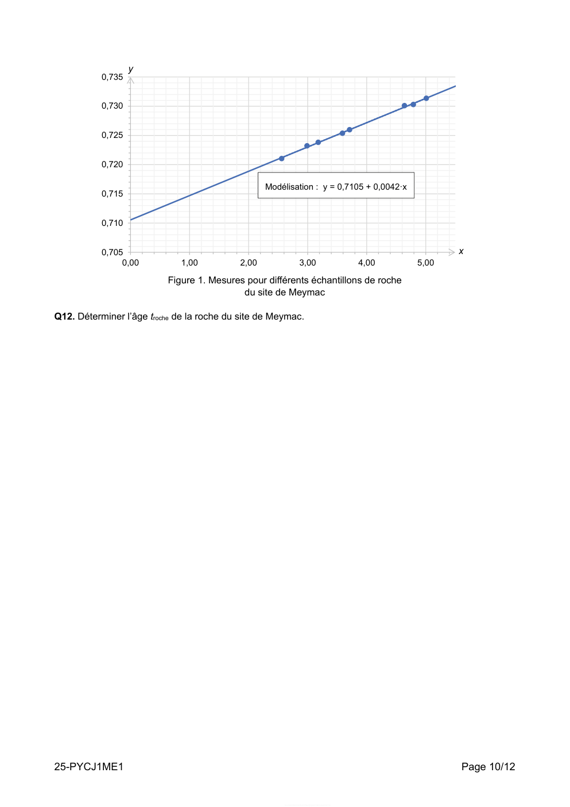

# spe-physique-chimie-2025-metropole-1-sujet-officiel

> Source : `../../../pdf_version/10_pc/2025/spe-physique-chimie-2025-metropole-1-sujet-officiel.pdf` — conversion Markdown (texte + visuels utiles).
> Stratégie : [STRATEGIE_MARKDOWN.md](../../../STRATEGIE_MARKDOWN.md)

---

## Page 1

BACCALAURÉAT GÉNÉRAL
                     ÉPREUVE D’ENSEIGNEMENT DE SPÉCIALITÉ

                                    SESSION 2025

                             PHYSIQUE-CHIMIE

                                 Mardi 17 juin 2025

                             Durée de l’épreuve : 3 heures 30

              L’usage de la calculatrice avec mode examen actif est autorisé.
          L’usage de la calculatrice sans mémoire, « type collège », est autorisé.

              Dès que ce sujet vous est remis, assurez-vous qu’il est complet.
                Ce sujet comporte 12 pages numérotées de 1/12 à 12/12.

25-PYCJ1ME1                                                                          Page 1/12

---

## Page 2

Exercice 1 - Un emballage intelligent au rayon poissonnerie (9 points)

Un emballage « intelligent » est un emballage alimentaire capable d’afficher, à
destination du client, des informations qui s’actualisent automatiquement au
cours du temps. On trouve par exemple, sur certains emballages de produits
frais au rayon poissonnerie, une pastille qui informe de la fraicheur du filet de
poisson qu’ils contiennent. Ces pastilles sont imbibées d’un indicateur coloré.

Dans cet exercice, on souhaite vérifier si le bleu de bromophénol, un indicateur
coloré acide-base noté BBP dans la suite de l’exercice, peut convenir pour la
réalisation de ce type de pastille.                                                                                   filet de       pastille
                                                                                                                      poisson
1. Synthèse du bleu de bromophénol

Pour synthétiser et caractériser le BBP (C19H10Br4O5S), on réalise le protocole suivant :
   - étape n°1 : dissoudre dans un erlenmeyer une masse m = 201 mg de rouge de phénol (C19H14O5S)
       dans 10 mL d’éthanol. Agiter, puis ajouter goutte à goutte une solution contenant du perbromure de
       pyridinium, qui permet de libérer du dibrome Br2 dans le milieu ;
   - étape n°2 : éliminer le solvant jusqu’à obtenir des cristaux au fond du ballon. Filtrer puis sécher les
       cristaux à l’étuve. Le produit solide obtenu est appelé par la suite le produit synthétisé brut ;
   - étape n°3 : réaliser une chromatographie sur couche mince des réactifs et du produit synthétisé brut ;
   - étape n°4 : enregistrer les spectres d’absorption du BBP de référence et du produit synthétisé brut.

Données :
    équation de la réaction modélisant la synthèse du BBP :

                            C19H14O5S(solv) + 4 Br2(solv) → C19H10Br4O5S(solv) + 4 HBr(solv)
                                  où (solv) signifie dissous dans le solvant, ici l’éthanol ;
       concentration standard : c° = 1 mol·L–1 ;
       température de fusion du BBP : θ fusion = 273 °C ;
       pour discuter de l’accord du résultat d’une mesure avec une valeur de référence, on peut utiliser le
                   |x xref |
        quotient             avec x la valeur mesurée, xref la valeur de référence et u(x) l’incertitude-type associée
                     u x
        à la valeur mesurée x ;
       chromatogramme obtenu du produit synthétisé brut (les espèces étant dissoutes dans un solvant
        adapté) :

                                          a : rouge de phénol

                                          b : perbromure de pyridinium                                           les espèces ont été dissoutes
                                                                                                                    dans un solvant adapté
                                          c : produit synthétisé brut à l’état final

            a        b       c

25-PYCJ1ME1                                                                                                                      Page 2/12

                                                           EducN_MMDQ0Mj5MzMDka5MD6gzMtjAyNj3A1MjEHwMzyE4MCTkg

---

## Page 3

   spectres d’absorption du BBP de référence et du produit synthétisé brut :

                   Absorbance
            0,18
                                                                                                               Absorbance du BBP
            0,16                                                                                               de référence

            0,14
            0,12                                                                                               Absorbance du produit
                                                                                                               synthétisé brut
            0,10
            0,08
            0,06
            0,04
            0,02
            0,00
                   400     450       500       550       600                                        650         700      750       800
                                                                                                                 Longueur d'onde (nm)

Q1. Donner un titre aux étapes du protocole, en choisissant parmi les propositions suivantes : analyse du
produit brut ; transformation des réactifs ; séparation.

Q2. En vous appuyant sur le chromatogramme obtenu, montrer qu’une transformation chimique a eu lieu et
préciser si le produit synthétisé brut est pur.

Q3. À l’aide des spectres d’absorption proposés, justifier que le produit brut contient du BBP.

Q4. Citer une autre méthode permettant d’identifier le produit brut.

2. Identification du produit synthétisé par une mesure de pKA

Le produit brut obtenu est purifié. On se propose d’en déterminer la constante d’acidité associée pour
confirmer qu’il s’agit de BBP, en étudiant la courbe de titrage d’une solution contenant cette espèce par une
solution aqueuse d’hydroxyde de sodium.

Q5. Le BBP est un indicateur coloré acide-base dont le couple acide-base est noté BH2(aq) / BH– (aq). Donner
l’expression de la constante d’acidité KA de ce couple en fonction de [BH2], [BH– ], [H3O+], concentrations des
espèces à l’équilibre chimique, ainsi que de la concentration standard c°.

Q6. À partir de l’expression précédente, établir la relation suivante :

                                                                                 BH–
                                             pH = pKA + log
                                                                                 BH2

On prépare une solution Sa du produit de synthèse purifié. On réalise un titrage de la solution Sa à l’aide d’une
solution Sb d’hydroxyde de sodium, suivi par pH-métrie.

25-PYCJ1ME1                                                                                                                              Page 3/12

                                                         EducN_MMDQ0Mj5MzMDka5MD6gzMtjAyNj3A1MjEHwMzyE4MCTkg

---

## Page 4

L’équation de la réaction support du titrage est :

                                         BH2 aq + OH– aq → BH– aq + H2 O(ℓ)

     La courbe de titrage est donnée sur la figure 1 ci-dessous.

      pH
12

11

10

 9

 8

 7                                                                                                                                                   pH
 6
                                                                                                                                                      dpH
                                                                                                                                                     dpH/dV
                                                                                                                                                       dV
 5

 4

 3

 2
                                                                                                                                               Volume V de
 1
                                                                                                                                               Sb versé (mL)
 0
     0         2        4        6        8       10       12                               14                        16           18   20       22         24

                                                                                                              dpH
                   Figure 1. Courbes de suivi pH-métrique et dérivée                                                  du titrage de la solution Sa
                                                                                                                 dV

     Q7. Définir l’équivalence d’un titrage.

     Q8. En explicitant la méthode, déterminer le volume VE de solution Sb versé à l’équivalence.

     Pour déterminer expérimentalement le pKA du couple BH2(aq) / BH– (aq), on s’intéresse à un point particulier
                                                                                                                        VE
     de la courbe, la demi-équivalence, atteint pour un volume versé égal à                                                    .
                                                                                                                           2

     Q9. Montrer que BH– = [BH2 ] à la demi-équivalence.

     Q10. En déduire, en explicitant la démarche utilisée, la valeur expérimentale du pKA du couple BH2(aq) / BH– (aq).

     Q11. Sachant que la valeur tabulée du pKA à 25 °C de ce couple est égale à 4,1, indiquer si la valeur obtenue
     à la question Q10 est compatible avec la présence de BBP dans le produit de synthèse purifié. L’incertitude-
     type sur la mesure du pKA est évaluée à u(pKA) = 0,3.

     25-PYCJ1ME1                                                                                                                                      Page 4/12

                                                                EducN_MMDQ0Mj5MzMDka5MD6gzMtjAyNj3A1MjEHwMzyE4MCTkg

---

## Page 5

3. Étude de la couleur de la pastille dans l’emballage intelligent

Une pastille est imprégnée par une solution de BBP. Cet indicateur coloré a des formes acide et basique de
couleurs différentes en solution. On donne ci-dessous le spectre d’absorption d’une solution aqueuse
contenant majoritairement la forme acide :
  0,8     Absorbance
  0,7
  0,6
  0,5
  0,4
  0,3
  0,2
  0,1
    0
        400          500          600            700                              800
                                     Longueur d’onde (nm)
                                                                                                                     Figure 3. Cercle chromatique
Figure 2. Spectre d’absorption d’une solution aqueuse de BBP de
       pH = 2,0, contenant majoritairement la forme acide

Données :
    une solution contenant majoritairement la forme basique du BBP est de couleur bleue ;
    masse volumique de l’eau à 20 °C : ρeau = 1,0 kg·L–1 ;
    masse molaire du chlorure d’hydrogène : M = 36,5 g·mol–1 ;
    règles de nomenclature :
      o pour les squelettes carbonés :

 Pour les hydrocarbures ramifiés, la position de la ramification sur la chaine principale est indiquée par un
 chiffre et le groupe est indiqué par le préfixe. Si plusieurs groupes sont identiques, on précède le préfixe
 par di, tri ou tétra, respectivement pour 2, 3 ou 4 groupes identiques.
              Méthyl                            Éthyl                                 Propyl
              CH3 –                         CH3 – CH2 –                        CH3 – CH2 – CH2 –

         o    pour les dérivés de l’ammoniac :

 Si l’atome d’azote du groupe fonctionnel possède plus qu’un groupe substituant, le groupe substituant est
 nommé suivant la règle pour les squelettes carbonés et précédé de la lettre « N » :
                                                                                                                            H2C      CH3

                                                                                                              H3C CH2 CH2 N          CH3

  H3C CH2 CH2          NH2                                                                                      N-éthyl-N-méthylpropanamine
                               H3C CH2 CH2       NH        CH3
                                                                                                              Cas 3 – Deux substituants différents sur
   propanamine                   N-méthylpropanamine
                                                                                                                         le groupe azoté

                                                                                                                               H2C     CH3
     Cas 1 – Aucun               Cas 2 – Un substituant sur le
 substituant sur le groupe              groupe azoté                                                            H3C CH2 CH2 N          CH2     CH3
          azoté
                                                                                                                     N,N-diéthylpropanamine
                                                                                                              Cas 4 – Deux substituants identiques sur
                                                                                                                         le groupe azoté

25-PYCJ1ME1                                                                                                                                  Page 5/12

                                                        EducN_MMDQ0Mj5MzMDka5MD6gzMtjAyNj3A1MjEHwMzyE4MCTkg

---

## Page 6

Q12. Montrer que la solution contenant la forme acide du BBP est de couleur jaune.

Pour obtenir le spectre de la figure 2, il est nécessaire de préparer une solution d’acide chlorhydrique de
pH = 2,0. La solution commerciale utilisée au laboratoire est de titre massique tm = 37 % et de densité d = 1,18.
On dispose de pipettes jaugées de volumes usuels entre 1,0 mL et 50,0 mL et d’une fiole jaugée de
volume V = 200,0 mL.

Q13. Montrer qu’il est impossible de préparer cette solution en ne réalisant qu’une seule dilution avec le
matériel proposé.

Le candidat est invité à prendre des initiatives et à présenter la démarche suivie, même si elle n’a pas abouti.
La démarche est évaluée et nécessite d’être correctement présentée.

Au cours du temps, les bactéries contenues dans le poisson produisent naturellement des molécules de
N,N-diméthylméthanamine qui entrent en contact avec la pastille imbibée de BBP.

Q14. Choisir, parmi les trois formules semi-développées suivantes, celle qui correspond à la molécule de
N,N-diméthylméthanamine.

         Molécule A                                Molécule B                                                  Molécule C

Au cours de la dégradation du poisson, qui se réalise sur plusieurs jours, la N,N-diméthylméthanamine,
composé volatil, est produite. La pastille de BBP initialement jaune se colore alors en bleu.

Q15. Écrire l’équation de la réaction modélisant la transformation chimique responsable de ce changement de
couleur. On note BH2(aq) / BH–(aq) le couple acide-base correspondant au BBP, et R3NH+(aq) / R3N(aq) celui
associé à la N,N-diméthylméthanamine.

4. Cinétique d’ordre 1 de la décoloration du BBP en présence d’ion hydroxyde

L’ion BH– est une espèce amphotère. Les molécules de N,N-diméthylméthanamine produites lors de la
dégradation du poisson rendent le milieu basique. En milieu très basique, le BBP se décolore selon une
transformation chimique lente, considérée totale et modélisée par la réaction d’équation suivante :

                                    BH–(aq) + OH–(aq) → B2–(aq) + H2O(ℓ)

Q16. Justifier le caractère amphotère de l’ion BH–.

On souhaite savoir si cette transformation peut nuire à l’efficacité d’un emballage intelligent.

Pour cela, on suit l’évolution de la concentration en ions BH , en fonction du temps, dans une solution très
basique. Le protocole mis en place est le suivant :
   -   placer un volume d’une solution contenant des ions BH dans une fiole jaugée de 50,0 mL ;
   -   compléter jusqu’au trait de jauge avec une solution aqueuse d’hydroxyde de sodium introduite en
       excès ;
   -   suivre l’évolution de l’absorbance par spectrophotométrie pendant une trentaine de minutes et tracer
       l’évolution temporelle de la concentration en ions BH–, notée [BH–] (voir figure 4).

25-PYCJ1ME1                                                                                                           Page 6/12

                                                         EducN_MMDQ0Mj5MzMDka5MD6gzMtjAyNj3A1MjEHwMzyE4MCTkg

---

## Page 7

[ BH– ] en µmol∙L–1
                  6,0

                  5,0

                  4,0

                  3,0

                  2,0

                  1,0

                  0,0                                                                                                         t (en s)
                        0     250     500     750     1000                          1250                      1500   1750   2000

                        Figure 4. Évolution temporelle de la concentration en ions BH

Q17. Après avoir déterminé le temps de demi-réaction, indiquer si ce temps caractéristique et la réaction
associée sont adaptés à une utilisation dans la pastille d’un emballage intelligent. Détailler votre raisonnement
en explicitant les évolutions de la couleur de la pastille de l’emballage au cours du temps.

25-PYCJ1ME1                                                                                                                              Page 7/12

                                                        EducN_MMDQ0Mj5MzMDka5MD6gzMtjAyNj3A1MjEHwMzyE4MCTkg

---

## Page 8

Exercice 2 - Datation d’une roche (6 points)

Les phénomènes de radioactivité permettent, en géologie, la datation des
roches. Il est par exemple possible d’utiliser le strontium 87 (87Sr), qui est
notamment issu de la désintégration du rubidium 87 (87Rb), lui-même
également présent dans une roche.

Les objectifs de cet exercice sont d’étudier le principe de la datation au
strontium 87, puis d’utiliser des résultats d’analyse pour déterminer l’âge
d’une roche du site de Meymac situé dans le département de la Corrèze, site
âgé de plusieurs centaines de millions d’années.

Données :
    temps de demi-vie du noyau de rubidium 87 exprimé en années (a) : t1/2 = 49,2×109 a ;
    constante radioactive du noyau de rubidium 87 : λ = 1,41×10–11 a–1 ;
    on suppose qu’une datation d’un échantillon de 1 g de roche par le rubidium 87 radioactif est possible
      tant qu’il reste au moins Nmin = 2,0×109 noyaux de rubidium 87 dans l’échantillon ;
    extrait du diagramme (N,Z) : les cases grises indiquent les éléments stables.

                                          N
                                              87        88                          89
                                                Kr        Rb                                      Sr
                                              36        37                          38
                                              86        87                          88
                                                Kr        Rb                                      Sr
                                              36        37                          38
                                              85        86                          87
                                                Kr       Rb                                       Sr
                                              36        37                          38
                                                                                                               Z

1. Le rubidium 87, un isotope radioactif adapté pour dater une roche

Q1. Rappeler la définition de noyaux isotopes.

Q2. Écrire l’équation de la désintégration du rubidium 87 indiquée par la flèche sur l’extrait du
diagramme (N,Z).

Q3. Préciser à quel type de désintégration correspond cette transformation nucléaire.

On estime qu’un échantillon de 1 g de roche du site de Meymac contenait à sa formation
NRb (0) = 5,8×1020 noyaux de rubidium 87. On souhaite déterminer l’âge maximal d’une roche qu’il serait
possible de déterminer par une datation au rubidium 87 d’un échantillon de 1 g.

Q4. Rappeler la définition du temps de demi-vie t1/2.

Q5. Déterminer, en justifiant le résultat, le nombre maximal de demi-vies après lequel il reste suffisamment de
rubidium 87 dans l’échantillon pour qu’on puisse le détecter.
                               5,8×1020
On remarquera que le rapport              est compris entre 238 et 239.
                                2,0×109

Q6. Justifier que le rubidium 87 est adapté pour dater un échantillon de 1 g de roche du site de Meymac.

25-PYCJ1ME1                                                                                                        Page 8/12

                                                         EducN_MMDQ0Mj5MzMDka5MD6gzMtjAyNj3A1MjEHwMzyE4MCTkg

---

## Page 9

2. Décroissance radioactive du rubidium 87 dans une roche

La désintégration spontanée des noyaux de rubidium 87 présents dans un échantillon de 1 g de roche suit la
loi de décroissance radioactive. Le nombre NRb(t) de noyaux de rubidium 87 présents dans un échantillon de
roche à la date t est solution de l’équation différentielle suivante :

                                                      dNRb (t)
                                                               = – λ∙NRb (t)
                                                        dt

Q7. Vérifier que NRb (t) = NRb (0)·e– λ·t est solution de l’équation différentielle ci-dessus.

On appelle tf la date à laquelle il reste Nmin = 2,0×109 noyaux de rubidium 87 dans l’échantillon.

Q8. Déterminer l’expression de tf en fonction de Nmin, NRb (0) et λ.

Q9. Calculer la valeur de tf puis la comparer à la réponse donnée dans la question Q6. Commenter.

3. Datation d’une roche du site de Meymac au strontium 87

On considère que la quantité de strontium 87 formé au cours du temps dans la roche est uniquement issue
de la désintégration du rubidium 87. La quantité de strontium 87 présent dans la roche à une date t s’écrit :

                                NSr(t) = NSr(0) + NSr formé(t) Équation 1
avec :
   - NSr(t) : nombre de noyaux de strontium 87 présents à la date t ;
   - NSr(0) : nombre de noyaux de strontium 87 présents à la date t = 0 ;
   - NSr formé(t) : nombre de noyaux de strontium 87 formés par la désintégration du rubidium 87 à la date t.

Q10. Donner la relation entre NSr formé(t), NRb(0) et NRb(t), sachant que pour un noyau de rubidium 87 qui se
désintègre, un noyau de strontium 87 se forme.

Q11. En déduire l’égalité :

                               NSr formé(t) = NRb(t)·( eλ·t – 1)                                                            Équation 2

Les équations 1 et 2 permettent enfin d’obtenir l’équation 3 :

                               NSr t       NSr 0                     NRb t
                                       =           + ( eλ·t – 1) ·                                                          Équation 3
                                Nréf        Nréf                         Nréf

où Nréf représente le nombre de noyaux stables de strontium 86, supposé constant au cours du temps.

                                                                                                            NSr t                 NSr 0        N      t
On écrit l’équation 3 sous la forme y = b + (eλ·t – 1)·x avec y =                                                          ,b =           et x = Rb       , dans laquelle :
                                                                                                               Nréf                Nréf         Nréf
    -   y et x sont des grandeurs mesurables par les géologues pour un ensemble d’échantillons prélevés
        dans une roche donnée ;
    -   b est une grandeur indépendante de l’échantillon.

Plusieurs échantillons de roche du site de Meymac sont prélevés à la date troche correspondant à l’âge de la
roche. Pour chaque échantillon, on mesure les grandeurs x et y. Les résultats obtenus sont présentés sur la
figure 1 ci-après :

25-PYCJ1ME1                                                                                                                                                          Page 9/12

                                                                     EducN_MMDQ0Mj5MzMDka5MD6gzMtjAyNj3A1MjEHwMzyE4MCTkg

---

## Page 10

*(Suite de la page précédente — le document continue ici.)*

y
           0,735

           0,730

           0,725

           0,720

                                                  Modélisation : y = 0,7105 + 0,0042·x
           0,715

           0,710

           0,705                                                                                                          x
                0,00         1,00          2,00                       3,00                                  4,00   5,00

                          Figure 1. Mesures pour différents échantillons de roche
                                           du site de Meymac

Q12. Déterminer l’âge troche de la roche du site de Meymac.

25-PYCJ1ME1                                                                                                               Page 10/12

                                                      EducN_MMDQ0Mj5MzMDka5MD6gzMtjAyNj3A1MjEHwMzyE4MCTkg

---

## Page 11

Exercice 3 - Viscosimètre à chute de bille (5 points)

Certains équipements mécaniques, comme les moteurs, nécessitent l’utilisation d’huiles
de valeur de viscosité contrôlée pour pouvoir fonctionner correctement.

Le but de cet exercice est d’étudier le principe de fonctionnement d’un viscosimètre à
chute de bille permettant de mesurer, à température ambiante, la viscosité d’une huile
appelée « huile C ».

                                                                                                 Viscosimètre à chute de bille KF40 Brookfields®

La mesure de la viscosité de l’huile C repose sur l’exploitation de la chute verticale d’une bille en acier dans
un récipient cylindrique, rempli de cette huile, représenté sur la figure 1. Le mouvement du centre de masse
de la bille est étudié dans le référentiel terrestre supposé galiléen, muni d’un repère d’origine O, d’axe vertical
(Oz) orienté vers le bas et de vecteur unitaire k ⃗. La situation est schématisée sur la figure 1.
                                                                                   O
                                                                                                                          Bille
                                                                                                  k⃗

                                                    Huile

                                                  Cylindre

                                                                                                  z
                                     Figure 1. Schéma du dispositif expérimental de mesure

Données :

Les données numériques de cet exercice proviennent de travaux réalisés à l’université de Grenoble.

      masse volumique de l’huile C : ρh = 8,31×102 kg·m–3 ;
      masse volumique de la bille : ρb = 1,06×103 kg·m–3 ;

      rayon de la bille : r = 0,993 mm ;
      intensité de la pesanteur terrestre : g = 9,81 m·s–2 ;
                                                      4
      volume d’une bille de rayon r : Vb =               ⋅π⋅r3 ;
                                                      3
    pour discuter de l’accord du résultat d’une mesure avec une valeur de référence, on peut utiliser le
                  | x - xref |
       quotient                  avec x la valeur mesurée, xref la valeur de référence et u(x) l’incertitude-type associée
                     u(x)
       à la valeur mesurée x.

Lors de sa chute verticale dans l’huile C, la bille de masse m est soumise à trois forces :
   - son poids noté P ⃗ ;
   - la poussée d’Archimède, exercée par l’huile, d’expression vectorielle PA⃗ = – ρ ∙Vb ·g∙ k ⃗ ;                                h
   -   la force de frottement exercée par l’huile sur la bille, d’expression vectorielle dans les conditions de
       l’expérience : f ⃗ = – α∙η ∙v· k ⃗ avec α une constante homogène à une distance, dépendant des
                                         C
       paramètres géométriques du système, ηC la viscosité de l’huile C et v la valeur de la vitesse du centre
       de masse de la bille. On donne α = 1,92×10–2 m.

Q1. Montrer, à l’aide d’un raisonnement sur les unités, que la viscosité ηC s’exprime en N·m–2·s.

25-PYCJ1ME1                                                                                                                           Page 11/12

                                                                    EducN_MMDQ0Mj5MzMDka5MD6gzMtjAyNj3A1MjEHwMzyE4MCTkg

---

## Page 12

À la date t = 0, la bille est lâchée avec une vitesse initiale nulle depuis le point O, situé dans l’huile, en haut
du récipient cylindrique. Au bout de quelques instants, le mouvement de la bille devient rectiligne uniforme, la
bille atteint alors une vitesse limite notée vlim .

Q2. Préciser, en justifiant, si la valeur de la force de frottement f ⃗ augmente ou diminue quand la valeur de la
vitesse de la bille augmente.

Q3. Représenter sur un schéma, sans calcul et en justifiant, l’ensemble des forces appliquées au système
{bille}, lorsque la vitesse limite est atteinte.

Q4. Montrer que la vitesse limite vérifie l’équation :

                                                              4∙π∙r3 ∙g∙ ρb – ρh
                                           α ∙ ηC ∙ vlim =
                                                                       3

Q5. La valeur limite de la vitesse de la bille vaut vlim = 5,37 mm·s–1. Calculer la valeur de la viscosité ηC de
l’huile C.

L’huile C a une viscosité de référence qui vaut ηréf = 0,093 N·m–2·s et l’incertitude-type sur la valeur de la
viscosité ηC obtenue vaut u(ηC) = 0,003 N·m–2·s.

Q6. Déterminer si la valeur de la viscosité ηC obtenue expérimentalement est en accord avec la valeur de
référence.

On souhaite déterminer la durée nécessaire pour que la bille, lâchée avec une vitesse initiale nulle, atteigne
sa vitesse limite.

Q7. Le vecteur accélération a⃗ du centre de masse de la bille s’écrit : a⃗ = a∙ k⃗. À l’aide de la deuxième loi de
Newton, montrer que l’accélération a peut s’écrire :

                                            ρh ∙Vb       α∙ηC
                               a = g∙ 1 –            –          ∙v      où m est la masse de la bille
                                              m           m

Q8. En déduire que l’évolution de la coordonnée v du vecteur vitesse v⃗ de chute de la bille au cours du temps
obéit à l’équation différentielle suivante :

                                           dv   3∙α∙ηC               ρ
                                              +           ·v = g∙ 1 – h
                                           dt 4∙ ρb ·π∙r3            ρb

Si la bille est abandonnée avec une vitesse initiale nulle, la résolution de l’équation différentielle précédente
permet d’obtenir l’expression de sa vitesse v(t) :

                                                                                   4∙ρb ·π∙r3
                                    v(t) = vlim · (1 − e        )    avec 𝜏 =
                                                                                    3∙α∙ηC

Q9. Calculer la valeur de 𝜏 en utilisant la valeur de la viscosité de référence de l’huile étudiée. Justifier que
l’on peut considérer que la vitesse de la bille est pratiquement égale à sa valeur limite durant tout le mouvement
sachant que le tube du viscosimètre a une hauteur d’environ 15 cm.

25-PYCJ1ME1                                                                                             Page 12/12
