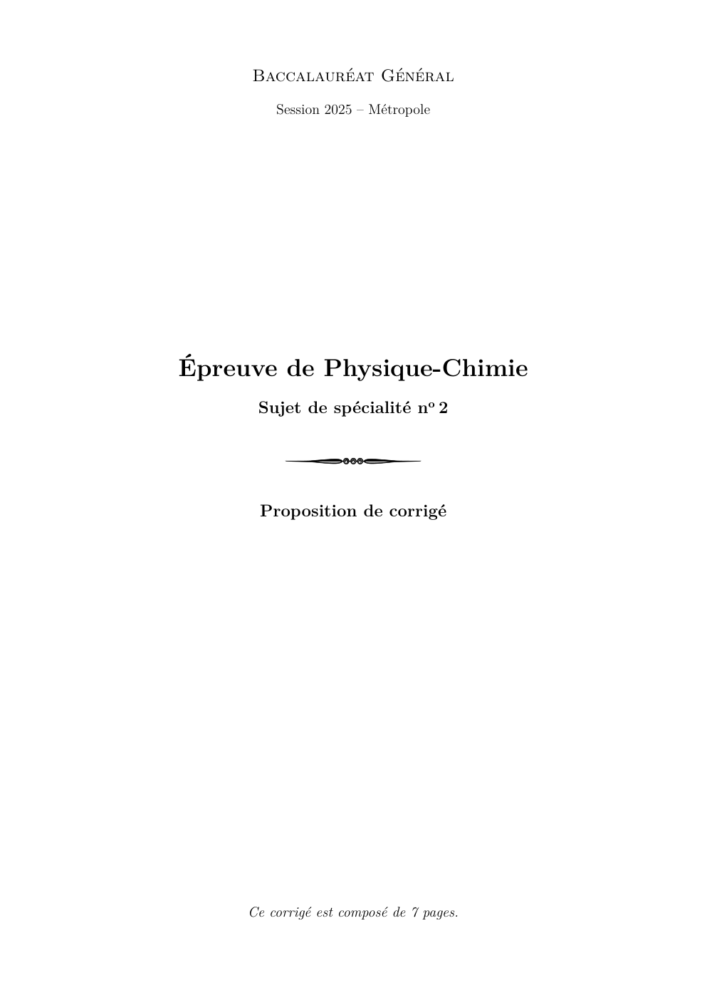

# spe-physique-chimie-2025-metropole-2-corrige

> Source : `../../../pdf_version/10_pc/2025/spe-physique-chimie-2025-metropole-2-corrige.pdf` — conversion Markdown (texte + visuels utiles).
> Stratégie : [STRATEGIE_MARKDOWN.md](../../../STRATEGIE_MARKDOWN.md)

---

## Page 1

Baccalauréat Général
         Session 2025 – Métropole

Épreuve de Physique-Chimie
      Sujet de spécialité no 2

      Proposition de corrigé

     Ce corrigé est composé de 7 pages.

---

## Page 2

Baccalauréat Général                Spécialité Physique-Chimie             25-PYCJ2ME1 – Corrigé

Exercice 1 —           Mesure de l’épaisseur d’un film alimentaire
1.  Mesure de l’épaisseur d’un film alimentaire par capacimétrie
Q1. Dans le circuit représenté, en convention récepteur, on écrit la loi des mailles :

                                          E − uR − uC (t) = 0                               (M)

     Or, par la loi d’Ohm, uR = Ri, et on a aux bornes du condensateur :
                                                        d uC
                                               i=C
                                                         dt
     Et dans (M), il vient donc :
                                                    d uC
                                           E = RC        + uC
                                                     dt
     Et en posant τ = RC , on a finalement l’équation différentielle du premier ordre :

                                            d uC  1     E
                                                 + uC =                                      (E )
                                             dt   τ     τ

Q2. En prenant les conditions aux limites, on remarque que lorsque t → ∞, on a uC → E.
    Alors nécessairement, A = E.
Q3. En t = τ , on a :
                                                                  
                                        uC (t = τ ) = E 1 − e−1

Q4. En reprenant l’expression précédente avec la valeur de E, on a :
                                                              
                                   uC (t = τ ) = 4, 9 1 − e−1 = 3, 1 V

     Et par lecture graphique, on trouve donc τ = 65 µs.
Q5. On a la constante de temps :
                                                               τ
                                         τ = RC =⇒ C =
                                                               R
     D’où,
                                     65 × 10−6
                                C=               = 6, 5 × 10−8 F = 65 nF
                                     1, 00 × 103
Q6. On a l’expression de la capacité en fonction de l’épaisseur :

                                         ε 0 εf S            ε0 εf S
                                    C=            =⇒ efilm =
                                          efilm                C
     D’où,
                         8, 85 × 10−12 × 2, 3 × (21 × 10−2 × 28 × 10−2 )
               efilm =                                                   = 1, 7 × 10−5 m
                                          69, 8 × 10−9
Q7. On calcule alors le Z-score entre cette mesure et la valeur de référence :
                                       17, 1 × 10−6 − 7, 6 × 10−6
                                 Z=                               = 9, 5
                                               1, 0 × 10−6
     L’écart entre les deux valeurs est donc particulièrement élevé, on peut alors douter de la
     précision de cette méthode de mesure.

                                                                                     Page 2 sur 7

---

## Page 3

Baccalauréat Général                      Spécialité Physique-Chimie                          25-PYCJ2ME1 – Corrigé

 Q8. On cherche à valider la compatibilité de l’expression donnée avec l’expression de la capa-
     cité du condensateur.
     — Dans le cas limite eair = 0, on a :
                                               ε0 S                  εr,film   ε0 εr,film S
                                      C′ =     efilm    = ε0 S ×             =
                                              εr,film
                                                                      efilm       efilm

      Et on retombe donc bien sur l’expression de référence pour la capacité.
      — De la même manière, pour le cas limite efilm = 0, on retrouve bien l’expression de
      référence.
 Q9. On a donc, pour une couche de film et une couche d’air :
                                                    ε0 S                  εr,film εr,air ε0 S
                                     C′ =                        =
                                              eair
                                             εr,air
                                                    + εer,film
                                                         film
                                                                     eair εr,film + efilm εr,air

      Et on peut alors isoler eair :
                             εr,film εr,air ε0 S
                 C′ =                               =⇒ eair εr,film C ′ + efilm εr,air C ′ = εr,film εr,air ε0 S
                        eair εr,film + efilm εr,air
                                                    =⇒ eair εr,film C ′ = εr,film εr,air ε0 S − efilm εr,air C ′
                                                                       εr,film εr,air ε0 S − efilm εr,air C ′
                                                    =⇒ eair =
                                                                                      εr,film C ′

      D’où,
               2, 3 × 1, 0 × 8, 85 × 10−12 × (21 × 10−2 × 28 × 10−2 ) − 7, 6 × 10−6 × 1, 0 × 69, 8 × 10−9
      eair =
                                                   2, 3 × 69, 8 × 10−9
      La couche d’air a donc une épaisseur eair = 4, 15 × 10−6 m = 4, 15 µm. La couche d’air est
      donc loin d’être négligeable dans ce cas, et la mesure d’épaisseur ne peut pas être réalisée
      dans ces conditions avec une bonne précision.

2.   Mesure de l’épaisseur d’un film alimentaire par pesée
Q10. On a la masse :
                                                      mfilm
                           m = ρV = ρℓLe =⇒ efilm =
                                                     ρfilm ℓL
      D’où,
                                        70, 56 × 10−3
                      efilm =                         −2
                                                          = 6, 5 × 10−6 m = 6, 5 µm
                                1, 25 × 10 × 29 × 10 × 30
                                          3

3.   Mesure de l’épaisseur d’un film alimentaire par interférométrie
Q11. Pour observer des interférences constructives, il faut nécessairement que la différence de
     marche soit un multiple entier de la longueur d’onde.
Q12. On a l’ordre d’interférence :
                                              βefilm 1
                                                    +   p=
                                                λ     2
               βefilm
      Alors si λ ∈ N, l’ordre d’interférence sera un demi-entier, l’interférence observée sera
      destructive.
Q13. Comme la mesure est faite à incidence et épaisseurs données, seule la longueur d’onde
     varie. Les maxima d’intensité correspondent donc aux longueurs d’onde pour lesquelles
     on observe une interférence constructive (les λ telles que p soit entier).

                                                                                                                Page 3 sur 7

---

## Page 4

Baccalauréat Général                Spécialité Physique-Chimie            25-PYCJ2ME1 – Corrigé

Q14. La relation 1, lorsqu’on l’observe, décrit bien une fonction affine de l’inverse de la longueur
     d’onde. Ce qui correspond bien à une droite comme présentée en figure 7.
Q15. Par lecture graphique, on a :

                                                      22443 × 10−9   22443
                 βefilm = 22443 × 10−9 =⇒ efilm =                  =        = 7, 4 µm
                                                           β          3, 02

      Cette valeur est bien plus proche de la valeur de référence, il est donc possible d’en conclure
      que la mesure par interférométrie semble être, des méthodes présentées, la meilleure.

Exercice 2 —           Eau de Quinton
1.  Préparation de l’eau de Quinton isotonique
Q1. On souhaite préparer une solution par dilution d’un facteur 5. Le mode opératoire est le
    suivant :
        — verser, dans un bécher, une trentaine de millilitres d’eau de Quinton commerciale ;
        — prélever, avec une pipette jaugée de 20, 0 mL, ce volume de solution commerciale ;
        — les placer dans une fiole jaugée de 100, 0 mL ;
        — compléter la fiole à l’eau distillée jusqu’environ la moitié ;
        — boucher puis homogénéiser ;
        — finir de compléter à l’eau distillée jusqu’au trait de jauge ;
        — homogénéiser une dernière fois.
 Q2. La solution est considérée isotonique lorsqu’elle présente, au pire, 100 mmol · L−1 d’ions
     chlorure. La solution étant préparée par dilution 5 fois d’une eau de Quinton commerciale,
     il faut donc une concentration minimale C = 5 × 100 = 500 mmol · L−1 dans la solution
     commerciale pour que la solution ainsi préparée soit isotonique.

2.  Analyse d’une eau de Quinton hypertonique
Q3. On a la réaction de précipitation des ions argent avec les ions chlorure :

                                        Cl− + Ag+ −−→ AgCl(s)

 Q4. Lors du titrage, la solution titrée est le chlorure de sodium, placée dès le début dans
     le bécher. La concentration en ions Na+ est donc constante tout au long du titrage, et
     correspond donc à l’espèce D.
     De plus, le nitrate d’argent est introduit progressivement, et les ions NO3− étan specta-
     teurs, leur concentration augmente linéairement au cours du temps : il s’agit de l’espèce
     C.
     Finalement, les ions chlorure réagissent au fur et à mesure de l’ajout de solution titrante,
     leur concentration diminue progressivement (espèce A) tandis que les ions Ag+ réagissent
     initialement dès leur introduction, jusqu’à disparition des ions chlorure : il s’agit donc de
     l’espèce B.
 Q5. À l’équivalence, on a :
                           nCl−  n +                          C1 V1
                                = Ag =⇒ C1 V1 = C2 VE =⇒ VE =
                            1     1                            C2
      La formule à inscrire à la ligne 15 est donc : V_E = C_1 * V_1 / C_2

                                                                                       Page 4 sur 7

---

## Page 5

Baccalauréat Général                  Spécialité Physique-Chimie                 25-PYCJ2ME1 – Corrigé

Q6. Au cours de l’ajout du nitrate d’argent, avant l’équivalence, la consommation d’ions tend
    à abaisser la conductivité. Cependant, une fois l’équivalence atteinte, tous les ions argent
    introduits ne seront pas consommés, ce qui entraînera une hausse de la conductivité.
    Ces constatations sont bien en accord avec la courbe de dosage présentée en annexe.
    En résumé :

                                                  V < VE        V > VE
                                       Na+             →             →
                                       Cl−             ↘             ↘
                                       Ag+             →             ↗
                                      NO3−             ↗             ↗
                                            σ          ↘             ↗

Q7. Par lecture graphique, on a donc VE = 19 mL. Et en exploitant la relation précédemment
    établie à l’équivalence :
                                                         C2 VE
                                 C1 V1 = C2 VE =⇒ C1 =
                                                          C1
    Ou, en masse :
                                                  C2 VE M (Cl)
                                 Cm = C1 M (Cl) =
                                                       V1
     D’où,
                                          3, 00 × 10−1 × 19 × 35, 5
                           Cquinton =                               = 20, 2 g · L−1
                                                    10, 0
Q8. On peut alors calculer l’incertitude sur cette mesure expérimentale :
                                      v
                                                  !2            2                    !2
                                                                         2 × 10−3
                                      u
                                          0, 02          0, 5
                                      u                 
             u(Cquinton ) = 20, 2 ×   t
                                                       +             +                     = 0, 55 g · L−1
                                          10, 0          19            3, 00 × 10−1

     Ainsi, par rapport à l’eau de mer bretonne :
                                                   20, 2 − 19, 4
                                           Z=                    = 1, 45
                                                       0, 55
     L’eau de quinton hypertonique est donc globalement de concentration en ions chlorure
     similaire à l’eau de mer.

Exercice 3 —           Un parfum de rose
1.  Étude préliminaire
Q1. Le groupe caractéristique entouré sur la formule topologique du géraniol est un groupe
    hydroxyle.
    Le géraniol, comme son nom l’indique, est un alcool. L’éthanoate de géranyle, lui, est un
    ester.
Q2. On remarque, sur le spectre IR donné en figure 1, une bande fine et forte aux alentours
    de 1750 cm−1 , caractéristique d’une liaison C−O. Ce pic suffit à attribuer le spectre à
    l’éthanoate de géranyle.

                                                                                                   Page 5 sur 7

---

## Page 6

Baccalauréat Général                   Spécialité Physique-Chimie         25-PYCJ2ME1 – Corrigé

2.  Transformation du géraniol en éthanoate de géranyle
Q3. Un catalyseur est une espèce chimique qui, introduite en faible quantité, permet d’accé-
    lérer une réaction chimique. En observant le mécanisme réactionnel, le catalyseur est le
    proton H+ .
Q4. On fait apparaître les flèches courbes représentant les déplacements de doublet électro-
    niques permettant la réaction :

               H3C          O                                       H3C         O+
                                                                                      H
                                   +       H+
                      OH                                                   OH

                                                                                 OH
         H3C           O+
                            H                                             H3C             OH
                                   +       R    OH

                 OH                                                              O+
                                                                            R             H

               H3C          O+     H                      H3C         O

                                                                            +        H+
                      O                                         O
                 R                                          R

Q5. Par observation, on remarque qu’à l’issue de la prototropie de l’étape 3, on forme un
    groupe partant OH2+ , qui sera donc libéré comme H2 O (molécule A) dans l’étape 4.
    En faisant un bilan des espèces consommées et formées au cours des différentes étapes de
    la réaction, on peut donc écrire l’équation de la réaction d’estérification :

                            R−OH + CH3 COOH −−→ CH3 COO−R + H2 O

Q6. Chauffer le mélange permet d’accélérer la réaction.
Q7. Dans l’ampoule à décanter, la phase supérieure contiendra la phase la moins dense (donc
    la phase organique, contenant l’ester et le géraniol) tandis que la phase inférieure sera la
    phase aqueuse, plus dense (contenant l’acide éthanoïque).
Q8. On souhaite montrer que les réactifs sont introduits dans les proportions stœchiomé-
    triques.
    Pour l’acide éthanoïque, on a :

                                 nA = CA VA = 1, 0 × 50 × 10−3 = 50 mmol

     Et de la même manière, pour le géraniol :
                                             mG       7, 7
                                    nG =          =         = 50 mmol
                                            M (G)   154, 25
     On a donc bien nA = nG , les réactifs sont introduits dans les proportions stœchiomé-
     triques.

                                                                                          Page 6 sur 7

---

## Page 7

Baccalauréat Général               Spécialité Physique-Chimie              25-PYCJ2ME1 – Corrigé

 Q9. On titre l’acide éthanoïque par la soude. L’équation support du titrage est donc très
     logiquement :
                           CH3 COOH + OH− −−→ CH3 COO− + H2 O
      Et à l’équivalence, on a alors :
                             nCH3 COOH  n −
                                       = OH =⇒ nCH3 COOH = CB VE
                                 1        1
      Sur la courbe de titrage de la figure 2, on lit VE = 32, 5 mL, ce qui signifie qu’il reste dans
      le milieu à l’issue de la réaction une quantité de matière en acide éthanoïque :

                         nCH3 COOH = nA,f = 1, 0 × 32, 5 × 10−3 = 32, 5 mmol

Q10. On a le rendement :
                                                     nexp
                                                η=
                                                     nth
      Par un bilan de matière évident, il vient nth = 50 mmol. Et comme nexp = nA − nA,f , le
      rendement est donc :
                                             50 − 32, 5
                                         η=             = 35 %
                                                50
      Ce qui est un rendement convenable lorsqu’on sait que le seul traitement du milieu réac-
      tionnel était la séparation de la phase aqueuse.

3.   Utilisation du géraniol en parfumerie
Q11. On a, en prenant en compte le titre massique en géraniol dans le parfum, une masse de
     géraniol par pulvérisation :

                  m = 0, 001 × 10−2 × 0, 84 × 0, 15 = 1, 3 × 10−6 g = 1, 3 × 10−3 mg

      Un adulte de 65 kg pouvant, au plus, être exposé à une masse m65 = 65 × 17, 75 =
      1, 2 × 103 mg, il pourra se pulvériser, au maximum :

                                          1, 2 × 103
                                   N=                = 9, 23 × 105 fois
                                         1, 3 × 10−3
      Il peut donc continuer de se parfumer dans trop de risque d’exposition excessive au
      géraniol !

                                               * *
                                                *

                                     Proposé par T. Prévost (thomas.prevost@protonmail.com),
                                                             pour https://www.sujetdebac.fr/
                                                            Sources LATEX compilées le 2 septembre 2025.

                                                                                         Page 7 sur 7
