# spe-physique-chimie-2025-metropole-2-sujet-officiel

> Source : `../../../pdf_version/10_pc/2025/spe-physique-chimie-2025-metropole-2-sujet-officiel.pdf` — conversion Markdown (texte + visuels).
> Stratégie : [STRATEGIE_MARKDOWN.md](../../../STRATEGIE_MARKDOWN.md)

---

## Page 1

BACCALAURÉAT GÉNÉRAL
                     ÉPREUVE D’ENSEIGNEMENT DE SPÉCIALITÉ

                                    SESSION 2025

                             PHYSIQUE-CHIMIE

                               Mercredi 18 juin 2025

                             Durée de l’épreuve : 3 heures 30

              L’usage de la calculatrice avec mode examen actif est autorisé.
          L’usage de la calculatrice sans mémoire, « type collège », est autorisé.

              Dès que ce sujet vous est remis, assurez-vous qu’il est complet.
                Ce sujet comporte 14 pages numérotées de 1/14 à 14/14.

                      L’annexe page 14 est à rendre avec la copie.

25-PYCJ2ME1                                                                          Page 1/14

---

## Page 2

Exercice 1 - Mesure de l’épaisseur d’un film alimentaire (11 points)

Les films alimentaires étirables sont des films plastiques souples et
transparents utilisés principalement pour conserver les aliments. Ils sont
fabriqués en polymères tels que le polyéthylène basse densité (PEBD) et
parfois le polychlorure de vinyle (PVC). Ces films offrent une barrière contre
l’air, l’humidité et les contaminants, aidant ainsi à prolonger la fraîcheur des
aliments et à réduire les déchets alimentaires. L’épaisseur du film est un
paramètre essentiel des propriétés mécaniques (élasticité, résistance à la
traction) des films étirables, ainsi que de leur impact écologique.

L’objectif de cet exercice est d’étudier différentes méthodes de détermination de l’épaisseur d’un film
alimentaire.

1. Mesure de l’épaisseur d’un film alimentaire par capacimétrie

Données :
    un condensateur plan est constitué de deux armatures métalliques, parallèles entre elles, chacune de
      surface S, séparées par un matériau isolant (papier, plastique) d’épaisseur e ;
    expression littérale de la capacité C d’un tel condensateur :
                                                             ε0 ·εr ·S
                                                       C=
                                                                 e
      avec : • ε0 = 8,85×10–12 F·m–1 : permittivité du vide ;
               εr : permittivité relative du matériau isolant ;
    permittivité relative du film alimentaire étudié : εr, film = 2,3 ;
    permittivité relative de l’air : εr, air = 1,0 ;
    épaisseur de référence du film alimentaire : efilm, ref = 7,6 µm ;
    pour discuter de l’accord du résultat d’une mesure avec une valeur de référence, on peut utiliser le
                   |x – xref |
        quotient                 avec x la valeur mesurée, xref la valeur de référence et u(x) l’incertitude-type associée
                     u(x)
        à la valeur mesurée x.

On réalise un condensateur plan en intercalant entre deux feuilles de papier aluminium rectangulaires, de
dimensions 21 cm × 28 cm, une seule couche du film transparent d’épaisseur e. On note C sa capacité. La
figure 1 ci-dessous présente un schéma de ce dispositif.

                                                           Aluminium

                                                                                                                       e : épaisseur de film alimentaire

                                                           Aluminium

                                         Figure 1. Vue en coupe du condensateur plan

On réalise ensuite le montage, schématisé en figure 2, constitué du condensateur réalisé, d’un conducteur
ohmique de résistance R = 1,00 kΩ, d’un interrupteur et d’un générateur idéal délivrant une tension
continue E = 4,9 V.                                  R

                                                       E                                                          uC        C

                                            Figure 2. Schéma du montage électrique

25-PYCJ2ME1                                                                                                                                        Page 2/14

                                                                 EducN_MMDQ0Mj5MzMDka5MD2gzMtjAyNj1A1MjEHwMzxE4MUjMg

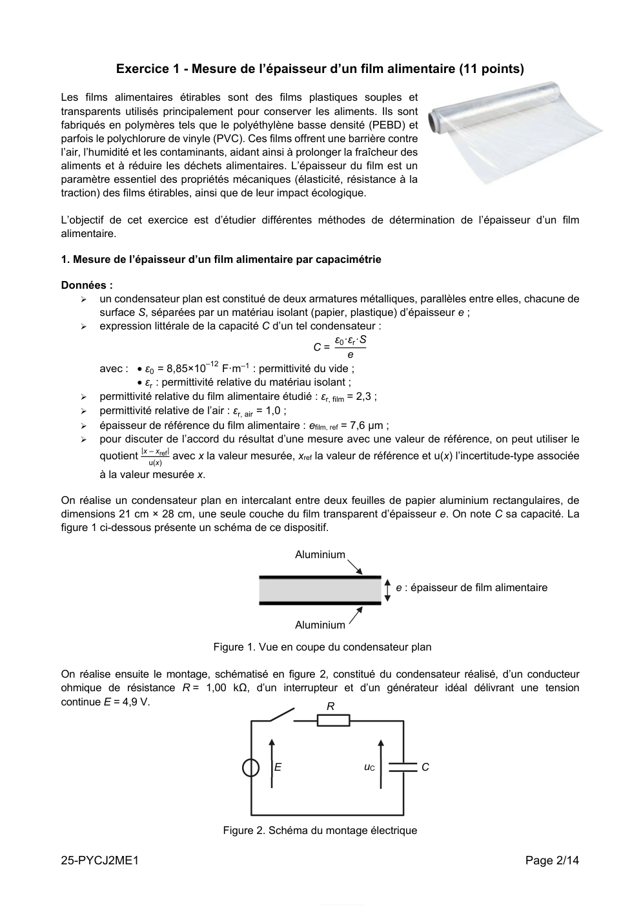

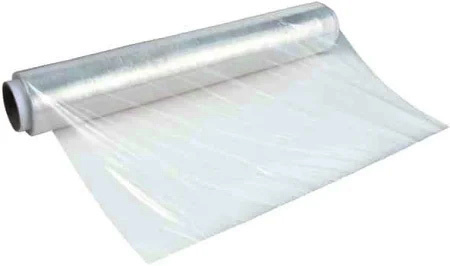

---

## Page 3

On étudie la charge du condensateur à partir de la date t = 0, date à laquelle l’interrupteur est fermé.
      L’évolution temporelle de la tension uC aux bornes du condensateur est présentée en figure 3.
       uC (V)
5,5
5,0
4,5
4,0
3,5
3,0
2,5
2,0
1,5
1,0
0,5
0,0                                                                                                                                                                t (µs)
      0            50          100            150          200         250         300           350                                                             400
                   Figure 3. Évolution de la tension aux bornes du condensateur en fonction du temps

      Q1. Établir l’équation différentielle ci-dessous vérifiée par la tension uC aux bornes du condensateur, où τ est
      le temps caractéristique dont on donnera l’expression :

                                                       duc 1      E
                                                           + uc =
                                                        dt  τ     τ
                                                                                                                     t
      La solution de cette équation différentielle est : uc t = A⋅ 1 – e– τ où A est une constante.
      Q2. Déterminer l’expression de la constante A.

      Q3. Exprimer, en fonction de E, la tension uc(𝜏) aux bornes du condensateur à la date t = τ.

      Q4. Exploiter la courbe de la figure 3 et le résultat obtenu à la question Q3 pour déterminer la valeur de la
      constante de temps τ du circuit. Expliciter la démarche utilisée.

      Q5. En déduire une valeur expérimentale de la capacité C du condensateur.

      Des mesures complémentaires répétées ont permis de déterminer une valeur moyenne de la capacité du
      condensateur : C = 69,8 nF.

      Q6. Déterminer la valeur de l’épaisseur efilm du film alimentaire déduite de cette valeur moyenne.

      Avec cette méthode, l’incertitude-type sur l’épaisseur du film a pour valeur : u(efilm) = 1,0 µm.

      Q7. Discuter de l’accord du résultat obtenu à la question Q6 avec la valeur de l’épaisseur de référence du film
      indiquée dans les données.

      Pour expliquer l’écart observé, on peut faire l’hypothèse qu’il existe entre les feuilles d’aluminium, en plus de
      l’épaisseur du film alimentaire, une fine couche d’air d’épaisseur eair constante. La situation est alors
      schématisée sur la figure 4 ci-dessous.
                                                         Aluminium

                                                                                                                         efilm : épaisseur de film alimentaire
                                                                                                                         eair : épaisseur de la couche d’air
                                                         Aluminium

                                       Figure 4. Couche d’air piégée dans le condensateur

      25-PYCJ2ME1                                                                                                                                     Page 3/14

                                                               EducN_MMDQ0Mj5MzMDka5MD2gzMtjAyNj1A1MjEHwMzxE4MUjMg

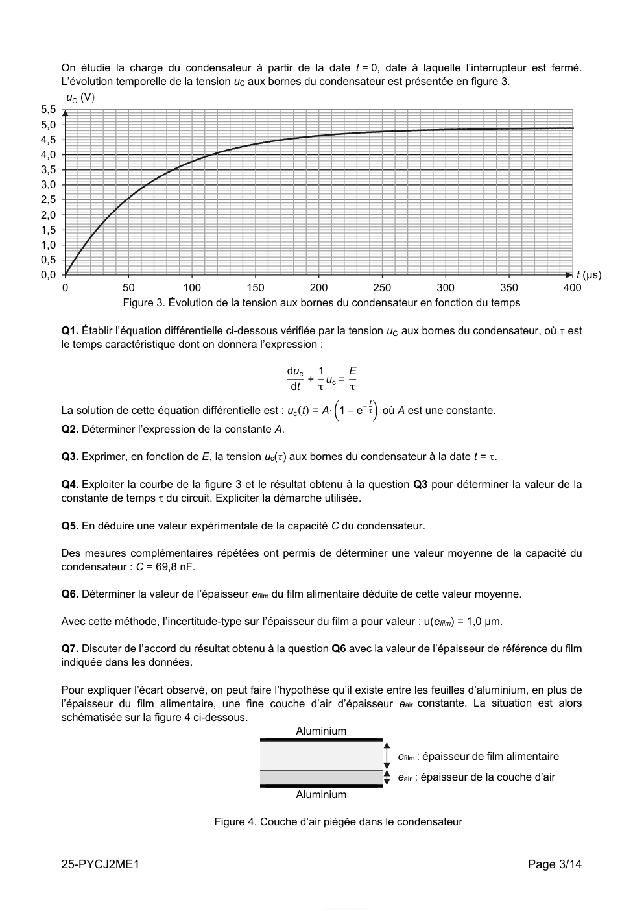

---

## Page 4

On montre que la capacité C' d’un condensateur, dans le cas où le condensateur comprend une épaisseur
d’air eair et une épaisseur de film efilm, est donnée par la relation :

                                                           ε0 ·S
                                                C' = e         e
                                                        air
                                                            + film
                                                     εr, air εr, film

Q8. En envisageant deux cas limites au schéma présenté en figure 4, vérifier que l’expression donnée ci-
dessus est compatible avec l’expression littérale de la capacité d’un condensateur précisée dans les données.

Q9. Dans ce modèle, déterminer la valeur d’épaisseur d’air eair en considérant que l’épaisseur du film
alimentaire est celle de référence : efilm,ref = 7,6 µm. Commenter.

2. Mesure de l’épaisseur du film alimentaire par pesée

Données :
    dimensions du film alimentaire indiquées sur l’emballage : largeur ℓ = 29 cm et longueur L = 30 m ;
    masse volumique du polymère constituant le film alimentaire : ρ film = 1,25×103 kg.m–3.

Afin d’estimer un ordre de grandeur de l’épaisseur du film alimentaire, on mesure la masse de film d’un rouleau
neuf : mfilm = 70,56 g.

Q10. Calculer l’épaisseur efilm du film alimentaire dans le rouleau.

3. Mesure de l’épaisseur du film alimentaire par interférométrie

Dans le but d’obtenir une mesure plus exacte de l’épaisseur du film alimentaire, on utilise une méthode
interférométrique dans laquelle on éclaire le film avec une source lumineuse comme indiqué sur la figure 5 ci-
dessous.

On ne s’intéresse dans cette étude qu’à deux rayons lumineux  et  issus d’un même rayon incident, comme
représenté sur la figure 5 :
    • rayon  : rayon issu du rayon incident qui est réfléchi sur la surface supérieure du film alimentaire ;
    • rayon  : rayon issu du rayon incident qui est transmis dans le film puis réfléchi par la surface
        inférieure du film et qui ressort par la surface supérieure du film.

Les rayons  et  sont parallèles entre eux. Grâce à une lentille, ils se superposent à l’entrée d’une fibre
optique, elle-même reliée à un spectromètre.
                                                                                         Fibre optique

                                                                                                                            Spectromètre
              Source
            lumineuse

                                                                                               Lentille convergente
          Rayon incident                              

                                                                                                               efilm : épaisseur de film alimentaire

                                        Figure 5. Dispositif expérimental

25-PYCJ2ME1                                                                                                                                       Page 4/14

                                                         EducN_MMDQ0Mj5MzMDka5MD2gzMtjAyNj1A1MjEHwMzxE4MUjMg

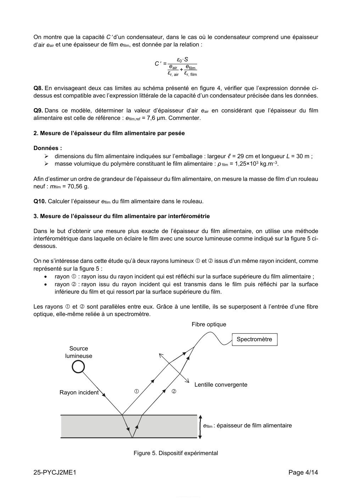

---

## Page 5

Pour une source monochromatique de longueur d’onde , la superposition des deux ondes associées aux
rayons  et  donne lieu à des interférences. On note δ la différence de chemin optique entre les deux ondes.

Q11. Préciser la relation entre δ et λ permettant d’obtenir des interférences constructives.

L’ordre d’interférence p est, dans le cas général, défini comme le rapport p = . On admet que, dans les
conditions de l’expérience, l’ordre d’interférence p est donné par la relation suivante :

                                                                               β × efilm       1
                                                                         p=                +                                        relation 1
                                                                                              2

où β est un paramètre sans dimension dépendant de l’indice de réfraction du film et de l’angle d’incidence de
la lumière sur le film.

                                                                                                                                                                      β × efilm
Q12. Préciser, en justifiant sans calcul, le phénomène observé lorsque le rapport                                                                                                 est un nombre entier.
                                                                                                                                                                         

Dans l’expérience étudiée, le film est éclairé en lumière blanche et on analyse le spectre de la lumière
transportée par la fibre. On donne ci-dessous sur la figure 6a le spectre de la lumière incidente et sur la
figure 6b celui de la lumière captée par la fibre optique.
                                                                                                                Intensité (unité arbitraire)
     Intensité (unité arbitraire)

                                                                                           0                                                                                                    0

                                    400     500       600     700        800          900                                    400                      500       600       700        800      900
                                                  Longueur d'onde (nm)                                                                                      Longueur d'onde (nm)

                                     Figure 6a. Spectre de la lumière incidente                                                                      Figure 6b. Spectre de la lumière
                                                                                                                                                         captée par la fibre optique

Q13. Le spectre de la figure 6b présente des maxima d’intensité dont certains sont entourés en pointillés.
Expliquer leur origine.

L’analyse de la figure 6b permet de représenter l’évolution de l’ordre d’interférence en fonction de l’inverse de
la longueur d’onde. Les résultats obtenus et leur modélisation sont représentés sur la figure 7.

25-PYCJ2ME1                                                                                                                                                                                Page 5/14

                                                                                               EducN_MMDQ0Mj5MzMDka5MD2gzMtjAyNj1A1MjEHwMzxE4MUjMg

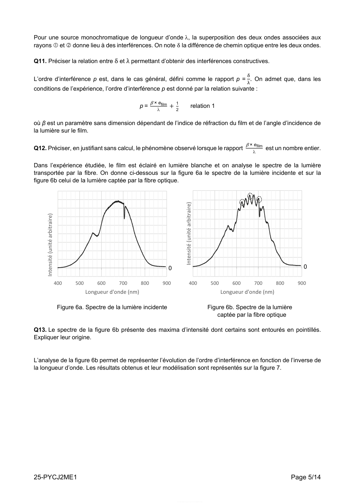

---

## Page 6

38

                            37

                            36
   Ordre d'interférence p

                            35
                                                                                                                                                   1
                                                                                                                                     p = 22443 ×
                            34                                                                                                                      + 0,51 ( en nm)

                            33

                            32
                                                                                                                                                                    (nm )
                                                                                                                                                                        –1

                            31
                             0,00135           0,0014          0,00145                   0,0015                                     0,00155            0,0016        0,00165

                                       Figure 7. Représentation graphique de l’ordre d’interférence p en fonction de

Q14. Indiquer, en justifiant, si les résultats expérimentaux sont cohérents avec la relation 1.

Q15. Déduire de ces mesures la valeur de l’épaisseur efilm du film alimentaire, sachant que, dans les conditions
de l’expérience, β = 3,02. Commenter.

25-PYCJ2ME1                                                                                                                                                     Page 6/14

                                                                              EducN_MMDQ0Mj5MzMDka5MD2gzMtjAyNj1A1MjEHwMzxE4MUjMg

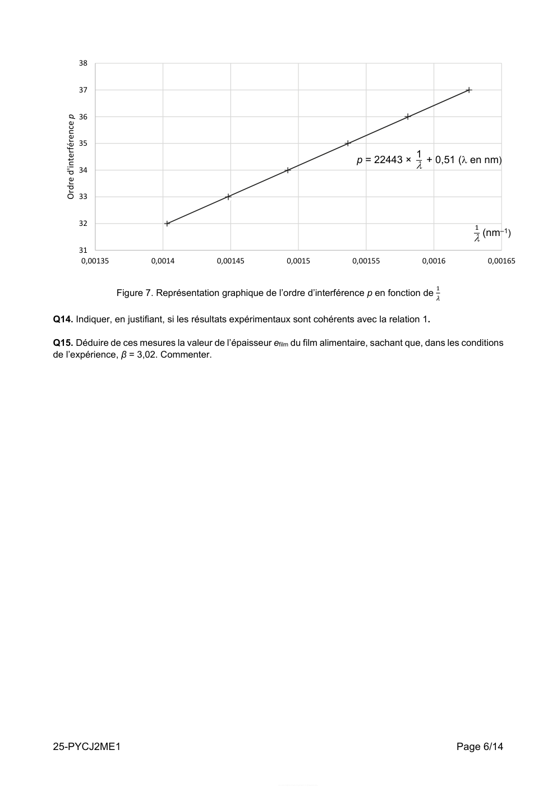

---

## Page 7

Exercice 2 - Eau de Quinton (4 points)

René Quinton, biologiste français, a découvert et mis au point le sérum qui porte
son nom : l’eau de Quinton. Issue d’un prélèvement d’eau de mer, celle-ci est
ensuite filtrée pour en éliminer les impuretés. Elle est actuellement
commercialisée, notamment sous forme d’ampoules pour, par exemple, nettoyer
le nez ou les yeux.

L’objectif de cet exercice est de déterminer la teneur en ions chlorure d’une eau de Quinton commerciale
provenant d’une mer bretonne, à l’aide d’un titrage suivi par conductimétrie.

Données :
    conductivités molaires ioniques à 25 °C :

            ion                         Cℓ–                    Ag+                                                      NO3             Na+

      λ S∙m2 ∙mol 1                  7,63×10 3              6,19×10 3                                                 7,14×10 3       5,01×10 3

      masse molaire atomique de l’élément chlore : M(Cℓ) = 35,5 g·mol–1 ;
      concentration moyenne en masse en ions chlorure d’une eau de mer bretonne : 19,4 g·L–1 ;
      la concentration en ions chlorure dans le sang est comprise entre 100 et 110 mmol∙L–1 ;
      pour discuter de l’accord du résultat d’une mesure avec une valeur de référence, on peut utiliser le
                   | x – xref |
        quotient                  avec x la valeur mesurée, xref la valeur de référence et u(x) l’incertitude-type associée
                      u(x)
        à la valeur mesurée x.

Dans le contexte de cet exercice, on peut qualifier une eau de Quinton d’isotonique si sa concentration en ions
chlorure est dans l’intervalle des valeurs de celles du sang, d’hypertonique si elle est supérieure à
110 mmol∙L–1 et d’hypotonique si elle est inférieure à 100 mmol∙L–1 .

1. Préparation de l’eau de Quinton isotonique

Une eau de Quinton isotonique est préparée en diluant 5 fois l’eau de Quinton commerciale hypertonique étudiée.

Q1. Proposer un protocole permettant de préparer 100,0 mL d’eau de Quinton isotonique à partir d’eau de
Quinton commerciale. Nommer, en précisant les volumes, la verrerie utilisée.

Q2. Vérifier le caractère isotonique de la solution ainsi préparée.

2. Analyse d’une eau de Quinton hypertonique

On assimile l’eau de Quinton hypertonique étudiée à une solution aqueuse de chlorure de sodium (Na+(aq) ; Cℓ–(aq)).
Afin d’en déterminer la concentration en ions chlorure, on réalise un titrage suivi par conductimétrie.

À l’aide d’une pipette jaugée, on prélève un volume V1 = 10,0 mL d’eau de Quinton hypertonique que l’on
introduit dans un bécher, dans lequel on ajoute 200 mL d’eau distillée.

                                                                                                                                  –
On dose la solution obtenue par une solution titrante de nitrate d’argent (Ag+ (aq) ; NO3 aq ) de concentration
C2 = 3,00×10–1 mol·L–1. Les ions argent forment avec les ions chlorure un précipité de chlorure d’argent
AgCℓ(s). Cette réaction de précipitation peut être considérée comme totale.

Q3. Écrire l’équation de la réaction modélisant la transformation mise en jeu au cours du titrage.

On utilise le langage de programmation Python pour simuler et représenter l’évolution des concentrations des
espèces qui participent à la conductivité de la solution titrée en fonction du volume de solution titrante
versé. On néglige la dilution liée à l’ajout de la solution titrante.

25-PYCJ2ME1                                                                                                                               Page 7/14

                                                                EducN_MMDQ0Mj5MzMDka5MD2gzMtjAyNj1A1MjEHwMzxE4MUjMg

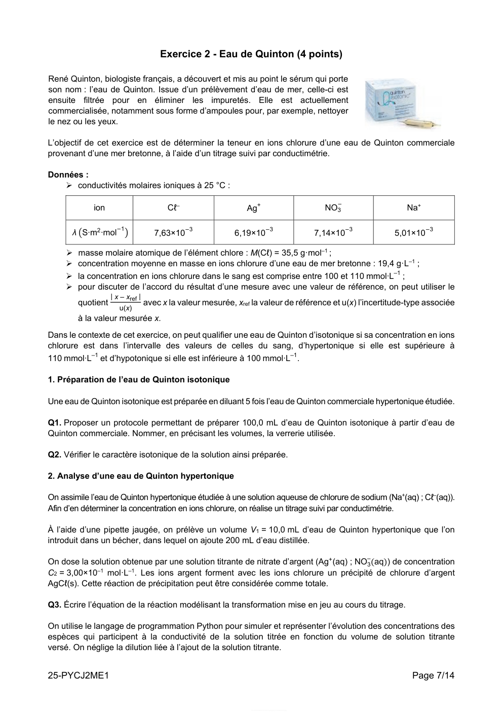

---

## Page 8

Dans ce programme, on utilise les notations suivantes :
     C_1 : concentration de la solution titrée exprimée en mol·L–1 ;
     V_1 : volume de solution titrée exprimé en L ;
     C_2 : concentration de la solution titrante exprimée en mol·L–1 ;
     V_2 : volume de solution titrante versé exprimé en L.

On fournit sur la figure 1 un extrait du programme et sur la figure 2 le résultat de la simulation obtenu.

 8       # Déclaration des variables
 9
 10      c_A = []                 # Concentration de l'espèce A
 11      c_B = []                 # Concentration de l'espèce B
 12      c_C = []                 # Concentration de l'espèce C
 13      c_D = []                 # Concentration de l'espèce D
 14
 15      V_E =                    # Expression du volume équivalent exprimé en L

                                        Figure 1. Extrait du programme

           Figure 2. Évolution des concentrations en fonction du volume de solution titrante versé

                                                                                                               –
Q4. Identifier, en justifiant, les espèces A, B, C et D parmi Na+, Cℓ–, NO3 et Ag+.

Q5. Donner l’expression de la ligne 15 du programme Python permettant de calculer la valeur du volume à
l’équivalence, noté V_E, en fonction de C_1, C_2 et V_1.

On a reporté sur la figure A1 de l’ANNEXE À RENDRE AVEC LA COPIE l’évolution de la conductivité σ en
fonction du volume V2 de solution de nitrate d’argent versé.

Q6. En utilisant les résultats de la simulation de la figure 2, expliquer l’évolution de la conductivité mesurée au
cours du dosage.

Q7. Exploiter les résultats expérimentaux pour déterminer la concentration en masse CQuinton des ions chlorure
dans l’eau de Quinton.

25-PYCJ2ME1                                                                                                        Page 8/14

                                                         EducN_MMDQ0Mj5MzMDka5MD2gzMtjAyNj1A1MjEHwMzxE4MUjMg

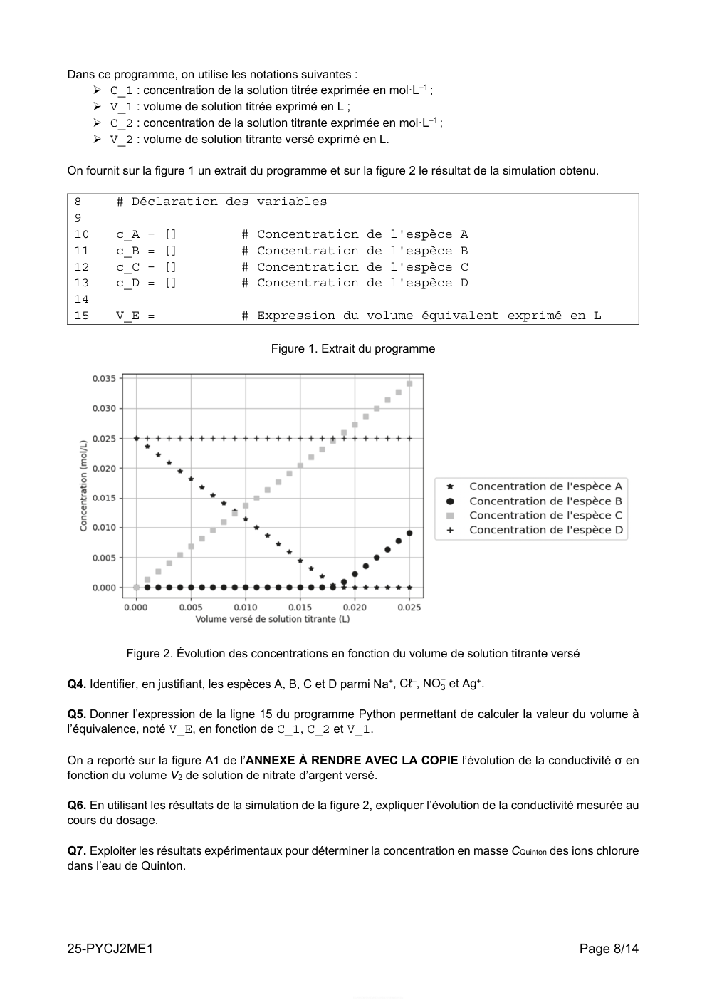

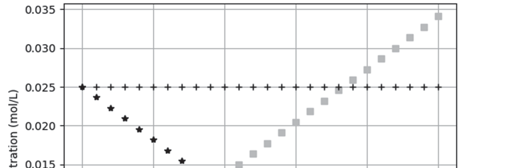

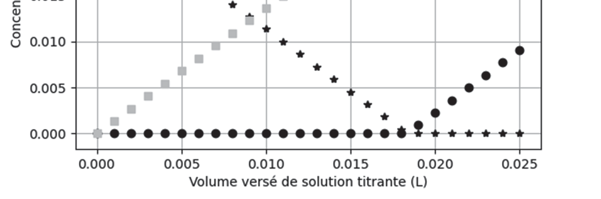

---

## Page 9

L’incertitude-type u(CQuinton) associée à la valeur de la concentration en masse trouvée précédemment est,
dans cette situation :
                                                                            2                                2                2
                                                     u(V1 )                                         u(VE )           u(C2 )
                           u CQuinton = CQuinton ×                                 +                             +
                                                      V1                                             VE               C2

avec u(VE) = 0,5 mL, u(V1) = 0,02 mL et u(C2) = 2×10–3 mol·L–1.

Q8. Vérifier si la concentration trouvée est en accord avec la concentration en ions chlorure de l’eau de mer
bretonne.

25-PYCJ2ME1                                                                                                                       Page 9/14

                                                       EducN_MMDQ0Mj5MzMDka5MD2gzMtjAyNj1A1MjEHwMzxE4MUjMg

---

## Page 10

Exercice 3 - Un parfum de rose (5 points)

Utilisés en parfumerie, le géraniol et l’éthanoate de géranyle sont deux
espèces chimiques à l’odeur florale et fruitée naturellement présentes
dans les huiles essentielles de rose, de palmarosa ou encore de
citronnelle.

Si le géraniol peut être extrait en grande quantité dans la nature, cela
n’est pas le cas de l’éthanoate de géranyle qui doit être synthétisé en
laboratoire.

L’objectif de cet exercice est d’étudier quelques propriétés du géraniol et son utilisation dans la synthèse de
l’éthanoate de géranyle.

Données :
    représentation topologique du géraniol, noté G :

       représentation topologique de l’éthanoate de géranyle, noté EG :

       table de données de spectroscopie infrarouge :

                    Liaisons                    Nombre d’onde (cm–1)                                              Intensité
                   O – H alcool                    3 200 – 3 700                                                    Forte
             O – H acide carboxylique              2 500 – 3 200                                              Forte et très large
                      C–H                          2 800 – 3 300                                               Moyenne et fine
                      C=O                          1 700 – 1 800                                                Forte et fine

       masse molaire du géraniol : MG = 154,25 g·mol–1 ;
       masse molaire de l’éthanoate de géranyle : MEG = 196,29 g·mol–1 ;
       ordre de grandeur de la densité d’une solution aqueuse d’acide éthanoïque : dA = 1,0 ;
       densité du géraniol : dG = 0,89 ;
       densité de l’éthanoate de géranyle : dEG = 0,92.

1. Étude préliminaire

Q1. Nommer le groupe caractéristique entouré sur la représentation topologique du géraniol. Identifier les
familles chimiques auxquelles appartiennent le géraniol et l’éthanoate de géranyle.

Q2. Attribuer, en justifiant, le spectre infrarouge représenté sur la figure 1 ci-après à la bonne espèce chimique
parmi le géraniol et l’éthanoate de géranyle.

25-PYCJ2ME1                                                                                                                Page 10/14

                                                        EducN_MMDQ0Mj5MzMDka5MD2gzMtjAyNj1A1MjEHwMzxE4MUjMg

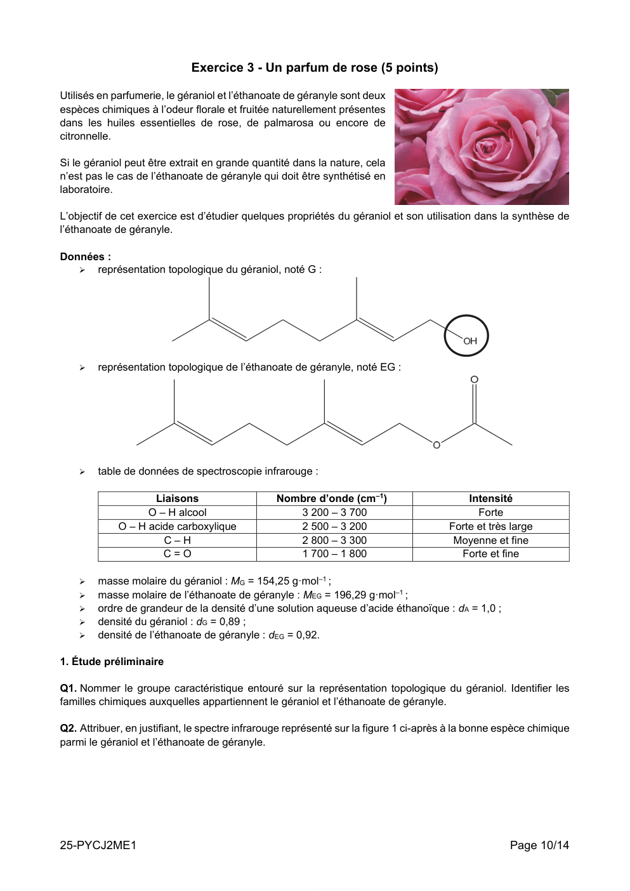

---

## Page 11

100
 Transmittance (%)

                     50

                     0
                     4000              3000       2000                                                       1500   1000       500
                                                      Nombre d’onde (cm–1)
                                              Figure 1. Spectre infrarouge

2. Transformation du géraniol en éthanoate de géranyle

L’éthanoate de géranyle peut être synthétisé en faisant réagir du géraniol avec de l’acide éthanoïque
CH3CO2H. Cette transformation chimique, appelée estérification, est lente et non totale. Les étapes du
mécanisme réactionnel de cette estérification sont données ci-dessous. Afin de simplifier les écritures, le
géraniol est dorénavant noté R–OH et l’éthanoate de géranyle est dorénavant noté CH3COO–R dans toute la
suite de l’exercice.

Étape 1 :

Étape 2 :

Étape 3 :
                          OH                         OH H
                                                                 +
H3C                       C       OH          H3C    C     O
                              +
              R O                                    O     H
                                                 R
                          H

25-PYCJ2ME1                                                                                                                Page 11/14

                                                           EducN_MMDQ0Mj5MzMDka5MD2gzMtjAyNj1A1MjEHwMzxE4MUjMg

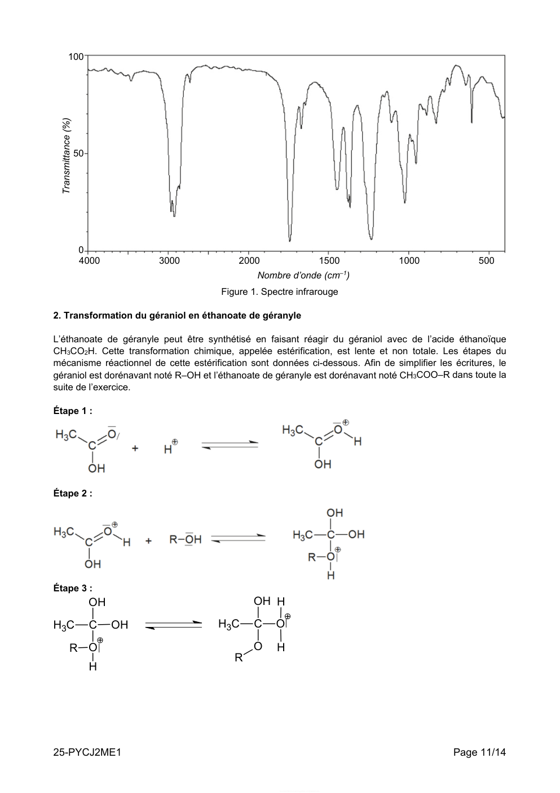

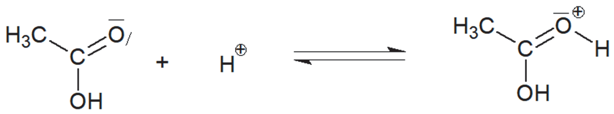

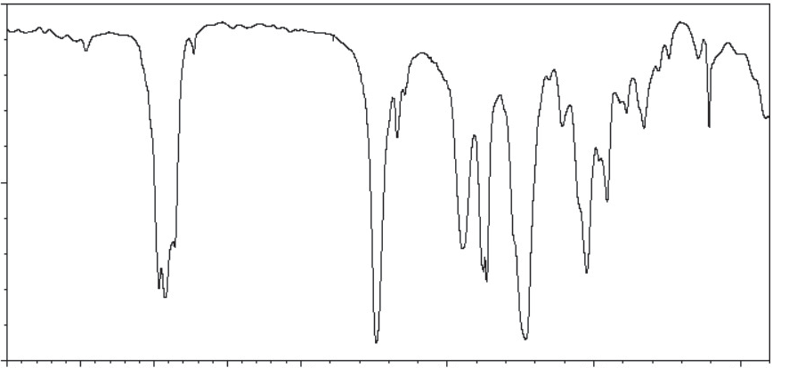

---

## Page 12

Étape 4 :

Étape 5 :

Q3. Rappeler la définition d’un catalyseur puis identifier, en justifiant, l’espèce chimique qui catalyse la réaction
d’estérification.

Q4. Représenter sur la figure A2 de l’ANNEXE À RENDRE AVEC LA COPIE, les flèches courbes expliquant
la formation et/ou la rupture des liaisons mises en jeu lors des étapes 1, 2 et 5.

Q5. Donner la formule brute de l’espèce chimique notée A dans l’étape 4 puis écrire l’équation de la réaction
d’estérification entre le géraniol et l’acide éthanoïque.

La synthèse de l’éthanoate de géranyle est réalisée en laboratoire avec le protocole expérimental suivant :
    - dans un erlenmeyer, surmonté d’un réfrigérant à air, introduire un volume VA = 50 mL d’une solution
        aqueuse d’acide éthanoïque à la concentration CA = 1,0 mol·L–1 ainsi qu’une masse mG = 7,7 g de
        géraniol pur ;
    - ajouter deux gouttes d’acide sulfurique concentré (quantité négligeable devant la quantité d’acide
        éthanoïque introduit dans l’étape précédente) ;
    - chauffer à 55 °C au bain-marie pendant deux heures ;
    - verser le mélange refroidi dans une ampoule à décanter et séparer la phase aqueuse, qui contient
        l’acide éthanoïque restant, de la phase organique, qui contient l’éthanoate de géranyle synthétisé et
        le géraniol restant.

Q6. Indiquer l’intérêt de chauffer le mélange.

Q7. Indiquer, en justifiant, la position relative et le contenu des phases dans l’ampoule à décanter.

Q8. Vérifier par le calcul que l’acide éthanoïque et le géraniol sont introduits dans les proportions
stœchiométriques.

Pour déterminer la quantité d’éthanoate de géranyle formée, on dose l’acide éthanoïque restant dans la phase
aqueuse à l’aide d’une solution aqueuse d’hydroxyde de sodium à la concentration CB = 1,0 mol·L–1. Le titrage
est suivi par pH-métrie et la courbe obtenue est représentée sur la figure 2.

25-PYCJ2ME1                                                                                                     Page 12/14

                                                          EducN_MMDQ0Mj5MzMDka5MD2gzMtjAyNj1A1MjEHwMzxE4MUjMg

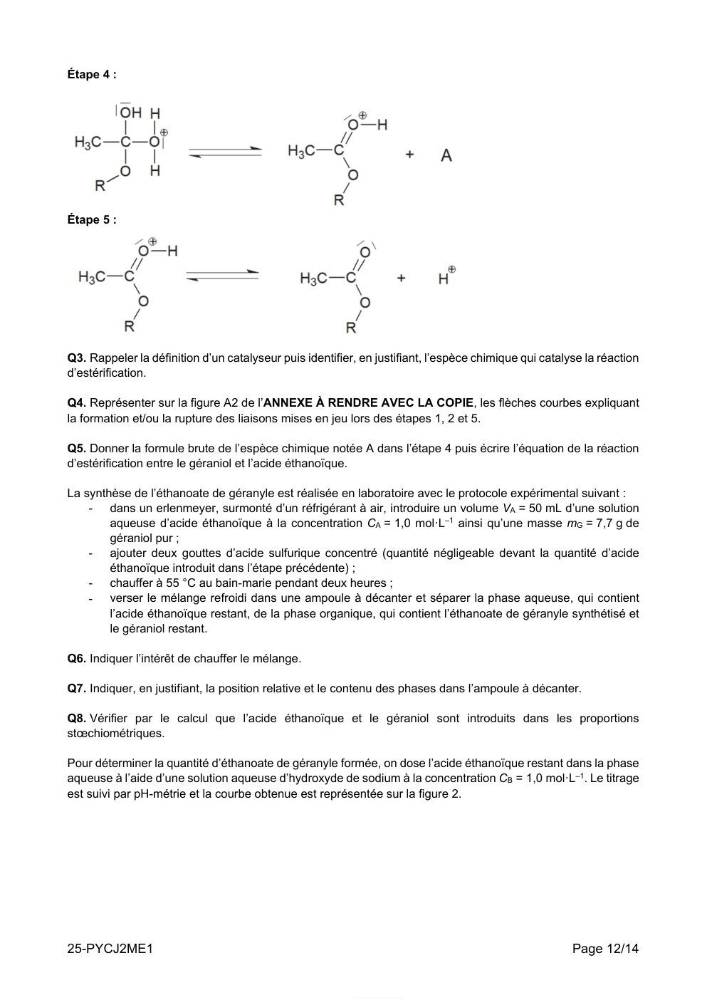

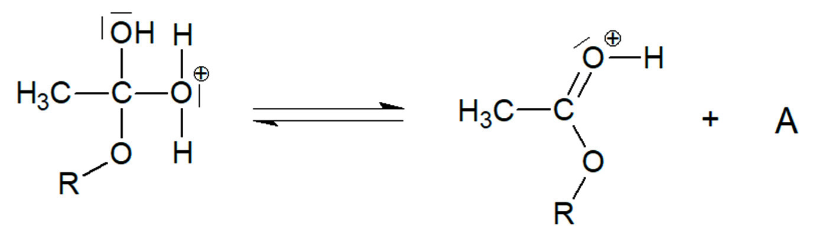

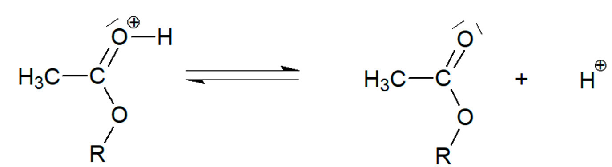

---

## Page 13

14

       12

       10

        8
  pH

        6

        4

        2

        0
            0      5        10        15        20               25                                          30   35   40   45     50

                             Volume VB de solution d'hydroxyde de sodium versé (mL)
       Figure 2. Courbe de titrage de l’acide éthanoïque restant par une solution d’hydroxyde de sodium

Q9. Écrire l’équation de la réaction support du titrage puis, à l’aide de la courbe de titrage, déterminer, en
explicitant la démarche, la quantité de matière d’acide éthanoïque restant dans le milieu réactionnel après
deux heures de chauffage.

Q10. Déterminer le rendement 𝜂 de la réaction d’estérification.

3. Utilisation du géraniol en parfumerie

Le géraniol fait partie des substances allergènes que l’on retrouve dans les parfums. Une personne peut être
exposée sans risque à une dose de géraniol inférieure à 17,75 mg par kg de masse corporelle.

Les informations suivantes sont recueillies sur l’étiquette d’un parfum vendu dans le commerce :
    - le parfum contient 0,001 % en masse de géraniol ;
    - une pulvérisation contient 0,15 mL de parfum ;
    - la densité du parfum est d = 0,84.

Q11. Déterminer le nombre maximal de pulvérisations d’un parfum qu’une personne, de masse 65 kg, peut
effectuer sans se mettre en danger. Commenter.

Le candidat est invité à prendre des initiatives et à présenter la démarche suivie, même si elle n’a pas abouti.
La démarche est évaluée et nécessite d’être correctement présentée.

25-PYCJ2ME1                                                                                                                  Page 13/14

                                                       EducN_MMDQ0Mj5MzMDka5MD2gzMtjAyNj1A1MjEHwMzxE4MUjMg

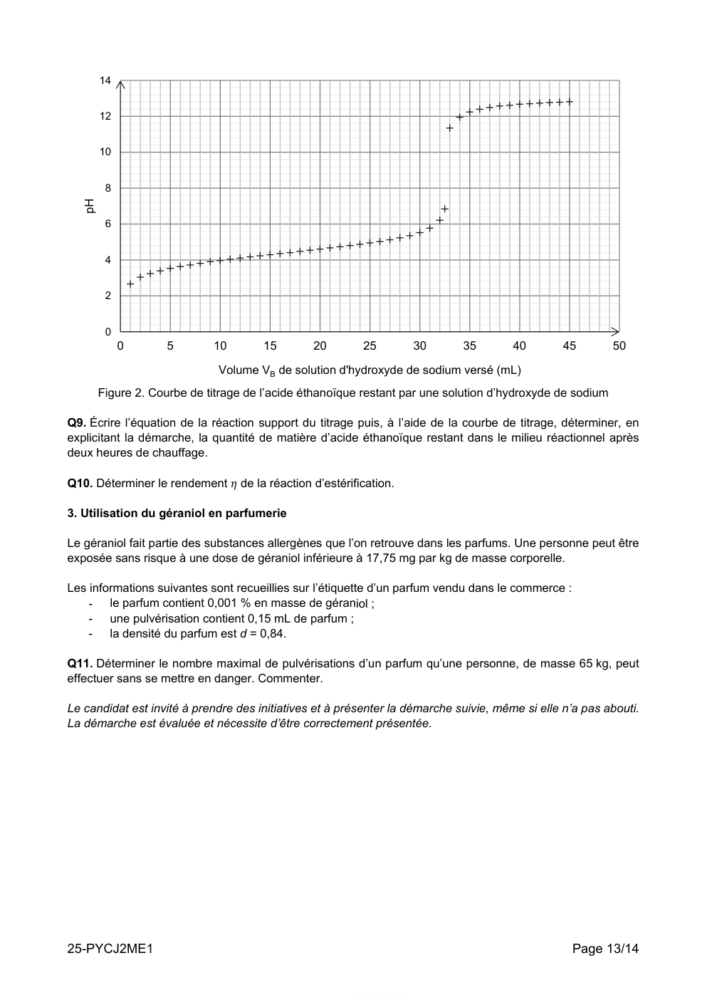

---

## Page 14

Page blanche laissée intentionnellement.
        Ne rien inscrire dessus.

                    EducN_MMDQ0Mj5MzMDka5MD2gzMtjAyNj1A1MjEHwMzxE4MUjMg

---

## Page 15

ANNEXE À RENDRE AVEC LA COPIE

            σ (mS·cm-1)
     0,65

      0,6

     0,55

      0,5

     0,45

      0,4
            0                5              10              15               20          25            30
                                                                                                    V2 (mL)

                          Figure A1. Évolution de la conductivité σ au cours du dosage
                           en fonction du volume de solution de nitrate d’argent versé
                                               _______________

Étape 1 :

Étape 2 :

Étape 5 :

                                 Figure A2. Extraits du mécanisme réactionnel
                                   de la synthèse de l’éthanoate de géranyle

25-PYCJ2ME1                                                                                   Page 14/14

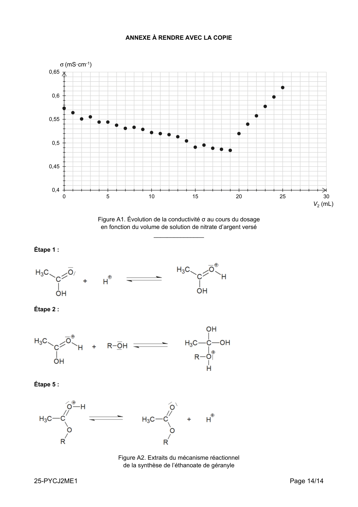

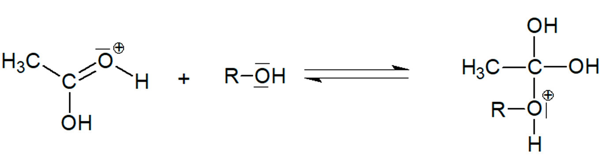

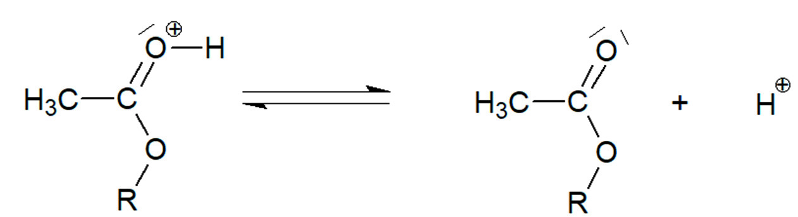
