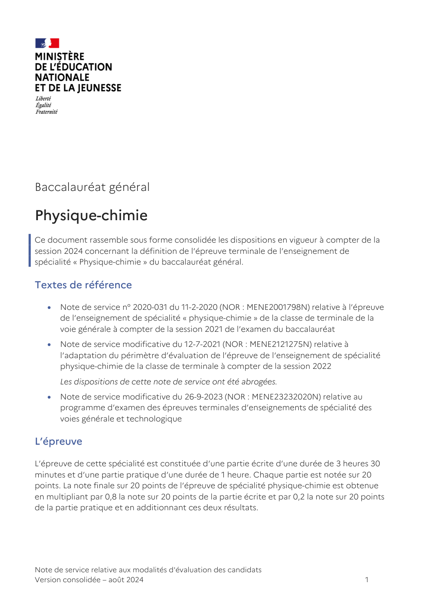

# nds_pc_finale

> Source : `../../../pdf_version/10_pc/eduscol_officiel/nds_pc_finale.pdf` — conversion Markdown (texte + visuels).
> Stratégie : [STRATEGIE_MARKDOWN.md](../../../STRATEGIE_MARKDOWN.md)

---

## Page 1

Baccalauréat général

Physique-chimie 
Ce document rassemble sous forme consolidée les dispositions en vigueur à compter de la
session 2024 concernant la définition de l’épreuve terminale de l’enseignement de
spécialité « Physique-chimie » du baccalauréat général.

Textes de référence

      Note de service n° 2020-031 du 11-2-2020 (NOR : MENE2001798N) relative à l’épreuve
       de l’enseignement de spécialité « physique-chimie » de la classe de terminale de la
       voie générale à compter de la session 2021 de l’examen du baccalauréat
      Note de service modificative du 12-7-2021 (NOR : MENE2121275N) relative à
       l’adaptation du périmètre d’évaluation de l’épreuve de l’enseignement de spécialité
       physique-chimie de la classe de terminale à compter de la session 2022
       Les dispositions de cette note de service ont été abrogées.
      Note de service modificative du 26-9-2023 (NOR : MENE23232020N) relative au
       programme d’examen des épreuves terminales d’enseignements de spécialité des
       voies générale et technologique

L’épreuve

L’épreuve de cette spécialité est constituée d’une partie écrite d’une durée de 3 heures 30
minutes et d’une partie pratique d’une durée de 1 heure. Chaque partie est notée sur 20
points. La note finale sur 20 points de l’épreuve de spécialité physique-chimie est obtenue
en multipliant par 0,8 la note sur 20 points de la partie écrite et par 0,2 la note sur 20 points
de la partie pratique et en additionnant ces deux résultats.

Note de service relative aux modalités d'évaluation des candidats
Version consolidée – août 2024                                                             1

---

## Page 2

Objectifs

L’épreuve porte sur les notions, contenus, capacités et compétences figurant au
programme de l’enseignement de spécialité de la classe de terminale en vigueur. Les
notions rencontrées en classe de première mais non approfondies en classe de terminale,
doivent être connues et mobilisables. Elles ne peuvent cependant pas constituer un ressort
essentiel du sujet.

Les thématiques des sujets portent sur le programme de terminale et les compétences
mobilisées sont celles du cycle terminal.

Partie écrite

Durée : 3 heures 30

Structure

La partie écrite comporte trois exercices indépendants et s’appuie de manière équilibrée
sur différents thèmes des programmes. Le sujet accorde une place significative à la
modélisation et à la résolution de questions avec prise d’initiative. Les sujets traités lors de
cette épreuve portent sur des situations contextualisées, peuvent contenir des documents
et inclure des questions relatives aux aspects expérimentaux de la discipline et aux
capacités numériques identifiées dans les programmes.

Le sujet précise si l’usage de la calculatrice, dans les conditions précisées par les textes en
vigueur, est autorisé.

Notation

Cette partie est notée sur 20 points. La note finale est composée de la somme des points
obtenus à chacun des exercices.

Partie pratique : évaluation des compétences expérimentales

Durée : 1 heure

Objectifs

La partie pratique vise à évaluer les compétences expérimentales des candidats. Elle
s’appuie sur les compétences de la démarche scientifique, les capacités expérimentales et
les activités expérimentales support de la formation identifiées dans les programmes de la
spécialité physique-chimie du cycle terminal. Dans un contexte de laboratoire de physique
et chimie, le candidat est ainsi conduit à s’approprier une problématique de nature
expérimentale, à mettre en œuvre ou à élaborer un protocole, à réaliser une ou plusieurs
expériences, à valider sa démarche et à communiquer ses résultats. L’épreuve valorise
l’autonomie et l’initiative du candidat.

Note de service relative aux modalités d'évaluation des candidats
Version consolidée – août 2024                                                              2

---

## Page 3

Structure

Selon les textes en vigueur, chaque académie retient un ensemble de situations d’évaluation
parmi celles publiées dans une banque nationale, puis les établissements choisissent un
ensemble de ces situations d’évaluation.
Le candidat tire au sort sa situation d’évaluation parmi un sous-ensemble, renouvelé par
demi-journée, d’au moins deux situations d’évaluation à dominante physique et deux
situations d’évaluation à dominante chimie. Le candidat prend connaissance du contenu de
la situation à l’entrée dans la salle d’évaluation.
Lors de l’évaluation, deux professeurs examinateurs sont présents dans la salle. Un
examinateur évalue au maximum quatre candidats. L’examinateur ne peut pas évaluer un
élève qu’il a eu en classe durant l’année en cours.

Notation

Cette partie est notée sur 20 points.

  Candidats individuels, candidats du Centre national des études à distance (Cned) et des
  établissements privés hors contrat
  Les candidats individuels, les candidats scolarisés dans des établissements
  d’enseignement privé hors contrat et les candidats inscrits au Cned sont dispensés de
  cette épreuve pratique. La note de l’épreuve de spécialité physique-chimie est
  constituée de la note obtenue à la partie écrite de l’épreuve rapportée à 20 points.
  Absence, dispense et aménagement de la partie pratique
  Toute absence non justifiée d’un candidat scolaire le jour fixé pour l’évaluation de la
  partie pratique entraîne l’attribution de la note zéro pour cette partie de l’épreuve.
  Dans le cas d’une absence justifiée, une épreuve de substitution pour le candidat
  concerné, doit, dans toute la mesure du possible, être organisée au sein de
  l’établissement et, en tout état de cause avant la fin de l’année scolaire. Dans
  l’hypothèse où le candidat ne peut se voir finalement attribuer de note à l’épreuve
  pratique pour des raisons justifiées, il en est déclaré dispensé.
  Les candidats scolaires en situation de handicap peuvent être dispensés, à leur
  demande et sur proposition du médecin désigné par la commission des droits et de
  l’autonomie des personnes handicapées, de l’épreuve pratique lorsque leur trouble est
  incompatible avec les activités de manipulation mises en œuvre pendant les séances
  de travaux pratiques.
  Les élèves en situation de handicap pour lesquels un aménagement des conditions
  d’épreuve a été validé par les autorités académiques, passent cette partie à partir
  d’une sélection de situations d’évaluation parmi les situations retenues pour
  l’académie, qui sont adaptées à leur handicap. En fonction de l’avis médical, les
  adaptations peuvent porter notamment sur le choix des types de situations proposés
  au tirage au sort, sur l’aménagement du poste de travail, sur la majoration du temps
  imparti, sur l’aide d’un secrétaire, sur la présentation voire l’adaptation de cette
  situation. Dans ce dernier cas, on veillera à ce que la situation retenue permette que

Note de service relative aux modalités d'évaluation des candidats
Version consolidée – août 2024                                                          3

---

## Page 4

des compétences expérimentales soient mises en œuvre par le candidat afin qu’elles
  puissent être évaluées. L’objectif est que le maximum de candidats en situation de
  handicap puisse passer l’épreuve, sans toutefois que soient dénaturées les
  compétences expérimentales évaluées.
  Épreuve de remplacement
  Il n’y a pas d’épreuve de remplacement pour la partie pratique : en cas d’absence
  justifiée, la note éventuellement obtenue au cours de l’année scolaire concernant
  l’évaluation des compétences expérimentales est reportée et prise en compte.

Épreuve orale de contrôle

Durée : 20 minutes

Préparation : 20 minutes

Le programme sur lequel peut porter l’épreuve orale de contrôle est identique au
programme de l’épreuve écrite.

Le candidat tire au sort un sujet comportant deux questions, portant sur deux domaines de
natures différentes du programme, et doit traiter les deux questions.

En fonction du contenu du sujet tiré au sort par le candidat, l’examinateur décide si l’usage
d’une calculatrice est autorisé ou interdit.

Cette épreuve a lieu dans une salle comportant du matériel de physique-chimie afin que
des questions puissent être posées sur le matériel expérimental et son utilisation, sans que le
candidat soit conduit à manipuler.

Note de service relative aux modalités d'évaluation des candidats
Version consolidée – août 2024                                                           4
