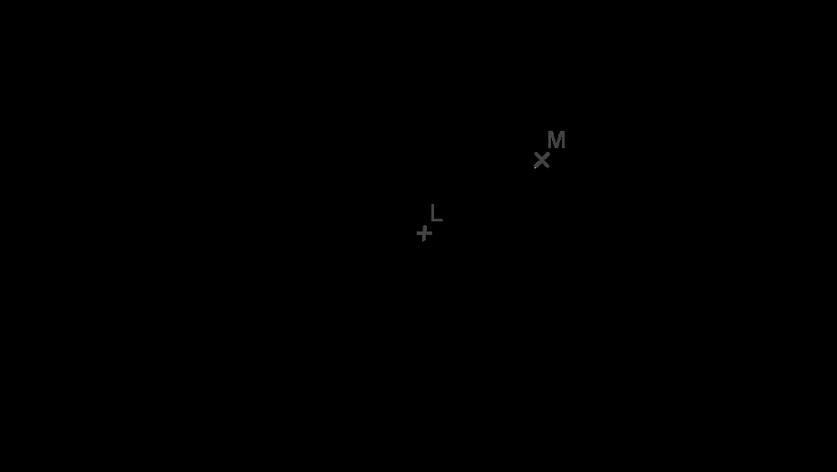
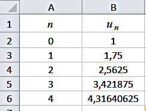

# spe-mathematiques-2021-metropole-1-sujet-officiel

> Source : `../../../pdf_version/11_maths/2021/spe-mathematiques-2021-metropole-1-sujet-officiel.pdf` — conversion Markdown (texte + visuels utiles).
> Stratégie : [STRATEGIE_MARKDOWN.md](../../../STRATEGIE_MARKDOWN.md)

---

## Page 1

BACCALAURÉAT GÉNÉRAL
                         ÉPREUVE D’ENSEIGNEMENT DE SPÉCIALITÉ

                                        SESSION 2021

                                 MATHÉMATIQUES

                                  Durée de l’épreuve : 4 heures

                 L’usage de la calculatrice avec mode examen actif est autorisé.
              L’usage de la calculatrice sans mémoire, « type collège » est autorisé.

                 Dès que ce sujet vous est remis, assurez-vous qu’il est complet.
                      Ce sujet comporte 6 pages numérotées de 1/6 à 6/6.

Le candidat traite 4 exercices : les exercices 1, 2 et 3 communs à tous les candidats et un seul
des deux exercices A ou B.

Le candidat est invité à faire figurer sur la copie toute trace de recherche, même incomplète ou
non fructueuse, qu’il aura développée.
La qualité de la rédaction, la clarté et la précision des raisonnements seront prises en compte
dans l’appréciation de la copie. Les traces de recherche, même incomplètes ou infructueuses,
seront valorisées.

                                                                                          Page 1 / 6

---

## Page 2

Exercice 1, commun à tous les candidats (5 points)
Dans une école de statistique, après étude des dossiers des candidats, le recrutement se fait de deux façons :
   ▪   10 % des candidats sont sélectionnés sur dossier. Ces candidats doivent ensuite passer un oral à
       l’issue duquel 60 % d’entre eux sont finalement admis à l’école.
   ▪   Les candidats n’ayant pas été sélectionnés sur dossier passent une épreuve écrite à l’issue de laquelle
       20 % d’entre eux sont admis à l’école.

                                                    Partie I
On choisit au hasard un candidat à ce concours de recrutement.
On notera :
   ▪ 𝐷 l’événement « le candidat a été sélectionné sur dossier » ;
   ▪ 𝐴 l’événement « le candidat a été admis à l’école » ;
   ▪ 𝐷 ̅ et 𝐴̅ les événements contraires des événements 𝐷 et 𝐴 respectivement.

1. Traduire la situation par un arbre pondéré.
2. Calculer la probabilité que le candidat soit sélectionné sur dossier et admis à l’école.
3. Montrer que la probabilité de l’événement 𝐴 est égale à 0,24.
4. On choisit au hasard un candidat admis à l’école. Quelle est la probabilité que son dossier n’ait pas été
sélectionné ?

                                                    Partie II
1. On admet que la probabilité pour un candidat d’être admis à l’école est égale à 0,24.
On considère un échantillon de sept candidats choisis au hasard, en assimilant ce choix à un tirage au sort
avec remise. On désigne par 𝑋 la variable aléatoire dénombrant les candidats admis à l’école parmi les sept
tirés au sort.
a. On admet que la variable aléatoire 𝑋 suit une loi binomiale. Quels sont les paramètres de cette loi ?
b. Calculer la probabilité qu’un seul des sept candidats tirés au sort soit admis à l’école. On donnera une
réponse arrondie au centième.
c. Calculer la probabilité qu’au moins deux des sept candidats tirés au sort soient admis à cette école. On
donnera une réponse arrondie au centième.

2. Un lycée présente 𝑛 candidats au recrutement dans cette école, où 𝑛 est un entier naturel non nul.
On admet que la probabilité pour un candidat quelconque du lycée d’être admis à l’école est égale à 0,24 et
que les résultats des candidats sont indépendants les uns des autres.
a. Donner l’expression, en fonction de 𝑛, de la probabilité qu’aucun candidat issu de ce lycée ne soit admis
à l’école.
b. À partir de quelle valeur de l’entier 𝑛 la probabilité qu’au moins un élève de ce lycée soit admis à l’école
est-elle supérieure ou égale à 0,99 ?

                                                                                                    Page 2 / 6

---

## Page 3

Exercice 2, commun à tous les candidats (5 points)

Soit 𝑓 la fonction définie sur l’intervalle ]0; +∞[ par :
                                                        e𝑥
                                                   𝑓(𝑥) =  .
                                                        𝑥
On note 𝐶𝑓 la courbe représentative de la fonction 𝑓 dans un repère orthonormé.

1.
a. Préciser la limite de la fonction 𝑓 en +∞.
b. Justifier que l’axe des ordonnées est asymptote à la courbe 𝐶𝑓 .
2. Montrer que, pour tout nombre réel 𝑥 de l’intervalle ]0; +∞[, on a :
                                                            e𝑥 (𝑥 − 1)
                                                𝑓 ′ (𝑥) =
                                                                𝑥²
où 𝑓 ′ désigne la fonction dérivée de la fonction 𝑓.
3. Déterminer les variations de la fonction 𝑓 sur l’intervalle ]0; +∞[. On établira un tableau de variations
de la fonction 𝑓 dans lequel apparaîtront les limites.
4. Soit 𝑚 un nombre réel. Préciser, en fonction des valeurs du nombre réel 𝑚, le nombre de solutions de
l’équation 𝑓(𝑥) = 𝑚.

5. On note Δ la droite d’équation 𝑦 = −𝑥.
On note 𝐴 un éventuel point de 𝐶𝑓 d’abscisse 𝑎 en lequel la tangente à la courbe 𝐶𝑓 est parallèle à la
droite Δ.
a. Montrer que 𝑎 est solution de l’équation e𝑥 (𝑥 − 1) + 𝑥 2 = 0.
On note 𝑔 la fonction définie sur [0; +∞[ par 𝑔(𝑥) = e𝑥 (𝑥 − 1) + 𝑥 2 .
On admet que la fonction 𝑔 est dérivable et on note 𝑔′ sa fonction dérivée.
b. Calculer 𝑔′ (𝑥) pour tout nombre réel 𝑥 de l’intervalle [0; +∞[ , puis dresser le tableau de variations de
𝑔 sur [0; +∞[.
c. Montrer qu’il existe un unique point 𝐴 en lequel la tangente à 𝐶𝑓 est parallèle à la droite Δ.

                                                                                                    Page 3 / 6

---

## Page 4

Exercice 3, commun à tous les candidats (5 points)
Cet exercice est un questionnaire à choix multiples. Pour chacune des questions suivantes, une seule des
quatre réponses proposées est exacte. Une réponse exacte rapporte un point. Une réponse fausse, une
réponse multiple ou l’absence de réponse à une question ne rapporte ni n’enlève de point. Pour répondre,
indiquer sur la copie le numéro de la question et la lettre de la réponse choisie. Aucune justification n’est
demandée.

SABCD est une pyramide régulière à base carrée ABCD dont toutes les arêtes ont la même longueur.
Le point I est le centre du carré ABCD. On suppose que : IC = IB = IS = 1.
Les points K, L et M sont les milieux respectifs des arêtes [SD], [SC] et [SB].

1. Les droites suivantes ne sont pas coplanaires :
a. (DK) et (SD)                   b. (AS) et (IC)                    c. (AC) et (SB)                    d. (LM) et (AD)

Pour les questions suivantes, on se place dans le repère orthonormé de l’espace(I ; IC         ⃗⃗⃗ , IB    ⃗⃗ ).
                                                                                                     ⃗⃗⃗ , IS
Dans ce repère, on donne les coordonnées des points suivants :
                I(0 ; 0 ; 0) ; A(−1 ; 0 ; 0) ; B(0 ; 1 ; 0) ; C(1 ; 0 ; 0) ; D(0 ; −1 ; 0) ; S(0 ; 0 ; 1).
2. Les coordonnées du milieu N de [KL] sont :
    1   1   1                         1      1   1                          1   1   1                       1      1
a. ( ; ; )                        b. ( ; − ; )                       c. (− ; ; )                        d. ( ; − ; 1)
    4   4   2                         4      4   2                          4   4   2                       2      2

                              ⃗⃗⃗⃗ sont :
3. Les coordonnées du vecteur AS
    1                                 1                                   2                                 1
a. (1)                            b. (0)                             c. ( 1 )                           d. (1)
    0                                 1                                  −1                                 1

4. Une représentation paramétrique de la droite (AS) est :
     𝑥 = −1 − 𝑡                       𝑥 = −1 + 2𝑡                       𝑥=𝑡                           𝑥 = −1 − 𝑡
a. { 𝑦 = 𝑡      (𝑡 ∈ ℝ)          b. { 𝑦 = 0       (𝑡 ∈ ℝ)           c. {𝑦 = 0  (𝑡 ∈ ℝ)            d. { 𝑦 = 1 + 𝑡 (𝑡 ∈ ℝ)
    𝑧 = −𝑡                            𝑧 = 1 + 2𝑡                        𝑧 =1+𝑡                         𝑧 =1−𝑡

5. Une équation cartésienne du plan (SCB) est :
a. 𝑦 + 𝑧 − 1 = 0                  b. 𝑥 + 𝑦 + 𝑧 − 1 = 0               c. 𝑥 − 𝑦 + 𝑧 = 0                   d. 𝑥 + 𝑧 − 1 = 0

                                                                                                                   Page 4 / 6

---

## Page 5

EXERCICE au choix du candidat (5 points)

Le candidat doit traiter un seul des deux exercices A ou B.
Il indique sur sa copie l’exercice choisi : exercice A ou exercice B.
Pour éclairer son choix, les principaux domaines abordés par chaque exercice sont indiqués dans un
encadré.
Exercice A
Principaux domaines abordés :
Suites numériques ; raisonnement par récurrence ; suites géométriques.

La suite (𝑢𝑛 ) est définie sur ℕ par 𝑢0 = 1 et pour tout entier naturel 𝑛,
                                             3     1
                                    𝑢𝑛+1 =     𝑢𝑛 + 𝑛 + 1 .
                                             4     4

1. Calculer, en détaillant les calculs, 𝑢1 et 𝑢2 sous forme de fraction irréductible.

L’extrait, reproduit ci-contre, d’une feuille de
calcul réalisée avec un tableur présente les valeurs
des premiers termes de la suite (𝑢𝑛 ).

2.
a. Quelle formule, étirée ensuite vers le bas, peut-on écrire dans la cellule B3 de la feuille de calcul pour
obtenir les termes successifs de (𝑢𝑛 ) dans la colonne B ?
b. Conjecturer le sens de variation de la suite (𝑢𝑛 ).
3.
a. Démontrer par récurrence que, pour tout entier naturel 𝑛, on a : 𝑛 ≤ 𝑢𝑛 ≤ 𝑛 + 1.
b. En déduire, en justifiant la réponse, le sens de variation et la limite de la suite (𝑢𝑛 ).
c. Démontrer que :
                                                       𝑢𝑛
                                                   lim    =1.
                                                 𝑛→+∞ 𝑛

4. On désigne par (𝑣𝑛 ) la suite définie sur ℕ par 𝑣𝑛 = 𝑢𝑛 − 𝑛.
                                                              3
a. Démontrer que la suite (𝑣𝑛 ) est géométrique de raison .
                                                              4
                                                                  3 𝑛
b. En déduire que, pour tout entier naturel 𝑛, on a : 𝑢𝑛 = ( ) + 𝑛 .
                                                                  4

                                                                                                  Page 5 / 6

---

## Page 6

Exercice B
Principaux domaines abordés :
Fonction logarithme ; convexité.

On considère la fonction 𝑓 définie sur l’intervalle ]0; +∞[ par :
                                                                          3
                                         𝑓(𝑥) = 𝑥 + 4 − 4 ln(𝑥) −
                                                                          𝑥
où ln désigne la fonction logarithme népérien.
On note 𝒞 la représentation graphique de 𝑓 dans un repère orthonormé.
1. Déterminer la limite de la fonction 𝑓 en +∞.
2. On admet que la fonction 𝑓 est dérivable sur ]0; +∞[ et on note 𝑓′ sa fonction dérivée.
Démontrer que, pour tout nombre réel 𝑥 > 0, on a :
                                                         𝑥 2 − 4𝑥 + 3
                                             𝑓 ′ (𝑥) =                .
                                                              𝑥2
3.
a. Donner le tableau de variations de la fonction 𝑓 sur l’intervalle ]0; +∞[. On y fera figurer les valeurs
exactes des extremums et les limites de 𝑓 en 0 et en +∞. On admettra que lim 𝑓 (𝑥) = −∞.
                                                                                𝑥→0
                                                                                                          5
b. Par simple lecture du tableau de variations, préciser le nombre de solutions de l’équation 𝑓(𝑥) = .
                                                                                                          3

4. Étudier la convexité de la fonction 𝑓, c’est-à-dire préciser les parties de l’intervalle ]0; +∞[ sur lesquelles
𝑓 est convexe, et celles sur lesquelles 𝑓 est concave. On justifiera que la courbe 𝒞 admet un unique point
d’inflexion, dont on précisera les coordonnées.

                                                                                                       Page 6 / 6
