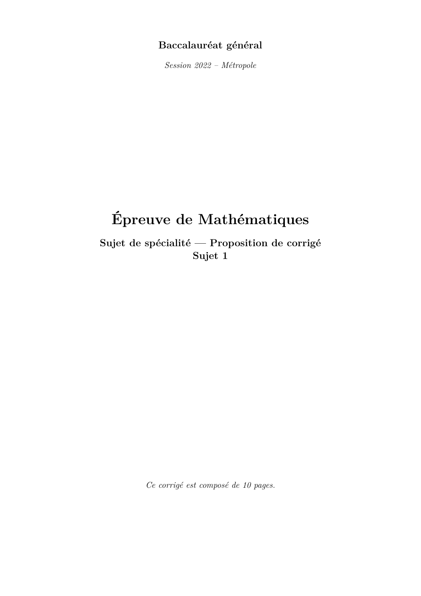
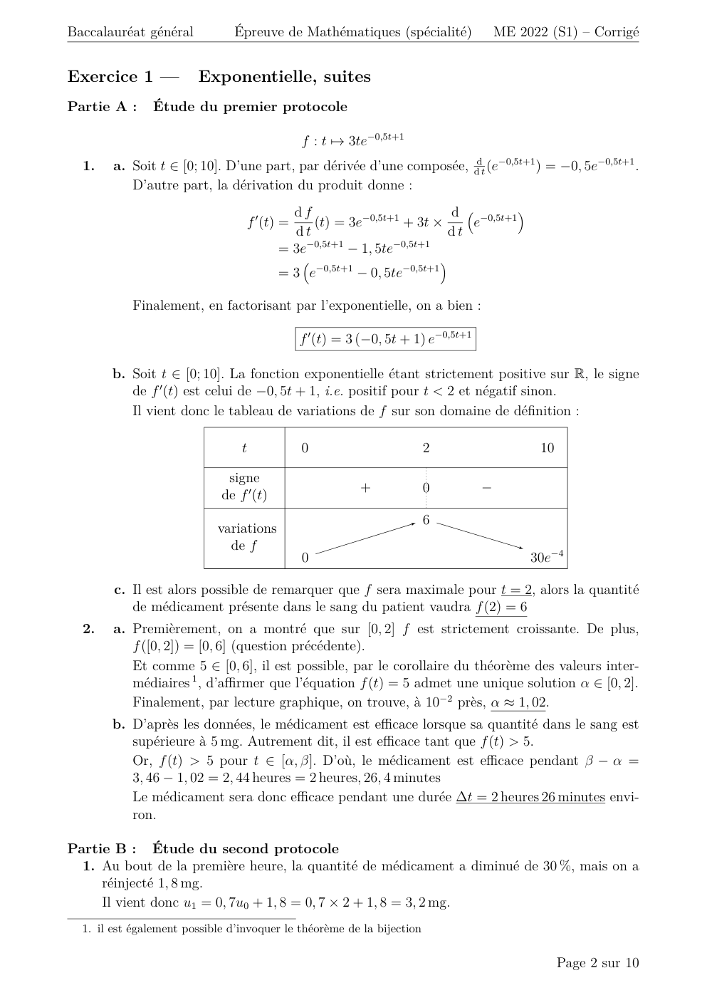

# spe-mathematiques-2022-metropole-1-corrige

> Source : `../../../pdf_version/11_maths/2022/spe-mathematiques-2022-metropole-1-corrige.pdf` — conversion Markdown (texte + visuels).
> Stratégie : [STRATEGIE_MARKDOWN.md](../../../STRATEGIE_MARKDOWN.md)

---

## Page 1

Baccalauréat général
              Session 2022 – Métropole

  Épreuve de Mathématiques
Sujet de spécialité — Proposition de corrigé
                   Sujet 1

         Ce corrigé est composé de 10 pages.

---

## Page 2

Baccalauréat général            Épreuve de Mathématiques (spécialité)                 ME 2022 (S1) – Corrigé

Exercice 1 —            Exponentielle, suites
Partie A :     Étude du premier protocole

                                              f : t 7→ 3te−0,5t+1
  1.    a. Soit t ∈ [0; 10]. D’une part, par dérivée d’une composée, ddt (e−0,5t+1 ) = −0, 5e−0,5t+1 .
           D’autre part, la dérivation du produit donne :
                                            df                        d  −0,5t+1 
                                  f 0 (t) =    (t) = 3e−0,5t+1 + 3t ×    e
                                            dt                        dt
                                          = 3e−0,5t+1 − 1, 5te−0,5t+1
                                                                           
                                          = 3 e−0,5t+1 − 0, 5te−0,5t+1

           Finalement, en factorisant par l’exponentielle, on a bien :

                                              f 0 (t) = 3 (−0, 5t + 1) e−0,5t+1

       b. Soit t ∈ [0; 10]. La fonction exponentielle étant strictement positive sur R, le signe
          de f 0 (t) est celui de −0, 5t + 1, i.e. positif pour t < 2 et négatif sinon.
          Il vient donc le tableau de variations de f sur son domaine de définition :

                                 t            0                         2                    10

                              signe
                                                         +              0         −
                             de f 0 (t)
                                                                        6
                            variations
                              de f
                                              0                                            30e−4

        c. Il est alors possible de remarquer que f sera maximale pour t = 2, alors la quantité
           de médicament présente dans le sang du patient vaudra f (2) = 6
  2.    a. Premièrement, on a montré que sur [0, 2] f est strictement croissante. De plus,
           f ([0, 2]) = [0, 6] (question précédente).
           Et comme 5 ∈ [0, 6], il est possible, par le corollaire du théorème des valeurs inter-
           médiaires 1 , d’affirmer que l’équation f (t) = 5 admet une unique solution α ∈ [0, 2].
           Finalement, par lecture graphique, on trouve, à 10−2 près, α ≈ 1, 02.
       b. D’après les données, le médicament est efficace lorsque sa quantité dans le sang est
          supérieure à 5 mg. Autrement dit, il est efficace tant que f (t) > 5.
          Or, f (t) > 5 pour t ∈ [α, β]. D’où, le médicament est efficace pendant β − α =
          3, 46 − 1, 02 = 2, 44 heures = 2 heures, 26, 4 minutes
          Le médicament sera donc efficace pendant une durée ∆t = 2 heures 26 minutes envi-
          ron.

Partie B : Étude du second protocole
  1. Au bout de la première heure, la quantité de médicament a diminué de 30 %, mais on a
     réinjecté 1, 8 mg.
     Il vient donc u1 = 0, 7u0 + 1, 8 = 0, 7 × 2 + 1, 8 = 3, 2 mg.
  1. il est également possible d’invoquer le théorème de la bijection

                                                                                                  Page 2 sur 10

---

## Page 3

Baccalauréat général       Épreuve de Mathématiques (spécialité)        ME 2022 (S1) – Corrigé

  2. Soit n ∈ N. À chaque heure, on sait que la quantité de médicament diminue de 30 %. Il
     restera alors, à l’heure (n + 1), une quantité 0, 7 × un dans le sang. Mais comme 1, 8 mg
     sont réinjectés chaque heure, il vient finalement :

                                  ∀n ∈ N      un+1 = 0, 7un + 1, 8

  3.   a. On souhaite montrer par récurrence que pout tout entier naturel n, un ≤ un+1 < 6.
          On va donc dérouler étape par étape un raisonnement par récurrence.
           — Initialisation : Pour n = 0, on a u0 = 2 et u1 = 3, 2. On a alors bien u0 ≤ u1 < 6,
             la propriété est vérifiée au rang 0.
           — Hérédité : Supposons la propriété vraie à un rang n quelconque, et montrons
             qu’elle reste vérifiée au rang (n + 1).
             On a :

                                un ≤ un+1 < 6
                             ⇐⇒ 0, 7un ≤ 0, 7un+1 < 0, 7 × 6
                             ⇐⇒ 0, 7un + 1, 8 ≤ 0, 7un+1 + 1, 8 < 0, 7 × 6 + 1, 8
                             ⇐⇒ un+1 ≤ 0, 7un+1 + 1, 8 < 0, 7 × 6 + 1, 8

              Et comme 0, 7un+1 +1, 8 = un+2 et 0, 7×6+1, 8 ≈ 5, 99 < 6, il vient finalement :

                                               un+1 ≤ un+2 < 6

              La propriété est donc vérifiée au rang (n + 1), elle est héréditaire.
           — Conclusion : La propriété étant vérifiée au rang zéro et héréditaire, elle est vraie
             pour tout entier naturel n.
       b. Nous avons, par récurrence, montré deux choses :
           — Premièrement, pour tout entier naturel n, un ≤ un+1 . La suite (un ) est donc
             croissante.
           — Secondement, nous avons montré que pour tout entier naturel n, un < 6. La
             suite (un ) est donc majorée.
          Finalement, la suite (un ) étant croissante et majorée, alors elle est bien convergente
          de limite `.
       c. Il vient alors très logiquement ` = 6. Autrement dit, quelle que soit la durée du
          traitement, la quantité de médicament présente dans le sang du patient ne pourra
          pas dépasser 6 mg.
  4.   a. Soit n ∈ N. On a vn = 6 − un . Alors il vient :

                                       vn+1 = 6 − un+1
                                            = 6 − (0, 7un + 1, 8)
                                            = −0, 7un + 4, 2
                                            = 0, 7(6 − un ) = 0, 7vn

          Alors finalement, pour tout entier naturel n, vn+1 = 0, 7vn . La suite (vn ) est donc
          géométrique de raison q = 0, 7 et premier terme v0 = 6 − u0 = 6 − 2 = 4.

                                                                                    Page 3 sur 10

---

## Page 4

Baccalauréat général       Épreuve de Mathématiques (spécialité)        ME 2022 (S1) – Corrigé

       b. On a donc, pour la suite géométrique (vn ) :

                                        ∀n ∈ N      vn = 4 × 0, 7n

          Et finalement, comme vn = 6 − un ⇐⇒ un = 6 − vn , il vient :

                                            un = 6 − 4 × 0, 7n

       c. On cherche à savoir au bout de combien d’injections la quantité de médicament
          présente dans le sang sera supérieure à 5, 5 mg. Il va donc nous falloir résoudre, pour
          n entier naturel, un ≥ 5, 5.
          Soit n ∈ N.

                  un ≥ 5, 5
                     ⇐⇒ 6 − 4 × 0, 7n ≥ 5, 5
                     ⇐⇒ − 4 × 0, 7n ≥ −0, 5
                     ⇐⇒ 4 × 0, 7n ≤ 0, 5     (on a multiplié par un nombre négatif)
                            n
                     ⇐⇒ 0, 7 ≤ 0, 5/4 = 0, 125
                       ⇐⇒ en ln(0,7) ≤ 0, 125
                       ⇐⇒ n ln(0, 7) ≤ ln(0, 125)    (ln strictement croissant)
                                ln(0, 125)
                       ⇐⇒ n ≥               ≈6    (ln(0, 7) < 0)
                                  ln(0, 7)

          Il aura été nécessaire de réaliser N = 7 injections avec ce protocole car u6 correspond
          à la 7ème injection.

Exercice 2 —           Géométrie dans l’espace
                                                                              
                                                                         2
  1.   a. À partir de sa représentation paramétrique, on déduit que ~u −1 est un vecteur
                                                                          

                                                                         2
          directeur de la droite D.
       b. Par définition de la représentation paramétrique d’une droite, on sait que le point
                                                    −−→
          M (1; 2; 2) ∈ D. Alors B ∈ D ⇐⇒ ∃t ∈ R, M B = t~u.
          On a le vecteur :                           
                                                    −2
                                              −−→  
                                              MB  1 
                                                    −2
                                      −−→
          Et on remarque alors que M B = −~u , les deux vecteurs sont donc colinéaires, le
          point B appartient bien à la droite D.
                      
                     0
                −→  
       c. On a AB  2 . D’où, on calcule le produit scalaire :
                    −3
                         −→ →
                         AB · −
                              u = 0 × 2 + 2 × −1 + −3 × 2 = 0 − 2 − 6 = −8

                                                                                   Page 4 sur 10

---

## Page 5

Baccalauréat général       Épreuve de Mathématiques (spécialité)           ME 2022 (S1) – Corrigé

  2.   a. Le plan P étant orthogonal à la droite D, le vecteur ~u directeur de la droite est un
          vecteur normal à P.
          Le plan admet alors une équation cartésienne de la forme 2x − y + 2z + c = 0 avec
          c ∈ R. Il reste alors à déterminer la valeur de c.
          Sachant que A(−1, 1, 3) ∈ P, on a nécessairement 2 × (−1) − 1 + 2 × 3 + c = 0 =⇒
          −2 − 1 + 6 + c = 0 =⇒ c = −3.
          Le plan P admet donc bien comme équation cartésienne 2x − y + 2z − 3 = 0.
       b. On cherche les coordonnées du point H d’intersection entre D et P.
          Soient x, y, z ∈ R coordonnées du point H.
          Premièrement, H ∈ P, donc a des coordonnées vérifiant l’équation 2x−y+2z−3 = 0.
                                       
                                        x = 1 + 2t
                                       
                                       
          De plus, H ∈ D, donc vérifie  y = 2 − t , t ∈ R
                                       
                                       
                                          z = 2 + 2t
          Il vient donc :

                            
                             x = 1 + 2t
                            
                            
                            
                            y = 2 − t
                            
          H ∈ P ∩ D ⇐⇒                                                                     ,t ∈ R
                            
                            
                            
                            
                              z = 2 + 2t
                              2x − y + 2z − 3 = 0
                            
                            
                            
                            
                            
                             x = 1 + 2t
                            
                            y = 2 − t
                            
                       ⇐⇒                                                                 ,t ∈ R
                            
                            
                            
                              z = 2 + 2t
                              2(1 + 2t) − (2 − t) + 2(2 + 2t) − 3 = 0
                            
                            
                            
                            
                            
                             x = 1 + 2t
                            
                            y = 2 − t
                            
                       ⇐⇒                                                                  ,t ∈ R
                            
                            
                            
                            
                              z = 2 + 2t
                              2 + 4t − 2 + t + 4 + 4t − 3 = 0
                            
                            
                            
                             x = 1 + 2t
                            
                            
                            
                            y = 2 − t
                            
                       ⇐⇒                                                                  ,t ∈ R
                            
                            
                            
                            
                              z = 2 + 2t
                            
                            
                              9t + 1 = 0

          Il vient donc t = − 91 , et dans ce cas avec l’équation paramétrique de D, on a :
                                                        
                                                        1
                                      
                                      
                                      
                                      
                                        x = 1 + 2 ×   − 9
                                                            = 79
                                      
                                         y = 2 + 1 = 19
                                                9  9 
                                       z = 2 + 2 × − 1 = 16
                                      
                                      
                                                           9       9

                                       7 19 16
                                                      
          Finalement, on a donc bien H  ; ;                    coordonnées du point d’intersection
                                       9 9 9
          entre D et P.

                                                                                     Page 5 sur 10

---

## Page 6

Baccalauréat général         Épreuve de Mathématiques (spécialité)           ME 2022 (S1) – Corrigé

       c. On a la distance euclidienne :
                         s                                              s
                                     2       2       2
                                 7      19      16                          256 100 121
                                                               
                   d=              +1 +    −1 +    −3 =                        +    +
                                 9      9       9                           81   81   81

                                                  s            s
                                                      477          53
                                             d=           =
                                                       81           9
                                    √
                                      53
          Alors finalement, AH =          .
                                      3
  3.   a. Les points B et H appartiennent tous deux à la droite D de vecteur directeur ~u.
                                        −−→
          Alors par définition, ∃k ∈ R, HB = k~u.
                                                   −→
       b. On cherche à faire apparaître le vecteur AB et exprimer k en fonction de son produit
          scalaire avec ~u.
          On commence par appliquer la relation de Chasles à l’égalité montrée prédédem-
          ment :
                                    −−→             −−→ −→
                                    HB = k~u =⇒ HA + AB = k~u
          On prend alors, des deux côtés, le produit scalaire par ~u :
                        −−→ −→                    −−→ − −→ →
                       (HA + AB) · ~u = k →
                                          −
                                          u ·→
                                             −
                                             u =⇒ HA · →
                                                       u + AB · −
                                                                u = k || →
                                                                         −
                                                                         u ||2

          Or, on sait que H est le projeté orthogonal de A sur la droite D. D’où, par définition,
          −−→ →       −−→ −
          AH · −u = HA · → u = 0. L’égalité devient donc :
                                             −→ →
                                             AB · −
                                                  u = k || →
                                                           −
                                                           u ||2

          Et finalement, on obtient bien :
                                                   −→ →
                                                   AB · − u
                                                 k= → −
                                                   || u ||2

                                                   −→ −
       c. On calcule alors k = − 89 (la valeur de AB · →
                                                       u ayant été calculée précédemment).
                                               
                                             2
                        −−→      8       8
          Il vient donc HB = − 9 ~u = − 9 −1
                                                

                                             2
          Alors :                                         
                                                                  16
                                                           xH = 9 − 1
                                             16 
                               −1 − xH         −9         
                                                          
                                               8 
                              3 − yH  =  9  =⇒          yH = 3 − 89
                                        
                                                  16
                                0 − zH         −9
                                                          
                                                            zH = 16
                                                          
                                                          
                                                                   9

                                          7 19 16
                                                          
          Et finalement, on trouve bien H  , ,    , i.e. le même résultat que celui obtenu
                                          9 9 9
          par l’autre méthode.
  4. On étudie le tétraèdre ABCH. On sait que B et H sont sur la droite D, que les points C
     et H sont sur le plan P. On sait également que la droite D = (BH) est orthogonale au
     plan P. De plus, H est le projeté orthogonal de A sur la droite D et A ∈ P, il vient donc
     −−→ −−→
     AH · BH = 0

                                                                                      Page 6 sur 10

---

## Page 7

Baccalauréat général          Épreuve de Mathématiques (spécialité)                 ME 2022 (S1) – Corrigé

       Ainsi, la hauteur issue de ACH est le segment HB. Il vient donc, en notant S l’aire du
       triangle ACH :
                                    1         −−→              3×V
                                 V = × S× || HB || =⇒ S = −−→
                                    3                        || HB ||
                          16 
                −−→    9
                         8              −−→    8
                     − 9 , il vient || HB ||= 3 .
       Et comme HB = 
                           16
                           9
                                3× 89
       Finalement, on a S =       8     = 1 unités d’aire.
                                  3

Exercice 3 —           Probabilités
  1.    a. On nous précise que 25 % des salariés ont suivi le stage.
           Ce qui signifie que p(S) = 0, 25.
        b. On recopie et complète l’arbre pondéré :
                                                                             0, 4    S

                                                                  F
                                                 0, 52
                                                                             0, 6    S̄

                                                                                     S
                                                0, 48
                                                                  F̄

                                                                                     S̄

        c. On cherche à calculer la probabilité que la personne interrogée soit une femme ayant
           suivi le stage, ce qui revient à calculer la probabilité p (F ∩ S).
           On a alors, les événements étant indépendants :

                                p (F ∩ S) = p(F ) × pF (S) = 0, 52 × 0, 4 ≈ 0, 208

           D’où, on a bien p(F ∩ S) = 0, 208.
        d. On cherche la probabilité que la personne soit une femme, sachant qu’elle a suivi le
           stage. Ce qui revient à calculer la probabilité pS (F ).
           Or, d’après la formule de Bayes :

                                                               p(F ∩ S)
                                                   pS (F ) =
                                                                 p(S)
                                                               p(F )pF (S)
                                                  pS (F ) =
                                                                  p(S)

           D’où, pS (F ) = 0,208
                            0,25
                                 = 0, 832.

                                                                                             Page 7 sur 10

---

## Page 8

Baccalauréat général        Épreuve de Mathématiques (spécialité)        ME 2022 (S1) – Corrigé

        e. On sait que, d’après la loi des probablités totales,

                           p(S) = p(F ∩ S) + p(F̄ ∩ S) = p(F ∩ S) + p(F̄ )pF̄ (S)
                                          p(S) − p(F ∩ S)   0, 25 − 0, 208
                          =⇒ pF̄ (S) =                    =                = 0, 09
                                               p(F̄ )            0, 48

           La part d’hommes ayant suivi le stage étant de 9 %, l’affirmation du directeur est
           vraie.
  2.    a. On prend un échantillon de 20 salariés, et on étudie le suivi du stage dans cet
           échantillon supposé être un tirage avec remise. La variable aléatoire X mesure donc
           le nombre de salariés ayant suivi le stage dans cet échantillon de 20, et suit alors la
           loi binomiale de paramètres n = 20 et p = 0, 25.
           D’où, X ,→ B(20; 0, 25)
                                           !
                                         20
        b. Il vient donc P (X = 5) =        × 0, 255 × 0, 7515 ≈ 0, 202 probabilité que 5 salariés
                                          5
           sur les 20 aient suivi le stage.
        c. En saisissant proba(5) dans la console Python, le programme renvoie 0, 617.
           On remarque que le programme Python ainsi écrit somme les P (X = i) de 0 à k ∈ N,
           donnant alors la fonction de répartition de la variable aléatoire X.
           Autrement dit, proba(5) donne la probabilité P (X ≤ 5) qu’au plus 5 salariés aient
           suivi le stage sur les 20.
        d. La probabilité qu’au moins 6 salariés aient suivi le stage correspond à la probabilité
           P (X ≥ 6) = 1 − P (X ≤ 5).
           D’où, P (X ≥ 6) = 1 − 0, 617≈ 0, 383 la probabilité qu’au moins 6 salariés aient suivi
           le stage.
  3. On sait que 25 % des salariés ont suivi le stage. Ces derniers étant augmentés à hauteur
     de 5 % ; les 75 % restants étant augmentés à hauteur de 2 %, il vient l’augmentation
     moyenne :
                           AT = 0, 25 × 0, 05 + 0, 75 × 0, 02 = 0, 0275
       L’augmentation totale moyenne sera donc de AT = 2, 8 %.

Exercice 4 —           Fonctions numériques (QCM)
             NB : Dans cet exercice QCM, aucune justification n’était demandée.
             On les donne cependant dans ce corrigé, pour des raisons évidentes.

  1. Réponse c.
       Explication :
                                                                   2
         On cherche l’asymptote de la fonction f : x 7→ −2xx2+3x−1   +1
                                                                        . Son dénominateur ne
         s’annulant pas sur R, cette question revient à une étude de ses branches infinies (i.e.
         les limites en ±∞).
         Soit x > 0. En +∞, on remarque que la limite de la fonction f est une forme indéter-
         minée. Il va donc falloir lever cette incertitude. On a :
                                       −2x2 + 3x − 1   x2 (−2 + 3/x − 1/x2 )
                             f (x) =                 =
                                          x2 + 1            x2 (1 + 1/x2 )

                                                                                    Page 8 sur 10

---

## Page 9

Baccalauréat général         Épreuve de Mathématiques (spécialité)       ME 2022 (S1) – Corrigé

        D’où, comme x > 0 :
                                                  −2 + 3/x − 1/x2
                                        f (x) =
                                                     1 + 1/x2
        Et on remarque que ce résultat est valable également pour x < 0. D’où, il vient
        naturellement :
                                          lim f = −2
                                                  ±∞

        La droite d’équation y = −2 est donc asymptote à la courbe représentative de f .
  2. Réponse d.
      Explication :
        Soit x ∈ R. On remarque que f (x) est de la forme au0 eu avec a ∈ R et u une fonction
        continue et dérivable.
        On identifie alors u(x) = x2 , donc u0 (x) = 2x. Dans ce cas, il vient a = 12 .
                                                                    2
        Donc les primitives de f sont les fonctions F : x 7→ 12 ex + C, C ∈ R une constante.
        Reste alors à chercher la valeur de la constante C permettant de vérifier la condition
        imposée. On a :
                                               1           1
                                       F (0) = e0 + C = + C
                                               2           2
        Et comme il faut F (0) = 1, il vient C = 1 − 1/2= 1/2.
                                                                            1 2 1
        Finalement, la primitive cherchée est définie pour x ∈ R par F (x) = ex + .
                                                                            2    2

  3. Réponse c.
      Explication :
        On souhaite étudier la convexité de la fonction f . Pour cela, on nous donne la courbe
        représentative de sa fonction dérivée.
        On remarque dans un premier temps que cette fonction dérivée n’est pas monotone
        sur [2; +∞[, et ne l’est donc pas d’avantage sur [0; +∞[, ce qui permet d’éliminer
        immédiatement toutes les réponses évoquant une convexité unique sur ces domaines.
        Il ne reste alors, pour se convaincre, plus qu’à vérifier que f 0 est bien croissante sur
        [0; 2], ce qui implique bien que la fonction f est convexe sur cet intervalle.
  4. Réponse a.
      Explication :
                                                                                    2
        Soit x ∈ R. On peut sans trop de difficultés affirmer que f (x) = 2e−x + 2 est une
        quantité positive (strictement) comme somme de deux termes positifs (strictement).
        Il vient donc naturellement de ce résultat que toutes les primitives de f sont croissantes
        sur R.
  5. Réponse d.
      Explication :
        Soit x > 0. On a :
                                            2 ln(x)   ln(x)      2
                                  f (x) =      2
                                                    =     2
                                                            ×
                                            3x + 1      x     3 + 1/x2
                                                        2
        Or, par somme et quotient de limites, limx→+∞ 3+1/x2 ) = 2/3.

        Et par croissance comparée, limx→+∞ ln(x)
                                              x2
                                                  =0

                                                                                   Page 9 sur 10

---

## Page 10

Baccalauréat général        Épreuve de Mathématiques (spécialité)      ME 2022 (S1) – Corrigé

        Alors finalement,
                                               lim f = 0
                                               +∞

  6. Réponse c.
      Explication :
        On cherche à résoudre dans R :

                                           e2x + ex − 12 = 0                                  (E)

        Soit x ∈ R. On pose X = ex . Alors :

                                      (E) ⇐⇒ X 2 + X − 12 = 0

        Il suffit donc de chercher les racines de ce polynôme. Ce dernier a pour discriminant :

                                     ∆ = 1 + 4 × 12= 49 = 72 > 0

        Le polynôme admettra donc deux racines :
                                   −1 − 7                         −1 + 7
                            X1 =          = −4      ;      X2 =          =3
                                     2                              2

        Il reste alors à FAIRE BIEN ATTENTION ET NE PAS RÉPONDRE TROP VITE !
        En effet, on a trouvé au polynôme deux racines réelles, X1 = −4 et X2 = 3. Or, il
        ne faut pas oublier que X = ex , et on cherche les solutions pour x ∈ R, il faut donc
        maintenant revenir de X à x.
        Pour cela, on se rappelle qu’une exponentielle est positive, il est donc impossible dans
        R d’avoir ex = −4 ; cela ne nous laisse donc qu’une seule solution, qui peut être trouvée
        rapidement par bijectivité de l’exponentielle :

                                     X2 = 3 = ex =⇒ x = ln(3)

        L’équation admet donc une unique solution réelle.

                                             * *
                                              *

                                   Proposé par T. Prévost (thomas.prevost@protonmail.com),
                                                     pour le site https://www.sujetdebac.fr/
                                                                     Compilé le 19 septembre 2022.

                                                                                 Page 10 sur 10
