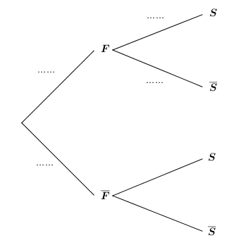
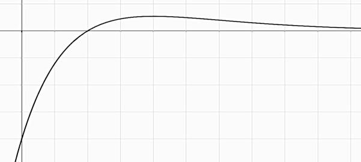

# spe-mathematiques-2022-metropole-1-sujet-officiel

> Source : `../../../pdf_version/11_maths/2022/spe-mathematiques-2022-metropole-1-sujet-officiel.pdf` — conversion Markdown (texte + visuels utiles).
> Stratégie : [STRATEGIE_MARKDOWN.md](../../../STRATEGIE_MARKDOWN.md)

---

## Page 1

BACCALAURÉAT GÉNÉRAL
                       ÉPREUVE D’ENSEIGNEMENT DE SPÉCIALITÉ

                                       SESSION 2022

                               MATHÉMATIQUES

                                 Mercredi 11 mai 2022

                                 Durée de l’épreuve : 4 heures

               L’usage de la calculatrice avec mode examen actif est autorisé.
            L’usage de la calculatrice sans mémoire, « type collège » est autorisé.

                Dès que ce sujet vous est remis, assurez-vous qu’il est complet.
                     Ce sujet comporte 5 pages numérotées de 1/5 à 5/5.

Le sujet propose 4 exercices.
Le candidat choisit 3 exercices parmi les 4 exercices et ne doit traiter que ces 3 exercices.

Chaque exercice est noté sur 7 points (le total sera ramené sur 20 points).
Les traces de recherche, même incomplètes ou infructueuses, seront prises en compte.

22 – MATJ1ME1                                                                  page 1 /5

---

## Page 2

Exercice 1 (7 points)                                              Thèmes : fonction exponentielle, suites.

Dans le cadre d’un essai clinique, on envisage deux protocoles de traitement d’une maladie.
L’objectif decet exercice est d’étudier, pour ces deux protocoles, l’évolution de la quantité de
médicament présente dans le sang d’un patient en fonction du temps.

Les parties A et B sont indépendantes.

Partie A : Etude du premier protocole

Le premier protocole consiste à faire absorber un médicament, sous forme de comprimé, au patient.
On modélise la quantité de médicament présente dans le sang du patient, exprimée en mg, par la
fonction 𝑓 définie sur l’intervalle [0; 10] par 𝑓(𝑡) = 3𝑡𝑒 −0,5𝑡+1 , où 𝑡 désigne le temps, exprimé en
heure, écoulé depuis la prise du comprimé.

1. a. On admet que la fonction 𝑓 est dérivable sur l’intervalle [0; 10] et on note 𝑓′ sa fonction dérivée.
      Montrer que, pour tout nombre réel 𝑡 de [0; 10], on a : 𝑓 ′ (𝑡) = 3(−0,5𝑡 + 1)𝑒 −0,5𝑡+1 .
   b. En déduire le tableau de variations de la fonction 𝑓 sur l’intervalle [0; 10].
   c. Selon cette modélisation, au bout de combien de temps la quantité de médicament présente dans
      le sang du patient sera-t-elle maximale ? Quelle est alors cette quantité maximale ?

2. a. Montrer que l’équation 𝑓(𝑡) = 5 admet une unique solution sur l’intervalle [0; 2], notée 𝛼, dont
   on donnera une valeur approchée à 10−2 près.
On admet que l’équation 𝑓(𝑡) = 5 admet une unique solution sur l’intervalle [2; 10], notée 𝛽, et qu’une
valeur approchée de 𝛽 à 10−2 près est 3,46.
   b. On considère que ce traitement est efficace lorsque la quantité de médicament présente dans le
      sang du patient est supérieure ou égale à 5 mg.
      Déterminer, à la minute près, la durée d’efficacité du médicament dans le cas de ce protocole.

Partie B : Etude du deuxième protocole

Le deuxième protocole consiste à injecter initialement au patient, par piqûre intraveineuse, une dose de
2 mg de médicament puis à réinjecter toutes les heures une dose de 1,8 mg.
On suppose que le médicament se diffuse instantanément dans le sang et qu’il est ensuite
progressivement éliminé.
On estime que lorsqu’une heure s’est écoulée après une injection, la quantité de médicament dans le
sang a diminué de 30 % par rapport à la quantité présente immédiatement après cette injection.

On modélise cette situation à l’aide de la suite (𝑢𝑛 ) où, pour tout entier naturel 𝑛, 𝑢𝑛 désigne la
quantité de médicament, exprimée en mg, présente dans le sang du patient immédiatement après
l’injection de la 𝑛-ème heure. On a donc 𝑢0 = 2.

1. Calculer, selon cette modélisation, la quantité 𝑢1 de médicament (en mg) présente dans le sang du
   patient immédiatement après l’injection de la première heure.

2. Justifier que, pour tout entier naturel 𝑛, on a : 𝑢𝑛+1 = 0,7𝑢𝑛 + 1,8.

22 – MATJ1ME1                                                                           page 2 /5

---

## Page 3

3. a. Montrer par récurrence que, pour tout entier naturel 𝑛, on a : 𝑢𝑛 ≤ 𝑢𝑛+1 < 6.
   b. En déduire que la suite (𝑢𝑛 ) est convergente. On note ℓ sa limite.
   c. Déterminer la valeur de ℓ. Interpréter cette valeur dans le contexte de l’exercice.

4. On considère la suite (𝑣𝑛 ) définie, pour tout entier naturel 𝑛, par 𝑣𝑛 = 6 − 𝑢𝑛 .
   a. Montrer que la suite (𝑣𝑛 ) est une suite géométrique de raison 0,7 dont on précisera le premier
      terme.

   b. Déterminer l’expression de 𝑣𝑛 en fonction de 𝑛, puis de 𝑢𝑛 en fonction de 𝑛.
   c. Avec ce protocole, on arrête les injections lorsque la quantité de médicament présente dans le
      sang du patient est supérieure ou égale à 5,5 mg.
      Déterminer, en détaillant les calculs, le nombre d’injections réalisées en appliquant ce protocole.

Exercice 2 (7 points)                                                     Thème : géométrie dans l’espace
Dans l’espace rapporté à un repère orthonormé (𝑂; 𝑖⃗, 𝑗⃗, 𝑘⃗⃗), on considère :
• le point 𝐴 de coordonnées (−1; 1; 3),
                                                           𝑥 = 1 + 2𝑡
• la droite 𝒟 dont une représentation paramétrique est : { 𝑦 = 2 − 𝑡 , 𝑡 ∈ ℝ.
                                                           𝑧 = 2 + 2𝑡
On admet que le point 𝐴 n’appartient pas à la droite 𝒟.
1. a. Donner les coordonnées d’un vecteur directeur 𝑢
                                                    ⃗⃗ de la droite 𝒟.
   b. Montrer que le point 𝐵(−1; 3; 0) appartient à la droite 𝒟.
   c. Calculer le produit scalaire ⃗⃗⃗⃗⃗⃗
                                   𝐴𝐵. 𝑢  ⃗⃗.
2. On note 𝒫 le plan passant par le point 𝐴 et orthogonal à la droite 𝒟, et on appelle 𝐻 le point
   d’intersection du plan 𝒫 et de la droite 𝒟. Ainsi, 𝐻 est le projeté orthogonal de 𝐴 sur la droite 𝒟.
   a. Montrer que le plan 𝒫 admet pour équation cartésienne : 2𝑥 − 𝑦 + 2𝑧 − 3 = 0.
                                                          7 19 16
   b. En déduire que le point 𝐻 a pour coordonnées ( ;            ; ).
                                                          9   9    9
   c. Calculer la longueur 𝐴𝐻. On donnera une valeur exacte.
3. Dans cette question, on se propose de retrouver les coordonnées du point 𝐻, projeté orthogonal du
   point 𝐴 sur la droite 𝒟, par une autre méthode.
   On rappelle que le point 𝐵(−1; 3; 0) appartient à la droite 𝒟 et que le vecteur 𝑢
                                                                                   ⃗⃗ est un vecteur
   directeur de la droite 𝒟.
   a. Justifier qu’il existe un nombre réel 𝑘 tel que ⃗⃗⃗⃗⃗⃗⃗
                                                      𝐻𝐵 = 𝑘𝑢 ⃗⃗.
                          ⃗⃗⃗⃗⃗⃗.𝑢
                          𝐴𝐵     ⃗⃗
   b. Montrer que 𝑘 = ‖𝑢⃗⃗‖2 .

   c. Calculer la valeur du nombre réel 𝑘 et retrouver les coordonnées du point 𝐻.
                                                                                                          8
4. On considère un point 𝐶 appartenant au plan 𝒫 tel que le volume du tétraèdre 𝐴𝐵𝐶𝐻 soit égal à .
                                                                                                9
Calculer l’aire du triangle 𝐴𝐶𝐻.
                                                             1
On rappelle que le volume d’un tétraèdre est donné par : 𝑉 = × ℬ × ℎ où ℬ désigne l’aire d’une base
                                                             3
et ℎ la hauteur relative à cette base.

22 – MATJ1ME1                                                                           page 3 /5

---

## Page 4

Exercice 3 (7 points)                                                                   Thème : probabilités
Le directeur d’une grande entreprise a proposé à l’ensemble de ses salariés un stage de formation à
l’utilisation d’un nouveau logiciel.
Ce stage a été suivi par 25 % des salariés.

1. Dans cette entreprise, 52 % des salariés sont des femmes, parmi lesquelles 40 % ont suivi le stage.
On interroge au hasard un salarié de l’entreprise et on considère les événements :
   •    𝐹 : « le salarié interrogé est une femme »,
   •    𝑆 : « le salarié interrogé a suivi le stage ».
𝐹̅ et 𝑆̅ désignent respectivement les événements contraires des événements 𝐹 et 𝑆.
   a. Donner la probabilité de l’événement 𝑆.                                                                  𝑆
   b. Recopier et compléter les pointillés de l’arbre pondéré ci-contre sur
                                                                                                𝐹
      les quatre branches indiquées.
   c. Démontrer que la probabilité que la personne interrogée soit une                                         𝑆̅
      femme ayant suivi le stage est égale à 0,208.
   d. On sait que la personne interrogée a suivi le stage. Quelle est la
      probabilité que ce soit une femme ?                                                                      𝑆

   e. Le directeur affirme que, parmi les hommes salariés de l’entreprise,                      𝐹̅
      moins de 10 % ont suivi le stage.
      Justifier l’affirmation du directeur.                                                                    𝑆̅

2. On note 𝑋 la variable aléatoire qui à un échantillon de 20 salariés de cette entreprise choisis au
   hasard associe le nombre de salariés de cet échantillon ayant suivi le stage. On suppose que l’effectif
   des salariés de l’entreprise est suffisamment important pour assimiler ce choix à un tirage avec
   remise.
   a. Déterminer, en justifiant, la loi de probabilité suivie par la variable aléatoire 𝑋.
   b. Déterminer, à 10−3 près, la probabilité que 5 salariés dans un échantillon de 20 aient suivi le
      stage.
                                                                           def proba(k):
   c. Le programme ci-contre, écrit en langage Python, utilise la
                                                                                 P=0
      fonction binomiale(𝒊, 𝒏, 𝒑) créée pour l’occasion qui renvoie              for i in range(0,k+1):
       la valeur de la probabilité 𝑃(𝑋 = 𝑖) dans le cas où la variable               P=P+binomiale(i,20,0.25)
       aléatoire 𝑋 suit une loi binomiale de paramètres 𝑛 et 𝑝.                  return P

       Déterminer, à 10−3 près, la valeur renvoyée par ce programme lorsque l’on saisit proba(5) dans la
       console Python. Interpréter cette valeur dans le contexte de l’exercice.
   d. Déterminer, à 10−3 près, la probabilité qu’au moins 6 salariés dans un échantillon de 20 aient suivi
      le stage.
3. Cette question est indépendante des questions 1 et 2.
Pour inciter les salariés à suivre le stage, l’entreprise avait décidé d’augmenter les salaires des salariés
ayant suivi le stage de 5%, contre 2% d’augmentation pour les salariés n’ayant pas suivi le stage.
Quel est le pourcentage moyen d’augmentation des salaires de cette entreprise dans ces conditions ?

22 – MATJ1ME1                                                                                page 4 /5

---

## Page 5

Exercice 4 (7 points)                                                                  Thème : fonctions numériques
Cet exercice est un questionnaire à choix multiple.
Pour chaque question, une seule des quatre réponses proposées est exacte. Le candidat indiquera sur sa
copie le numéro de la question et la réponse choisie. Aucune justification n’est demandée.
Une réponse fausse, une réponse multiple ou l’absence de réponse à une question ne rapporte ni n’enlève
de point.
Les six questions sont indépendantes.
                                                                                   −2𝑥 2 +3𝑥−1
1. La courbe représentative de la fonction 𝑓 définie sur ℝ par 𝑓(𝑥) =                             admet pour asymptote
                                                                                       𝑥 2 +1
   la droite d’équation :
 a. 𝑥 = −2 ;                                             b. 𝑦 = −1 ;

 c. 𝑦 = −2 ;                                             d. 𝑦 = 0 .
                                                     2
2. Soit 𝑓 la fonction définie sur ℝ par 𝑓(𝑥) = 𝑥𝑒 𝑥 .
   La primitive 𝐹 de 𝑓 sur ℝ qui vérifie 𝐹(0) = 1 est définie par :
              𝑥2                                                       1       2
 a. 𝐹(𝑥) =
                     2
                   𝑒𝑥 ;                                  b. 𝐹(𝑥) = 𝑒 𝑥 ;
              2                                                        2

                           2                                           1       2       1
 c. 𝐹(𝑥) = (1 + 2𝑥 2 )𝑒 𝑥 ;                              d. 𝐹(𝑥) = 𝑒 𝑥 + .
                                                                       2               2

3. On donne ci-dessous la représentation graphique 𝒞𝑓′ de la fonction dérivée 𝑓′ d’une fonction 𝑓
   définie sur ℝ.
 On peut affirmer que la fonction 𝑓 est :                   1

 a. concave sur ]0; +∞[ ;                                   O      1       2

 b. convexe sur ]0; +∞[ ;
                                                                𝒞𝑓′
 c. convexe sur [0; 2] ;

 d. convexe sur [2; +∞[.
                                                                                   2
4. Parmi les primitives de la fonction 𝑓 définie sur ℝ par 𝑓(𝑥) = 3𝑒 −𝑥 + 2 :
 a. toutes sont croissantes sur ℝ ;                      b. toutes sont décroissantes sur ℝ ;
 c. certaines sont croissantes sur ℝ et d’autres         d. toutes sont croissantes sur ]−∞; 0] et
 décroissantes sur ℝ ;                                   décroissantes sur [0; +∞[.
                                                                                                 2ln𝑥
5. La limite en +∞ de la fonction 𝑓 définie sur l’intervalle ]0 ; +∞[ par 𝑓(𝑥) =                          est égale à :
                                                                                                3𝑥 2 +1
      2                                                  c. −∞ ;                                d. 0 .
 a.       ;                    b. +∞ ;
      3

6. L’équation 𝑒 2𝑥 + 𝑒 𝑥 − 12 = 0 admet dans ℝ :
 a. trois solutions ;          b. deux solutions ;         c. une seule solution ;                  d. aucune solution.

22 – MATJ1ME1                                                                                             page 5 /5

