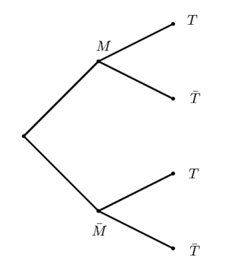
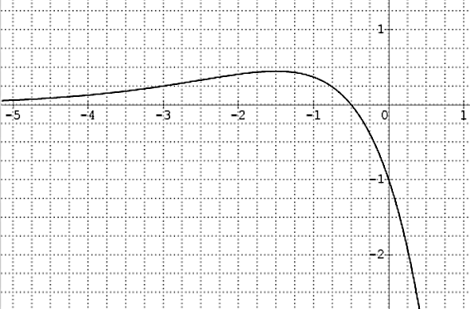
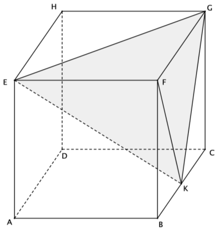
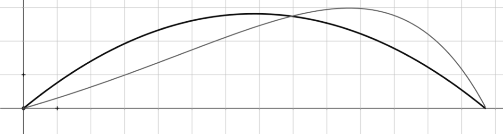
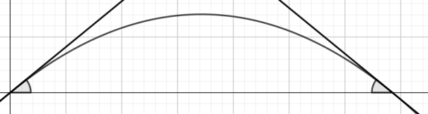
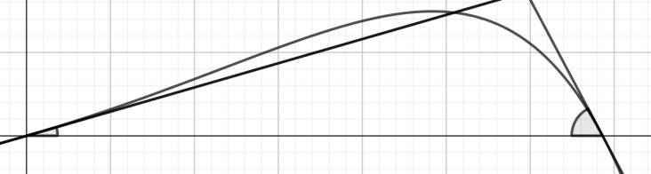

# spe-mathematiques-2022-metropole-2-sujet-officiel

> Source : `../../../pdf_version/11_maths/2022/spe-mathematiques-2022-metropole-2-sujet-officiel.pdf` — conversion Markdown (texte + visuels utiles).
> Stratégie : [STRATEGIE_MARKDOWN.md](../../../STRATEGIE_MARKDOWN.md)

---

## Page 1

BACCALAURÉAT GÉNÉRAL
                       ÉPREUVE D’ENSEIGNEMENT DE SPÉCIALITÉ

                                      SESSION 2022

                               MATHÉMATIQUES

                                    Jeudi 12 mai 2022

                                Durée de l’épreuve : 4 heures

              L’usage de la calculatrice avec mode examen actif est autorisé.
           L’usage de la calculatrice sans mémoire, « type collège » est autorisé.

                Dès que ce sujet vous est remis, assurez-vous qu’il est complet.
                     Ce sujet comporte 7 pages numérotées de 1/7 à 7/7.

Le sujet propose 4 exercices.
Le candidat choisit 3 exercices parmi les 4 exercices et ne doit traiter que ces 3 exercices

Chaque exercice est noté sur 7 points (le total sera ramené sur 20 points).
Les traces de recherche, même incomplètes ou infructueuses, seront prises en compte

22 – MATJ2ME1                                                             page 1 / 7

---

## Page 2

Exercice 1 (7 points)                                                               Thème : probabilités
Le coyote est un animal sauvage proche du loup, qui vit en Amérique du Nord.
Dans l’état d’Oklahoma, aux États-Unis, 70 % des coyotes sont touchés par une maladie appelée
ehrlichiose.
Il existe un test aidant à la détection de cette maladie. Lorsque ce test est appliqué à un coyote, son
résultat est soit positif, soit négatif, et on sait que:
   •   Si le coyote est malade, le test est positif dans 97 % des cas.
   •   Si le coyote n’est pas malade, le test est négatif dans 95% des cas.
                                             Partie A
Des vétérinaires capturent un coyote d’Oklahoma au hasard et lui font subir un test pour l’ehrlichiose.
On considère les événements suivants :
   •  𝑀 : « le coyote est malade » ;
   •  𝑇 : « le test du coyote est positif ».
        ̅ et 𝑇̅ respectivement les événements contraires de 𝑀 et 𝑇.
On note 𝑀
   1. Recopier et compléter l’arbre pondéré ci-dessous qui modélise la situation.

                                             𝑀
                                                 …      𝑇

                                      …
                                                 …
                                                        𝑇̅

                                                 …      𝑇
                                      …
                                             ̅
                                             𝑀   …      𝑇̅

   2. Déterminer la probabilité que le coyote soit malade et que son test soit positif.
   3. Démontrer que la probabilité de T est égale à 0,694.
   4. On appelle « valeur prédictive positive du test » la probabilité que le coyote soit effectivement
      malade sachant que son test est positif.
      Calculer la valeur prédictive positive du test. On arrondira le résultat au millième.
   5. a. Par analogie avec la question précédente, proposer une définition de la « valeur prédictive
      négative du test », et calculer cette valeur en arrondissant au millième.
      b. Comparer les valeurs prédictives positive et négative du test, et interpréter.
                                               Partie B
On rappelle que la probabilité qu’un coyote capturé au hasard présente un test positif est de 0,694.
   1. Lorsqu’on capture au hasard cinq coyotes, on assimile ce choix à un tirage avec remise.
       On note X la variable aléatoire qui à un échantillon de cinq coyotes capturés au hasard associe
       le nombre de coyotes dans cet échantillon ayant un test positif.
       a. Quelle est la loi de probabilité suivie par X ? Justifier et préciser ses paramètres.
       b. Calculer la probabilité que dans un échantillon de cinq coyotes capturés au hasard, un seul
          ait un test positif. On arrondira le résultat au centième.
       c. Un vétérinaire affirme qu’il y a plus d’une chance sur deux qu’au moins quatre coyotes sur
          cinq aient un test positif : cette affirmation est-elle vraie ? Justifier la réponse.
   2. Pour tester des médicaments, les vétérinaires ont besoin de disposer d’un coyote présentant
      un test positif. Combien doivent-ils capturer de coyotes pour que la probabilité qu’au moins
      l’un d’entre eux présente un test positif soit supérieure à 0,99 ?

22 – MATJ2ME1                                                                      page 2 / 7

---

## Page 3

Exercice 2 (7 points)                                         Thèmes : fonctions numériques et suites
Cet exercice est un questionnaire à choix multiples. Pour chacune des questions suivantes, une seule des
quatre réponses proposées est exacte. Une réponse fausse, une réponse multiple ou l’absence de
réponse à une question ne rapporte ni n’enlève de point.
Pour répondre, indiquer sur la copie le numéro de la question et la lettre de la réponse choisie. Aucune
justification n’est demandée.
Pour les questions 1 à 3 ci-dessous, on considère une fonction 𝑓 définie et deux fois dérivable sur ℝ.
La courbe de sa fonction dérivée 𝑓′ est donnée ci-dessous.
                                            3
On admet que 𝑓′ admet un maximum en − et que sa courbe coupe l'axe des abscisses au point de
                                                     2
                  1
coordonnées (− ; 0).
                  2
                                                              On rappelle que la courbe ci-dessous
                                                              représente la fonction dérivée 𝒇’ de 𝒇.

Question 1 :
                                      3
a. La fonction 𝑓 admet un maximum en − ;
                                             2
                                                 1
b. La fonction 𝑓 admet un maximum en − ;
                                                 2
                                             1
c. La fonction 𝑓 admet un minimum en − ;
                                             2

d. Au point d’abscisse −1, la courbe de la
fonction 𝑓 admet une tangente horizontale.

Question 2 :
                                         3                                                            1
a. La fonction 𝑓 est convexe sur ] − ∞; − [ ;            b. La fonction 𝑓 est convexe sur ] − ∞; − [ ;
                                             2                                                        2

                                                                                                      1
c. La courbe 𝒞𝑓 représentant la fonction 𝑓               d. La fonction 𝑓 est concave sur ] − ∞; − [ .
                                                                                                      2
   n’admet pas de point d’inflexion ;

Question 3 :
La dérivée seconde 𝑓′′ de la fonction 𝑓 vérifie :
                                    −1
   a. 𝑓 ′′ (𝑥) ≥ 0 pour 𝑥 ∈ ]−∞;        [;               b. 𝑓 ′′ (𝑥) ≥ 0 pour 𝑥 ∈ [−2; −1] ;
                                    2

            −3
   c. 𝑓 ′′ ( ) = 0 ;                                     d. 𝑓 ′′ (−3) = 0.
             2

Question 4 : On considère trois suites (𝑢𝑛 ), (𝑣𝑛 ) et (𝑤𝑛 ).
On sait que, pour tout entier naturel 𝑛, on a : 𝑢𝑛 ≤ 𝑣𝑛 ≤ 𝑤𝑛 et de plus : lim 𝑢𝑛 = 1 et lim 𝑤𝑛 = 3.
                                                                               𝑛→+∞               𝑛→+∞
On peut alors affirmer que :
a. La suite (𝑣𝑛 ) converge ;                                 b. Si la suite (𝑢𝑛 ) est croissante alors la suite
                                                             (𝑣𝑛 ) est minorée par 𝑢0 ;
c. 1 ≤ 𝑣0 ≤ 3 ;                                              d. La suite (𝑣𝑛 ) diverge.

22 – MATJ2ME1                                                                            page 3 / 7

---

## Page 4

Question 5 :
                                                                                        1
On considère une suite (𝑢𝑛 ) telle que, pour tout entier naturel 𝑛 non nul : 𝑢𝑛 ≤ 𝑢𝑛+1 ≤ .
                                                                                        𝑛
On peut alors affirmer que :
a. La suite (𝑢𝑛 ) diverge ;                                b. La suite (𝑢𝑛 ) converge ;
c. lim 𝑢𝑛 = 0 ;                                            d. lim 𝑢𝑛 = 1 .
  𝑛→+∞                                                        𝑛→+∞

Question 6 :
 On considère (𝑢𝑛 ) une suite réelle telle que pour tout entier naturel 𝑛, on a : 𝑛 < 𝑢𝑛 < 𝑛 + 1 .
 On peut affirmer que :
 a. Il existe un entier naturel 𝑁 tel que 𝑢𝑁 est un entier ;              b. La suite (𝑢𝑛 ) est croissante ;
 c. La suite (𝑢𝑛 ) est convergente ;                                      d. La suite (𝑢𝑛 ) n’a pas de limite.

Exercice 3 (7 points)                                                      Thème : géométrie dans l’espace
On considère un cube 𝐴𝐵𝐶𝐷𝐸𝐹𝐺𝐻 et on appelle 𝐾 le milieu
du segment [𝐵𝐶].
                               ⃗⃗⃗⃗⃗ , 𝐴𝐷
On se place dans le repère (𝐴; 𝐴𝐵      ⃗⃗⃗⃗⃗ , 𝐴𝐸
                                               ⃗⃗⃗⃗⃗ ) et on considère
le tétraèdre 𝐸𝐹𝐺𝐾.
On rappelle que le volume d’un tétraèdre est donné par :
                             1
                        𝑉 = ×ℬ×ℎ
                             3
où ℬ désigne l’aire d’une base et ℎ la hauteur relative à cette base.
   1. Préciser les coordonnées des points 𝐸, 𝐹, 𝐺 et 𝐾 .
                                  2
   2. Montrer que le vecteur 𝑛⃗ (−2) est orthogonal au plan (𝐸𝐺𝐾).
                                  1
   3. Démontrer que le plan (𝐸𝐺𝐾) admet pour équation cartésienne : 2𝑥 − 2𝑦 + 𝑧 − 1 = 0.
   4. Déterminer une représentation paramétrique de la droite (d) orthogonale au plan (𝐸𝐺𝐾)
      passant par 𝐹.
                                                                                                   5 4 7
   5. Montrer que le projeté orthogonal 𝐿 de 𝐹 sur le plan (𝐸𝐺𝐾) a pour coordonnées ( ; ; ).
                                                                                                    9 9 9
                                                     2
   6. Justifier que la longueur 𝐿𝐹 est égale à .
                                                     3
                                                                                                          1
   7. Calculer l’aire du triangle 𝐸𝐹𝐺. En déduire que le volume du tétraèdre 𝐸𝐹𝐺𝐾 est égal à                   .
                                                                                                          6

   8. Déduire des questions précédentes l’aire du triangle 𝐸𝐺𝐾.
   9. On considère les points P milieu du segment [𝐸𝐺], 𝑀 milieu du segment [𝐸𝐾] et 𝑁 milieu du
      segment [𝐺𝐾]. Déterminer le volume du tétraèdre 𝐹P𝑀𝑁.

22 – MATJ2ME1                                                                             page 4 / 7

---

## Page 5

Exercice 4 (7 points)                             Thèmes : fonctions numériques, fonction exponentielle
                                 Partie A : études de deux fonctions
On considère les deux fonctions 𝑓 et 𝑔 définies sur l’intervalle [0 ; +∞[ par :
                  𝑓(𝑥) = 0,06 (−𝑥 2 + 13,7𝑥) et 𝑔(𝑥) = (−0,15𝑥 + 2,2)𝑒 0,2𝑥 − 2,2 .
On admet que les fonctions 𝑓 et 𝑔 sont dérivables et on note 𝑓′ et 𝑔′ leurs fonctions dérivées
respectives.
1. On donne le tableau de variations complet de la fonction 𝑓 sur l’intervalle [0 ; +∞[.
  a. Justifier la limite de 𝑓 en +∞.                          𝑥       0           6,85             +∞
  b. Justifier les variations de la fonction 𝑓.                                   𝑓(6,85)
                                                            𝑓(𝑥)
  c. Résoudre l’équation 𝑓(𝑥) = 0.                                    0                            −∞
2. a. Déterminer la limite de 𝑔 en +∞.
  b. Démontrer que, pour tout réel 𝑥 appartenant à [0 ; +∞[ on a : 𝑔′ (𝑥) = (−0,03𝑥 + 0,29)𝑒 0,2𝑥 .
  c. Étudier les variations de la fonction 𝑔 et dresser son tableau de variations sur [0 ; +∞[.
     Préciser une valeur approchée à 10−2 près du maximum de 𝑔.
  d. Montrer que l'équation 𝑔(𝑥) = 0 admet une unique solution non nulle et déterminer, à
     10−2 près, une valeur approchée de cette solution.

                                Partie B : trajectoires d’une balle de golf

Pour frapper la balle, un joueur de golf utilise un instrument appelé « club » de golf.
On souhaite exploiter les fonctions 𝑓 et 𝑔 étudiées en Partie A pour modéliser de deux façons
différentes la trajectoire d'une balle de golf. On suppose que le terrain est parfaitement plat.
On admettra ici que 13,7 est la valeur qui annule la fonction 𝑓 et une approximation de la valeur qui
annule la fonction 𝑔.
On donne ci-dessous les représentations graphiques de 𝑓 et 𝑔 sur l’intervalle [0; 13,7] .

                                                                                      𝒞𝑔
                         𝒞𝑓

              1

             O                                                                              13,7
                     1

Pour 𝑥 représentant la distance horizontale parcourue par la balle en dizaine de yards après la frappe,
(avec 0 ≤ 𝑥 ≤ 13,7), 𝑓(𝑥) (ou 𝑔(𝑥) selon le modèle) représente la hauteur correspondante de la balle
par rapport au sol, en dizaine de yards (1 yard correspond à environ 0,914 mètre).

22 – MATJ2ME1                                                                        page 5 / 7

---

## Page 6

On appelle « angle de décollage » de la balle, l’angle entre l’axe des abscisses et la tangente à la courbe
(𝐶𝑓 ou 𝐶𝑔 selon le modèle) en son point d’abscisse 0. Une mesure de l’angle de décollage de la balle est
un nombre réel 𝑑 tel que tan(𝑑) est égal au coefficient directeur de cette tangente.
De même, on appelle « angle d’atterrissage » de la balle, l’angle entre l’axe des abscisses et la tangente
à la courbe (𝐶𝑓 ou 𝐶𝑔 selon le modèle) en son point d’abscisse 13,7. Une mesure de l’angle d’atterrissage
de la balle est un nombre réel 𝑎 tel que tan(𝑎) est égal à l’opposé du coefficient directeur de cette
tangente.
Tous les angles sont mesurés en degré.

 Le schéma illustre les angles de décollage et Le schéma illustre les angles de décollage et
 d’atterrissage associés à la courbe 𝐶𝑓 .      d’atterrissage associés à la courbe 𝐶𝑔 .

     𝑑                                 𝑎   13,7
 0                                                       𝑑                                       𝑎
                                                  0                                                   13,7

1. Première modélisation : on rappelle qu’ici, l’unité étant la dizaine de yards, 𝑥 représente la distance
   horizontale parcourue par la balle après la frappe et 𝑓(𝑥) la hauteur correspondante de la balle.
   Selon ce modèle :
  a. Quelle est la hauteur maximale, en yard, atteinte par la balle au cours de sa trajectoire ?
  b. Vérifier que 𝑓′(0) = 0,822.
  c. Donner une mesure en degré de l’angle de décollage de la balle, arrondie au dixième. (On
       pourra éventuellement utiliser le tableau ci-dessous).
  d. Quelle propriété graphique de la courbe 𝐶𝑓 permet de justifier que les angles de décollage et
       d’atterrissage de la balle sont égaux ?
2. Seconde modélisation : on rappelle qu’ici, l’unité étant la dizaine de yards, 𝑥 représente la distance
   horizontale parcourue par la balle après la frappe et 𝑔(𝑥) la hauteur correspondante de la balle.
   Selon ce modèle :
  a. Quelle est la hauteur maximale, en yard, atteinte par la balle au cours de sa trajectoire ?
 On précise que 𝑔′(0) = 0,29 et 𝑔′(13,7) ≈ −1,87.
 b. Donner une mesure en degré de l’angle de décollage de la balle, arrondie au dixième. (On pourra
    éventuellement utiliser le tableau ci-dessous).
  c. Justifier que 62 est une valeur approchée, arrondie à l’unité près, d’une mesure en degré de
     l’angle d’atterrissage de la balle.
Tableau : extrait d’une feuille de calcul donnant une mesure en degré d’un angle quand on connait sa
tangente :

22 – MATJ2ME1                                                                      page 6 / 7

---

## Page 7

Partie C : interrogation des modèles
À partir d’un grand nombre d’observations des performances de joueurs professionnels, on a obtenu
les résultats moyens suivants :
 Angle de décollage en    Hauteur maximale en     Angle d’atterrissage en   Distance horizontale
        degré                     yard                    degré             en yard au point de
                                                                                   chute
           24                      32                       52                      137
Quel modèle, parmi les deux étudiés précédemment, semble le plus adapté pour décrire la frappe de
la balle par un joueur professionnel ? La réponse sera justifiée.

22 – MATJ2ME1                                                                page 7 / 7
