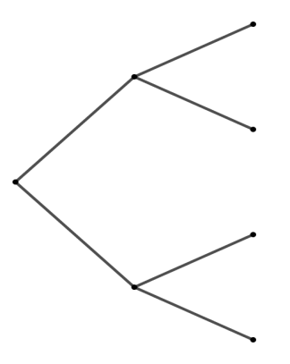
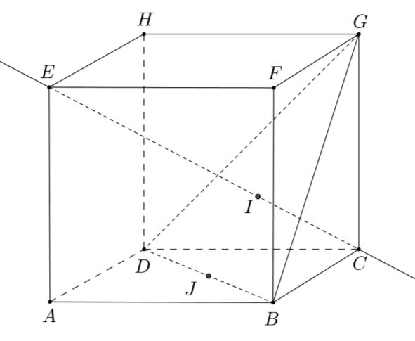

# spe-mathematiques-2023-metropole-1-sujet-officiel

> Source : `../../../pdf_version/11_maths/2023/spe-mathematiques-2023-metropole-1-sujet-officiel.pdf` — conversion Markdown (texte + visuels utiles).
> Stratégie : [STRATEGIE_MARKDOWN.md](../../../STRATEGIE_MARKDOWN.md)

---

## Page 1

BACCALAURÉAT GÉNÉRAL

                  ÉPREUVE D’ENSEIGNEMENT DE SPÉCIALITÉ

                                  SESSION 2023

                          MATHÉMATIQUES

                              Lundi 20 mars 2023

                            Durée de l’épreuve : 4 heures

           L’usage de la calculatrice avec mode examen actif est autorisé.
        L’usage de la calculatrice sans mémoire « type collège » est autorisé.

          Dès que ce sujet vous est remis, assurez-vous qu’il est complet.
                Ce sujet comporte 5 pages numérotées de 1 à 5.

Le candidat doit traiter les quatre exercices proposés.

Le candidat est invité à faire figurer sur la copie toute trace de recherche, même
incomplète ou non fructueuse, qu’il aura développée.

La qualité de la rédaction, la clarté et la précision des raisonnements seront prises en
compte dans l’appréciation de la copie. Les traces de recherche, même incomplètes
ou infructueuses, seront valorisées.

   23-MATJ1ME1                                                            Page 1 sur 5

---

## Page 2

Exercice 1 (5 points)

Cet exercice est un questionnaire à choix multiple.
Pour chaque question, une seule des quatre réponses proposées est exacte. Le
candidat indiquera sur sa copie le numéro de la question et la réponse choisie.
Aucune justification n’est demandée.
Aucun point n’est enlevé en l’absence de réponse ou en cas de réponse inexacte.
Les questions sont indépendantes.

Un technicien contrôle les machines équipant une grande entreprise. Toutes ces
machines sont identiques.
On sait que :
   •   20% des machines sont sous garantie ;
   •   0,2% des machines sont à la fois défectueuses et sous garantie ;
   •   8,2% des machines sont défectueuses.
Le technicien teste une machine au hasard.
                                                                             𝐺
On considère les événements suivants :
   •   𝐺 : « la machine est sous garantie » ;
   •   𝐷 : « la machine est défectueuse » ;
   •   𝐺 et 𝐷 désignent respectivement les
       événements contraires de 𝐺 et 𝐷.

Pour répondre aux questions 1 à 3, on pourra s’aider de l’arbre
proposé ci-contre.

  1. La probabilité 𝑝𝐺 (𝐷) de l’événement 𝐷 sachant que 𝐺 est réalisé est égale à :
           a. 0,002                               b. 0,01
           c. 0,024                               d. 0,2

  2. La probabilité 𝑝(𝐺 ∩ 𝐷) est égale à :
           a. 0,01                                b. 0,08
           c. 0,1                                 d. 0,21

  3. La machine est défectueuse. La probabilité qu’elle soit sous garantie est
     environ égale, à 10−3 près, à :
           a. 0,01                                b. 0,024
           c. 0,082                               d. 0,1

   23-MATJ1ME1                                                            Page 2 sur 5

---

## Page 3

Pour les questions 4 et 5, on choisit au hasard et de façon indépendante 𝑛 machines
de l’entreprise, où 𝑛 désigne un entier naturel non nul. On assimile ce choix à un tirage
avec remise, et on désigne par 𝑋 la variable aléatoire qui associe à chaque lot de 𝑛
machines le nombre de machines défectueuses dans ce lot.
On admet que 𝑋 suit la loi binomiale de paramètres 𝑛 et 𝑝 = 0,082.

  4. Dans cette question, on prend 𝑛 = 50.
      La valeur de la probabilité 𝑝(𝑋 > 2), arrondie au millième, est de :
          a. 0,136                                 b. 0,789
          c. 0,864                                 d. 0,924
  5. On considère un entier 𝑛 pour lequel la probabilité que toutes les machines
     d’un lot de taille 𝑛 fonctionnent correctement est supérieure à 0,4. La plus
     grande valeur possible pour 𝑛 est égale à :
            a. 5               b. 6               c. 10                       d. 11

Exercice 2 (5 points)
On considère la fonction 𝑓 définie sur ]0 ; +∞[ par 𝑓(𝑥) = 𝑥 2 − 8 ln(𝑥), où ln désigne
la fonction logarithme népérien.
On admet que 𝑓 est dérivable sur ]0 ; +∞[, on note 𝑓′ sa fonction dérivée.

   1. Déterminer lim 𝑓(𝑥).
                   𝑥→0

                                                             ln(𝑥)
   2. On admet que, pour tout 𝑥 > 0, 𝑓(𝑥) = 𝑥 2 (1 − 8               ).
                                                              𝑥2
       En déduire la limite : lim 𝑓(𝑥).
                             𝑥→+∞

                                                              2(𝑥²−4)
   3. Montrer que, pour tout réel 𝑥 de ]0 ; +∞[, 𝑓 ′ (𝑥) =                .
                                                                   𝑥

   4. Étudier les variations de 𝑓 sur ]0 ; +∞[ et dresser son tableau de variations
      complet.
      On précisera la valeur exacte du minimum de 𝑓 sur ]0 ; +∞[ .

   5. Démontrer que, sur l’intervalle ]0 ; 2], l’équation 𝑓(𝑥) = 0 admet une solution
      unique 𝛼 (on ne cherchera pas à déterminer la valeur de 𝛼).

   6. On admet que, sur l’intervalle [2 ; +∞[, l’équation 𝑓(𝑥) = 0 admet une solution
      unique 𝛽 (on ne cherchera pas à déterminer la valeur de 𝛽).
      En déduire le signe de 𝑓 sur l’intervalle ]0 ; +∞[.

    7. Pour tout nombre réel 𝑘, on considère la fonction 𝑔𝑘 définie sur ]0 ; +∞[ par :
                               𝑔𝑘 (𝑥) = 𝑥 2 − 8 ln(𝑥) +𝑘 .
      En s’aidant du tableau de variations de 𝑓, déterminer la plus petite valeur de 𝑘
      pour laquelle la fonction 𝑔𝑘 est positive sur l’intervalle ]0 ; +∞[.

   23-MATJ1ME1                                                                   Page 3 sur 5

---

## Page 4

Exercice 3     (5 points)
Une entreprise a créé une Foire Aux Questions (« FAQ ») sur son site internet.

On étudie le nombre de questions qui y sont posées chaque mois.

Partie A : Première modélisation

Dans cette partie, on admet que, chaque mois :

•   90% des questions déjà posées le mois précédent sont conservées sur la FAQ ;
•   130 nouvelles questions sont ajoutées à la FAQ.

Au cours du premier mois, 300 questions ont été posées.

Pour estimer le nombre de questions, en centaines, présentes sur la FAQ le 𝑛-ième
mois, on modélise la situation ci-dessus à l’aide de la suite (𝑢𝑛 ) définie par :

             𝑢1 = 3 et, pour tout entier naturel 𝑛 ≥ 1, 𝑢𝑛+1 = 0,9 𝑢𝑛 + 1,3.

    1. Calculer 𝑢2 et 𝑢3 et proposer une interprétation dans le contexte de l’exercice.
    2. Montrer par récurrence que pour tout entier naturel 𝑛 ≥ 1 :
                                                 100
                                     𝑢𝑛 = 13 −         × 0,9𝑛 .
                                                  9

    3. En déduire que la suite (𝑢𝑛 ) est croissante.              def seuil(p) :
    4. On considère le programme ci-contre, écrit en                  n=1
       langage Python.                                                u=3
                                                                      while u<=p :
      Déterminer la valeur renvoyée par la saisie de                       n=n+1
      seuil(8.5) et l’interpréter dans le contexte                         u=0.9*u+1.3
      de l’exercice.                                                  return n

Partie B : Une autre modélisation

Dans cette partie, on considère une seconde modélisation à l’aide d’une nouvelle
suite (𝑣𝑛 ) définie pour tout entier naturel 𝑛 ≥ 1 par :
                             𝑣𝑛 = 9 − 6 × e−0,19×(𝑛−1) .

Le terme 𝑣𝑛 est une estimation du nombre de questions, en centaines, présentes le
𝑛-ième mois sur la FAQ.
    1. Préciser les valeurs arrondies au centième de 𝑣1 et 𝑣2 .
    2. Déterminer, en justifiant la réponse, la plus petite valeur de 𝑛 telle que 𝑣𝑛 > 8,5.

    23-MATJ1ME1                                                             Page 4 sur 5

---

## Page 5

Partie C : Comparaison des deux modèles

    1. L’entreprise considère qu’elle doit modifier la présentation de son site lorsque
       plus de 850 questions sont présentes sur la FAQ. Parmi ces deux
       modélisations, laquelle conduit à procéder le plus tôt à cette modification ?
       Justifier votre réponse.
    2. En justifiant la réponse, pour quelle modélisation y a-t-il le plus grand nombre
       de questions sur la FAQ à long terme ?

Exercice 4       (5 points)

On considère le cube 𝐴𝐵𝐶𝐷𝐸𝐹𝐺𝐻
d’arête 1.
On appelle 𝐼 le point d’intersection du
plan (𝐺𝐵𝐷) avec la droite (𝐸𝐶).
L’espace est rapporté au repère
                ⃗⃗⃗⃗⃗⃗ 𝐴𝐷,
orthonormé (𝐴 ; 𝐴𝐵,    ⃗⃗⃗⃗⃗⃗⃗ 𝐴𝐸
                               ⃗⃗⃗⃗⃗ ).

    1. Donner dans ce repère les coordonnées des points 𝐸, 𝐶, 𝐺.
    2. Déterminer une représentation paramétrique de la droite (𝐸𝐶).
    3. Démontrer que la droite (𝐸𝐶) est orthogonale au plan (𝐺𝐵𝐷).
    4. a. Justifier qu’une équation cartésienne du plan (𝐺𝐵𝐷) est : 𝑥 + 𝑦 − 𝑧 − 1 = 0.
                                                          2   2   1
        b. Montrer que le point 𝐼 a pour coordonnées ( ; ; ).
                                                          3   3   3
                                                                                2√3
        c. En déduire que la distance du point 𝐸 au plan (𝐺𝐵𝐷) est égale à         .
                                                                                 3

    5. a. Démontrer que le triangle 𝐵𝐷𝐺 est équilatéral.
        b. Calculer l’aire du triangle 𝐵𝐷𝐺. On pourra utiliser le point 𝐽, milieu du
        segment [𝐵𝐷].
                                                                      1
    6. Justifier que le volume du tétraèdre 𝐸𝐺𝐵𝐷 est égal à .
                                                                      3
                                                                          1
        On rappelle que le volume d’un tétraèdre est donné par : 𝑉 = ℬℎ où ℬ est
                                                                          3
        l’aire d’une base du tétraèdre et ℎ est la hauteur relative à cette base.

   23-MATJ1ME1                                                                Page 5 sur 5

