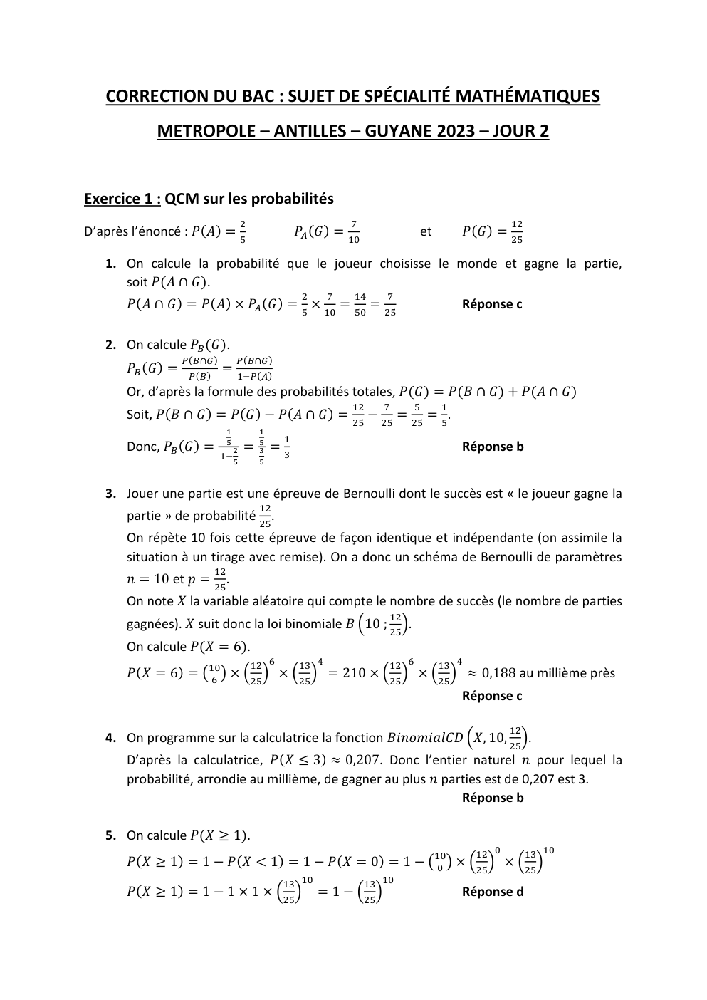

# spe-mathematiques-2023-metropole-2-corrige

> Source : `../../../pdf_version/11_maths/2023/spe-mathematiques-2023-metropole-2-corrige.pdf` — conversion Markdown (texte + visuels).
> Stratégie : [STRATEGIE_MARKDOWN.md](../../../STRATEGIE_MARKDOWN.md)

---

## Page 1

CORRECTION DU BAC : SUJET DE SPÉCIALITÉ MATHÉMATIQUES
            METROPOLE – ANTILLES – GUYANE 2023 – JOUR 2

Exercice 1 : QCM sur les probabilités
                                       2                         7                                     12
D’après l’énoncé : 𝑃(𝐴) = 5                           𝑃𝐴 (𝐺) = 10                   et       𝑃(𝐺) = 25

   1. On calcule la probabilité que le joueur choisisse le monde et gagne la partie,
      soit 𝑃(𝐴 ∩ 𝐺).
                                                       2     7   14     7
       𝑃(𝐴 ∩ 𝐺) = 𝑃(𝐴) × 𝑃𝐴 (𝐺) = 5 × 10 = 50 = 25                                           Réponse c

   2. On calcule 𝑃𝐵 (𝐺).
                  𝑃(𝐵∩𝐺)           𝑃(𝐵∩𝐺)
       𝑃𝐵 (𝐺) =            = 1−𝑃(𝐴)
                   𝑃(𝐵)
       Or, d’après la formule des probabilités totales, 𝑃(𝐺) = 𝑃(𝐵 ∩ 𝐺) + 𝑃(𝐴 ∩ 𝐺)
                                                                 12     7       5        1
       Soit, 𝑃(𝐵 ∩ 𝐺) = 𝑃(𝐺) − 𝑃(𝐴 ∩ 𝐺) = 25 − 25 = 25 = 5.
                               1            1
                               5       5          1
       Donc, 𝑃𝐵 (𝐺) =              2 = 3 =                                                   Réponse b
                           1−              3
                                   5        5

   3. Jouer une partie est une épreuve de Bernoulli dont le succès est « le joueur gagne la
                                            12
       partie » de probabilité 25.
       On répète 10 fois cette épreuve de façon identique et indépendante (on assimile la
       situation à un tirage avec remise). On a donc un schéma de Bernoulli de paramètres
                          12
       𝑛 = 10 et 𝑝 = 25.
       On note 𝑋 la variable aléatoire qui compte le nombre de succès (le nombre de parties
                                                                         12
       gagnées). 𝑋 suit donc la loi binomiale 𝐵 (10 ; 25).
       On calcule 𝑃(𝑋 = 6).
                                           12 6       13 4               12 6            13 4
       𝑃(𝑋 = 6) = (10
                   6
                     ) × (25) × (25) = 210 × (25) × (25) ≈ 0,188 au millième près
                                                                                             Réponse c

                                                                                                       12
   4. On programme sur la calculatrice la fonction 𝐵𝑖𝑛𝑜𝑚𝑖𝑎𝑙𝐶𝐷 (𝑋, 10, 25).
       D’après la calculatrice, 𝑃(𝑋 ≤ 3) ≈ 0,207. Donc l’entier naturel 𝑛 pour lequel la
       probabilité, arrondie au millième, de gagner au plus 𝑛 parties est de 0,207 est 3.
                                                                 Réponse b

   5. On calcule 𝑃(𝑋 ≥ 1).
                                                                                                12 0        13 10
       𝑃(𝑋 ≥ 1) = 1 − 𝑃(𝑋 < 1) = 1 − 𝑃(𝑋 = 0) = 1 − (10
                                                     0
                                                       ) × (25) × (25)
                                                  13 10              13 10
       𝑃(𝑋 ≥ 1) = 1 − 1 × 1 × (25)                         = 1 − (25)                        Réponse d

---

## Page 2

Exercice 2 : Suites
Partie A : Etude d’un premier modèle en laboratoire
   1. Chaque mois, la population d’insectes dans le jardin botanique augmente de 60%, elle
      est donc multipliée par 1,6.
      Ainsi, pour tout entier naturel 𝑛, 𝑢𝑛+1 = 1,6𝑢𝑛 .
      Donc, la suite (𝑢𝑛 ) est une suite géométrique de raison 𝑞 = 1,6 et de premier terme
      𝑢0 = 0,1. Donc, pour tout entier naturel, 𝑢𝑛 = 𝑢0 × 𝑞 𝑛 soit 𝒖𝒏 = 𝟎, 𝟏 × 𝟏, 𝟔𝒏 .

   2.    lim 1,6𝑛 = +∞ car 1,6 > 1. Donc, par produit, 𝐥𝐢𝐦 𝒖𝒏 = +∞
        𝑛→+∞                                                 𝒏→+∞

   3. On cherche 𝑛 tel que 𝑢𝑛 > 0,4. Pour tout entier naturel 𝑛, 𝑢𝑛 > 0,4 ⇔ 0,1 × 1,6𝑛 >
      0,4 ⇔ 1,6𝑛 > 4 ⇔ ln 1,6𝑛 > ln 4 car la fonction logarithme népérien est strictement
      croissante sur ]0; +∞[.
                                       ln 4
        ⇔ 𝑛 ln 1,6 > ln 4 ⇔ 𝑛 > ln 1,6 car 1,6 > 1 donc ln 1,6 > 0

             ln 4
        Or, ln 1,6 ≈ 2,95 donc 𝑛 ≥ 3. Ainsi, le plus petit entier naturel 𝒏 tel que 𝒖𝒏 > 𝟎, 𝟒 est
        3.
   4. D’après la question précédente, la population d’insectes dans le jardin botanique
      dépassera les 0,4 million d’insectes, soit 400 000 insectes au bout de 3 mois. Ainsi,
      selon ce modèle, l’équilibre du milieu naturel sera préservé.
Partie B : Etude d’un second modèle
   1. On calcule 𝑣1 .
      𝑣1 = 1,6𝑣0 − 1,6𝑣02 = 1,6 × 0,1 − 1,6 × 0,12 = 0,144
      Ainsi, au bout d’un mois, il y aura 0,144 million, soit 144 000 insectes dans le jardin
      botanique.

                               1
   2. a. Pour tout 𝑥 ∈ [0 ; 2] , 𝑓(𝑥) = 𝑥 ⇔ 1,6𝑥 − 1,6𝑥 2 − 𝑥 = 0 ⇔ 0,6𝑥 − 1,6𝑥 2 = 0 ⇔
        𝑥(0,6 − 1,6𝑥) = 0 ⇔ 𝑥 = 0 𝑜𝑢 0,6 − 1,6𝑥 = 0 ⇔ 𝑥 = 0 𝑜𝑢 𝑥 = 0,375
               𝑺 = {𝟎 ; 𝟎, 𝟑𝟕𝟓}

        b. Dérivons 𝑓 afin de trouver ses variations.
                                              1
        La fonction 𝑓 est dérivable sur [0; 2] comme fonction polynôme du second degré.
                           1
        Pour tout 𝑥 ∈ [0; 2] , 𝑓 ′ (𝑥) = 1,6 − 3,2𝑥
                           1                                                           1
        Pour tout 𝑥 ∈ [0; 2] , 𝑓 ′ (𝑥) ≥ 0 ⇔ 1,6 − 3,2𝑥 ≥ 0 ⇔ 1,6 ≥ 3,2𝑥 ⇔ 𝑥 ≤ 2.
                                   1                                                        𝟏
        Ainsi, pour tout 𝑥 ∈ [0; 2] , 𝑓 ′ (𝑥) ≥ 0 donc la fonction 𝒇 est croissante sur [𝟎; 𝟐].

---

## Page 3

1
3. a. Montrons par récurrence que pour tout entier naturel 𝑛, 0 ≤ 𝑣𝑛 ≤ 𝑣𝑛+1 ≤ .
                                                                                         2
                                                                  1                          1
   Initialisation : 𝑣0 = 0,1 et 𝑣1 = 0,144 or 0 ≤ 0,1 ≤ 0,144 ≤ 2 donc 0 ≤ 𝑣0 ≤ 𝑣1 ≤ 2.
   La propriété est vraie pour 𝑛 = 0.

                                                                             1
   Hérédité : Supposons que pour un entier naturel 𝑘, 0 ≤ 𝑣𝑘 ≤ 𝑣𝑘+1 ≤ 2 et montrons
                                   1
   qu’alors 0 ≤ 𝑣𝑘+1 ≤ 𝑣𝑘+2 ≤ 2.
                                                           1
   D’après l’hypothèse de récurrence, 0 ≤ 𝑣𝑘 ≤ 𝑣𝑘+1 ≤ 2
                                           1
   La fonction 𝑓 est croissance sur [0; 2] donc elle conserve l’ordre donc, on a :
                                       1
   𝑓(0) ≤ 𝑓(𝑣𝑘 ) ≤ 𝑓(𝑣𝑘+1 ) ≤ 𝑓 (2).
                                                                                     1
   Or, par définition, 𝑓(𝑣𝑘 ) = 𝑣𝑘+1 et 𝑓(𝑣𝑘+1 ) = 𝑣𝑘+2. De plus, 𝑓(0) = 0 et 𝑓 (2) = 0,4
            1                                          1                             1
   et 0,4 ≤ 2. On a donc : 0 ≤ 𝑣𝑘+1 ≤ 𝑣𝑘+2 ≤ 0,4 ≤ 2 soit 0 ≤ 𝑣𝑘+1 ≤ 𝑣𝑘+2 ≤ 2.
   La propriété est héréditaire.

   Conclusion : La propriété est vraie pour 𝑛 = 0 et elle est héréditaire donc, d’après le
                                                                                             𝟏
   principe de récurrence, elle est vraie pour tout entier naturel 𝑛 : 𝟎 ≤ 𝒗𝒏 ≤ 𝒗𝒏+𝟏 ≤ 𝟐.

                                                                                         1
   b. D’après la question précédente, la suite (𝑣𝑛 ) est croissante et majorée par 2 donc,
   d’après le théorème de convergence des suites monotones, la suite (𝒗𝒏 ) est
                          𝟏
   convergente vers 𝒍 ≤ 𝟐.

   c. On sait que 𝑙 est solution de l’équation 𝑓(𝑥) = 𝑥. Donc, d’après la question 2-a, on
   a 𝑙 = 0 ou 𝑙 = 0,375. Or, la suite (𝑣𝑛 ) est croissante et 𝑣0 = 0,1 > 0 donc 𝑙 ne peut
   être égale à 0. Ainsi, la limite 𝒍 de la suite (𝒗𝒏 ) est 0,375.
   Ainsi, à long terme, la population d’insectes dans le jardin botanique va se rapprocher
   de 0,375 million d’individus, soit 375 000 insectes, et, comme la suite (𝑣𝑛 ) est
   croissante, elle ne les dépassera pas. Ainsi, cette population n’atteindra jamais 400 000
   insectes. Donc, selon ce modèle, l’équilibre du milieu naturel sera respecté.

4. a. Cet algorithme renvoie le plus petit entier naturel 𝑛 tel que 𝑣𝑛 ≥ 𝑎. Or, d’après la
   question précédente, la suite (𝑣𝑛 ) ne dépasse jamais la valeur 0,4 car la population
   d’insectes ne dépasse pas les 400 000 individus. Ainsi, pour tout entier naturel 𝑛, 𝑣𝑛 <
   0,4, donc la saisie de « seuil(0.4) » ne renvoie rien.

   b. La saisie de « seuil(0.35) » renvoie le plus petit entier naturel 𝑛 tel que 𝑣𝑛 ≥ 0,35.
   D’après la calculatrice, 𝑣5 < 0,35 et 𝑣6 > 0,35. Donc, la saisie de « seuil(0.35) »
   renvoie la valeur 6. Ainsi, la population d’insectes dépassera les 0,35 million
   d’individus, soit 350 000 insectes au bout du sixième mois.

---

## Page 4

Exercice 3 : Géométrie dans l’espace
   1. a. D’après son équation cartésienne, le plan 𝑃1 a pour vecteur normal ⃗⃗⃗⃗
                                                                            𝒏𝟏 (𝟐; 𝟏; −𝟏).

      b. Vérifions si les vecteurs normaux aux plans 𝑃1 et 𝑃2 sont orthogonaux.
      ⃗⃗⃗⃗ 𝑛2 = 2 × 1 + 1 × (−1) + (−1) × 1 = 2 − 1 − 1 = 0. Donc les vecteurs ⃗⃗⃗⃗
      𝑛1 . ⃗⃗⃗⃗                                                                 𝑛1 et ⃗⃗⃗⃗
                                                                                      𝑛2
      sont orthogonaux donc les plans 𝑷𝟏 et 𝑷𝟐 sont perpendiculaires.

   2. a. Le plan 𝑃2 a pour vecteur normal ⃗⃗⃗⃗
                                             𝑛2 (1; −1; 1), donc le plan 𝑃2 a pour équation
      cartésienne : 𝑥 − 𝑦 + 𝑧 + 𝑑 où 𝑑 est un réel.
      De plus, 𝐵(1 ; 1 ; 2) ∈ 𝑃2 , donc
      𝑥𝐵 − 𝑦𝐵 + 𝑧𝐵 + 𝑑 = 0 ⇔ 1 − 1 + 2 + 𝑑 = 0 ⇔ 𝑑 = −2
      Donc, le plan 𝑃2 a pour équation cartésienne : 𝒙 − 𝒚 + 𝒛 − 𝟐.

      b. Soit 𝑀 un point quelconque de la droite Δ. Ainsi, pour tout réel 𝑡, 𝑀(0; −2 + 𝑡; 𝑡).
      Vérifions que 𝑀 ∈ 𝑃1 .
      Pour tout réel 𝑡, 2𝑥𝑀 + 𝑦𝑀 − 𝑧𝑀 + 2 = 2 × 0 + (−2) + 𝑡 − 𝑡 + 2 = 0. Donc le point
      𝑀 appartient au plan 𝑃1 donc la droite Δ est incluse dans le plan 𝑃1 .
      Vérifions si 𝑀 ∈ 𝑃2 .
      Pour tout réel 𝑡, 𝑥𝑀 − 𝑦𝑀 + 𝑧𝑀 − 2 = 0 − (−2 + 𝑡) + 𝑡 − 2 = 2 − 𝑡 + 𝑡 − 2 = 0.
      Donc le point 𝑀 appartient au plan 𝑃2 donc la droite Δ est incluse dans le plan 𝑃2 .
      Ainsi, la droite Δ est incluse dans le plan 𝑃1 et dans le plan 𝑃2 . Ainsi, la droite 𝚫 est la
      droite d’intersection des plans 𝑷𝟏 et 𝑷𝟐 .

   3. a. Pour tout réel 𝑡, ⃗⃗⃗⃗⃗⃗⃗⃗
                           𝐴𝑀𝑡 (𝑥𝑀𝑡 − 𝑥𝐴 ; 𝑦𝑀𝑡 − 𝑦𝐴 ; 𝑧𝑀𝑡 − 𝑧𝐴 ) ⃗⃗⃗⃗⃗⃗⃗⃗
                                                                 𝐴𝑀𝑡 (−1 ; −2 + 𝑡 − 1; 𝑡 −
      1).   ⃗⃗⃗⃗⃗⃗⃗⃗
            𝐴𝑀𝑡 (−1 ; 𝑡 − 3 ; 𝑡 − 1)
                                     ⃗⃗⃗⃗⃗⃗⃗⃗𝑡 || = √(−1)2 + (𝑡 − 3)2 + (𝑡 − 1)2
      Donc pour tout réel 𝑡, 𝐴𝑀𝑡 = ||𝐴𝑀
      𝐴𝑀𝑡 = √1 + 𝑡 2 − 6𝑡 + 9 + 𝑡 2 − 2𝑡 + 1 = √𝟐𝒕𝟐 − 𝟖𝒕 + 𝟏𝟏

                                                                                       2
      b. Soit 𝑓 la fonction définie sur ℝ par 𝑓(𝑡) = 𝐴𝑀𝑡2 = (√2𝑡 2 − 8𝑡 + 11) = 2𝑡 2 −
      8𝑡 + 11.
      Le point 𝐻 est le projeté orthogonal du point 𝐴 sur la droite Δ. Ainsi, 𝐻 est le point de
      la droite Δ tel que la distance 𝐴𝑀𝑡 est minimale. On étudie donc les variations de la
      fonction 𝑓.
      𝑓 est une fonction polynôme de degré 2 avec 𝑎 = 2 ; 𝑏 = −8 et 𝑐 = 11.
                           𝑏         8     8
      Donc on a : 𝛼 = −         =         = =2
                           2𝑎       2×2    4
      Et 𝛽 = 𝑓(𝛼) = 𝑓(2) = 2 × 22 − 8 × 2 + 11 = 3
      𝑎 = 2 > 0 donc, on a :
              𝑡           −∞                       2                                       +∞

         Variations de 𝑓

                                                             3

---

## Page 5

Ainsi, 𝑓 admet pour minimum 3. Donc, la valeur minimale de 𝐴𝑀𝑡2 est 3, donc la valeur
   minimale de 𝐴𝑀𝑡 est √3, 𝐴𝑀𝑡 étant une longueur qui est donc positive. Ainsi, on peut
   en déduire que 𝑨𝑯 = √𝟑.

4. a. La droite 𝐷1 est orthogonale au plan 𝑃1 donc elle a pour vecteur directeur un
   vecteur normal au plan 𝑃1 . Ainsi, le vecteur ⃗⃗⃗⃗
                                                  𝑛1 (2 ; 1 ; −1) est un vecteur directeur de
   la droite 𝐷1 qui passe par le point 𝐴(1 ; 1 ; 1).
                                                                𝒙 = 𝟏 + 𝟐𝒌
   La droite 𝐷1 a donc pour représentation paramétrique : { 𝒚 = 𝟏 + 𝒌 𝒌 ∈ ℝ.
                                                                 𝒛=𝟏−𝒌

   b. La droite 𝐷1 est orthogonale au plan 𝑃1 et passe par le point 𝐴. Ainsi, le projeté
   orthogonal 𝐻1 du point 𝐴 sur la droite 𝐷1 est le point d’intersection de la droite 𝐷1 et
   du plan 𝑃1 . Donc, les coordonnées de 𝐻1 vérifient :
     2𝑥 + 𝑦 − 𝑧 + 2 = 0        2(1 + 2𝑘) + 1 + 𝑘 − (1 − 𝑘) + 2 = 0
         𝑥 = 1 + 2𝑘                        𝑥 = 1 + 2𝑘
   {                       ⇔{                                          ⇔
          𝑦 =1+𝑘                            𝑦 =1+𝑘
          𝑧 =1−𝑘                            𝑧 =1−𝑘
     2 + 4𝑘 + 1 + 𝑘 − 1 + 𝑘 + 2 = 0        6𝑘 + 4 = 0
                 𝑥 = 1 + 2𝑘                𝑥 = 1 + 2𝑘
   {                                   ⇔{               ⇔
                  𝑦 =1+𝑘                    𝑦 = 1+𝑘
                  𝑧 =1−𝑘                    𝑧 =1−𝑘
                           2
                    𝑘 = −3
                                  2       1
     𝑥 = 1 + 2𝑘 = 1 + 2 × (− 3) = − 3                          𝟏 𝟏 𝟓
                              2       1
                                                  donc 𝑯𝟏 (− 𝟑 ; 𝟑 ; 𝟑).
            𝑦 =1+𝑘 =1−3=3
                              2       5
   {        𝑧 = 1−𝑘 =1+3=3

5. Montrons que le quadrilatère 𝐴𝐻1 𝐻𝐻2 est un rectangle.
   Montrons d’abord que ce quadrilatère est un parallélogramme.
                                                     1 1 1
   ⃗⃗⃗⃗⃗⃗⃗⃗1 (𝑥𝐻 − 𝑥𝐻 ; 𝑦𝐻 − 𝑦𝐻 ; 𝑧𝐻 − 𝑧𝐻 ) ⃗⃗⃗⃗⃗⃗⃗⃗
   𝐻𝐻                                       𝐻𝐻1 (− ; ; − )
            1         1           1                    3 3     3
                                                  1 1      1
   ⃗⃗⃗⃗⃗⃗⃗⃗
   𝐻2 𝐴(𝑥𝐴 − 𝑥𝐻2 ; 𝑦𝐴 − 𝑦𝐻2 ; 𝑧𝐴 − 𝑧𝐻2 ) ⃗⃗⃗⃗⃗⃗⃗⃗
                                         𝐻2 𝐴 (− 3 ; 3 ; − 3)
   On remarque : ⃗⃗⃗⃗⃗⃗⃗⃗
                 𝐻𝐻1 = ⃗⃗⃗⃗⃗⃗⃗⃗
                          𝐻2 𝐴. Ainsi, le quadrilatère 𝐴𝐻1 𝐻𝐻2 est un parallélogramme.

   Montrons maintenant que le quadrilatère 𝐴𝐻1 𝐻𝐻2 est un rectangle. Pour cela,
   montrons qu’il a deux côtés consécutifs perpendiculaires.
                                                4    2 2
   ⃗⃗⃗⃗⃗⃗⃗⃗
   𝐴𝐻1 (𝑥𝐻 − 𝑥𝐴 ; 𝑦𝐻 − 𝑦𝐴 ; 𝑧𝐻 − 𝑧𝐴 ) ⃗⃗⃗⃗⃗⃗⃗⃗
                                        𝐴𝐻1 (− ; − ; )
           1          1           1                    3     3 3
                          4       1           2    1   2       41  2   2
   Donc, ⃗⃗⃗⃗⃗⃗⃗⃗
         𝐴𝐻1 . ⃗⃗⃗⃗⃗⃗⃗⃗
                  𝐻2 𝐴 = − 3 × (− 3) + (− 3) × 3 + 3 × (− 3) = 9 − 9 − 9 = 0
   Donc les vecteurs ⃗⃗⃗⃗⃗⃗⃗⃗
                     𝐴𝐻1 et ⃗⃗⃗⃗⃗⃗⃗⃗
                              𝐻2 𝐴 sont orthogonaux, donc les droites (𝐴𝐻1 ) et (𝐻2 𝐴) sont
   perpendiculaires, donc le parallélogramme 𝐴𝐻1 𝐻𝐻2 a deux côtés consécutifs
   perpendiculaires, donc le quadrilatère 𝑨𝑯𝟏 𝑯𝑯𝟐 est un rectangle.

---

## Page 6

Exercice 4 : Fonctions
   1. a.   lim (−𝑥) = +∞ et lim 𝑒 𝑋 = +∞ donc par composition lim 𝑒 −𝑥 = +∞ donc
           𝑥→−∞                   𝑋→+∞                                  𝑥→−∞
      par somme lim (1 + 𝑒 −𝑥 ) = +∞
                   𝑥→−∞
      Or, lim ln 𝑋 = +∞ donc par composition 𝐥𝐢𝐦 𝒇(𝒙) = +∞.
           𝑋→+∞                                         𝒙→−∞

      b.    lim (−𝑥) = −∞ et lim 𝑒 𝑋 = 0 donc par composition lim 𝑒 −𝑥 = 0 donc par
           𝑥→+∞                   𝑋→−∞                                𝑥→+∞
      somme lim (1 + 𝑒 −𝑥 ) = 1
                 𝑥→+∞
      Or, lim ln 𝑋 = ln 1 = 0 donc par composition 𝐥𝐢𝐦 𝒇(𝒙) = 𝟎.
           𝑋→1                                             𝒙→+∞
      Ainsi, la courbe 𝑪 admet pour asymptote horizontale la droite d’équation 𝒚 = 𝟎 en
      +∞.

      c. La fonction 𝑓 est dérivable sur ℝ.
      On pose : 𝑓 = ln 𝑢 avec 𝑢(𝑥) = 1 + 𝑒 −𝑥
                   𝑢′
      Donc 𝑓 ′ = 𝑢 avec 𝑢′ (𝑥) = −𝑒 −𝑥
                                   −𝒆−𝒙         −𝒆−𝒙       −𝟏
      Pour tout réel 𝑥, 𝒇′ (𝒙) = 𝟏+𝒆−𝒙 = 𝒆−𝒙 (𝒆𝒙+𝟏) = 𝟏+𝒆𝒙

      d. Pour tout réel 𝑥, 𝑒 𝑥 > 0 donc 1 + 𝑒 𝑥 > 1 > 0 et −1 < 0 donc par quotient,
      𝑓 ′ (𝑥) < 0.
      Donc, la fonction 𝑓 est strictement décroissante sur ℝ.
      On a donc :
                𝒙           −∞                                               +∞
                            +∞
          Variations de 𝒇

                                                                                           0

   2. a. Equation de 𝑇0 : 𝑦 = 𝑓 ′ (0)(𝑥 − 0) + 𝑓(0) soit 𝑦 = 𝑓 ′ (0)𝑥 + 𝑓(0)
                        −1    1
      Or, 𝑓 ′ (0) = 1+𝑒 0 = − 2 et 𝑓(0) = ln(1 + 𝑒 −0 ) = ln 2
                                           𝟏
      Donc, 𝑇0 a pour équation : 𝒚 = − 𝟐 𝒙 + 𝐥𝐧 𝟐.

      b. La fonction 𝑓′ est dérivable sur ℝ comme quotient de -1 par la somme de 1 et de
      la fonction exponentielle (qui ne s’annule donc pas).
                                   −1×(−𝑒 𝑥 )      𝑒𝑥
      Pour tout réel 𝑥, 𝑓 ′′ (𝑥) = (1+𝑒 𝑥 )2 = (1+𝑒 𝑥 )2
      Or, pour tout réel 𝑥, 𝑒 𝑥 > 0 et (1 + 𝑒 𝑥 )2 > 0 donc par quotient, 𝑓 ′′ (𝑥) > 0 donc la
      fonction 𝒇 est convexe sur ℝ.

      c. La fonction 𝑓 est convexe sur ℝ donc la courbe 𝐶 est au-dessus de ses tangentes,
                                                                  1
      et en particulier de 𝑇0 . Ainsi, pour tout réel 𝑥, 𝑓(𝑥) − (− 2 𝑥 + ln 2) ≥ 0
                        𝟏
      soit 𝒇(𝒙) ≥ − 𝟐 𝒙 + 𝐥𝐧 𝟐

---

## Page 7

1+𝑒 −𝑥
3. a. Pour tout réel 𝑥, 𝑓(𝑥) − 𝑓(−𝑥) = ln(1 + 𝑒 −𝑥 ) − ln(1 + 𝑒 𝑥 ) = ln (               )
                                                                                1+𝑒 𝑥
                         𝒆−𝒙 (𝒆𝒙 +𝟏)
   𝒇(𝒙) − 𝒇(−𝒙) = 𝐥𝐧 (                 ) = 𝐥𝐧 𝒆−𝒙 = −𝒙
                           𝟏+𝒆𝒙

   b. Déterminons le coefficient directeur de 𝑇0 et de (𝑀𝑎 𝑁𝑎 )
   𝑇0 est la tangente à 𝐶 au point d’abscisse 0 donc son coefficient directeur est 𝑓 ′ (0) =
     1
   − 2.
   Calculons le coefficient directeur 𝑚 de la droite (𝑀𝑎 𝑁𝑎 ).
                          𝑦𝑁 −𝑦𝑀          𝑓(𝑎)−𝑓(−𝑎)     −𝑎     1
   Pour tout réel 𝑎, 𝑚 = 𝑥 𝑎 −𝑥 𝑎 =                    = 2𝑎 = − 2 car pour tout réel 𝑥, 𝑓(𝑥) −
                            𝑁𝑎    𝑀𝑎        𝑎−(−𝑎)
   𝑓(−𝑥) = −𝑥.
   Ainsi, les droites 𝑇0 et (𝑀𝑎 𝑁𝑎 ) ont le même coefficient directeur donc elles sont
   parallèles.
