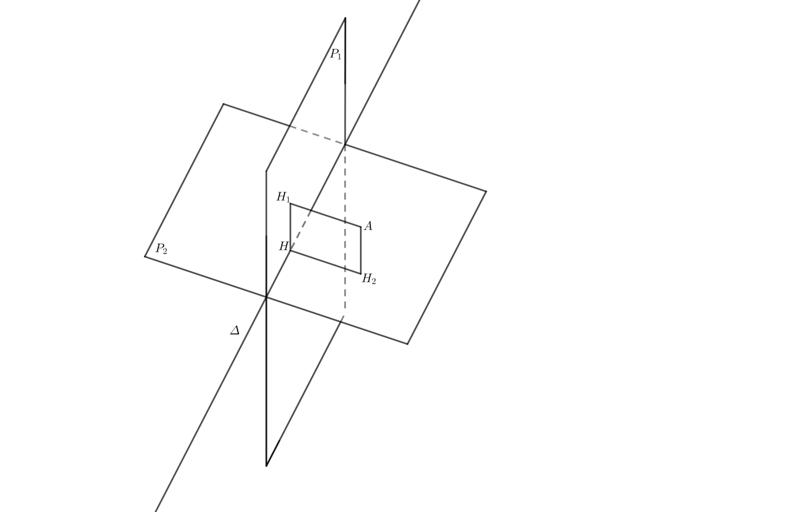
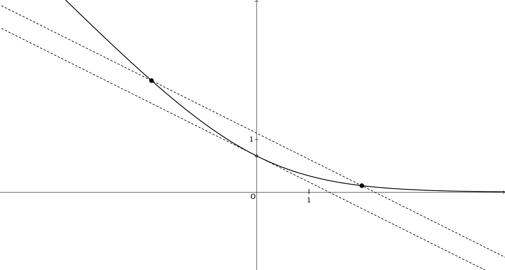

# spe-mathematiques-2023-metropole-2-sujet-officiel

> Source : `../../../pdf_version/11_maths/2023/spe-mathematiques-2023-metropole-2-sujet-officiel.pdf` — conversion Markdown (texte + visuels utiles).
> Stratégie : [STRATEGIE_MARKDOWN.md](../../../STRATEGIE_MARKDOWN.md)

---

## Page 1

BACCALAURÉAT GÉNÉRAL

                        ÉPREUVE D’ENSEIGNEMENT DE SPÉCIALITÉ

                                       SESSION 2023

                                MATHÉMATIQUES

                                   Mardi 21 mars 2023
                                 Durée de l’épreuve : 4 heures

                L’usage de la calculatrice avec mode examen actif est autorisé.
             L’usage de la calculatrice sans mémoire « type collège » est autorisé.

                Dès que ce sujet vous est remis, assurez-vous qu’il est complet.
                      Ce sujet comporte 5 pages numérotées de 1 à 5.

Le candidat doit traiter les quatre exercices proposés.

Le candidat est invité à faire figurer sur la copie toute trace de recherche, même incomplète ou
non fructueuse, qu’il aura développée.

La qualité de la rédaction, la clarté et la précision des raisonnements seront prises en compte
dans l’appréciation de la copie. Les traces de recherche, même incomplètes ou infructueuses,
seront valorisées.

23-MATJ2ME1                                                                Page 1 sur 5

---

## Page 2

Exercice 1 (5 points)

Cet exercice est un questionnaire à choix multiple.
Pour chaque question, une seule des quatre réponses proposées est exacte. Le candidat
indiquera sur sa copie le numéro de la question et la réponse choisie. Aucune justification n’est
demandée.
Aucun point n’est enlevé en l’absence de réponse ou en cas de réponse inexacte.

Un jeu vidéo possède une vaste communauté de joueurs en ligne. Avant de débuter une partie,
le joueur doit choisir entre deux « mondes » : soit le monde A, soit le monde B.

On choisit au hasard un individu dans la communauté des joueurs.
Lorsqu’il joue une partie, on admet que :
                                                                !
• la probabilité que le joueur choisisse le monde A est égale à " ;
                                                                                #
• si le joueur choisit le monde A, la probabilité qu’il gagne la partie est de $% ;
                                                       $!
• la probabilité que le joueur gagne la partie est de !" .

On considère les évènements suivants :
• 𝐴 : « Le joueur choisit le monde A » ;
• 𝐵 : « Le joueur choisit le monde B » ;
• 𝐺 : « Le joueur gagne la partie ».

1. La probabilité que le joueur choisisse le monde A et gagne la partie est égale à :
      #                           *                          #                         !+
  a. $%                       b. !"                     c. !"                       d. $!"

2. La probabilité 𝑃- (𝐺) de l’événement 𝐺 sachant que 𝐵 est réalisé est égale à :
     $                            $                          #                         "
  a. "                        b. *                      c. $"                       d. $!

Dans la suite de l’exercice, un joueur effectue 10 parties successives. On assimile cette
situation à un tirage aléatoire avec remise. On rappelle que la probabilité de gagner une partie
        $!
est de !".

3. La probabilité, arrondie au millième, que le joueur gagne exactement 6 parties est égale à:

  a. 0,859                    b. 0,671                  c. 0,188                    d. 0,187

4. On considère un entier naturel 𝑛 pour lequel la probabilité, arrondie au millième, que le
   joueur gagne au plus 𝑛 parties est de 0,207. Alors :

  a. 𝑛 = 2                    b. 𝑛 = 3                  c. 𝑛 = 4                    d. 𝑛 = 5

5. La probabilité que le joueur gagne au moins une partie est égale à :

           $! $%                      $* $%                  $! $%                           $* $%
  a. 1 − >!"?                 b. >!"?                   c. >!"?                     d. 1 − >!"?

23-MATJ2ME1                                                                      Page 2 sur 5

---

## Page 3

Exercice 2 (5 points)

Des biologistes étudient l’évolution d’une population d’insectes dans un jardin botanique.
Au début de l’étude la population est de 100 000 insectes.
Pour préserver l’équilibre du milieu naturel le nombre d’insectes ne doit pas dépasser 400 000.

Partie A : Étude d’un premier modèle en laboratoire
L’observation de l’évolution de ces populations d’insectes en laboratoire, en l’absence de tout
prédateur, montre que le nombre d’insectes augmente de 60 % chaque mois.
En tenant compte de cette observation, les biologistes modélisent l’évolution de la population
d’insectes à l’aide d’une suite (𝑢B ) où, pour tout entier naturel 𝑛, 𝑢B modélise le nombre
d’insectes, exprimé en millions, au bout de 𝑛 mois. On a donc 𝑢% = 0,1.

1. Justifier que pour tout entier naturel 𝑛 : 𝑢B = 0,1 × 1,6B .
2. Déterminer la limite de la suite (𝑢B ).
3. En résolvant une inéquation, déterminer le plus petit entier naturel 𝑛 à partir duquel 𝑢B > 0,4.
4. Selon ce modèle, l’équilibre du milieu naturel serait-il préservé ? Justifier la réponse.

Partie B : Étude d’un second modèle
En tenant compte des contraintes du milieu naturel dans lequel évoluent les insectes, les
biologistes choisissent une nouvelle modélisation.
Ils modélisent le nombre d’insectes à l’aide de la suite (𝑣B ), définie par : 𝑣% = 0,1 et, pour tout
entier naturel 𝑛, 𝑣BF$ = 1,6𝑣B − 1,6𝑣B! , où, pour tout entier naturel 𝑛, 𝑣B est le nombre d’insectes,
exprimé en millions, au bout de 𝑛 mois.

1. Déterminer le nombre d’insectes au bout d’un mois.

                                                            $
2. On considère la fonction 𝑓 définie sur l’intervalle H0 ; !J par 𝑓(𝑥 ) = 1,6𝑥 − 1,6𝑥 ! .
   a. Résoudre l’équation 𝑓 (𝑥) = 𝑥.
                                                                        $
   b. Montrer que la fonction 𝑓 est croissante sur l’intervalle H0 ; !J.

                                                                                     $
3. a. Montrer par récurrence que, pour tout entier naturel 𝑛, 0 ≤ 𝑣B ≤ 𝑣BF$ ≤ !.
   b. Montrer que la suite (𝑣B ) est convergente.

     On note ℓ la valeur de sa limite. On admet que ℓ est solution de l’équation 𝑓(𝑥) = 𝑥.

   c. Déterminer la valeur de ℓ. Selon ce modèle, l’équilibre du milieu naturel sera-t-il
   préservé ? Justifier la réponse.

4. On donne ci-contre la fonction seuil, écrite en langage Python.
                                                                               def seuil(a) :
    a. Qu’observe-t-on si on saisit seuil(0.4) ?                                   v=0.1
                                                                                   n=0
    b. Déterminer la valeur renvoyée par la saisie de seuil(0.35).                 while v<a :
       Interpréter cette valeur dans le contexte de l’exercice.                      v=1.6*v-1.6*v*v
                                                                                     n=n+1
                                                                                   return n

23-MATJ2ME1                                                                        Page 3 sur 5

---

## Page 4

Exercice 3 (5 points)

Dans l’espace rapporté à un repère orthonormé (𝑂; 𝚤⃗ , 𝚥⃗ , 𝑘S⃗ ), on considère :

• le plan 𝒫$ dont une équation cartésienne est 2𝑥 + 𝑦 − 𝑧 + 2 = 0,
                                                                                   1
• le plan 𝒫! passant par le point 𝐵(1 ; 1 ; 2) et dont un vecteur normal est SSSS⃗
                                                                             𝑛! X−1Y.
                                                                                   1

1. a. Donner les coordonnées d’un vecteur SSSS⃗
                                          𝑛$ normal au plan 𝒫$ .

  b. On rappelle que deux plans sont perpendiculaires si un vecteur normal à l’un des plans
     est orthogonal à un vecteur normal à l’autre plan.
     Montrer que les plans 𝒫$ et 𝒫! sont perpendiculaires.

2. a. Déterminer une équation cartésienne du plan 𝒫! .
                                                                     𝑥=0
  b. On note ∆ la droite dont une représentation paramétrique est : [𝑦 = −2 + 𝑡 , 𝑡 ∈ ℝ.
                                                                     𝑧=𝑡
     Montrer que la droite ∆ est l’intersection des plans 𝒫$ et 𝒫! .

On considère le point 𝐴(1 ; 1 ; 1) et on admet que le point 𝐴 n’appartient ni à 𝒫$ ni à 𝒫! .
On note 𝐻 le projeté orthogonal du point 𝐴 sur la droite ∆.

3. On rappelle que, d’après la question 2.b, la droite ∆ est l’ensemble des points 𝑀a de
coordonnées (0 ; −2 + 𝑡 ; 𝑡), où 𝑡 désigne un nombre réel quelconque.

    a. Montrer que, pour tout réel 𝑡, 𝐴𝑀a = √2𝑡 ! − 8𝑡 + 11 .

    b. En déduire que 𝐴𝐻 = √3.

4. On note 𝒟$ la droite orthogonale au plan 𝒫$ passant par le point 𝐴 et 𝐻$ le projeté orthogonal
du point 𝐴 sur le plan 𝒫$ .

   a. Déterminer une représentation paramétrique de la droite 𝒟$ .
                                                       $ $     "
   b. En déduire que le point 𝐻$ a pour coordonnées >− * ; * ; *?.

5. Soit 𝐻! le projeté orthogonal de 𝐴 sur le plan 𝒫! .

                                           +   !   +
On admet que 𝐻! a pour coordonnées >* ; * ; *?
et que 𝐻 a pour coordonnées (0 ; 0 ; 2).

Sur le schéma ci-contre, les plans 𝒫$ et 𝒫!
sont représentés, ainsi que les points 𝐴, 𝐻$ , 𝐻! , 𝐻.

Montrer que 𝐴𝐻$ 𝐻𝐻! est un rectangle.

23-MATJ2ME1                                                                         Page 4 sur 5

---

## Page 5

Exercice 4 (5 points)

On considère la fonction 𝑓 définie sur ℝ par 𝑓(𝑥 ) = ln (1 + egh ), où ln désigne la fonction
logarithme népérien.

On note 𝐶 sa courbe représentative dans un repère orthonormé (𝑂; 𝚤⃗, 𝚥⃗).
La courbe 𝐶 est tracée ci-dessous.

                          𝑀r

                                                                        𝑁r
                                                                             𝐶

                                                                   𝑇%

1. a. Déterminer la limite de la fonction 𝑓 en −∞.
  b. Déterminer la limite de la fonction 𝑓 en +∞. Interpréter graphiquement ce résultat.
  c. On admet que la fonction 𝑓 est dérivable sur ℝ et on note 𝑓′ sa fonction dérivée.
                                                                              g$
     Calculer 𝑓 l (𝑥 ) puis montrer que, pour tout nombre réel 𝑥, 𝑓 l (𝑥 ) = $Fmn .

   d. Dresser le tableau de variations complet de la fonction 𝑓 sur ℝ.

2. On note 𝑇% la tangente à la courbe 𝐶 en son point d’abscisse 0.
  a. Déterminer une équation de la tangente 𝑇% .
  b. Montrer que la fonction 𝑓 est convexe sur ℝ.
                                                                   $
  c. En déduire que, pour tout nombre réel 𝑥, on a : 𝑓(𝑥) ≥ − ! 𝑥 + ln(2).

3. Pour tout nombre réel 𝑎 différent de 0, on note 𝑀r et 𝑁r les points de la courbe 𝐶 d’abscisses
   respectives −𝑎 et 𝑎. On a donc : 𝑀r t−𝑎 ; 𝑓(−𝑎)u et 𝑁r t𝑎 ; 𝑓(𝑎)u.

   a. Montrer que, pour tout nombre réel 𝑥, on a : 𝑓(𝑥 ) − 𝑓(−𝑥 ) = −𝑥.
   b. En déduire que les droites 𝑇% et (𝑀r 𝑁r ) sont parallèles.

23-MATJ2ME1                                                                    Page 5 sur 5

