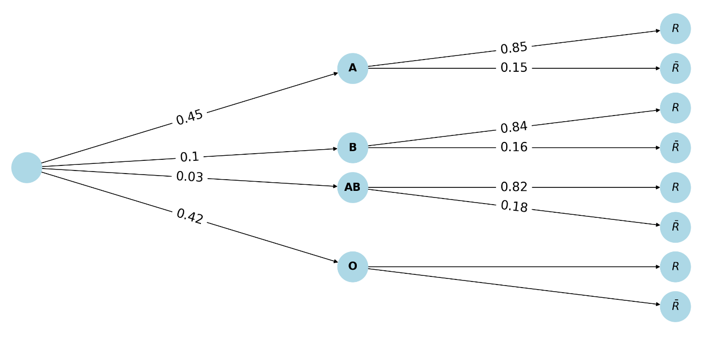

# spe-mathematiques-2025-metropole-1-corrige

> Source : `../../../pdf_version/11_maths/2025/spe-mathematiques-2025-metropole-1-corrige.pdf` — conversion Markdown (texte + visuels utiles).
> Stratégie : [STRATEGIE_MARKDOWN.md](../../../STRATEGIE_MARKDOWN.md)

---

## Page 1

Corrigé du bac général 2025
                    Spécialité Mathématiques
                             Métropole – Jour 1

                            BACCALAURÉAT GÉNÉRAL

                  ÉPREUVE D’ENSEIGNEMENT DE SPÉCIALITÉ

                                         SESSION 2025

                                   MATHÉMATIQUES

                                    Durée de l’épreuve : 4 heures

                  L’usage de la calculatrice avec mode examen actif est autorisé.
               L’usage de la calculatrice sans mémoire, « type collège », est autorisé.

       Correction proposée par un professeur de mathématiques pour le site sujetdebac.fr

        Pour accéder à d’autres sujets et corrigés de spé mathématiques au baccalauréat :
                  www.sujetdebac.fr/annales/specialites/spe-mathematiques/

Corrigé Bac 2025 – Spécialité Mathématiques – Métropole – Jour 1                 www.sujetdebac.fr

---

## Page 2

EXERCICE 1 (5 points)
   1. On complète l’arbre à partir des données :

      •   𝑃(𝐴) = 0,45
      •   𝑃𝐵 = 0,10
      •   𝑃𝐴𝐵 = 0,03
      •   𝑃(𝑂) = 1 − (0,45 + 0,10 + 0,03) = 0,42
      •   𝑃(R|A) = 0,85
      •   𝑃(R|B) = 0,84
      •   𝑃(R|AB) = 0,82
      •   𝑃(𝑅‾ |𝐴) = 1 − 0,85 = 0,15
      •   𝑃(𝑅‾ |𝐵) = 1 − 0,84 = 0,16
      •   𝑃(𝑅‾ |𝐴𝐵) = 1 − 0,82 = 0,18

   2. On cherche 𝑃(𝐵 ∩ 𝑅), soit la probabilité qu'une personne soit de groupe B et rhésus
   positif :
                       𝑃(𝐵 ∩ 𝑅) = 𝑃(𝐵) × 𝑃(𝑅|𝐵) = 0,10 × 0,84 = 0,084
   Interprétation : 8,4 % des personnes dans la population française sont de groupe sanguin B
   et ont un rhésus positif.

Corrigé Bac 2025 – Spécialité Mathématiques – Métropole – Jour 1             www.sujetdebac.fr

---

## Page 3

3. On connaît :
                                            𝑃(𝑅) = 0,8397
   On utilise la formule des probabilités totales :
                       𝑃(𝑅) = 𝑃(𝐴 ∩ 𝑅) + 𝑃(𝐵 ∩ 𝑅) + 𝑃(𝐴𝐵 ∩ 𝑅) + 𝑃(𝑂 ∩ 𝑅)
                       𝑃(𝑂 ∩ 𝑅) = 𝑃(𝑅) − [𝑃(𝐴 ∩ 𝑅) + 𝑃(𝐵 ∩ 𝑅) + 𝑃(𝐴𝐵 ∩ 𝑅)]
                  𝑃(𝑂 ∩ 𝑅) = 0,8397 − [0,45 × 0,85 + 0,10 × 0,84 + 0,03 × 0,82]
                = 0,8397 − [0,3825 + 0,084 + 0,0246] = 0,8397 − 0,4911 = 0,3486
   Donc :
                                           𝑃(𝑂 ∩ 𝑅) 0,3486
                                𝑃𝑂 (𝑅) =           =       ≈ 0,83
                                             𝑃(𝑂)    0,42

   4. Un donneur universel est une personne de groupe O et de rhésus négatif, donc on
   cherche :

                                    𝑃(𝑂 ∩ 𝑅‾ ) = 𝑃(𝑂) × 𝑃(𝑅‾ |𝑂)
   On a trouvé précédemment :

                            𝑃(𝑅|𝑂) = 0,83 ⇒ 𝑃(𝑅‾ |𝑂) = 1 − 0,83 = 0,17
   Donc :

                                 𝑃(𝑂 ∩ 𝑅‾ ) = 0,42 × 0,17 = 0,0714

   5. a. On effectue un tirage avec remise de 100 personnes. Chaque personne a une
   probabilité 𝑝 = 0,0714 d’être donneur universel. Donc 𝑋 ∼ ℬ(100,0,0714).

   5. b. On veut 𝑃(𝑋 ≤ 7). Avec une calculatrice on obtient :
                                           𝑃(𝑋 ≤ 7) ≈ 0,577

   5. c. Espérance :
                                𝔼(𝑋) = 𝑛𝑝 = 100 × 0,0714 = 7,14
   Variance :
     𝑉(𝑋) = 𝑛𝑝(1 − 𝑝) = 100 × 0,0714 × (1 − 0,0714) ≈ 100 × 0,0714 × 0,9286 ≈ 6,63

Corrigé Bac 2025 – Spécialité Mathématiques – Métropole – Jour 1            www.sujetdebac.fr

---

## Page 4

6. a. 𝑀𝑁 est la moyenne du nombre de donneurs universels par ville. Elle représente donc le
   nombre moyen de donneurs universels pour un échantillon de 100 personnes dans une ville,
   en moyenne sur les 𝑁 villes.

   6. b. L’espérance est :
                                      𝔼(𝑋1 ) + ⋯ + 𝔼(𝑋𝑁 ) 𝑁 × 7,14
                           𝔼(𝑀𝑁 ) =                      =         = 7,14
                                               𝑁             𝑁

   6. c. Les 𝑋𝑖 sont indépendantes avec même variance 𝑉(𝑋𝑖 ) = 6,63, donc :
                                      𝑉(𝑋1 ) + ⋯ + 𝑉(𝑋𝑁 ) 𝑁 × 6,63 6,63
                           𝑉(𝑀𝑁 ) =                      =        =
                                              𝑁2            𝑁2      𝑁

   6. d. On veut 𝑃(7 < 𝑀𝑁 < 7,28) ≥ 0,95
   On utilise l’inégalité de Bienaymé-Tchebychev :
                                                               𝑉(𝑀𝑁 )
                                𝑃(|𝑀𝑁 − 𝔼(𝑀𝑁 )| < 𝜖) ≥ 1 −
                                                                 𝜖2
   Ici, 𝜖 = 0,14, donc :
          6,63                 6,63                      6,63       6,63
   1−            2
                   ≥ 0,95 ⇒            ≤ 0,05 ⇒ 𝑁 ≥              ≈        ≈ 6765,3
        𝑁 × 0, 14           𝑁 × 0,0196              0,05 × 0,0196 0,00098
   Donc la plus petite valeur de 𝑁 est 6766.

   EXERCICE 2 (6 points)
   Partie A
   1. Le nombre dérivé 𝑓 ′ (1) correspond au coefficient directeur de la tangente 𝑇𝐴 en 𝐴(1; 2).
   On lit graphiquement :
                                             𝑓 ′ (1) = −1

   2. Graphiquement, on observe que la courbe représentative 𝐶𝑓 semble avoir 2 points avec
   une tangente horizontale sur l’intervalle ]0; 3], ce qui signifie que la dérivée s’annule en
   deux points. Donc l’équation 𝑓 ′ (𝑥) = 0 admet deux solutions sur ]0; 3].

Corrigé Bac 2025 – Spécialité Mathématiques – Métropole – Jour 1                www.sujetdebac.fr

---

## Page 5

3. À 𝑥 = 0,2, la courbe représentative 𝐶𝑓 semble en-dessous de ses tangentes. La fonction 𝑓
   est donc concave. Ainsi, on a :
                                              𝑓 ″ (0,2) < 0

   Partie B

   𝑓(𝑥) = 𝑥(2(ln𝑥)2 − 3ln𝑥 + 2)
   1. On résout l’équation du second degré :
                                            2𝑋 2 − 3𝑋 + 2 = 0
   Discriminant :
                               Δ = (−3)2 − 4 × 2 × 2 = 9 − 16 = −7
   L’équation n’a pas de solution réelle.
   Pour avoir 𝑓(𝑥) = 0, il faut :

      •   𝑥 = 0 (hors de l’intervalle d’analyse) ou
      •   2(ln𝑥)2 − 3ln𝑥 + 2 = 0
   En posant 𝑋 = ln⁡(𝑥), alors cela revient à résoudre l’équation 2𝑋 2 − 3𝑋 + 2 = 0.
   Cette équation n’a pas de solution réelle, donc 𝑓(𝑥) > 0 pour tout 𝑥 > 0, la fonction ne
   s’annule jamais. La courbe 𝐶𝑓 ne coupe pas l’axe des abscisses.

   2. On étudie la limite de 𝑓(𝑥) quand 𝑥 → +∞.
   On remarque que :
                                                                    3     2
                    𝑓(𝑥) = 𝑥(2(ln𝑥)2 − 3ln𝑥 + 2) = 𝑥(ln𝑥)²(2 −        +       )
                                                                   ln𝑥 (ln𝑥)2
   On sait que :

      •   ln𝑥 → +∞
           3
      •       →0
          ln𝑥
             2
      •   (ln𝑥)2
                 →0
               3      2
   Donc (2 − ln𝑥 + (ln𝑥)2) → 2

   Or 𝑥(ln𝑥) → +∞
   Ainsi, par produit : lim 𝑓(𝑥) = +∞
                       x→+∞⁡

Corrigé Bac 2025 – Spécialité Mathématiques – Métropole – Jour 1              www.sujetdebac.fr

---

## Page 6

3a. On nous donne :

                                      𝑓 ′ (𝑥) = 2(ln𝑥)2 + ln𝑥 − 1
   On dérive :
                                             2        1     1
                             𝑓 ″ (𝑥) = 2 ∙     ∙ ln𝑥 + + 0 = (4ln𝑥 + 1)
                                             𝑥        𝑥     𝑥

                                                                    1
   3b. Le signe de 𝑓 ″ (𝑥) est le même que 4ln𝑥 + 1 car le facteur 𝑥 est strictement positif sur
   ]0; +∞[.
   Posons :
                                                     1
                               4ln𝑥 + 1 = 0 ⇒ ln𝑥 = − ⇒ 𝑥 = 𝑒 −1/4
                                                     4
   Donc :

      •     Pour 𝑥 < 𝑒 −1/4, 𝑓 ″ (𝑥) < 0 : la courbe est concave

      •     Pour 𝑥 > 𝑒 −1/4, 𝑓 ″ (𝑥) > 0 : la courbe est convexe

   Le point d'inflexion a pour abscisse 𝑒 −1/4.

   3c. Avec la calculatrice, on obtient :

      •     𝑒 −1⁄4 ≈ 0,78
      •     𝑒 ≈ 2,718

   Donc 𝑒 > 𝑒 −1⁄4 et 𝑒 ∈⁡]𝑒 −1⁄4 ; +∞[

   Ainsi, la courbe 𝐶𝑓 est au-dessus de ses tangentes sur l’intervalle ]𝑒 −1⁄4 ; +∞[.

   Donc 𝐶𝑓 est au-dessus de 𝑇𝐵 sur [1; +∞[.

   Partie C
   1. La tangente 𝑇𝐵 est tangente à 𝐶𝑓 au point 𝐵(𝑒; 𝑒), donc son équation est de la forme :

                                       𝑦 = 𝑓 ′ (𝑒)(𝑥 − 𝑒) + 𝑓(𝑒)
   On calcule :

      •     𝑓(𝑒) = 𝑒(2(ln𝑒)2 − 3ln𝑒 + 2) = 𝑒(2 − 3 + 2) = 𝑒
      •     𝑓 ′ (𝑒) = 2(ln𝑒)2 + ln𝑒 − 1 = 2 + 1 − 1 = 2

Corrigé Bac 2025 – Spécialité Mathématiques – Métropole – Jour 1                 www.sujetdebac.fr

---

## Page 7

Donc :
                               𝑦 = 2(𝑥 − 𝑒) + 𝑒 = 2𝑥 − 2𝑒 + 𝑒 = 2𝑥 − 𝑒

   2. Intégration par parties :
                           1
       •     𝑢 = ln𝑥, 𝑢′ = 𝑥

                               𝑥2
       •     𝑣 ′ = 𝑥, donc 𝑣 = 2

   Alors :
                                       𝑥2         𝑥2 1    𝑥2      𝑥
                         ∫ 𝑥ln𝑥 𝑑𝑥 =      ln𝑥 − ∫   ⋅ 𝑑𝑥 = ln𝑥 − ∫ 𝑑𝑥
                                       2          2 𝑥     2       2
                                            𝑥2    𝑥2
                                           = ln𝑥 − + 𝐶
                                            2     4
   Donc :
                                       𝑒                           𝑒
                                                   𝑥2    𝑥2
                                     ∫ 𝑥 ln𝑥 𝑑𝑥 = [ ln𝑥 − ]
                                      1            2     4 1

   À𝑥 =𝑒:

                                           𝑒2     𝑒2 𝑒2
                                              ⋅1−   =
                                           2      4   4
   À𝑥 =1:
                                           1    1    1
                                             ⋅0− = −
                                           2    4    4
   Donc :
                                       𝑒
                                                 𝑒2 1 𝑒2 + 1
                                    ∫ 𝑥 ln𝑥 𝑑𝑥 =   + =
                                     1           4 4     4

   3. On veut calculer :
                                           𝑒
                                    𝒜 = ∫ (𝑓(𝑥) − (2𝑥 − 𝑒)) 𝑑𝑥
                                           1

   On a :

     𝑓(𝑥) = 𝑥(2(ln𝑥)2 − 3ln𝑥 + 2) ⇒ 𝑓(𝑥) − (2𝑥 − 𝑒) = 𝑥(2(ln𝑥)2 − 3ln𝑥 + 2) − 2𝑥 + 𝑒
                = 𝑥(2(ln𝑥)2 − 3ln𝑥) + 𝑒

Corrigé Bac 2025 – Spécialité Mathématiques – Métropole – Jour 1         www.sujetdebac.fr

---

## Page 8

On écrit donc :
             𝑒                                  𝑒            𝑒              𝑒
     𝒜 = ∫ 𝑥 (2(ln𝑥)2 − 3ln𝑥) 𝑑𝑥 + ∫ 𝑒 𝑑𝑥 = 2 ∫ 𝑥 (ln𝑥)2 𝑑𝑥 − 3 ∫ 𝑥 ln𝑥 𝑑𝑥 + 𝑒(𝑒 − 1)
             1                                  1            1             1

   On admet :
             𝑒                     𝑒 2 −1
      •     ∫1 𝑥 (ln𝑥)2 𝑑𝑥 =         4

             𝑒              𝑒 2 +1
      •     ∫1 𝑥 ln𝑥 𝑑𝑥 =      4

   Donc :
                     𝑒2 − 1     𝑒2 + 1              2(𝑒 2 − 1) − 3(𝑒 2 + 1)
             𝒜 =2⋅          −3⋅        + 𝑒(𝑒 − 1) =                         + 𝑒2 − 𝑒
                        4          4                           4
                               2𝑒 2 − 2 − 3𝑒 2 − 3            −𝑒 2 − 5
                           =                       + 𝑒2 − 𝑒 =          + 𝑒2 − 𝑒
                                        4                        4

                                            2
                                               𝑒2      5 3𝑒 2     5
                                         = (𝑒 − ) − 𝑒 − =     −𝑒−
                                               4       4  4       4

   Donc :
                                                       3𝑒 2     5
                                                𝒜=          −𝑒−
                                                        4       4

   EXERCICE 3 (4 points)
   Affirmation 1
                               3 − (−1)     4
                         ⃗⃗⃗⃗⃗
   On calcule le vecteur 𝐴𝐵 = ( 2 − 0 ) = ( 2 )
                                −1 − 5     −6
   Regardons l'affirmation proposée :
                                                     𝑥 = 3 − 2𝑡
                                                    {𝑦 = 2 − 𝑡
                                                     𝑧 = −1 + 3𝑡
                                      −2
                                            −1
                                               ⃗⃗⃗⃗⃗ .
   On y lit un vecteur directeur 𝑣 = (−1) = 2 ⁡𝐴𝐵
                                      3
   Ce vecteur est colinéaire à ⃗⃗⃗⃗⃗
                               𝐴𝐵 et en utilisant le point 𝐵(3; 2; −1) on trouve bien la
   représentation paramétrique de (AB).
   Affirmation 1 : vraie

Corrigé Bac 2025 – Spécialité Mathématiques – Métropole – Jour 1                  www.sujetdebac.fr

---

## Page 9

Affirmation 2
   Pour vérifier qu’un vecteur est normal au plan (OAB), il suffit qu’il soit orthogonal à deux
   vecteurs non colinéaires du plan. Ici, on peut prendre :
                  −1
      •     ⃗⃗⃗⃗⃗
            𝑂𝐴 = ( 0 )
                   5
                   3
      •     ⃗⃗⃗⃗⃗
            𝑂𝐵 = ( 2 )
                  −1
   On vérifie si 𝑛⃗ est orthogonal à chacun :

                       𝑛⃗ ⋅ ⃗⃗⃗⃗⃗
                            𝑂𝐴 = 5 × (−1) + (−2) × 0 + 1 × 5 = −5 + 0 + 5 = 0
                         ⃗⃗⃗⃗⃗ = 5 × 3 + (−2) × 2 + 1 × (−1) = 15 − 4 − 1 = 10 ≠ 0
                    𝑛⃗ ⋅ 𝑂𝐵
                                   ⃗⃗⃗⃗⃗ ⇒ ce n’est pas un vecteur normal au plan (OAB).
   Donc, 𝑛⃗ n’est pas orthogonal à 𝑂𝐵
   Affirmation 2 : fausse

   Affirmation 3
   On a :

            •   vecteur directeur de 𝑑 : 𝑢
                                         ⃗ = (1;⁡−1; ⁡2)
            •   vecteur directeur de 𝑑′ : 𝑣 = (4; ⁡4;⁡−6)
   On cherche un réel 𝜆 tel que :
                                      (1;⁡−1; ⁡2) = 𝜆(4; ⁡4;⁡−6)
   On teste :
                            1
      •     1 = 4𝜆 ⇒ 𝜆 = 4

      •     −1 = 4𝜆 = 1
   Donc les vecteurs ne sont pas colinéaires ⇒ les droites 𝑑 et 𝑑 ′ ne sont pas parallèles.
   On regarde maintenant si les droites sont sécantes.
   On cherche s’il existe 𝑘 et 𝑠 tels que les deux droites passent par le même point.
   On pose donc les équations :
                                          15 + 𝑘 = 1 + 4𝑠
                                         {8 − 𝑘 = 2 + 4𝑠
                                          −6 + 2𝑘 = 1 − 6𝑠

Corrigé Bac 2025 – Spécialité Mathématiques – Métropole – Jour 1                 www.sujetdebac.fr

---

## Page 10

On résout les deux premières équations :
                                 15 + 𝑘 = 1 + 4𝑠 ⇒ 𝑘 = −14 + 4𝑠
                                           8 − 𝑘 = 2 + 4𝑠
   On remplace 𝑘 :
              8 − (−14 + 4𝑠) = 2 + 4𝑠 ⇒ 22 − 4𝑠 = 2 + 4𝑠 ⇒ 20 = 8𝑠 ⇒ 𝑠 = 2.5
   On en déduit 𝑘 = −14 + 4 × 2.5 = −4
   Vérifions maintenant que ces valeurs conviennent aussi pour la 3e équation :
                                         −6 + 2𝑘 = 1 − 6𝑠
   Gauche : −6 + 2 × (−4) = −6 − 8 = −14
   Droite : 1 − 6 × 2.5 = 1 − 15 = −14
   Le système est compatible.
   Donc les deux droites se coupent en un point ⇒ elles sont sécantes, donc coplanaires.

   Affirmation 3 : fausse

   Affirmation 4
   On cherche le point 𝐻, projeté orthogonal de 𝐶 sur le plan. La droite orthogonale au plan
   passant par 𝐶 a pour direction le vecteur normal (1, −1,1), donc :
                                             𝑥 = 2+𝑡
                                            {𝑦 = −1 − 𝑡
                                             𝑧 = 2+𝑡
   On cherche 𝑡 tel que ce point soit dans le plan :
                   (2 + 𝑡) − (−1 − 𝑡) + (2 + 𝑡) + 1 = 0 ⇒ 6 + 3𝑡 = 0 ⇒ 𝑡 = −2
   Donc 𝐻 = (0,1,0)

   Distance 𝐶𝐻 =∥ ⃗⃗⃗⃗⃗
                  𝐶𝐻 ∥= √(2)2 + (−2)2 + 22 = √12 = 2√3
   Affirmation 4 : vraie

Corrigé Bac 2025 – Spécialité Mathématiques – Métropole – Jour 1              www.sujetdebac.fr

---

## Page 11

EXERCICE 4 (5 points)
   Partie A
   1. On cherche :

                         𝑢1 = −0,02 × 12 + 1,3 × 1 = −0,02 + 1,3 = 1,28
   La superficie recouverte par la posidonie au 1er juillet 2025 est donc 1,28 ha.

   2. a. Montrons par récurrence que 1 ≤ 𝑢𝑛 ≤ 𝑢𝑛+1 ≤ 20
   Initialisation : 𝑢0 = 1 ∈ [1; 20] Et on a vu que 𝑢1 = 1,28 ≥ 𝑢0
   Hérédité : supposons que 1 ≤ 𝑢𝑛 ≤ 𝑢𝑛+1 ≤ 20
   ℎ est croissante sur [0; 20] (admis), donc :
        𝑢𝑛+1 = ℎ(𝑢𝑛 ) ≥ ℎ(1) = 𝑢1 ≥ 1 et 𝑢𝑛+1 ≤ ℎ(20) = −0,02 × 400 + 1,3 × 20
                = −8 + 26 = 18
           Donc 𝑢𝑛+1 ≤ 20
   Et comme ℎ croissante, on a 𝑢𝑛+1 = ℎ(𝑢𝑛 ) ≥ ℎ(𝑢𝑛−1 ) = 𝑢𝑛
   Conclusion : la suite est croissante, majorée par 20, et 𝑢𝑛 ≥ 1.
   2. b. La suite est croissante et majorée, donc elle converge. On note sa limite 𝐿.
   2. c. À la limite, on a lim⁡ 𝑢𝑛 = 𝐿, donc :

     𝐿 = −0,02𝐿2 + 1,3𝐿 ⇒ 0 = −0,02𝐿2 + 0,3𝐿 ⇒ 0 = 𝐿(−0,02𝐿 + 0,3) ⇒ 𝐿 = 0               ou   𝐿
                   0,3
                =      = 15
                  0,02
   Mais la suite est toujours ≥ 1 donc 𝐿 = 15

   3.a. Le modèle est croissant, donc à partir d’un certain rang 𝑛, 𝑢𝑛 > 14. Cela arrivera
   forcément puisque la limite est 15 > 14.
   3.b. Complétons l’algorithme :

    def seuil():
      n=0
      u=1
      while u <= 14:
         n=n+1
         u = -0.02 * u**2 + 1.3 * u
      return n

Corrigé Bac 2025 – Spécialité Mathématiques – Métropole – Jour 1                 www.sujetdebac.fr

---

## Page 12

Partie B
   1. On dérive 𝑔 :
                     𝑓 ′ (𝑡)    0,02𝑓(𝑡)(15 − 𝑓(𝑡))         15 − 𝑓(𝑡)
       𝑔′ (𝑡) = −          2
                             =−             2
                                                    = −0,02           = −0,3 + 0,02𝑔(𝑡)
                     𝑓(𝑡)              𝑓(𝑡)                   𝑓(𝑡)
   Donc :
                           𝑔′ (𝑡) = −0,3 + 0,02𝑔(𝑡) ⇒ 𝑔′ (𝑡) = −0,3𝑔(𝑡) + 0,02
   On a bien montré que 𝑔 est solution de (E2).

   2. C’est une équation linéaire du 1er ordre. On peut écrire :

      •     Solution de l’équation homogène : 𝑦ℎ (𝑡) = 𝐶𝑒 −0,3𝑡
                                                           0,02     1
      •     Une solution particulière : 𝑦𝑝 (𝑡) = 0,3 = 15

   Donc la solution générale est :
                                                                           1
                                                 𝑦(𝑡) = 𝐶𝑒 −0,3𝑡 +
                                                                          15
                            1                1
   3. Rappel : 𝑔(𝑡) = 𝑓(𝑡) ⇒ 𝑓(𝑡) = 𝑔(𝑡)

   Donc :
                                                       1                       15
                                    𝑓(𝑡) =                         =
                                                               1        15𝐶𝑒 −0,3𝑡 + 1
                                             𝐶𝑒 −0,3𝑡 +
                                                              15
   Utilisons 𝑓(0) = 1 pour déterminer 𝐶 :
                                           15                             14
                                𝑓(0) =           = 1 ⇒ 15𝐶 + 1 = 15 ⇒ 𝐶 =
                                         15𝐶 + 1                          15
   Donc :
                                                                   15
                                                 𝑓(𝑡) =
                                                            14𝑒 −0,3𝑡 + 1

                      15
   4. lim 𝑓(𝑡) =           = 15
     𝑡→+∞            0+1

   Donc la superficie tend vers 15 ha avec le temps, comme dans le modèle discret.

   5. On cherche :
                                                  15                                1          14
                           𝑓(𝑡) > 14 ⇒                            > 14 ⇒                   >
                                           14𝑒 −0,3𝑡 + 1                   14𝑒 −0,3𝑡 + 1       15

Corrigé Bac 2025 – Spécialité Mathématiques – Métropole – Jour 1                                    www.sujetdebac.fr

---

## Page 13

On inverse (car les deux membres sont positifs) :
                    15               15      1              1                  1
    14𝑒 −0,3𝑡 + 1 <    ⇒ 14𝑒 −0,3𝑡 <    −1=    ⇒ 𝑒 −0,3𝑡 <     ⇒ −0,3𝑡 < ln (     )⇒𝑡
                    14               14     14             196                196
                          1
                    −ln (196) ln(196)
                  >           =
                       0,3         0,3
                                                                        5,278
            ln(196) = ln(142 ) = 2ln(14) ≈ 2 × 2,639 = 5,278 ⇒ 𝑡 >            ≈ 17,59
                                                                         0,3
   Donc, au bout de 18 ans, la superficie dépassera les 14 ha.
   Interprétation : D’après le modèle continu, la posidonie dépassera 14 hectares aux alentours
   de l’année 2042.

   ______

   Pour accéder à d’autres sujets et corrigés de spé mathématiques au baccalauréat :
   www.sujetdebac.fr/annales/specialites/spe-mathematiques/

Corrigé Bac 2025 – Spécialité Mathématiques – Métropole – Jour 1              www.sujetdebac.fr
