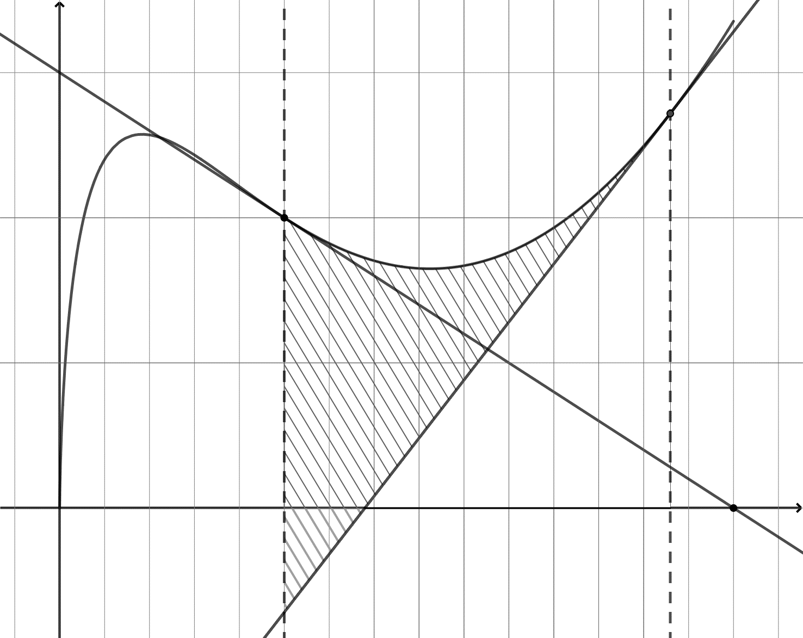

# spe-mathematiques-2025-metropole-1-sujet-officiel

> Source : `../../../pdf_version/11_maths/2025/spe-mathematiques-2025-metropole-1-sujet-officiel.pdf` — conversion Markdown (texte + visuels utiles).
> Stratégie : [STRATEGIE_MARKDOWN.md](../../../STRATEGIE_MARKDOWN.md)

---

## Page 1

BACCALAURÉAT GÉNÉRAL

                  ÉPREUVE D’ENSEIGNEMENT DE SPÉCIALITÉ

                                  SESSION 2025

                           MATHÉMATIQUES

                           Mardi 17 juin 2025

                            Durée de l’épreuve : 4 heures

           L’usage de la calculatrice avec mode examen actif est autorisé.
        L’usage de la calculatrice sans mémoire « type collège » est autorisé.

          Dès que ce sujet vous est remis, assurez-vous qu’il est complet.
                Ce sujet comporte 7 pages numérotées de 1 à 7.

Le candidat doit traiter les quatre exercices proposés.

Le candidat est invité à faire figurer sur la copie toute trace de recherche, même
incomplète ou non fructueuse, qu’il aura développée.

La qualité de la rédaction, la clarté et la précision des raisonnements seront prises en
compte dans l’appréciation de la copie. Les traces de recherche, même incomplètes
ou infructueuses, seront valorisées.

25-MATJ1ME1                                                               Page 1 sur 7

---

## Page 2

Exercice 1 (5 points)
On compte quatre groupes sanguins dans l’espèce humaine : A, B, AB et O.
Chaque groupe sanguin peut présenter un facteur rhésus. Lorsqu’il est présent, on
dit que le rhésus est positif, sinon on dit qu’il est négatif.
Au sein de la population française, on sait que :
   •    45 % des individus appartiennent au groupe A, et parmi eux 85 % sont de
        rhésus positif ;
   •    10 % des individus appartiennent au groupe B, et parmi eux 84 % sont de
        rhésus positif ;
   •    3 % des individus appartiennent au groupe AB, et parmi eux 82 % sont de
        rhésus positif.

On choisit au hasard une personne dans la population française.
On désigne par :
    •   𝐴 l’évènement « La personne choisie est de groupe sanguin A » ;
    •   𝐵 l’évènement « La personne choisie est de groupe sanguin B » ;
    •   𝐴𝐵 l’évènement « La personne choisie est de groupe sanguin AB » ;
    •   𝑂 l’évènement « La personne choisie est de groupe sanguin O » ;
    •   𝑅 l’évènement « La personne choisie a un facteur rhésus positif ».

Pour un événement quelconque 𝐸, on note 𝐸̅ l’événement contraire de 𝐸 et 𝑃(𝐸) la
probabilité de 𝐸.
1. Recopier l’arbre ci-contre en complétant les                                                             …        𝑅
   dix pointillés.                                                                                    𝐴
                                                                                                            …        𝑅
2. Montrer que 𝑃(𝐵 ∩ 𝑅) = 0,084. Interpréter ce                                                   …
   résultat dans le contexte de l’exercice.                                                                 …        𝑅
                                                                                                  …   𝐵
3. On précise que 𝑃(𝑅) = 0,8397.                                                                            …        𝑅
   Montrer que 𝑃𝑂 (𝑅) = 0,83.
                                                                                                  …         …        𝑅
4. On dit qu’un individu est « donneur                            𝐴𝐵
   universel » lorsque son sang peut être                                 …                                          𝑅
   transfusé à toute personne sans risque                 …
   d’incompatibilité.                                                                                                𝑅
   Le groupe O de rhésus négatif est le seul                      𝑂
   vérifiant cette caractéristique.                                                                                  𝑅
   Montrer que la probabilité qu’un individu
   choisi au hasard dans la population française soit donneur universel est de
   0,0714.

25-MATJ1ME1                                                                                               Page 2 sur 7

                                            EducN_MMDQ0Mj5I0MTAa4MT2czMtjAyNj5A1MjEHwMzvE4MCjcg

---

## Page 3

5. Lors d’une collecte de sang, on choisit un échantillon de 100 personnes dans la
   population d’une ville française. Cette population est suffisamment grande pour
   assimiler ce choix à un tirage avec remise.
   On note 𝑋 la variable aléatoire qui à chaque échantillon de 100 personnes
   associe le nombre de donneurs universels dans cet échantillon.

   a. Justifier que 𝑋 suit une loi binomiale dont on précisera les paramètres.
   b. Déterminer à 10−3 près la probabilité qu’il y ait au plus 7 donneurs universels
      dans cet échantillon.
   c. Montrer que l’espérance 𝐸(𝑋) de la variable aléatoire 𝑋 est égale à 7,14 et
      que sa variance 𝑉(𝑋) est égale à 6,63 à 10−2 près.

6. Lors de la semaine nationale du don du sang, une collecte de sang est organisée
   dans 𝑁 villes françaises choisies au hasard numérotées 1, 2, 3, … , 𝑁 où 𝑁 est un
   entier naturel non nul.
   On considère la variable aléatoire 𝑋1 qui à chaque échantillon de 100 personnes
   de la ville 1 associe le nombre de donneurs universels dans cet échantillon.
   On définit de la même manière les variables aléatoires 𝑋2 pour la ville 2, …, 𝑋𝑁
   pour la ville 𝑁.

   On suppose que ces variables aléatoires sont indépendantes et qu’elles
   admettent la même espérance égale à 7,14 et la même variance égale à 6,63.
                                          𝑋 +𝑋 +⋯+𝑋𝑁
   On considère la variable aléatoire 𝑀𝑁 = 1 2𝑁      .

   a. Que représente la variable aléatoire 𝑀𝑁 dans le contexte de l’exercice ?
   b. Calculer l’espérance 𝐸(𝑀𝑁 ).
   c. On désigne par 𝑉(𝑀𝑁 ) la variance de la variable aléatoire 𝑀𝑁 .
                            6,63
      Montrer que 𝑉(𝑀𝑁 ) = 𝑁 .
   d. Déterminer la plus petite valeur de 𝑁 pour laquelle l’inégalité de Bienaymé-
      Tchebychev permet d’affirmer que :
                                 𝑃(7 < 𝑀𝑁 < 7,28) ≥ 0,95.

25-MATJ1ME1                                                                                     Page 3 sur 7

                                          EducN_MMDQ0Mj5I0MTAa4MT2czMtjAyNj5A1MjEHwMzvE4MCjcg

---

## Page 4

Exercice 2 (6 points)
On considère une fonction 𝑓 définie sur l’intervalle ]0 ; +∞[. On admet qu’elle est
deux fois dérivable sur l’intervalle ]0 ; +∞[. On note 𝑓′ sa fonction dérivée et 𝑓′′ sa
fonction dérivée seconde.
Dans un repère orthogonal, on a tracé ci-dessous :
   •       la courbe représentative de 𝑓, notée 𝐶𝑓 , sur l’intervalle ]0 ; 3] ;
   •       la droite 𝑇𝐴 , tangente à 𝐶𝑓 au point 𝐴(1 ; 2) ;
   •       la droite 𝑇𝐵 , tangente à 𝐶𝑓 au point 𝐵(e ; e).

On précise par ailleurs que la tangente 𝑇𝐴 passe par le point 𝐶(3 ; 0).

    𝑇𝐴                                                                                                             𝑇𝐵

                                                                                                        𝐵
               𝐶𝑓

                                       𝐴

       1

       O       0,2                 1                                                                          𝐶

                                Partie A : Lectures graphiques
On répondra aux questions suivantes en les justifiant à l’aide du graphique.
1. Déterminer le nombre dérivé 𝑓′(1).
2. Combien de solutions l’équation 𝑓 ′ (𝑥) = 0 admet-elle dans l’intervalle ]0 ; 3] ?
3. Quel est le signe de 𝑓 ′′ (0,2) ?

25-MATJ1ME1                                                                                                 Page 4 sur 7

                                                  EducN_MMDQ0Mj5I0MTAa4MT2czMtjAyNj5A1MjEHwMzvE4MCjcg

---

## Page 5

Partie B : Etude de la fonction 𝒇
On admet dans cette partie que la fonction 𝑓 est définie sur l’intervalle ]0 ; +∞[ par :
                              𝑓(𝑥) = 𝑥(2(ln 𝑥)2 − 3 ln 𝑥 + 2)
où ln désigne la fonction logarithme népérien.
1. Résoudre dans ℝ l’équation 2𝑋² − 3𝑋 + 2 = 0.
   En déduire que 𝐶𝑓 ne coupe pas l’axe des abscisses.

2. Déterminer, en justifiant, la limite de 𝑓 en +∞.
   On admettra que la limite de 𝑓 en 0 est égale à 0.

3. On admet que pour tout 𝑥 appartenant à ]0 ; +∞[, 𝑓 ′ (𝑥) = 2(ln 𝑥)2 + ln 𝑥 − 1.
                                                                                                         1
    a.   Montrer que pour tout 𝑥 appartenant à ]0 ; +∞[, 𝑓 ′′ (𝑥) = 𝑥 (4 ln 𝑥 + 1).
    b.   Étudier la convexité de la fonction 𝑓 sur l’intervalle ]0 ; +∞[ et préciser la
         valeur exacte de l’abscisse du point d’inflexion.
    c.   Montrer que la courbe 𝐶𝑓 est au-dessus de la tangente 𝑇𝐵 sur l’intervalle
         [1 ; +∞[.

                                 Partie C : Calcul d’aire
1. Justifier que la tangente 𝑇𝐵 a pour équation réduite 𝑦 = 2𝑥 − e.
                                                                                                     e       e²+1
2. À l’aide d’une intégration par parties, montrer que ∫1 𝑥 ln 𝑥 𝑑𝑥 =                                             .
                                                                                                              4
3. On note 𝒜 l’aire du domaine hachuré sur la figure, délimité par la courbe 𝐶𝑓 , la
   tangente 𝑇𝐵 , et les droites d’équation 𝑥 = 1 et 𝑥 = e.
                      e               e²−1
    On admet que ∫1 𝑥(ln 𝑥)² 𝑑𝑥 =          .
                                       4
    En déduire la valeur exacte de 𝒜 en unité d’aire.

Exercice 3 (4 points)
Pour chacune des affirmations suivantes, indiquer si elle est vraie ou fausse.
Justifier chaque réponse. Une réponse non justifiée ne rapporte aucun point.
                                                      ⃗⃗ ).
On munit l’espace d’un repère orthonormé (𝑂 ; 𝑖⃗, 𝑗⃗, 𝑘

1. On considère les points 𝐴(−1 ; 0 ; 5) et 𝐵(3 ; 2 ; −1).

    Affirmation 1 : Une représentation paramétrique de la droite (𝐴𝐵) est
                                    𝑥 = 3 − 2𝑡
                                   {𝑦 = 2−𝑡     avec 𝑡 ∈ ℝ.
                                    𝑧 = −1 + 3𝑡
                                     5
    Affirmation 2 : Le vecteur 𝑛⃗⃗ (−2) est normal au plan (𝑂𝐴𝐵).
                                     1

25-MATJ1ME1                                                                                                           Page 5 sur 7

                                               EducN_MMDQ0Mj5I0MTAa4MT2czMtjAyNj5A1MjEHwMzvE4MCjcg

---

## Page 6

2. On considère :
                                                   𝑥 = 15 + 𝑘
    • la droite 𝑑 de représentation paramétrique { 𝑦 = 8 − 𝑘   avec 𝑘 ∈ ℝ ;
                                                   𝑧 = −6 + 2𝑘

                                                   𝑥 = 1 + 4𝑠
    • la droite 𝑑 de représentation paramétrique { 𝑦 = 2 + 4𝑠
                 ′
                                                                                                  avec 𝑠 ∈ ℝ.
                                                   𝑧 = 1 − 6𝑠

   Affirmation 3 : Les droites 𝑑 et 𝑑′ ne sont pas coplanaires.

3. On considère le plan 𝒫 d’équation 𝑥 − 𝑦 + 𝑧 + 1 = 0.
   Affirmation 4 : La distance du point 𝐶(2 ; −1 ; 2) au plan 𝒫 est égale à 2√3.

Exercice 4 (5 points)
Une équipe de biologistes étudie l’évolution de la superficie recouverte par une algue
marine appelée posidonie, sur le fond de la baie de l’Alycastre, près de l’île de
Porquerolles.
La zone étudiée est d’une superficie totale de 20 hectares (ha), et au premier juillet
2024, la posidonie recouvrait 1 ha de cette zone.

                        Partie A : étude d’un modèle discret
Pour tout entier naturel 𝑛, on note 𝑢𝑛 la superficie de la zone, en hectare, recouverte
par la posidonie au premier juillet de l’année 2024 + 𝑛. Ainsi, 𝑢0 = 1.
Une étude conduite sur cette superficie a permis d’établir que pour tout entier
naturel 𝑛 :
                               𝑢𝑛+1 = −0,02𝑢𝑛2 + 1,3𝑢𝑛 .
1. Calculer la superficie que devrait recouvrir la posidonie au premier juillet 2025
   d’après ce modèle.
2. On note ℎ la fonction définie sur [0 ; 20] par ℎ(𝑥) = −0,02𝑥 2 + 1,3𝑥.
   On admet que ℎ est croissante sur [0 ; 20].

   a. Démontrer que pour tout entier naturel 𝑛, 1 ≤ 𝑢𝑛 ≤ 𝑢𝑛+1 ≤ 20.
   b. En déduire que la suite (𝑢𝑛 ) converge. On note L sa limite.
   c. Justifier que L = 15.

25-MATJ1ME1                                                                                              Page 6 sur 7

                                            EducN_MMDQ0Mj5I0MTAa4MT2czMtjAyNj5A1MjEHwMzvE4MCjcg

---

## Page 7

3. Les biologistes souhaitent savoir au bout de                def seuil():
   combien de temps la surface recouverte par la                  n=0
   posidonie dépassera les 14 hectares.                           u=1
   a. Sans aucun calcul, justifier que, d’après ce
                                                                  while ………………… :
      modèle, cela se produira.
                                                                     n= …………
   b. Recopier et compléter l’algorithme suivant
                                                                     u= …………
      pour qu’en fin d’exécution, il affiche la réponse
                                                                  return n
      à la question des biologistes.
                         Partie B : étude d’un modèle continu
On souhaite décrire la superficie de la zone étudiée recouverte par la posidonie au
cours du temps avec un modèle continu.
Dans ce modèle, pour une durée 𝑡, en année, écoulée à partir du premier juillet
2024, la superficie de la zone étudiée recouverte par la posidonie est donnée par
𝑓(𝑡), où 𝑓 est une fonction définie sur [0 ; +∞[ vérifiant :
•   𝑓(0) = 1 ;
•   𝑓 ne s’annule pas sur [0 ; +∞[ ;
•   𝑓 est dérivable sur [0 ; +∞[ ;
•   𝑓 est solution sur [0 ; +∞[ de l’équation différentielle (𝐸1 ) ∶ 𝑦 ′ = 0,02𝑦(15 − 𝑦).

On admet qu’une telle fonction 𝑓 existe ; le but de cette partie est d’en déterminer
une expression.
On note 𝑓 ′ la fonction dérivée de 𝑓.

                                                          1
1. Soit 𝑔 la fonction définie sur [0 ; +∞[ par 𝑔(𝑡) = 𝑓(𝑡).
    Montrer que 𝑔 est solution de l’équation différentielle (𝐸2 ) ∶ 𝑦 ′ = −0,3𝑦 + 0,02.

2. Donner les solutions de l’équation différentielle (𝐸2 ).

3. En déduire que pour tout 𝑡 ∈ [0 ; +∞[ :
                                                   15
                                      𝑓(𝑡) =               .
                                               14e−0,3𝑡 + 1

4. Déterminer la limite de 𝑓 en +∞.

5. Résoudre dans l’intervalle [0 ; +∞[ l’inéquation 𝑓(𝑡) > 14. Interpréter le résultat
   dans le contexte de l’exercice.

25-MATJ1ME1                                                                   Page 7 sur 7
