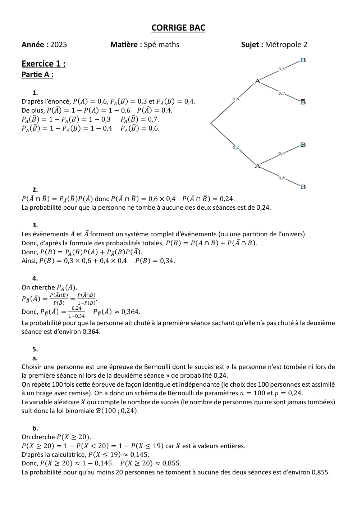
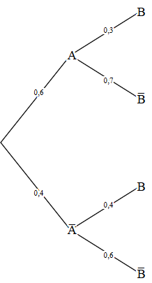
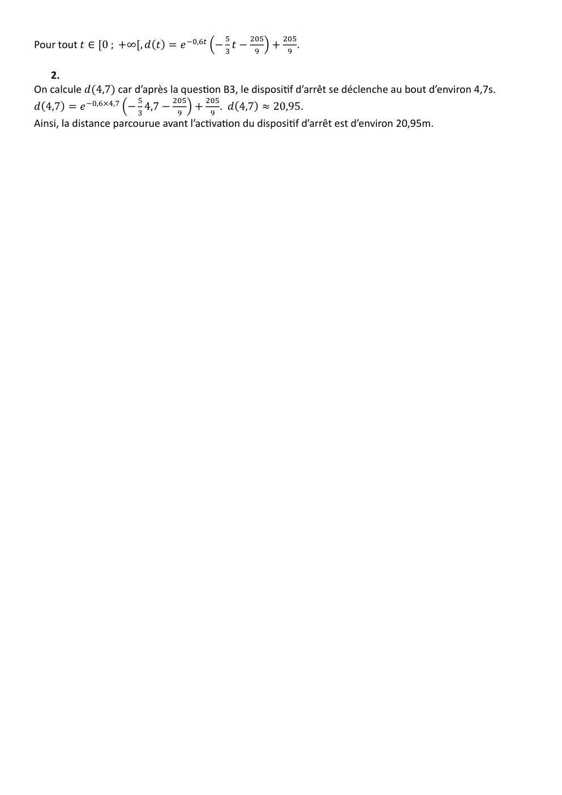

# spe-mathematiques-2025-metropole-2-corrige

> Source : `../../../pdf_version/11_maths/2025/spe-mathematiques-2025-metropole-2-corrige.pdf` — conversion Markdown (texte + visuels).
> Stratégie : [STRATEGIE_MARKDOWN.md](../../../STRATEGIE_MARKDOWN.md)

---

## Page 1

CORRIGE BAC
Année : 2025                       Matière : Spé maths                       Sujet : Métropole 2

Exercice 1 :
Partie A :

     1.
D’après l’énoncé, 𝑃(𝐴) = 0,6, 𝑃𝐴 (𝐵) = 0,3 et 𝑃𝐴̅ (𝐵) = 0,4.
De plus, 𝑃(𝐴̅) = 1 − 𝑃(𝐴) = 1 − 0,6 𝑃(𝐴̅) = 0,4.
𝑃𝐴 (𝐵̅ ) = 1 − 𝑃𝐴 (𝐵) = 1 − 0,3 𝑃𝐴 (𝐵̅) = 0,7.
𝑃𝐴̅ (𝐵̅ ) = 1 − 𝑃𝐴̅ (𝐵) = 1 − 0,4 𝑃𝐴̅ (𝐵̅ ) = 0,6.

    2.
𝑃(𝐴̅ ∩ 𝐵̅ ) = 𝑃𝐴̅ (𝐵̅ )𝑃(𝐴̅) donc 𝑃(𝐴̅ ∩ 𝐵̅ ) = 0,6 × 0,4 𝑃(𝐴̅ ∩ 𝐵̅ ) = 0,24.
La probabilité pour que la personne ne tombe à aucune des deux séances est de 0,24.

    3.
Les événements 𝐴 et 𝐴̅ forment un système complet d’événements (ou une partition de l’univers).
Donc, d’après la formule des probabilités totales, 𝑃(𝐵) = 𝑃(𝐴 ∩ 𝐵) + 𝑃(𝐴̅ ∩ 𝐵).
Donc, 𝑃(𝐵) = 𝑃𝐴 (𝐵)𝑃(𝐴) + 𝑃𝐴̅ (𝐵)𝑃(𝐴̅).
Ainsi, 𝑃(𝐵) = 0,3 × 0,6 + 0,4 × 0,4 𝑃(𝐵) = 0,34.

     4.
On cherche 𝑃𝐵̅ (𝐴̅).
           𝑃(𝐴̅∩𝐵̅)   𝑃(𝐴̅∩𝐵̅)
𝑃𝐵̅ (𝐴̅) =          =         .
             𝑃(𝐵̅)      1−𝑃(𝐵)
                     0,24
Donc, 𝑃𝐵̅ (𝐴̅) = 1−0,34      𝑃𝐵̅ (𝐴̅) ≈ 0,364.
La probabilité pour que la personne ait chuté à la première séance sachant qu’elle n’a pas chuté à la deuxième
séance est d’environ 0,364.

    5.
    a.
Choisir une personne est une épreuve de Bernoulli dont le succès est « la personne n’est tombée ni lors de
la première séance ni lors de la deuxième séance » de probabilité 0,24.
On répète 100 fois cette épreuve de façon identique et indépendante (le choix des 100 personnes est assimilé
à un tirage avec remise). On a donc un schéma de Bernoulli de paramètres 𝑛 = 100 et 𝑝 = 0,24.
La variable aléatoire 𝑋 qui compte le nombre de succès (le nombre de personnes qui ne sont jamais tombées)
suit donc la loi binomiale ℬ(100 ; 0,24).

    b.
On cherche 𝑃(𝑋 ≥ 20).
𝑃(𝑋 ≥ 20) = 1 − 𝑃(𝑋 < 20) = 1 − 𝑃(𝑋 ≤ 19) car 𝑋 est à valeurs entières.
D’après la calculatrice, 𝑃(𝑋 ≤ 19) ≈ 0,145.
Donc, 𝑃(𝑋 ≥ 20) ≈ 1 − 0,145 𝑃(𝑋 ≥ 20) ≈ 0,855.
La probabilité pour qu’au moins 20 personnes ne tombent à aucune des deux séances est d’environ 0,855.

---

## Page 2

c.
Comme 𝑋 suit une loi binomiale, 𝐸(𝑋) = 𝑛𝑝.
Donc, 𝐸(𝑋) = 100 × 0,24. 𝐸(𝑋) = 24.
Ainsi, on peut espérer qu’en moyenne, 24 personnes ne tombent à aucune des deux séances.

Partie B :
    1.
𝐸(𝑇) = 𝐸(𝑇1 + 𝑇2 ) = 𝐸(𝑇1 ) + 𝐸(𝑇2 ) par linéarité de l’espérance.
Donc, 𝐸(𝑇) = 40 + 60 𝐸(𝑇) = 100.
Ainsi, une personne peut espérer attendre en moyenne 100 minutes (soit 1h40min) sur le week-end, c’est-à-
dire en cumulant le temps d’attente du samedi et du dimanche.

    2.
𝑉(𝑇) = 𝑉(𝑇1 + 𝑇2 ) = 𝑉(𝑇1 ) + 𝑉(𝑇2 ) car les variables aléatoires 𝑇1 et 𝑇2 sont indépendantes.
Or, 𝜎(𝑇1 ) = √𝑉(𝑇1 ) donc 𝑉(𝑇1 ) = 𝜎(𝑇1 )2 et de même 𝑉(𝑇2 ) = 𝜎(𝑇2 )2.
Ainsi, 𝑉(𝑇) = 𝜎(𝑇1 )2 + 𝜎(𝑇2 )2 .
Donc, 𝑉(𝑇) = 102 + 16². 𝑉(𝑇) = 356.

   3.
On cherche à majorer 𝑃(60 < 𝑇 < 140).
𝑃(60 < 𝑇 < 140) = 𝑃(−40 < 𝑇 − 100 < 40) or 𝐸(𝑇) = 100 donc 𝑃(60 < 𝑇 < 140) = 𝑃(−40 < 𝑇 −
𝐸(𝑇) < 40).
Donc, 𝑃(60 < 𝑇 < 140) = 𝑃(|𝑇 − 𝐸(𝑇)| < 40) = 1 − 𝑃(|𝑇 − 𝐸(𝑇)| ≥ 40).
                                                                       𝑉(𝑇)
Or, d’après l’inégalité de Bienaymé-Tchebychev, 𝑃(|𝑇 − 𝐸(𝑇)| ≥ 40) ≤ 402
                                𝑉(𝑇)
Donc, 𝑃(60 < 𝑇 < 140) ≥ 1 − 402 car la fonction 𝑥 ↦ 1 − 𝑥 est décroissante sur ℝ (fonction affine de
coefficient directeur -1<0).
                             356
Donc, 𝑃(60 < 𝑇 < 140) ≥ 1 − 402 .
Ainsi, 𝑃(60 < 𝑇 < 140) ≥ 0,7775 ≥ 0,77.
Donc, 𝑃(60 < 𝑇 < 140) ≥ 0,77.

Exercice 2 :
Partie A :
   1.
Montrons que 𝑆 appartient aux droites 𝑑 et 𝑑′.
                                 3            1   3
                            𝑥𝑆 = 2 + 2𝑡    − 2 = 2 + 2𝑡 𝑡 = −1
On cherche 𝑡 ∈ ℝ tel que { 𝑦𝑆 = 2 + 𝑡 ⇔ { 1 = 2 + 𝑡 ⇔ {𝑡 = −1. On trouve une solution donc le point
                            𝑧𝑆 = 3 − 𝑡      4= 3−𝑡      𝑡 = −1
𝑆 appartient à la droite 𝑑.
                                                              1
                               𝑥𝑆 = 𝑠           1
                                               − =𝑠     𝑠 = −2
                                 3               2          1
On cherche 𝑠 ∈ ℝ tel que { 𝑦𝑆 = 2 + 𝑠 ⇔ { 1 = 3 + 𝑠 ⇔ 𝑠 = − 2. On trouve une solution donc le
                                              2
                             𝑧𝑆 = 3 − 2𝑠              𝑠 = −2
                                                            1
                                         4 = 3 − 2𝑠  {
point 𝑆 appartient à la droite 𝑑′.
Ainsi, 𝑑 et 𝑑′ sont sécantes en 𝑆.

---

## Page 3

2.
        a.
⃗⃗⃗⃗⃗ = (𝑥𝐵 − 𝑥𝐴 ; 𝑦𝐵 − 𝑦𝐴 ; 𝑧𝐵 − 𝑧𝐴 ) = (1 + 1 ; −1 − 2 ; 2 − 1) = (2 ; −3 ; 1).
𝐴𝐵
⃗⃗⃗⃗⃗ = (𝑥𝐶 − 𝑥𝐴 ; 𝑦𝐶 − 𝑦𝐴 ; 𝑧𝐶 − 𝑧𝐴 ) = (1 + 1 ; 1 − 2 ; 1 − 1) = (2 ; −1 ; 0).
𝐴𝐶
𝑛⃗. ⃗⃗⃗⃗⃗
     𝐴𝐵 = 1 × 2 + 2 × (−3) + 4 × 1 = 2 − 6 + 4 = 0 donc 𝑛⃗ est orthogonal à ⃗⃗⃗⃗⃗  𝐴𝐵 .
     ⃗⃗⃗⃗⃗
𝑛⃗. 𝐴𝐶 = 1 × 2 + 2 × (−1) + 4 × 0 = 2 − 2 = 0 donc 𝑛⃗ est orthogonal à 𝐴𝐶 .  ⃗⃗⃗⃗⃗
Au passage, les vecteurs ⃗⃗⃗⃗⃗
                          𝐴𝐵 et ⃗⃗⃗⃗⃗
                                 𝐴𝐶 ne sont pas colinéaires donc définissent bien le plan (𝐴𝐵𝐶). Ainsi, 𝑛⃗ est
orthogonal à deux vecteurs définissant le plan (𝐴𝐵𝐶). Donc, il est bien normal au plan (𝐴𝐵𝐶).

    b.
On connaît un vecteur normal au plan (𝐴𝐵𝐶). Ses coordonnées sont (1 ; 2 ; 4). Donc, une équation
cartésienne du plan (𝐴𝐵𝐶) est 𝑥 + 2𝑦 + 4𝑧 + 𝑑 = 0 avec 𝑑 ∈ ℝ.
De plus, 𝐶(1 ; 1 ; 1) appartient au plan (𝐴𝐵𝐶) donc ses coordonnées vérifient l’équation cartésienne ci-
dessus.
Ainsi, 1 + 2 + 4 + 𝑑 = 0 donc 𝑑 = −7.
Une équation cartésienne du plan (𝐴𝐵𝐶) est donc 𝑥 + 2𝑦 + 4𝑧 − 7 = 0.

   c.
Montrons que 𝑆 n’appartient pas au plan (𝐴𝐵𝐶).
                            1
𝑥𝑆 + 2𝑦𝑆 + 4𝑧𝑆 − 7 = − 2 + 2 × 1 + 4 × 4 − 7 = 10,5 ≠ 0 donc 𝑆 n’appartient pas au plan (𝐴𝐵𝐶).
Ainsi, les points 𝐴, 𝐵, 𝐶 et 𝑆 ne sont pas coplanaires.

      3.
      a.
Montrons que ⃗⃗⃗⃗⃗
                𝑆𝐻 est normal au plan (𝐴𝐵𝐶) et que 𝐻 appartient au plan (𝐴𝐵𝐶).
𝑥𝐻 + 2𝑦𝐻 + 4𝑧𝐻 − 7 = −1 + 2 × 0 + 4 × 2 − 7 = 0 car 𝐻 appartient au plan (𝐴𝐵𝐶).
⃗⃗⃗⃗⃗ = (𝑥𝐻 − 𝑥𝑆 ; 𝑦𝐻 − 𝑦𝑆 ; 𝑧𝐻 − 𝑧𝑆 ) = (−1 + 1 ; 0 − 1 ; 2 − 4) = (− 1 ; −1 ; −2) = − 1 𝑛⃗. Donc 𝑆𝐻
𝑆𝐻                                                                                                 ⃗⃗⃗⃗⃗ est
                                               2                           2               2
                                                               ⃗⃗⃗⃗⃗ est normal au plan (𝐴𝐵𝐶).
colinéaire à 𝑛⃗ qui est normal au plan (𝐴𝐵𝐶) d’après 2a. Donc, 𝑆𝐻
Ainsi, 𝐻 est le projeté orthogonal de 𝑆 sur le plan (𝐴𝐵𝐶).

   b.
                                                                     1 2                       21   √21
On en déduit que la distance de 𝑆 au plan (𝐴𝐵𝐶) est 𝑆𝐻 = √(− 2) + (−1)2 + (−2)2 = √ 4 =                .
                                                                                                     2
Donc, la distance 𝑆𝑀 avec 𝑀 dans le plan (𝐴𝐵𝐶) est minimale lorsque 𝑀 = 𝐻. Ainsi, pour tout point 𝑀 du
                                       √21
plan (𝐴𝐵𝐶), 𝑆𝑀 ≥ 𝑆𝐻 donc 𝑆𝑀 ≥             .
                                        2
                                                              √21
Ainsi, il n’existe aucun point 𝑀 du plan (𝐴𝐵𝐶) tel que 𝑆𝑀 <      .
                                                               2

Partie B :
   1.
                                             1                        3
⃗⃗⃗⃗
𝐶𝑆 = (𝑥𝑆 − 𝑥𝐶 ; 𝑦𝑆 − 𝑦𝐶 ; 𝑧𝑆 − 𝑧𝐶 ) = (− 2 − 1 ; 1 − 1 ; 4 − 1) = (− 2 ; 0 ; 3).
De plus, en posant 𝑀(𝑥 ; 𝑦 ; 𝑧), on a ⃗⃗⃗⃗⃗⃗
                                      𝐶𝑀 = (𝑥 − 𝑥𝐶 ; 𝑦 − 𝑦𝐶 ; 𝑧 − 𝑧𝐶 ) = (𝑥 − 1 ; 𝑦 − 1 ; 𝑧 − 1).
                        3
    ⃗⃗⃗⃗⃗⃗ = 𝑘𝐶𝑆
Or, 𝐶𝑀        ⃗⃗⃗⃗ = (− 𝑘 ; 0 ; 3𝑘).
                       2
                    3                  3
       𝑥 − 1 = −2𝑘   𝑥 = 1 − 2𝑘
Donc, { 𝑦 − 1 = 0 ⇔ { 𝑦 = 1 .
          𝑧 − 1 = 3𝑘         𝑧 = 3𝑘 + 1
                   3
Ainsi, on a 𝑀 (1 − 2 𝑘 ; 1 ; 3𝑘 + 1).

---

## Page 4

2.
On cherche 𝑀 tel que 𝑀𝐴𝐵 soit rectangle en 𝑀, c’est-à-dire ⃗⃗⃗⃗⃗⃗
                                                             𝐴𝑀. ⃗⃗⃗⃗⃗⃗
                                                                  𝐵𝑀 = 0.
                                              3
⃗⃗⃗⃗⃗⃗ = (𝑥𝑀 − 𝑥𝐴 ; 𝑦𝑀 − 𝑦𝐴 ; 𝑧𝑀 − 𝑧𝐴 ) = (2 − 𝑘 ; −1 ; 3𝑘).
𝐴𝑀
                                                         2
                                         3
⃗⃗⃗⃗⃗⃗
𝐵𝑀 = (𝑥𝑀 − 𝑥𝐵 ; 𝑦𝑀 − 𝑦𝐵 ; 𝑧𝑀 − 𝑧𝐵 ) = (− 2 𝑘 ; 2 ; 3𝑘 − 1).
                 3          3                                 9                      1
⃗⃗⃗⃗⃗⃗
𝐴𝑀. ⃗⃗⃗⃗⃗⃗
       𝐵𝑀 = (2 − 2 𝑘) (− 2 𝑘) − 1 × 2 + 3𝑘(3𝑘 − 1) = −3𝑘 + 4 𝑘 2 − 2 + 9𝑘 2 − 3𝑘 = 4 (45𝑘 2 − 24𝑘 −
8).
                                       1
On cherche 𝑘 tel que ⃗⃗⃗⃗⃗⃗
                      𝐴𝑀. ⃗⃗⃗⃗⃗⃗
                              𝐵𝑀 = 0 ⇔ 4 (45𝑘 2 − 24𝑘 − 8) = 0 ⇔ 45𝑘 2 − 24𝑘 − 8 = 0.
On a une équation du second degré.
Calcul du discriminant : Δ = 242 − 4 × 45 × (−8) = 2016. Δ > 0 donc il y a deux solutions.
                                   24+√2016                  24−√2016
Les deux solutions sont 𝑘1 =           et 𝑘2 =            .
                                  90               90
𝑘1 ≈ 0,76 ∈ [0 ; 1] donc l’équation admet (au moins) une solution dans [0 ; 1].
Ainsi, il existe un point 𝑀 du segment [𝐶𝑆] tel que le triangle 𝐴𝑀𝐵 est rectangle en 𝑀.

Exercice 3 :
Affirmation 1 :
                                            1        5 𝑛     1
                           1+5𝑛     5𝑛 (1+ 𝑛 )       ( ) (1+ 𝑛 )
                                           5         3      5
Pour tout 𝑛 ∈ ℕ, 𝑢𝑛 = 2+3𝑛 = 𝑛 2                 =      2        .
                                    3 ( 𝑛 +1)             +1
                                       3               3𝑛
             1            1 𝑛          1                           1 𝑛
Or, lim 5𝑛 = lim (5) or 0 < 5 < 1 donc lim (5) = 0
   𝑛→+∞           𝑛→+∞                                  𝑛→+∞
                            1
Par somme, lim (1 + 5𝑛) = 1.
                 𝑛→+∞
                           1                1                                              2
De même, comme 0 < 3 < 1, lim 3𝑛 = 0. Donc, par produit puis par somme, lim (3𝑛 + 1) = 1.
                                     𝑛→+∞                                          𝑛→+∞
         5                        5 𝑛
De plus, 3 > 1 donc lim (3) = +∞. Par produit et quotient, lim 𝑢𝑛 = +∞.
                         𝑛→+∞                                            𝑛→+∞
Donc, l’affirmation 1 est fausse.

Affirmation 2 :
Montrons par récurrence que pour tout 𝑛 ∈ ℕ, 𝑤𝑛 ≥ 𝑛.
Initialisation : 𝑤0 = 0 ≥ 0 donc la propriété est vraie au rang 𝑘 = 0.
Hérédité : Soit 𝑘 ∈ ℕ tel que la propriété soit vraie. Montrons qu’elle est vraie au rang 𝑘 + 1.
D’après la relation de récurrence, 𝑤𝑘+1 = 3𝑤𝑘 − 2𝑘 + 3.
Or, d’après l’hypothèse de récurrence, 𝑤𝑘 ≥ 𝑘 donc 3𝑤𝑘 ≥ 3𝑘 (on multiplie par 3>0).
Donc, 3𝑤𝑘 − 2𝑘 + 3 ≥ 3𝑘 − 2𝑘 + 3 (on ajoute -2k+3).
Ainsi, 𝑤𝑘+1 ≥ 𝑘 + 3 ≥ 𝑘 + 1 donc 𝑤𝑘+1 ≥ 𝑘 + 1. La propriété est héréditaire.
Conclusion : La propriété est vraie au rang 𝑘 = 0 et elle est héréditaire donc d’après le principe de récurrence,
elle est vraie à tout rang.
Ainsi, pour tout 𝑛 ∈ ℕ, 𝑤𝑛 ≥ 𝑛. L’affirmation 2 est vraie.

Affirmation 3 :
On remarque que 𝑇, la tangente à 𝐶𝑓 au point d’abscisse 8 est au-dessus de 𝐶𝑓 au voisinage de 8 donc 𝑓 est
concave au voisinage de 8.
Donc, 𝑓 n’est pas convexe sur son ensemble de définition.
Ainsi, l’affirmation 3 est fausse.

Affirmation 4 :
Soit 𝑔 ∶ 𝑥 ↦ ln(𝑥).
                                                                          1                1
𝑔 est deux fois dérivable sur ]0 ; +∞[. Pour tout 𝑥 ∈ ]0 ; +∞[, 𝑔′ (𝑥) = 𝑥 et 𝑔′′ (𝑥) = − 𝑥 2.
Pour tout 𝑥 ∈ ]0 ; +∞[, 𝑔′′ (𝑥) ≤ 0 donc 𝑔 est concave sur ]0 ; +∞[.
Ainsi, la courbe de 𝑔 est en-dessous de ses tangentes, et en particulier de sa tangente au point d’abscisse 1.

---

## Page 5

L’équation de la tangente au point d’abscisse 1 à la courbe de 𝑔 est 𝑦 = 𝑔′ (1)(𝑥 − 1) + 𝑔(1), qui se réécrit
𝑦 = 1(𝑥 − 1) + ln (1) soit 𝑦 = 𝑥 − 1.
Donc, pour tout 𝑥 > 0, 𝑔(𝑥) ≤ 𝑥 − 1 donc ln(𝑥) ≤ 𝑥 − 1
Ainsi, pour tout 𝑥 > 0, ln(𝑥) − 𝑥 + 1 ≤ 0.
Donc, l’affirmation 4 est vraie.

Exercice 4 :
Partie A :
    1.
Le chariot aura parcouru 15m au bout de 2 secondes.

    2.
La longueur minimale à prévoir pour la zone de freinage est de 22,8m.

      3.
    ′ (4,7)
𝑑             = 1. Ainsi la vitesse instantanée du chariot au bout de 4,7 secondes est de 1 m/s.

Partie B :
    1.
    a.
(𝐸 ) ⇔ 𝑦 ′ = −0,6𝑦. Il s’agit d’une équation différentielle de la forme 𝑦 ′ = 𝑎𝑦 avec 𝑎 = −0,6.
  ′

Les solutions sont donc les fonctions de la forme 𝑡 ↦ 𝐴𝑒 𝑎𝑡 , soit 𝑡 ↦ 𝐴𝑒 −0,6𝑡 avec 𝐴 ∈ ℝ.

   b.
𝑔 est dérivable sur [0 ; +∞[. Pour tout 𝑡 ∈ [0 ; +∞[, 𝑔′ (𝑡) = 𝑒 −0,6𝑡 − 0,6𝑡𝑒 −0,6𝑡 .
Pour tout 𝑡 ∈ [0 ; +∞[, 𝑔′ (𝑡) + 0,6𝑔(𝑡) = 𝑒 −0,6𝑡 − 0,6𝑡𝑒 −0,6𝑡 + 0,6𝑒 −0,6𝑡 = 𝑒 −0,6𝑡 .
Ainsi, 𝑔 est bien solution de l’équation différentielle (𝐸).

    c.
La question précédente permet de dire que 𝑔 ∶ 𝑡 ↦ 𝑡𝑒 −0,6𝑡 est une solution particulière de (𝐸) et on a résolu
l’équation homogène associée à la question 1a.
Ainsi, les solutions de (𝐸) sont les fonctions de la forme 𝑡 ↦ 𝐴𝑒 −0,6𝑡 + 𝑡𝑒 −0,6𝑡 avec 𝐴 ∈ ℝ.

    d.
𝑣 est solution de (𝐸) donc il existe 𝐴 ∈ ℝ tel que pour tout 𝑡 ∈ [0 ; +∞[, 𝑣(𝑡) = 𝐴𝑒 −0,6𝑡 + 𝑡𝑒 −0,6𝑡
Or, 𝑣(0) = 12. D’autre part,𝑣(0) = 𝐴𝑒 0 + 0𝑒 0 = 𝐴. Ainsi, 𝐴 = 12.
Donc, pour tout 𝑡 ∈ [0 ; +∞[, 𝑣(𝑡) = 12𝑒 −0,6𝑡 + 𝑡𝑒 −0,6𝑡
Pour tout 𝑡 ∈ [0 ; +∞[, 𝑣(𝑡) = (12 + 𝑡)𝑒 −0,6𝑡 .

    2.
    a.
𝑣 est dérivable sur [0 ; +∞[ comme produit de fonctions dérivables.
Pour tout 𝑡 ∈ [0 ; +∞[, 𝑣 ′ (𝑡) = 𝑒 −0,6𝑡 − 0,6(12 + 𝑡)𝑒 −0,6𝑡 par dérivation d’un produit.
Pour tout 𝑡 ∈ [0 ; +∞[, 𝑣 ′ (𝑡) = (1 − 0,6 × 12 − 0,6𝑡)𝑒 −0,6𝑡 .
Pour tout 𝑡 ∈ [0 ; +∞[, 𝑣 ′ (𝑡) = (−6,2 − 0,6𝑡)𝑒 −0,6𝑡 .

   b.
                       𝑋
lim 0,6𝑡 = +∞, or lim 𝑒 𝑋 = 0 par croissance comparée.
𝑡→+∞                      𝑋→+∞
                                   0,6𝑡
Donc, par composition, lim 𝑒 0,6𝑡 = 0.
                             𝑡→+∞
                              1   0,6𝑡
Donc, par produit, lim 0,6 × 𝑒 0,6𝑡 = 0
                        𝑡→+∞

---

## Page 6

De plus, lim −0,6𝑡 = −∞. Or, lim 𝑒 𝑋 = 0 donc par composition lim 𝑒 −0,6𝑡 = 0.
          𝑡→+∞                   𝑋→−∞                                             𝑡→+∞
Par produit, lim 12𝑒 −0,6𝑡 = 0
               𝑡→+∞
Par somme, lim 𝑣(𝑡) = 0.
               𝑡→+∞

   c.
Pour tout 𝑡 ∈ [0 ; +∞[, 𝑒 −0,6𝑡 > 0 donc la fonction 𝑣′ est du même signe que la fonction 𝑡 ↦ −6,2 − 0,6𝑡.
                                                    6,2          31      31
Pour tout 𝑡 ∈ [0 ; +∞[, −6,2 − 0,6𝑡 = 0 ⇔ 𝑡 = − 0,6 ⇔ 𝑡 = − 3 . Or, − 3 < 0.
Cette fonction est affine de coefficient directeur −0,6 < 0.
On a donc le tableau suivant :
        𝑡        0                                                                                                      +∞
    Signe de                                               -
 −6,2 − 0,6𝑡
    Signe de                                               -
      𝑣′(𝑡)
                  12
 Variations de
        𝑣
                                                                                                                        0

    d.
La fonction 𝑣 est continue (car dérivable) et strictement (car 𝑣′ ne s’annule pas sur [0 ; +∞[) décroissante
sur [0 ; +∞[.
𝑣(0) = 12, lim 𝑣(𝑡) = 0 et 1 ∈ [0 ; 12].
               𝑡→+∞
Donc, d’après le corollaire du théorème des valeurs intermédiaires, l’équation 𝑣(𝑡) = 1 admet une unique
solution 𝛼 sur [0 ; +∞[.
D’après la calculatrice, 𝑣(4,69) ≈ 1,0008 > 1 et 𝑣(4,7) ≈ 0,9954 < 1 donc 4,69 < 𝛼 < 4,7.
Ainsi, 𝛼 ≈ 4,7 au dixième.

   3.
Comme la fonction 𝑣 est décroissante 𝑣(𝑡) ≤ 1 ⇔ 𝑡 ≥ 𝛼, donc le système mécanique se déclenche dès que
𝑣(𝑡) = 1. D’après la question précédente, il se déclenche au bout de 4,7 secondes.

Partie C :
    1.
                              𝑡
On cherche à calculer 𝑑(𝑡) = ∫0 (12 + 𝑥)𝑒 −0,6𝑥 𝑑𝑥.
Intégrons par parties.
                                                                                            𝑒 −0,6𝑥
On pose : 𝑢′ (𝑥) = 𝑒 −0,6𝑥 et 𝑣(𝑥) = 12 + 𝑥. Donc, on peut prendre 𝑢(𝑥) = −                           et 𝑣 ′ (𝑥) = 1.
                                                                                             0,6
Les fonctions 𝑢 et 𝑣 sont dérivables et de dérivée continue sur [0 ; +∞[.
Donc, pour tout 𝑡 ∈ [0 ; +∞[, elles le sont en particulier sur [0 ; 𝑡].
                                        𝑡                                 𝑡
Ainsi, pour tout 𝑡 ∈ [0; +∞[, 𝑑(𝑡) = ∫0 𝑢′ (𝑥)𝑣(𝑥)𝑑𝑥 = [𝑢(𝑥)𝑣(𝑥)]𝑡0 − ∫0 𝑢(𝑥)𝑣 ′ (𝑥)𝑑𝑥.
                                    (12+𝑥)𝑒 −0,6𝑥 𝑡      𝑡      𝑒 −0,6𝑥
Pour tout 𝑡 ∈ [0 ; +∞[, 𝑑(𝑡) = [−                 ] − ∫0 −                  𝑑𝑥.
                                         0,6       0              0,6
                                  (12+𝑡)𝑒 −0,6𝑡                         𝑡
                                                    12       𝑒 −0,6𝑥              𝑒 −0,6𝑥                               𝑒 −0,6𝑥
                       𝑑(𝑡) = −                   + 0,6 − [ 0,62 ] car 𝑥 ↦ 0,62 est une primitive de 𝑥 ↦ −
                                       0,6                              0                                                   0,6
sur [0 ; 𝑡].
                                  (12+𝑡)𝑒 −0,6𝑡     12   𝑒 −0,6𝑡            1
                       𝑑(𝑡) = −        0,6
                                                  + 0,6 − 0,36 + 0,36

---

## Page 7

5   205    205
Pour tout 𝑡 ∈ [0 ; +∞[, 𝑑(𝑡) = 𝑒 −0,6𝑡 (− 3 𝑡 − 9 ) + 9 .

   2.
On calcule 𝑑(4,7) car d’après la question B3, le dispositif d’arrêt se déclenche au bout d’environ 4,7s.
                       5       205     205
𝑑(4,7) = 𝑒 −0,6×4,7 (− 3 4,7 − 9 ) + 9 . 𝑑(4,7) ≈ 20,95.
Ainsi, la distance parcourue avant l’activation du dispositif d’arrêt est d’environ 20,95m.

