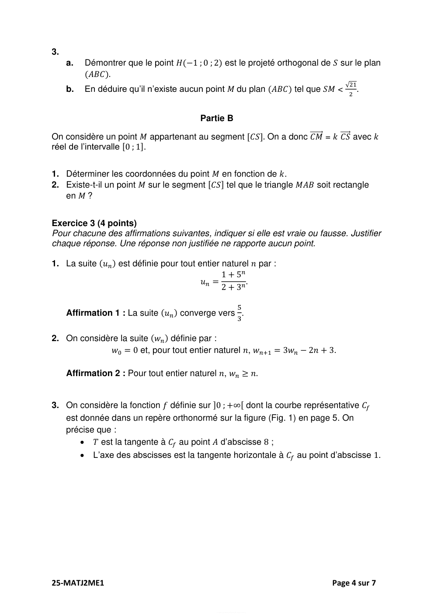
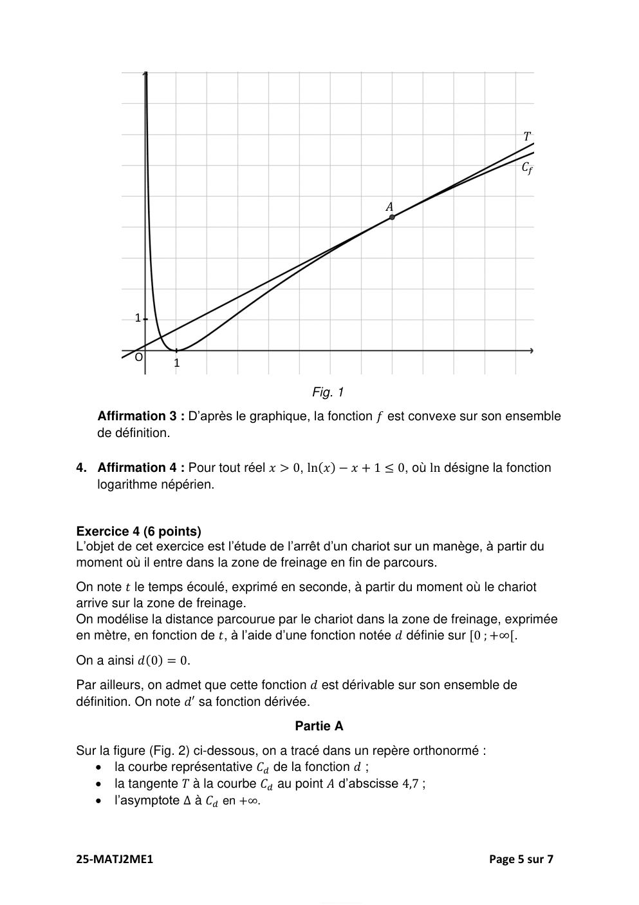
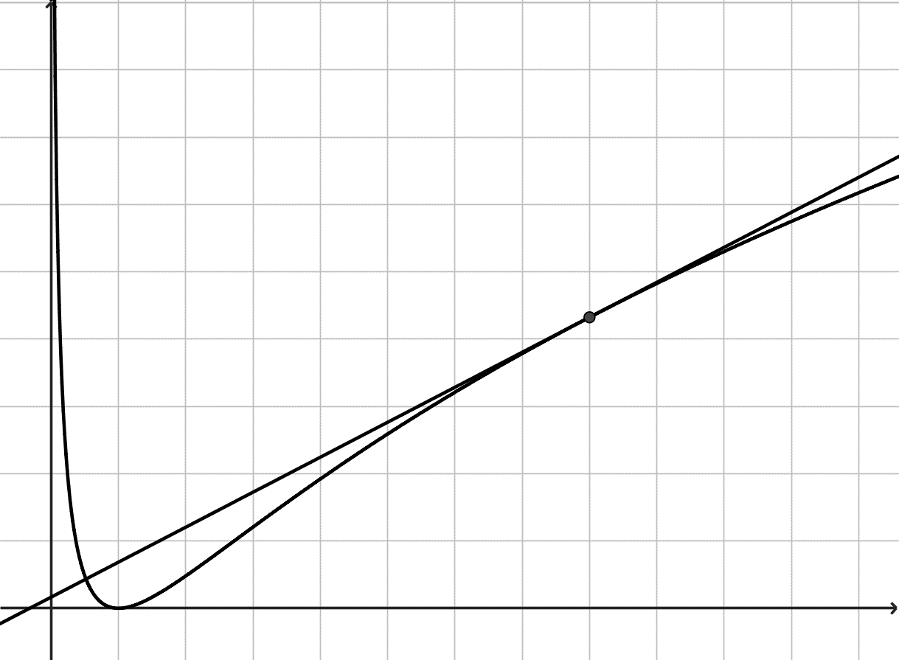
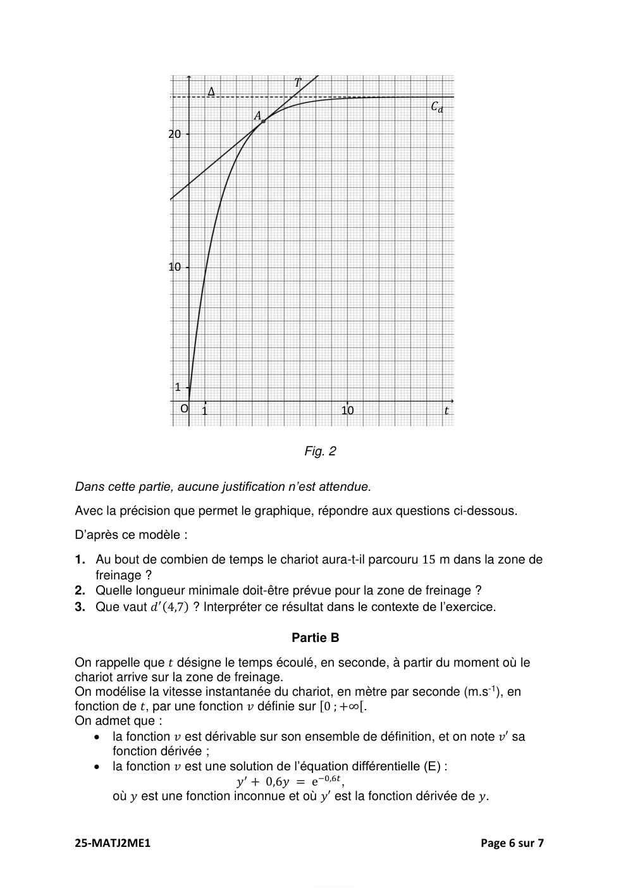
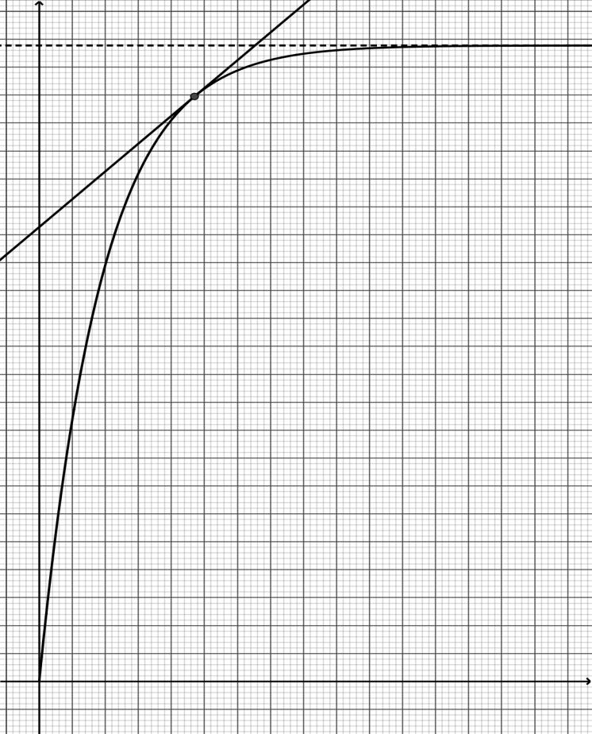

# spe-mathematiques-2025-metropole-2-sujet-officiel

> Source : `../../../pdf_version/11_maths/2025/spe-mathematiques-2025-metropole-2-sujet-officiel.pdf` — conversion Markdown (texte + visuels).
> Stratégie : [STRATEGIE_MARKDOWN.md](../../../STRATEGIE_MARKDOWN.md)

---

## Page 1

BACCALAURÉAT GÉNÉRAL

                  ÉPREUVE D’ENSEIGNEMENT DE SPÉCIALITÉ

                                  SESSION 2025

                           MATHÉMATIQUES

                        Mercredi 18 juin 2025
                            Durée de l’épreuve : 4 heures

           L’usage de la calculatrice avec mode examen actif est autorisé.
        L’usage de la calculatrice sans mémoire « type collège » est autorisé.

          Dès que ce sujet vous est remis, assurez-vous qu’il est complet.
                Ce sujet comporte 7 pages numérotées de 1 à 7.

Le candidat doit traiter les quatre exercices proposés.

Le candidat est invité à faire figurer sur la copie toute trace de recherche, même
incomplète ou non fructueuse, qu’il aura développée.

La qualité de la rédaction, la clarté et la précision des raisonnements seront prises en
compte dans l’appréciation de la copie. Les traces de recherche, même incomplètes
ou infructueuses, seront valorisées.

25-MATJ2ME1                                                               Page 1 sur 7

---

## Page 2

Exercice 1 (5 points)
Les deux parties peuvent être traitées indépendamment.

Dans cet exercice, on s’intéresse à des personnes venues séjourner dans un centre
multisports au cours d’un week-end.
Les résultats des probabilités demandées seront arrondis au millième si nécessaire.

                                        Partie A
Le centre propose aux personnes venues pour un week-end une formule d’initiation
au roller composée de deux séances de cours. On choisit au hasard une personne
parmi celles ayant souscrit à cette formule.

On désigne par 𝐴 et 𝐵 les évènements suivants :
   • 𝐴 : « La personne chute pendant la première séance » ;
   • 𝐵 : « La personne chute pendant la deuxième séance ».
Pour un événement 𝐸 quelconque, on note 𝑃(𝐸) sa probabilité et 𝐸 son événement
contraire.

Des observations permettent d’admettre que 𝑃(𝐴) = 0,6.

De plus on constate que :
   • Si la personne chute pendant la première séance, la probabilité qu’elle chute
      pendant la deuxième est de 0,3 ;
   • Si la personne ne chute pas pendant la première séance, la probabilité qu’elle
      chute pendant la deuxième est de 0,4.

1. Représenter la situation par un arbre pondéré.

2. Calculer la probabilité 𝑃(𝐴 ∩ 𝐵) et interpréter le résultat.

3. Montrer que 𝑃(𝐵) = 0,34.

4. La personne ne chute pas pendant la deuxième séance de cours. Calculer la
   probabilité qu’elle n’ait pas chuté lors de la première séance.

5. On appelle 𝑋 la variable aléatoire qui, à chaque échantillon de 100 personnes
   ayant souscrit à la formule, associe le nombre d’entre elles n’ayant chuté ni lors
   de la première ni lors de la deuxième séance. On assimile le choix d’un
   échantillon de 100 personnes à un tirage avec remise.
   On admet que la probabilité qu’une personne ne chute ni lors de la première ni
   lors de la deuxième séance est de 0,24.

    a.   Montrer que la variable aléatoire 𝑋 suit une loi binomiale dont on précisera
         les paramètres.
    b.   Quelle est la probabilité d’avoir, dans un échantillon de 100 personnes ayant
         souscrit à la formule, au moins 20 personnes qui ne chutent ni lors de la
         première ni lors de la deuxième séance ?
    c.   Calculer l’espérance 𝐸(𝑋) et interpréter le résultat dans le contexte de
         l’exercice.

25-MATJ2ME1                                                                                        Page 2 sur 7

                                             EducN_MMDQ0Mj5UyMjAayMT9M2MtjAyNj9A1MjEHwMzcE4MJzAg

---

## Page 3

Partie B
On choisit au hasard une personne venue un week-end au centre multisports. On
note 𝑇1 la variable aléatoire donnant son temps d’attente total en minute avant les
accès aux activités sportives pendant la journée du samedi, et 𝑇2 la variable aléatoire
donnant son temps d’attente total en minute avant les accès aux activités sportives
pendant la journée du dimanche.
On admet que :
 • 𝑇1 suit une loi de probabilité d’espérance 𝐸(𝑇1 ) = 40 et d’écart-type 𝜎(𝑇1 ) = 10 ;
 • 𝑇2 suit une loi de probabilité d’espérance 𝐸(𝑇2 ) = 60 et d’écart-type 𝜎(𝑇2 ) = 16 ;
 • les variables aléatoires 𝑇1 et 𝑇2 sont indépendantes.

On note 𝑇 la variable aléatoire donnant le temps total d’attente avant les accès aux
activités sportives lors des deux jours, exprimé en minute. Ainsi on a 𝑇 = 𝑇1 + 𝑇2 .

1. Déterminer l’espérance 𝐸(𝑇) de la variable aléatoire 𝑇. Interpréter le résultat
   dans le contexte de l’exercice.
2. Montrer que la variance 𝑉(𝑇) de la variable aléatoire 𝑇 est égale à 356.
3. À l’aide de l’inégalité de Bienaymé-Tchebychev, montrer que, pour une personne
   choisie au hasard parmi celles venues un week-end au centre multisports, la
   probabilité que son temps total d’attente 𝑇 soit strictement compris entre 60 et
   140 minutes est supérieure à 0,77.

Exercice 2 (5 points)
                                                      ⃗⃗ ).
L’espace est muni d’un repère orthonormé (𝑂 ; 𝑖⃗, 𝑗⃗, 𝑘
On considère :
   • les points 𝐴(−1 ; 2 ; 1), 𝐵(1 ; −1 ; 2) et 𝐶(1 ; 1 ; 1) ;
   • la droite 𝑑 dont une représentation paramétrique est donnée par :
                                         3
                                    𝑥 = 2 + 2𝑡
                               𝑑 : {𝑦 = 2 + 𝑡 avec 𝑡 𝜖 ℝ ;
                                    𝑧 =3−𝑡

     •    la droite 𝑑′ dont une représentation paramétrique est donnée par :
                                          𝑥=𝑠
                                              3
                                    𝑑’ : {𝑦 = 2 + 𝑠  avec 𝑠 𝜖 ℝ.
                                          𝑧 = 3 − 2𝑠

                                         Partie A
                                                                                                   1
1. Montrer que les droites 𝑑 et 𝑑’ sont sécantes au point 𝑆 (− 2 ; 1 ; 4).

2.
                                       1
     a.    Montrer que le vecteur 𝑛⃗⃗ (2) est un vecteur normal au plan (𝐴𝐵𝐶).
                                       4
     b.    En déduire qu’une équation cartésienne du plan (𝐴𝐵𝐶) est :
                                     𝑥 + 2𝑦 + 4𝑧 – 7 = 0
     c.    Démontrer que les points 𝐴, 𝐵, 𝐶 et 𝑆 ne sont pas coplanaires.

25-MATJ2ME1                                                                                            Page 3 sur 7

                                             EducN_MMDQ0Mj5UyMjAayMT9M2MtjAyNj9A1MjEHwMzcE4MJzAg

---

## Page 4

3.
     a.       Démontrer que le point 𝐻(−1 ; 0 ; 2) est le projeté orthogonal de 𝑆 sur le plan
              (𝐴𝐵𝐶).
                                                                                                          √21
     b.       En déduire qu’il n’existe aucun point 𝑀 du plan (𝐴𝐵𝐶) tel que 𝑆𝑀 <                             .
                                                                                                           2

                                            Partie B
                                                               ⃗⃗⃗⃗⃗⃗⃗ = 𝑘 𝐶𝑆
On considère un point 𝑀 appartenant au segment [𝐶𝑆]. On a donc 𝐶𝑀          ⃗⃗⃗⃗⃗ avec 𝑘
réel de l’intervalle [0 ; 1].

1. Déterminer les coordonnées du point 𝑀 en fonction de 𝑘.
2. Existe-t-il un point 𝑀 sur le segment [𝐶𝑆] tel que le triangle 𝑀𝐴𝐵 soit rectangle
   en 𝑀 ?

Exercice 3 (4 points)
Pour chacune des affirmations suivantes, indiquer si elle est vraie ou fausse. Justifier
chaque réponse. Une réponse non justifiée ne rapporte aucun point.

1. La suite (𝑢𝑛 ) est définie pour tout entier naturel 𝑛 par :
                                               1 + 5𝑛
                                         𝑢𝑛 =         .
                                               2 + 3𝑛

                                                                                    5
     Affirmation 1 : La suite (𝑢𝑛 ) converge vers .
                                                                                    3

2. On considère la suite (𝑤𝑛 ) définie par :
             𝑤0 = 0 et, pour tout entier naturel 𝑛, 𝑤𝑛+1 = 3𝑤𝑛 − 2𝑛 + 3.

     Affirmation 2 : Pour tout entier naturel 𝑛, 𝑤𝑛 ≥ 𝑛.

3. On considère la fonction 𝑓 définie sur ]0 ; +∞[ dont la courbe représentative 𝐶𝑓
   est donnée dans un repère orthonormé sur la figure (Fig. 1) en page 5. On
   précise que :
       • 𝑇 est la tangente à 𝐶𝑓 au point 𝐴 d’abscisse 8 ;
          •     L’axe des abscisses est la tangente horizontale à 𝐶𝑓 au point d’abscisse 1.

25-MATJ2ME1                                                                                            Page 4 sur 7

                                                 EducN_MMDQ0Mj5UyMjAayMT9M2MtjAyNj9A1MjEHwMzcE4MJzAg

---

## Page 5

𝑇

                                                                                                            𝐶𝑓

                                                                                                  𝐴

          1

          O      1

                                           Fig. 1
   Affirmation 3 : D’après le graphique, la fonction 𝑓 est convexe sur son ensemble
   de définition.

4. Affirmation 4 : Pour tout réel 𝑥 > 0, ln(𝑥) − 𝑥 + 1 ≤ 0, où ln désigne la fonction
   logarithme népérien.

Exercice 4 (6 points)
L’objet de cet exercice est l’étude de l’arrêt d’un chariot sur un manège, à partir du
moment où il entre dans la zone de freinage en fin de parcours.
On note 𝑡 le temps écoulé, exprimé en seconde, à partir du moment où le chariot
arrive sur la zone de freinage.
On modélise la distance parcourue par le chariot dans la zone de freinage, exprimée
en mètre, en fonction de 𝑡, à l’aide d’une fonction notée 𝑑 définie sur [0 ; +∞[.
On a ainsi 𝑑(0) = 0.
Par ailleurs, on admet que cette fonction 𝑑 est dérivable sur son ensemble de
définition. On note 𝑑′ sa fonction dérivée.
                                        Partie A
Sur la figure (Fig. 2) ci-dessous, on a tracé dans un repère orthonormé :
   • la courbe représentative 𝐶𝑑 de la fonction 𝑑 ;
   • la tangente 𝑇 à la courbe 𝐶𝑑 au point 𝐴 d’abscisse 4,7 ;
   • l’asymptote Δ à 𝐶𝑑 en +∞.

25-MATJ2ME1                                                                                           Page 5 sur 7

                                            EducN_MMDQ0Mj5UyMjAayMT9M2MtjAyNj9A1MjEHwMzcE4MJzAg

---

## Page 6

𝑇
                        Δ
                                                                                                   𝐶𝑑
                                 𝐴
                 20 -

                 10 -

                  1-
                        -

                                                                              -

                  OO    1                                                    10                         𝑡

                                            Fig. 2

Dans cette partie, aucune justification n’est attendue.
Avec la précision que permet le graphique, répondre aux questions ci-dessous.
D’après ce modèle :
1. Au bout de combien de temps le chariot aura-t-il parcouru 15 m dans la zone de
   freinage ?
2. Quelle longueur minimale doit-être prévue pour la zone de freinage ?
3. Que vaut 𝑑′ (4,7) ? Interpréter ce résultat dans le contexte de l’exercice.

                                        Partie B
On rappelle que 𝑡 désigne le temps écoulé, en seconde, à partir du moment où le
chariot arrive sur la zone de freinage.
On modélise la vitesse instantanée du chariot, en mètre par seconde (m.s-1), en
fonction de 𝑡, par une fonction 𝑣 définie sur [0 ; +∞[.
On admet que :
   • la fonction 𝑣 est dérivable sur son ensemble de définition, et on note 𝑣′ sa
       fonction dérivée ;
   • la fonction 𝑣 est une solution de l’équation différentielle (E) :
                               𝑦 ′ + 0,6𝑦 = e−0,6𝑡 ,
       où 𝑦 est une fonction inconnue et où 𝑦′ est la fonction dérivée de 𝑦.

25-MATJ2ME1                                                                                                 Page 6 sur 7

                                             EducN_MMDQ0Mj5UyMjAayMT9M2MtjAyNj9A1MjEHwMzcE4MJzAg

---

## Page 7

On précise de plus que, lors de son arrivée sur la zone de freinage, la vitesse du
chariot est égale à 12 m.s-1, c’est-à-dire 𝑣(0) = 12.
1.
     a.   On considère l’équation différentielle (E’) : 𝑦′ + 0,6𝑦 = 0.
          Déterminer les solutions de l’équation différentielle (E’) sur [0 ; +∞[.
     b.   Soit 𝑔 la fonction définie sur [0 ; +∞[ par 𝑔(𝑡) = 𝑡e−0,6𝑡 .
          Vérifier que la fonction 𝑔 est une solution de l’équation différentielle (E).
     c.   En déduire les solutions de l’équation différentielle (E) sur [0 ; +∞[.
     d.   En déduire que pour tout réel 𝑡 appartenant à l’intervalle [0 ; +∞[, on a :
                                        𝑣(𝑡) = (12 + 𝑡)e−0,6𝑡 .

2. Dans cette question, on étudie la fonction 𝑣 sur [0 ; +∞[.

     a.   Montrer que pour tout réel 𝑡 ∈ [0 ; +∞[, 𝑣′(𝑡) = (−6,2 − 0,6𝑡)e−0,6𝑡 .
     b.   En admettant que :
                                                1     0,6𝑡
                             𝑣(𝑡) = 12e−0,6𝑡 + 0,6 × e0,6𝑡 ,
          déterminer la limite de 𝑣 en +∞.
     c.   Étudier le sens de variation de la fonction 𝑣 et dresser son tableau de
          variation complet. Justifier.
     d.   Montrer que l’équation 𝑣(𝑡) = 1 admet une solution unique 𝛼, dont on
          donnera une valeur approchée au dixième.

3. Lorsque la vitesse du chariot est inférieure ou égale à 1 mètre par seconde, un
   système mécanique se déclenche permettant son arrêt complet. Déterminer au
   bout de combien de temps ce système entre en action. Justifier.
                                          Partie C
On rappelle que pour tout réel 𝑡 appartenant à l’intervalle [0 ; +∞[ :
                                   𝑣(𝑡) = (12 + 𝑡)e−0,6𝑡 .
On admet que pour tout réel 𝑡 dans l’intervalle [0 ; +∞[ :
                                              𝑡
                                     𝑑(𝑡) = ∫ 𝑣(𝑥) 𝑑𝑥.
                                             0

1. À l’aide d’une intégration par parties, montrer que la distance parcourue par le
   chariot entre les instants 0 et 𝑡 est donnée par :
                                            5    205    205
                            𝑑(𝑡) = e−0,6𝑡 (− 𝑡 −     )+     .
                                            3     9      9

2. On rappelle que le dispositif d’arrêt se déclenche lorsque la vitesse du chariot est
   inférieure ou égale à 1 mètre par seconde. Déterminer, selon ce modèle, une
   valeur approchée au centième de la distance parcourue par le chariot dans la
   zone de freinage avant le déclenchement de ce dispositif.

25-MATJ2ME1                                                                   Page 7 sur 7
